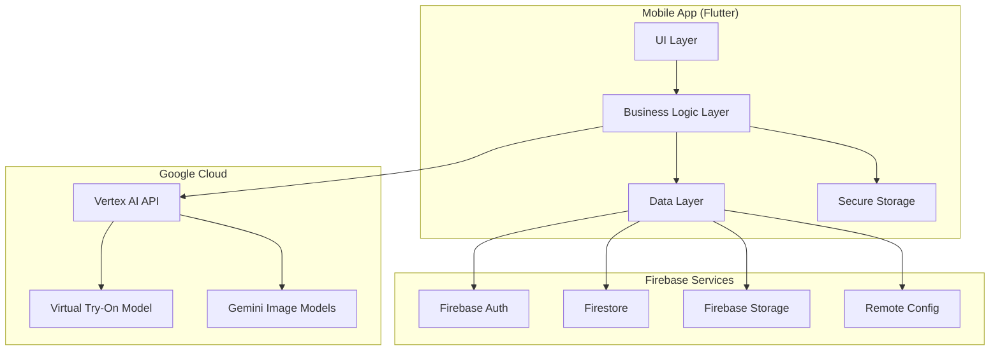
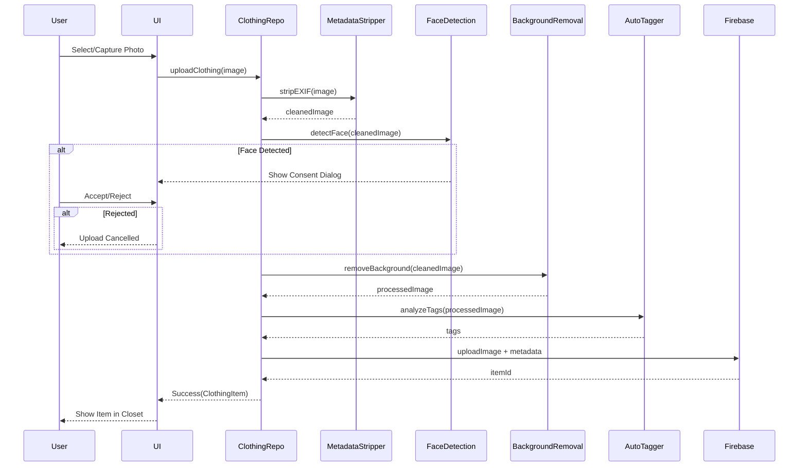
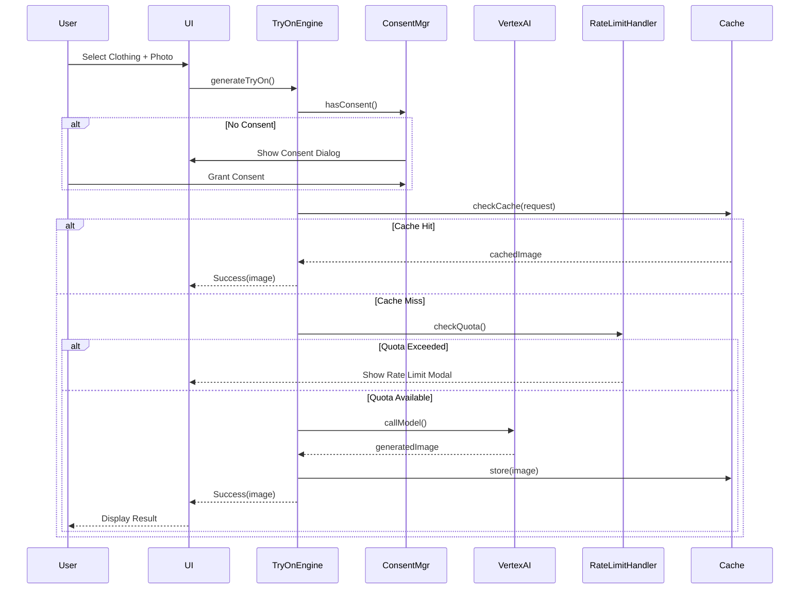
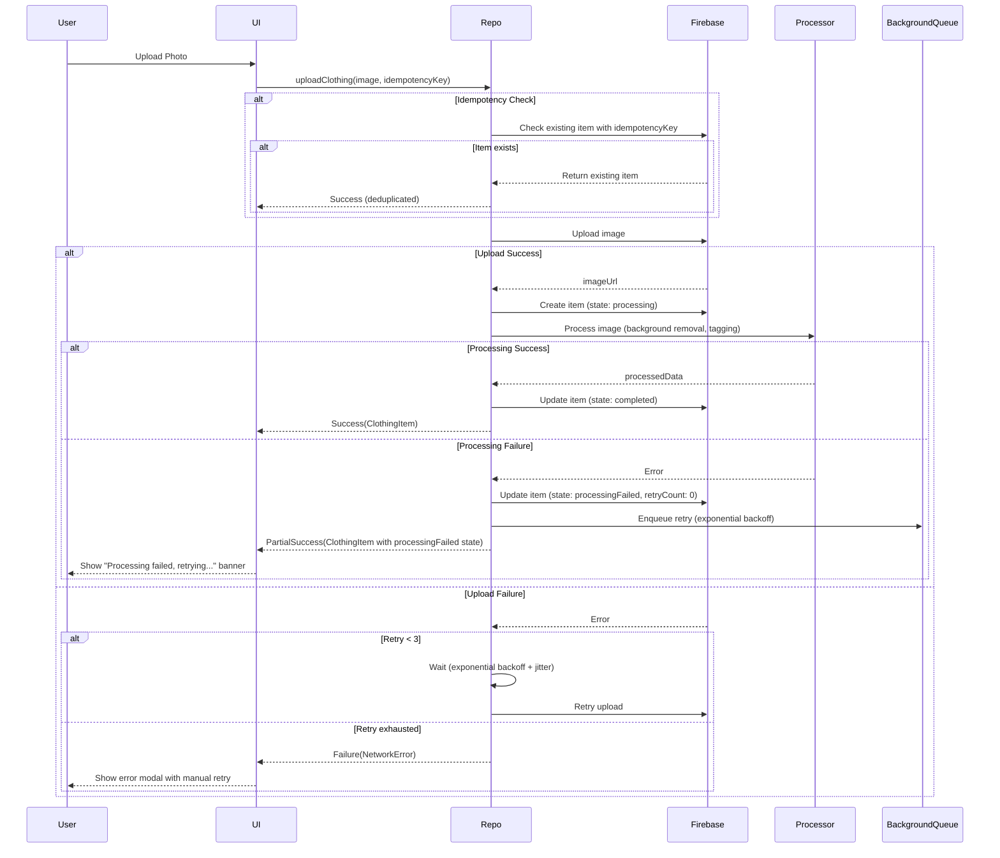

# Design Document: StyleSync

## Overview

StyleSync is a mobile-first digital wardrobe and outfit brainstorming application that leverages Google's Vertex AI models for virtual try-on and image generation. The app follows a Bring Your Own Key (BYOK) architecture where users provide their personal Gemini API keys, ensuring privacy through direct client-to-AI communication without backend proxying.

### Core Features
- Digital closet management with automatic background removal and tagging
- AI-powered virtual try-on using Vertex AI models
- Outfit brainstorming with mix-and-match canvas
- Secure local API key storage with optional encrypted cloud backup
- Proactive quota tracking and rate limit management

### Technology Stack
- **Platform**: Flutter (chosen for official Firebase AI Logic SDK support and excellent cross-platform capabilities)
- **Backend**: Firebase (Authentication, Firestore, Storage)
- **AI Models**: Vertex AI (`virtual-try-on-preview-08-04`, `gemini-2.5-flash-image`, `gemini-3-pro-image-preview`)
- **Secure Storage**: flutter_secure_storage with platform-native backends (iOS Keychain, Android Keystore)
- **State Management**: Riverpod (for reactive state management)
- **Image Processing**: image_picker, image_cropper, flutter_image_compress

## Architecture

### High-Level Architecture



### Layered Architecture

**Presentation Layer (UI)**
- Screens: Onboarding, API Key Setup, Digital Closet, Virtual Try-On, Outfit Canvas, Settings
- Widgets: Reusable components for clothing items, modals, loading states
- State: Riverpod providers for reactive UI updates

**Business Logic Layer**
- Services: BYOK Manager, Virtual Try-On Engine, Rate Limit Handler, Quota Tracker
- Use Cases: Upload Clothing, Generate Try-On, Create Outfit, Manage API Key
- Validators: API Key Validator, Image Validator, Consent Manager

**Data Layer**
- Repositories: Clothing Repository, User Repository, Settings Repository
- Data Sources: Firebase Remote, Firebase Local Cache, Secure Storage
- Models: Clothing Item, Outfit, User Profile, API Key Config

## Components and Interfaces

### 1. BYOK System

**Purpose**: Manage user API keys securely with optional encrypted cloud backup.

**Components**:
- `BYOKManager`: Orchestrates API key lifecycle
- `APIKeyValidator`: Validates format and functionality
- `SecureStorageService`: Handles platform-native secure storage
- `CloudBackupService`: Manages encrypted cloud backup

**Key Interfaces**:

```dart
abstract class BYOKManager {
  Future<Result<void>> storeAPIKey(String apiKey, String projectId);
  Future<Result<APIKeyConfig>> getAPIKey();
  Future<Result<void>> deleteAPIKey();
  Future<Result<void>> enableCloudBackup(String passphrase);
  Future<Result<void>> disableCloudBackup();
}

abstract class APIKeyValidator {
  Future<ValidationResult> validateFormat(String apiKey);
  Future<ValidationResult> validateFunctionality(String apiKey, String projectId);
}

abstract class SecureStorageService {
  Future<void> write(String key, String value);
  Future<String?> read(String key);
  Future<void> delete(String key);
  Future<bool> requiresBiometric();
}

abstract class CloudBackupService {
  Future<void> encryptAndBackup(String data, String passphrase);
  Future<String> restoreAndDecrypt(String passphrase);
  Future<void> deleteBackup();
}
```

**Key Derivation Flow**:
```
User Passphrase → Platform Detection → KDF Selection → Encryption Key

Platform Support Matrix:
┌──────────┬────────────┬─────────────────────────────────────┐
│ Platform │ Argon2id   │ Fallback to PBKDF2                  │
├──────────┼────────────┼─────────────────────────────────────┤
│ iOS      │ ✓ (14+)    │ < iOS 14                            │
│ Android  │ ✓ (8.0+)   │ < Android 8.0 (rare)                │
│ Web      │ ✗          │ Always (PBKDF2 only)                │
│ macOS    │ ✓ (11+)    │ < macOS 11                          │
│ Windows  │ ✓          │ Library unavailable                 │
│ Linux    │ ✓          │ Library unavailable                 │
└──────────┴────────────┴─────────────────────────────────────┘

Library: argon2_ffi_base ^1.0.0 (Dart FFI bindings)
Fallback: crypto ^3.0.0 (PBKDF2 implementation)

KDF Selection Strategy (deterministic):
1. Check platform: if Web → use PBKDF2
2. Try loading Argon2 library via FFI
3. If library loads successfully → use Argon2id
4. If library fails to load → use PBKDF2
5. Log selected KDF for monitoring

Argon2id(passphrase, salt, params) → Encryption Key
  ↓ (if Argon2id available)
  params: {time: 3, memory: 64MB, parallelism: 4}
  ↓ (fallback if Argon2id unavailable)
PBKDF2(passphrase, salt, iterations) → Encryption Key
  ↓ (PBKDF2 parameters)
  iterations: 600,000 (OWASP 2023 minimum)
```

**KDF Metadata Storage**:

All cloud backups MUST include KDF metadata to ensure cross-platform compatibility:

```json
{
  "kdf": {
    "algorithm": "argon2id" | "pbkdf2",
    "salt": "base64_encoded_salt",
    "params": {
      // For Argon2id:
      "time": 3,
      "memory": 67108864,  // 64MB in bytes
      "parallelism": 4,
      "version": 19
      // For PBKDF2:
      "iterations": 600000,
      "hash": "sha256"
    }
  },
  "encrypted_data": "base64_encoded_ciphertext",
  "nonce": "base64_encoded_nonce"
}
```

**Cross-Platform Consistency**:

- Same passphrase + salt + KDF params → Same encryption key
- KDF metadata stored with backup ensures correct derivation on restore
- Platform differences handled transparently by metadata
- User can restore backup on any platform (iOS → Android, etc.)

**Implementation Function**:

```dart
abstract class KeyDerivationService {
  /// Derive encryption key from passphrase using best available KDF
  Future<DerivedKey> deriveKey({
    required String passphrase,
    required Uint8List salt,
    KDFParams? params, // Optional: use defaults if null
  });
  
  /// Get current platform's KDF capability
  Future<KDFAlgorithm> getAvailableKDF();
}

enum KDFAlgorithm {
  argon2id,
  pbkdf2,
}

class DerivedKey {
  final Uint8List key;
  final KDFMetadata metadata;
}

class KDFMetadata {
  final KDFAlgorithm algorithm;
  final Uint8List salt;
  final Map<String, dynamic> params;
}
```

### 2. Digital Closet Management

**Purpose**: Upload, process, and organize clothing items with automatic tagging.

**Components**:
- `ClothingRepository`: CRUD operations for clothing items
- `BackgroundRemovalService`: Removes backgrounds from photos using on-device ML model (TensorFlow Lite with DeepLabV3+ or similar segmentation model) for privacy and offline capability; alternative implementations may use Vertex AI or third-party APIs (remove.bg) with appropriate quota/cost/privacy trade-offs
- `AutoTaggerService`: Analyzes and tags clothing attributes
- `FaceDetectionService`: Detects faces for privacy protection
- `MetadataStripperService`: Removes EXIF data

**Key Interfaces**:

```dart
abstract class ClothingRepository {
  Future<Result<ClothingItem>> uploadClothing(File image, {Map<String, dynamic>? metadata});
  Future<Result<List<ClothingItem>>> getClothingItems({String? category, String? season});
  Future<Result<void>> deleteClothing(String itemId);
  Future<StorageQuota> getStorageQuota();
}

abstract class BackgroundRemovalService {
  /// Removes background from clothing images.
  /// 
  /// Default implementation uses on-device TensorFlow Lite model (DeepLabV3+)
  /// for privacy and offline capability. Alternative implementations:
  /// - Vertex AI: Higher quality, requires API quota, online-only
  /// - remove.bg API: High quality, cost per image, online-only
  /// 
  /// Configuration via RemoteConfig or build-time flags.
  /// Timeout behavior: Cancel processing and return original image on timeout.
  Future<Result<File>> removeBackground(
    File image, 
    {Duration timeout = const Duration(seconds: 10)}
  );
}

abstract class AutoTaggerService {
  Future<ClothingTags> analyzeTags(File image);
}

class ClothingTags {
  final String category; // tops, bottoms, shoes, accessories
  final List<String> colors;
  final List<String> seasons; // spring, summer, fall, winter, all-season
  final Map<String, dynamic> additionalAttributes;
}

abstract class FaceDetectionService {
  /// Detects faces in uploaded images for privacy protection.
  /// 
  /// Implementation: ML Kit Face Detection (Google)
  /// - Library: google_mlkit_face_detection ^0.10.0
  /// - Model: On-device face detection model (bundled with ML Kit)
  /// - Platforms: Android (via Google Play Services), iOS (via Firebase ML)
  /// - Processing: 100% on-device, no data sent to servers
  /// - Latency: ~100-300ms for typical clothing photos
  /// - Inputs: File (JPEG/PNG), max 10MB
  /// - Outputs: boolean (face detected or not)
  /// - Fallback: If ML Kit unavailable, skip face detection (user consent required)
  /// 
  /// Privacy guarantees:
  /// - No biometric data extracted or stored
  /// - No face embeddings or recognition
  /// - Only binary detection (face present: yes/no)
  /// - Processing happens entirely on device
  /// - No network calls made
  Future<bool> detectFace(File image);
}
```

**Upload Flow**:


### 3. Virtual Try-On Engine

**Purpose**: Generate virtual try-on images using Vertex AI models with direct client-to-AI communication.

**Components**:
- `VirtualTryOnEngine`: Orchestrates try-on generation
- `VertexAIClient`: Handles API communication
- `CertificatePinningService`: Manages TLS certificate pinning
- `ImageCacheService`: Caches generated images
- `BiometricConsentManager`: Manages user consent for photo processing

**Key Interfaces**:

```dart
abstract class VirtualTryOnEngine {
  Future<Result<GeneratedImage>> generateTryOn({
    required File userPhoto,
    required ClothingItem clothingItem,
    required GenerationMode mode,
  });
  
  Future<Result<List<ClothingItem>>> suggestMissingPieces(List<ClothingItem> currentOutfit);
}

/// Generation mode with associated model configuration
class GenerationMode {
  final String name;
  final String primaryModelId;
  final List<String> fallbackModelIds;
  
  const GenerationMode._({
    required this.name,
    required this.primaryModelId,
    required this.fallbackModelIds,
  });
  
  /// High-quality image generation (up to 4096px)
  static const quality = GenerationMode._(
    name: 'quality',
    primaryModelId: 'gemini-3-pro-image-preview',
    fallbackModelIds: ['gemini-2.5-flash-image'],
  );
  
  /// Fast image generation (up to 1024px)
  static const speed = GenerationMode._(
    name: 'speed',
    primaryModelId: 'gemini-2.5-flash-image',
    fallbackModelIds: ['gemini-3-pro-image-preview'],
  );
  
  /// Dedicated virtual try-on model
  static const tryOn = GenerationMode._(
    name: 'tryOn',
    primaryModelId: 'virtual-try-on-preview-08-04',
    fallbackModelIds: ['gemini-3-pro-image-preview', 'gemini-2.5-flash-image'],
  );
  
  static const values = [quality, speed, tryOn];
}

/// Model availability validator and selector
abstract class ModelAvailabilityService {
  /// Check if a specific model is available for the given API key
  Future<bool> isModelAvailable(String modelId, String apiKey);
  
  /// Select the first available model from a generation mode's model list
  Future<Result<String>> selectAvailableModel(GenerationMode mode, String apiKey);
  
  /// Validate that at least one model from the mode is available
  Future<ValidationResult> validateModelAvailability(GenerationMode mode, String apiKey);
}

abstract class VertexAIClient {
  Future<Result<GeneratedImage>> callModel({
    required String modelId,
    required Map<String, dynamic> request,
    required String apiKey,
    required String projectId,
  });
}

abstract class CertificatePinningService {
  Future<void> updatePinSet(List<String> pins);
  Future<bool> validateCertificate(X509Certificate cert);
}

abstract class BiometricConsentManager {
  Future<bool> hasConsent();
  Future<void> requestConsent();
  Future<void> revokeConsent();
}
```

**Try-On Generation Flow**:


### 4. Rate Limit and Quota Management

**Purpose**: Track API usage proactively and handle quota exhaustion gracefully.

**Components**:
- `RateLimitHandler`: Detects and handles rate limit errors
- `QuotaTracker`: Tracks daily usage and estimates remaining quota
- `UsageHistoryService`: Logs quota events for user reference

**Key Interfaces**:

```dart
abstract class RateLimitHandler {
  Stream<QuotaEvent> get quotaEvents;
  Future<QuotaStatus> checkQuota(String apiKey);
  Future<void> handleRateLimitError(int statusCode, String message);
}

class QuotaStatus {
  final int usedToday;
  final int estimatedRemaining;
  final DateTime resetTime;
  final bool isExceeded;
  final double usagePercentage;
}

enum QuotaEvent {
  approaching80Percent,
  quotaExceeded,
  quotaReset,
}

abstract class QuotaTracker {
  Future<void> incrementUsage(String apiKey);
  Future<QuotaStatus> getStatus(String apiKey);
  Future<void> resetDaily();
}

abstract class UsageHistoryService {
  Future<void> logEvent(QuotaEvent event, DateTime timestamp);
  Future<List<UsageHistoryEntry>> getHistory();
}
```

**Quota Tracking Flow**:
```
API Call → Increment Counter → Check Threshold
                                    ↓
                              >= 80%? → Emit Warning Event → Show Banner with Reset Time
                                    ↓
                              >= 100%? → Emit Exceeded Event → Show Modal with Reset Time + Disable Features
                                    ↓
                              Midnight UTC → Reset Counter → Re-enable Features
```

**Reset Strategy**: Midnight UTC (chosen for consistency with Vertex AI quota reset)

**Rationale**:
- Vertex AI quotas reset at midnight UTC
- Using same timezone prevents confusion
- Simpler implementation (no timezone conversion)
- Consistent across all users globally

**UI Requirements**:

1. **Warning Banner** (80% threshold):
   - "You've used 80% of your daily quota"
   - "Next reset: <time> <timezone>" (e.g., "Next reset: 5:00 PM PST (2 hours)")
   - Countdown timer showing hours/minutes until reset
   - Link to upgrade billing

2. **Rate Limit Modal** (100% threshold):
   - "Daily Limit Reached"
   - "Your free tier quota has been exhausted"
   - "Next reset: <time> <timezone>" with countdown
   - Current usage statistics
   - Instructions to enable billing
   - Link to Google Cloud Console

3. **Timezone Display**:
   - Convert UTC reset time to user's local timezone
   - Show both local time and UTC for clarity
   - Example: "Next reset: 5:00 PM PST (01:00 UTC)"
   - Update countdown every minute

**Implementation**:

```dart
abstract class QuotaTracker {
  /// Get quota status with timezone-aware reset time
  Future<QuotaStatus> getStatus(String apiKey);
  
  /// Reset quota at midnight UTC
  Future<void> resetDaily();
}

class QuotaStatus {
  final int usedToday;
  final int estimatedRemaining;
  final DateTime resetTimeUTC;  // Always midnight UTC
  final bool isExceeded;
  final double usagePercentage;
  
  /// Get reset time in user's local timezone
  DateTime get resetTimeLocal => resetTimeUTC.toLocal();
  
  /// Get duration until reset
  Duration get timeUntilReset => resetTimeUTC.difference(DateTime.now().toUtc());
  
  /// Format reset time for display
  String formatResetTime() {
    final local = resetTimeLocal;
    final utc = resetTimeUTC;
    return '${_formatTime(local)} ${_getTimezone()} (${_formatTime(utc)} UTC)';
  }
}
```

**Backend Storage**:
- No user timezone storage needed (all calculations client-side)
- Reset time always stored as midnight UTC
- Client converts to local timezone for display

### 5. Outfit Brainstorming Canvas

**Purpose**: Mix and match clothing items to create outfit combinations.

**Components**:
- `OutfitCanvasController`: Manages canvas state and layering
- `OutfitRepository`: CRUD operations for saved outfits
- `AIOutfitSuggestionService`: Generates AI-powered suggestions

**Key Interfaces**:

```dart
abstract class OutfitCanvasController {
  void addItem(ClothingItem item, LayerType layer);
  void removeItem(String itemId);
  void reorderLayers(List<String> itemIds);
  Future<Result<Outfit>> saveOutfit(String name);
}

enum LayerType {
  base,      // underwear, base layers
  mid,       // shirts, pants
  outer,     // jackets, coats
  accessories, // shoes, bags, jewelry
}

abstract class OutfitRepository {
  Future<Result<Outfit>> saveOutfit(Outfit outfit);
  Future<Result<List<Outfit>>> getOutfits();
  Future<Result<void>> deleteOutfit(String outfitId);
}

abstract class AIOutfitSuggestionService {
  Future<Result<List<ClothingItem>>> suggestMissingPieces({
    required List<ClothingItem> currentItems,
    required String occasion,
  });
}
```

### 6. Onboarding and Tutorial System

**Purpose**: Guide first-time users through setup and API key configuration.

**Components**:
- `OnboardingController`: Manages onboarding flow state
- `TutorialService`: Provides step-by-step instructions
- `DeepLinkService`: Handles links to Google Cloud Console

**Key Interfaces**:

```dart
abstract class OnboardingController {
  Future<bool> isOnboardingComplete();
  Future<void> markOnboardingComplete();
  Future<void> resetOnboarding();
}

abstract class TutorialService {
  List<TutorialStep> getAPIKeyTutorialSteps();
  Future<void> openGoogleCloudConsole();
  Future<void> openVertexAISetup();
}

class TutorialStep {
  final String title;
  final String description;
  final String? imageUrl;
  final String? actionUrl;
}
```

## Data Models

### Core Models

```dart
class ClothingItem {
  final String id;
  final String userId;
  final String imageUrl;
  final String thumbnailUrl;
  final ClothingTags tags;
  final DateTime uploadedAt;
  final Map<String, dynamic> metadata;
}

class Outfit {
  final String id;
  final String userId;
  final String name;
  final List<String> clothingItemIds; // ordered by layer
  final String? thumbnailUrl;
  final DateTime createdAt;
  final DateTime updatedAt;
}

class APIKeyConfig {
  final String apiKey;
  final String projectId;
  final DateTime createdAt;
  final DateTime lastValidated;
  final bool cloudBackupEnabled;
}

class UserProfile {
  final String userId;
  final String email;
  final DateTime createdAt;
  final bool onboardingComplete;
  final bool faceDetectionConsentGranted;
  final bool biometricConsentGranted;
  final int age; // for COPPA compliance
  final bool parentalConsentGranted; // if age < 13
}

class StorageQuota {
  final int itemCount;
  final int maxItems; // 500
  final int bytesUsed;
  final int maxBytes; // 2GB
  final bool isExceeded;
}

class GeneratedImage {
  final String imageUrl;
  final String modelUsed;
  final DateTime generatedAt;
  final Map<String, dynamic> metadata;
}
```

### Firestore Schema

```
users/{userId}
  - email: string
  - createdAt: timestamp
  - onboardingComplete: boolean
  - faceDetectionConsentGranted: boolean
  - biometricConsentGranted: boolean
  - age: number
  - parentalConsentGranted: boolean
  
clothing_items/{itemId}
  - userId: string
  - imageUrl: string
  - thumbnailUrl: string
  - tags: map
    - category: string
    - colors: array<string>
    - seasons: array<string>
  - uploadedAt: timestamp
  - metadata: map
  
outfits/{outfitId}
  - userId: string
  - name: string
  - clothingItemIds: array<string>
  - thumbnailUrl: string
  - createdAt: timestamp
  - updatedAt: timestamp
  
quota_tracking/{userId}
  - quotaTrackingId: string (random UUID generated client-side for quota correlation, not linked to actual API key)
  - usageToday: number
  - resetTime: timestamp
  - history: array<map>
    - event: string
    - timestamp: timestamp
```

### Firebase Storage Structure

```
users/{userId}/
  clothing/
    {itemId}/
      original.jpg          # Original uploaded clothing photo (persistent)
      processed.jpg         # Background-removed clothing photo (persistent)
      thumbnail.jpg         # Thumbnail for list views (persistent)
  try-ons/
    {tryOnId}.jpg          # Generated try-on result images (persistent, user-controlled deletion)
                           # Note: Raw user input photos are NEVER stored here
                           # User photos are ephemeral and deleted from device memory immediately (Property 8)
  outfits/
    {outfitId}_thumbnail.jpg  # Outfit preview thumbnails (persistent)
```

**Storage Retention Policies**:

1. **Clothing Items** (`clothing/`):
   - Retention: Until user deletes item or account
   - Quota: 500 items or 2GB per user
   - Deletion: Immediate on user request

2. **Try-On Results** (`try-ons/`):
   - Retention: User-controlled deletion (no automatic TTL)
   - User photos: NEVER stored (ephemeral, deleted immediately after generation)
   - Generated results: Stored only if user explicitly saves
   - Quota: Counted toward user's 2GB storage quota
   - Deletion: Immediate on user request or account deletion

3. **Outfit Thumbnails** (`outfits/`):
   - Retention: Until user deletes outfit or account
   - Regenerated when outfit is edited
   - Deletion: Immediate on user request

**Client-Side Caching Interaction**:

- **Try-On Results**: Cached locally for 24 hours to reduce redundant API calls
- **Thumbnails**: Cached locally for 7 days, refreshed when user edits/deletes
- **Clothing Images**: Cached indefinitely, invalidated on user edit/delete
- Cache invalidation: Automatic on user-initiated changes
- Cache size limit: 100MB, LRU eviction policy

**Ephemeral Data Handling**:

- **User Input Photos**: Loaded into memory → processed → deleted immediately (never persisted)
- **Backend Processing**: If backend processing is used (e.g., Vertex AI), transient copies are short-lived and removed after processing completes
- **Device Memory**: User photos cleared from memory immediately after try-on generation (Property 8)
- **No Cloud Storage**: User photos never stored in Firebase Storage or any cloud backend by default (Property 8)

## Error Handling

### Error Categories

1. **Network Errors**: Connectivity issues, timeouts
2. **API Errors**: Invalid keys, quota exceeded, model errors
3. **Validation Errors**: Invalid input, format errors
4. **Storage Errors**: Quota exceeded, upload failures
5. **Security Errors**: Certificate pinning failures, biometric failures

### Error Handling Strategy

```dart
sealed class Result<T> {
  const Result();
}

class Success<T> extends Result<T> {
  final T data;
  const Success(this.data);
}

class Failure<T> extends Result<T> {
  final AppError error;
  const Failure(this.error);
}

sealed class AppError {
  final String message;
  final String? code;
  final dynamic originalError;
  
  const AppError(this.message, {this.code, this.originalError});
}

class NetworkError extends AppError {
  const NetworkError(super.message, {super.code, super.originalError});
}

class APIError extends AppError {
  final int? statusCode;
  const APIError(super.message, {this.statusCode, super.code, super.originalError});
}

class QuotaExceededError extends APIError {
  final DateTime resetTime;
  const QuotaExceededError(super.message, this.resetTime, {super.statusCode, super.code});
}

class ValidationError extends AppError {
  final Map<String, String> fieldErrors;
  const ValidationError(super.message, this.fieldErrors, {super.code});
}
```

### Error Recovery Strategies

**General Principles**:
- Idempotency for all state-changing operations
- Exponential backoff with randomized jitter
- Partial failure handling with automatic retry
- Clear user feedback and manual retry options

**Network Errors**: 
- Retry with exponential backoff + jitter (max 3 attempts)
- Base delay: 1s, multiplier: 2x, jitter: ±25%
- Retry delays: 1s, 2s, 4s (with jitter)
- After 3 failures: Show error with manual retry option

**API Errors**: 
- Display user-friendly message with action buttons
- Include error code and support contact
- Log error details for debugging

**Quota Exceeded**: 
- Show modal with upgrade instructions
- Display reset time and countdown
- Disable features until reset

**Storage Quota**: 
- Prompt user to delete items or upgrade
- Show current usage statistics
- Provide item management UI

**Certificate Pinning Failure**: 
- Block connection (no automatic fallback)
- Query Remote Config for emergency pins
- Show security warning with explicit opt-in
- Enter safe mode if user declines

**Upload Flow Idempotency and Partial Failure Handling**:

```dart
abstract class ClothingRepository {
  /// Upload clothing with idempotency token
  Future<Result<ClothingItem>> uploadClothing(
    File image, {
    Map<String, dynamic>? metadata,
    String? idempotencyKey, // Generated client-side if null
  });
  
  /// Retry failed processing for an item
  Future<Result<ClothingItem>> retryProcessing(String itemId);
  
  /// Mark item as processing failed
  Future<void> markProcessingFailed(String itemId, String reason);
}

enum ItemProcessingState {
  uploading,
  processing,
  completed,
  processingFailed,
}

class ClothingItem {
  final String id;
  final String idempotencyKey; // For deduplication
  final ItemProcessingState state;
  final String? failureReason;
  final int retryCount;
  // ... other fields
}
```

**Idempotency Token Generation**:
```dart
String generateIdempotencyKey() {
  // UUID v4 + timestamp for uniqueness
  return '${Uuid().v4()}_${DateTime.now().millisecondsSinceEpoch}';
}
```

**Upload Flow with Partial Failure Handling**:



**Automatic Background Retry**:

```dart
abstract class BackgroundRetryService {
  /// Enqueue item for automatic retry
  Future<void> enqueueRetry(String itemId, int retryCount);
  
  /// Process retry queue
  Future<void> processRetryQueue();
}

class RetryPolicy {
  static Duration getBackoffDelay(int retryCount) {
    // Exponential backoff: 5s, 10s, 20s
    final baseDelay = Duration(seconds: 5);
    final multiplier = math.pow(2, retryCount);
    final delay = baseDelay * multiplier;
    
    // Add randomized jitter (±25%)
    final jitter = delay * (0.75 + Random().nextDouble() * 0.5);
    return jitter;
  }
  
  static const maxRetries = 3;
}
```

**Retry Exhaustion UX**:

After 3 automatic retry attempts fail:

1. **Update item state**: `processingFailed` with `retryCount: 3`
2. **Show modal**:
   - Title: "Processing Failed"
   - Message: "We couldn't process your clothing item after multiple attempts."
   - Actions:
     - "Retry Manually" → Call `retryProcessing(itemId)`
     - "Contact Support" → Open support form with idempotencyKey
     - "Delete Item" → Remove failed item
3. **Support Request**: Include idempotencyKey for debugging

**Manual Retry Flow**:

```dart
Future<Result<ClothingItem>> retryProcessing(String itemId) async {
  // Reset retry count and state
  await markItemState(itemId, ItemProcessingState.processing, retryCount: 0);
  
  // Attempt processing again
  final result = await processItem(itemId);
  
  if (result.isSuccess) {
    await markItemState(itemId, ItemProcessingState.completed);
    return Success(result.data);
  } else {
    await markItemState(itemId, ItemProcessingState.processingFailed);
    return Failure(result.error);
  }
}
```

**Idempotency Validation**:

```dart
Future<ClothingItem?> checkExistingItem(String idempotencyKey) async {
  final query = await firestore
    .collection('clothing_items')
    .where('userId', isEqualTo: currentUserId)
    .where('idempotencyKey', isEqualTo: idempotencyKey)
    .limit(1)
    .get();
  
  if (query.docs.isNotEmpty) {
    return ClothingItem.fromFirestore(query.docs.first);
  }
  return null;
}
```

**Thundering Herd Prevention**:

- Randomized jitter in retry delays (±25%)
- Per-user retry queues (not global)
- Rate limiting on retry processing
- Exponential backoff prevents simultaneous retries

## Testing Strategy

### Unit Testing

**Focus Areas**:
- Business logic validation
- Data model serialization/deserialization
- Error handling paths
- Key derivation functions
- API key validation logic

**Example Unit Tests**:
- API key format validation (valid/invalid formats)
- Quota calculation logic (usage tracking, reset timing)
- Clothing tag extraction (category, color, season detection)
- Error result handling (success/failure paths)

### Property-Based Testing

Property-based tests will be implemented using the `test` package with custom generators and the `faker` package for random data generation. Each property test will run a minimum of 100 iterations with automatic shrinking on failure.

**Test Configuration**:
```dart
import 'package:test/test.dart';
import 'package:faker/faker.dart';

// Property test runner with shrinking support
class PropertyTest {
  final int iterations;
  final int? seed;
  
  const PropertyTest({this.iterations = 100, this.seed});
  
  void run<T>(
    String description,
    T Function() generator,
    bool Function(T) property,
  ) {
    test(description, () {
      final random = seed != null ? Random(seed!) : Random();
      final failures = <T>[];
      
      for (int i = 0; i < iterations; i++) {
        final input = generator();
        if (!property(input)) {
          failures.add(input);
        }
      }
      
      if (failures.isNotEmpty) {
        // Attempt shrinking: find minimal failing case
        final shrunk = shrink(failures.first, property);
        fail('Property failed for input: $shrunk');
      }
    });
  }
  
  T shrink<T>(T value, bool Function(T) property) {
    // Shrinking logic: try to find smaller failing case
    // Implementation depends on type T
    return value; // Simplified
  }
}

// Domain generators
class Generators {
  static final faker = Faker();
  
  static ClothingItem clothingItem() {
    return ClothingItem(
      id: faker.guid.guid(),
      userId: faker.guid.guid(),
      imageUrl: faker.internet.httpsUrl(),
      thumbnailUrl: faker.internet.httpsUrl(),
      tags: ClothingTags(
        category: faker.randomGenerator.element(['tops', 'bottoms', 'shoes', 'accessories']),
        colors: List.generate(
          faker.randomGenerator.integer(3, min: 1),
          (_) => faker.color.color(),
        ),
        seasons: List.generate(
          faker.randomGenerator.integer(2, min: 1),
          (_) => faker.randomGenerator.element(['spring', 'summer', 'fall', 'winter']),
        ),
        additionalAttributes: {},
      ),
      uploadedAt: faker.date.dateTime(),
      metadata: {},
    );
  }
  
  static APIKeyConfig apiKeyConfig() {
    return APIKeyConfig(
      apiKey: faker.randomGenerator.string(40),
      projectId: faker.randomGenerator.string(20),
      createdAt: faker.date.dateTime(),
      lastValidated: faker.date.dateTime(),
      cloudBackupEnabled: faker.randomGenerator.boolean(),
    );
  }
  
  static String apiKey({bool valid = true}) {
    if (valid) {
      return 'AIza${faker.randomGenerator.string(35)}';
    } else {
      return faker.randomGenerator.string(20);
    }
  }
  
  static File clothingImage() {
    // Generate test image file
    return File('test/fixtures/clothing_${faker.randomGenerator.integer(100)}.jpg');
  }
}

// Example property test
void main() {
  group('Property Tests', () {
    const propertyTest = PropertyTest(iterations: 100, seed: 42);
    
    propertyTest.run(
      'Property 1: Onboarding Persistence - Feature: style-sync',
      () => faker.randomGenerator.boolean(), // Generate random onboarding state
      (onboardingComplete) {
        // For any user who completes onboarding, subsequent launches should not show onboarding
        final user = UserProfile(
          userId: faker.guid.guid(),
          email: faker.internet.email(),
          createdAt: DateTime.now(),
          onboardingComplete: onboardingComplete,
          faceDetectionConsentGranted: false,
          biometricConsentGranted: false,
          age: 25,
          parentalConsentGranted: false,
        );
        
        // Property: If onboarding complete, should not show onboarding flow
        if (user.onboardingComplete) {
          return !shouldShowOnboarding(user);
        }
        return true; // Property holds
      },
    );
    
    propertyTest.run(
      'Property 2: API Key Validation Pipeline - Feature: style-sync',
      () => Generators.apiKey(valid: faker.randomGenerator.boolean()),
      (apiKey) {
        // For any API key input, validation pipeline should work correctly
        final formatValid = validateFormat(apiKey);
        final functionalValid = validateFunctionality(apiKey);
        
        // Property: Only store if both validations pass
        final shouldStore = formatValid && functionalValid;
        final actuallyStored = apiKeyStorage.contains(apiKey);
        
        return shouldStore == actuallyStored;
      },
    );
    
    propertyTest.run(
      'Property 3: Cloud Backup Encryption Round-Trip - Feature: style-sync',
      () => Generators.apiKeyConfig(),
      (apiKeyConfig) {
        // For any API key, encryption round-trip should preserve data
        final passphrase = faker.lorem.word();
        final encrypted = encryptBackup(apiKeyConfig, passphrase);
        final decrypted = decryptBackup(encrypted, passphrase);
        
        // Property: Round-trip preserves data
        return apiKeyConfig == decrypted;
      },
    );
    
    // Additional property tests following same pattern...
  });
}
```

**Generator Best Practices**:
- Use `faker` for realistic random data
- Implement shrinking for minimal failing cases
- Use configurable seed for reproducible runs
- Generate edge cases (empty strings, null values, boundary conditions)
- Reuse generators across tests

**Shrinking Strategy**:
- For strings: Try shorter strings
- For numbers: Try smaller numbers
- For lists: Try shorter lists
- For objects: Try simpler objects
- Goal: Find minimal failing case for debugging

### Integration Testing

**Focus Areas**:
- Firebase integration (Auth, Firestore, Storage)
- Vertex AI API calls (with test API key)
- Secure storage operations
- Image upload and processing pipeline
- End-to-end user flows

### Widget Testing

**Focus Areas**:
- UI component rendering
- User interactions (taps, swipes, form inputs)
- State management (Riverpod providers)
- Navigation flows
- Modal and dialog behavior

### Performance Testing

**Test Environment**:
- **Network Conditions**: WiFi 5GHz (primary), LTE (median), 3G (minimum)
- **Device Classes**:
  - High-end: iPhone 14 Pro, Samsung Galaxy S23
  - Mid-range: iPhone SE 3rd gen, Samsung Galaxy A54
  - Low-end: iPhone 11, Samsung Galaxy A33
- **Measurement Methodology**: Firebase Performance Monitoring + custom instrumentation
- **Sample Size**: Minimum 1000 measurements per metric per device class
- **Percentile Goals**: p50 (median), p95 (95th percentile), p99 (99th percentile)

**Metrics and Rationale**:

1. **Image Upload Time**:
   - **Target**: p50 < 3s, p95 < 5s, p99 < 8s (standard photos, 2-5MB)
   - **Rationale**: Based on user research showing 5s is acceptable wait time for uploads
   - **Assumptions**: WiFi or LTE connection, Firebase Storage CDN
   - **Timeout**: 30s (network timeout)
   - **Measurement**: Time from upload start to Firebase Storage confirmation

2. **Background Removal Time**:
   - **Target**: p50 < 3s, p95 < 5s, p99 < 8s (standard photos)
   - **Timeout**: 10s (hard timeout, return original image)
   - **Rationale**: 
     - On-device TensorFlow Lite processing time varies by device
     - 10s timeout prevents UI blocking on low-end devices
     - Industry benchmark: 3-5s for on-device ML inference
   - **Assumptions**: On-device processing, no network dependency
   - **Measurement**: Time from image input to processed output

3. **Digital Closet Load Time**:
   - **Target**: p50 < 300ms, p95 < 500ms, p99 < 1s (cached images)
   - **Rationale**: 
     - 300ms is perceptual threshold for "instant" response
     - Based on Google's RAIL performance model
   - **Assumptions**: Images cached locally, no network fetch
   - **Timeout**: 10s (fallback to placeholders)
   - **Measurement**: Time from screen load to first image rendered

4. **Try-On Generation Time**:
   - **Target**: Varies by model and network
     - Quality mode (gemini-3-pro-image-preview): p50 < 15s, p95 < 30s, p99 < 45s
     - Speed mode (gemini-2.5-flash-image): p50 < 8s, p95 < 15s, p99 < 25s
     - Try-on mode (virtual-try-on-preview-08-04): p50 < 10s, p95 < 20s, p99 < 35s
   - **Rationale**:
     - Cloud AI generation time depends on model complexity and server load
     - Targets based on Vertex AI SLA and observed latencies
     - Progress indicator shown to manage user expectations
   - **Assumptions**: WiFi or LTE connection, Vertex AI availability
   - **Timeout**: 60s (API timeout)
   - **Measurement**: Time from API request to response received

5. **App Startup Time**:
   - **Target**: p50 < 1.5s, p95 < 2s, p99 < 3s (cold start)
   - **Rationale**:
     - 2s is industry standard for mobile app cold start
     - Based on Firebase Performance benchmarks
   - **Assumptions**: Device not under memory pressure
   - **Measurement**: Time from app launch to first frame rendered

**Performance Monitoring**:
- Continuous monitoring via Firebase Performance
- Alerts for p95 regressions > 20%
- Weekly performance reports
- A/B testing for optimization experiments

## Security Architecture

### API Key Protection

**Storage**:
- iOS: Keychain with `kSecAttrAccessibleWhenUnlockedThisDeviceOnly`
- Android 9+: StrongBox Keymaster (with runtime detection and fallback)
- Android 8.0-8.1: Keystore with hardware backing

**Android Secure Storage Implementation**:

```dart
enum SecureStorageBackend {
  strongBox,      // Android 9+ with StrongBox hardware
  hardwareBacked, // Hardware-backed Keystore (TEE)
  software,       // Software-only (fallback, not recommended)
}

abstract class SecureStorageService {
  Future<void> write(String key, String value);
  Future<String?> read(String key);
  Future<void> delete(String key);
  Future<bool> requiresBiometric();
  
  /// Get the current secure storage backend in use
  Future<SecureStorageBackend> getStorageBackend();
}

// Android implementation pseudocode:
class AndroidSecureStorage implements SecureStorageService {
  SecureStorageBackend? _backend;
  
  Future<void> _initializeKeystore() async {
    try {
      // Attempt StrongBox-backed key generation (Android 9+)
      final keyGenSpec = KeyGenParameterSpec.Builder(
        keyAlias,
        KeyProperties.PURPOSE_ENCRYPT | KeyProperties.PURPOSE_DECRYPT
      )
        .setIsStrongBoxBacked(true)  // Request StrongBox
        .setUserAuthenticationRequired(true)
        .build();
      
      keyGenerator.init(keyGenSpec);
      keyGenerator.generateKey();
      
      _backend = SecureStorageBackend.strongBox;
      _logStorageBackend('StrongBox');
    } catch (e) {
      // StrongBox not available, fall back to hardware-backed
      try {
        final keyGenSpec = KeyGenParameterSpec.Builder(
          keyAlias,
          KeyProperties.PURPOSE_ENCRYPT | KeyProperties.PURPOSE_DECRYPT
        )
          // No setIsStrongBoxBacked() - use standard hardware backing
          .setUserAuthenticationRequired(true)
          .build();
        
        keyGenerator.init(keyGenSpec);
        keyGenerator.generateKey();
        
        _backend = SecureStorageBackend.hardwareBacked;
        _logStorageBackend('Hardware-backed Keystore');
      } catch (e) {
        // Hardware backing not available (should not happen on Android 8+)
        _backend = SecureStorageBackend.software;
        _logStorageBackend('Software-only (WARNING: reduced security)');
      }
    }
  }
  
  void _logStorageBackend(String backend) {
    // Log to Firebase Analytics for monitoring
    analytics.logEvent('secure_storage_backend', {'backend': backend});
  }
}
```

**Security Guarantees by Backend**:

1. **StrongBox (Android 9+)**:
   - Hardware-isolated secure element
   - Tamper-resistant
   - Side-channel attack resistant
   - Key material never leaves secure element
   - Strongest security guarantee

2. **Hardware-Backed Keystore (Android 8.0+, iOS)**:
   - Trusted Execution Environment (TEE)
   - Hardware-backed key storage
   - Key material protected from OS
   - Strong security guarantee

3. **Software-Only (Fallback)**:
   - Keys stored in encrypted storage
   - Protected by OS-level encryption
   - Weaker security (keys accessible to OS)
   - Should trigger user warning

**Monitoring**:
- Log storage backend selection on app startup
- Track backend distribution via Firebase Analytics
- Alert if software-only backend is used (indicates device security issue)

**Memory Protection**:
- API keys loaded only when needed
- Cleared from memory immediately after use
- No logging of API keys
- No transmission to backend servers (except encrypted cloud backup)

### Cloud Backup Encryption

**Key Derivation**:
```
User Passphrase
    ↓
Argon2id(passphrase, salt, time=3, memory=64MB, parallelism=4)
    ↓ (Recommended parameters based on OWASP 2023 guidance)
    ↓ (Tunable based on target hardware: increase memory for better security)
    ↓ (or PBKDF2 fallback)
PBKDF2-HMAC-SHA256(passphrase, salt, iterations=600000)
    ↓ (OWASP 2023 minimum: 600,000 iterations)
    ↓ (Configurable: increase for better security, decrease for older devices)
256-bit Encryption Key
    ↓
AES-256-GCM(API Key Data, encryption_key, nonce)
    ↓ (Nonce: 96-bit cryptographically-random, unique per encryption)
    ↓ (CRITICAL: Never reuse nonces with the same key)
    ↓ (Nonce generation: SecureRandom or platform crypto API)
    ↓ (Nonce storage: Prepended to ciphertext or stored alongside)
Encrypted Backup → Firebase Storage
```

**Nonce Requirements**:
- **Size**: 96 bits (12 bytes) for AES-GCM
- **Generation**: Cryptographically-random using platform secure random (e.g., `dart:math` `Random.secure()`)
- **Uniqueness**: MUST be unique for each encryption operation with the same key
- **Reuse**: NEVER reuse nonces with the same encryption key (catastrophic security failure)
- **Storage**: Prepend nonce to ciphertext (standard practice) or store in separate field
- **Format**: `[nonce (12 bytes)][ciphertext][auth_tag (16 bytes)]`

**Salt Management**:
- 32-byte random salt generated per user
- Generated using cryptographically secure RNG (OS-level CSPRNG)
- Never reused across users
- Stored alongside encrypted backup for retrieval

**Salt Generation**:
```dart
/// Generate cryptographically secure random salt
Uint8List generateSalt() {
  final random = Random.secure(); // Dart's CSPRNG
  final salt = Uint8List(32); // 256 bits
  for (int i = 0; i < 32; i++) {
    salt[i] = random.nextInt(256);
  }
  return salt;
}
```

**Salt Storage Location**:

Option 1 (Recommended): **Stored with encrypted backup blob**
- Location: Firebase Storage `users/{userId}/api_key_backup.json`
- Format: JSON with salt, KDF metadata, encrypted data
- Retrieval: Single fetch operation during restore
- Indexing: By user ID (Firebase Storage path)

```json
{
  "version": 1,
  "salt": "base64_encoded_salt",
  "kdf": {
    "algorithm": "argon2id",
    "params": {...}
  },
  "encrypted_data": "base64_encoded_ciphertext",
  "nonce": "base64_encoded_nonce",
  "created_at": "2025-01-15T00:00:00Z"
}
```

Option 2 (Alternative): **Stored in Firestore user metadata**
- Location: Firestore `users/{userId}/api_key_metadata`
- Separate from encrypted backup
- Requires two fetch operations (metadata + backup)
- More complex restore flow

**Chosen Approach**: Option 1 (stored with backup blob)
- Simpler restore flow (single fetch)
- Atomic backup/restore (all data in one place)
- Easier to manage (delete backup = delete salt)

**Restore Procedure**:

1. User enters passphrase
2. Fetch backup blob from Firebase Storage: `users/{userId}/api_key_backup.json`
3. Parse JSON to extract salt, KDF metadata, encrypted data, nonce
4. Derive encryption key using passphrase + salt + KDF metadata
5. Decrypt encrypted data using derived key + nonce
6. Store decrypted API key in Secure Storage
7. Delete backup blob if user opts to remove cloud backup

**Salt Retrieval Step** (explicit):
```dart
Future<Result<APIKeyConfig>> restoreFromCloudBackup(String passphrase) async {
  // Step 1: Fetch backup blob
  final backupBlob = await firebaseStorage
    .ref('users/${userId}/api_key_backup.json')
    .getData();
  
  // Step 2: Parse JSON and extract salt
  final backupData = jsonDecode(utf8.decode(backupBlob));
  final salt = base64Decode(backupData['salt']); // <-- Salt retrieval
  final kdfMetadata = backupData['kdf'];
  final encryptedData = base64Decode(backupData['encrypted_data']);
  final nonce = base64Decode(backupData['nonce']);
  
  // Step 3: Derive key using retrieved salt
  final derivedKey = await keyDerivationService.deriveKey(
    passphrase: passphrase,
    salt: salt, // <-- Salt consumed here
    params: kdfMetadata['params'],
  );
  
  // Step 4: Decrypt
  final decryptedData = await aesGcmDecrypt(
    ciphertext: encryptedData,
    key: derivedKey.key,
    nonce: nonce,
  );
  
  // Step 5: Store in Secure Storage
  await secureStorage.write('api_key', decryptedData);
  
  return Success(APIKeyConfig.fromJson(jsonDecode(decryptedData)));
}
```

### Certificate Pinning

**Pin Management**:
- Pin-set retrieved from Firebase Remote Config
- Multiple backup pins (3-5) for rotation tolerance
- IF all certificate pins fail validation:
  1. Block the connection immediately
  2. Query Firebase Remote Config for emergency pin updates
  3. If emergency pins available, retry with new pins
  4. If still failing, display prominent security warning to user
  5. Require explicit user confirmation to proceed with standard TLS (opt-in override)
  6. If user declines, enter "safe mode" with sensitive features disabled
- User notification on any pin validation failure

**Safe Mode Behavior**:
- Virtual try-on features disabled
- AI suggestions disabled
- Only local operations allowed (view closet, manage outfits)
- Prominent banner indicating security issue
- Option to retry or update app

**Pin Format**:
```json
{
  "pins": [
    "sha256/primary_pin_base64",
    "sha256/backup_pin_1_base64",
    "sha256/backup_pin_2_base64"
  ],
  "emergency_pins": [
    "sha256/emergency_pin_1_base64",
    "sha256/emergency_pin_2_base64"
  ],
  "updated_at": "2025-01-15T00:00:00Z",
  "min_app_version": "1.0.0"
}
```

### Data Privacy

**EXIF Stripping**:
- Remove GPS coordinates
- Remove timestamps
- Remove device identifiers
- Remove camera settings
- Preserve only image data

**Face Detection**:
- On-device processing only
- No biometric data sent to servers
- Explicit consent required
- Option to skip detection entirely

**COPPA Compliance**:
- Age verification on signup
- Verifiable parental consent for users < 13
- Parental access to child's data
- Parental revocation rights
- Clear data retention policies

**COPPA Implementation (Detailed Design Required)**:

This section requires a detailed follow-up design document covering:

1. **Age Verification Method**:
   - Option A: Self-reported with age gates (simple, privacy-friendly, but less reliable)
   - Option B: ID-based verification using third-party provider (e.g., Yoti, Jumio)
   - Trade-offs: Privacy vs. reliability vs. cost vs. UX friction

2. **Parental Consent Method Decision Matrix**:
   - **Government ID Verification**: High reliability, privacy concerns, requires third-party integration (e.g., Yoti, Jumio)
   - **Credit Card Token Check**: Moderate reliability, payment processor integration (e.g., Stripe), minimal PII storage
   - **Signed Consent Form**: Manual process, secure document storage (Firebase Storage with encryption), retention rules (7 years per FTC guidelines)
   - Recommended: Hybrid approach with user choice

3. **Parental Access Workflow**:
   - Parent authentication (email verification + security questions)
   - View child's data (clothing items, outfits, usage history)
   - Correct/update child's data
   - Export data (GDPR-compliant data portability)
   - Audit logging of all parental access events

4. **Parental Revocation Process**:
   - Revoke consent → immediate feature disablement
   - Data deletion request → follow account deletion flow (Requirements 7.9-7.13)
   - Confirmation email to parent
   - Audit trail of revocation

5. **Third-Party Integrations**:
   - Age verification provider (if ID-based)
   - Payment processor (if credit card method)
   - Document storage and retention
   - Compliance monitoring

6. **Data Retention Policies**:
   - Parental consent records: 7 years (FTC requirement)
   - Child's data: Until revocation or age 13
   - Audit logs: 7 years
   - Deletion confirmation records: 7 years

**Action Item**: Create detailed COPPA compliance design document before implementing user authentication and virtual try-on features.

**Current Property 21 Status**: Marked as "requires detailed design" - implementation deferred until COPPA design document is complete.

## Platform-Specific Considerations

### iOS

**Minimum Version**: iOS 14+

**Platform Features**:
- Keychain for secure storage
- Biometric authentication (Face ID, Touch ID)
- Photo library permissions
- Camera permissions
- Human Interface Guidelines compliance

**Dependencies**:
```yaml
flutter_secure_storage: ^9.0.0
local_auth: ^2.1.0
image_picker: ^1.0.0
```

### Android

**Minimum Version**: Android 8.0 (API 26)+

**Platform Features**:
- Keystore for secure storage
- StrongBox (Android 9+) or hardware-backed Keystore (Android 8.0-8.1)
- Biometric authentication
- Storage permissions
- Camera permissions
- Material Design compliance

**Dependencies**:
```yaml
flutter_secure_storage: ^9.0.0
local_auth: ^2.1.0
image_picker: ^1.0.0
```

### Cross-Platform Considerations

**State Management**: Riverpod for consistent state across platforms
**Navigation**: go_router for declarative routing
**Networking**: dio with platform-specific interceptors
**Image Processing**: flutter_image_compress for consistent compression

## Deployment and Operations

### CI/CD Pipeline

1. **Build**: Flutter build for iOS and Android
2. **Test**: Run unit, widget, and integration tests
3. **Code Quality**: Dart analyzer, flutter analyze
4. **Security Scan**: Dependency vulnerability check
5. **Deploy**: Firebase App Distribution (beta) → App Store / Play Store (production)

### Monitoring

**Metrics**:
- API call success/failure rates
- Quota usage patterns
- Image upload success rates
- Background removal success rates
- Try-on generation success rates
- App crash rates
- Performance metrics (load times, response times)

**Tools**:
- Firebase Crashlytics for crash reporting
- Firebase Performance Monitoring
- Firebase Analytics for user behavior
- Custom logging for quota events

### Certificate Pin Rotation

**Process**:
1. Monitor certificate expiry (90 days before expiration)
2. Obtain new certificate pins
3. Update Firebase Remote Config with new pins (include old pins as backup)
4. Deploy app update with new pins
5. Monitor app version distribution via Firebase Analytics
6. Wait for safe adoption threshold (e.g., 80% of active users on new version)
7. After 60-90 days AND safe threshold met, remove old pins from Remote Config

**Safe Threshold Criteria**:
- Minimum 80% of active users on app version with new pins
- Minimum 60 days since new pin deployment
- No increase in certificate pinning failures
- Monitored via Firebase Analytics custom events

**Version Distribution Monitoring**:
```dart
abstract class AppVersionMonitor {
  /// Get percentage of users on minimum app version
  Future<double> getUsersOnMinVersion(String minVersion);
  
  /// Check if safe to remove old pins
  Future<bool> isSafeToRemoveOldPins({
    required String minAppVersion,
    required double minUserPercentage,
    required Duration minTimeSinceDeployment,
  });
}
```

**Conditional Pin Removal**:
```dart
Future<void> removeOldPinsIfSafe() async {
  final deploymentDate = await getNewPinDeploymentDate();
  final daysSinceDeployment = DateTime.now().difference(deploymentDate).inDays;
  
  if (daysSinceDeployment < 60) {
    log('Too soon to remove old pins (${daysSinceDeployment} days)');
    return;
  }
  
  final usersOnNewVersion = await appVersionMonitor.getUsersOnMinVersion('1.1.0');
  
  if (usersOnNewVersion < 0.80) {
    log('Not enough users on new version (${usersOnNewVersion * 100}%)');
    return;
  }
  
  final pinningFailures = await getRecentPinningFailures();
  if (pinningFailures > threshold) {
    log('Too many pinning failures, delaying removal');
    return;
  }
  
  // Safe to remove old pins
  await remoteConfig.update({
    'certificate_pins': {
      'pins': newPinsOnly,
      'updated_at': DateTime.now().toIso8601String(),
    }
  });
  
  log('Old pins removed successfully');
}
```

**Emergency Rotation**:
1. Detect certificate pinning failures spike
2. Push emergency Remote Config update with new pins
   - Include new primary pins
   - Include extended backup pin list (5-7 pins)
   - Set `min_app_version` to enforce updates if needed
3. Monitor failure rate reduction
4. If failures persist, trigger forced app update via Remote Config
5. Avoid relying on TLS fallback (security risk)

**Emergency Remote Config**:
```json
{
  "certificate_pins": {
    "pins": [
      "sha256/new_primary_pin",
      "sha256/new_backup_1",
      "sha256/new_backup_2",
      "sha256/emergency_backup_1",
      "sha256/emergency_backup_2",
      "sha256/emergency_backup_3",
      "sha256/emergency_backup_4"
    ],
    "emergency_pins": [
      "sha256/emergency_pin_1",
      "sha256/emergency_pin_2"
    ],
    "updated_at": "2025-01-15T00:00:00Z",
    "min_app_version": "1.0.5",
    "force_update": false
  },
  "force_update_config": {
    "enabled": false,
    "min_version": "1.0.5",
    "message": "Critical security update required",
    "update_url_ios": "https://apps.apple.com/...",
    "update_url_android": "https://play.google.com/..."
  }
}
```

**Forced Update Flow**:
```dart
Future<void> checkForForcedUpdate() async {
  final config = await remoteConfig.fetch();
  final forceUpdateConfig = config['force_update_config'];
  
  if (forceUpdateConfig['enabled'] == true) {
    final currentVersion = await getAppVersion();
    final minVersion = forceUpdateConfig['min_version'];
    
    if (isVersionLessThan(currentVersion, minVersion)) {
      // Show blocking modal
      showForcedUpdateModal(
        message: forceUpdateConfig['message'],
        updateUrl: Platform.isIOS 
          ? forceUpdateConfig['update_url_ios']
          : forceUpdateConfig['update_url_android'],
      );
    }
  }
}
```

**Emergency Rotation Avoids TLS Fallback**:
- TLS fallback is security risk (downgrade attack)
- Instead: Push emergency pins via Remote Config
- If still failing: Force app update
- Safe mode: Disable sensitive features until update
- No automatic downgrade to standard TLS

## Future Enhancements

1. **Social Features**: Share outfits with friends, outfit voting
2. **Weather Integration**: Outfit suggestions based on weather
3. **Calendar Integration**: Plan outfits for upcoming events
4. **Shopping Integration**: Suggest items to purchase
5. **Style Analytics**: Track most-worn items, color preferences
6. **AR Try-On**: Real-time AR overlay for immediate feedback
7. **Multi-User Closets**: Shared closets for families/roommates
8. **Outfit History**: Track what you wore and when


## Correctness Properties

*A property is a characteristic or behavior that should hold true across all valid executions of a system—essentially, a formal statement about what the system should do. Properties serve as the bridge between human-readable specifications and machine-verifiable correctness guarantees.*

### Property 1: Onboarding Persistence
*For any* user who successfully completes the onboarding flow, subsequent app launches should not display the onboarding flow again, and the user's onboarding status should persist across app restarts.

**Validates: Requirements 1.7**

### Property 2: API Key Validation Pipeline
*For any* API key input, the system should first validate the format, then perform a functional verification test call, and only store the key if both validations pass; if either validation fails, the key should be rejected with a specific error message.

**Validates: Requirements 2.3, 2.4, 2.5, 2.6, 2.7**

### Property 3: Cloud Backup Encryption Round-Trip
*For any* API key that is backed up to the cloud with a user-provided passphrase, decrypting the backup with the same passphrase should produce the original API key data.

**Validates: Requirements 2.12, 2.13, 2.14, 2.16**

### Property 4: EXIF Metadata Stripping
*For any* uploaded clothing image, after EXIF stripping, the processed image should contain no GPS coordinates, timestamps, device identifiers, or camera settings—only the image pixel data should remain.

**Validates: Requirements 3.4**

### Property 5: Face Detection Consent Enforcement
*For any* image upload, if the user has not granted face detection consent, then face detection should not be performed; if consent is granted and a face is detected, an additional consent dialog should be shown before storage.

**Validates: Requirements 3.1, 3.2, 3.5, 3.6, 3.7**

### Property 6: Auto-Tagger Privacy Invariant
*For any* image analyzed by the Auto-Tagger, the analysis should only extract clothing attributes (category, colors, seasons) and should never process, extract, or log biometric or facial data.

**Validates: Requirements 3.10**

### Property 7: Storage Quota Enforcement
*For any* clothing upload attempt, if the user's current storage (item count or bytes) plus the new item would exceed the quota (500 items or 2GB), then the upload should be rejected with an error message showing current usage statistics.

**Validates: Requirements 3.13, 3.14, 3.15**

### Property 8: Photo Ephemeral Processing
*For any* virtual try-on operation, the user photo should be processed ephemerally: not persisted to disk (local storage) and cleared from RAM immediately after the try-on image is generated. The user photo should never be stored in Firebase Storage or any cloud backend by default.

**Clarifications**:
- **Device Memory**: Includes both volatile RAM and any local persistent storage (disk, cache, temp files)
- **Ephemeral Processing**: User photo loaded into RAM → processed → cleared from RAM immediately
- **No Disk Persistence**: User photo MUST NOT be written to local storage, temp files, or cache
- **Firebase Storage Reconciliation**: The `try-ons/` directory may ONLY contain generated try-on output images, NEVER the original raw user photo
- **Code Path Validation**: All code paths that handle user photos must be audited to ensure no persistence to disk or cloud

**Validates: Requirements 4.10, 4.11**

### Property 9: Certificate Pinning Failure Handling
*For any* Vertex AI API call, if all configured certificate pins fail validation, then the system SHALL:
1. Block the connection (no automatic fallback to standard TLS)
2. Query Remote Config for emergency pins
3. Show a security warning requiring explicit user opt-in
4. Enter safe mode if the user declines

**Validates: Requirements 4.11, 4.12**

### Property 10: Client-Side Caching Reduces Redundant Calls
*For any* identical try-on request (same user photo + clothing item + generation mode), if a cached result exists and is still valid, then the system should return the cached result without making a new API call.

**Caching Policy**:

1. **Cache Key Composition**:
   - User ID (prevent cross-user leaks)
   - Photo fingerprint (SHA256 of image bytes)
   - Clothing item ID + version/updated_at timestamp
   - Generation mode (quality/speed/tryOn)
   - Format: `{userId}:{photoSHA256}:{itemId}:{itemVersion}:{mode}`

2. **Cache Validity (TTL)**:
   - Default: 24 hours
   - Configurable per generation mode via Remote Config:
     - Quality mode: 48 hours (slower, more expensive)
     - Speed mode: 12 hours (faster, cheaper)
     - Try-on mode: 24 hours (balanced)

3. **Cache Invalidation**:
   - Clothing item updated: Invalidate all caches for that item ID
   - Clothing item deleted: Invalidate all caches for that item ID
   - User photo changed: New photo fingerprint → new cache key
   - TTL expired: Automatic eviction
   - Manual: User-initiated "clear cache" action

4. **Cache Size and Eviction**:
   - Max entries: 100 cached try-on results per user
   - Max size: 50MB per user
   - Eviction policy: LRU (Least Recently Used)
   - Eviction trigger: When max entries or max size exceeded

5. **Cache Storage**:
   - Location: Local device storage (not cloud)
   - Format: Encrypted with device-specific key
   - Persistence: Survives app restarts
   - Cleanup: Automatic on app uninstall

**Validates: Requirements 4.14**

### Property 11: Quota Threshold Warning
*For any* API key, when the daily usage reaches or exceeds 80% of the estimated quota, the Rate_Limit_Handler should emit a warning event and the UI should display an "approaching limit" banner.

**Validates: Requirements 5.5, 5.6**

### Property 12: Quota Reset Re-enables Features
*For any* API key that has exceeded its quota, when the quota reset time (midnight UTC) is reached, the Rate_Limit_Handler should automatically reset the usage counter and re-enable try-on features.

**Validates: Requirements 5.16**

### Property 13: Quota State Consistency
*For any* API call made, the usage counter should be incremented, the estimated remaining quota should be updated, and the event should be logged to usage history with a timestamp.

**Validates: Requirements 5.1, 5.2, 5.3, 5.17, 5.18, 5.19**

### Property 14: Rate Limit Error Handling
*For any* API response with a 429 status code or quota exhaustion error, the Rate_Limit_Handler should intercept the error, display the rate limit modal with current usage and reset time, and disable try-on features until quota resets.

**Validates: Requirements 5.7, 5.8, 5.9, 5.10, 5.15**

### Property 15: Outfit Layer Ordering Invariant
*For any* outfit canvas state, the layering order should always be maintained as: base layer → mid layer → outer layer → accessories, and reordering operations should preserve this constraint.

**Validates: Requirements 6.3**

### Property 16: Account Deletion Immediate Primary Data Removal
*For any* confirmed account deletion request, all primary data (Firebase Storage images, Firestore metadata, Firebase Authentication records, locally cached data, error logs, analytics data) should be deleted immediately, and only backup archives and disaster-recovery replicas should be retained for up to 30 days.

**Validates: Requirements 7.9, 7.10**

### Property 17: Backup Data Inaccessibility During Retention
*For any* backup archive or disaster-recovery replica retained after account deletion, the data should be inaccessible and not accessed, processed, or used for analytics during the 30-day retention period.

**Validates: Requirements 7.11**

### Property 18: Error Report Allow-List Enforcement
*For any* error report generated, only fields from the allow-list (app version, OS version, device model, error codes, sanitized stack traces, timestamp, anonymized crash IDs) should be collected, and no fields from the deny-list (user IDs, emails, API keys, tokens, image data, file paths with user identifiers, location, device serials) should be included.

**Validates: Requirements 8.8, 8.9, 8.10, 8.11**

### Property 19: Image Load Timeout with Fallback
*For any* image load operation in the Digital Closet, if cached images are not rendered within 500ms, a loading state should be displayed; if not loaded within 10 seconds, the system should fall back to low-resolution placeholder images and surface a retry control.

**Validates: Requirements 9.1, 9.2, 9.3**

### Property 20: Background Removal Timeout with Fallback
*For any* background removal operation, if processing exceeds 10 seconds, the operation should be cancelled, the original image should be returned as fallback, and the user should be notified with options to retry or continue with the original image.

**Validates: Requirements 9.6, 9.7**

### Property 21: COPPA Age Verification and Parental Consent
*For any* user identified as under 13 years old through age verification, the system should require COPPA-compliant verifiable parental consent (government ID, credit card, or signed form) before enabling virtual try-on features, and parents should have access to view, correct, and delete the child's data.

**Status**: Requires detailed COPPA design document; not yet testable. See "COPPA Implementation (Detailed Design Required)" section above for design considerations.

**Will Validate**: Requirements 4.19, 4.20, 4.21, 4.22, 4.23, 4.24 (once COPPA design is complete)

### Property 22: Biometric Consent Required for Try-On
*For any* first-time virtual try-on access, the system should display a biometric consent UI explaining data usage and require explicit user consent before processing any user photos.

**Validates: Requirements 4.1, 4.2**

### Property 23: Argon2id Key Derivation Consistency
*For any* cloud backup encryption operation, if Argon2id is available on the platform, it should be used for key derivation; otherwise, PBKDF2 should be used as fallback; for the same passphrase and salt, the derived encryption key should be consistent across multiple derivations.

**Validates: Requirements 2.12**

### Property 24: API Key Secure Storage Hardware Backing
*For any* API key storage operation, the system should use hardware-backed secure storage: Secure Enclave on iOS, StrongBox on Android 9+, or Android Keystore with hardware backing on Android 8.0-8.1.

**Validates: Requirements 4.4**

### Property 25: Clothing Item CRUD Consistency
*For any* clothing item, after uploading (create), the item should be retrievable (read), updatable (update), and deletable (delete), and after deletion, the item should no longer be retrievable and its storage should be freed.

**Validates: Requirements 3.16, 3.17, 3.18**
