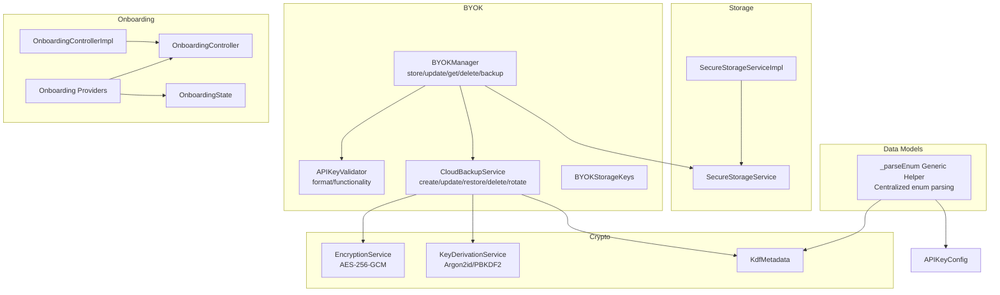
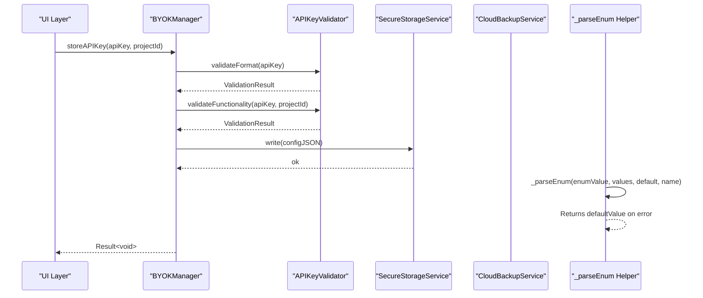
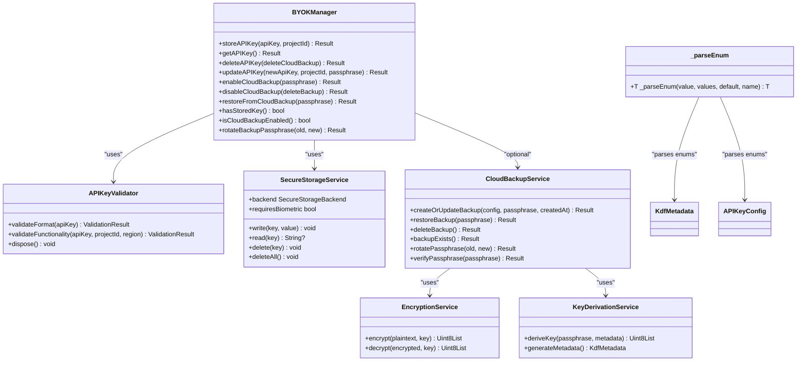
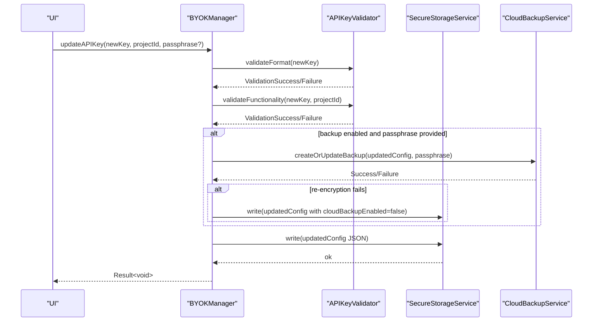
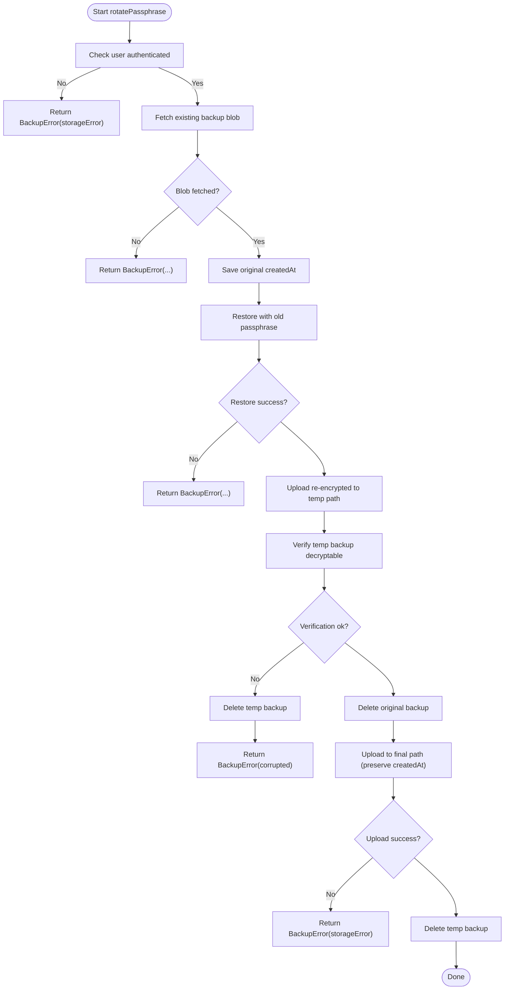
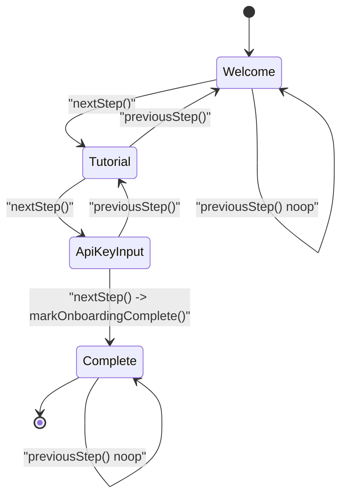
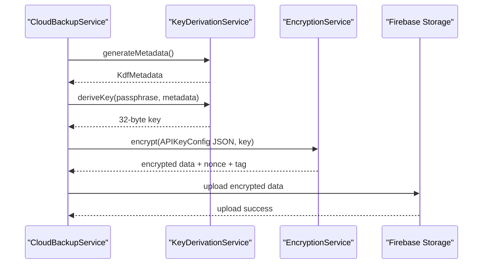
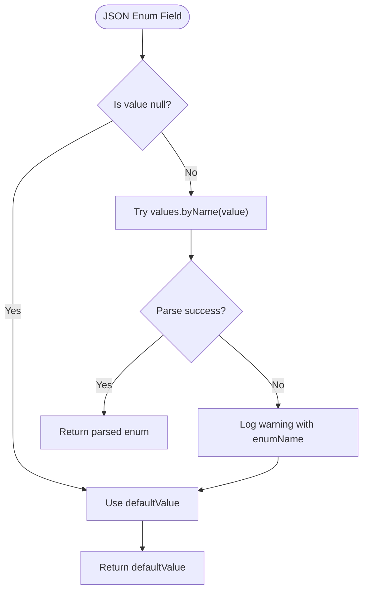
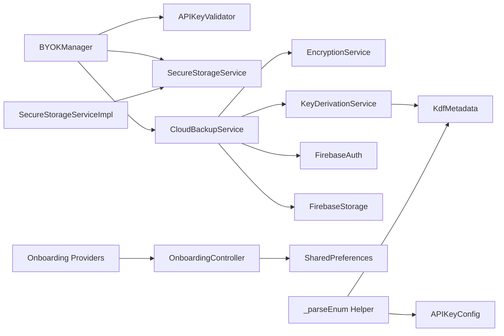

# API Reference

<cite>
**Referenced Files in This Document**
- [byok_manager.dart](file://lib/core/byok/byok_manager.dart)
- [api_key_validator.dart](file://lib/core/byok/api_key_validator.dart)
- [cloud_backup_service.dart](file://lib/core/byok/cloud_backup_service.dart)
- [byok_storage_keys.dart](file://lib/core/byok/byok_storage_keys.dart)
- [api_key_config.dart](file://lib/core/byok/models/api_key_config.dart)
- [validation_result.dart](file://lib/core/byok/models/validation_result.dart)
- [byok_error.dart](file://lib/core/byok/models/byok_error.dart)
- [cloud_backup_blob.dart](file://lib/core/byok/models/cloud_backup_blob.dart)
- [secure_storage_service.dart](file://lib/core/storage/secure_storage_service.dart)
- [secure_storage_service_impl.dart](file://lib/core/storage/secure_storage_service_impl.dart)
- [onboarding_controller.dart](file://lib/core/onboarding/onboarding_controller.dart)
- [onboarding_controller_impl.dart](file://lib/core/onboarding/onboarding_controller_impl.dart)
- [onboarding_state.dart](file://lib/core/onboarding/models/onboarding_state.dart)
- [onboarding_providers.dart](file://lib/core/onboarding/onboarding_providers.dart)
- [kdf_metadata.dart](file://lib/core/crypto/kdf_metadata.dart)
- [encryption_service.dart](file://lib/core/crypto/encryption_service.dart)
- [key_derivation_service.dart](file://lib/core/crypto/key_derivation_service.dart)
- [data-models.dart](file://docs/design/data-models.dart)
</cite>

## Update Summary
**Changes Made**
- Added comprehensive documentation for the new `_parseEnum` generic helper function
- Enhanced enum parsing documentation with centralized approach and error handling patterns
- Updated data models section to include the `_parseEnum` utility function
- Added error handling patterns for enum parsing operations
- Included usage examples and best practices for enum validation

## Table of Contents
1. [Introduction](#introduction)
2. [Project Structure](#project-structure)
3. [Core Components](#core-components)
4. [Architecture Overview](#architecture-overview)
5. [Detailed Component Analysis](#detailed-component-analysis)
6. [Dependency Analysis](#dependency-analysis)
7. [Performance Considerations](#performance-considerations)
8. [Troubleshooting Guide](#troubleshooting-guide)
9. [Conclusion](#conclusion)

## Introduction
This document provides a comprehensive API reference for StyleSync's public interfaces and core service APIs. It covers:
- BYOK Manager API for API key lifecycle operations
- Secure Storage Service interface for platform-abstraction and storage operations
- Onboarding Controller API with state management and reactive patterns
- Crypto Services including Encryption Service and Key Derivation Service
- Cloud Backup Service with client-side encryption and cloud storage operations
- Data models such as APIKeyConfig, ValidationResult, and KdfMetadata
- **New**: Centralized enum parsing utility with `_parseEnum` generic helper function
- Configuration options, callback interfaces, and event handling mechanisms
- Usage patterns, error handling strategies, and integration approaches

## Project Structure
The APIs are organized by feature domains:
- BYOK (Bring-Your-Own-Key): key lifecycle, validation, cloud backup, and storage keys
- Storage: platform abstraction for secure storage
- Onboarding: controller, state, and providers for onboarding flow
- Crypto: encryption and key derivation services for secure data protection
- Cloud Backup: client-side encryption and cloud storage operations
- **Data Models**: centralized enum parsing utilities and validation patterns



**Diagram sources**
- [byok_manager.dart](file://lib/core/byok/byok_manager.dart#L84-L147)
- [api_key_validator.dart](file://lib/core/byok/api_key_validator.dart#L14-L48)
- [cloud_backup_service.dart](file://lib/core/byok/cloud_backup_service.dart#L21-L91)
- [secure_storage_service.dart](file://lib/core/storage/secure_storage_service.dart#L10-L29)
- [onboarding_controller.dart](file://lib/core/onboarding/onboarding_controller.dart#L17-L46)
- [encryption_service.dart](file://lib/core/crypto/encryption_service.dart#L23-L32)
- [key_derivation_service.dart](file://lib/core/crypto/key_derivation_service.dart#L76-L83)
- [kdf_metadata.dart](file://lib/core/crypto/kdf_metadata.dart#L9-L22)
- [data-models.dart](file://docs/design/data-models.dart#L9-L25)

**Section sources**
- [byok_manager.dart](file://lib/core/byok/byok_manager.dart#L84-L147)
- [secure_storage_service.dart](file://lib/core/storage/secure_storage_service.dart#L10-L29)
- [onboarding_controller.dart](file://lib/core/onboarding/onboarding_controller.dart#L17-L46)
- [kdf_metadata.dart](file://lib/core/crypto/kdf_metadata.dart#L9-L22)
- [data-models.dart](file://docs/design/data-models.dart#L9-L25)

## Core Components
- BYOKManager: Orchestrates API key lifecycle, validation, secure storage, and optional cloud backup.
- SecureStorageService: Platform abstraction for secure storage with read/write/delete semantics.
- OnboardingController: Manages onboarding state persistence and reactive state transitions.
- CloudBackupService: Client-side encryption and cloud storage operations for API key backups.
- EncryptionService: Provides authenticated encryption using AES-256-GCM.
- KeyDerivationService: Derives encryption keys from user passphrases using memory-hard algorithms.
- **New**: _parseEnum Generic Helper: Centralized enum parsing utility with error handling and logging.
- Data models: APIKeyConfig, ValidationResult, BYOKError, CloudBackupBlob, KdfMetadata.

**Section sources**
- [byok_manager.dart](file://lib/core/byok/byok_manager.dart#L84-L147)
- [secure_storage_service.dart](file://lib/core/storage/secure_storage_service.dart#L10-L29)
- [onboarding_controller.dart](file://lib/core/onboarding/onboarding_controller.dart#L17-L46)
- [cloud_backup_service.dart](file://lib/core/byok/cloud_backup_service.dart#L21-L91)
- [encryption_service.dart](file://lib/core/crypto/encryption_service.dart#L23-L32)
- [key_derivation_service.dart](file://lib/core/crypto/key_derivation_service.dart#L76-L83)
- [data-models.dart](file://docs/design/data-models.dart#L9-L25)

## Architecture Overview
The BYOK subsystem integrates validation, secure storage, and optional cloud backup. The Onboarding subsystem provides reactive state management and persistence. Crypto services provide secure encryption and key derivation for sensitive data protection. **The centralized enum parsing utility ensures consistent error handling and graceful degradation across all data models.**



**Diagram sources**
- [byok_manager.dart](file://lib/core/byok/byok_manager.dart#L182-L231)
- [api_key_validator.dart](file://lib/core/byok/api_key_validator.dart#L111-L224)
- [secure_storage_service.dart](file://lib/core/storage/secure_storage_service.dart#L12-L19)
- [data-models.dart](file://docs/design/data-models.dart#L9-L25)

## Detailed Component Analysis

### BYOK Manager API
**Public interface**: BYOKManager
- **Methods**
  - `storeAPIKey(apiKey, projectId) → Future<Result<void>>`
  - `getAPIKey() → Future<Result<APIKeyConfig>>`
  - `deleteAPIKey(deleteCloudBackup: bool = false) → Future<Result<void>>`
  - `updateAPIKey(newApiKey, projectId, passphrase?) → Future<Result<void>>`
  - `enableCloudBackup(passphrase) → Future<Result<void>>`
  - `disableCloudBackup(deleteBackup: bool = true) → Future<Result<void>>`
  - `restoreFromCloudBackup(passphrase) → Future<Result<APIKeyConfig>>`
  - `hasStoredKey() → Future<bool>`
  - `isCloudBackupEnabled() → Future<bool>`
  - `rotateBackupPassphrase(oldPassphrase, newPassphrase) → Future<Result<void>>`

- **Return types**
  - `Result<T>`: sealed class with Success<T> and Failure<T>. Provides isSuccess/isFailure, valueOrNull, errorOrNull, and map/mapAsync helpers.

- **Error types (BYOKError)**
  - `ValidationError(message, validationResult)`
  - `NotFoundError()`
  - `StorageError(message, originalError?)`
  - `BackupError(message, type, originalError?)`
  - `CryptoError(message, originalError?)`

- **Error codes (BackupErrorType)**
  - `notFound`, `wrongPassphrase`, `corrupted`, `networkError`, `storageError`

- **Usage patterns**
  - Store: validate then persist; on success, optionally enable cloud backup
  - Retrieve: handle NotFoundError gracefully
  - Update: preserve metadata; optionally re-encrypt cloud backup
  - Cloud backup: createOrUpdate, restore, delete, rotate passphrase
  - Idempotency: generated per operation

- **Integration notes**
  - Depends on SecureStorageService for local persistence
  - Depends on APIKeyValidator for format and functionality checks
  - Depends on CloudBackupService for cloud operations (optional)

**Section sources**
- [byok_manager.dart](file://lib/core/byok/byok_manager.dart#L84-L147)
- [byok_manager.dart](file://lib/core/byok/byok_manager.dart#L153-L549)
- [byok_error.dart](file://lib/core/byok/models/byok_error.dart#L7-L94)
- [validation_result.dart](file://lib/core/byok/models/validation_result.dart#L5-L188)

### Secure Storage Service Interface
**Public interface**: SecureStorageService
- **Methods**
  - `write(key, value) → Future<void>`
  - `read(key) → Future<String?>`
  - `delete(key) → Future<void>`
  - `deleteAll() → Future<void>`
  - `backend → SecureStorageBackend (hardwareBacked, software)`
  - `requiresBiometric → bool`

**Implementation**: SecureStorageServiceImpl
- **Android**: AES-GCM via Android Keystore (hardware-backed)
- **iOS**: Keychain with accessibility (hardware-backed)
- **Other platforms**: software-backed fallback
- **Lazy initialization** with Completer to ensure thread safety

**Usage patterns**
- Write sensitive config as JSON string
- Read with null handling
- Delete keys and clear all for reset scenarios

**Section sources**
- [secure_storage_service.dart](file://lib/core/storage/secure_storage_service.dart#L10-L29)
- [secure_storage_service_impl.dart](file://lib/core/storage/secure_storage_service_impl.dart#L7-L104)

### Onboarding Controller API
**Public interface**: OnboardingController
- **Methods**
  - `isOnboardingComplete() → Future<bool>`
  - `markOnboardingComplete() → Future<void>`
  - `resetOnboarding() → Future<void>`

**Implementation**: OnboardingControllerImpl
- Persists completion state in SharedPreferences
- Thread-safe initialization via Completer
- Throws on persistence failure

**Reactive state management**
- `OnboardingState`: immutable snapshot with isComplete and currentStep
- `OnboardingStateNotifier`: StateNotifier<OnboardingState> with nextStep(), previousStep(), reset(), skipToStep()
- **Providers**:
  - `onboardingControllerProvider`
  - `isOnboardingCompleteProvider (FutureProvider)`
  - `onboardingStateProvider (StateNotifierProvider)`

**Usage patterns**
- During app startup, use isOnboardingCompleteProvider to decide initial route
- During flow, use onboardingStateProvider to drive UI and state transitions
- Persist completion on last step

**Section sources**
- [onboarding_controller.dart](file://lib/core/onboarding/onboarding_controller.dart#L17-L46)
- [onboarding_controller_impl.dart](file://lib/core/onboarding/onboarding_controller_impl.dart#L16-L78)
- [onboarding_state.dart](file://lib/core/onboarding/models/onboarding_state.dart#L23-L74)
- [onboarding_providers.dart](file://lib/core/onboarding/onboarding_providers.dart#L18-L175)

### Cloud Backup Service Interface
**Public interface**: CloudBackupService
- **Methods**
  - `createOrUpdateBackup(config, passphrase, createdAt?) → Future<Result<void>>`
  - `restoreBackup(passphrase) → Future<Result<APIKeyConfig>>`
  - `deleteBackup() → Future<Result<void>>`
  - `backupExists() → Future<Result<bool>>`
  - `rotatePassphrase(oldPassphrase, newPassphrase) → Future<Result<void>>`
  - `verifyPassphrase(passphrase) → Future<Result<bool>>`

**Implementation**: CloudBackupServiceImpl
- Uses Firebase Storage and Auth
- Client-side encryption with EncryptionService and KDF metadata
- Atomic rotation via temporary backup path with verification and cleanup
- Network error detection for SocketException, HttpException, and specific Firebase error codes

**Error handling**
- `BackupError` with typed reasons (notFound, wrongPassphrase, corrupted, networkError, storageError)
- Graceful handling of missing backups and network failures

**Section sources**
- [cloud_backup_service.dart](file://lib/core/byok/cloud_backup_service.dart#L21-L91)
- [cloud_backup_service.dart](file://lib/core/byok/cloud_backup_service.dart#L97-L858)

### Crypto Services

#### Encryption Service
**Interface**: EncryptionService
- `encrypt(plaintext, key) → Future<Uint8List>`
- `decrypt(encrypted, key) → Future<Uint8List>`

**Implementation**: AESGCMEncryptionService
- **Algorithm**: AES-256-GCM (Galois/Counter Mode)
- **Key Size**: 256 bits (32 bytes)
- **Nonce Size**: 96 bits (12 bytes) - randomly generated per encryption
- **Tag Size**: 128 bits (16 bytes) - authentication tag
- **Format**: `[nonce || ciphertext || tag]` - all concatenated

**Security properties**
- IND-CCA2 Secure: Indistinguishable under chosen-ciphertext attack
- Nonce Reuse Protection: Random nonces eliminate reuse with same key
- Integrity Protection: Authentication tag prevents modification
- Fast Performance: Hardware acceleration available on modern platforms

#### Key Derivation Service
**Interface**: KeyDerivationService
- `deriveKey(passphrase, metadata) → Future<Uint8List>`
- `generateMetadata() → Future<KdfMetadata>`

**Implementation**: KeyDerivationServiceImpl
- **Algorithm Selection**:
  - Android: Argon2id (native support, optimal security)
  - iOS: Argon2id (native support, optimal security)
  - macOS: Argon2id (native support, optimal security)
  - Web: PBKDF2 (Argon2id not available in browsers)
  - Linux: PBKDF2 (Argon2id support limited)
  - Windows: PBKDF2 (fallback for compatibility)

**Argon2id Configuration**
- Recommended for mobile platforms (Android, iOS, macOS)
- Parameters: 3 iterations, 64MB memory, 4 parallelism

**PBKDF2 Configuration**
- Recommended for web and fallback platforms
- Parameters: 600,000 iterations, SHA-512

**KDF Metadata**
- Stores key derivation parameters and salt for consistent key regeneration
- Supports both Argon2id and PBKDF2 algorithms
- Includes versioning for forward compatibility

**Section sources**
- [encryption_service.dart](file://lib/core/crypto/encryption_service.dart#L23-L32)
- [key_derivation_service.dart](file://lib/core/crypto/key_derivation_service.dart#L76-L83)
- [kdf_metadata.dart](file://lib/core/crypto/kdf_metadata.dart#L9-L77)

### Data Models

#### APIKeyConfig
**Fields**
- `apiKey: String`
- `projectId: String`
- `createdAt: DateTime`
- `lastValidated: DateTime`
- `cloudBackupEnabled: bool`
- `idempotencyKey: String`

**Behavior**
- `toJson/fromJson` for serialization
- `copyWith` for immutable updates
- Equality and hashCode

**Validation rules**
- apiKey must be non-empty and match expected format
- projectId must conform to Google Cloud project ID rules
- createdAt/lastValidated are ISO timestamps
- idempotencyKey is a unique string per operation

**Section sources**
- [api_key_config.dart](file://lib/core/byok/models/api_key_config.dart#L5-L109)

#### ValidationResult
**Sealed hierarchy**
- `ValidationSuccess(metadata?)`: optional metadata (e.g., available models)
- `ValidationFailure(type, message, errorCode?, originalError?)`

**ValidationFailureType**
- `invalidFormat`, `malformedKey`, `unauthorized`, `invalidProject`
- `apiNotEnabled`, `networkError`, `rateLimited`, `unknown`

**Section sources**
- [validation_result.dart](file://lib/core/byok/models/validation_result.dart#L5-L188)

#### BYOKError
**Sealed hierarchy**
- `ValidationError(message, validationResult)`
- `NotFoundError()`
- `StorageError(message, originalError?)`
- `BackupError(message, type, originalError?)`
- `CryptoError(message, originalError?)`

**Section sources**
- [byok_error.dart](file://lib/core/byok/models/byok_error.dart#L7-L94)

#### CloudBackupBlob
**Fields**
- `version: int`
- `kdfMetadata: KdfMetadata`
- `encryptedData: String` (base64)
- `createdAt: DateTime`
- `updatedAt: DateTime`

**Behavior**
- `toJson/fromJson` with strict validation
- `copyWith`
- Equality and hashCode

**Validation rules**
- version must be >= 1 and <= currentVersion
- kdf must be valid KdfMetadata
- encrypted_data must be non-empty string
- timestamps must be valid ISO strings

**Section sources**
- [cloud_backup_blob.dart](file://lib/core/byok/models/cloud_backup_blob.dart#L8-L156)

#### KdfMetadata
**Fields**
- `algorithm: KdfAlgorithm (argon2id, pbkdf2)`
- `salt: Uint8List`
- `iterations: int`
- `memory: int (default 0)`
- `parallelism: int (default 0)`

**Behavior**
- `toJson/fromJson` with validation
- base64 encoding for salt
- integer validation with non-negative constraint

**Section sources**
- [kdf_metadata.dart](file://lib/core/crypto/kdf_metadata.dart#L9-L77)

#### _parseEnum Generic Helper Function
**Purpose**
The `_parseEnum` function provides a centralized, generic approach to enum parsing with consistent error handling and logging.

**Function Signature**
```dart
T _parseEnum<T extends Enum>(
  String value,
  List<T> values,
  T defaultValue,
  String enumName,
)
```

**Parameters**
- `value`: The string value to parse
- `values`: The enum values list (e.g., `MyEnum.values`)
- `defaultValue`: The fallback value if parsing fails
- `enumName`: Human-readable name for logging context

**Return Value**
- Returns the parsed enum value if successful
- Returns `defaultValue` if parsing fails, with warning logged

**Error Handling Pattern**
- Uses `values.byName(value)` internally
- Catches exceptions and logs warnings via the DataModels logger
- Returns safe default value to prevent application crashes

**Usage Examples**
```dart
// Basic usage
final category = _parseEnum(
  json['category'] as String,
  ClothingCategory.values,
  ClothingCategory.unknown,
  'ClothingCategory',
);

// In loops for lists
final seasons = (json['seasons'] as List)
    .map((s) => _parseEnum(
          s as String,
          Season.values,
          Season.unknown,
          'Season',
        ))
    .toList();
```

**Benefits**
- **Centralized**: Single implementation for all enum parsing
- **Safe**: Graceful fallback prevents crashes on invalid values
- **Logging**: Warning logs help with debugging unknown enum values
- **Consistent**: Uniform error handling across all data models
- **Type Safety**: Maintains compile-time type checking

**Section sources**
- [data-models.dart](file://docs/design/data-models.dart#L9-L25)

### Configuration Options, Callbacks, and Events
**BYOKManager**
- Dependencies injected via Riverpod providers
- Optional CloudBackupService enables cloud backup features
- Idempotency keys generated per operation

**SecureStorageService**
- Backend selection: hardwareBacked vs software
- requiresBiometric currently returns false (placeholder)

**Onboarding Providers**
- `onboardingControllerProvider`: singleton controller
- `isOnboardingCompleteProvider`: FutureProvider for initial routing
- `onboardingStateProvider`: StateNotifierProvider for reactive UI

**CloudBackupService**
- Uses Firebase Storage/Auth and Encryption/KDF services
- Rotation preserves createdAt timestamp and cleans up temp backup

**Crypto Services**
- Automatic algorithm selection based on platform
- Hardware acceleration support for AES-GCM
- Platform-specific KDF parameter tuning

**Data Model Parsing**
- **Centralized enum parsing**: All enum values use `_parseEnum` for consistent handling
- **Graceful degradation**: Unknown enum values fall back to safe defaults
- **Logging**: Warning logs help identify unexpected enum values during development

**Section sources**
- [byok_manager.dart](file://lib/core/byok/byok_manager.dart#L555-L582)
- [secure_storage_service_impl.dart](file://lib/core/storage/secure_storage_service_impl.dart#L33-L73)
- [onboarding_providers.dart](file://lib/core/onboarding/onboarding_providers.dart#L18-L175)
- [cloud_backup_service.dart](file://lib/core/byok/cloud_backup_service.dart#L97-L899)
- [data-models.dart](file://docs/design/data-models.dart#L9-L25)

## Architecture Overview



**Diagram sources**
- [byok_manager.dart](file://lib/core/byok/byok_manager.dart#L84-L147)
- [api_key_validator.dart](file://lib/core/byok/api_key_validator.dart#L14-L48)
- [secure_storage_service.dart](file://lib/core/storage/secure_storage_service.dart#L10-L29)
- [cloud_backup_service.dart](file://lib/core/byok/cloud_backup_service.dart#L21-L91)
- [encryption_service.dart](file://lib/core/crypto/encryption_service.dart#L23-L32)
- [key_derivation_service.dart](file://lib/core/crypto/key_derivation_service.dart#L76-L83)
- [data-models.dart](file://docs/design/data-models.dart#L9-L25)

## Detailed Component Analysis

### BYOK Manager Lifecycle Operations



**Diagram sources**
- [byok_manager.dart](file://lib/core/byok/byok_manager.dart#L297-L384)
- [api_key_validator.dart](file://lib/core/byok/api_key_validator.dart#L111-L224)
- [cloud_backup_service.dart](file://lib/core/byok/cloud_backup_service.dart#L166-L249)

**Section sources**
- [byok_manager.dart](file://lib/core/byok/byok_manager.dart#L297-L384)

### Cloud Backup Rotation Flow



**Diagram sources**
- [cloud_backup_service.dart](file://lib/core/byok/cloud_backup_service.dart#L413-L555)

**Section sources**
- [cloud_backup_service.dart](file://lib/core/byok/cloud_backup_service.dart#L413-L555)

### Onboarding State Machine



**Diagram sources**
- [onboarding_state.dart](file://lib/core/onboarding/models/onboarding_state.dart#L5-L17)
- [onboarding_providers.dart](file://lib/core/onboarding/onboarding_providers.dart#L77-L122)

**Section sources**
- [onboarding_state.dart](file://lib/core/onboarding/models/onboarding_state.dart#L23-L74)
- [onboarding_providers.dart](file://lib/core/onboarding/onboarding_providers.dart#L59-L137)

### Crypto Service Integration



**Diagram sources**
- [cloud_backup_service.dart](file://lib/core/byok/cloud_backup_service.dart#L97-L119)
- [key_derivation_service.dart](file://lib/core/crypto/key_derivation_service.dart#L76-L83)
- [encryption_service.dart](file://lib/core/crypto/encryption_service.dart#L23-L32)

**Section sources**
- [cloud_backup_service.dart](file://lib/core/byok/cloud_backup_service.dart#L97-L119)
- [key_derivation_service.dart](file://lib/core/crypto/key_derivation_service.dart#L76-L83)
- [encryption_service.dart](file://lib/core/crypto/encryption_service.dart#L23-L32)

### Centralized Enum Parsing Pattern



**Diagram sources**
- [data-models.dart](file://docs/design/data-models.dart#L9-L25)

**Section sources**
- [data-models.dart](file://docs/design/data-models.dart#L9-L25)

## Dependency Analysis



**Diagram sources**
- [byok_manager.dart](file://lib/core/byok/byok_manager.dart#L153-L180)
- [cloud_backup_service.dart](file://lib/core/byok/cloud_backup_service.dart#L97-L119)
- [onboarding_providers.dart](file://lib/core/onboarding/onboarding_providers.dart#L18-L20)
- [secure_storage_service_impl.dart](file://lib/core/storage/secure_storage_service_impl.dart#L7-L14)
- [kdf_metadata.dart](file://lib/core/crypto/kdf_metadata.dart#L9-L22)
- [data-models.dart](file://docs/design/data-models.dart#L9-L25)

**Section sources**
- [byok_manager.dart](file://lib/core/byok/byok_manager.dart#L153-L180)
- [cloud_backup_service.dart](file://lib/core/byok/cloud_backup_service.dart#L97-L119)
- [onboarding_providers.dart](file://lib/core/onboarding/onboarding_providers.dart#L18-L20)
- [secure_storage_service_impl.dart](file://lib/core/storage/secure_storage_service_impl.dart#L7-L14)
- [data-models.dart](file://docs/design/data-models.dart#L9-L25)

## Performance Considerations
- **BYOK operations**
  - Prefer batch operations where possible; storeJSON is lightweight
  - Avoid unnecessary cloud backup updates; only re-encrypt when passphrase changes
- **Cloud backup**
  - Rotation uses temporary path to minimize downtime; ensure sufficient retries for network failures
  - KDF parameters impact CPU/memory; choose conservative defaults for mobile devices
- **Secure storage**
  - Initialization is lazy and guarded; avoid frequent re-initialization
  - Use deleteAll only for reset scenarios
- **Onboarding**
  - Use FutureProvider for initial routing to avoid redundant reads
  - Use StateNotifierProvider for reactive UI updates
- **Crypto services**
  - Heavy crypto operations run on isolates to avoid blocking UI
  - Hardware acceleration available for AES-GCM on supported platforms
  - Platform-specific KDF parameters optimized for mobile performance
- **Enum parsing**
  - Centralized parsing reduces code duplication and improves maintainability
  - Logging overhead minimal; only occurs on parsing failures
  - Safe fallback prevents expensive error recovery processes

## Troubleshooting Guide
**BYOKManager**
- `NotFoundError` when retrieving or deleting non-existent keys
- `ValidationError` with ValidationFailure details for invalid keys
- `StorageError` for secure storage failures; check backend and device capabilities
- `BackupError` for cloud operations; inspect BackupErrorType for resolution

**CloudBackupService**
- `wrongPassphrase`: verify passphrase against stored KDF metadata
- `notFound`: confirm backup exists and user is authenticated
- `corrupted`: re-create backup or restore from another source
- `networkError`: retry with exponential backoff; check connectivity

**SecureStorageService**
- hardwareBacked fallback: logs indicate software fallback on init failure
- requiresBiometric: placeholder; configure as needed in future tasks

**OnboardingController**
- Persistence failures: markOnboardingComplete throws on failure; handle and log appropriately
- State desynchronization: use OnboardingStateNotifier for reactive updates

**Crypto Services**
- Algorithm compatibility: ensure platform supports selected algorithm
- KDF performance: monitor derivation time on target devices
- Key derivation failures: verify passphrase and KDF metadata consistency

**Data Model Parsing**
- **Unknown enum values**: Check logs for `_parseEnum` warnings indicating unexpected enum values
- **Graceful fallback**: Unknown enum values automatically fall back to safe defaults
- **Development vs Production**: Use logging to identify enum parsing issues during development
- **Backward compatibility**: Centralized parsing helps maintain compatibility with evolving enum values

**Section sources**
- [byok_error.dart](file://lib/core/byok/models/byok_error.dart#L67-L83)
- [cloud_backup_service.dart](file://lib/core/byok/cloud_backup_service.dart#L222-L248)
- [secure_storage_service_impl.dart](file://lib/core/storage/secure_storage_service_impl.dart#L63-L72)
- [onboarding_controller_impl.dart](file://lib/core/onboarding/onboarding_controller_impl.dart#L64-L70)
- [data-models.dart](file://docs/design/data-models.dart#L9-L25)

## Conclusion
This API reference documents StyleSync's core service interfaces and data models. The BYOK Manager provides robust API key lifecycle management with validation and optional cloud backup. The Secure Storage Service abstracts platform-specific secure storage. The Onboarding Controller offers reactive state management for user onboarding. The Crypto Services provide industry-standard encryption and key derivation for secure data protection. The Cloud Backup Service combines client-side encryption with cloud storage for reliable API key backup and recovery. **The new centralized `_parseEnum` generic helper function enhances data model reliability by providing consistent error handling, logging, and graceful fallback for enum parsing operations across all data models.** Adhering to the documented patterns and error handling strategies ensures reliable integration and maintainable code.