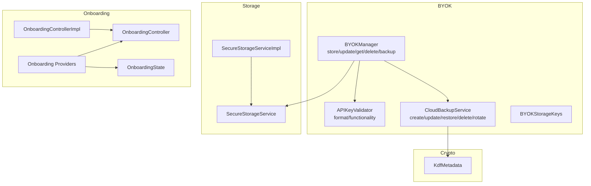
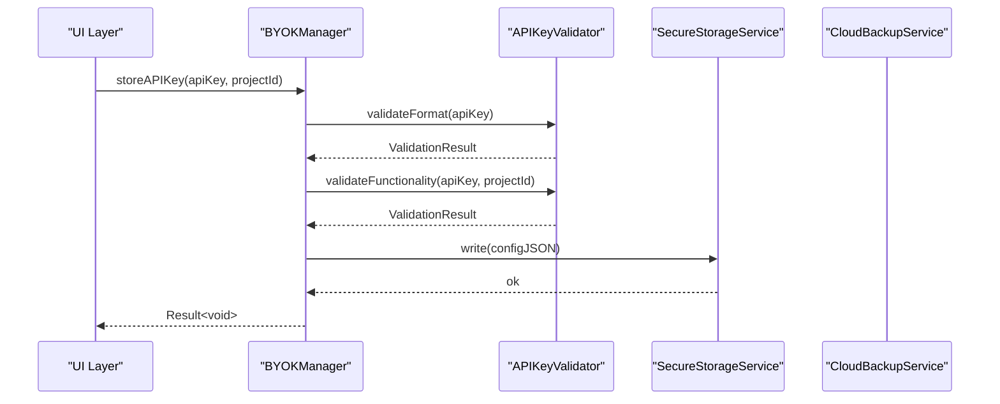
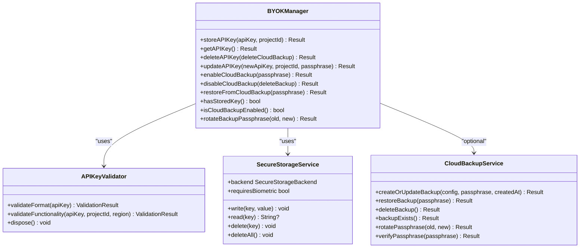
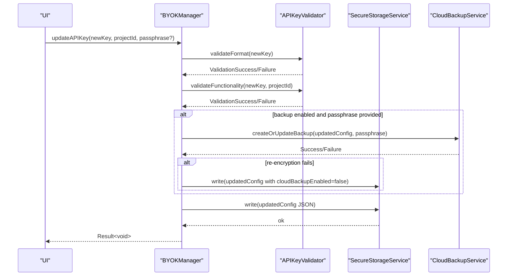
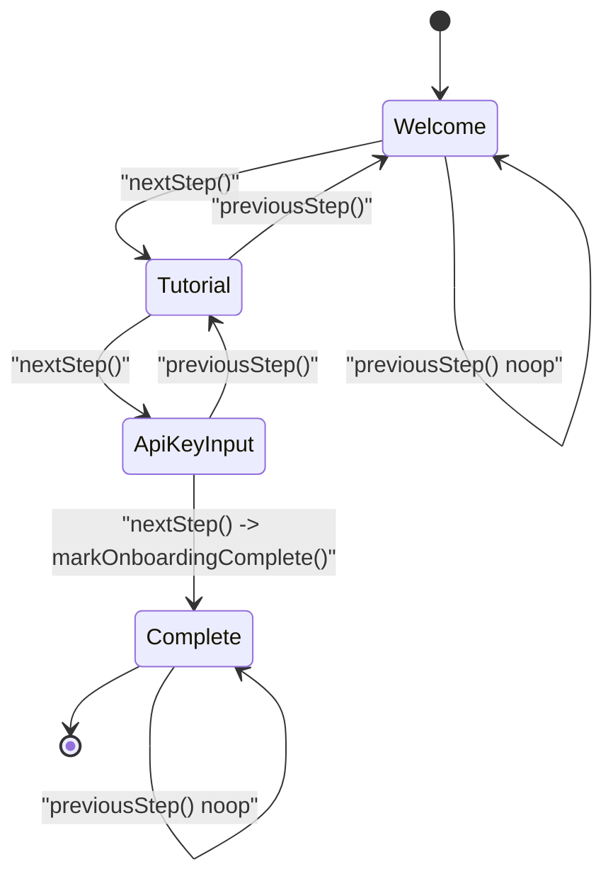
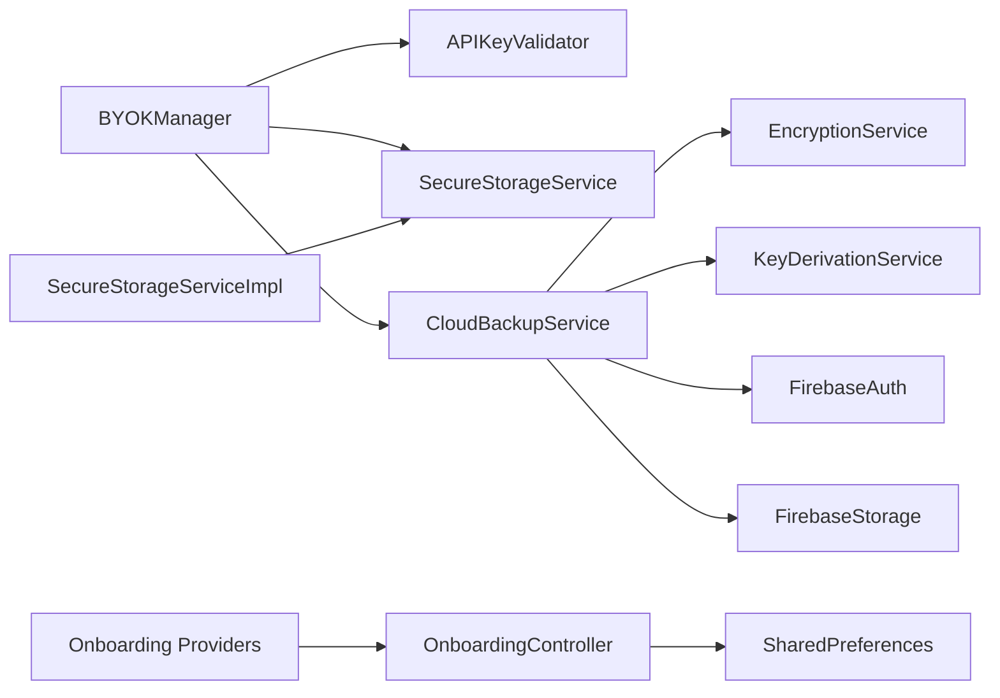

# API Reference

<cite>
**Referenced Files in This Document**
- [lib/core/byok/byok_manager.dart](file://lib/core/byok/byok_manager.dart)
- [lib/core/byok/api_key_validator.dart](file://lib/core/byok/api_key_validator.dart)
- [lib/core/byok/cloud_backup_service.dart](file://lib/core/byok/cloud_backup_service.dart)
- [lib/core/byok/byok_storage_keys.dart](file://lib/core/byok/byok_storage_keys.dart)
- [lib/core/byok/models/api_key_config.dart](file://lib/core/byok/models/api_key_config.dart)
- [lib/core/byok/models/validation_result.dart](file://lib/core/byok/models/validation_result.dart)
- [lib/core/byok/models/byok_error.dart](file://lib/core/byok/models/byok_error.dart)
- [lib/core/byok/models/cloud_backup_blob.dart](file://lib/core/byok/models/cloud_backup_blob.dart)
- [lib/core/storage/secure_storage_service.dart](file://lib/core/storage/secure_storage_service.dart)
- [lib/core/storage/secure_storage_service_impl.dart](file://lib/core/storage/secure_storage_service_impl.dart)
- [lib/core/onboarding/onboarding_controller.dart](file://lib/core/onboarding/onboarding_controller.dart)
- [lib/core/onboarding/onboarding_controller_impl.dart](file://lib/core/onboarding/onboarding_controller_impl.dart)
- [lib/core/onboarding/models/onboarding_state.dart](file://lib/core/onboarding/models/onboarding_state.dart)
- [lib/core/onboarding/onboarding_providers.dart](file://lib/core/onboarding/onboarding_providers.dart)
- [lib/core/crypto/kdf_metadata.dart](file://lib/core/crypto/kdf_metadata.dart)
</cite>

## Table of Contents
1. [Introduction](#introduction)
2. [Project Structure](#project-structure)
3. [Core Components](#core-components)
4. [Architecture Overview](#architecture-overview)
5. [Detailed Component Analysis](#detailed-component-analysis)
6. [Dependency Analysis](#dependency-analysis)
7. [Performance Considerations](#performance-considerations)
8. [Troubleshooting Guide](#troubleshooting-guide)
9. [Conclusion](#conclusion)

## Introduction
This document provides a comprehensive API reference for StyleSync’s public interfaces and core service APIs. It covers:
- BYOK Manager API for API key lifecycle operations
- Secure Storage Service interface for platform-abstraction and storage operations
- Onboarding Controller API with state management and reactive patterns
- Data models such as APIKeyConfig, ValidationResult, and KdfMetadata
- Configuration options, callback interfaces, and event handling mechanisms
- Usage patterns, error handling strategies, and integration approaches

## Project Structure
The APIs are organized by feature domains:
- BYOK (Bring-Your-Own-Key): key lifecycle, validation, cloud backup, and storage keys
- Storage: platform abstraction for secure storage
- Onboarding: controller, state, and providers for onboarding flow
- Crypto: KDF metadata used by cloud backup

**Diagram sources**
- [lib/core/byok/byok_manager.dart](file://lib/core/byok/byok_manager.dart#L84-L147)
- [lib/core/byok/api_key_validator.dart](file://lib/core/byok/api_key_validator.dart#L14-L48)
- [lib/core/byok/cloud_backup_service.dart](file://lib/core/byok/cloud_backup_service.dart#L21-L91)
- [lib/core/byok/byok_storage_keys.dart](file://lib/core/byok/byok_storage_keys.dart#L5-L14)
- [lib/core/storage/secure_storage_service.dart](file://lib/core/storage/secure_storage_service.dart#L10-L29)
- [lib/core/storage/secure_storage_service_impl.dart](file://lib/core/storage/secure_storage_service_impl.dart#L7-L104)
- [lib/core/onboarding/onboarding_controller.dart](file://lib/core/onboarding/onboarding_controller.dart#L17-L46)
- [lib/core/onboarding/onboarding_controller_impl.dart](file://lib/core/onboarding/onboarding_controller_impl.dart#L16-L78)
- [lib/core/onboarding/models/onboarding_state.dart](file://lib/core/onboarding/models/onboarding_state.dart#L23-L47)
- [lib/core/onboarding/onboarding_providers.dart](file://lib/core/onboarding/onboarding_providers.dart#L18-L175)
- [lib/core/crypto/kdf_metadata.dart](file://lib/core/crypto/kdf_metadata.dart#L9-L22)

**Section sources**
- [lib/core/byok/byok_manager.dart](file://lib/core/byok/byok_manager.dart#L84-L147)
- [lib/core/storage/secure_storage_service.dart](file://lib/core/storage/secure_storage_service.dart#L10-L29)
- [lib/core/onboarding/onboarding_controller.dart](file://lib/core/onboarding/onboarding_controller.dart#L17-L46)
- [lib/core/crypto/kdf_metadata.dart](file://lib/core/crypto/kdf_metadata.dart#L9-L22)

## Core Components
- BYOKManager: Orchestrates API key lifecycle, validation, secure storage, and optional cloud backup.
- SecureStorageService: Platform abstraction for secure storage with read/write/delete semantics.
- OnboardingController: Manages onboarding state persistence and reactive state transitions.
- CloudBackupService: Client-side encryption and cloud storage operations for API key backups.
- Data models: APIKeyConfig, ValidationResult, BYOKError, CloudBackupBlob, KdfMetadata.

**Section sources**
- [lib/core/byok/byok_manager.dart](file://lib/core/byok/byok_manager.dart#L84-L147)
- [lib/core/storage/secure_storage_service.dart](file://lib/core/storage/secure_storage_service.dart#L10-L29)
- [lib/core/onboarding/onboarding_controller.dart](file://lib/core/onboarding/onboarding_controller.dart#L17-L46)
- [lib/core/byok/cloud_backup_service.dart](file://lib/core/byok/cloud_backup_service.dart#L21-L91)

## Architecture Overview
The BYOK subsystem integrates validation, secure storage, and optional cloud backup. The Onboarding subsystem provides reactive state management and persistence.

**Diagram sources**
- [lib/core/byok/byok_manager.dart](file://lib/core/byok/byok_manager.dart#L182-L231)
- [lib/core/byok/api_key_validator.dart](file://lib/core/byok/api_key_validator.dart#L111-L224)
- [lib/core/storage/secure_storage_service.dart](file://lib/core/storage/secure_storage_service.dart#L12-L19)

## Detailed Component Analysis

### BYOK Manager API
Public interface: BYOKManager
- Methods
  - storeAPIKey(apiKey, projectId) → Future<Result<void>>
  - getAPIKey() → Future<Result<APIKeyConfig>>
  - deleteAPIKey(deleteCloudBackup: bool = false) → Future<Result<void>>
  - updateAPIKey(newApiKey, projectId, passphrase?) → Future<Result<void>>
  - enableCloudBackup(passphrase) → Future<Result<void>>
  - disableCloudBackup(deleteBackup: bool = true) → Future<Result<void>>
  - restoreFromCloudBackup(passphrase) → Future<Result<APIKeyConfig>>
  - hasStoredKey() → Future<bool>
  - isCloudBackupEnabled() → Future<bool>
  - rotateBackupPassphrase(oldPassphrase, newPassphrase) → Future<Result<void>>

- Return types
  - Result<T>: sealed class with Success<T> and Failure<T>. Provides isSuccess/isFailure, valueOrNull, errorOrNull, and map/mapAsync helpers.

- Error types (BYOKError)
  - ValidationError(message, validationResult)
  - NotFoundError()
  - StorageError(message, originalError?)
  - BackupError(message, type, originalError?)
  - CryptoError(message, originalError?)

- Error codes (BackupErrorType)
  - notFound, wrongPassphrase, corrupted, networkError, storageError

- Usage patterns
  - Store: validate then persist; on success, optionally enable cloud backup
  - Retrieve: handle NotFoundError gracefully
  - Update: preserve metadata; optionally re-encrypt cloud backup
  - Cloud backup: createOrUpdate, restore, delete, rotate passphrase
  - Idempotency: generated per operation

- Integration notes
  - Depends on SecureStorageService for local persistence
  - Depends on APIKeyValidator for format and functionality checks
  - Depends on CloudBackupService for cloud operations (optional)

**Section sources**
- [lib/core/byok/byok_manager.dart](file://lib/core/byok/byok_manager.dart#L84-L147)
- [lib/core/byok/byok_manager.dart](file://lib/core/byok/byok_manager.dart#L153-L549)
- [lib/core/byok/models/byok_error.dart](file://lib/core/byok/models/byok_error.dart#L7-L94)
- [lib/core/byok/models/validation_result.dart](file://lib/core/byok/models/validation_result.dart#L5-L188)

### Secure Storage Service Interface
Public interface: SecureStorageService
- Methods
  - write(key, value) → Future<void>
  - read(key) → Future<String?>
  - delete(key) → Future<void>
  - deleteAll() → Future<void>
  - backend → SecureStorageBackend (hardwareBacked, software)
  - requiresBiometric → bool

- Implementation: SecureStorageServiceImpl
  - Android: AES-GCM via Android Keystore (hardware-backed)
  - iOS: Keychain with accessibility (hardware-backed)
  - Other platforms: software-backed fallback
  - Lazy initialization with Completer to ensure thread safety

- Usage patterns
  - Write sensitive config as JSON string
  - Read with null handling
  - Delete keys and clear all for reset scenarios

**Section sources**
- [lib/core/storage/secure_storage_service.dart](file://lib/core/storage/secure_storage_service.dart#L10-L29)
- [lib/core/storage/secure_storage_service_impl.dart](file://lib/core/storage/secure_storage_service_impl.dart#L7-L104)

### Onboarding Controller API
Public interface: OnboardingController
- Methods
  - isOnboardingComplete() → Future<bool>
  - markOnboardingComplete() → Future<void>
  - resetOnboarding() → Future<void>

Implementation: OnboardingControllerImpl
- Persists completion state in SharedPreferences
- Thread-safe initialization via Completer
- Throws on persistence failure

Reactive state management
- OnboardingState: immutable snapshot with isComplete and currentStep
- OnboardingStateNotifier: StateNotifier<OnboardingState> with nextStep(), previousStep(), reset(), skipToStep()
- Providers:
  - onboardingControllerProvider
  - isOnboardingCompleteProvider (FutureProvider)
  - onboardingStateProvider (StateNotifierProvider)

Usage patterns
- During app startup, use isOnboardingCompleteProvider to decide initial route
- During flow, use onboardingStateProvider to drive UI and state transitions
- Persist completion on last step

**Section sources**
- [lib/core/onboarding/onboarding_controller.dart](file://lib/core/onboarding/onboarding_controller.dart#L17-L46)
- [lib/core/onboarding/onboarding_controller_impl.dart](file://lib/core/onboarding/onboarding_controller_impl.dart#L16-L78)
- [lib/core/onboarding/models/onboarding_state.dart](file://lib/core/onboarding/models/onboarding_state.dart#L23-L74)
- [lib/core/onboarding/onboarding_providers.dart](file://lib/core/onboarding/onboarding_providers.dart#L18-L175)

### Cloud Backup Service Interface
Public interface: CloudBackupService
- Methods
  - createOrUpdateBackup(config, passphrase, createdAt?) → Future<Result<void>>
  - restoreBackup(passphrase) → Future<Result<APIKeyConfig>>
  - deleteBackup() → Future<Result<void>>
  - backupExists() → Future<Result<bool>>
  - rotatePassphrase(oldPassphrase, newPassphrase) → Future<Result<void>>
  - verifyPassphrase(passphrase) → Future<Result<bool>>

Implementation: CloudBackupServiceImpl
- Uses Firebase Storage and Auth
- Client-side encryption with EncryptionService and KDF metadata
- Atomic rotation via temporary backup path with verification and cleanup
- Network error detection for SocketException, HttpException, and specific Firebase error codes

Error handling
- BackupError with typed reasons (notFound, wrongPassphrase, corrupted, networkError, storageError)
- Graceful handling of missing backups and network failures

**Section sources**
- [lib/core/byok/cloud_backup_service.dart](file://lib/core/byok/cloud_backup_service.dart#L21-L91)
- [lib/core/byok/cloud_backup_service.dart](file://lib/core/byok/cloud_backup_service.dart#L97-L858)

### Data Models

#### APIKeyConfig
- Fields
  - apiKey: String
  - projectId: String
  - createdAt: DateTime
  - lastValidated: DateTime
  - cloudBackupEnabled: bool
  - idempotencyKey: String
- Behavior
  - toJson/fromJson for serialization
  - copyWith for immutable updates
  - equality and hashCode

Validation rules
- apiKey must be non-empty and match expected format
- projectId must conform to Google Cloud project ID rules
- createdAt/lastValidated are ISO timestamps
- idempotencyKey is a unique string per operation

**Section sources**
- [lib/core/byok/models/api_key_config.dart](file://lib/core/byok/models/api_key_config.dart#L5-L109)

#### ValidationResult
- Sealed hierarchy
  - ValidationSuccess(metadata?): optional metadata (e.g., available models)
  - ValidationFailure(type, message, errorCode?, originalError?)
- ValidationFailureType
  - invalidFormat, malformedKey, unauthorized, invalidProject, apiNotEnabled, networkError, rateLimited, unknown

**Section sources**
- [lib/core/byok/models/validation_result.dart](file://lib/core/byok/models/validation_result.dart#L5-L188)

#### BYOKError
- Sealed hierarchy
  - ValidationError(message, validationResult)
  - NotFoundError()
  - StorageError(message, originalError?)
  - BackupError(message, type, originalError?)
  - CryptoError(message, originalError?)

**Section sources**
- [lib/core/byok/models/byok_error.dart](file://lib/core/byok/models/byok_error.dart#L7-L94)

#### CloudBackupBlob
- Fields
  - version: int
  - kdfMetadata: KdfMetadata
  - encryptedData: String (base64)
  - createdAt: DateTime
  - updatedAt: DateTime
- Behavior
  - toJson/fromJson with strict validation
  - copyWith
  - equality and hashCode

Validation rules
- version must be >= 1 and <= currentVersion
- kdf must be valid KdfMetadata
- encrypted_data must be non-empty string
- timestamps must be valid ISO strings

**Section sources**
- [lib/core/byok/models/cloud_backup_blob.dart](file://lib/core/byok/models/cloud_backup_blob.dart#L8-L156)

#### KdfMetadata
- Fields
  - algorithm: KdfAlgorithm (argon2id, pbkdf2)
  - salt: Uint8List
  - iterations: int
  - memory: int (default 0)
  - parallelism: int (default 0)
- Behavior
  - toJson/fromJson with validation
  - base64 encoding for salt
  - integer validation with non-negative constraint

**Section sources**
- [lib/core/crypto/kdf_metadata.dart](file://lib/core/crypto/kdf_metadata.dart#L9-L77)

### Configuration Options, Callbacks, and Events
- BYOKManager
  - Dependencies injected via Riverpod providers
  - Optional CloudBackupService enables cloud backup features
  - Idempotency keys generated per operation

- SecureStorageService
  - Backend selection: hardwareBacked vs software
  - requiresBiometric currently returns false (placeholder)

- Onboarding Providers
  - onboardingControllerProvider: singleton controller
  - isOnboardingCompleteProvider: FutureProvider for initial routing
  - onboardingStateProvider: StateNotifierProvider for reactive UI

- CloudBackupService
  - Uses Firebase Storage/Auth and Encryption/KDF services
  - Rotation preserves createdAt timestamp and cleans up temp backup

**Section sources**
- [lib/core/byok/byok_manager.dart](file://lib/core/byok/byok_manager.dart#L555-L582)
- [lib/core/storage/secure_storage_service_impl.dart](file://lib/core/storage/secure_storage_service_impl.dart#L33-L73)
- [lib/core/onboarding/onboarding_providers.dart](file://lib/core/onboarding/onboarding_providers.dart#L18-L175)
- [lib/core/byok/cloud_backup_service.dart](file://lib/core/byok/cloud_backup_service.dart#L97-L899)

## Architecture Overview

**Diagram sources**
- [lib/core/byok/byok_manager.dart](file://lib/core/byok/byok_manager.dart#L84-L147)
- [lib/core/byok/api_key_validator.dart](file://lib/core/byok/api_key_validator.dart#L14-L48)
- [lib/core/storage/secure_storage_service.dart](file://lib/core/storage/secure_storage_service.dart#L10-L29)
- [lib/core/byok/cloud_backup_service.dart](file://lib/core/byok/cloud_backup_service.dart#L21-L91)

## Detailed Component Analysis

### BYOK Manager Lifecycle Operations

**Diagram sources**
- [lib/core/byok/byok_manager.dart](file://lib/core/byok/byok_manager.dart#L297-L384)
- [lib/core/byok/api_key_validator.dart](file://lib/core/byok/api_key_validator.dart#L111-L224)
- [lib/core/byok/cloud_backup_service.dart](file://lib/core/byok/cloud_backup_service.dart#L166-L249)

**Section sources**
- [lib/core/byok/byok_manager.dart](file://lib/core/byok/byok_manager.dart#L297-L384)

### Cloud Backup Rotation Flow

**Diagram sources**
- [lib/core/byok/cloud_backup_service.dart](file://lib/core/byok/cloud_backup_service.dart#L413-L555)

**Section sources**
- [lib/core/byok/cloud_backup_service.dart](file://lib/core/byok/cloud_backup_service.dart#L413-L555)

### Onboarding State Machine

**Diagram sources**
- [lib/core/onboarding/models/onboarding_state.dart](file://lib/core/onboarding/models/onboarding_state.dart#L5-L17)
- [lib/core/onboarding/onboarding_providers.dart](file://lib/core/onboarding/onboarding_providers.dart#L77-L122)

**Section sources**
- [lib/core/onboarding/models/onboarding_state.dart](file://lib/core/onboarding/models/onboarding_state.dart#L23-L74)
- [lib/core/onboarding/onboarding_providers.dart](file://lib/core/onboarding/onboarding_providers.dart#L59-L137)

## Dependency Analysis

**Diagram sources**
- [lib/core/byok/byok_manager.dart](file://lib/core/byok/byok_manager.dart#L153-L180)
- [lib/core/byok/cloud_backup_service.dart](file://lib/core/byok/cloud_backup_service.dart#L97-L119)
- [lib/core/onboarding/onboarding_providers.dart](file://lib/core/onboarding/onboarding_providers.dart#L18-L20)
- [lib/core/storage/secure_storage_service_impl.dart](file://lib/core/storage/secure_storage_service_impl.dart#L7-L14)

**Section sources**
- [lib/core/byok/byok_manager.dart](file://lib/core/byok/byok_manager.dart#L153-L180)
- [lib/core/byok/cloud_backup_service.dart](file://lib/core/byok/cloud_backup_service.dart#L97-L119)
- [lib/core/onboarding/onboarding_providers.dart](file://lib/core/onboarding/onboarding_providers.dart#L18-L20)
- [lib/core/storage/secure_storage_service_impl.dart](file://lib/core/storage/secure_storage_service_impl.dart#L7-L14)

## Performance Considerations
- BYOK operations
  - Prefer batch operations where possible; storeJSON is lightweight
  - Avoid unnecessary cloud backup updates; only re-encrypt when passphrase changes
- Cloud backup
  - Rotation uses temporary path to minimize downtime; ensure sufficient retries for network failures
  - KDF parameters impact CPU/memory; choose conservative defaults for mobile devices
- Secure storage
  - Initialization is lazy and guarded; avoid frequent re-initialization
  - Use deleteAll only for reset scenarios
- Onboarding
  - Use FutureProvider for initial routing to avoid redundant reads
  - Use StateNotifierProvider for reactive UI updates

## Troubleshooting Guide
- BYOKManager
  - NotFoundError when retrieving or deleting non-existent keys
  - ValidationError with ValidationFailure details for invalid keys
  - StorageError for secure storage failures; check backend and device capabilities
  - BackupError for cloud operations; inspect BackupErrorType for resolution

- CloudBackupService
  - wrongPassphrase: verify passphrase against stored KDF metadata
  - notFound: confirm backup exists and user is authenticated
  - corrupted: re-create backup or restore from another source
  - networkError: retry with exponential backoff; check connectivity

- SecureStorageService
  - hardwareBacked fallback: logs indicate software fallback on init failure
  - requiresBiometric: placeholder; configure as needed in future tasks

- OnboardingController
  - Persistence failures: markOnboardingComplete throws on failure; handle and log appropriately
  - State desynchronization: use OnboardingStateNotifier for reactive updates

**Section sources**
- [lib/core/byok/models/byok_error.dart](file://lib/core/byok/models/byok_error.dart#L67-L83)
- [lib/core/byok/cloud_backup_service.dart](file://lib/core/byok/cloud_backup_service.dart#L222-L248)
- [lib/core/storage/secure_storage_service_impl.dart](file://lib/core/storage/secure_storage_service_impl.dart#L63-L72)
- [lib/core/onboarding/onboarding_controller_impl.dart](file://lib/core/onboarding/onboarding_controller_impl.dart#L64-L70)

## Conclusion
This API reference documents StyleSync’s core service interfaces and data models. The BYOK Manager provides robust API key lifecycle management with validation and optional cloud backup. The Secure Storage Service abstracts platform-specific secure storage. The Onboarding Controller offers reactive state management for user onboarding. Adhering to the documented patterns and error handling strategies ensures reliable integration and maintainable code.