# Architecture Overview

<cite>
**Referenced Files in This Document**
- [lib/main.dart](file://lib/main.dart)
- [lib/core/byok/byok_manager.dart](file://lib/core/byok/byok_manager.dart)
- [lib/core/byok/cloud_backup_service.dart](file://lib/core/byok/cloud_backup_service.dart)
- [lib/core/byok/api_key_validator.dart](file://lib/core/byok/api_key_validator.dart)
- [lib/core/byok/byok_storage_keys.dart](file://lib/core/byok/byok_storage_keys.dart)
- [lib/core/byok/models/api_key_config.dart](file://lib/core/byok/models/api_key_config.dart)
- [lib/core/byok/models/byok_error.dart](file://lib/core/byok/models/byok_error.dart)
- [lib/core/crypto/encryption_service.dart](file://lib/core/crypto/encryption_service.dart)
- [lib/core/crypto/key_derivation_service.dart](file://lib/core/crypto/key_derivation_service.dart)
- [lib/core/storage/secure_storage_service.dart](file://lib/core/storage/secure_storage_service.dart)
- [lib/core/storage/secure_storage_service_impl.dart](file://lib/core/storage/secure_storage_service_impl.dart)
- [lib/core/onboarding/onboarding_controller.dart](file://lib/core/onboarding/onboarding_controller.dart)
- [lib/core/onboarding/onboarding_controller_impl.dart](file://lib/core/onboarding/onboarding_controller_impl.dart)
- [lib/core/onboarding/onboarding_providers.dart](file://lib/core/onboarding/onboarding_providers.dart)
- [lib/core/onboarding/models/onboarding_state.dart](file://lib/core/onboarding/models/onboarding_state.dart)
- [lib/core/auth/auth_service.dart](file://lib/core/auth/auth_service.dart)
- [lib/core/auth/age_verification_service.dart](file://lib/core/auth/age_verification_service.dart)
- [lib/core/clothing/clothing_repository.dart](file://lib/core/clothing/clothing_repository.dart)
- [lib/core/privacy/auto_tagger_service.dart](file://lib/core/privacy/auto_tagger_service.dart)
- [lib/core/privacy/background_removal_service.dart](file://lib/core/privacy/background_removal_service.dart)
- [lib/core/privacy/consent_manager.dart](file://lib/core/privacy/consent_manager.dart)
- [lib/core/privacy/face_detection_service.dart](file://lib/core/privacy/face_detection_service.dart)
- [lib/core/byok/byok_design.md](file://lib/core/byok/byok_design.md)
</cite>

## Update Summary
**Changes Made**
- Added comprehensive privacy and security services layer
- Integrated authentication and age verification systems
- Expanded clothing management and digital closet functionality
- Enhanced privacy-focused services including face detection and consent management
- Updated architecture to reflect sophisticated privacy-first fashion platform

## Table of Contents
1. [Introduction](#introduction)
2. [Project Structure](#project-structure)
3. [Core Components](#core-components)
4. [Architecture Overview](#architecture-overview)
5. [Detailed Component Analysis](#detailed-component-analysis)
6. [Privacy and Security Services](#privacy-and-security-services)
7. [Authentication and Access Control](#authentication-and-access-control)
8. [Digital Fashion Platform Features](#digital-fashion-platform-features)
9. [Dependency Analysis](#dependency-analysis)
10. [Performance Considerations](#performance-considerations)
11. [Security-First Design Principles](#security-first-design-principles)
12. [Troubleshooting Guide](#troubleshooting-guide)
13. [Conclusion](#conclusion)

## Introduction
This document presents the architectural overview of StyleSync's sophisticated privacy-first fashion platform system design. The platform has evolved from a basic Flutter application to a comprehensive fashion technology solution with advanced privacy protections, authentication systems, and digital fashion management capabilities.

The architecture follows a modular, layered approach with clear separation of concerns:
- Core services: Secure storage, cryptography, cloud backup orchestration, and privacy services
- Authentication services: User authentication, age verification, and consent management
- Digital fashion platform: Clothing repository, auto-tagging, and background removal
- Privacy services: Face detection, consent management, and data protection
- Features: Onboarding flow with reactive state management and fashion platform integration

Security and privacy are first-class concerns, with hardware-backed storage, client-side encryption, comprehensive consent management, and privacy-preserving image processing. Architectural patterns include:
- Repository Pattern for data access abstraction
- Provider Pattern with Riverpod for reactive state management
- Factory Pattern for platform-specific implementations
- Strategy Pattern for multiple storage backend support
- Observer Pattern for privacy service notifications

## Project Structure
The project is organized into specialized layers for a sophisticated fashion platform:
- Core services under lib/core: secure storage, cryptography, BYOK manager, cloud backup, onboarding, and privacy services
- Authentication services: user management, age verification, and consent handling
- Digital fashion platform: clothing repository, auto-tagging, and background removal
- Feature modules: onboarding UI screens and widgets integrated with platform services
- Platform integrations: Android/iOS via Flutter plugins for secure storage, cloud services, and MLKit

```mermaid
graph TB
subgraph "App Entry"
Main["lib/main.dart"]
end
subgraph "Core Services"
BYOK["BYOKManager<br/>lib/core/byok/byok_manager.dart"]
Validator["APIKeyValidator<br/>lib/core/byok/api_key_validator.dart"]
CloudBackup["CloudBackupService<br/>lib/core/byok/cloud_backup_service.dart"]
Crypto["EncryptionService<br/>lib/core/crypto/encryption_service.dart"]
KDF["KeyDerivationService<br/>lib/core/crypto/key_derivation_service.dart"]
SecStore["SecureStorageService<br/>lib/core/storage/secure_storage_service.dart"]
SecStoreImpl["SecureStorageServiceImpl<br/>lib/core/storage/secure_storage_service_impl.dart"]
OnboardingCtrl["OnboardingController<br/>lib/core/onboarding/onboarding_controller.dart"]
OnboardingCtrlImpl["OnboardingControllerImpl<br/>lib/core/onboarding/onboarding_controller_impl.dart"]
end
subgraph "Privacy Services"
AutoTagger["AutoTaggerService<br/>lib/core/privacy/auto_tagger_service.dart"]
BGRemoval["BackgroundRemovalService<br/>lib/core/privacy/background_removal_service.dart"]
ConsentMgr["ConsentManager<br/>lib/core/privacy/consent_manager.dart"]
FaceDetect["FaceDetectionService<br/>lib/core/privacy/face_detection_service.dart"]
end
subgraph "Authentication"
AuthService["AuthService<br/>lib/core/auth/auth_service.dart"]
AgeVerify["AgeVerificationService<br/>lib/core/auth/age_verification_service.dart"]
end
subgraph "Digital Fashion"
ClothingRepo["ClothingRepository<br/>lib/core/clothing/clothing_repository.dart"]
end
subgraph "Providers"
BYOKProv["byokManagerProvider<br/>lib/core/byok/byok_manager.dart"]
SecStoreProv["secureStorageServiceProvider<br/>lib/core/byok/byok_manager.dart"]
ValidatorProv["apiKeyValidatorProvider<br/>lib/core/byok/byok_manager.dart"]
OnboardingProv["onboardingControllerProvider<br/>lib/core/onboarding/onboarding_providers.dart"]
AuthProv["authService<br/>lib/core/auth/auth_service.dart"]
ConsentProv["consentManager<br/>lib/core/privacy/consent_manager.dart"]
end
Main --> BYOKProv
BYOKProv --> BYOK
BYOKProv --> SecStoreProv
BYOKProv --> ValidatorProv
BYOK --> Validator
BYOK --> SecStore
BYOK --> CloudBackup
CloudBackup --> Crypto
CloudBackup --> KDF
SecStore --> SecStoreImpl
OnboardingProv --> OnboardingCtrl
OnboardingCtrl --> OnboardingCtrlImpl
AuthProv --> AuthService
AuthService --> AgeVerify
ConsentProv --> ConsentMgr
ConsentMgr --> FaceDetect
ConsentMgr --> AutoTagger
ClothingRepo --> BGRemoval
```

**Diagram sources**
- [lib/main.dart](file://lib/main.dart#L1-L123)
- [lib/core/byok/byok_manager.dart](file://lib/core/byok/byok_manager.dart#L555-L582)
- [lib/core/byok/cloud_backup_service.dart](file://lib/core/byok/cloud_backup_service.dart#L21-L91)
- [lib/core/byok/api_key_validator.dart](file://lib/core/byok/api_key_validator.dart#L14-L48)
- [lib/core/storage/secure_storage_service.dart](file://lib/core/storage/secure_storage_service.dart#L10-L29)
- [lib/core/storage/secure_storage_service_impl.dart](file://lib/core/storage/secure_storage_service_impl.dart#L7-L105)
- [lib/core/onboarding/onboarding_providers.dart](file://lib/core/onboarding/onboarding_providers.dart#L18-L20)
- [lib/core/privacy/auto_tagger_service.dart](file://lib/core/privacy/auto_tagger_service.dart#L1-L222)
- [lib/core/privacy/background_removal_service.dart](file://lib/core/privacy/background_removal_service.dart#L1-L94)
- [lib/core/privacy/consent_manager.dart](file://lib/core/privacy/consent_manager.dart#L1-L75)
- [lib/core/privacy/face_detection_service.dart](file://lib/core/privacy/face_detection_service.dart#L1-L84)
- [lib/core/auth/auth_service.dart](file://lib/core/auth/auth_service.dart#L1-L381)
- [lib/core/auth/age_verification_service.dart](file://lib/core/auth/age_verification_service.dart#L1-L252)
- [lib/core/clothing/clothing_repository.dart](file://lib/core/clothing/clothing_repository.dart#L1-L489)

**Section sources**
- [lib/main.dart](file://lib/main.dart#L1-L123)
- [lib/core/byok/byok_manager.dart](file://lib/core/byok/byok_manager.dart#L555-L582)
- [lib/core/byok/cloud_backup_service.dart](file://lib/core/byok/cloud_backup_service.dart#L21-L91)
- [lib/core/byok/api_key_validator.dart](file://lib/core/byok/api_key_validator.dart#L14-L48)
- [lib/core/storage/secure_storage_service.dart](file://lib/core/storage/secure_storage_service.dart#L10-L29)
- [lib/core/storage/secure_storage_service_impl.dart](file://lib/core/storage/secure_storage_service_impl.dart#L7-L105)
- [lib/core/onboarding/onboarding_providers.dart](file://lib/core/onboarding/onboarding_providers.dart#L18-L20)
- [lib/core/privacy/auto_tagger_service.dart](file://lib/core/privacy/auto_tagger_service.dart#L1-L222)
- [lib/core/privacy/background_removal_service.dart](file://lib/core/privacy/background_removal_service.dart#L1-L94)
- [lib/core/privacy/consent_manager.dart](file://lib/core/privacy/consent_manager.dart#L1-L75)
- [lib/core/privacy/face_detection_service.dart](file://lib/core/privacy/face_detection_service.dart#L1-L84)
- [lib/core/auth/auth_service.dart](file://lib/core/auth/auth_service.dart#L1-L381)
- [lib/core/auth/age_verification_service.dart](file://lib/core/auth/age_verification_service.dart#L1-L252)
- [lib/core/clothing/clothing_repository.dart](file://lib/core/clothing/clothing_repository.dart#L1-L489)

## Core Components
- BYOKManager: Orchestrates API key lifecycle, validation, secure storage, and cloud backup operations with comprehensive error handling and result-based operations.
- APIKeyValidator: Provides format and functional validation against the Vertex AI API with structured error reporting.
- CloudBackupService: Manages encrypted cloud backup using client-side encryption and passphrase-derived keys with robust error handling.
- SecureStorageService: Abstraction for platform-native secure storage with hardware-backed priority and biometric authentication support.
- EncryptionService and KeyDerivationService: Provide AES-256-GCM encryption and Argon2id/PBKDF2 key derivation for maximum security.
- OnboardingController and Providers: Reactive onboarding state management with persistence and step-by-step progression.
- Privacy Services: Comprehensive privacy protection including face detection, auto-tagging, background removal, and consent management.
- Authentication Services: Complete user authentication system with age verification, social login support, and profile management.
- Digital Fashion Platform: Clothing repository with upload, management, and processing capabilities for digital fashion items.

**Section sources**
- [lib/core/byok/byok_manager.dart](file://lib/core/byok/byok_manager.dart#L84-L147)
- [lib/core/byok/api_key_validator.dart](file://lib/core/byok/api_key_validator.dart#L14-L48)
- [lib/core/byok/cloud_backup_service.dart](file://lib/core/byok/cloud_backup_service.dart#L21-L91)
- [lib/core/storage/secure_storage_service.dart](file://lib/core/storage/secure_storage_service.dart#L10-L29)
- [lib/core/crypto/encryption_service.dart](file://lib/core/crypto/encryption_service.dart#L14-L20)
- [lib/core/crypto/key_derivation_service.dart](file://lib/core/crypto/key_derivation_service.dart#L9-L15)
- [lib/core/onboarding/onboarding_controller.dart](file://lib/core/onboarding/onboarding_controller.dart#L17-L46)
- [lib/core/privacy/auto_tagger_service.dart](file://lib/core/privacy/auto_tagger_service.dart#L1-L222)
- [lib/core/privacy/background_removal_service.dart](file://lib/core/privacy/background_removal_service.dart#L1-L94)
- [lib/core/privacy/consent_manager.dart](file://lib/core/privacy/consent_manager.dart#L1-L75)
- [lib/core/privacy/face_detection_service.dart](file://lib/core/privacy/face_detection_service.dart#L1-L84)
- [lib/core/auth/auth_service.dart](file://lib/core/auth/auth_service.dart#L11-L71)
- [lib/core/auth/age_verification_service.dart](file://lib/core/auth/age_verification_service.dart#L10-L45)
- [lib/core/clothing/clothing_repository.dart](file://lib/core/clothing/clothing_repository.dart#L41-L100)

## Architecture Overview
The system employs a sophisticated layered architecture supporting a privacy-first fashion platform:
- Presentation Layer: Feature widgets, onboarding screens, and digital fashion interfaces
- Domain Layer: Core services (BYOKManager, validators, crypto, privacy services, authentication)
- Application Layer: Business logic for fashion platform operations and user management
- Infrastructure Layer: Platform-specific implementations (secure storage, cloud services, MLKit)

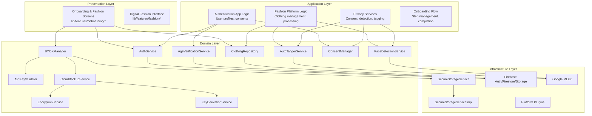

**Diagram sources**
- [lib/core/byok/byok_manager.dart](file://lib/core/byok/byok_manager.dart#L153-L181)
- [lib/core/byok/cloud_backup_service.dart](file://lib/core/byok/cloud_backup_service.dart#L97-L119)
- [lib/core/storage/secure_storage_service.dart](file://lib/core/storage/secure_storage_service.dart#L10-L29)
- [lib/core/storage/secure_storage_service_impl.dart](file://lib/core/storage/secure_storage_service_impl.dart#L7-L105)
- [lib/core/auth/auth_service.dart](file://lib/core/auth/auth_service.dart#L73-L84)
- [lib/core/auth/age_verification_service.dart](file://lib/core/auth/age_verification_service.dart#L47-L54)
- [lib/core/privacy/auto_tagger_service.dart](file://lib/core/privacy/auto_tagger_service.dart#L53-L81)
- [lib/core/privacy/face_detection_service.dart](file://lib/core/privacy/face_detection_service.dart#L48-L82)
- [lib/core/clothing/clothing_repository.dart](file://lib/core/clothing/clothing_repository.dart#L106-L123)

## Detailed Component Analysis

### BYOK Manager
BYOKManager coordinates API key lifecycle operations with comprehensive validation, secure storage, and optional cloud backup. It uses a sealed Result type for deterministic outcomes and extensive error handling for privacy-critical operations.

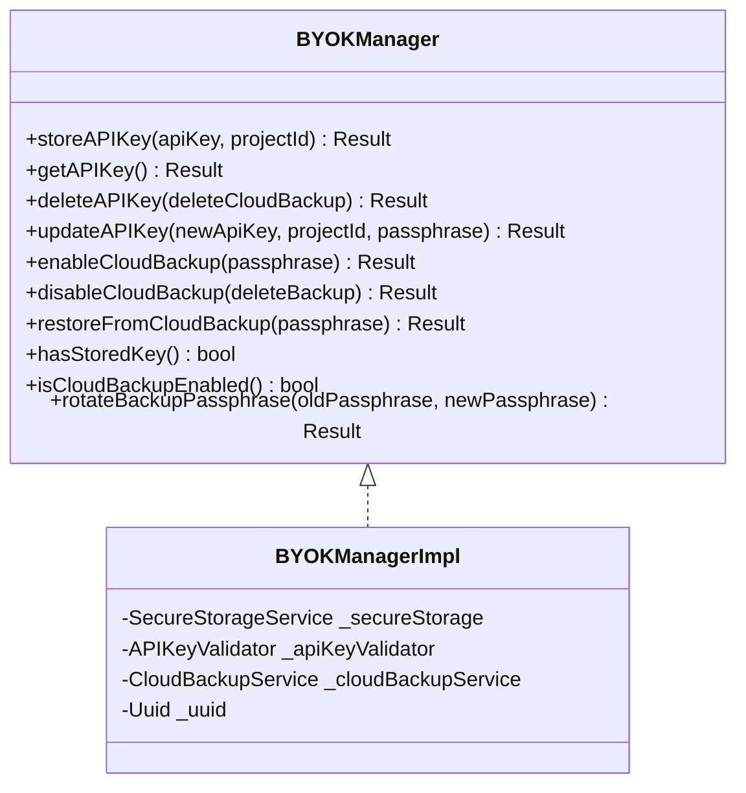

**Diagram sources**
- [lib/core/byok/byok_manager.dart](file://lib/core/byok/byok_manager.dart#L84-L147)
- [lib/core/byok/byok_manager.dart](file://lib/core/byok/byok_manager.dart#L153-L181)

**Section sources**
- [lib/core/byok/byok_manager.dart](file://lib/core/byok/byok_manager.dart#L84-L147)
- [lib/core/byok/byok_manager.dart](file://lib/core/byok/byok_manager.dart#L153-L181)

### Cloud Backup Service
CloudBackupService performs client-side encryption and passphrase-based key derivation before uploading to Firebase Storage. It supports comprehensive backup operations with robust error handling and network resilience.

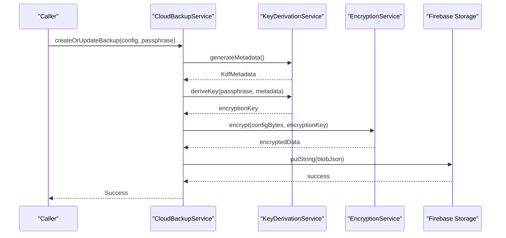

**Diagram sources**
- [lib/core/byok/cloud_backup_service.dart](file://lib/core/byok/cloud_backup_service.dart#L167-L249)
- [lib/core/crypto/key_derivation_service.dart](file://lib/core/crypto/key_derivation_service.dart#L22-L33)
- [lib/core/crypto/encryption_service.dart](file://lib/core/crypto/encryption_service.dart#L22-L40)

**Section sources**
- [lib/core/byok/cloud_backup_service.dart](file://lib/core/byok/cloud_backup_service.dart#L167-L249)
- [lib/core/crypto/key_derivation_service.dart](file://lib/core/crypto/key_derivation_service.dart#L22-L33)
- [lib/core/crypto/encryption_service.dart](file://lib/core/crypto/encryption_service.dart#L22-L40)

### API Key Validator
APIKeyValidator enforces strict format rules and performs functional validation against the Vertex AI API, returning structured results and categorizing network and service errors with comprehensive error reporting.

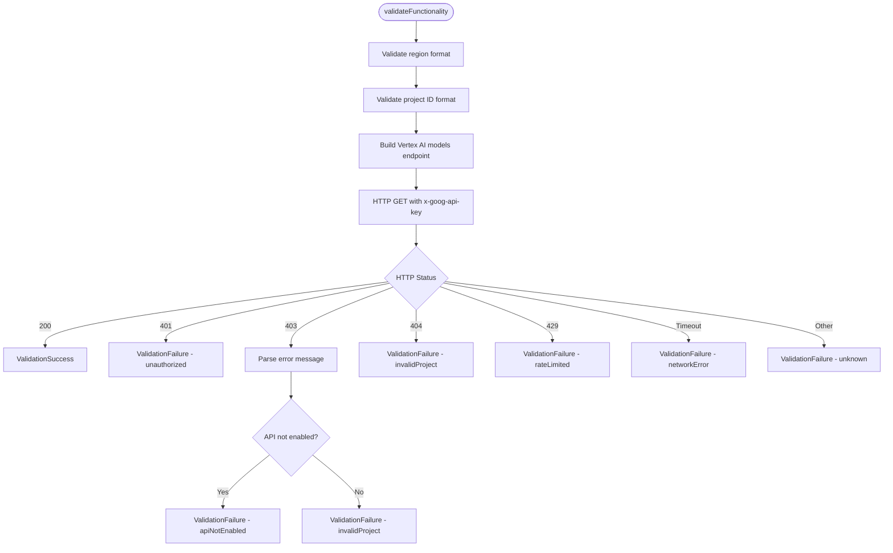

**Diagram sources**
- [lib/core/byok/api_key_validator.dart](file://lib/core/byok/api_key_validator.dart#L152-L224)
- [lib/core/byok/api_key_validator.dart](file://lib/core/byok/api_key_validator.dart#L226-L272)

**Section sources**
- [lib/core/byok/api_key_validator.dart](file://lib/core/byok/api_key_validator.dart#L14-L48)
- [lib/core/byok/api_key_validator.dart](file://lib/core/byok/api_key_validator.dart#L152-L224)

### Secure Storage Service
SecureStorageService defines the abstraction for platform-native secure storage with hardware-backed priority and biometric authentication support. The implementation selects Android Keystore, iOS Keychain, or software fallback depending on the platform.

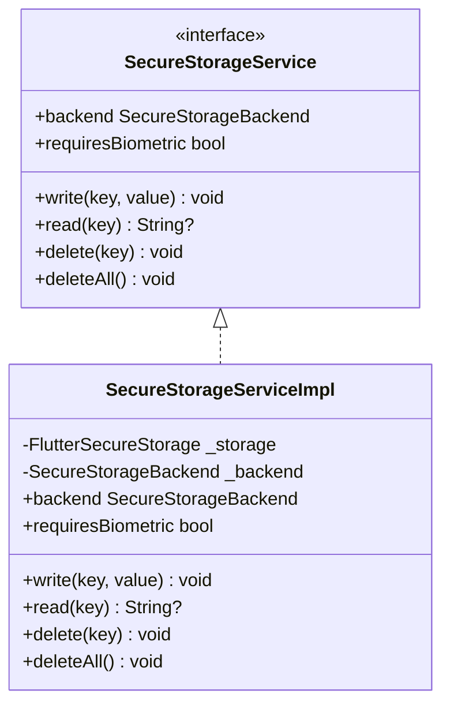

**Diagram sources**
- [lib/core/storage/secure_storage_service.dart](file://lib/core/storage/secure_storage_service.dart#L10-L29)
- [lib/core/storage/secure_storage_service_impl.dart](file://lib/core/storage/secure_storage_service_impl.dart#L7-L105)

**Section sources**
- [lib/core/storage/secure_storage_service.dart](file://lib/core/storage/secure_storage_service.dart#L10-L29)
- [lib/core/storage/secure_storage_service_impl.dart](file://lib/core/storage/secure_storage_service_impl.dart#L7-L105)

### Onboarding Controller and Providers
OnboardingController persists completion state using SharedPreferences and exposes reactive state via Riverpod providers with comprehensive step management and error handling.

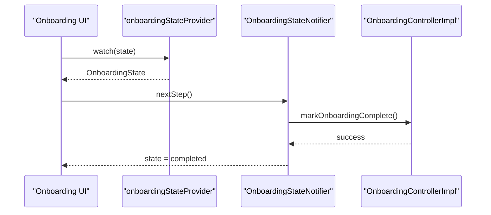

**Diagram sources**
- [lib/core/onboarding/onboarding_providers.dart](file://lib/core/onboarding/onboarding_providers.dart#L171-L175)
- [lib/core/onboarding/onboarding_providers.dart](file://lib/core/onboarding/onboarding_providers.dart#L59-L102)
- [lib/core/onboarding/onboarding_controller_impl.dart](file://lib/core/onboarding/onboarding_controller_impl.dart#L64-L70)

**Section sources**
- [lib/core/onboarding/onboarding_controller.dart](file://lib/core/onboarding/onboarding_controller.dart#L17-L46)
- [lib/core/onboarding/onboarding_controller_impl.dart](file://lib/core/onboarding/onboarding_controller_impl.dart#L16-L79)
- [lib/core/onboarding/onboarding_providers.dart](file://lib/core/onboarding/onboarding_providers.dart#L18-L20)
- [lib/core/onboarding/onboarding_providers.dart](file://lib/core/onboarding/onboarding_providers.dart#L59-L102)

## Privacy and Security Services

### Auto-Tagging Service
AutoTaggerService analyzes clothing images to extract categories, colors, and seasonal recommendations while maintaining strict privacy boundaries. The service operates entirely on-device and avoids any biometric processing.

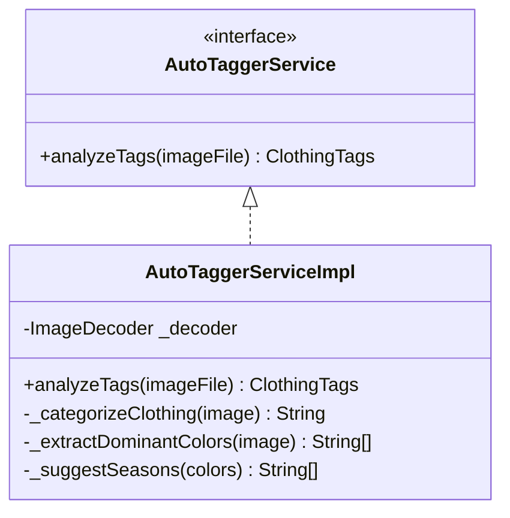

**Diagram sources**
- [lib/core/privacy/auto_tagger_service.dart](file://lib/core/privacy/auto_tagger_service.dart#L13-L18)
- [lib/core/privacy/auto_tagger_service.dart](file://lib/core/privacy/auto_tagger_service.dart#L53-L81)

**Section sources**
- [lib/core/privacy/auto_tagger_service.dart](file://lib/core/privacy/auto_tagger_service.dart#L1-L222)

### Background Removal Service
BackgroundRemovalService provides privacy-preserving background removal using on-device TensorFlow Lite models. The service supports configurable timeout behavior and graceful degradation.

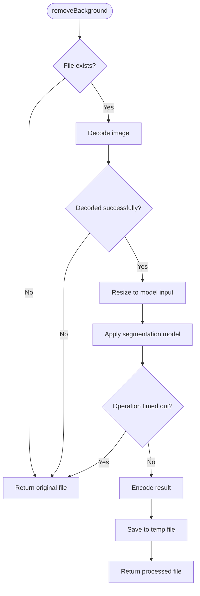

**Diagram sources**
- [lib/core/privacy/background_removal_service.dart](file://lib/core/privacy/background_removal_service.dart#L42-L92)

**Section sources**
- [lib/core/privacy/background_removal_service.dart](file://lib/core/privacy/background_removal_service.dart#L1-L94)

### Consent Management
ConsentManager provides comprehensive consent tracking for privacy-sensitive operations including face detection and biometric processing. The service maintains persistent consent states and supports granular control.

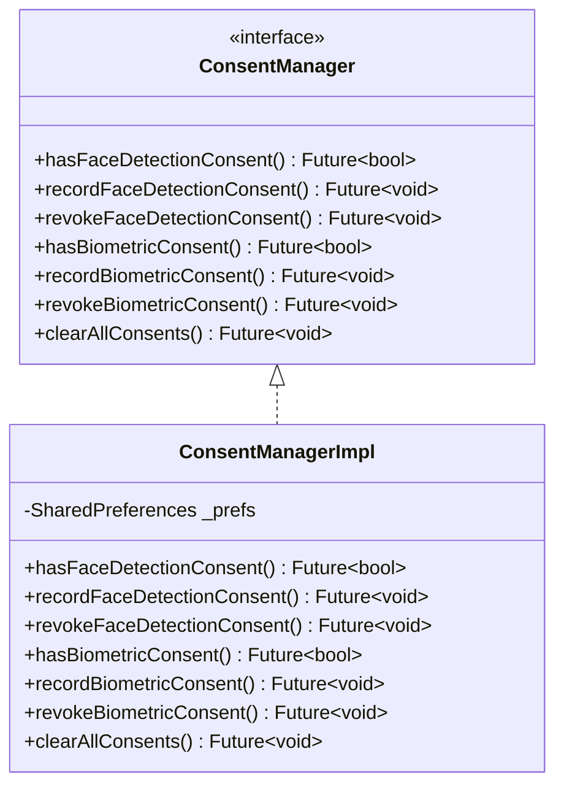

**Diagram sources**
- [lib/core/privacy/consent_manager.dart](file://lib/core/privacy/consent_manager.dart#L8-L29)
- [lib/core/privacy/consent_manager.dart](file://lib/core/privacy/consent_manager.dart#L31-L74)

**Section sources**
- [lib/core/privacy/consent_manager.dart](file://lib/core/privacy/consent_manager.dart#L1-L75)

### Face Detection Service
FaceDetectionService provides on-device face detection for privacy protection without extracting biometric data. The service ensures 100% on-device processing with comprehensive error handling.

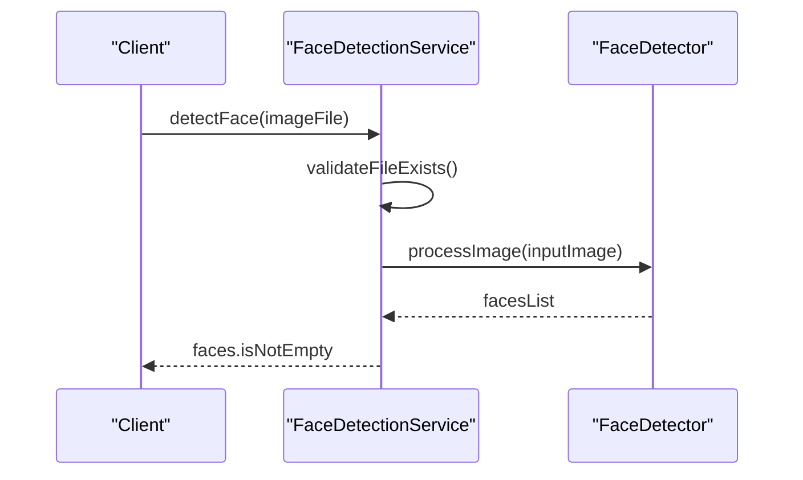

**Diagram sources**
- [lib/core/privacy/face_detection_service.dart](file://lib/core/privacy/face_detection_service.dart#L54-L77)

**Section sources**
- [lib/core/privacy/face_detection_service.dart](file://lib/core/privacy/face_detection_service.dart#L1-L84)

## Authentication and Access Control

### Authentication Service
AuthService provides comprehensive user authentication including email/password, social login options, and profile management with Firebase integration.

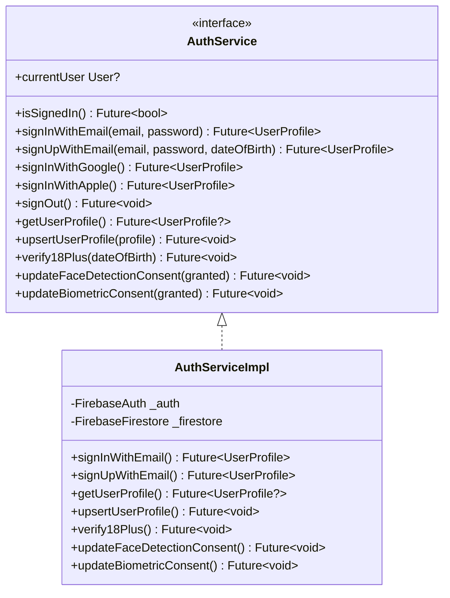

**Diagram sources**
- [lib/core/auth/auth_service.dart](file://lib/core/auth/auth_service.dart#L18-L71)
- [lib/core/auth/auth_service.dart](file://lib/core/auth/auth_service.dart#L74-L84)

**Section sources**
- [lib/core/auth/auth_service.dart](file://lib/core/auth/auth_service.dart#L1-L381)

### Age Verification Service
AgeVerificationService implements comprehensive age verification with self-reported DOB validation, third-party verification support, and session-based cooldown protection.

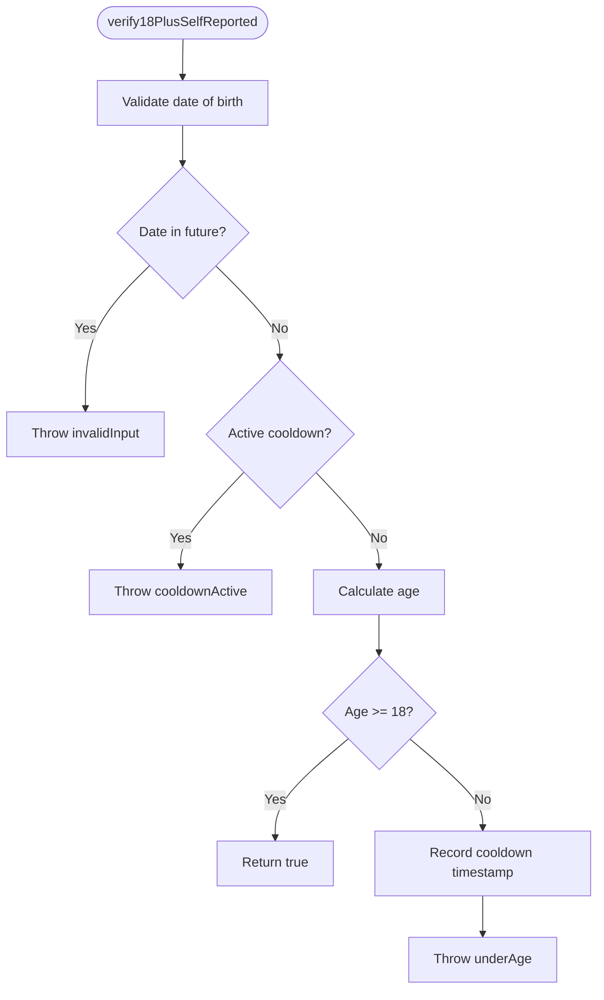

**Diagram sources**
- [lib/core/auth/age_verification_service.dart](file://lib/core/auth/age_verification_service.dart#L62-L94)

**Section sources**
- [lib/core/auth/age_verification_service.dart](file://lib/core/auth/age_verification_service.dart#L1-L252)

## Digital Fashion Platform Features

### Clothing Repository
ClothingRepository provides comprehensive digital fashion management with upload, retrieval, and processing capabilities while maintaining privacy and performance standards.

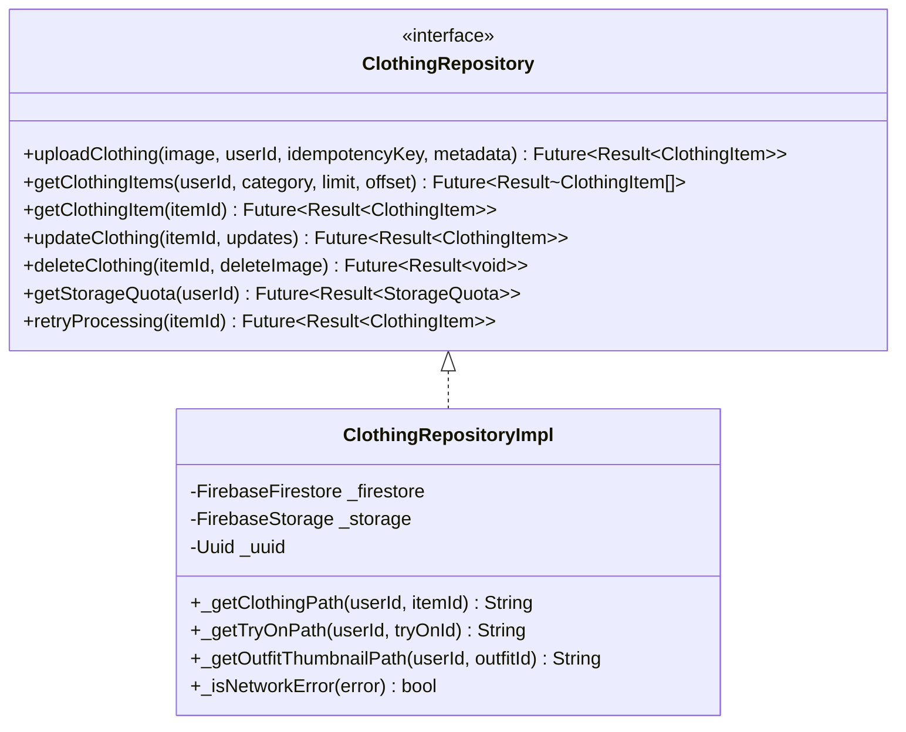

**Diagram sources**
- [lib/core/clothing/clothing_repository.dart](file://lib/core/clothing/clothing_repository.dart#L42-L100)
- [lib/core/clothing/clothing_repository.dart](file://lib/core/clothing/clothing_repository.dart#L106-L123)

**Section sources**
- [lib/core/clothing/clothing_repository.dart](file://lib/core/clothing/clothing_repository.dart#L1-L489)

## Dependency Analysis
The system exhibits sophisticated low coupling and high cohesion patterns:
- BYOKManager depends on SecureStorageService, APIKeyValidator, and CloudBackupService
- CloudBackupService depends on EncryptionService and KeyDerivationService
- Privacy services depend on MLKit and local storage with graceful degradation
- Authentication services integrate with Firebase Auth and Firestore
- Digital fashion platform components coordinate through shared repositories
- OnboardingControllerImpl depends on SharedPreferences for persistence

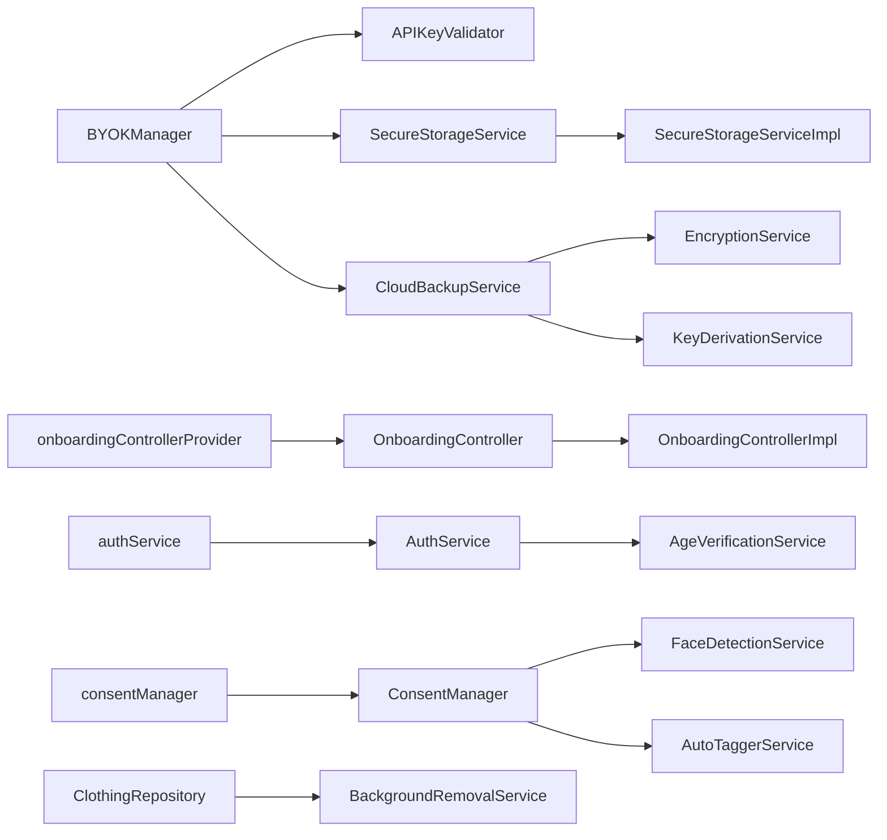

**Diagram sources**
- [lib/core/byok/byok_manager.dart](file://lib/core/byok/byok_manager.dart#L153-L181)
- [lib/core/byok/cloud_backup_service.dart](file://lib/core/byok/cloud_backup_service.dart#L97-L119)
- [lib/core/storage/secure_storage_service.dart](file://lib/core/storage/secure_storage_service.dart#L10-L29)
- [lib/core/storage/secure_storage_service_impl.dart](file://lib/core/storage/secure_storage_service_impl.dart#L7-L105)
- [lib/core/onboarding/onboarding_providers.dart](file://lib/core/onboarding/onboarding_providers.dart#L18-L20)
- [lib/core/auth/auth_service.dart](file://lib/core/auth/auth_service.dart#L73-L84)
- [lib/core/auth/age_verification_service.dart](file://lib/core/auth/age_verification_service.dart#L47-L54)
- [lib/core/privacy/auto_tagger_service.dart](file://lib/core/privacy/auto_tagger_service.dart#L53-L81)
- [lib/core/privacy/face_detection_service.dart](file://lib/core/privacy/face_detection_service.dart#L48-L82)
- [lib/core/clothing/clothing_repository.dart](file://lib/core/clothing/clothing_repository.dart#L106-L123)

**Section sources**
- [lib/core/byok/byok_manager.dart](file://lib/core/byok/byok_manager.dart#L153-L181)
- [lib/core/byok/cloud_backup_service.dart](file://lib/core/byok/cloud_backup_service.dart#L97-L119)
- [lib/core/storage/secure_storage_service.dart](file://lib/core/storage/secure_storage_service.dart#L10-L29)
- [lib/core/onboarding/onboarding_providers.dart](file://lib/core/onboarding/onboarding_providers.dart#L18-L20)
- [lib/core/auth/auth_service.dart](file://lib/core/auth/auth_service.dart#L73-L84)
- [lib/core/auth/age_verification_service.dart](file://lib/core/auth/age_verification_service.dart#L47-L54)
- [lib/core/privacy/auto_tagger_service.dart](file://lib/core/privacy/auto_tagger_service.dart#L53-L81)
- [lib/core/privacy/face_detection_service.dart](file://lib/core/privacy/face_detection_service.dart#L48-L82)
- [lib/core/clothing/clothing_repository.dart](file://lib/core/clothing/clothing_repository.dart#L106-L123)

## Performance Considerations
- Asynchronous operations: All storage, network, and ML processing operations are asynchronous to avoid blocking the UI thread.
- Platform-specific optimizations: SecureStorageServiceImpl leverages hardware-backed storage on Android and iOS for efficient and secure operations.
- Cryptographic workloads: Key derivation uses platform-aware parameters; Argon2id on native platforms and PBKDF2 on others to balance security and performance.
- Privacy-preserving ML: Face detection and auto-tagging operate entirely on-device to minimize latency and data transfer.
- Graceful degradation: Background removal and other ML services provide fallback behavior when processing fails or times out.
- Concurrency: BYOKManager serializes concurrent store operations to prevent race conditions and ensure consistent state.
- Caching: Authentication and onboarding states are cached appropriately to reduce redundant network calls.

## Security-First Design Principles
- Hardware-backed storage: SecureStorageServiceImpl prioritizes hardware-backed storage (Android Keystore, iOS Keychain) with software fallback.
- Client-side encryption: CloudBackupService encrypts data using AES-256-GCM before uploading to Firebase Storage.
- Passphrase-based key derivation: KeyDerivationService uses Argon2id on native platforms and PBKDF2 on others, with random salts and platform-appropriate parameters.
- Privacy-preserving ML: All face detection and image processing occurs on-device with no data leaving the device.
- Comprehensive consent management: Users have granular control over privacy-sensitive operations with persistent consent tracking.
- Age verification protection: Self-reported age verification includes cooldown mechanisms to prevent abuse.
- Error isolation: Dedicated error types (ValidationError, StorageError, BackupError, CryptoError, AuthError) provide precise failure diagnostics without leaking secrets.
- Network resilience: CloudBackupService distinguishes network errors from storage errors and surfaces actionable messages.
- Data minimization: Privacy services extract only necessary information (categories, colors, presence/absence of faces) without biometric data.

**Section sources**
- [lib/core/storage/secure_storage_service_impl.dart](file://lib/core/storage/secure_storage_service_impl.dart#L37-L62)
- [lib/core/crypto/encryption_service.dart](file://lib/core/crypto/encryption_service.dart#L22-L40)
- [lib/core/crypto/key_derivation_service.dart](file://lib/core/crypto/key_derivation_service.dart#L36-L53)
- [lib/core/byok/models/byok_error.dart](file://lib/core/byok/models/byok_error.dart#L7-L94)
- [lib/core/privacy/face_detection_service.dart](file://lib/core/privacy/face_detection_service.dart#L34-L45)
- [lib/core/privacy/consent_manager.dart](file://lib/core/privacy/consent_manager.dart#L3-L29)

## Troubleshooting Guide
Common issues and resolutions:
- AuthenticationException during decryption: Indicates wrong passphrase or corrupted ciphertext; prompt the user to verify the passphrase.
- BackupError with wrongPassphrase: Occurs when restoring or rotating passphrases; instruct users to retry with the correct passphrase.
- StorageError on secure storage operations: Indicates platform plugin initialization or permission issues; check device settings and try again.
- NetworkError during cloud operations: Suggests connectivity problems; retry after verifying network availability.
- Onboarding persistence failures: If marking onboarding complete fails, inspect SharedPreferences availability and app permissions.
- Age verification cooldown: If users encounter cooldown errors, explain the 24-hour waiting period and suggest alternative verification methods.
- Privacy service failures: Face detection and auto-tagging services gracefully degrade by returning original images or default values.
- Authentication errors: Comprehensive error mapping provides specific guidance for different Firebase Auth error codes.
- Digital fashion upload failures: Check image validity, network connectivity, and storage quotas before retrying uploads.

**Section sources**
- [lib/core/crypto/encryption_service.dart](file://lib/core/crypto/encryption_service.dart#L6-L12)
- [lib/core/byok/cloud_backup_service.dart](file://lib/core/byok/cloud_backup_service.dart#L275-L287)
- [lib/core/byok/models/byok_error.dart](file://lib/core/byok/models/byok_error.dart#L57-L65)
- [lib/core/onboarding/onboarding_controller_impl.dart](file://lib/core/onboarding/onboarding_controller_impl.dart#L67-L70)
- [lib/core/auth/age_verification_service.dart](file://lib/core/auth/age_verification_service.dart#L170-L184)
- [lib/core/privacy/face_detection_service.dart](file://lib/core/privacy/face_detection_service.dart#L67-L76)
- [lib/core/auth/auth_service.dart](file://lib/core/auth/auth_service.dart#L292-L336)
- [lib/core/clothing/clothing_repository.dart](file://lib/core/clothing/clothing_repository.dart#L198-L217)

## Conclusion
StyleSync's architecture represents a sophisticated privacy-first fashion platform that has evolved from a basic Flutter application to a comprehensive digital fashion ecosystem. The system maintains clean separation of concerns across multiple specialized layers while implementing robust security and privacy protections.

The architecture emphasizes privacy through hardware-backed storage, client-side encryption, comprehensive consent management, and on-device processing for all privacy-sensitive operations. The use of Riverpod providers enables reactive state management throughout the platform, while Repository-like abstractions in BYOKManager, CloudBackupService, and ClothingRepository promote testability and maintainability.

The platform now supports advanced features including digital fashion management, automated clothing tagging, privacy-preserving image processing, comprehensive authentication and age verification, and sophisticated consent management. The design accommodates platform differences via Factory-style implementations and supports future enhancements such as biometric prompts, additional storage backends, and expanded ML capabilities while maintaining strict privacy and security standards.

This transformation demonstrates how a privacy-first approach can be systematically integrated into a fashion platform, providing users with both powerful functionality and comprehensive control over their personal data and privacy preferences.