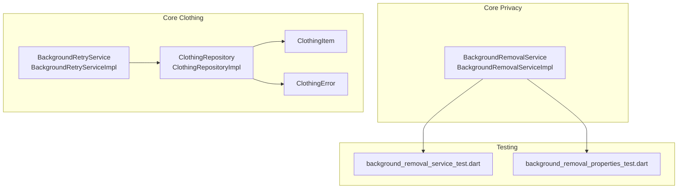
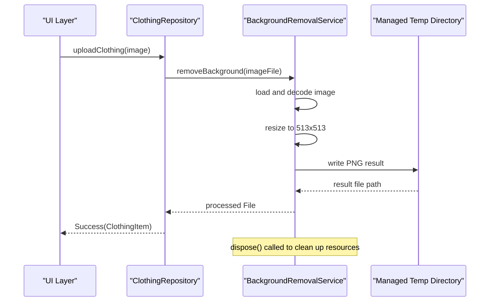
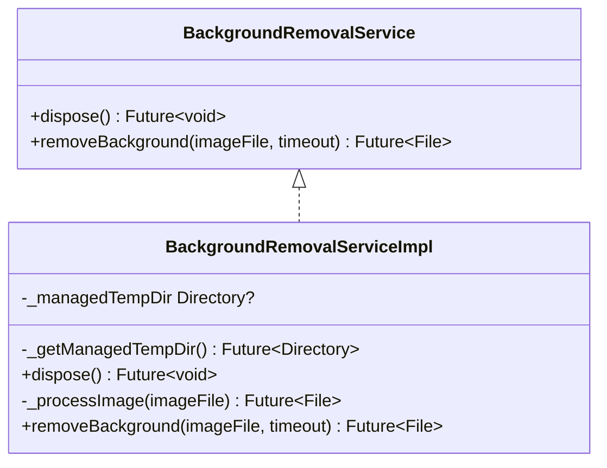
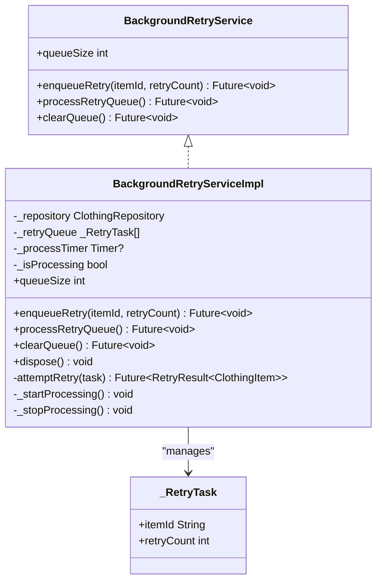
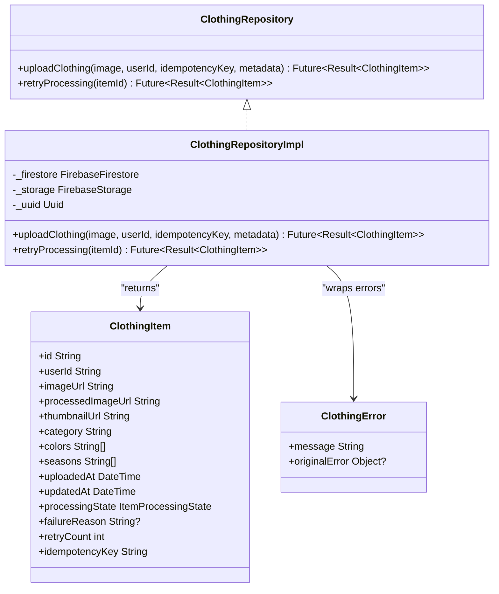
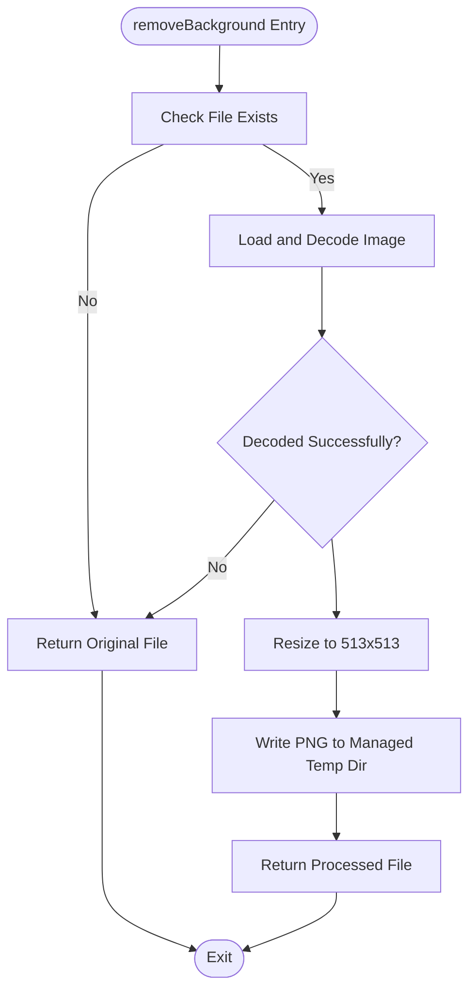
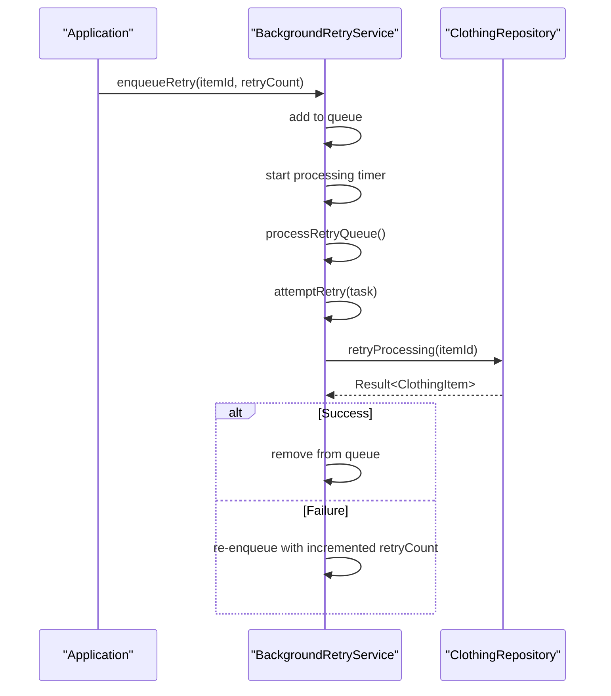
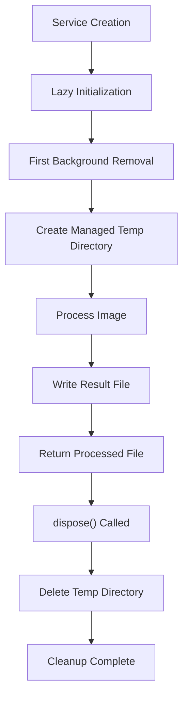
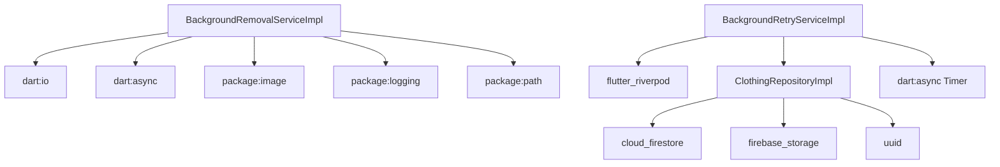

# Background Removal Service

<cite>
**Referenced Files in This Document**
- [background_removal_service.dart](file://lib/core/privacy/background_removal_service.dart)
- [background_retry_service.dart](file://lib/core/clothing/background_retry_service.dart)
- [background_removal_service_test.dart](file://test/background_removal_service_test.dart)
- [background_removal_properties_test.dart](file://test/background_removal_properties_test.dart)
- [clothing_repository.dart](file://lib/core/clothing/clothing_repository.dart)
- [clothing_item.dart](file://lib/core/clothing/models/clothing_item.dart)
- [clothing_error.dart](file://lib/core/clothing/models/clothing_error.dart)
</cite>

## Update Summary
**Changes Made**
- Enhanced documentation to reflect the new dispose() method for resource management
- Updated lifecycle management section to cover lazy initialization and automatic cleanup
- Added detailed coverage of temporary directory management improvements
- Updated architecture diagrams to show proper resource cleanup flow
- Enhanced troubleshooting guide with dispose() best practices

## Table of Contents
1. [Introduction](#introduction)
2. [Project Structure](#project-structure)
3. [Core Components](#core-components)
4. [Architecture Overview](#architecture-overview)
5. [Detailed Component Analysis](#detailed-component-analysis)
6. [Lifecycle Management and Resource Cleanup](#lifecycle-management-and-resource-cleanup)
7. [Dependency Analysis](#dependency-analysis)
8. [Performance Considerations](#performance-considerations)
9. [Troubleshooting Guide](#troubleshooting-guide)
10. [Conclusion](#conclusion)

## Introduction
This document describes the Background Removal Service within the StyleSync application. The service removes backgrounds from clothing images using on-device TensorFlow Lite processing for privacy and offline capability. It includes robust error handling, timeout protection, lifecycle management with proper resource cleanup, and integration points with the broader digital closet management system. The implementation currently simulates background removal by resizing images to the model input size while preserving transparency and returning results as PNG files.

## Project Structure
The Background Removal Service resides in the privacy-focused core module alongside retry mechanisms for failed processing. It integrates with the clothing repository and related models to form a cohesive digital closet workflow.

**Diagram sources**
- [background_removal_service.dart](file://lib/core/privacy/background_removal_service.dart#L1-L144)
- [background_retry_service.dart](file://lib/core/clothing/background_retry_service.dart#L1-L235)
- [clothing_repository.dart](file://lib/core/clothing/clothing_repository.dart#L1-L506)
- [background_removal_service_test.dart](file://test/background_removal_service_test.dart#L1-L184)
- [background_removal_properties_test.dart](file://test/background_removal_properties_test.dart#L1-L129)

**Section sources**
- [background_removal_service.dart](file://lib/core/privacy/background_removal_service.dart#L1-L144)
- [background_retry_service.dart](file://lib/core/clothing/background_retry_service.dart#L1-L235)
- [clothing_repository.dart](file://lib/core/clothing/clothing_repository.dart#L1-L506)

## Core Components
- BackgroundRemovalService: Abstract interface defining background removal behavior with timeout and fallback semantics, plus lifecycle management through dispose().
- BackgroundRemovalServiceImpl: Concrete implementation that loads images, resizes to model input dimensions (513x513), preserves transparency, writes results to a managed temporary directory as PNG files, and provides proper resource cleanup.
- BackgroundRetryService: Abstract interface for retrying failed processing with exponential backoff and jitter.
- BackgroundRetryServiceImpl: In-memory queue-based implementation with periodic processing, maximum retry limits, concurrency guards, and proper resource cleanup.
- ClothingRepository: Repository for clothing item operations, including upload and retry processing flows.
- ClothingItem and ClothingError: Data models and error types supporting the retry and processing pipeline.

**Section sources**
- [background_removal_service.dart](file://lib/core/privacy/background_removal_service.dart#L21-L48)
- [background_removal_service.dart](file://lib/core/privacy/background_removal_service.dart#L50-L144)
- [background_retry_service.dart](file://lib/core/clothing/background_retry_service.dart#L45-L63)
- [background_retry_service.dart](file://lib/core/clothing/background_retry_service.dart#L69-L206)
- [clothing_repository.dart](file://lib/core/clothing/clothing_repository.dart#L43-L101)
- [clothing_item.dart](file://lib/core/clothing/models/clothing_item.dart#L4-L259)
- [clothing_error.dart](file://lib/core/clothing/models/clothing_error.dart#L1-L208)

## Architecture Overview
The Background Removal Service operates within the Business Logic Layer and interacts with the Data Layer through the ClothingRepository. The design supports on-device processing for privacy and offline capability, with fallback behavior on errors, timeouts, and proper resource lifecycle management.

**Diagram sources**
- [background_removal_service.dart](file://lib/core/privacy/background_removal_service.dart#L113-L142)
- [clothing_repository.dart](file://lib/core/clothing/clothing_repository.dart#L156-L231)

## Detailed Component Analysis

### BackgroundRemovalService and BackgroundRemovalServiceImpl
- Purpose: Remove backgrounds from clothing images using on-device TensorFlow Lite for privacy and offline capability.
- Key behaviors:
  - Validates input file existence; returns original file if missing.
  - Decodes images using the image package; returns original file if decoding fails.
  - Resizes images to 513x513 for model input.
  - Preserves transparency and writes results as PNG files.
  - Manages a managed temporary directory for processed files with lazy initialization.
  - Applies a configurable timeout; on timeout or other errors, returns the original file.
  - Provides a dispose method to clean up managed temporary directories and release resources.

**Diagram sources**
- [background_removal_service.dart](file://lib/core/privacy/background_removal_service.dart#L21-L48)
- [background_removal_service.dart](file://lib/core/privacy/background_removal_service.dart#L50-L144)

**Section sources**
- [background_removal_service.dart](file://lib/core/privacy/background_removal_service.dart#L7-L48)
- [background_removal_service.dart](file://lib/core/privacy/background_removal_service.dart#L50-L144)

### BackgroundRetryService and BackgroundRetryServiceImpl
- Purpose: Automatically retry failed processing with exponential backoff and jitter.
- Key behaviors:
  - Enqueues items for retry with current retry count.
  - Periodic processing loop (every 30 seconds) attempts retries.
  - Calculates backoff delay with exponential growth and jitter.
  - Maintains an in-memory queue with maximum retry limits.
  - Prevents overlapping processing runs with a concurrency guard.
  - Disposes timers and clears queues on shutdown.

**Diagram sources**
- [background_retry_service.dart](file://lib/core/clothing/background_retry_service.dart#L45-L63)
- [background_retry_service.dart](file://lib/core/clothing/background_retry_service.dart#L69-L206)
- [background_retry_service.dart](file://lib/core/clothing/background_retry_service.dart#L209-L220)

**Section sources**
- [background_retry_service.dart](file://lib/core/clothing/background_retry_service.dart#L41-L63)
- [background_retry_service.dart](file://lib/core/clothing/background_retry_service.dart#L69-L206)

### Integration with ClothingRepository and Models
- ClothingRepository defines upload and retry processing operations.
- ClothingItem encapsulates item metadata, processing state, and retry counts.
- ClothingError provides typed error categories for robust error handling.

**Diagram sources**
- [clothing_repository.dart](file://lib/core/clothing/clothing_repository.dart#L43-L101)
- [clothing_repository.dart](file://lib/core/clothing/clothing_repository.dart#L107-L481)
- [clothing_item.dart](file://lib/core/clothing/models/clothing_item.dart#L4-L259)
- [clothing_error.dart](file://lib/core/clothing/models/clothing_error.dart#L2-L10)

**Section sources**
- [clothing_repository.dart](file://lib/core/clothing/clothing_repository.dart#L43-L101)
- [clothing_item.dart](file://lib/core/clothing/models/clothing_item.dart#L4-L259)
- [clothing_error.dart](file://lib/core/clothing/models/clothing_error.dart#L1-L208)

### Background Removal Processing Flow
The service processes images through a controlled pipeline with error handling, timeout protection, and proper resource management.

**Diagram sources**
- [background_removal_service.dart](file://lib/core/privacy/background_removal_service.dart#L113-L142)
- [background_removal_service.dart](file://lib/core/privacy/background_removal_service.dart#L80-L111)

**Section sources**
- [background_removal_service.dart](file://lib/core/privacy/background_removal_service.dart#L80-L111)
- [background_removal_service_test.dart](file://test/background_removal_service_test.dart#L29-L78)

### Retry Processing Flow
The retry service manages failed items with exponential backoff and jitter, preventing overlapping processing runs.

**Diagram sources**
- [background_retry_service.dart](file://lib/core/clothing/background_retry_service.dart#L94-L134)
- [background_retry_service.dart](file://lib/core/clothing/background_retry_service.dart#L151-L175)
- [clothing_repository.dart](file://lib/core/clothing/clothing_repository.dart#L444-L480)

**Section sources**
- [background_retry_service.dart](file://lib/core/clothing/background_retry_service.dart#L94-L134)
- [background_retry_service.dart](file://lib/core/clothing/background_retry_service.dart#L151-L175)
- [clothing_repository.dart](file://lib/core/clothing/clothing_repository.dart#L444-L480)

## Lifecycle Management and Resource Cleanup

### Enhanced Resource Management
The Background Removal Service now implements comprehensive lifecycle management with proper resource cleanup:

- **Lazy Initialization**: The managed temporary directory is created only when first accessed, reducing unnecessary resource allocation.
- **Automatic Cleanup**: The dispose() method automatically deletes all temporary files and releases system resources.
- **Error-Resilient Cleanup**: Cleanup operations handle exceptions gracefully without crashing the application.
- **Thread-Safe Access**: The managed directory is safely accessed across multiple operations.

### Resource Lifecycle Flow

**Diagram sources**
- [background_removal_service.dart](file://lib/core/privacy/background_removal_service.dart#L59-L78)

### Best Practices for Resource Management
- Always call dispose() when the service is no longer needed
- Handle exceptions during cleanup gracefully
- Ensure temporary directories are cleaned up even if processing fails
- Monitor resource usage in long-running applications

**Section sources**
- [background_removal_service.dart](file://lib/core/privacy/background_removal_service.dart#L55-L78)
- [background_removal_service_test.dart](file://test/background_removal_service_test.dart#L14-L16)

## Dependency Analysis
- BackgroundRemovalServiceImpl depends on:
  - Dart io and async for file operations and timeouts.
  - image package for decoding, resizing, and encoding images.
  - logging for structured logging.
  - path for safe filename construction.
  - Temporary directory management for processed files.
- BackgroundRetryServiceImpl depends on:
  - Riverpod for dependency injection and provider lifecycle.
  - ClothingRepository for retry operations.
  - Timer for periodic processing.
  - Random for jitter in backoff delays.
- ClothingRepositoryImpl depends on:
  - Firebase Firestore and Storage for persistence.
  - UUID for generating identifiers.
  - Result wrapper types for consistent error handling.

**Diagram sources**
- [background_removal_service.dart](file://lib/core/privacy/background_removal_service.dart#L1-L6)
- [background_retry_service.dart](file://lib/core/clothing/background_retry_service.dart#L1-L9)
- [clothing_repository.dart](file://lib/core/clothing/clothing_repository.dart#L1-L10)

**Section sources**
- [background_removal_service.dart](file://lib/core/privacy/background_removal_service.dart#L1-L6)
- [background_retry_service.dart](file://lib/core/clothing/background_retry_service.dart#L1-L9)
- [clothing_repository.dart](file://lib/core/clothing/clothing_repository.dart#L1-L10)

## Performance Considerations
- Image resizing to 513x513 ensures consistent model input size and reduces processing overhead.
- PNG encoding preserves transparency for downstream processing steps.
- Managed temporary directory cleanup prevents disk accumulation; dispose should be called to release resources.
- Timeout protection avoids blocking operations; on timeout or errors, the service falls back to the original file.
- Retry mechanism uses exponential backoff with jitter to avoid thundering herd effects and reduce contention.
- Lazy initialization reduces memory footprint until the service is actually needed.
- Automatic resource cleanup prevents memory leaks and disk space accumulation.

## Troubleshooting Guide
Common issues and resolutions:
- Non-existent input file: The service returns the original file unchanged.
- Invalid image data: Decoding failures cause the service to return the original file.
- Timeout during processing: The service logs a warning and returns the original file.
- Errors during processing: The service logs a severe error and returns the original file.
- Temporary directory cleanup: Ensure dispose is called to clean up managed temporary directories.
- Resource leaks: Always call dispose() when finished with the service to prevent memory and disk leaks.
- Lazy initialization issues: The managed directory is created automatically on first use; manual creation is not required.
- Exception handling: Cleanup operations handle exceptions gracefully without affecting application stability.

**Section sources**
- [background_removal_service.dart](file://lib/core/privacy/background_removal_service.dart#L118-L142)
- [background_removal_service_test.dart](file://test/background_removal_service_test.dart#L18-L27)
- [background_removal_service_test.dart](file://test/background_removal_service_test.dart#L155-L181)

## Conclusion
The Background Removal Service provides a privacy-preserving, offline-capable solution for background removal using on-device TensorFlow Lite processing. Its enhanced resource management capabilities, including lazy initialization and automatic cleanup, ensure efficient memory usage and prevent resource leaks. The robust error handling, timeout protection, and integration with the retry system ensure reliable operation within the StyleSync digital closet workflow. The service is designed for extensibility, allowing future integration of actual segmentation models while maintaining backward compatibility and strong fallback behavior. Proper lifecycle management through the dispose() method ensures that applications can safely manage resources and prevent memory leaks in long-running scenarios.