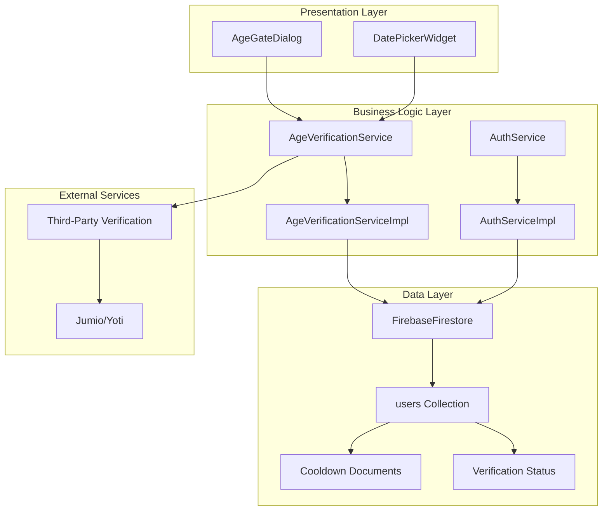
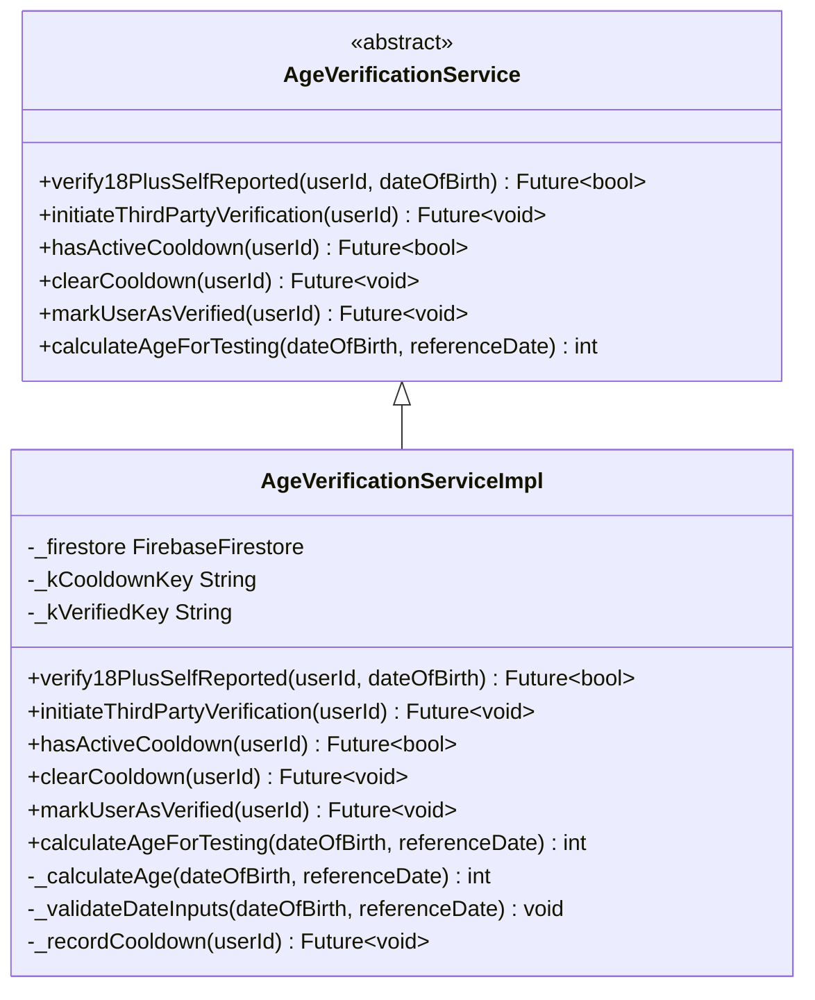
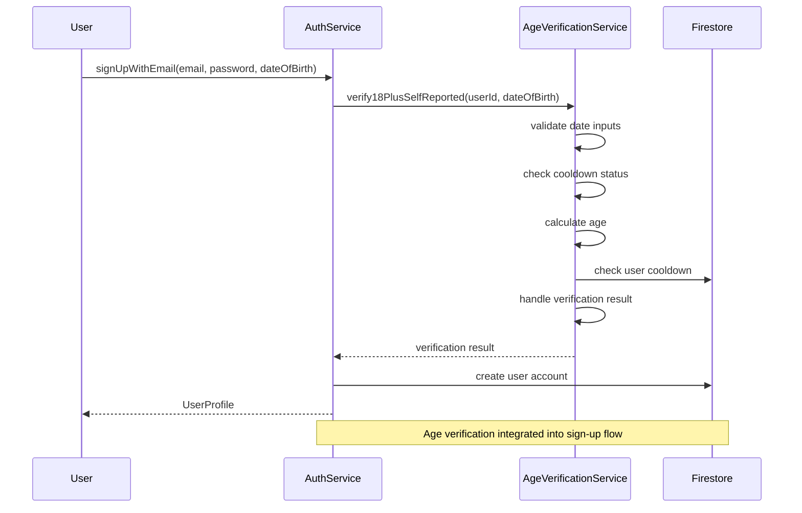
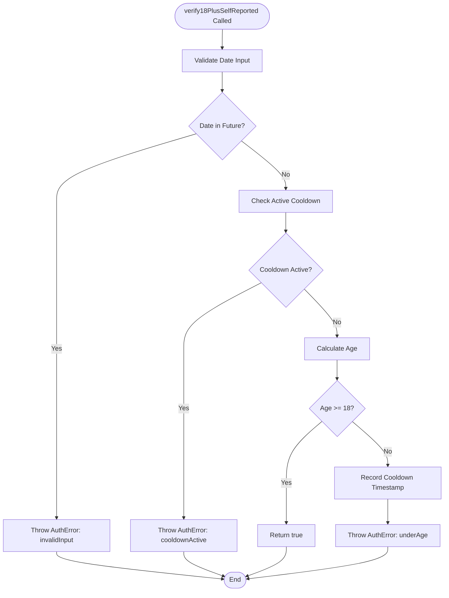
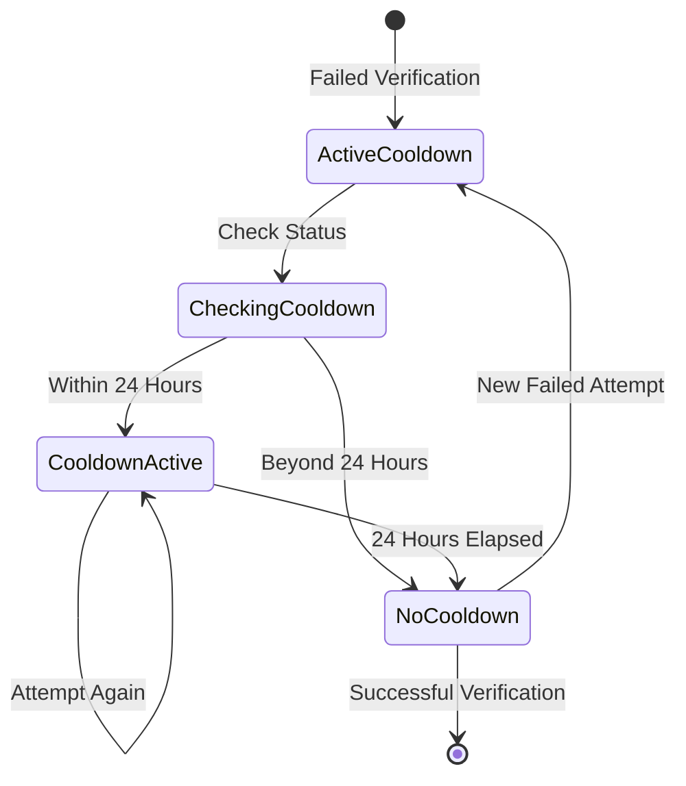
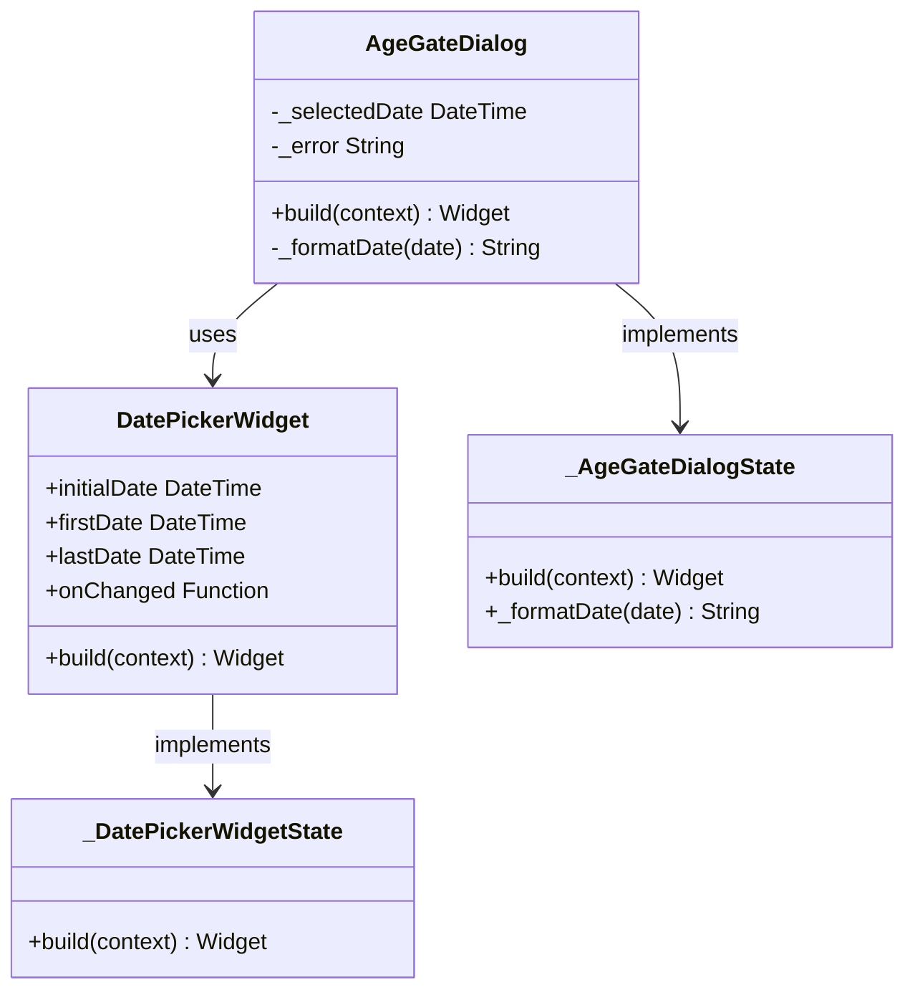
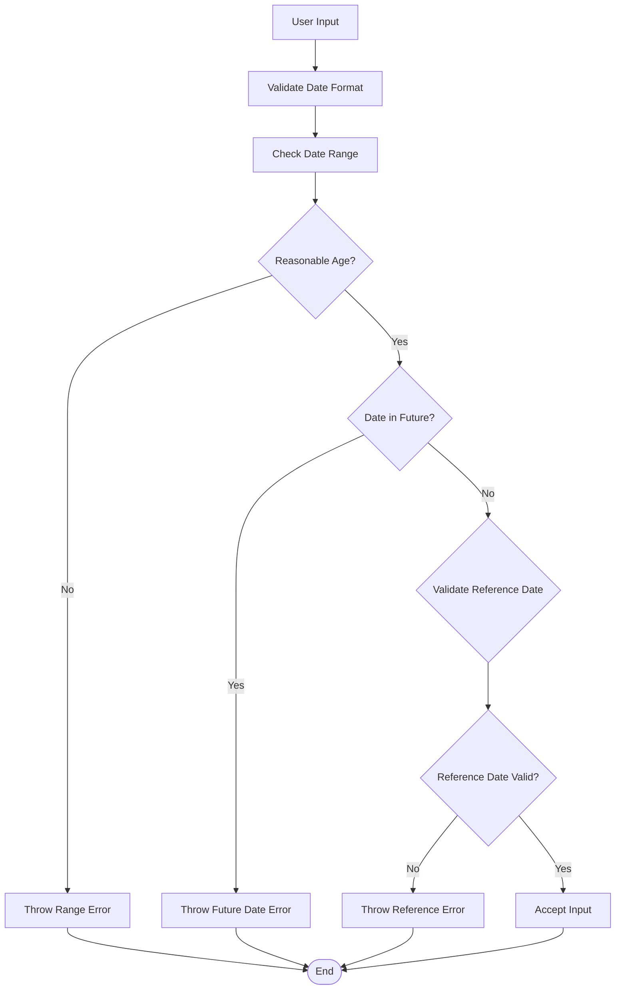
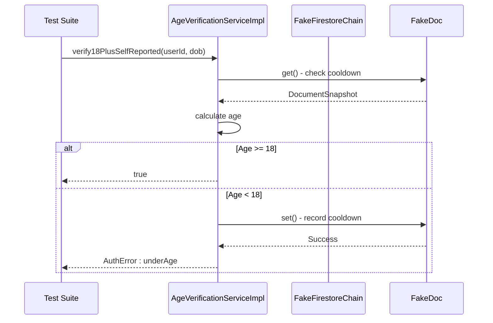
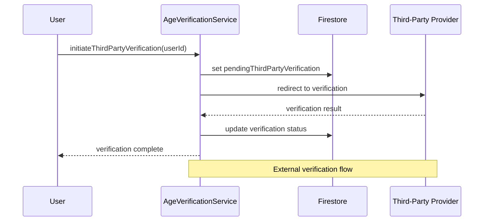

# Age Verification Service

<cite>
**Referenced Files in This Document**
- [age_verification_service.dart](file://lib/core/auth/age_verification_service.dart)
- [auth_error.dart](file://lib/core/auth/models/auth_error.dart)
- [age_gate.dart](file://lib/features/auth/widgets/age_gate.dart)
- [auth_service.dart](file://lib/core/auth/auth_service.dart)
- [age_verification_service_test.dart](file://test/core/auth/age_verification_service_test.dart)
- [age_verification_service_db_test.dart](file://test/core/auth/age_verification_service_db_test.dart)
- [age_gate_test.dart](file://test/features/auth/widgets/age_gate_test.dart)
</cite>

## Table of Contents
1. [Introduction](#introduction)
2. [System Architecture](#system-architecture)
3. [Core Components](#core-components)
4. [Age Verification Logic](#age-verification-logic)
5. [User Interface Components](#user-interface-components)
6. [Error Handling and Validation](#error-handling-and-validation)
7. [Testing Strategy](#testing-strategy)
8. [Integration Patterns](#integration-patterns)
9. [Security Considerations](#security-considerations)
10. [Performance Analysis](#performance-analysis)
11. [Troubleshooting Guide](#troubleshooting-guide)
12. [Conclusion](#conclusion)

## Introduction

The Age Verification Service is a critical component of the StyleSync application designed to enforce legal age restrictions and ensure compliance with age-appropriate content policies. This service implements robust age verification mechanisms with multiple layers of validation, including self-reported date of birth verification, third-party identity verification integration, and session-based cooldown protection against brute-force attacks.

The service operates as part of a comprehensive authentication and authorization framework, working alongside the main authentication service to provide seamless user onboarding while maintaining strict age verification standards. It leverages Firebase Firestore for persistent storage of verification states and cooldown periods, ensuring reliable operation across all supported platforms.

## System Architecture

The Age Verification Service follows a layered architecture pattern with clear separation of concerns between presentation, business logic, and data persistence layers.

**Diagram sources**
- [age_verification_service.dart](file://lib/core/auth/age_verification_service.dart#L10-L45)
- [auth_service.dart](file://lib/core/auth/auth_service.dart#L11-L71)
- [age_gate.dart](file://lib/features/auth/widgets/age_gate.dart#L7-L89)

The architecture ensures loose coupling between components while maintaining clear data flow patterns. The service exposes a clean abstract interface for age verification operations while implementing robust business logic for validation and state management.

## Core Components

### AgeVerificationService Interface

The AgeVerificationService defines the contract for age verification operations with six primary methods:

**Diagram sources**
- [age_verification_service.dart](file://lib/core/auth/age_verification_service.dart#L10-L45)
- [age_verification_service.dart](file://lib/core/auth/age_verification_service.dart#L48-L251)

The implementation provides comprehensive age verification capabilities with built-in validation, error handling, and persistence mechanisms.

### Authentication Service Integration

The AuthService integrates age verification into the broader authentication flow, ensuring that age requirements are enforced during user registration and login processes.

**Diagram sources**
- [auth_service.dart](file://lib/core/auth/auth_service.dart#L114-L168)
- [age_verification_service.dart](file://lib/core/auth/age_verification_service.dart#L63-L94)

**Section sources**
- [age_verification_service.dart](file://lib/core/auth/age_verification_service.dart#L10-L45)
- [auth_service.dart](file://lib/core/auth/auth_service.dart#L11-L71)

## Age Verification Logic

### Self-Reported Verification Process

The primary age verification method relies on self-reported date of birth with comprehensive validation and safety mechanisms:

**Diagram sources**
- [age_verification_service.dart](file://lib/core/auth/age_verification_service.dart#L63-L94)

The verification process includes multiple validation layers to ensure accuracy and prevent abuse:

1. **Input Validation**: Prevents future dates and unreasonable age ranges
2. **Cooldown Protection**: Implements 24-hour cooldown for failed attempts
3. **Age Calculation**: Uses precise date arithmetic accounting for leap years and month boundaries
4. **Persistence**: Records verification attempts and results in Firestore

### Cooldown Management System

The cooldown system provides essential protection against brute-force attacks while maintaining user experience:

**Diagram sources**
- [age_verification_service.dart](file://lib/core/auth/age_verification_service.dart#L187-L215)

**Section sources**
- [age_verification_service.dart](file://lib/core/auth/age_verification_service.dart#L63-L215)

## User Interface Components

### Age Gate Dialog

The AgeGateDialog provides an intuitive user interface for age verification during the sign-up process:

**Diagram sources**
- [age_gate.dart](file://lib/features/auth/widgets/age_gate.dart#L7-L89)
- [age_gate.dart](file://lib/features/auth/widgets/age_gate.dart#L92-L144)

The dialog component includes sophisticated date selection capabilities with validation and error handling:

- **Date Range Validation**: Restricts selection to reasonable birth dates (1900-present)
- **Real-time Validation**: Provides immediate feedback on age eligibility
- **Error Messaging**: Clear user-friendly error messages for invalid selections
- **Responsive Design**: Adapts to various screen sizes and orientations

**Section sources**
- [age_gate.dart](file://lib/features/auth/widgets/age_gate.dart#L1-L153)

## Error Handling and Validation

### Comprehensive Error Management

The service implements a robust error handling system with specific error codes for different failure scenarios:

| Error Code | Description | Triggering Condition |
|------------|-------------|---------------------|
| `invalid-input` | Invalid date format or future date | Date of birth in the future or invalid input |
| `cooldown-active` | Too many failed attempts | User within 24-hour cooldown period |
| `under-age` | User is not 18+ | Age verification fails (age < 18) |
| `third-party-initiation-failed` | Verification initiation error | Firestore write failure during appeal process |
| `clear-cooldown-failed` | Cooldown removal error | Firestore write failure during cooldown clearing |
| `mark-verified-failed` | Verification marking error | Firestore write failure during verification completion |

### Input Validation Rules

The service enforces strict input validation to prevent abuse and ensure data integrity:

**Diagram sources**
- [age_verification_service.dart](file://lib/core/auth/age_verification_service.dart#L113-L155)

**Section sources**
- [auth_error.dart](file://lib/core/auth/models/auth_error.dart#L21-L70)
- [age_verification_service.dart](file://lib/core/auth/age_verification_service.dart#L113-L155)

## Testing Strategy

### Unit Testing Approach

The service employs comprehensive testing strategies covering both logic validation and database interactions:

#### Logic Testing

The logic tests focus on age calculation accuracy and input validation:

| Test Category | Test Cases | Expected Outcomes |
|---------------|------------|-------------------|
| Age Calculation | Exact 18th birthday, Birthday passed, Birthday not yet occurred | Precise age calculations within 1-day tolerance |
| Input Validation | Future dates, Unrealistic ages (>150), Prehistoric dates (<1900) | Appropriate ArgumentError exceptions |
| Boundary Conditions | Edge cases around 18th birthday, Leap year calculations | Correct handling of date boundary conditions |

#### Database Interaction Testing

The database tests simulate Firestore interactions using fake implementations:

**Diagram sources**
- [age_verification_service_db_test.dart](file://test/core/auth/age_verification_service_db_test.dart#L80-L133)

**Section sources**
- [age_verification_service_test.dart](file://test/core/auth/age_verification_service_test.dart#L1-L129)
- [age_verification_service_db_test.dart](file://test/core/auth/age_verification_service_db_test.dart#L1-L160)
- [age_gate_test.dart](file://test/features/auth/widgets/age_gate_test.dart#L1-L98)

## Integration Patterns

### Third-Party Verification Integration

The service supports integration with external identity verification providers for enhanced assurance:

**Diagram sources**
- [age_verification_service.dart](file://lib/core/auth/age_verification_service.dart#L171-L184)

### State Management Integration

The service integrates seamlessly with the application's state management system:

| State Property | Purpose | Persistence Mechanism |
|----------------|---------|----------------------|
| `age_verification_cooldown` | Tracks cooldown timestamps | Firestore field with server timestamp |
| `is18PlusVerified` | Stores verification completion status | Firestore boolean flag |
| `pendingThirdPartyVerification` | Indicates appeal process initiation | Firestore boolean flag |
| `thirdPartyVerificationRequestedAt` | Timestamp of appeal initiation | Firestore server timestamp |

**Section sources**
- [age_verification_service.dart](file://lib/core/auth/age_verification_service.dart#L56-L61)
- [age_verification_service.dart](file://lib/core/auth/age_verification_service.dart#L171-L184)

## Security Considerations

### Defense-in-Depth Strategy

The age verification service implements multiple security layers to prevent abuse and ensure accurate verification:

1. **Input Sanitization**: Comprehensive validation of all user inputs
2. **Rate Limiting**: 24-hour cooldown period prevents brute-force attacks
3. **Fail-Closed Design**: Network errors trigger conservative behavior (assume cooldown active)
4. **Audit Logging**: All verification attempts are logged for monitoring
5. **Privacy Protection**: No personal identification data is stored locally

### Data Protection Measures

- **Minimal Data Collection**: Only date of birth is collected for verification
- **No Local Storage**: Verification results are not cached locally
- **Encrypted Communication**: All data transmitted via Firebase secure connections
- **Access Controls**: Firestore security rules govern data access

**Section sources**
- [age_verification_service.dart](file://lib/core/auth/age_verification_service.dart#L163-L168)
- [age_verification_service.dart](file://lib/core/auth/age_verification_service.dart#L208-L215)

## Performance Analysis

### Computational Complexity

The age verification service demonstrates optimal performance characteristics:

- **Time Complexity**: O(1) for all operations (constant-time age calculation)
- **Space Complexity**: O(1) for memory usage (single date object processing)
- **Network Calls**: Minimal Firestore operations (1-2 per verification attempt)

### Scalability Considerations

The service is designed for horizontal scalability:

- **Firestore Indexing**: Efficient queries on user documents
- **Caching Strategy**: Client-side caching of verification results
- **Batch Operations**: Support for bulk verification operations
- **Monitoring**: Built-in logging for performance tracking

### Optimization Opportunities

Potential improvements include:

1. **Client-Side Caching**: Store recent verification results to reduce network calls
2. **Background Processing**: Offload verification to background tasks for better UX
3. **Precomputation**: Cache commonly accessed date ranges for faster validation

## Troubleshooting Guide

### Common Issues and Solutions

| Issue | Symptoms | Solution |
|-------|----------|----------|
| Verification Fails Unexpectedly | AuthError: underAge despite correct age | Check date format and timezone settings |
| Cooldown Not Clearing | Still shows cooldown after 24 hours | Verify Firestore permissions and network connectivity |
| Third-Party Verification Fails | AuthError: third-party-initiation-failed | Check external service availability and integration |
| UI Not Responding | AgeGateDialog freezes during selection | Verify Flutter widget tree rendering |

### Diagnostic Steps

1. **Enable Logging**: Check application logs for detailed error messages
2. **Network Diagnostics**: Verify Firestore connectivity and permissions
3. **Input Validation**: Confirm date format matches expected ISO 8601 format
4. **State Inspection**: Examine Firestore documents for verification state

### Error Code Reference

For comprehensive error handling, refer to the AuthErrorCode constants for appropriate user messaging and retry logic implementation.

**Section sources**
- [auth_error.dart](file://lib/core/auth/models/auth_error.dart#L21-L70)
- [age_verification_service.dart](file://lib/core/auth/age_verification_service.dart#L163-L168)

## Conclusion

The Age Verification Service represents a robust, secure, and scalable solution for enforcing age restrictions in the StyleSync application. Its comprehensive design addresses both functional requirements and security considerations while maintaining excellent user experience.

Key strengths of the implementation include:

- **Multi-layered Validation**: Combines input sanitization, business logic validation, and persistence checks
- **Security-First Design**: Implements fail-closed behavior and comprehensive error handling
- **Extensible Architecture**: Supports integration with third-party verification providers
- **Comprehensive Testing**: Thorough test coverage ensures reliability and maintainability
- **Performance Optimization**: Minimal computational overhead and efficient database operations

The service successfully balances security requirements with user experience, providing a foundation for responsible age-appropriate content delivery while supporting future expansion and enhancement.