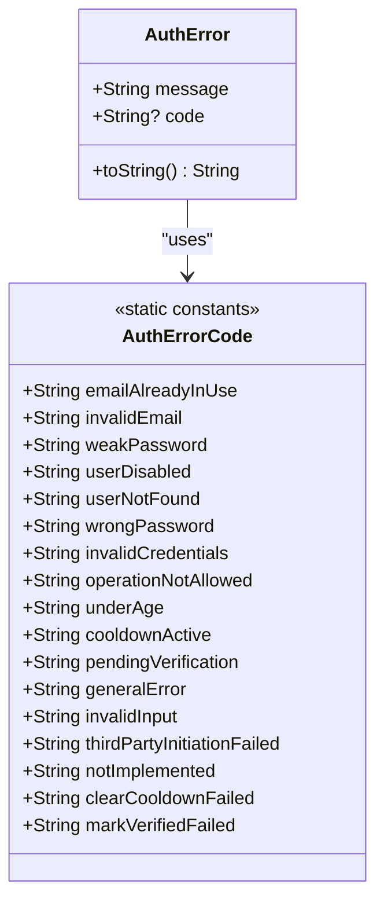
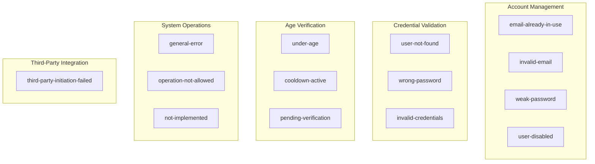
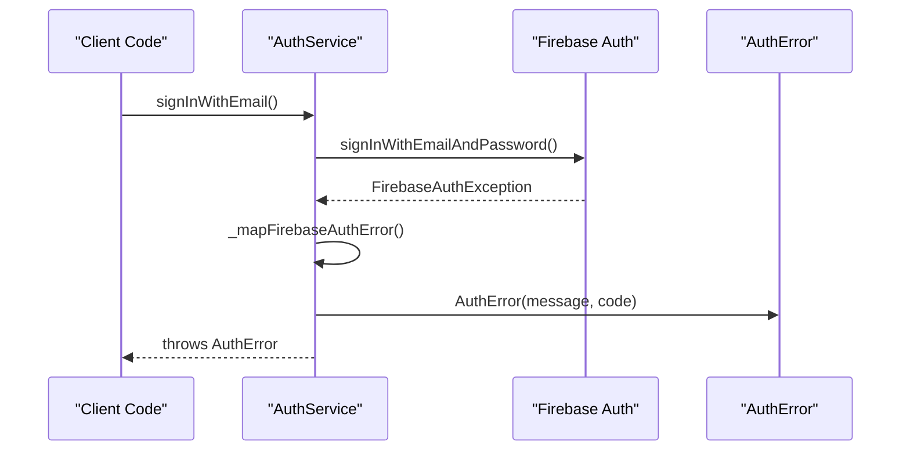

# AuthError Model Documentation

<cite>
**Referenced Files in This Document**
- [auth_error.dart](file://lib/core/auth/models/auth_error.dart)
- [auth_service.dart](file://lib/core/auth/auth_service.dart)
- [auth_providers.dart](file://lib/core/auth/auth_providers.dart)
- [age_verification_service.dart](file://lib/core/auth/age_verification_service.dart)
- [auth_models_test.dart](file://test/core/auth/auth_models_test.dart)
- [age_verification_service_test.dart](file://test/core/auth/age_verification_service_test.dart)
- [age_verification_service_db_test.dart](file://test/core/auth/age_verification_service_db_test.dart)
- [age_gate.dart](file://lib/features/auth/widgets/age_gate.dart)
</cite>

## Table of Contents
1. [Introduction](#introduction)
2. [Model Architecture](#model-architecture)
3. [Core Components](#core-components)
4. [Error Code System](#error-code-system)
5. [Integration Patterns](#integration-patterns)
6. [Usage Examples](#usage-examples)
7. [Testing Strategy](#testing-strategy)
8. [Security Considerations](#security-considerations)
9. [Best Practices](#best-practices)
10. [Troubleshooting Guide](#troubleshooting-guide)

## Introduction

The AuthError model is a fundamental component of StyleSync's authentication system, providing a structured and consistent approach to handling authentication-related errors throughout the application. This model serves as a bridge between Firebase Authentication exceptions and the application's user interface, ensuring that error messages are both user-friendly and machine-readable.

The AuthError model implements the Exception interface and provides two primary pieces of information: a human-readable message and an optional error code. This dual approach enables both user-facing error display and programmatic error handling, which is crucial for maintaining a robust authentication experience.

## Model Architecture

The AuthError model follows a simple yet powerful design pattern that separates concerns between error presentation and error identification. The architecture consists of two main components working in tandem:



**Diagram sources**
- [auth_error.dart](file://lib/core/auth/models/auth_error.dart#L2-L85)

The model's design promotes consistency across the entire authentication system by providing standardized error handling mechanisms that can be easily consumed by various layers of the application.

**Section sources**
- [auth_error.dart](file://lib/core/auth/models/auth_error.dart#L1-L86)

## Core Components

### AuthError Class Implementation

The AuthError class serves as the primary error representation in the authentication system. Its implementation focuses on simplicity and effectiveness:

- **Constructor Flexibility**: Supports creation with just a message or with both message and code
- **Immutable Design**: All properties are final, ensuring thread safety and predictable behavior
- **String Representation**: Provides meaningful string output that includes both code and message when available

### Error Code Constants

The AuthErrorCode class provides a centralized registry of all possible authentication error scenarios. These codes serve multiple purposes:

- **Programmatic Handling**: Enable conditional logic based on specific error types
- **Internationalization Support**: Allow translation of user-facing messages while maintaining consistent error codes
- **Analytics Tracking**: Facilitate error monitoring and reporting across the application
- **Security Considerations**: Support account enumeration prevention through unified error responses

**Section sources**
- [auth_error.dart](file://lib/core/auth/models/auth_error.dart#L21-L85)

## Error Code System

The AuthError model employs a comprehensive error code system designed to cover all authentication scenarios while maintaining security best practices:

### Authentication-Specific Codes

The error code system is organized into logical categories that correspond to different authentication operations:



**Diagram sources**
- [auth_error.dart](file://lib/core/auth/models/auth_error.dart#L26-L84)

### Security-First Design

Several error codes are specifically designed to enhance application security:

- **invalid-credentials**: Unifies user-not-found and wrong-password responses to prevent account enumeration attacks
- **cooldown-active**: Implements rate limiting to prevent brute force attempts
- **user-disabled**: Handles disabled accounts without revealing account existence

**Section sources**
- [auth_error.dart](file://lib/core/auth/models/auth_error.dart#L40-L66)

## Integration Patterns

The AuthError model integrates seamlessly with various components of the authentication system through well-defined patterns:

### Service Layer Integration

Authentication services consistently wrap Firebase exceptions in AuthError instances:



**Diagram sources**
- [auth_service.dart](file://lib/core/auth/auth_service.dart#L106-L124)
- [auth_service.dart](file://lib/core/auth/auth_service.dart#L315-L356)

### State Management Integration

The AuthError model works harmoniously with the application's state management system:

- **Error State Propagation**: Errors are captured and propagated through the AuthState system
- **UI Error Display**: Error codes enable localized and contextual error messaging
- **Recovery Mechanisms**: Specific error codes trigger appropriate recovery actions

**Section sources**
- [auth_providers.dart](file://lib/core/auth/auth_providers.dart#L87-L94)
- [auth_providers.dart](file://lib/core/auth/auth_providers.dart#L117-L131)

## Usage Examples

### Basic Error Creation

Creating AuthError instances follows a straightforward pattern that accommodates different use cases:

```dart
// Simple error with message only
final error1 = AuthError('Something went wrong');

// Error with both message and code
final error2 = AuthError('Invalid email address', AuthErrorCode.invalidEmail);

// Error with custom code
final error3 = AuthError('Custom error message', 'CUSTOM-CODE');
```

### Error Handling in Services

Services consistently handle and propagate AuthError instances:

```dart
try {
  await _auth.signInWithEmailAndPassword(email, password);
} on FirebaseAuthException catch (e) {
  throw _mapFirebaseAuthError(e);
}
```

### Error Code Usage Patterns

Different error codes serve specific purposes in the authentication flow:

- **Under-Age Verification**: Triggers age gate dialogs and cooldown mechanisms
- **Invalid Credentials**: Unified response prevents account enumeration
- **Operation Not Allowed**: Handles unsupported authentication methods
- **General Errors**: Catches unexpected exceptions and provides fallback messaging

**Section sources**
- [auth_service.dart](file://lib/core/auth/auth_service.dart#L106-L124)
- [auth_service.dart](file://lib/core/auth/auth_service.dart#L315-L356)

## Testing Strategy

The AuthError model benefits from a comprehensive testing approach that validates both its behavior and integration with the broader authentication system:

### Unit Testing Approach

Individual error creation and behavior testing:

```mermaid
flowchart TD
A[Test AuthError Creation] --> B{Message Only?}
B --> |Yes| C[Verify message property]
B --> |No| D[Verify both message and code]
C --> E[Test toString() format]
D --> E
E --> F[Verify error equality]
```

**Diagram sources**
- [auth_models_test.dart](file://test/core/auth/auth_models_test.dart#L157-L174)

### Integration Testing

End-to-end testing validates error propagation through the authentication pipeline:

- **Service Layer Testing**: Ensures Firebase exceptions are properly mapped
- **State Management Testing**: Verifies error states are correctly handled
- **UI Integration Testing**: Confirms error messages are displayed appropriately

**Section sources**
- [auth_models_test.dart](file://test/core/auth/auth_models_test.dart#L157-L174)
- [age_verification_service_db_test.dart](file://test/core/auth/age_verification_service_db_test.dart#L69-L77)

## Security Considerations

The AuthError model incorporates several security measures to protect user privacy and prevent malicious exploitation:

### Account Enumeration Prevention

The unified `invalid-credentials` error code prevents attackers from determining whether an email address exists in the system by returning the same error message for both missing accounts and incorrect passwords.

### Rate Limiting Implementation

The `cooldown-active` error code enables session-based cooldown periods that prevent brute force attacks while providing clear feedback to legitimate users.

### Privacy Protection

Error messages are designed to be user-friendly while avoiding sensitive information disclosure that could aid attackers in account takeover attempts.

**Section sources**
- [auth_error.dart](file://lib/core/auth/models/auth_error.dart#L50-L54)
- [auth_error.dart](file://lib/core/auth/models/auth_error.dart#L62-L63)

## Best Practices

### Error Code Selection Guidelines

When creating AuthError instances, follow these selection guidelines:

1. **Match Error Type**: Choose the most specific error code that accurately describes the failure
2. **Maintain Consistency**: Use the same error codes across similar failure scenarios
3. **Consider User Impact**: Select error codes that enable appropriate user guidance
4. **Preserve Security**: Avoid revealing sensitive information in error messages

### Message Design Principles

Error messages should be:

- **Clear and Actionable**: Provide users with guidance on how to resolve issues
- **Non-Technical**: Avoid exposing internal implementation details
- **Localized**: Support internationalization for global user bases
- **Context-Specific**: Tailor messages to the specific authentication step where the error occurred

### Integration Patterns

When integrating AuthError with UI components:

- **Consistent Display**: Use the same error display patterns across the application
- **Progressive Disclosure**: Provide detailed error information only when necessary
- **Accessibility**: Ensure error messages are accessible to assistive technologies
- **State Management**: Properly integrate errors into the application's state management system

**Section sources**
- [auth_error.dart](file://lib/core/auth/models/auth_error.dart#L12-L18)
- [auth_providers.dart](file://lib/core/auth/auth_providers.dart#L87-L94)

## Troubleshooting Guide

### Common Error Scenarios

#### Authentication Failures
- **Email Already In Use**: Indicates account registration conflicts
- **Invalid Email**: Signals malformed email address format
- **Weak Password**: Requires stronger password criteria
- **User Disabled**: Account has been administratively disabled

#### Age Verification Issues
- **Under Age**: User is below minimum age requirement
- **Cooldown Active**: Temporary restriction due to failed attempts
- **Pending Verification**: Third-party verification process in progress

#### System Errors
- **General Error**: Unexpected failures requiring investigation
- **Not Implemented**: Feature temporarily unavailable
- **Third-Party Initiation Failed**: External verification service issues

### Debugging Strategies

1. **Log Error Codes**: Capture both error messages and codes for diagnostic purposes
2. **Monitor Frequency**: Track error occurrence patterns to identify systemic issues
3. **User Feedback**: Collect user reports for errors that aren't captured in logs
4. **Security Review**: Regularly review error handling for potential security vulnerabilities

**Section sources**
- [auth_service.dart](file://lib/core/auth/auth_service.dart#L315-L356)
- [age_verification_service.dart](file://lib/core/auth/age_verification_service.dart#L157-L168)