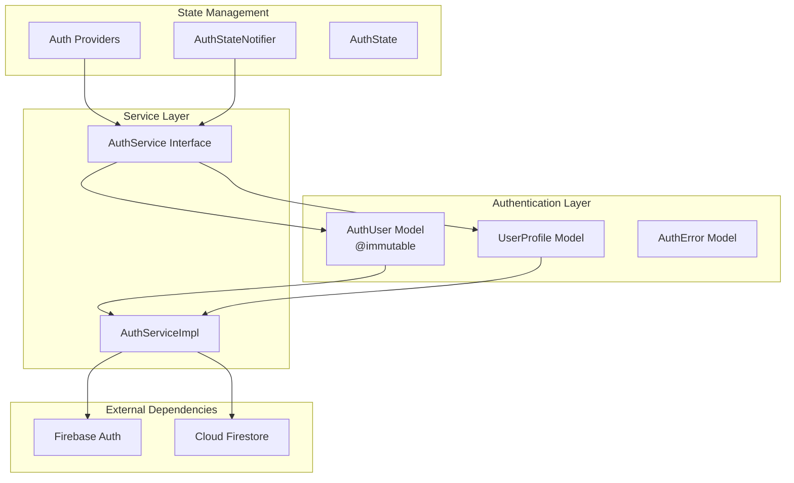
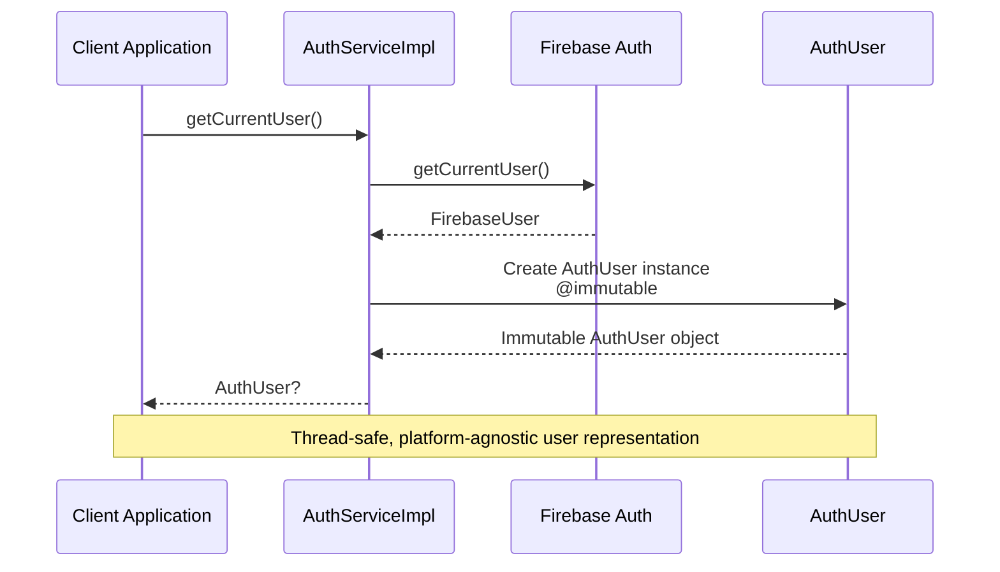
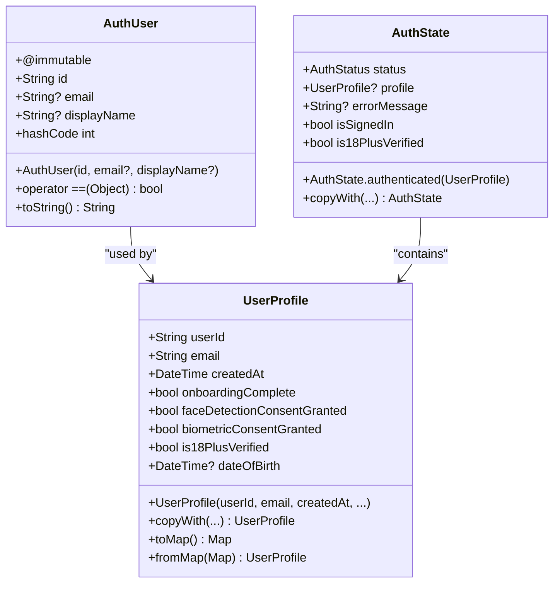
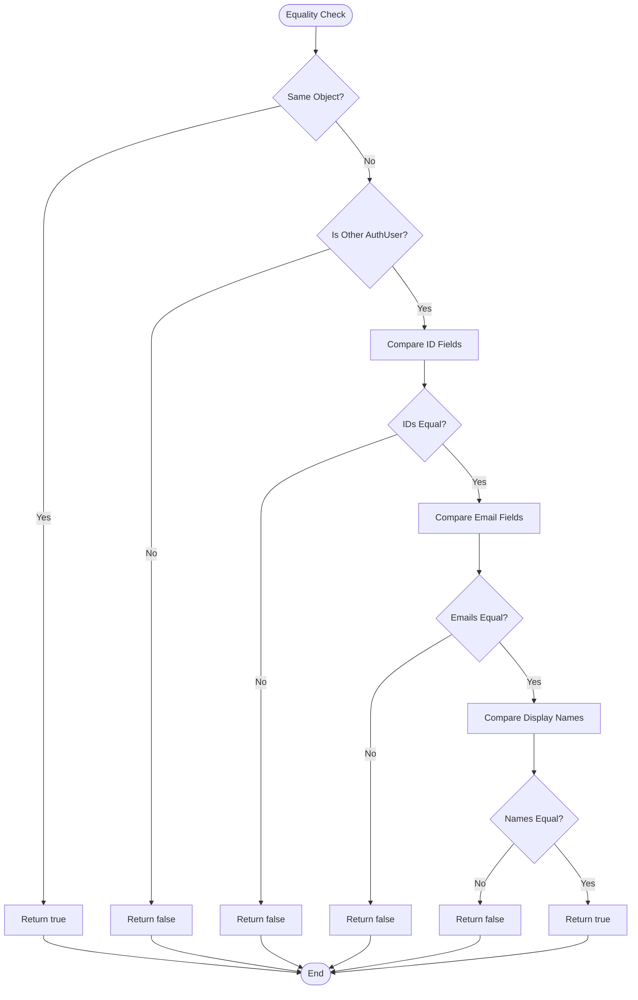
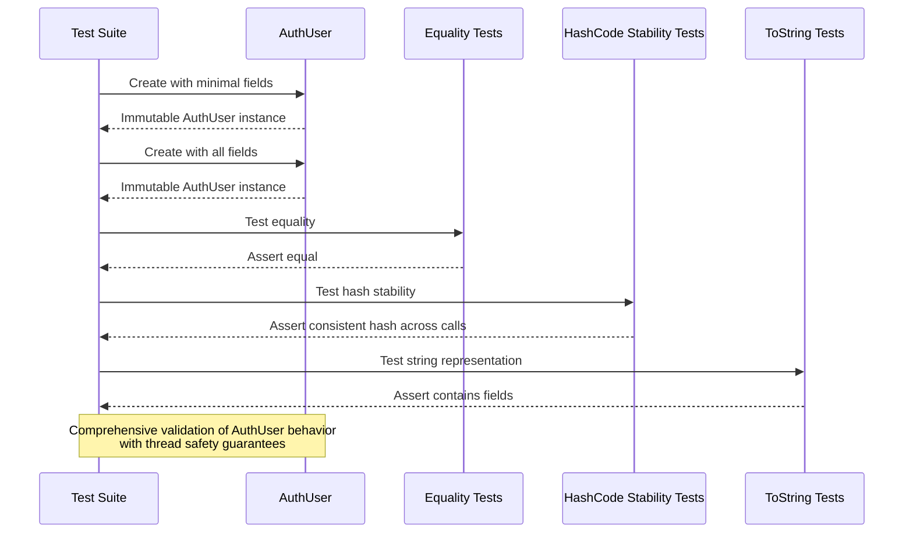

# AuthUser Model

<cite>
**Referenced Files in This Document**
- [auth_user.dart](file://lib/core/auth/models/auth_user.dart)
- [auth_service.dart](file://lib/core/auth/auth_service.dart)
- [auth_providers.dart](file://lib/core/auth/auth_providers.dart)
- [auth_models_test.dart](file://test/core/auth/auth_models_test.dart)
- [user_profile.dart](file://lib/core/auth/models/user_profile.dart)
- [auth_error.dart](file://lib/core/auth/models/auth_error.dart)
</cite>

## Update Summary
**Changes Made**
- Added `@immutable` annotation to AuthUser class for improved thread safety and predictability
- Enhanced testing with stability validation for hashCode consistency
- Updated documentation to reflect immutable design patterns and thread safety benefits

## Table of Contents
1. [Introduction](#introduction)
2. [Project Structure](#project-structure)
3. [Core Components](#core-components)
4. [Architecture Overview](#architecture-overview)
5. [Detailed Component Analysis](#detailed-component-analysis)
6. [Dependency Analysis](#dependency-analysis)
7. [Performance Considerations](#performance-considerations)
8. [Thread Safety and Predictability](#thread-safety-and-predictability)
9. [Troubleshooting Guide](#troubleshooting-guide)
10. [Conclusion](#conclusion)

## Introduction
The AuthUser model is a fundamental data structure in the StyleSync authentication system that provides a platform-agnostic representation of authenticated users. This model serves as a crucial abstraction layer that decouples the application from Firebase Authentication dependencies while maintaining essential user information for authentication workflows.

The AuthUser model focuses on minimal user data requirements, containing only the most essential user attributes needed for authentication operations. By keeping the model lightweight and implementing immutability, the system ensures efficient data transfer, simplified serialization, reduced coupling between components, and improved thread safety.

**Updated** The model now uses the `@immutable` annotation to guarantee thread-safe, predictable behavior across concurrent operations.

## Project Structure
The AuthUser model is part of a larger authentication architecture that follows a clean separation of concerns pattern. The authentication system is organized into distinct layers:



**Diagram sources**
- [auth_user.dart](file://lib/core/auth/models/auth_user.dart#L8-L9)
- [auth_service.dart](file://lib/core/auth/auth_service.dart#L19-L75)
- [auth_providers.dart](file://lib/core/auth/auth_providers.dart#L13-L29)

**Section sources**
- [auth_user.dart](file://lib/core/auth/models/auth_user.dart#L1-L43)
- [auth_service.dart](file://lib/core/auth/auth_service.dart#L1-L401)
- [auth_providers.dart](file://lib/core/auth/auth_providers.dart#L1-L290)

## Core Components

### AuthUser Model Definition
The AuthUser model is designed as a simple, immutable data structure that encapsulates the essential information about an authenticated user. The model prioritizes simplicity and platform independence while providing sufficient information for authentication workflows.

Key characteristics of the AuthUser model:
- **Immutable Design**: Uses `@immutable` annotation and `const` constructors for compile-time optimization
- **Minimal Fields**: Contains only essential user identification data
- **Optional Properties**: Email and display name are nullable for flexibility
- **Platform Agnostic**: Decouples from Firebase-specific implementations
- **Thread Safe**: Guaranteed immutable state prevents race conditions

**Updated** The `@immutable` annotation ensures that once an AuthUser instance is created, its state cannot be modified, providing thread safety and predictable behavior in concurrent environments.

**Section sources**
- [auth_user.dart](file://lib/core/auth/models/auth_user.dart#L8-L24)

### Authentication Service Integration
The AuthUser model integrates seamlessly with the AuthService implementation, serving as the primary return type for authentication operations. The service layer converts Firebase User objects into AuthUser instances, ensuring consistent data representation across the application.



**Diagram sources**
- [auth_service.dart](file://lib/core/auth/auth_service.dart#L89-L98)
- [auth_user.dart](file://lib/core/auth/models/auth_user.dart#L8-L15)

**Section sources**
- [auth_service.dart](file://lib/core/auth/auth_service.dart#L89-L98)
- [auth_providers.dart](file://lib/core/auth/auth_providers.dart#L13-L15)

## Architecture Overview

### Authentication Flow Architecture
The AuthUser model participates in a comprehensive authentication architecture that emphasizes separation of concerns, testability, and thread safety:

```mermaid
graph TD
subgraph "Application Layer"
UI[UI Components]
VM[View Models]
end
subgraph "State Management"
RP[Riverpod Providers]
ASN[AuthStateNotifier]
end
subgraph "Service Layer"
AS[AuthService]
ASI[AuthServiceImpl]
end
subgraph "Data Layer"
AU[AuthUser<br/>@immutable]
UP[UserProfile]
AE[AuthError]
end
subgraph "Infrastructure"
FA[Firebase Auth]
CF[Cloud Firestore]
end
UI --> RP
RP --> ASN
ASN --> AS
AS --> ASI
ASI --> AU
ASI --> UP
ASI --> AE
ASI --> FA
ASI --> CF
AU -.-> UI
UP -.-> UI
AE -.-> UI
```

**Diagram sources**
- [auth_providers.dart](file://lib/core/auth/auth_providers.dart#L13-L290)
- [auth_service.dart](file://lib/core/auth/auth_service.dart#L77-L401)
- [auth_user.dart](file://lib/core/auth/models/auth_user.dart#L8-L24)

### Data Flow Patterns
The AuthUser model follows established patterns for data flow within the authentication system, with enhanced thread safety guarantees:

```mermaid
flowchart LR
subgraph "Input Layer"
FI[Firebase User]
SI[Social Login]
end
subgraph "Transformation Layer"
AT[Auth Transform]
VA[Validation]
end
subgraph "Output Layer"
AU[AuthUser<br/>@immutable]
ST[State Update]
end
FI --> AT
SI --> AT
AT --> VA
VA --> AU
VA --> ST
AU --> ST
style AU fill:#e1f5fe
style ST fill:#f3e5f5
```

**Diagram sources**
- [auth_service.dart](file://lib/core/auth/auth_service.dart#L89-L98)
- [auth_user.dart](file://lib/core/auth/models/auth_user.dart#L8-L24)

**Section sources**
- [auth_service.dart](file://lib/core/auth/auth_service.dart#L77-L401)
- [auth_providers.dart](file://lib/core/auth/auth_providers.dart#L55-L184)

## Detailed Component Analysis

### AuthUser Class Structure
The AuthUser class implements a clean, minimal design pattern optimized for authentication scenarios with enhanced immutability guarantees:



**Diagram sources**
- [auth_user.dart](file://lib/core/auth/models/auth_user.dart#L8-L24)
- [user_profile.dart](file://lib/core/auth/models/user_profile.dart#L7-L162)
- [auth_providers.dart](file://lib/core/auth/auth_providers.dart#L190-L259)

### Equality and HashCode Implementation
The AuthUser model implements proper equality semantics for reliable object comparison and collection operations, with enhanced stability guarantees:



**Diagram sources**
- [auth_user.dart](file://lib/core/auth/models/auth_user.dart#L26-L36)

**Updated** The model now includes comprehensive hashCode stability testing to ensure consistent hash values across multiple calls, preventing issues in collections and caches.

**Section sources**
- [auth_user.dart](file://lib/core/auth/models/auth_user.dart#L26-L42)
- [auth_models_test.dart](file://test/core/auth/auth_models_test.dart#L230-L247)

### Testing Strategy
The AuthUser model includes comprehensive test coverage ensuring reliability, correctness, and thread safety:



**Diagram sources**
- [auth_models_test.dart](file://test/core/auth/auth_models_test.dart#L194-L259)

**Updated** The test suite now includes enhanced stability validation that verifies hashCode consistency across multiple calls, ensuring predictable behavior in concurrent environments.

**Section sources**
- [auth_models_test.dart](file://test/core/auth/auth_models_test.dart#L194-L259)

## Dependency Analysis

### Component Relationships
The AuthUser model maintains loose coupling with other system components while providing essential functionality and thread safety guarantees:

```mermaid
graph LR
subgraph "Direct Dependencies"
AU[AuthUser<br/>@immutable]
AD[AuthUser Dependencies]
end
subgraph "Indirect Dependencies"
ASI[AuthServiceImpl]
AP[Auth Providers]
ASN[AuthStateNotifier]
end
subgraph "External Dependencies"
FA[Firebase Auth]
CF[Cloud Firestore]
end
AU --> AD
ASI --> AU
AP --> ASI
ASN --> ASI
ASI --> FA
ASI --> CF
style AU fill:#e8f5e8
style ASI fill:#fff3e0
style AP fill:#f3e5f5
style ASN fill:#e1f5fe
```

**Diagram sources**
- [auth_user.dart](file://lib/core/auth/models/auth_user.dart#L1-L8)
- [auth_service.dart](file://lib/core/auth/auth_service.dart#L1-L8)
- [auth_providers.dart](file://lib/core/auth/auth_providers.dart#L1-L7)

### Cohesion and Coupling Analysis
The AuthUser model demonstrates excellent design principles with enhanced immutability:

**High Cohesion**: All user-related functionality is contained within the AuthUser class
**Low Coupling**: Minimal dependencies on external systems
**Clear Responsibility**: Focused solely on representing authenticated user data
**Thread Safety**: Guaranteed immutable state prevents concurrent modification issues

**Updated** The `@immutable` annotation ensures that the model cannot be accidentally modified after creation, providing strong guarantees for thread-safe usage in multi-threaded environments.

**Section sources**
- [auth_user.dart](file://lib/core/auth/models/auth_user.dart#L1-L8)
- [auth_service.dart](file://lib/core/auth/auth_service.dart#L1-L8)

## Performance Considerations

### Memory Efficiency
The AuthUser model is designed for optimal memory usage with enhanced immutability benefits:
- **Immutable Objects**: Reduce memory fragmentation through object reuse and enable safe sharing
- **Minimal Fields**: Lower memory footprint compared to full user profiles
- **Nullable Types**: Efficient handling of missing optional data
- **Compile-time Optimization**: `const` constructors enable compile-time object creation

### Serialization Performance
The model supports efficient serialization for network transmission and storage:
- **Simple Data Types**: String and nullable fields are easy to serialize
- **No Circular References**: Prevents serialization loops
- **Lightweight Structure**: Reduces JSON/protocol buffer overhead
- **Thread-safe Sharing**: Immutable instances can be safely shared across threads

### Caching Benefits
The AuthUser model works effectively with caching strategies and concurrent access patterns:
- **Stable Identity**: User ID remains constant across sessions
- **Predictable Size**: Consistent memory usage for cached instances
- **Fast Comparison**: Efficient equality checks for cache invalidation
- **Safe Cache Sharing**: Immutable instances can be safely stored in global caches

## Thread Safety and Predictability

### Immutable Design Benefits
The introduction of the `@immutable` annotation provides several critical thread safety advantages:

**Guaranteed Immutability**: Once an AuthUser instance is created, its state cannot be modified, preventing race conditions and data corruption in concurrent environments.

**Thread-Safe Sharing**: Multiple threads can safely access the same AuthUser instance without synchronization overhead, as the object's state will never change.

**Predictable Behavior**: The immutable design ensures consistent behavior across different execution contexts, making debugging and testing more reliable.

**Cache Safety**: Immutable instances can be safely stored in caches and shared across application boundaries without worrying about concurrent modifications.

### Concurrency Considerations
The immutable design eliminates common concurrency issues:

- **No Race Conditions**: Since state cannot change, there's no risk of inconsistent state during concurrent access
- **No Synchronization Overhead**: No need for locks or mutexes when sharing AuthUser instances
- **Safe Parallel Processing**: Multiple threads can process the same user data simultaneously without conflicts
- **Deterministic Results**: Same inputs always produce the same outputs, making behavior predictable

**Section sources**
- [auth_user.dart](file://lib/core/auth/models/auth_user.dart#L8-L9)
- [auth_models_test.dart](file://test/core/auth/auth_models_test.dart#L230-L247)

## Troubleshooting Guide

### Common Issues and Solutions

**Issue: AuthUser Not Updating After Login**
- Verify that AuthServiceImpl properly converts FirebaseUser to AuthUser
- Check that the currentUser getter returns AuthUser instances
- Ensure proper state management updates after authentication
- **Updated**: Confirm that the @immutable annotation isn't preventing expected state changes (it should be creating new instances rather than modifying existing ones)

**Issue: Equality Comparison Failures**
- Confirm that AuthUser implements proper equality operators
- Verify that all three fields (id, email, displayName) are being compared
- Check for null safety in equality comparisons
- **Updated**: Ensure that hashCode stability is maintained across multiple calls

**Issue: Serialization Problems**
- Ensure AuthUser instances are properly constructed
- Verify that optional fields are handled correctly
- Check for proper string conversion in toString() method
- **Updated**: Confirm that immutable instances serialize consistently

**Issue: Thread Safety Concerns**
- **New**: Verify that @immutable annotation is properly applied
- Check for proper use of const constructors for compile-time optimization
- Ensure thread-safe sharing of AuthUser instances across application boundaries
- Monitor for any attempts to modify immutable instances

**Section sources**
- [auth_service.dart](file://lib/core/auth/auth_service.dart#L89-L98)
- [auth_user.dart](file://lib/core/auth/models/auth_user.dart#L26-L42)
- [auth_models_test.dart](file://test/core/auth/auth_models_test.dart#L230-L247)

### Error Handling Patterns
The AuthUser model participates in comprehensive error handling with enhanced thread safety:
- **Validation Errors**: Thrown during model construction or transformation
- **Serialization Errors**: Handled gracefully in data conversion
- **Integration Errors**: Managed through higher-level service layers
- **Thread Safety Errors**: Prevented by immutable design, eliminating concurrent modification issues

**Section sources**
- [auth_error.dart](file://lib/core/auth/models/auth_error.dart#L1-L89)
- [auth_service.dart](file://lib/core/auth/auth_service.dart#L315-L356)

## Conclusion

The AuthUser model represents a well-designed, minimal abstraction that successfully decouples the StyleSync application from Firebase Authentication while providing essential user information for authentication workflows. Its implementation demonstrates strong software engineering principles including immutability, platform independence, comprehensive testing, and thread safety.

The recent addition of the `@immutable` annotation significantly enhances the model's reliability and predictability, providing thread-safe, immutable user representations that can be safely shared across application boundaries. The enhanced testing with stability validation ensures consistent hashCode behavior and reliable object comparison in concurrent environments.

The model's success lies in its focused approach to user data representation, efficient memory usage, seamless integration with the broader authentication architecture, and robust thread safety guarantees. Through careful design, thorough testing, and immutability enforcement, the AuthUser model provides a solid foundation for the application's authentication system while maintaining flexibility for future enhancements.

Key strengths of the AuthUser model include its simplicity, performance characteristics, adherence to clean architecture principles, comprehensive thread safety guarantees, and extensive test coverage ensuring reliability and correctness across all operational scenarios.

**Updated** The immutable design ensures that the AuthUser model can be safely used in high-concurrency environments, providing predictable behavior and eliminating race conditions that could compromise application stability.