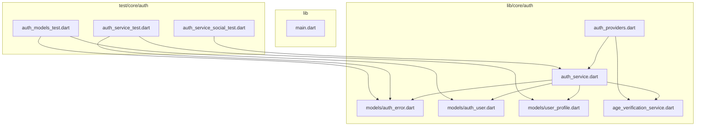
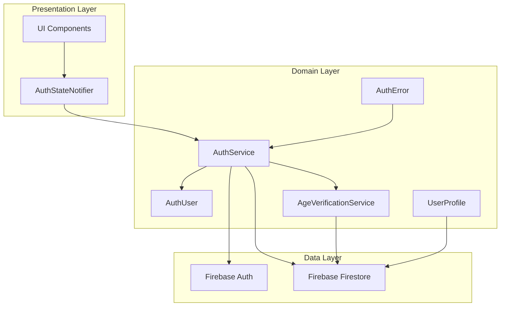
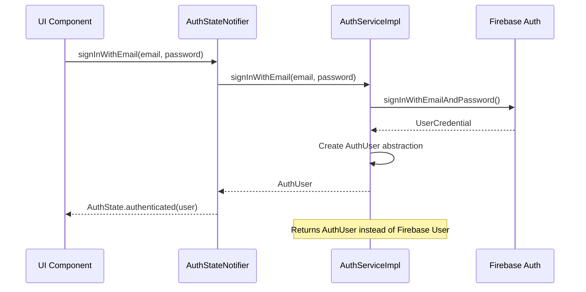
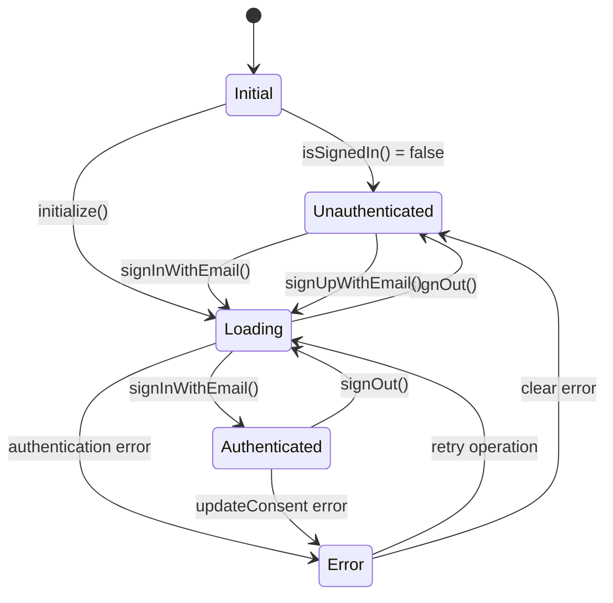
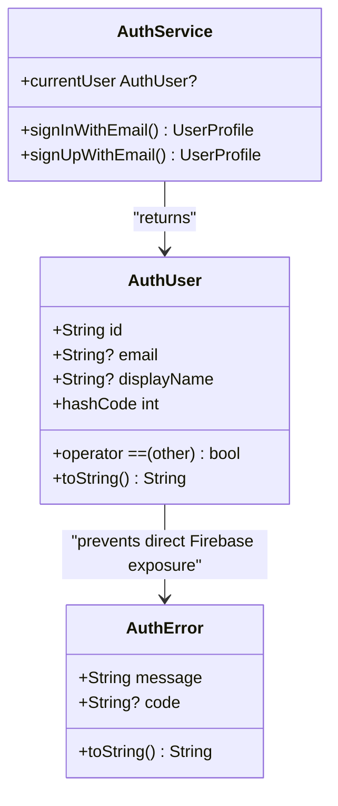
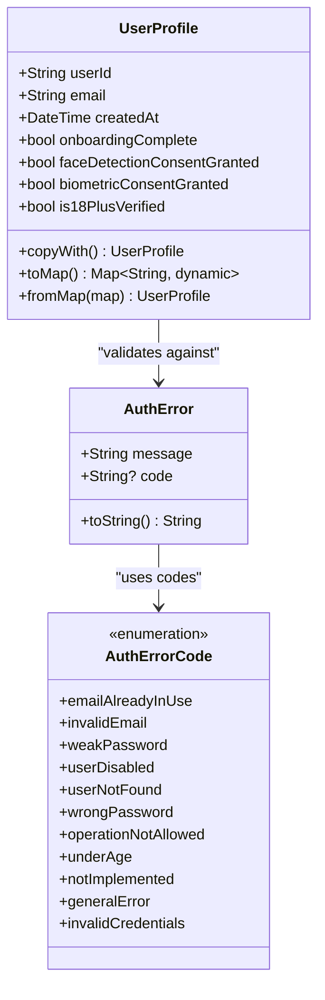
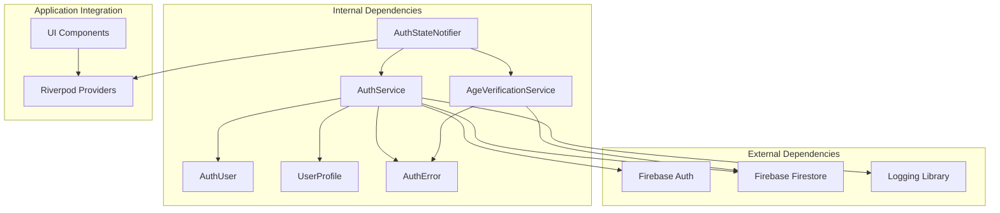
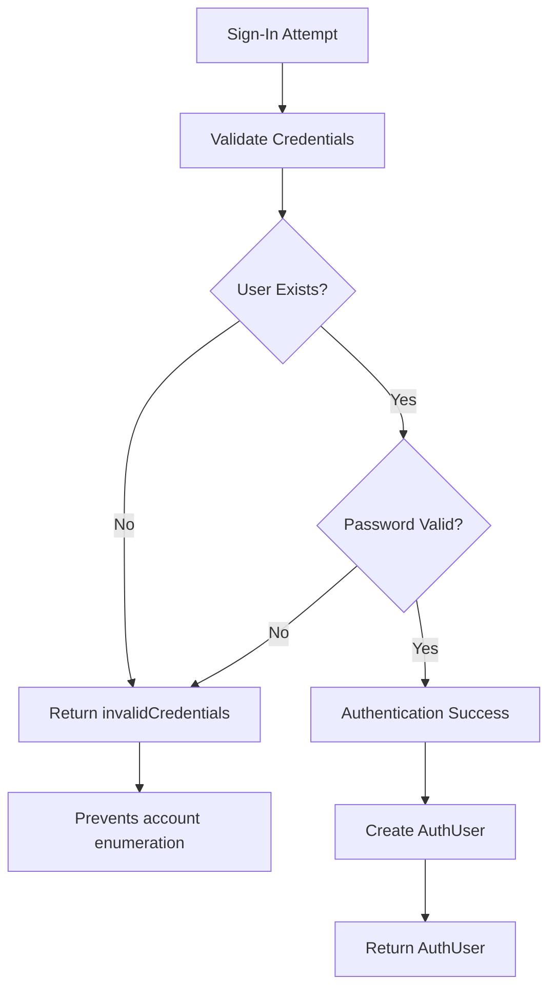

# Authentication Service

<cite>
**Referenced Files in This Document**
- [auth_service.dart](file://lib/core/auth/auth_service.dart)
- [auth_providers.dart](file://lib/core/auth/auth_providers.dart)
- [auth_error.dart](file://lib/core/auth/models/auth_error.dart)
- [auth_user.dart](file://lib/core/auth/models/auth_user.dart)
- [user_profile.dart](file://lib/core/auth/models/user_profile.dart)
- [age_verification_service.dart](file://lib/core/auth/age_verification_service.dart)
- [auth_service_test.dart](file://test/core/auth/auth_service_test.dart)
- [auth_service_social_test.dart](file://test/core/auth/auth_service_social_test.dart)
- [auth_models_test.dart](file://test/core/auth/auth_models_test.dart)
- [main.dart](file://lib/main.dart)
</cite>

## Update Summary
**Changes Made**
- Updated Core Components section to reflect AuthUser abstraction replacing Firebase User instances
- Added new AuthUser model documentation with security benefits
- Enhanced Error Handling section with improved security measures against account enumeration attacks
- Updated Architecture Overview to show AuthUser as the primary user representation
- Revised Detailed Component Analysis to cover the new AuthUser abstraction

## Table of Contents
1. [Introduction](#introduction)
2. [Project Structure](#project-structure)
3. [Core Components](#core-components)
4. [Architecture Overview](#architecture-overview)
5. [Detailed Component Analysis](#detailed-component-analysis)
6. [Dependency Analysis](#dependency-analysis)
7. [Performance Considerations](#performance-considerations)
8. [Security Enhancements](#security-enhancements)
9. [Troubleshooting Guide](#troubleshooting-guide)
10. [Conclusion](#conclusion)

## Introduction
This document provides comprehensive documentation for the Authentication Service in StyleSync, a Flutter application focused on secure API key management with encrypted cloud backup. The authentication system integrates Firebase Authentication and Firestore to manage user accounts, profiles, and compliance requirements including age verification. The service supports email/password authentication, social authentication (Google and Apple), user profile management, and consent handling for privacy features.

**Updated** The service now provides enhanced security through the AuthUser abstraction, which decouples the application from Firebase-specific implementations while offering improved error handling that prevents account enumeration attacks.

## Project Structure
The authentication service is organized within the core module of the Flutter application, following a layered architecture pattern:



**Diagram sources**
- [auth_service.dart](file://lib/core/auth/auth_service.dart#L1-L401)
- [auth_providers.dart](file://lib/core/auth/auth_providers.dart#L1-L290)
- [auth_error.dart](file://lib/core/auth/models/auth_error.dart#L1-L86)
- [auth_user.dart](file://lib/core/auth/models/auth_user.dart#L1-L40)
- [user_profile.dart](file://lib/core/auth/models/user_profile.dart#L1-L147)
- [age_verification_service.dart](file://lib/core/auth/age_verification_service.dart#L1-L252)

**Section sources**
- [auth_service.dart](file://lib/core/auth/auth_service.dart#L1-L401)
- [auth_providers.dart](file://lib/core/auth/auth_providers.dart#L1-L290)

## Core Components
The authentication service consists of several key components working together to provide comprehensive user authentication and management capabilities:

### Authentication Service Interface
The `AuthService` abstract interface defines the contract for authentication operations, including email/password authentication, social authentication, user profile management, and consent handling. The interface ensures type safety and provides clear separation of concerns between the authentication logic and external dependencies.

**Updated** The interface now returns `AuthUser` objects instead of Firebase-specific user instances, providing platform-agnostic user representation.

### Authentication Service Implementation
The `AuthServiceImpl` class provides the concrete implementation using Firebase Authentication and Firestore. It handles user authentication flows, profile creation and retrieval, age verification integration, and error mapping from Firebase exceptions to application-specific errors.

**Enhanced** The implementation now uses the `AuthUser` abstraction for user representation, ensuring that external callers receive a consistent user object regardless of the underlying authentication provider.

### Authentication State Management
The `AuthStateNotifier` class manages authentication state reactively using Riverpod's StateNotifier pattern. It provides loading states, error handling, and automatic state synchronization with Firestore user profiles.

### AuthUser Abstraction
The `AuthUser` class provides a minimal, platform-agnostic representation of an authenticated user. This abstraction decouples the application layer from Firebase Auth, allowing callers to access basic user information without depending on firebase_auth directly.

**New** This model contains only essential user information (id, email, displayName) and implements proper equality, hash code, and string representation methods for reliable state management.

### User Profile Model
The `UserProfile` class encapsulates user-related information stored in Firestore, including authentication status, onboarding completion, consent preferences, and age verification state. It provides serialization/deserialization capabilities and immutability through copy operations.

### Age Verification Service
The `AgeVerificationService` interface and its implementation handle 18+ age verification with self-reported DOB validation, third-party verification integration, session-based cooldown prevention, and Firestore-based persistence of verification states.

**Section sources**
- [auth_service.dart](file://lib/core/auth/auth_service.dart#L11-L75)
- [auth_providers.dart](file://lib/core/auth/auth_providers.dart#L55-L184)
- [auth_user.dart](file://lib/core/auth/models/auth_user.dart#L1-L40)
- [user_profile.dart](file://lib/core/auth/models/user_profile.dart#L1-L147)
- [age_verification_service.dart](file://lib/core/auth/age_verification_service.dart#L1-L252)

## Architecture Overview
The authentication service follows a clean architecture pattern with clear separation between presentation, domain, and data layers:



**Diagram sources**
- [auth_providers.dart](file://lib/core/auth/auth_providers.dart#L55-L184)
- [auth_service.dart](file://lib/core/auth/auth_service.dart#L77-L401)
- [auth_user.dart](file://lib/core/auth/models/auth_user.dart#L1-L40)
- [age_verification_service.dart](file://lib/core/auth/age_verification_service.dart#L1-L252)

The architecture implements several key design principles:

- **Dependency Injection**: Services accept Firebase instances through constructor parameters, enabling easy mocking and testing
- **Separation of Concerns**: Authentication logic is separated from UI state management
- **Immutability**: User profiles are immutable data structures with copy operations for state updates
- **Reactive State Management**: Riverpod providers enable reactive UI updates based on authentication state changes
- **Platform Agnostic User Representation**: AuthUser abstraction decouples application from Firebase-specific implementations

## Detailed Component Analysis

### Authentication Service Implementation
The `AuthServiceImpl` class serves as the central coordinator for all authentication operations, implementing the `AuthService` interface with comprehensive error handling and Firebase integration.

#### Core Authentication Operations
The service provides five primary authentication methods:
- Email/password sign-in and sign-up with comprehensive error mapping
- Social authentication placeholders for Google and Apple (currently unimplemented)
- User profile management with Firestore integration
- Consent management for privacy features

#### Enhanced User Representation
The service now returns `AuthUser` objects instead of Firebase User instances, providing a consistent user interface across different authentication providers.

```dart
@override
AuthUser? get currentUser {
  final user = _auth.currentUser;
  if (user == null) return null;
  return AuthUser(
    id: user.uid,
    email: user.email,
    displayName: user.displayName,
  );
}
```

#### Improved Error Handling Strategy
The implementation includes sophisticated error handling through the `_mapFirebaseAuthError` method, which converts Firebase-specific exceptions into application-wide `AuthError` instances with standardized error codes. This approach ensures consistent error reporting across the entire application.

**Enhanced Security** The error mapping now uses `invalidCredentials` for sign-in failures instead of separate `userNotFound` and `wrongPassword` codes to prevent account enumeration attacks.



**Diagram sources**
- [auth_service.dart](file://lib/core/auth/auth_service.dart#L89-L98)
- [auth_service.dart](file://lib/core/auth/auth_service.dart#L315-L356)

**Section sources**
- [auth_service.dart](file://lib/core/auth/auth_service.dart#L77-L401)

### Authentication State Management
The `AuthStateNotifier` class implements Riverpod's StateNotifier pattern to provide reactive authentication state management throughout the application.

#### State Lifecycle
The notifier manages four distinct states:
- **Initial**: Application startup state before authentication check
- **Unauthenticated**: User not signed in
- **Authenticated**: User successfully authenticated with profile data
- **Error**: Authentication operation failed with error details
- **Loading**: Authentication operation in progress

#### State Synchronization
The notifier automatically synchronizes UI state with Firestore user profiles, ensuring that authentication state reflects the most current user data. This includes automatic profile updates when consent preferences change.



**Diagram sources**
- [auth_providers.dart](file://lib/core/auth/auth_providers.dart#L190-L277)

**Section sources**
- [auth_providers.dart](file://lib/core/auth/auth_providers.dart#L55-L290)

### AuthUser Abstraction
The `AuthUser` class provides a minimal, platform-agnostic representation of an authenticated user, designed for security and portability.

#### Security Benefits
The abstraction provides several security advantages:
- **Decoupling from Firebase**: Prevents direct exposure of Firebase-specific user data
- **Minimal Information Exposure**: Contains only essential user attributes (id, email, displayName)
- **Consistent Interface**: Provides uniform user access across different authentication providers

#### Data Model Design
The AuthUser class implements:
- **Unique User Identifier**: Firebase UID for reliable user identification
- **Optional Email Address**: Nullable email field for privacy considerations
- **Optional Display Name**: Nullable display name for flexible user presentation
- **Proper Equality Implementation**: Reliable comparison and hashing for state management



**Diagram sources**
- [auth_user.dart](file://lib/core/auth/models/auth_user.dart#L1-L40)
- [auth_service.dart](file://lib/core/auth/auth_service.dart#L19-L75)

**Section sources**
- [auth_user.dart](file://lib/core/auth/models/auth_user.dart#L1-L40)

### User Profile Management
The `UserProfile` class provides a comprehensive data model for user information, designed for immutable data structures and seamless Firestore integration.

#### Data Model Design
The profile includes essential user information:
- Unique user identifier (Firebase UID)
- Email address for communication
- Creation timestamp with server synchronization
- Onboarding completion status
- Privacy consent preferences for face detection and biometric processing
- Age verification status for compliance

#### Serialization and Validation
The class implements robust serialization through `toMap()` and deserialization through `fromMap()` factory constructors, with comprehensive input validation to ensure data integrity. The `fromMap` method handles both string and Timestamp formats for createdAt fields, providing flexibility for different Firestore data types.



**Diagram sources**
- [user_profile.dart](file://lib/core/auth/models/user_profile.dart#L1-L147)
- [auth_error.dart](file://lib/core/auth/models/auth_error.dart#L21-L86)

**Section sources**
- [user_profile.dart](file://lib/core/auth/models/user_profile.dart#L1-L147)
- [auth_error.dart](file://lib/core/auth/models/auth_error.dart#L1-L86)

### Age Verification Service
The `AgeVerificationService` interface and implementation provide comprehensive age verification capabilities with built-in security measures.

#### Verification Methods
The service supports two primary verification approaches:
- **Self-reported DOB verification**: Primary method using user-provided date of birth
- **Third-party verification**: Appeal mechanism for failed verifications

#### Security Measures
The implementation includes several security features:
- **Session-based cooldown**: Prevents brute-force attempts with 24-hour cooldown periods
- **Fail-closed policy**: Assumes active cooldown during system failures for security
- **Input validation**: Comprehensive validation of date inputs and reasonableness checks
- **Firestore persistence**: Secure storage of verification states and cooldown timestamps


**Diagram sources**
- [age_verification_service.dart](file://lib/core/auth/age_verification_service.dart#L63-L94)

**Section sources**
- [age_verification_service.dart](file://lib/core/auth/age_verification_service.dart#L1-L252)

## Dependency Analysis
The authentication service demonstrates excellent dependency management through dependency injection and modular design:



**Diagram sources**
- [auth_service.dart](file://lib/core/auth/auth_service.dart#L1-L9)
- [auth_providers.dart](file://lib/core/auth/auth_providers.dart#L1-L7)
- [auth_user.dart](file://lib/core/auth/models/auth_user.dart#L1-L40)
- [age_verification_service.dart](file://lib/core/auth/age_verification_service.dart#L1-L8)

### Coupling and Cohesion
The service maintains low coupling through:
- Interface-based design enabling easy mocking and testing
- Constructor injection for external dependencies
- Clear separation between authentication logic and state management
- Modular organization of related functionality
- **Enhanced Decoupling**: AuthUser abstraction reduces coupling to Firebase-specific implementations

### Testing Strategy
The authentication service includes comprehensive test coverage:
- Unit tests for data models and error handling
- Integration tests for social authentication placeholders
- Mock-based testing for external dependencies
- Property-based testing for validation logic
- **New Tests**: AuthUser model testing for equality, hash code, and string representation

**Section sources**
- [auth_service_test.dart](file://test/core/auth/auth_service_test.dart#L1-L82)
- [auth_service_social_test.dart](file://test/core/auth/auth_service_social_test.dart#L1-L45)
- [auth_models_test.dart](file://test/core/auth/auth_models_test.dart#L176-L229)

## Performance Considerations
The authentication service incorporates several performance optimization strategies:

### Asynchronous Operations
All authentication operations are asynchronous, preventing UI blocking and ensuring responsive user experiences. The use of Riverpod's FutureProvider enables efficient caching and automatic refresh of authentication state.

### Firestore Optimization
The service leverages Firestore's server-side timestamp functionality to maintain consistent time across client and server environments. Transaction-based operations ensure data consistency without requiring manual conflict resolution.

### Memory Management
Immutable data structures minimize memory allocation overhead and prevent accidental state mutations. The copyWith pattern enables efficient state updates without full object recreation.

### Error Recovery
Fail-closed security policies during network failures prevent potential security vulnerabilities while maintaining system reliability. Logging integration enables monitoring and debugging of authentication operations.

## Security Enhancements

### Account Enumeration Prevention
The authentication service implements comprehensive security measures to prevent account enumeration attacks:

#### Unified Error Responses
Sign-in failures now return a unified `invalidCredentials` error code instead of separate `userNotFound` and `wrongPassword` codes. This prevents attackers from determining whether an email address exists in the system.

#### AuthUser Abstraction Security
The AuthUser abstraction provides an additional layer of security by:
- **Reducing Information Exposure**: Only essential user attributes are exposed
- **Platform Independence**: Decouples application from Firebase-specific user data
- **Consistent Interface**: Provides uniform user access regardless of authentication provider

#### Enhanced Error Codes
The AuthErrorCode class now includes specific security-related error codes:
- **invalidCredentials**: Prevents account enumeration during sign-in
- **cooldownActive**: Implements rate limiting to prevent brute force attacks
- **pendingVerification**: Handles verification state security



**Diagram sources**
- [auth_service.dart](file://lib/core/auth/auth_service.dart#L315-L356)
- [auth_error.dart](file://lib/core/auth/models/auth_error.dart#L50-L54)

**Section sources**
- [auth_service.dart](file://lib/core/auth/auth_service.dart#L315-L356)
- [auth_error.dart](file://lib/core/auth/models/auth_error.dart#L40-L54)

## Troubleshooting Guide

### Common Authentication Issues
The service provides comprehensive error handling with specific error codes for different failure scenarios:

#### Firebase Authentication Errors
- **Email Already In Use**: Occurs when attempting to register with an existing email address
- **Invalid Email**: Email format validation failures
- **Weak Password**: Password strength requirements not met
- **User Not Found**: Attempted sign-in with non-existent account
- **Wrong Password**: Incorrect password provided

#### Enhanced Error Handling
**Updated** Sign-in failures now consistently return `invalidCredentials` error code to prevent account enumeration attacks, regardless of whether the user exists or the password is correct.

#### Age Verification Errors
- **Under Age**: User attempts to access application without meeting age requirements
- **Cooldown Active**: User blocked due to excessive failed verification attempts
- **Invalid Input**: Date of birth validation failures

#### Social Authentication Limitations
The current implementation intentionally throws `AuthErrorCode.notImplemented` for Google and Apple authentication methods, indicating planned future enhancements.

### Debugging Strategies
The service includes comprehensive logging through the Dart logging library, enabling detailed tracking of authentication operations and error conditions. Error messages include both user-friendly descriptions and machine-readable codes for programmatic handling.

**New** The AuthUser abstraction simplifies debugging by providing consistent user information across different authentication scenarios without exposing Firebase-specific implementation details.

**Section sources**
- [auth_service.dart](file://lib/core/auth/auth_service.dart#L315-L356)
- [auth_error.dart](file://lib/core/auth/models/auth_error.dart#L21-L86)
- [auth_service_social_test.dart](file://test/core/auth/auth_service_social_test.dart#L22-L42)

## Conclusion
The StyleSync Authentication Service demonstrates robust architecture design with clear separation of concerns, comprehensive error handling, and reactive state management. The service successfully integrates Firebase Authentication and Firestore to provide secure user authentication while maintaining extensibility for future enhancements including social authentication methods and advanced age verification features.

**Enhanced Security** The implementation now prioritizes security through fail-closed policies, comprehensive input validation, session-based rate limiting, and account enumeration prevention. The introduction of the AuthUser abstraction provides an additional layer of security by decoupling the application from Firebase-specific implementations.

The reactive state management approach ensures consistent user experiences across different authentication states while maintaining data integrity through transaction-based operations. The AuthUser abstraction enables platform-agnostic user representation, making the system more maintainable and secure.

Future development should focus on implementing the social authentication methods currently marked as not implemented, expanding the age verification service with additional third-party integrations, and enhancing the error reporting system with more granular diagnostic information while maintaining the security improvements already implemented.