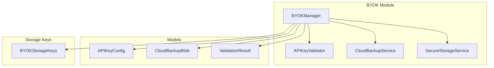
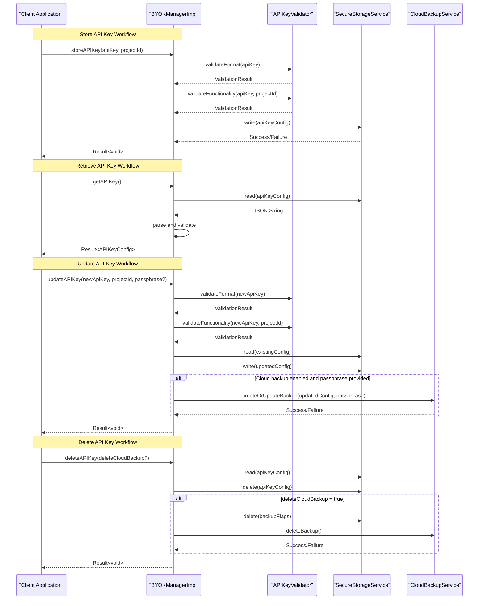
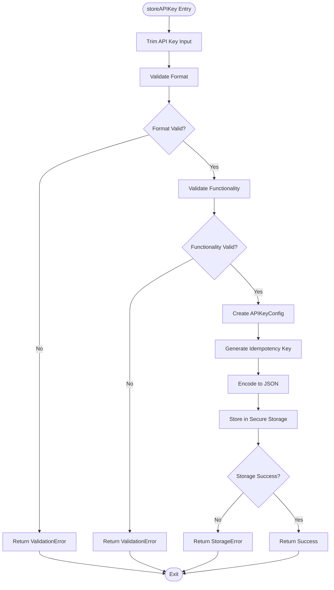
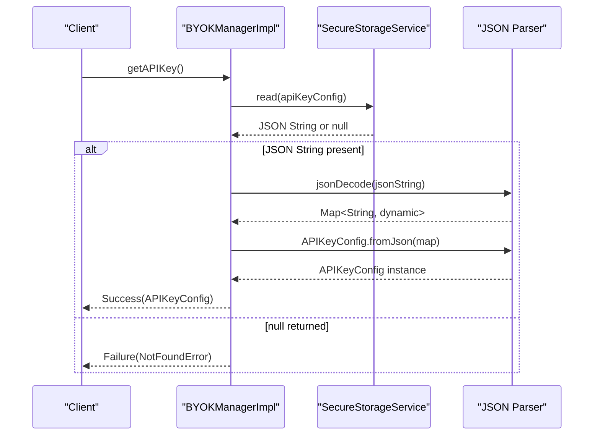
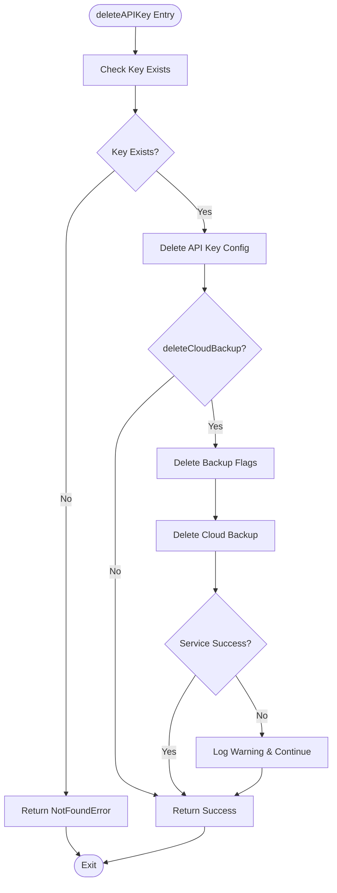
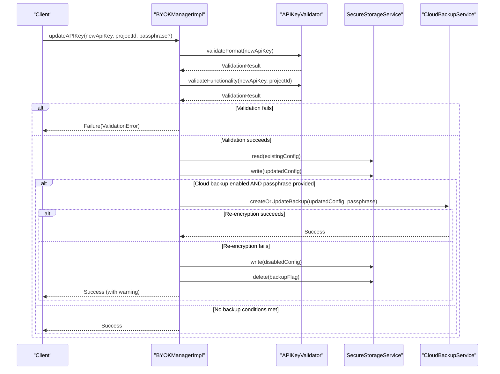
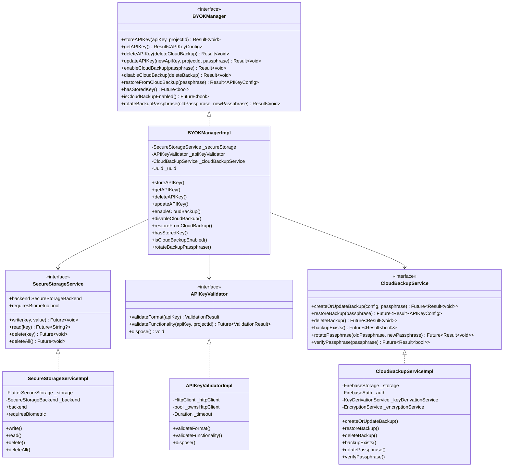

# API Key Lifecycle Management

<cite>
**Referenced Files in This Document**
- [byok_manager.dart](file://lib/core/byok/byok_manager.dart)
- [api_key_validator.dart](file://lib/core/byok/api_key_validator.dart)
- [cloud_backup_service.dart](file://lib/core/byok/cloud_backup_service.dart)
- [api_key_config.dart](file://lib/core/byok/models/api_key_config.dart)
- [cloud_backup_blob.dart](file://lib/core/byok/models/cloud_backup_blob.dart)
- [validation_result.dart](file://lib/core/byok/models/validation_result.dart)
- [byok_storage_keys.dart](file://lib/core/byok/byok_storage_keys.dart)
- [secure_storage_service.dart](file://lib/core/storage/secure_storage_service.dart)
- [secure_storage_service_impl.dart](file://lib/core/storage/secure_storage_service_impl.dart)
- [byok_manager_test.dart](file://test/byok_manager_test.dart)
- [api_key_input_page.dart](file://lib/features/onboarding/widgets/api_key_input_page.dart)
</cite>

## Table of Contents
1. [Introduction](#introduction)
2. [Project Structure](#project-structure)
3. [Core Components](#core-components)
4. [Architecture Overview](#architecture-overview)
5. [Detailed Component Analysis](#detailed-component-analysis)
6. [Dependency Analysis](#dependency-analysis)
7. [Performance Considerations](#performance-considerations)
8. [Troubleshooting Guide](#troubleshooting-guide)
9. [Conclusion](#conclusion)

## Introduction
This document provides comprehensive coverage of API key lifecycle management operations in the StyleSync application. It details the complete workflow from API key storage through retrieval, updating, and deletion, with emphasis on secure storage, validation, and optional cloud backup capabilities. The focus areas include the storeAPIKey method with format validation and secure storage operations, the getAPIKey method for retrieving stored configurations, the deleteAPIKey method with optional cloud backup deletion, and the updateAPIKey process including metadata preservation, idempotency key generation, and cloud backup re-encryption.

## Project Structure
The API key lifecycle management is implemented within the Bring Your Own Key (BYOK) module, which integrates with secure storage, validation services, and optional cloud backup functionality. The key components are organized as follows:

- BYOK Manager: Orchestrates API key lifecycle operations
- API Key Validator: Provides format and functional validation
- Cloud Backup Service: Handles encrypted cloud backup operations
- Secure Storage Service: Provides device-secured storage abstraction
- Model Definitions: APIKeyConfig, CloudBackupBlob, ValidationResult
- Storage Keys: Constants for secure storage key management

**Diagram sources**
- [byok_manager.dart](file://lib/core/byok/byok_manager.dart#L80-L147)
- [api_key_validator.dart](file://lib/core/byok/api_key_validator.dart#L9-L48)
- [cloud_backup_service.dart](file://lib/core/byok/cloud_backup_service.dart#L16-L91)
- [secure_storage_service.dart](file://lib/core/storage/secure_storage_service.dart#L10-L29)
- [api_key_config.dart](file://lib/core/byok/models/api_key_config.dart#L1-L110)
- [cloud_backup_blob.dart](file://lib/core/byok/models/cloud_backup_blob.dart#L1-L157)
- [byok_storage_keys.dart](file://lib/core/byok/byok_storage_keys.dart#L1-L15)

**Section sources**
- [byok_manager.dart](file://lib/core/byok/byok_manager.dart#L1-L583)
- [api_key_validator.dart](file://lib/core/byok/api_key_validator.dart#L1-L322)
- [cloud_backup_service.dart](file://lib/core/byok/cloud_backup_service.dart#L1-L900)
- [secure_storage_service.dart](file://lib/core/storage/secure_storage_service.dart#L1-L30)

## Core Components
This section examines the primary components that handle API key lifecycle operations, focusing on their interfaces, responsibilities, and integration patterns.

### BYOKManager Interface and Implementation
The BYOKManager interface defines the contract for API key lifecycle operations, while BYOKManagerImpl provides the concrete implementation with validation, secure storage, and optional cloud backup integration.

Key responsibilities include:
- API key validation (format and functionality)
- Secure storage operations
- Cloud backup enable/disable functionality
- Metadata preservation during updates
- Idempotency key generation for deduplication

### APIKeyValidator
Provides dual-layer validation:
- Format validation: Structural checks without network calls
- Functional validation: Network-based API key verification

### CloudBackupService
Handles encrypted cloud backup operations with:
- Client-side encryption using passphrases
- Firebase Storage integration
- Passphrase rotation with atomic operations
- Backup verification and restoration

### SecureStorageService
Abstracts platform-specific secure storage with:
- Device-secured storage (hardware-backed when available)
- Cross-platform compatibility
- Error handling and fallback mechanisms

**Section sources**
- [byok_manager.dart](file://lib/core/byok/byok_manager.dart#L80-L147)
- [api_key_validator.dart](file://lib/core/byok/api_key_validator.dart#L9-L48)
- [cloud_backup_service.dart](file://lib/core/byok/cloud_backup_service.dart#L16-L91)
- [secure_storage_service.dart](file://lib/core/storage/secure_storage_service.dart#L10-L29)

## Architecture Overview
The API key lifecycle management follows a layered architecture with clear separation of concerns:

**Diagram sources**
- [byok_manager.dart](file://lib/core/byok/byok_manager.dart#L182-L384)
- [api_key_validator.dart](file://lib/core/byok/api_key_validator.dart#L111-L224)
- [cloud_backup_service.dart](file://lib/core/byok/cloud_backup_service.dart#L166-L249)

## Detailed Component Analysis

### storeAPIKey Method Analysis
The storeAPIKey method implements a comprehensive validation and storage workflow with strict error handling and metadata preservation.

#### Validation Workflow
The method performs two-tier validation before storage:
1. **Format Validation**: Structural checks including prefix, length, and character validation
2. **Functional Validation**: Network-based API key verification against Google Cloud Vertex AI

#### Secure Storage Operations
The method creates an APIKeyConfig with comprehensive metadata:
- Creation timestamp (UTC)
- Last validation timestamp
- Cloud backup enabled flag (initially false)
- Idempotency key for deduplication
- Project ID association

#### Error Handling and Recovery
The method implements robust error handling:
- Immediate rejection for format validation failures
- Detailed error reporting for functional validation failures
- Comprehensive storage error handling with StorageError wrapping
- Non-blocking cloud backup operations (if enabled)

**Diagram sources**
- [byok_manager.dart](file://lib/core/byok/byok_manager.dart#L182-L231)

#### Practical Usage Examples
The storeAPIKey method is typically invoked during onboarding when users enter their API key and project ID. The method returns a Result<void> indicating success or failure, with detailed error information for user feedback.

**Section sources**
- [byok_manager.dart](file://lib/core/byok/byok_manager.dart#L182-L231)
- [api_key_validator.dart](file://lib/core/byok/api_key_validator.dart#L111-L224)
- [api_key_config.dart](file://lib/core/byok/models/api_key_config.dart#L24-L78)

### getAPIKey Method Analysis
The getAPIKey method provides controlled access to stored API key configurations with comprehensive error handling and validation.

#### Retrieval Process
The method implements a multi-stage retrieval process:
1. **Storage Access**: Reads JSON configuration from secure storage
2. **Parsing Validation**: Validates JSON structure and required fields
3. **Model Construction**: Creates APIKeyConfig instance with proper type safety
4. **Error Classification**: Distinguishes between missing keys and corrupted data

#### Error Handling Strategy
The method provides granular error handling:
- NotFoundError for absent configurations
- StorageError for parsing/format exceptions
- Generic StorageError for unexpected storage failures
- Graceful degradation for malformed data

**Diagram sources**
- [byok_manager.dart](file://lib/core/byok/byok_manager.dart#L233-L256)

#### Practical Usage Examples
The getAPIKey method is commonly used in:
- UI components to display stored API key information
- Validation workflows to check for existing configurations
- Integration with cloud backup services for restoration operations

**Section sources**
- [byok_manager.dart](file://lib/core/byok/byok_manager.dart#L233-L256)
- [api_key_config.dart](file://lib/core/byok/models/api_key_config.dart#L44-L60)

### deleteAPIKey Method Analysis
The deleteAPIKey method implements comprehensive key removal with optional cloud backup cleanup and robust error handling.

#### Deletion Strategy
The method follows a careful deletion sequence:
1. **Existence Verification**: Confirms key presence before deletion
2. **Primary Deletion**: Removes API key configuration from secure storage
3. **Cloud Backup Cleanup**: Optional removal of cloud backup and related flags
4. **Service Integration**: Delegates cloud backup deletion to CloudBackupService

#### Cloud Backup Integration
The method provides flexible cloud backup handling:
- Conditional deletion based on deleteCloudBackup parameter
- Graceful handling of cloud backup service unavailability
- Logging of backup deletion failures without blocking primary operation
- Cleanup of local backup-related flags

**Diagram sources**
- [byok_manager.dart](file://lib/core/byok/byok_manager.dart#L258-L295)

#### Practical Usage Examples
The deleteAPIKey method supports various scenarios:
- Complete key removal during account sign-out
- Partial removal with cloud backup preservation
- Emergency cleanup with cloud backup deletion
- Graceful handling of partial failures

**Section sources**
- [byok_manager.dart](file://lib/core/byok/byok_manager.dart#L258-L295)
- [byok_storage_keys.dart](file://lib/core/byok/byok_storage_keys.dart#L5-L14)

### updateAPIKey Method Analysis
The updateAPIKey method implements sophisticated key replacement with metadata preservation, idempotency key generation, and optional cloud backup re-encryption.

#### Update Workflow
The method implements a comprehensive update process:
1. **Input Validation**: Validates new API key format and functionality
2. **Metadata Preservation**: Retrieves existing configuration to preserve metadata
3. **Configuration Generation**: Creates updated APIKeyConfig with new idempotency key
4. **Storage Update**: Persists updated configuration to secure storage
5. **Cloud Backup Integration**: Optional re-encryption of cloud backup

#### Metadata Preservation Strategy
The method preserves critical metadata:
- createdAt timestamp remains unchanged
- lastValidated timestamp is updated to current time
- cloudBackupEnabled state is preserved
- Existing idempotency key is replaced with new one

#### Cloud Backup Re-encryption
The method provides intelligent cloud backup handling:
- Re-encryption only occurs when backup is enabled and passphrase is provided
- Graceful fallback to local backup disable on re-encryption failure
- Non-blocking operation - key update succeeds even if backup fails
- Detailed logging of backup re-encryption outcomes

**Diagram sources**
- [byok_manager.dart](file://lib/core/byok/byok_manager.dart#L297-L384)

#### Practical Usage Examples
The updateAPIKey method supports:
- Key rotation scenarios with passphrase re-encryption
- Metadata-preserving updates for compliance requirements
- Graceful fallback when cloud backup operations fail
- Idempotency key generation for deduplication

**Section sources**
- [byok_manager.dart](file://lib/core/byok/byok_manager.dart#L297-L384)
- [api_key_config.dart](file://lib/core/byok/models/api_key_config.dart#L62-L78)

### Cloud Backup Integration
The BYOKManager provides comprehensive cloud backup integration with secure encryption and passphrase management.

#### Backup Enable/Disable Operations
The system supports:
- Cloud backup enable with passphrase-based encryption
- Cloud backup disable with optional cloud deletion
- Backup verification and restoration capabilities
- Passphrase rotation with atomic operations

#### Security Implementation
Cloud backup operations implement:
- Client-side encryption using passphrases
- Key derivation service integration
- Encrypted blob structure with metadata
- Secure storage of backup-related flags

**Section sources**
- [cloud_backup_service.dart](file://lib/core/byok/cloud_backup_service.dart#L16-L91)
- [cloud_backup_blob.dart](file://lib/core/byok/models/cloud_backup_blob.dart#L1-L157)

## Dependency Analysis
The API key lifecycle management system exhibits well-structured dependencies with clear separation of concerns and minimal coupling.

**Diagram sources**
- [byok_manager.dart](file://lib/core/byok/byok_manager.dart#L84-L147)
- [api_key_validator.dart](file://lib/core/byok/api_key_validator.dart#L14-L48)
- [cloud_backup_service.dart](file://lib/core/byok/cloud_backup_service.dart#L21-L91)
- [secure_storage_service.dart](file://lib/core/storage/secure_storage_service.dart#L10-L29)

### Integration Patterns
The system demonstrates several integration patterns:

#### Dependency Injection
- SecureStorageService injected via Riverpod providers
- APIKeyValidator configured with optional HTTP client
- CloudBackupService dependency optional for offline scenarios

#### Error Propagation
- Validation failures wrapped in ValidationError
- Storage failures wrapped in StorageError
- Cloud backup failures wrapped in BackupError
- Consistent Result<T> pattern for all operations

#### Asynchronous Operations
- All storage and network operations are asynchronous
- Proper error handling for timeouts and network failures
- Graceful degradation when optional services are unavailable

**Section sources**
- [byok_manager.dart](file://lib/core/byok/byok_manager.dart#L555-L582)
- [api_key_validator.dart](file://lib/core/byok/api_key_validator.dart#L75-L80)
- [cloud_backup_service.dart](file://lib/core/byok/cloud_backup_service.dart#L884-L899)

## Performance Considerations
The API key lifecycle management system incorporates several performance optimizations and considerations:

### Storage Efficiency
- JSON serialization minimizes storage overhead
- Compact timestamp representation (ISO 8601 strings)
- Minimal metadata footprint per configuration
- Efficient binary encoding for cloud backup data

### Network Optimization
- Functional validation performed only once per storage operation
- HTTP client reuse through dependency injection
- Configurable timeout values for different environments
- Graceful handling of network failures

### Memory Management
- Immutable model objects prevent accidental mutations
- Proper resource disposal for HTTP clients
- Efficient string handling with trimming and normalization
- Minimal memory footprint for validation operations

### Scalability Factors
- Stateless design enables horizontal scaling
- Database-free architecture reduces operational complexity
- Cloud backup operations are optional and non-blocking
- Modular design allows selective feature deployment

## Troubleshooting Guide

### Common Issues and Solutions

#### Validation Failures
**Format Validation Errors:**
- Invalid API key format: Ensure key starts with "AIza" and is exactly 39 characters
- Malformed key structure: Check for invalid characters (only alphanumeric, underscore, hyphen)
- Project ID validation: Verify project ID meets Google Cloud requirements

**Functional Validation Errors:**
- Network connectivity issues: Check internet connection and firewall settings
- API key unauthorized: Verify API key correctness and revocation status
- Project access denied: Confirm project ID validity and API enablement
- Rate limiting: Implement exponential backoff for retries

#### Storage Issues
**Local Storage Failures:**
- Storage write errors: Check available disk space and storage permissions
- Storage read failures: Verify key existence and storage integrity
- Storage corruption: Implement recovery procedures and backup verification

**Cloud Backup Issues:**
- Backup creation failures: Verify Firebase credentials and network connectivity
- Passphrase verification failures: Ensure correct passphrase entry
- Backup restoration errors: Check backup integrity and passphrase correctness

#### Integration Problems
**Service Unavailability:**
- Cloud backup service not available: Continue with local storage operations
- Network timeouts: Implement retry logic with exponential backoff
- Authentication failures: Verify user credentials and service configuration

**Error Classification:**
The system provides detailed error classification through the Result<T> pattern, enabling precise troubleshooting and user feedback.

**Section sources**
- [byok_manager_test.dart](file://test/byok_manager_test.dart#L1097-L1230)
- [api_key_validator.dart](file://lib/core/byok/api_key_validator.dart#L226-L321)
- [cloud_backup_service.dart](file://lib/core/byok/cloud_backup_service.dart#L139-L164)

## Conclusion
The API key lifecycle management system provides a comprehensive, secure, and user-friendly solution for managing API keys in the StyleSync application. The implementation demonstrates strong architectural principles with clear separation of concerns, robust error handling, and comprehensive testing coverage.

Key strengths of the implementation include:
- Multi-layer validation ensuring both structural and functional correctness
- Secure storage with hardware-backed encryption when available
- Optional cloud backup with client-side encryption and passphrase management
- Comprehensive error handling with detailed user feedback
- Extensive test coverage validating all major workflows
- Flexible integration patterns supporting various deployment scenarios

The system successfully balances security requirements with usability, providing users with confidence in their API key management while maintaining operational simplicity for developers and administrators.