# BYOK Manager

<cite>
**Referenced Files in This Document**
- [byok_manager.dart](file://lib/core/byok/byok_manager.dart)
- [byok_error.dart](file://lib/core/byok/models/byok_error.dart)
- [validation_result.dart](file://lib/core/byok/models/validation_result.dart)
- [api_key_config.dart](file://lib/core/byok/models/api_key_config.dart)
- [cloud_backup_blob.dart](file://lib/core/byok/models/cloud_backup_blob.dart)
- [byok_storage_keys.dart](file://lib/core/byok/byok_storage_keys.dart)
- [cloud_backup_service.dart](file://lib/core/byok/cloud_backup_service.dart)
- [api_key_validator.dart](file://lib/core/byok/api_key_validator.dart)
- [secure_storage_service.dart](file://lib/core/storage/secure_storage_service.dart)
- [encryption_service.dart](file://lib/core/crypto/encryption_service.dart)
- [key_derivation_service.dart](file://lib/core/crypto/key_derivation_service.dart)
- [kdf_metadata.dart](file://lib/core/crypto/kdf_metadata.dart)
- [byok_manager_test.dart](file://test/byok_manager_test.dart)
- [cloud_backup_service_test.dart](file://test/cloud_backup_service_test.dart)
</cite>

## Update Summary
**Changes Made**
- Enhanced API reference documentation with comprehensive method signatures and parameter descriptions
- Expanded lifecycle management details with step-by-step workflows
- Added detailed validation workflows including format and functional checks
- Improved cloud backup integration patterns with passphrase rotation and error handling
- Updated error handling strategies with specific failure scenarios
- Enhanced practical usage patterns with concrete examples and integration guidance

## Table of Contents
1. [Introduction](#introduction)
2. [Project Structure](#project-structure)
3. [Core Components](#core-components)
4. [Architecture Overview](#architecture-overview)
5. [Detailed Component Analysis](#detailed-component-analysis)
6. [API Reference](#api-reference)
7. [Lifecycle Management Workflows](#lifecycle-management-workflows)
8. [Validation and Error Handling](#validation-and-error-handling)
9. [Cloud Backup Integration](#cloud-backup-integration)
10. [Practical Usage Patterns](#practical-usage-patterns)
11. [Performance Considerations](#performance-considerations)
12. [Troubleshooting Guide](#troubleshooting-guide)
13. [Conclusion](#conclusion)
14. [Appendices](#appendices)

## Introduction
The BYOK (Bring Your Own Key) Manager service is the central orchestrator for API key lifecycle management in the application. It securely stores, retrieves, validates, updates, and deletes user-provided Vertex AI API keys, and integrates with cloud backup for disaster recovery. The service enforces robust error handling via a Result<T> sealed class pattern, supports idempotency keys, preserves metadata across updates, and provides passphrase rotation capabilities for cloud backups.

## Project Structure
The BYOK module is organized around a clear separation of concerns:
- Core orchestration: BYOKManager interface and its default implementation BYOKManagerImpl
- Domain models: APIKeyConfig, ValidationResult, BYOKError, CloudBackupBlob
- Validation: APIKeyValidator for format and functional checks
- Storage: SecureStorageService abstraction and BYOKStorageKeys constants
- Cloud backup: CloudBackupService abstraction and CloudBackupServiceImpl
- Cryptography: Key derivation and encryption services for secure cloud backups
- Tests: Comprehensive unit tests validating workflows and error handling

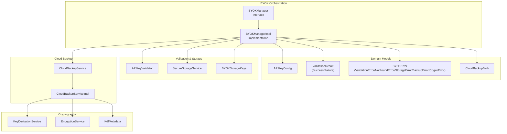

**Diagram sources**
- [byok_manager.dart](file://lib/core/byok/byok_manager.dart#L84-L147)
- [api_key_validator.dart](file://lib/core/byok/api_key_validator.dart#L14-L48)
- [secure_storage_service.dart](file://lib/core/storage/secure_storage_service.dart#L11-L29)
- [cloud_backup_service.dart](file://lib/core/byok/cloud_backup_service.dart#L21-L91)
- [encryption_service.dart](file://lib/core/crypto/encryption_service.dart#L14-L20)
- [key_derivation_service.dart](file://lib/core/crypto/key_derivation_service.dart#L9-L15)
- [kdf_metadata.dart](file://lib/core/crypto/kdf_metadata.dart#L9-L22)
- [api_key_config.dart](file://lib/core/byok/models/api_key_config.dart#L5-L32)
- [validation_result.dart](file://lib/core/byok/models/validation_result.dart#L5-L7)
- [byok_error.dart](file://lib/core/byok/models/byok_error.dart#L7-L15)
- [cloud_backup_blob.dart](file://lib/core/byok/models/cloud_backup_blob.dart#L8-L38)

**Section sources**
- [byok_manager.dart](file://lib/core/byok/byok_manager.dart#L1-L583)
- [api_key_validator.dart](file://lib/core/byok/api_key_validator.dart#L1-L322)
- [secure_storage_service.dart](file://lib/core/storage/secure_storage_service.dart#L1-L30)
- [cloud_backup_service.dart](file://lib/core/byok/cloud_backup_service.dart#L1-L900)
- [encryption_service.dart](file://lib/core/crypto/encryption_service.dart#L1-L75)
- [key_derivation_service.dart](file://lib/core/crypto/key_derivation_service.dart#L1-L118)
- [kdf_metadata.dart](file://lib/core/crypto/kdf_metadata.dart#L1-L78)
- [api_key_config.dart](file://lib/core/byok/models/api_key_config.dart#L1-L110)
- [validation_result.dart](file://lib/core/byok/models/validation_result.dart#L1-L188)
- [byok_error.dart](file://lib/core/byok/models/byok_error.dart#L1-L94)
- [cloud_backup_blob.dart](file://lib/core/byok/models/cloud_backup_blob.dart#L1-L166)

## Core Components
- BYOKManager: Abstract interface defining the API key lifecycle operations (store, get, delete, update, enable/disable cloud backup, restore, passphrase rotation, presence checks).
- BYOKManagerImpl: Default implementation orchestrating validation, secure storage, and cloud backup operations.
- Result<T> sealed class: Standardized success/failure pattern with helpers for mapping and async transformations.
- APIKeyConfig: Immutable model capturing the API key, project ID, timestamps, cloud backup state, and idempotency key.
- APIKeyValidator: Validates key format and functionality via a real Vertex AI API call.
- SecureStorageService: Abstraction for platform-native secure storage.
- CloudBackupService: Abstraction for encrypted cloud backup operations using client-side encryption.
- CloudBackupServiceImpl: Implements cloud backup with Argon2id/PBKDF2 key derivation and AES-GCM encryption.
- BYOKError and ValidationResult: Hierarchies for precise error reporting and validation outcomes.

**Section sources**
- [byok_manager.dart](file://lib/core/byok/byok_manager.dart#L84-L147)
- [byok_manager.dart](file://lib/core/byok/byok_manager.dart#L153-L549)
- [byok_manager.dart](file://lib/core/byok/byok_manager.dart#L23-L78)
- [api_key_config.dart](file://lib/core/byok/models/api_key_config.dart#L5-L110)
- [api_key_validator.dart](file://lib/core/byok/api_key_validator.dart#L14-L48)
- [secure_storage_service.dart](file://lib/core/storage/secure_storage_service.dart#L11-L29)
- [cloud_backup_service.dart](file://lib/core/byok/cloud_backup_service.dart#L21-L91)
- [byok_error.dart](file://lib/core/byok/models/byok_error.dart#L7-L94)
- [validation_result.dart](file://lib/core/byok/models/validation_result.dart#L5-L188)

## Architecture Overview
The BYOK Manager coordinates between local secure storage, API key validation, and optional cloud backup. It ensures that:
- API keys are validated before storage
- Local metadata is preserved across updates
- Cloud backup is optional and encrypted client-side
- Errors are handled gracefully with clear error types

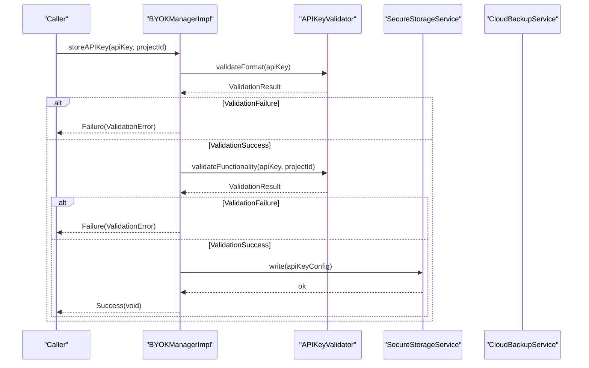

**Diagram sources**
- [byok_manager.dart](file://lib/core/byok/byok_manager.dart#L182-L231)
- [api_key_validator.dart](file://lib/core/byok/api_key_validator.dart#L14-L48)
- [secure_storage_service.dart](file://lib/core/storage/secure_storage_service.dart#L12-L19)

**Section sources**
- [byok_manager.dart](file://lib/core/byok/byok_manager.dart#L182-L231)
- [api_key_validator.dart](file://lib/core/byok/api_key_validator.dart#L14-L48)
- [secure_storage_service.dart](file://lib/core/storage/secure_storage_service.dart#L12-L19)

## Detailed Component Analysis

### BYOKManager and BYOKManagerImpl
- Responsibilities:
  - Validate API key format and functionality
  - Persist API key configuration with metadata
  - Manage cloud backup enablement and restoration
  - Update keys while preserving metadata and optionally re-encrypting backups
  - Provide presence checks and passphrase rotation
- Key behaviors:
  - Idempotency key generation for deduplication
  - Metadata preservation during updates (createdAt, lastValidated, cloudBackupEnabled)
  - Graceful fallback when cloud backup re-encryption fails (disables backup locally)
  - Optional deletion of cloud backup during key deletion

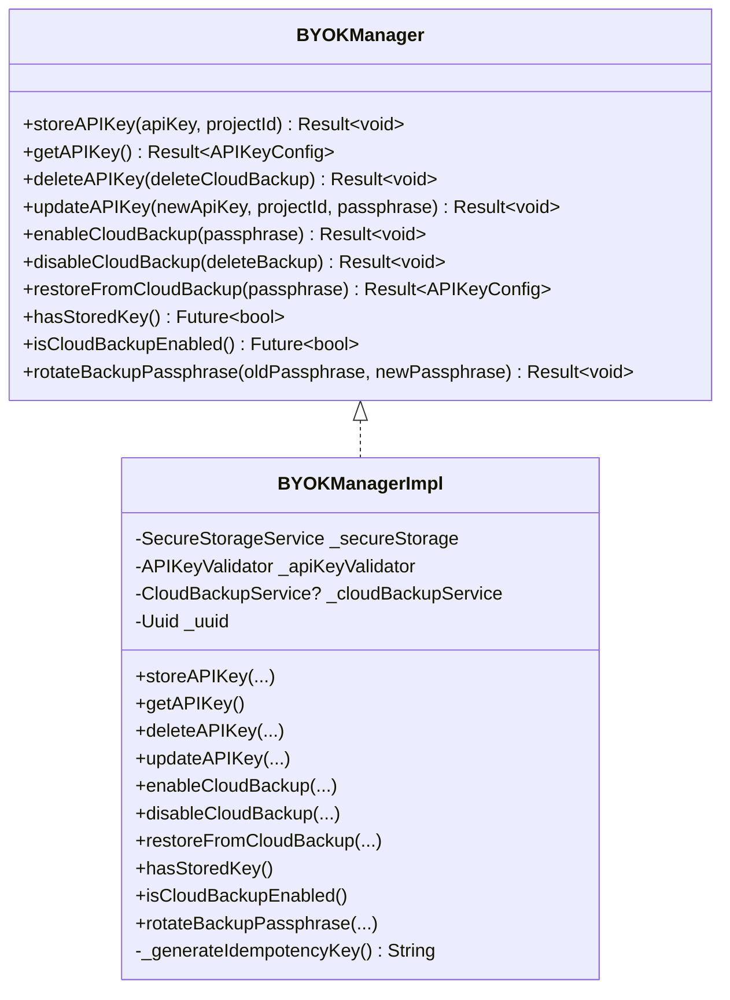

**Diagram sources**
- [byok_manager.dart](file://lib/core/byok/byok_manager.dart#L84-L147)
- [byok_manager.dart](file://lib/core/byok/byok_manager.dart#L153-L549)

**Section sources**
- [byok_manager.dart](file://lib/core/byok/byok_manager.dart#L153-L549)

### Result<T> Sealed Class Pattern
- Success<T>: Holds a successful value
- Failure<T>: Holds a BYOKError
- Helpers:
  - isSuccess/isFailure getters
  - valueOrNull/errorOrNull accessors
  - map/mapAsync for transforming success values

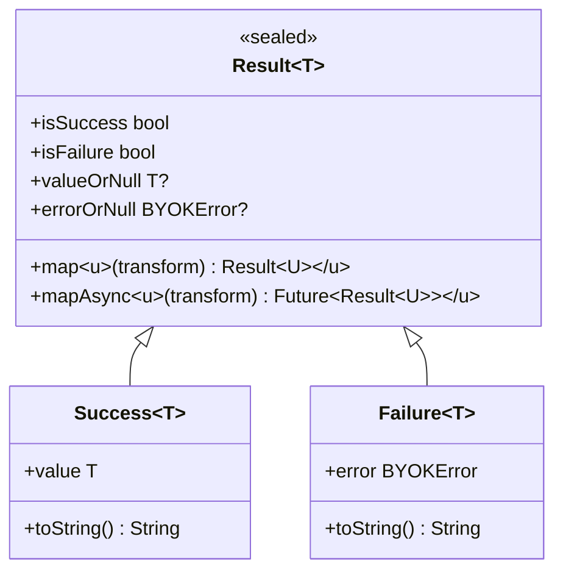

**Diagram sources**
- [byok_manager.dart](file://lib/core/byok/byok_manager.dart#L23-L78)

**Section sources**
- [byok_manager.dart](file://lib/core/byok/byok_manager.dart#L23-L78)

### APIKeyConfig Model
- Fields: apiKey, projectId, createdAt, lastValidated, cloudBackupEnabled, idempotencyKey
- Methods: toJson/fromJson, copyWith, equality/hashCode, toString
- Purpose: Encapsulates the persisted API key configuration with metadata

**Section sources**
- [api_key_config.dart](file://lib/core/byok/models/api_key_config.dart#L5-L110)

### ValidationResult and BYOKError
- ValidationResult: Sealed class with ValidationSuccess and ValidationFailure
  - ValidationSuccess: Optional metadata (e.g., available models)
  - ValidationFailure: Type, message, optional errorCode/originalError
- BYOKError: Sealed class hierarchy for all error types
  - ValidationError: wraps ValidationResult
  - NotFoundError: no key stored
  - StorageError: storage failures
  - BackupError: cloud backup failures with typed reasons
  - CryptoError: encryption/decryption failures


**Diagram sources**
- [validation_result.dart](file://lib/core/byok/models/validation_result.dart#L5-L188)
- [byok_error.dart](file://lib/core/byok/models/byok_error.dart#L7-L94)

**Section sources**
- [validation_result.dart](file://lib/core/byok/models/validation_result.dart#L5-L188)
- [byok_error.dart](file://lib/core/byok/models/byok_error.dart#L7-L94)

### CloudBackupBlob
- Fields: version, kdfMetadata, encryptedData, createdAt, updatedAt
- Methods: toJson/fromJson, copyWith, equality/hashCode, toString
- Purpose: Serialized encrypted backup container for cloud storage

**Section sources**
- [cloud_backup_blob.dart](file://lib/core/byok/models/cloud_backup_blob.dart#L8-L166)

### CloudBackupService and CloudBackupServiceImpl
- CloudBackupService: Abstract interface for create/update/restore/delete/exists/rotate/verify
- CloudBackupServiceImpl: Implements encryption using AES-GCM, key derivation using Argon2id/PBKDF2, and storage via Firebase Storage
- Passphrase rotation uses a temporary backup to achieve atomic swap

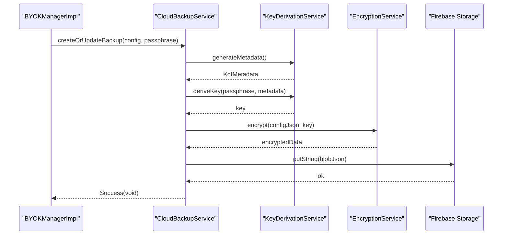

**Diagram sources**
- [cloud_backup_service.dart](file://lib/core/byok/cloud_backup_service.dart#L35-L249)
- [key_derivation_service.dart](file://lib/core/crypto/key_derivation_service.dart#L36-L53)
- [encryption_service.dart](file://lib/core/crypto/encryption_service.dart#L26-L40)

**Section sources**
- [cloud_backup_service.dart](file://lib/core/byok/cloud_backup_service.dart#L21-L91)
- [cloud_backup_service.dart](file://lib/core/byok/cloud_backup_service.dart#L167-L249)
- [key_derivation_service.dart](file://lib/core/crypto/key_derivation_service.dart#L9-L15)
- [encryption_service.dart](file://lib/core/crypto/encryption_service.dart#L14-L20)

### APIKeyValidator
- Validates format (prefix, length, characters)
- Validates functionality by calling Vertex AI models endpoint
- Supports configurable timeout and injectable HTTP client

**Section sources**
- [api_key_validator.dart](file://lib/core/byok/api_key_validator.dart#L14-L48)
- [api_key_validator.dart](file://lib/core/byok/api_key_validator.dart#L112-L150)
- [api_key_validator.dart](file://lib/core/byok/api_key_validator.dart#L153-L224)

### SecureStorageService and BYOKStorageKeys
- SecureStorageService: Abstraction for write/read/delete/deleteAll/backend detection
- BYOKStorageKeys: Constants for storage keys (apiKeyConfig, backupPassphraseHash, cloudBackupEnabled)

**Section sources**
- [secure_storage_service.dart](file://lib/core/storage/secure_storage_service.dart#L11-L29)
- [byok_storage_keys.dart](file://lib/core/byok/byok_storage_keys.dart#L5-L14)

## API Reference

### BYOKManager Interface Methods

#### storeAPIKey
Stores an API key after validation with comprehensive error handling.

**Method Signature:**
```dart
Future<Result<void>> storeAPIKey(String apiKey, String projectId)
```

**Parameters:**
- `apiKey` (String): The Vertex AI API key to store
- `projectId` (String): The Google Cloud project ID for validation

**Returns:**
- `Future<Result<void>>`: Success if key stored, Failure with BYOKError on validation or storage failure

**Behavior:**
1. Trims whitespace from input
2. Validates key format using APIKeyValidator
3. Validates key functionality via API call
4. Creates APIKeyConfig with metadata
5. Stores in secure storage

**Section sources**
- [byok_manager.dart](file://lib/core/byok/byok_manager.dart#L84-L92)

#### getAPIKey
Retrieves the stored API key configuration.

**Method Signature:**
```dart
Future<Result<APIKeyConfig>> getAPIKey()
```

**Returns:**
- `Future<Result<APIKeyConfig>>`: Success with APIKeyConfig if found, Failure with NotFoundError if not found

**Section sources**
- [byok_manager.dart](file://lib/core/byok/byok_manager.dart#L94-L98)

#### deleteAPIKey
Deletes the stored API key and optionally cloud backup.

**Method Signature:**
```dart
Future<Result<void>> deleteAPIKey({bool deleteCloudBackup = false})
```

**Parameters:**
- `deleteCloudBackup` (bool): If true, also deletes cloud backup

**Returns:**
- `Future<Result<void>>`: Success if deletion successful, Failure on error

**Section sources**
- [byok_manager.dart](file://lib/core/byok/byok_manager.dart#L100-L106)

#### updateAPIKey
Updates an existing API key while preserving metadata.

**Method Signature:**
```dart
Future<Result<void>> updateAPIKey(String newApiKey, String projectId, {String? passphrase})
```

**Parameters:**
- `newApiKey` (String): The new API key
- `projectId` (String): The project ID for validation
- `passphrase` (String?): Optional passphrase for backup re-encryption

**Returns:**
- `Future<Result<void>>`: Success if update successful, Failure on validation or storage error

**Behavior:**
- Preserves createdAt, lastValidated, and cloudBackupEnabled
- Re-encrypts backup if enabled and passphrase provided
- Graceful fallback if backup re-encryption fails

**Section sources**
- [byok_manager.dart](file://lib/core/byok/byok_manager.dart#L108-L116)

#### enableCloudBackup
Enables cloud backup with passphrase protection.

**Method Signature:**
```dart
Future<Result<void>> enableCloudBackup(String passphrase)
```

**Parameters:**
- `passphrase` (String): Passphrase for backup encryption

**Returns:**
- `Future<Result<void>>`: Success if backup enabled, Failure on error

**Section sources**
- [byok_manager.dart](file://lib/core/byok/byok_manager.dart#L117-L121)

#### disableCloudBackup
Disables cloud backup and optionally deletes remote backup.

**Method Signature:**
```dart
Future<Result<void>> disableCloudBackup({bool deleteBackup = true})
```

**Parameters:**
- `deleteBackup` (bool): If true, deletes existing cloud backup

**Returns:**
- `Future<Result<void>>`: Success if disabled, Failure on error

**Section sources**
- [byok_manager.dart](file://lib/core/byok/byok_manager.dart#L123-L127)

#### restoreFromCloudBackup
Restores API key from cloud backup.

**Method Signature:**
```dart
Future<Result<APIKeyConfig>> restoreFromCloudBackup(String passphrase)
```

**Parameters:**
- `passphrase` (String): Passphrase for backup decryption

**Returns:**
- `Future<Result<APIKeyConfig>>`: Success with restored APIKeyConfig, Failure on error

**Section sources**
- [byok_manager.dart](file://lib/core/byok/byok_manager.dart#L128-L131)

#### hasStoredKey
Checks if an API key is currently stored.

**Method Signature:**
```dart
Future<bool> hasStoredKey()
```

**Returns:**
- `Future<bool>`: True if key exists, false otherwise

**Section sources**
- [byok_manager.dart](file://lib/core/byok/byok_manager.dart#L133-L134)

#### isCloudBackupEnabled
Checks if cloud backup is enabled.

**Method Signature:**
```dart
Future<bool> isCloudBackupEnabled()
```

**Returns:**
- `Future<bool>`: True if cloud backup enabled, false otherwise

**Section sources**
- [byok_manager.dart](file://lib/core/byok/byok_manager.dart#L136-L137)

#### rotateBackupPassphrase
Re-encrypts cloud backup with new passphrase.

**Method Signature:**
```dart
Future<Result<void>> rotateBackupPassphrase(String oldPassphrase, String newPassphrase)
```

**Parameters:**
- `oldPassphrase` (String): Current passphrase
- `newPassphrase` (String): New passphrase

**Returns:**
- `Future<Result<void>>`: Success if rotation successful, Failure on error

**Section sources**
- [byok_manager.dart](file://lib/core/byok/byok_manager.dart#L139-L146)

## Lifecycle Management Workflows

### Complete API Key Workflow
The BYOK Manager implements a comprehensive lifecycle for API key management:

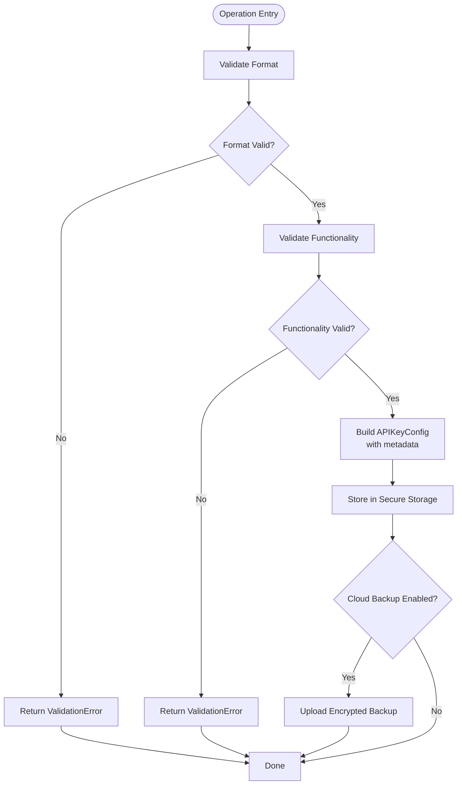

**Diagram sources**
- [byok_manager.dart](file://lib/core/byok/byok_manager.dart#L182-L231)
- [cloud_backup_service.dart](file://lib/core/byok/cloud_backup_service.dart#L167-L249)

**Section sources**
- [byok_manager.dart](file://lib/core/byok/byok_manager.dart#L182-L231)
- [cloud_backup_service.dart](file://lib/core/byok/cloud_backup_service.dart#L167-L249)

### Update Workflow with Metadata Preservation
When updating API keys, the system preserves critical metadata:

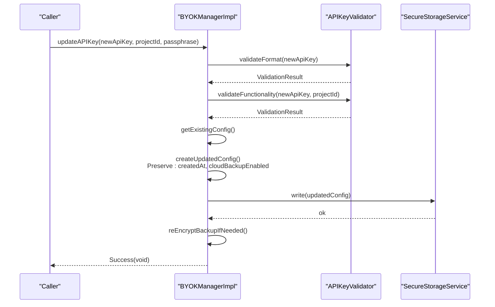

**Diagram sources**
- [byok_manager.dart](file://lib/core/byok/byok_manager.dart#L298-L384)

**Section sources**
- [byok_manager.dart](file://lib/core/byok/byok_manager.dart#L298-L384)

### Cloud Backup Rotation Workflow
Passphrase rotation uses a temporary backup for atomic swap:

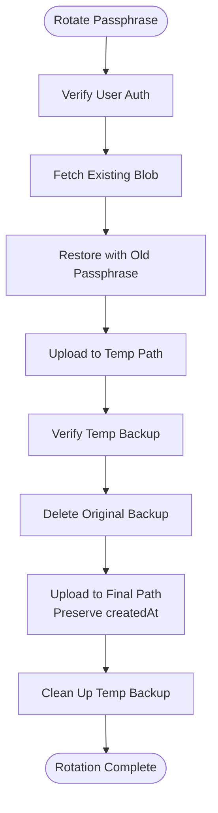

**Diagram sources**
- [cloud_backup_service.dart](file://lib/core/byok/cloud_backup_service.dart#L414-L555)

**Section sources**
- [cloud_backup_service.dart](file://lib/core/byok/cloud_backup_service.dart#L414-L555)

## Validation and Error Handling

### Validation Workflow
The API key validation follows a two-tier approach:

1. **Format Validation**: Checks key structure without network calls
2. **Functional Validation**: Verifies key works with Vertex AI API

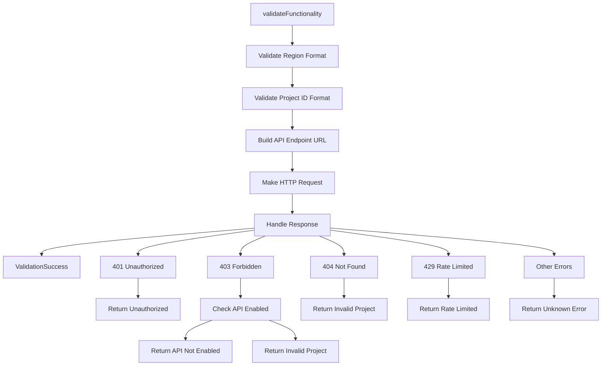

**Diagram sources**
- [api_key_validator.dart](file://lib/core/byok/api_key_validator.dart#L153-L224)

**Section sources**
- [api_key_validator.dart](file://lib/core/byok/api_key_validator.dart#L153-L224)

### Error Handling Strategy
The system uses a comprehensive error handling approach:

**Validation Errors:**
- `ValidationFailureType.invalidFormat`: Key format issues
- `ValidationFailureType.malformedKey`: Structural problems
- `ValidationFailureType.unauthorized`: Invalid or revoked keys
- `ValidationFailureType.invalidProject`: Project access issues
- `ValidationFailureType.apiNotEnabled`: API not enabled
- `ValidationFailureType.networkError`: Connectivity issues
- `ValidationFailureType.rateLimited`: Rate limiting
- `ValidationFailureType.unknown`: Unexpected errors

**Storage Errors:**
- `StorageError`: General storage failures
- `NotFoundError`: Missing data operations

**Backup Errors:**
- `BackupErrorType.notFound`: Missing backups
- `BackupErrorType.wrongPassphrase`: Incorrect passphrases
- `BackupErrorType.corrupted`: Data corruption
- `BackupErrorType.networkError`: Network issues
- `BackupErrorType.storageError`: Storage failures

**Section sources**
- [validation_result.dart](file://lib/core/byok/models/validation_result.dart#L163-L187)
- [byok_error.dart](file://lib/core/byok/models/byok_error.dart#L67-L83)

## Cloud Backup Integration

### Backup Creation Process
Cloud backup creation involves multiple security layers:

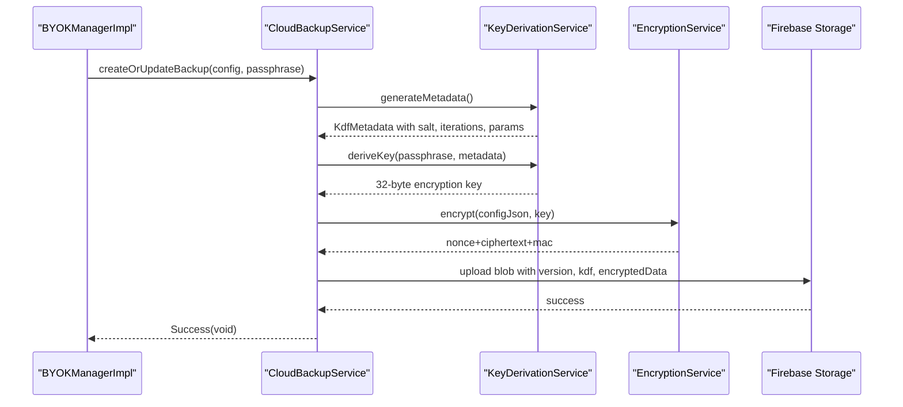

**Diagram sources**
- [cloud_backup_service.dart](file://lib/core/byok/cloud_backup_service.dart#L167-L249)
- [key_derivation_service.dart](file://lib/core/crypto/key_derivation_service.dart#L22-L53)
- [encryption_service.dart](file://lib/core/crypto/encryption_service.dart#L26-L40)

**Section sources**
- [cloud_backup_service.dart](file://lib/core/byok/cloud_backup_service.dart#L167-L249)
- [key_derivation_service.dart](file://lib/core/crypto/key_derivation_service.dart#L22-L53)
- [encryption_service.dart](file://lib/core/crypto/encryption_service.dart#L26-L40)

### Key Derivation Parameters
Different platforms use optimized key derivation parameters:

**Mobile Platforms (Android/iOS/macOS):**
- Algorithm: Argon2id
- Iterations: 3
- Memory: 64 MB
- Parallelism: 4
- Salt: Random 16 bytes

**Desktop/Web Platforms:**
- Algorithm: PBKDF2
- Iterations: 600,000
- Salt: Random 16 bytes

**Section sources**
- [key_derivation_service.dart](file://lib/core/crypto/key_derivation_service.dart#L36-L53)

### Backup Blob Structure
Cloud backup blobs contain all necessary information for decryption:

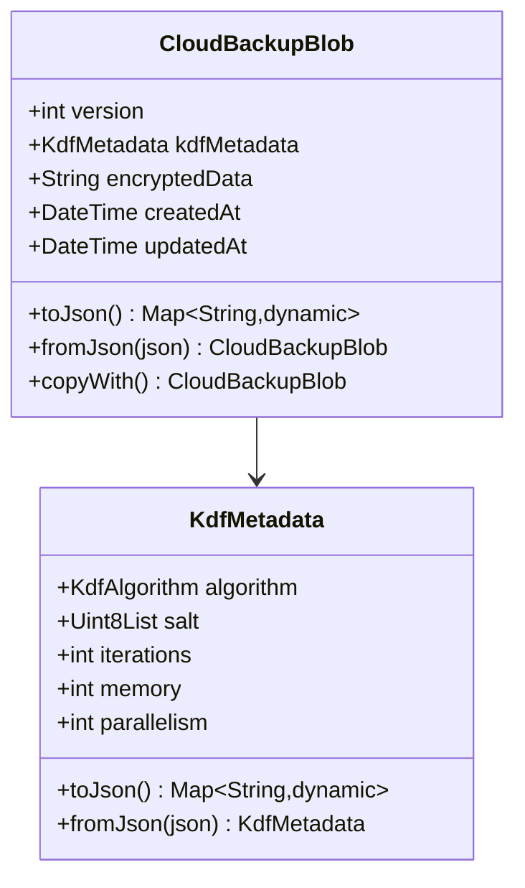

**Diagram sources**
- [cloud_backup_blob.dart](file://lib/core/byok/models/cloud_backup_blob.dart#L8-L166)
- [kdf_metadata.dart](file://lib/core/crypto/kdf_metadata.dart#L9-L78)

**Section sources**
- [cloud_backup_blob.dart](file://lib/core/byok/models/cloud_backup_blob.dart#L8-L166)
- [kdf_metadata.dart](file://lib/core/crypto/kdf_metadata.dart#L9-L78)

## Practical Usage Patterns

### Basic API Key Management
```dart
// Store API key
final result = await byokManager.storeAPIKey(apiKey, projectId);
if (result.isSuccess) {
  print("API key stored successfully");
} else {
  print("Error: ${result.errorOrNull?.message}");
}

// Retrieve API key
final getResult = await byokManager.getAPIKey();
if (getResult.isSuccess) {
  final config = getResult.valueOrNull!;
  print("Project ID: ${config.projectId}");
} else {
  print("No API key found");
}
```

**Section sources**
- [byok_manager_test.dart](file://test/byok_manager_test.dart#L267-L350)

### Cloud Backup Operations
```dart
// Enable cloud backup
final enableResult = await byokManager.enableCloudBackup(passphrase);
if (enableResult.isFailure) {
  print("Backup enable failed: ${enableResult.errorOrNull?.message}");
}

// Rotate passphrase
final rotateResult = await byokManager.rotateBackupPassphrase(
  oldPassphrase, 
  newPassphrase
);

// Restore from backup
final restoreResult = await byokManager.restoreFromCloudBackup(passphrase);
if (restoreResult.isSuccess) {
  print("Backup restored successfully");
}
```

**Section sources**
- [byok_manager_test.dart](file://test/byok_manager_test.dart#L508-L700)
- [byok_manager_test.dart](file://test/byok_manager_test.dart#L772-L1091)

### Error Handling Best Practices
```dart
// Check operation result
if (result.isFailure) {
  if (result.errorOrNull is ValidationError) {
    // Handle validation errors
    final validationError = result.errorOrNull as ValidationError;
    handleErrorByType(validationError.validationResult);
  } else if (result.errorOrNull is StorageError) {
    // Handle storage errors
    handleStorageError(result.errorOrNull as StorageError);
  } else if (result.errorOrNull is BackupError) {
    // Handle backup errors
    handleBackupError(result.errorOrNull as BackupError);
  }
}

// Helper functions
void handleErrorByType(ValidationResult validationResult) {
  if (validationResult is ValidationFailure) {
    switch (validationResult.type) {
      case ValidationFailureType.invalidFormat:
        // Show format validation message
        break;
      case ValidationFailureType.unauthorized:
        // Prompt for new key
        break;
      // Handle other cases...
    }
  }
}
```

**Section sources**
- [byok_manager_test.dart](file://test/byok_manager_test.dart#L1097-L1230)

### Integration with Other Services
The BYOK Manager integrates seamlessly with other core services:

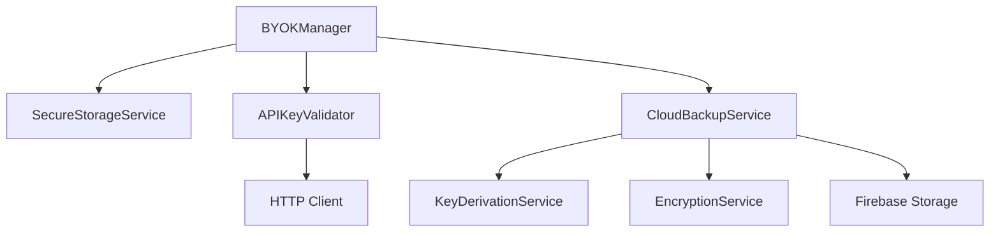

**Diagram sources**
- [byok_manager.dart](file://lib/core/byok/byok_manager.dart#L153-L180)
- [cloud_backup_service.dart](file://lib/core/byok/cloud_backup_service.dart#L97-L119)
- [api_key_validator.dart](file://lib/core/byok/api_key_validator.dart#L53-L80)

**Section sources**
- [byok_manager.dart](file://lib/core/byok/byok_manager.dart#L153-L180)
- [cloud_backup_service.dart](file://lib/core/byok/cloud_backup_service.dart#L97-L119)
- [api_key_validator.dart](file://lib/core/byok/api_key_validator.dart#L53-L80)

## Performance Considerations
- Validation overhead: Functional validation performs a network request; cache results when feasible within session boundaries.
- Cloud backup latency: Encryption and upload can be slow; consider background operations and progress feedback.
- Key derivation cost: Argon2id/PBKDF2 parameters vary by platform; balance security and performance.
- Storage I/O: Batch operations where possible; minimize repeated reads/writes.

## Troubleshooting Guide
Common issues and resolutions:

**Validation Failures:**
- Invalid format: Ensure key starts with expected prefix and has correct length.
- Unauthorized: Verify key validity and permissions.
- API not enabled: Enable Vertex AI API in the project.
- Network errors: Check connectivity and timeouts.

**Storage Errors:**
- Handle StorageError gracefully; log and retry if transient.

**Cloud Backup Errors:**
- Wrong passphrase: Prompt user to re-enter.
- Backup not found: Offer restore from another source or recreate.
- Network errors: Retry with exponential backoff.

**Update Failures:**
- New key validation fails: Do not replace; keep existing key.
- Backup re-encryption fails: Disable backup locally and log warning.

**Presence Checks:**
- hasStoredKey/isCloudBackupEnabled return false on storage errors to avoid throwing.

**Section sources**
- [byok_error.dart](file://lib/core/byok/models/byok_error.dart#L7-L94)
- [validation_result.dart](file://lib/core/byok/models/validation_result.dart#L163-L187)
- [byok_manager_test.dart](file://test/byok_manager_test.dart#L1097-L1230)

## Conclusion
The BYOK Manager provides a robust, secure, and extensible foundation for API key lifecycle management. Its Result<T> error handling, metadata-preserving updates, optional cloud backup, and passphrase rotation capabilities ensure reliability and user control. The modular design enables easy testing, platform-specific optimizations, and future enhancements.

## Appendices

### Public Methods Reference
- `storeAPIKey(apiKey, projectId)`: Validates and stores the API key; returns Success or Failure.
- `getAPIKey()`: Retrieves stored API key configuration; returns Success(APIKeyConfig) or NotFoundError.
- `deleteAPIKey(deleteCloudBackup)`: Deletes local key and optionally cloud backup; returns Success or Failure.
- `updateAPIKey(newApiKey, projectId, passphrase?)`: Validates and replaces the key; preserves metadata; optionally re-encrypts backup.
- `enableCloudBackup(passphrase)`: Encrypts and uploads backup; marks cloud backup enabled.
- `disableCloudBackup(deleteBackup)`: Disables cloud backup and optionally deletes remote backup.
- `restoreFromCloudBackup(passphrase)`: Downloads and decrypts backup; stores locally.
- `hasStoredKey()`: Checks local key presence.
- `isCloudBackupEnabled()`: Checks cloud backup flag.
- `rotateBackupPassphrase(oldPassphrase, newPassphrase)`: Re-encrypts backup with new passphrase.

**Section sources**
- [byok_manager.dart](file://lib/core/byok/byok_manager.dart#L84-L147)

### Practical Usage Patterns
- **Store and retrieve**: Use storeAPIKey followed by getAPIKey to manage keys.
- **Update with backup**: Call updateAPIKey with passphrase to re-encrypt backup if enabled.
- **Cloud backup lifecycle**: Enable via enableCloudBackup; disable via disableCloudBackup; restore via restoreFromCloudBackup.
- **Error handling**: Always check isSuccess/isFailure and handle specific error types appropriately.

**Section sources**
- [byok_manager_test.dart](file://test/byok_manager_test.dart#L267-L502)
- [byok_manager_test.dart](file://test/byok_manager_test.dart#L508-L700)
- [byok_manager_test.dart](file://test/byok_manager_test.dart#L772-L1091)
- [byok_manager_test.dart](file://test/byok_manager_test.dart#L1236-L1385)

### Test Coverage
The implementation includes comprehensive test coverage for:
- API key storage and retrieval operations
- Cloud backup enable/disable functionality
- Error handling scenarios
- Validation workflow testing
- Integration with mock services

**Section sources**
- [byok_manager_test.dart](file://test/byok_manager_test.dart#L1-L200)
- [cloud_backup_service_test.dart](file://test/cloud_backup_service_test.dart#L1-L200)