# Cloud Backup Integration

<cite>
**Referenced Files in This Document**
- [cloud_backup_service.dart](file://lib/core/byok/cloud_backup_service.dart)
- [byok_manager.dart](file://lib/core/byok/byok_manager.dart)
- [cloud_backup_blob.dart](file://lib/core/byok/models/cloud_backup_blob.dart)
- [encryption_service.dart](file://lib/core/crypto/encryption_service.dart)
- [key_derivation_service.dart](file://lib/core/crypto/key_derivation_service.dart)
- [secure_storage_service.dart](file://lib/core/storage/secure_storage_service.dart)
- [secure_storage_service_impl.dart](file://lib/core/storage/secure_storage_service_impl.dart)
- [byok_storage_keys.dart](file://lib/core/byok/byok_storage_keys.dart)
- [byok_error.dart](file://lib/core/byok/models/byok_error.dart)
- [api_key_config.dart](file://lib/core/byok/models/api_key_config.dart)
- [cloud_backup_service_test.dart](file://test/cloud_backup_service_test.dart)
- [auth_service.dart](file://lib/core/auth/auth_service.dart)
- [auth_providers.dart](file://lib/core/auth/auth_providers.dart)
</cite>

## Update Summary
**Changes Made**
- Updated to reflect refactored cloud backup service with improved decryption logic
- Enhanced network overhead reduction through optimized backup operations
- Improved password change workflows with better error handling and state consistency
- Added new `_decryptBlob` helper method for reusable decryption logic
- Implemented `_fetchAndParseBlob` helper for consolidated blob fetching
- Enhanced `_verifyBackupAtPath` method for efficient passphrase verification
- Improved error handling with better network error detection and classification
- Added comprehensive helper methods for backup management operations

## Table of Contents
1. [Introduction](#introduction)
2. [Project Structure](#project-structure)
3. [Core Components](#core-components)
4. [Architecture Overview](#architecture-overview)
5. [Detailed Component Analysis](#detailed-component-analysis)
6. [Dependency Analysis](#dependency-analysis)
7. [Performance Considerations](#performance-considerations)
8. [Troubleshooting Guide](#troubleshooting-guide)
9. [Conclusion](#conclusion)

## Introduction
This document provides comprehensive technical documentation for the cloud backup integration capabilities in the StyleSync application. It focuses on four primary methods: `enableCloudBackup`, `disableCloudBackup`, `restoreFromCloudBackup`, and `rotateBackupPassphrase`. The documentation explains the passphrase-based encryption workflow, backup creation and management processes, and the relationship between local configuration and cloud storage. It also details error handling strategies for cloud operations, including partial failure recovery and state consistency maintenance, along with practical examples and security considerations.

**Updated** The cloud backup system has been refactored with improved decryption logic, reduced network overhead, and optimized password change workflows. The new implementation includes dedicated helper methods for decryption, blob fetching, and verification operations, providing better modularity and maintainability.

## Project Structure
The cloud backup integration spans several core modules with enhanced authentication abstraction and improved operational efficiency:
- Cloud backup service: Implements the complete backup lifecycle using Firebase Storage, encryption, and key derivation through AuthService abstraction
- BYOK manager: Orchestrates API key lifecycle and coordinates cloud backup operations
- Cryptographic services: Provides encryption and key derivation functionality
- Secure storage: Manages local persistence of API key configurations and backup flags
- Models: Define data structures for API key configurations and backup blobs
- Authentication service: Provides centralized authentication abstraction with AuthService interface

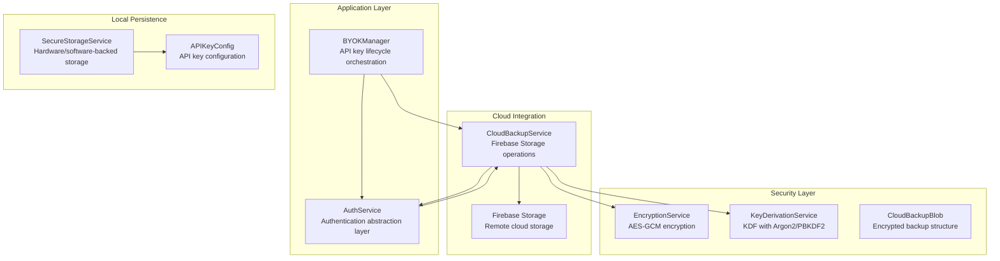

**Diagram sources**
- [byok_manager.dart](file://lib/core/byok/byok_manager.dart#L149-L583)
- [cloud_backup_service.dart](file://lib/core/byok/cloud_backup_service.dart#L97-L899)
- [auth_service.dart](file://lib/core/auth/auth_service.dart#L19-L75)
- [encryption_service.dart](file://lib/core/crypto/encryption_service.dart#L22-L75)
- [key_derivation_service.dart](file://lib/core/crypto/key_derivation_service.dart#L17-L118)
- [secure_storage_service.dart](file://lib/core/storage/secure_storage_service.dart#L11-L30)

**Section sources**
- [byok_manager.dart](file://lib/core/byok/byok_manager.dart#L1-L583)
- [cloud_backup_service.dart](file://lib/core/byok/cloud_backup_service.dart#L1-L908)
- [auth_service.dart](file://lib/core/auth/auth_service.dart#L1-L401)

## Core Components
This section documents the four primary cloud backup methods and their implementation details, highlighting the new AuthService dependency and improved operational efficiency.

### enableCloudBackup Method
The `enableCloudBackup` method enables cloud backup for the current API key configuration. It performs the following steps:
1. Validates that the CloudBackupService is available
2. Retrieves the current API key configuration
3. Creates or updates the encrypted backup in cloud storage using AuthService for authentication
4. Updates local configuration to mark cloud backup as enabled
5. Stores the cloud backup enabled flag

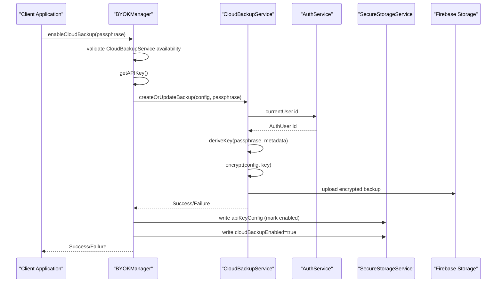

**Diagram sources**
- [byok_manager.dart](file://lib/core/byok/byok_manager.dart#L387-L429)
- [cloud_backup_service.dart](file://lib/core/byok/cloud_backup_service.dart#L167-L249)
- [auth_service.dart](file://lib/core/auth/auth_service.dart#L89-L98)

### disableCloudBackup Method
The `disableCloudBackup` method disables cloud backup and optionally deletes the remote backup:
1. Updates local configuration to mark cloud backup as disabled
2. Removes cloud backup enabled flag and passphrase hash
3. Optionally deletes the backup from cloud storage using AuthService for authentication
4. Logs any storage errors without failing the operation

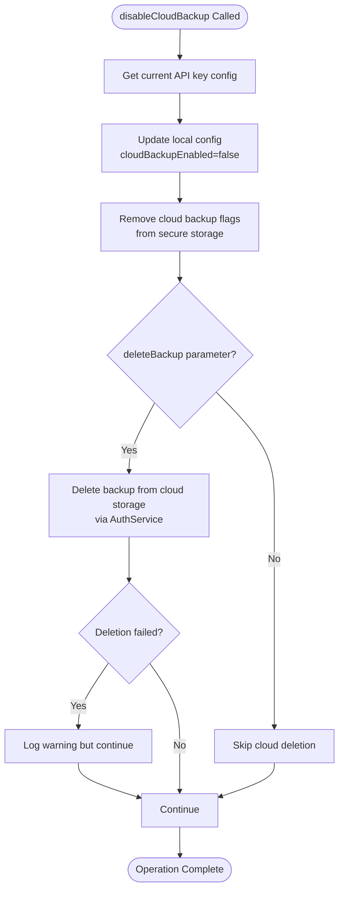

**Diagram sources**
- [byok_manager.dart](file://lib/core/byok/byok_manager.dart#L432-L466)
- [cloud_backup_service.dart](file://lib/core/byok/cloud_backup_service.dart#L320-L364)

### restoreFromCloudBackup Method
The `restoreFromCloudBackup` method restores an API key configuration from cloud backup:
1. Validates CloudBackupService availability
2. Calls cloud service to restore backup using AuthService for authentication
3. Decrypts and validates the restored configuration
4. Stores the restored configuration locally
5. Updates cloud backup enabled flag if present in restored config

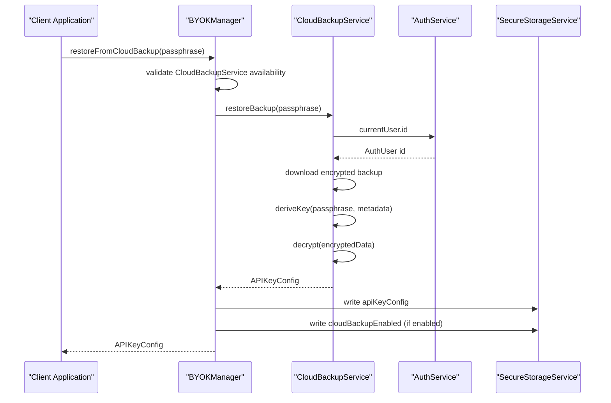

**Diagram sources**
- [byok_manager.dart](file://lib/core/byok/byok_manager.dart#L469-L502)
- [cloud_backup_service.dart](file://lib/core/byok/cloud_backup_service.dart#L252-L317)
- [auth_service.dart](file://lib/core/auth/auth_service.dart#L89-L98)

### rotateBackupPassphrase Method
The `rotateBackupPassphrase` method securely rotates the passphrase for an existing backup using a temporary backup approach:
1. Captures original createdAt timestamp
2. Restores backup with old passphrase using AuthService for authentication
3. Uploads re-encrypted backup to temporary path
4. Verifies temp backup can be decrypted with new passphrase
5. Performs atomic swap: delete old backup, upload temp to final
6. Cleans up temporary backup

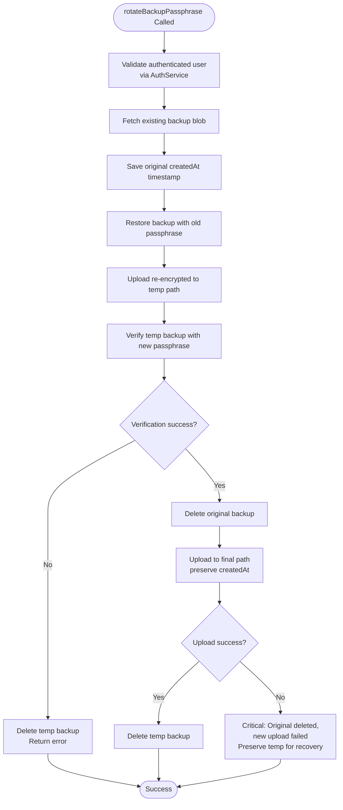

**Diagram sources**
- [byok_manager.dart](file://lib/core/byok/byok_manager.dart#L527-L541)
- [cloud_backup_service.dart](file://lib/core/byok/cloud_backup_service.dart#L414-L555)
- [auth_service.dart](file://lib/core/auth/auth_service.dart#L89-L98)

**Section sources**
- [byok_manager.dart](file://lib/core/byok/byok_manager.dart#L117-L146)
- [cloud_backup_service.dart](file://lib/core/byok/cloud_backup_service.dart#L35-L91)

## Architecture Overview
The cloud backup architecture follows a layered approach with clear separation of concerns and enhanced authentication abstraction:

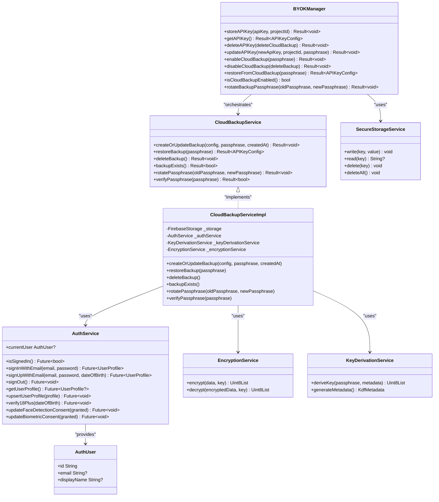

**Diagram sources**
- [byok_manager.dart](file://lib/core/byok/byok_manager.dart#L84-L147)
- [cloud_backup_service.dart](file://lib/core/byok/cloud_backup_service.dart#L21-L91)
- [auth_service.dart](file://lib/core/auth/auth_service.dart#L19-L75)
- [encryption_service.dart](file://lib/core/crypto/encryption_service.dart#L14-L20)
- [key_derivation_service.dart](file://lib/core/crypto/key_derivation_service.dart#L9-L15)
- [secure_storage_service.dart](file://lib/core/storage/secure_storage_service.dart#L11-L29)

## Detailed Component Analysis

### Passphrase-Based Encryption Workflow
The encryption workflow uses a hybrid approach combining key derivation and symmetric encryption:

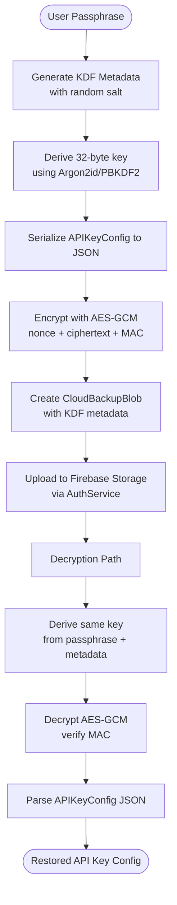

**Diagram sources**
- [cloud_backup_service.dart](file://lib/core/byok/cloud_backup_service.dart#L181-L211)
- [encryption_service.dart](file://lib/core/crypto/encryption_service.dart#L22-L75)
- [key_derivation_service.dart](file://lib/core/crypto/key_derivation_service.dart#L22-L53)
- [auth_service.dart](file://lib/core/auth/auth_service.dart#L89-L98)

### Backup Creation and Management
The backup creation process involves several critical steps with AuthService integration:

1. **Authentication Verification**: Uses AuthService.currentUser for user authentication validation
2. **KDF Metadata Generation**: Creates fresh salt and parameters for key derivation
3. **Key Derivation**: Uses Argon2id on mobile devices and PBKDF2 on desktop/web
4. **Encryption**: Encrypts serialized configuration with AES-GCM
5. **Blob Creation**: Constructs CloudBackupBlob with version, metadata, and timestamps
6. **Upload**: Stores encrypted data in Firebase Storage using AuthService for user identification

### Enhanced Decryption Logic
The refactored cloud backup service includes improved decryption logic through dedicated helper methods:

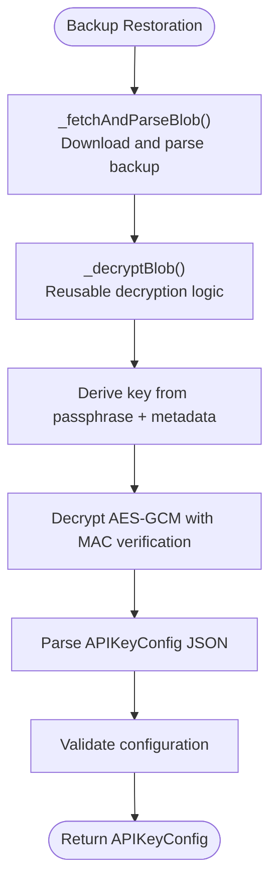

**Diagram sources**
- [cloud_backup_service.dart](file://lib/core/byok/cloud_backup_service.dart#L252-L330)
- [cloud_backup_service.dart](file://lib/core/byok/cloud_backup_service.dart#L787-L863)

### Optimized Password Change Workflows
The passphrase rotation workflow has been optimized to reduce network overhead:

1. **Single Blob Fetch**: Uses existing blob to preserve createdAt timestamp
2. **Direct Decryption**: Leverages `_decryptBlob` helper to avoid redundant fetches
3. **Temporary Backup Approach**: Reduces network round trips during rotation
4. **Atomic Swap Strategy**: Minimizes data exposure during rotation
5. **Enhanced Error Recovery**: Improved temporary backup management

### Error Handling Strategies
The system implements comprehensive error handling with distinct error types and AuthService-specific considerations:

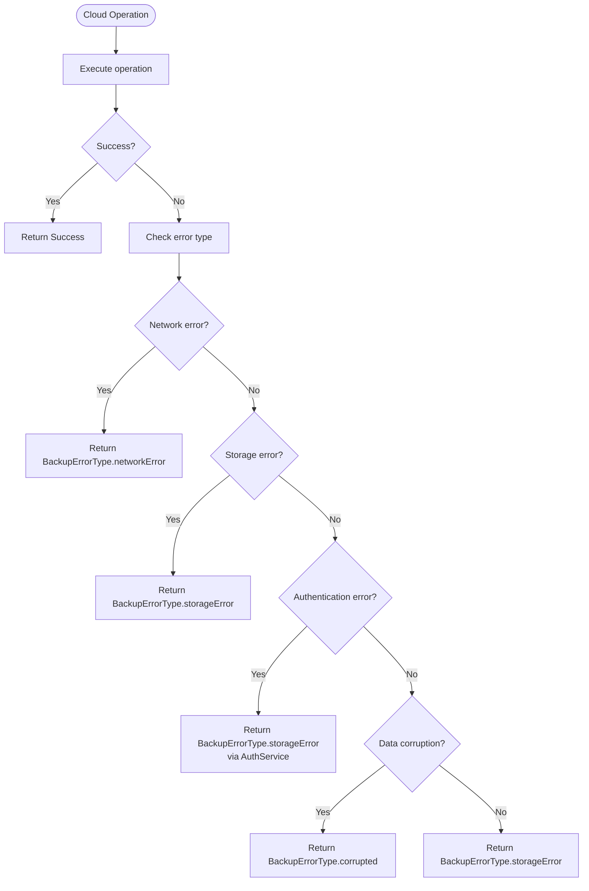

**Diagram sources**
- [cloud_backup_service.dart](file://lib/core/byok/cloud_backup_service.dart#L139-L164)
- [byok_error.dart](file://lib/core/byok/models/byok_error.dart#L68-L83)

### State Consistency Maintenance
The system maintains state consistency through careful transaction-like operations with AuthService integration:

1. **Atomic Operations**: Methods are designed to minimize inconsistent states
2. **Temporary Backups**: Used during passphrase rotation to prevent data loss
3. **Error Recovery**: Temporary backups serve as recovery points
4. **Local State Updates**: Local configuration is updated before cloud operations when safe
5. **AuthService Coordination**: All authentication-dependent operations use AuthService for consistent user state management

**Section sources**
- [cloud_backup_service.dart](file://lib/core/byok/cloud_backup_service.dart#L414-L555)
- [byok_manager.dart](file://lib/core/byok/byok_manager.dart#L387-L541)

## Dependency Analysis
The cloud backup system has well-defined dependencies with enhanced authentication abstraction that support modularity and testability:

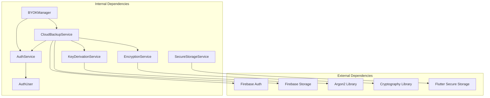

**Diagram sources**
- [cloud_backup_service.dart](file://lib/core/byok/cloud_backup_service.dart#L5-L14)
- [byok_manager.dart](file://lib/core/byok/byok_manager.dart#L1-L15)
- [auth_service.dart](file://lib/core/auth/auth_service.dart#L1-L8)

**Section sources**
- [cloud_backup_service.dart](file://lib/core/byok/cloud_backup_service.dart#L1-L15)
- [byok_manager.dart](file://lib/core/byok/byok_manager.dart#L1-L15)
- [auth_service.dart](file://lib/core/auth/auth_service.dart#L1-L8)

## Performance Considerations
Several performance optimizations are implemented with AuthService integration:

1. **Platform-Specific KDF**: Uses Argon2id on mobile devices (hardware acceleration) and PBKDF2 on desktop/web
2. **Asynchronous Operations**: All cryptographic operations use `compute()` for CPU-intensive tasks
3. **Efficient Serialization**: JSON serialization minimizes overhead
4. **Network Optimization**: Temporary backup approach reduces network round trips
5. **Memory Management**: Proper disposal of sensitive data after operations
6. **AuthService Caching**: AuthUser instances are cached through AuthService for reduced authentication overhead
7. **Helper Method Reuse**: Dedicated helper methods reduce code duplication and improve performance
8. **Optimized Blob Fetching**: Consolidated blob fetching reduces network requests

## Troubleshooting Guide

### Common Error Scenarios and Solutions

#### Authentication Failures
- **Symptoms**: `BackupErrorType.storageError` with authentication messages
- **Causes**: User not logged in, AuthService.currentUser is null, session expired
- **Solutions**: Re-authenticate user via AuthService, check authentication state, verify AuthService initialization

#### Network Connectivity Issues
- **Symptoms**: `BackupErrorType.networkError` during operations
- **Causes**: Internet connectivity, DNS failures, server timeouts, AuthService authentication issues
- **Solutions**: Retry operations, implement exponential backoff, check firewall settings, verify AuthService connectivity

#### Passphrase Verification Failures
- **Symptoms**: `BackupErrorType.wrongPassphrase` during restore/rotation
- **Causes**: Incorrect passphrase, corrupted backup, AuthService authentication problems
- **Solutions**: Verify passphrase accuracy, check backup integrity, ensure AuthService is properly initialized

#### AuthService Integration Issues
- **Symptoms**: `StateError: No authenticated user` during backup operations
- **Causes**: AuthService not properly initialized, AuthUser.id is null
- **Solutions**: Initialize AuthService before CloudBackupService, verify authentication state, check auth providers

#### Partial Failure Recovery
During passphrase rotation, if failures occur:
1. **Original backup deleted, new upload failed**: Temp backup remains at temp path
2. **Verification failed**: Temp backup is cleaned up automatically
3. **Network interruption**: Resume rotation using temp backup
4. **AuthService failures**: Check AuthService initialization and authentication state

### Practical Examples

#### Enable Cloud Backup Flow
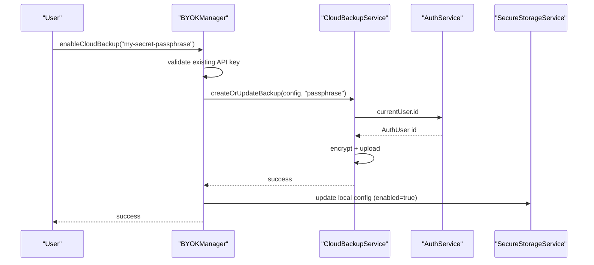

#### Restore Backup Procedure
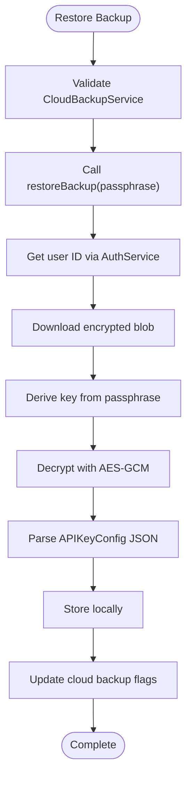

#### Passphrase Rotation Process
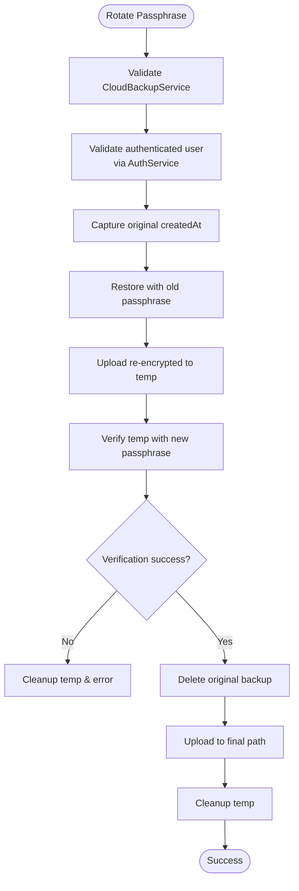

**Section sources**
- [cloud_backup_service_test.dart](file://test/cloud_backup_service_test.dart#L323-L371)
- [byok_error.dart](file://lib/core/byok/models/byok_error.dart#L57-L83)

## Security Considerations

### Cryptographic Implementation
1. **Key Derivation**: Uses Argon2id (mobile) and PBKDF2 (desktop/web) with random salts
2. **Encryption**: AES-GCM provides authenticated encryption with MAC verification
3. **Key Size**: 256-bit keys for AES-GCM encryption
4. **Nonce Management**: Automatic nonce generation prevents replay attacks

### Data Protection Measures
1. **Local Storage**: Hardware-backed secure storage on supported platforms
2. **Network Security**: HTTPS encryption for all cloud communications
3. **Passphrase Handling**: No plaintext passphrase storage
4. **Temporary Backups**: Minimizes exposure window during rotation
5. **AuthService Abstraction**: Eliminates direct Firebase dependency coupling for improved security isolation

### Privacy and Compliance
1. **Client-Side Encryption**: Keys never leave device boundaries
2. **Minimal Data Collection**: Only encrypted backup data stored remotely
3. **Data Retention**: Explicit deletion capabilities for user control
4. **Audit Logging**: Comprehensive error logging for security monitoring
5. **Authentication Isolation**: AuthService provides clean separation between authentication and backup operations

### Integration Patterns with CloudBackupService
The CloudBackupService follows these integration patterns with AuthService:
1. **Riverpod Providers**: Dependency injection for testability and mocking
2. **Result Type Pattern**: Consistent error handling across all operations
3. **Provider Architecture**: Modular design enabling easy testing and extension
4. **Platform Abstraction**: Cross-platform compatibility with platform-specific optimizations
5. **Authentication Abstraction**: Centralized authentication through AuthService interface
6. **Dependency Injection**: Clean separation of Firebase dependencies from business logic
7. **Helper Method Pattern**: Dedicated methods for decryption, blob fetching, and verification
8. **Error Classification**: Distinct error types for better debugging and user feedback

**Section sources**
- [encryption_service.dart](file://lib/core/crypto/encryption_service.dart#L6-L12)
- [key_derivation_service.dart](file://lib/core/crypto/key_derivation_service.dart#L27-L32)
- [secure_storage_service_impl.dart](file://lib/core/storage/secure_storage_service_impl.dart#L37-L62)
- [auth_service.dart](file://lib/core/auth/auth_service.dart#L19-L75)