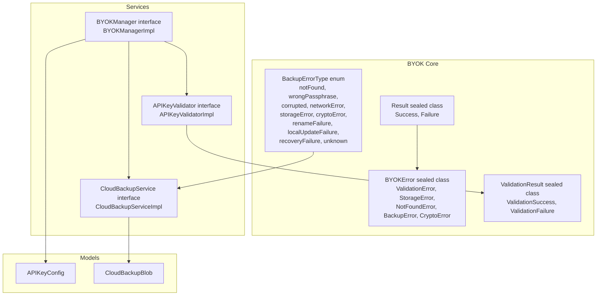
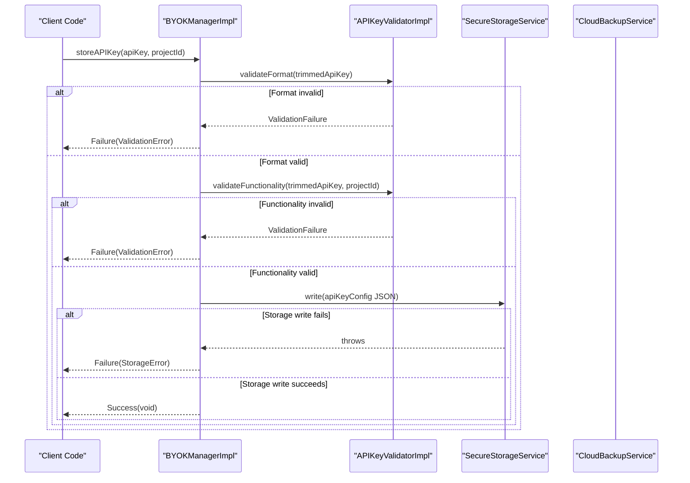
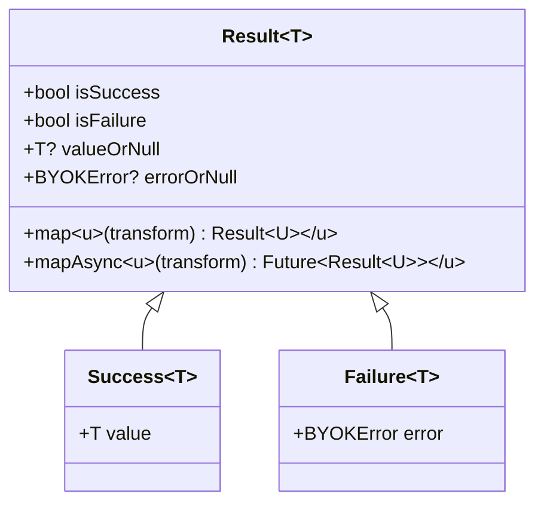
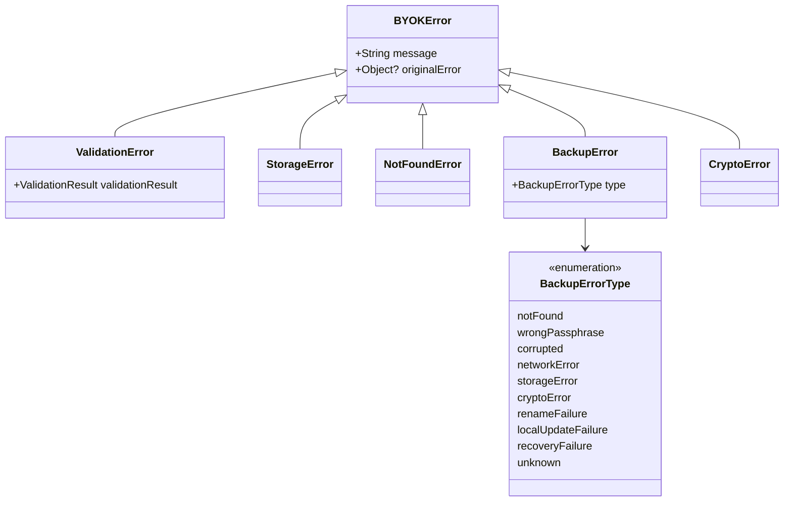
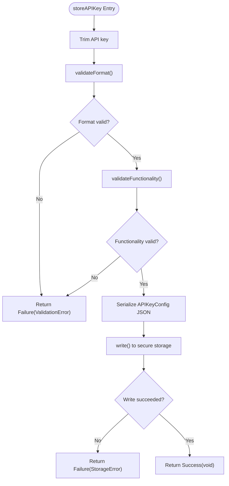
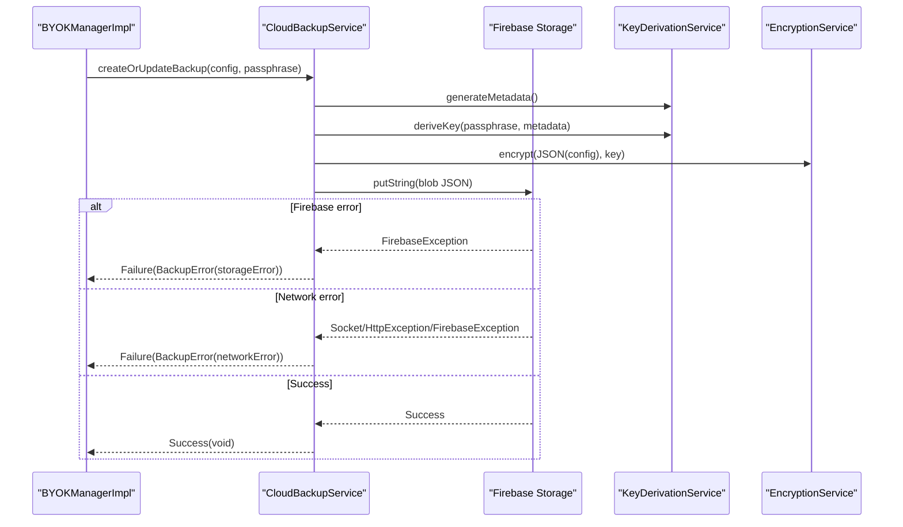
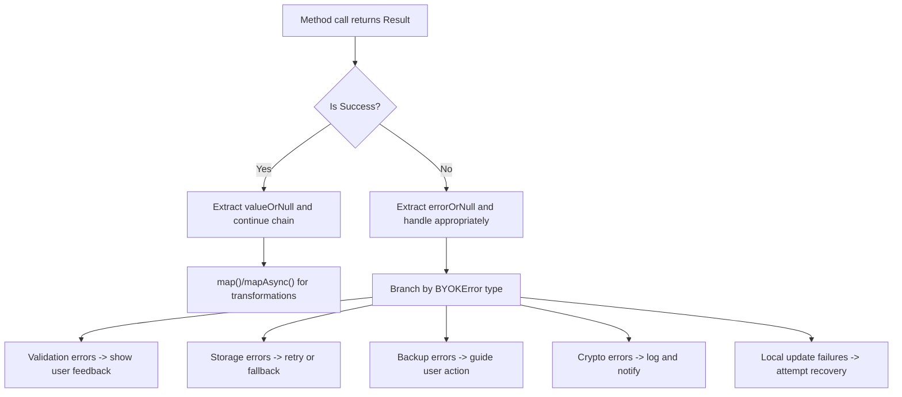
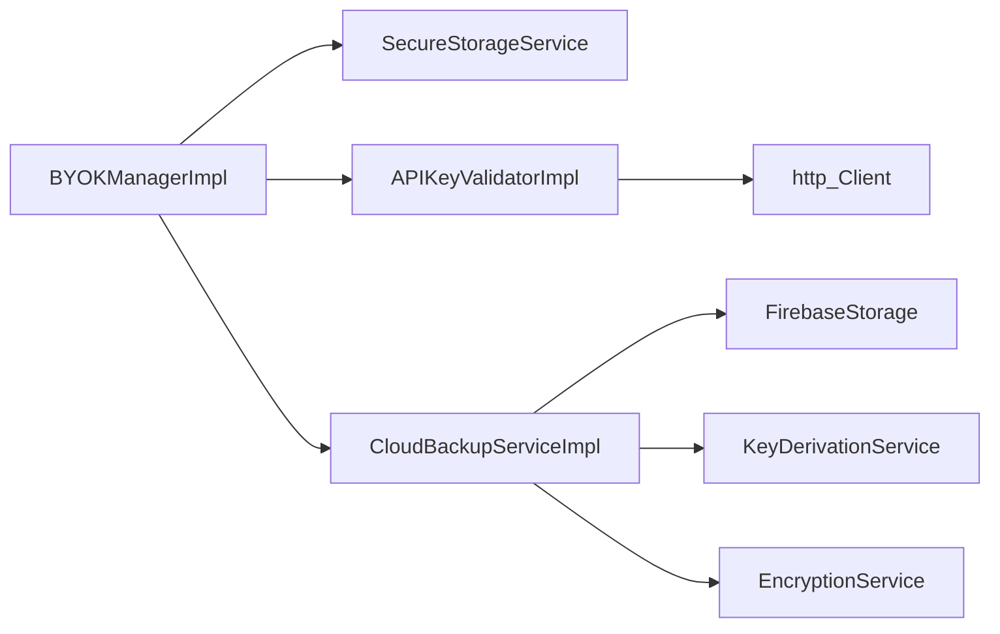

# Error Handling Patterns

<cite>
**Referenced Files in This Document**
- [byok_error.dart](file://lib/core/byok/models/byok_error.dart)
- [validation_result.dart](file://lib/core/byok/models/validation_result.dart)
- [byok_manager.dart](file://lib/core/byok/byok_manager.dart)
- [api_key_validator.dart](file://lib/core/byok/api_key_validator.dart)
- [cloud_backup_service.dart](file://lib/core/byok/cloud_backup_service.dart)
- [cloud_backup_blob.dart](file://lib/core/byok/models/cloud_backup_blob.dart)
- [byok_manager_test.dart](file://test/byok_manager_test.dart)
</cite>

## Update Summary
**Changes Made**
- Enhanced documentation with detailed error categories for FirebaseError to ProcessingError transitions
- Added comprehensive recovery procedures for critical backup operations
- Expanded user-facing messaging guidelines for different error scenarios
- Documented specific error handling patterns for FirebaseException to BackupError transitions
- Added detailed BackupErrorType extensions for passphrase rotation operations

## Table of Contents
1. [Introduction](#introduction)
2. [Project Structure](#project-structure)
3. [Core Components](#core-components)
4. [Architecture Overview](#architecture-overview)
5. [Detailed Component Analysis](#detailed-component-analysis)
6. [Enhanced Error Categories and Recovery Procedures](#enhanced-error-categories-and-recovery-procedures)
7. [FirebaseError to ProcessingError Transition Patterns](#firebaseerror-to-processingerror-transition-patterns)
8. [User-Facing Messaging Guidelines](#user-facing-messaging-guidelines)
9. [Dependency Analysis](#dependency-analysis)
10. [Performance Considerations](#performance-considerations)
11. [Troubleshooting Guide](#troubleshooting-guide)
12. [Conclusion](#conclusion)

## Introduction
This document explains the Result<T> sealed class pattern and error handling strategies used throughout BYOKManager. It covers the Success and Failure classes, their usage patterns, and how errors propagate through method chains. It documents all BYOKError types including ValidationError, StorageError, NotFoundError, and BackupError with their specific use cases. It details error handling strategies for validation failures, storage errors, and cloud backup operations, and provides practical examples of error handling in method calls, error propagation patterns, and best practices for consuming Result<T> types in client code.

**Updated** Enhanced with detailed error categories, recovery procedures, user-facing messaging guidelines, and specific error handling patterns for FirebaseError to ProcessingError transitions.

## Project Structure
The BYOK subsystem is organized around a Result<T> sealed class pattern that unifies success and failure outcomes. Supporting models define error categories and validation outcomes. The BYOKManager orchestrates API key lifecycle operations, delegating validation to APIKeyValidator and cloud backup to CloudBackupService. Tests demonstrate error handling across all operational paths.



**Diagram sources**
- [byok_manager.dart](file://lib/core/byok/byok_manager.dart#L23-L78)
- [byok_error.dart](file://lib/core/byok/models/byok_error.dart#L7-L93)
- [validation_result.dart](file://lib/core/byok/models/validation_result.dart#L5-L187)
- [api_key_validator.dart](file://lib/core/byok/api_key_validator.dart#L14-L48)
- [cloud_backup_service.dart](file://lib/core/byok/cloud_backup_service.dart#L21-L91)
- [cloud_backup_blob.dart](file://lib/core/byok/models/cloud_backup_blob.dart#L8-L156)

**Section sources**
- [byok_manager.dart](file://lib/core/byok/byok_manager.dart#L1-L583)
- [byok_error.dart](file://lib/core/byok/models/byok_error.dart#L1-L94)
- [validation_result.dart](file://lib/core/byok/models/validation_result.dart#L1-L188)
- [api_key_validator.dart](file://lib/core/byok/api_key_validator.dart#L1-L322)
- [cloud_backup_service.dart](file://lib/core/byok/cloud_backup_service.dart#L1-L900)
- [cloud_backup_blob.dart](file://lib/core/byok/models/cloud_backup_blob.dart#L1-L157)

## Core Components
- Result<T> sealed class: Provides a type-safe way to represent either a successful outcome with a value or a failure with an error. It exposes helpers like isSuccess, isFailure, valueOrNull, errorOrNull, and transformation methods map and mapAsync.
- Success<T>: Encapsulates a successful value and provides a helpful toString representation.
- Failure<T>: Encapsulates a BYOKError and provides a helpful toString representation.
- BYOKError sealed class hierarchy: Defines error categories for validation failures, storage errors, cloud backup failures, and cryptographic errors. Specific subclasses carry contextual information such as validation results or backup error types.
- ValidationResult sealed class: Represents validation outcomes with ValidationSuccess and ValidationFailure variants, enabling precise error categorization during API key validation.

These components form the foundation for consistent error handling across the BYOK subsystem.

**Section sources**
- [byok_manager.dart](file://lib/core/byok/byok_manager.dart#L23-L78)
- [byok_error.dart](file://lib/core/byok/models/byok_error.dart#L7-L93)
- [validation_result.dart](file://lib/core/byok/models/validation_result.dart#L5-L187)

## Architecture Overview
The BYOKManager orchestrates API key lifecycle operations. It validates API keys using APIKeyValidator, stores configurations via secure storage, and optionally manages cloud backups through CloudBackupService. Errors are consistently represented as BYOKError instances wrapped in Failure<T>. The Result<T> pattern enables method chaining and predictable error propagation.



**Diagram sources**
- [byok_manager.dart](file://lib/core/byok/byok_manager.dart#L182-L231)
- [api_key_validator.dart](file://lib/core/byok/api_key_validator.dart#L112-L224)

**Section sources**
- [byok_manager.dart](file://lib/core/byok/byok_manager.dart#L84-L147)
- [api_key_validator.dart](file://lib/core/byok/api_key_validator.dart#L14-L48)

## Detailed Component Analysis

### Result<T> Sealed Class Pattern
The Result<T> sealed class defines a uniform contract for operations that can succeed or fail. It provides:
- isSuccess and isFailure getters for quick branching.
- valueOrNull and errorOrNull for safe extraction of values or errors.
- map and mapAsync for transforming successful results without altering failures.



**Diagram sources**
- [byok_manager.dart](file://lib/core/byok/byok_manager.dart#L23-L78)

**Section sources**
- [byok_manager.dart](file://lib/core/byok/byok_manager.dart#L23-L78)

### BYOKError Types and Usage
The BYOKError sealed class hierarchy categorizes errors:
- ValidationError: Wraps ValidationResult to indicate validation failures with detailed reasons.
- StorageError: Indicates failures in secure storage operations with optional original error context.
- NotFoundError: Signals absence of stored API key configuration.
- BackupError: Represents cloud backup failures with typed reasons (notFound, wrongPassphrase, corrupted, networkError, storageError, cryptoError, renameFailure, localUpdateFailure, recoveryFailure, unknown).
- CryptoError: Represents cryptographic operation failures.

**Updated** Enhanced BackupErrorType with additional categories for passphrase rotation operations including localUpdateFailure, recoveryFailure, and renameFailure.



**Diagram sources**
- [byok_error.dart](file://lib/core/byok/models/byok_error.dart#L7-L93)

**Section sources**
- [byok_error.dart](file://lib/core/byok/models/byok_error.dart#L7-L93)

### Validation Workflow and Error Propagation
API key validation proceeds in two stages:
1. Format validation: Ensures the key meets structural requirements.
2. Functionality validation: Calls the Vertex AI API to verify the key works.

If either stage fails, a ValidationError is returned with the specific ValidationResult. Network errors during functionality validation are captured and mapped to ValidationFailure with appropriate types.



**Diagram sources**
- [byok_manager.dart](file://lib/core/byok/byok_manager.dart#L182-L231)
- [api_key_validator.dart](file://lib/core/byok/api_key_validator.dart#L112-L224)

**Section sources**
- [byok_manager.dart](file://lib/core/byok/byok_manager.dart#L182-L231)
- [api_key_validator.dart](file://lib/core/byok/api_key_validator.dart#L112-L224)

### Cloud Backup Operations and Error Handling
Cloud backup operations are encapsulated in CloudBackupService. The implementation handles:
- Creating or updating backups with encryption and metadata preservation.
- Restoring backups with passphrase verification and decryption.
- Deleting backups and checking existence.
- Passphrase rotation using a temporary backup to maintain atomicity despite storage limitations.

Errors are categorized using BackupError with specific types. Network errors are detected and mapped to BackupErrorType.networkError. Firebase exceptions are mapped to BackupErrorType.storageError with original error context.

**Updated** Enhanced with detailed recovery procedures for local state update failures and comprehensive error categorization for monitoring dashboards.



**Diagram sources**
- [cloud_backup_service.dart](file://lib/core/byok/cloud_backup_service.dart#L167-L249)

**Section sources**
- [cloud_backup_service.dart](file://lib/core/byok/cloud_backup_service.dart#L167-L249)

### Error Propagation Through Method Chains
BYOKManager methods consistently return Result<T>:
- storeAPIKey: Validates format and functionality, then writes to storage. Errors are wrapped as ValidationError or StorageError.
- getAPIKey: Reads from storage and parses JSON. Returns NotFoundError if nothing is found, StorageError for parse/format errors.
- updateAPIKey: Validates new key, updates local config, and optionally re-encrypts cloud backup. On backup re-encryption failure, it disables cloud backup locally and logs a warning.
- enableCloudBackup: Requires an existing key and a backup service. Errors propagate as BackupError or StorageError.
- disableCloudBackup: Updates local state and optionally deletes cloud backup, logging but not failing on backup deletion errors.
- restoreFromCloudBackup: Downloads and decrypts backup, mapping passphrase mismatches to wrongPassphrase and missing backups to notFound.
- rotateBackupPassphrase: Uses a temporary backup to achieve atomic rotation, preserving createdAt timestamps and cleaning up temp artifacts.

**Updated** Enhanced with detailed recovery procedures for critical failure scenarios during passphrase rotation.



**Diagram sources**
- [byok_manager.dart](file://lib/core/byok/byok_manager.dart#L23-L78)
- [byok_error.dart](file://lib/core/byok/models/byok_error.dart#L7-L93)

**Section sources**
- [byok_manager.dart](file://lib/core/byok/byok_manager.dart#L182-L541)

### Practical Examples and Best Practices
- Consuming Result<T> in client code:
  - Use isSuccess/isFailure for branching.
  - Use valueOrNull/errorOrNull to safely extract values or errors.
  - Use map/mapAsync to transform successful results without altering failures.
- Handling specific error types:
  - ValidationError: Present actionable messages to users and suggest corrections.
  - StorageError: Offer retry mechanisms or fallback strategies.
  - NotFoundError: Prompt users to enter or restore their API key.
  - BackupError: Provide guidance based on type (e.g., wrong passphrase, network issues).
  - CryptoError: Log and notify users to avoid sensitive data exposure.
- Error propagation patterns:
  - Prefer wrapping lower-level exceptions as BYOKError to maintain a consistent error surface.
  - Log warnings for non-fatal failures (e.g., cloud backup deletion during key deletion) to preserve local state integrity.
  - Preserve user data when possible (e.g., disable cloud backup locally on re-encryption failure).

**Updated** Enhanced with recovery procedures for critical failure scenarios and detailed user-facing messaging guidelines.

**Section sources**
- [byok_manager_test.dart](file://test/byok_manager_test.dart#L1097-L1229)
- [byok_manager_test.dart](file://test/byok_manager_test.dart#L1391-L1433)

## Enhanced Error Categories and Recovery Procedures

### Comprehensive BackupErrorType Extensions
The BackupErrorType enumeration has been extended to support detailed error reporting required for passphrase rotation operations:

- **notFound**: Backup does not exist
- **wrongPassphrase**: Passphrase is incorrect
- **corrupted**: Backup is corrupted
- **networkError**: Network error during backup operation
- **storageError**: Firebase Storage error
- **cryptoError**: Encryption or decryption operation failed
- **renameFailure**: Atomic rename operation failed after retries
- **localUpdateFailure**: Local state update failed; recovery attempted
- **recoveryFailure**: Critical: Recovery from failure was unsuccessful
- **unknown**: Unknown or unexpected error

**Updated** Added new error categories specifically for passphrase rotation operations including localUpdateFailure, recoveryFailure, and renameFailure.

### Local State Update Failure Recovery
When local state updates fail during passphrase rotation, the system implements comprehensive recovery procedures:

```dart
Future<Result<void>> _recoverFromLocalUpdateFailure({
  required CloudBackupBlob blob,
  required CloudBackupBlob newBlob,
  required String operationId,
}) async {
  // Attempt to restore original blob to maintain consistency
  final restoreResult = await _uploadWithRetry(
    blob,
    'backups/$userId/api_key_backup.json',
    operationId,
  );
  
  if (restoreResult.isFailure) {
    // CRITICAL: Cannot restore original blob
    return Failure(BackupError(
      'Passphrase rotation failed and recovery was unsuccessful. '
      'Your backup may be in an inconsistent state. '
      'Please try restoring with your OLD passphrase, then retry rotation. '
      'Error code: ROTATION_RECOVERY_FAILED',
      BackupErrorType.storageError,
      originalError: restoreResult.error,
    ));
  }
  
  return Failure(BackupError(
    'Passphrase rotation failed during local state update. '
    'Your backup has been restored to its previous state. '
    'Please try again. Error code: ROTATION_LOCAL_UPDATE_FAILED',
    BackupErrorType.storageError,
  ));
}
```

**Section sources**
- [cloud_backup_service.dart](file://lib/core/byok/cloud_backup_service.dart#L1234-L1301)

### Error Categorization for Monitoring Dashboards
Errors are categorized for monitoring dashboards with specific alert thresholds:

| Category | Error Types | Alert Threshold |
|----------|-------------|-----------------|
| **User Error** | `wrongPassphrase` | No alert (expected) |
| **Transient** | `networkError`, `storageError` (retryable) | > 10% failure rate |
| **Infrastructure** | `storageError` (quota, permissions) | Any occurrence |
| **Critical** | `ROTATION_RECOVERY_FAILED`, `ROTATION_RECOVERY_EXCEPTION` | Any occurrence |
| **Bug** | `unknown`, unexpected exceptions | Any occurrence |

**Section sources**
- [cloud_backup_service.dart](file://lib/core/byok/cloud_backup_service.dart#L1513-L1520)

## FirebaseError to ProcessingError Transition Patterns

### FirebaseException to BackupError Mapping
The system implements sophisticated error mapping for Firebase exceptions to BackupError types:

```dart
on FirebaseException catch (e) {
  // Only return Success(false) for object-not-found
  if (e.code == 'object-not-found') {
    return const Success(false);
  }
  // Propagate other Firebase errors (permission denied, etc.)
  return Failure(BackupError(
    'Firebase Storage error: ${e.message}',
    BackupErrorType.storageError,
    originalError: e,
  ));
}
```

**Updated** Enhanced error mapping includes comprehensive handling of FirebaseException codes and network-related error detection.

### Network Error Detection and Classification
The system includes sophisticated network error detection:

```dart
bool _isNetworkError(Object error) {
  if (error is SocketException) {
    return true;
  }
  if (error is HttpException) {
    return true;
  }
  if (error is FirebaseException) {
    const networkErrorCodes = {
      'network-request-failed',
      'unavailable',
    };
    return networkErrorCodes.contains(error.code);
  }
  return false;
}
```

**Section sources**
- [cloud_backup_service.dart](file://lib/core/byok/cloud_backup_service.dart#L139-L164)

### ProcessingError Implementation
ProcessingError is used for background processing failures in related services:

```dart
class ProcessingError extends ClothingError {
  const ProcessingError(super.message, {super.originalError});
  
  @override
  String toString() => 'ProcessingError($message)';
}
```

**Section sources**
- [clothing_error.dart](file://lib/core/clothing/models/clothing_error.dart#L62-L70)

## User-Facing Messaging Guidelines

### Validation Error Messages
- **Invalid format**: "The API key format is invalid. Please ensure it starts with 'AIza' and has the correct length."
- **Unauthorized**: "The API key is not authorized for this project. Please verify your project ID and key permissions."
- **Network error**: "Unable to validate the API key due to network issues. Please check your connection and try again."

### Storage Error Messages
- **Parse/format errors**: "Unable to read stored API key. The data appears to be corrupted. Please re-enter your key."
- **Write/read failures**: "Storage operation failed. Please try again or contact support if the issue persists."

### Backup Error Messages
- **Wrong passphrase**: "Incorrect passphrase. Please verify your passphrase and try again."
- **Not found**: "No backup found for your account. Would you like to create a new backup?"
- **Corrupted**: "Backup data is corrupted. Please recreate your backup or restore from another source."
- **Network/storage errors**: "Backup operation failed due to network/storage issues. Please check your connection and try again."

### Critical Error Recovery Messages
- **Rotation recovery failed**: "Passphrase rotation failed and recovery was unsuccessful. Your backup may be in an inconsistent state. Please try restoring with your OLD passphrase, then retry rotation."
- **Rotation local update failed**: "Passphrase rotation failed during local state update. Your backup has been restored to its previous state. Please try again."

**Section sources**
- [cloud_backup_service.dart](file://lib/core/byok/cloud_backup_service.dart#L1269-L1287)
- [cloud_backup_service.dart](file://lib/core/byok/cloud_backup_service.dart#L1282-L1287)

## Dependency Analysis
The BYOK subsystem exhibits low coupling and high cohesion:
- BYOKManagerImpl depends on SecureStorageService, APIKeyValidator, and CloudBackupService.
- APIKeyValidator depends on http.Client for network calls and returns ValidationResult.
- CloudBackupService depends on Firebase Storage, KeyDerivationService, and EncryptionService.
- Models (APIKeyConfig, CloudBackupBlob) are data-only and support serialization/deserialization.



**Diagram sources**
- [byok_manager.dart](file://lib/core/byok/byok_manager.dart#L153-L181)
- [api_key_validator.dart](file://lib/core/byok/api_key_validator.dart#L53-L81)
- [cloud_backup_service.dart](file://lib/core/byok/cloud_backup_service.dart#L97-L119)

**Section sources**
- [byok_manager.dart](file://lib/core/byok/byok_manager.dart#L153-L181)
- [api_key_validator.dart](file://lib/core/byok/api_key_validator.dart#L53-L81)
- [cloud_backup_service.dart](file://lib/core/byok/cloud_backup_service.dart#L97-L119)

## Performance Considerations
- Validation latency: Functionality validation makes a network request; consider timeouts and retries judiciously.
- Storage operations: JSON serialization and deserialization are lightweight; avoid unnecessary reads/writes.
- Cloud backup: Encryption and upload can be expensive; batch operations and minimize redundant uploads.
- Error handling overhead: Logging and error wrapping add minimal overhead compared to I/O operations.
- Recovery procedures: Local state update recovery attempts add computational overhead but ensure data consistency.

## Troubleshooting Guide
Common issues and strategies:
- Validation failures:
  - Invalid format: Ensure the key starts with the expected prefix and has the correct length.
  - Unauthorized or invalid project: Verify API key permissions and project ID correctness.
  - Network errors: Check connectivity and retry with exponential backoff.
- Storage errors:
  - Parse/format errors: Validate JSON structure and required fields.
  - Write/read/delete failures: Retry with backoff and confirm storage availability.
- Backup errors:
  - Wrong passphrase: Prompt users to re-enter the correct passphrase.
  - Not found: Confirm backup existence and authentication.
  - Corrupted: Verify backup integrity and consider re-creation.
  - Network/storage errors: Retry operations and monitor service health.
- Critical recovery scenarios:
  - Rotation recovery failures: Guide users through manual recovery procedures.
  - Local state inconsistencies: Implement automatic recovery with clear user messaging.

**Updated** Enhanced troubleshooting guide includes recovery procedures for critical failure scenarios.

**Section sources**
- [byok_manager_test.dart](file://test/byok_manager_test.dart#L1097-L1229)
- [cloud_backup_service.dart](file://lib/core/byok/cloud_backup_service.dart#L252-L317)

## Conclusion
The BYOK subsystem employs a robust Result<T> sealed class pattern to unify success and failure outcomes, enabling predictable error handling across validation, storage, and cloud backup operations. BYOKError types provide precise categorization of failure modes, while the orchestration in BYOKManager ensures resilient behavior, graceful degradation, and clear user feedback. 

**Updated** The enhanced error handling system now includes comprehensive recovery procedures for critical failure scenarios, detailed error categorization for monitoring, and sophisticated FirebaseException to BackupError mapping patterns. These improvements ensure data consistency, provide clear user guidance during error conditions, and maintain system reliability even under adverse circumstances.

Following the documented patterns and best practices will help maintain consistency and reliability as the system evolves, with particular emphasis on the new recovery procedures and error categorization strategies that enhance the overall error handling experience.