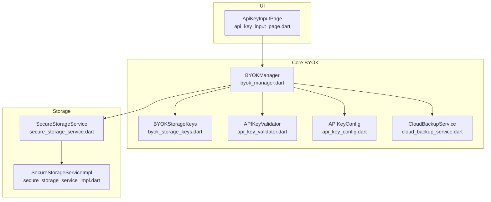
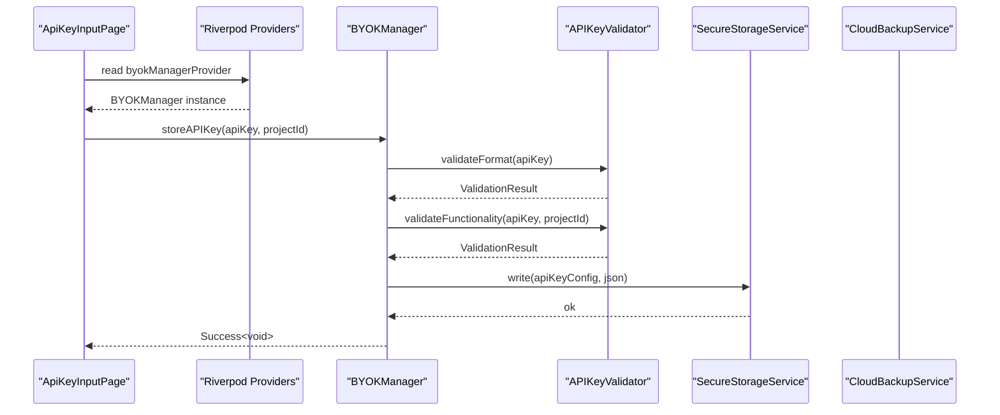
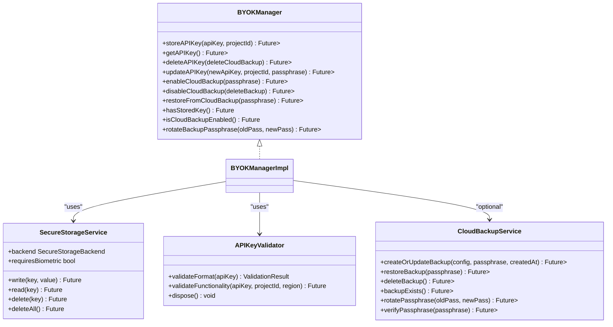
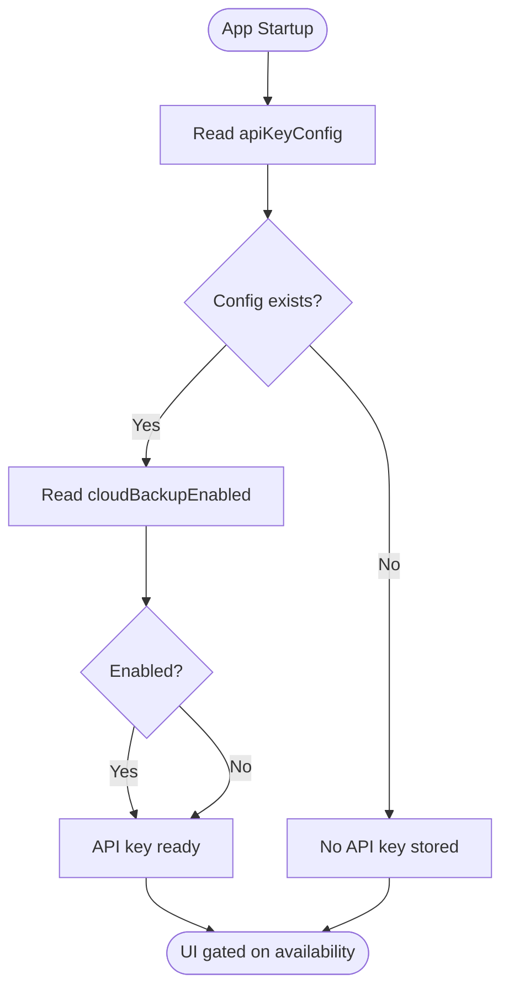
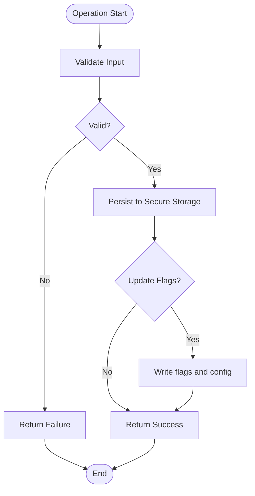
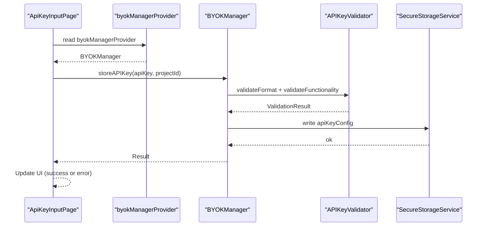
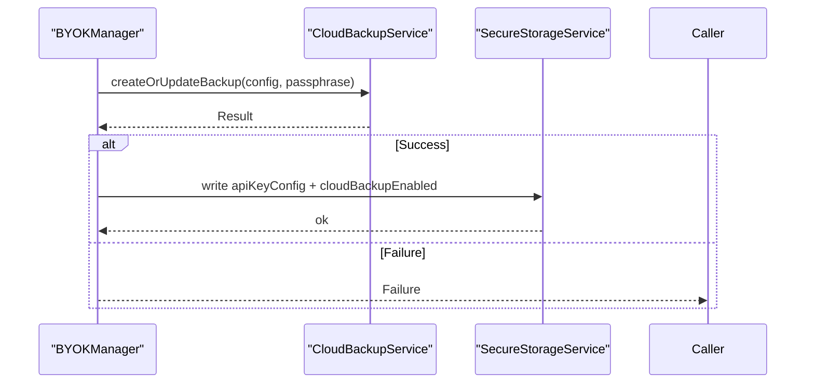
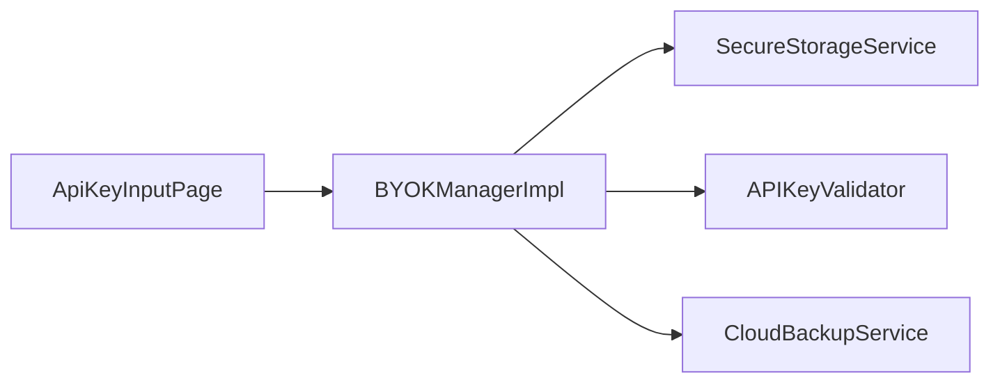

# State Management Integration

<cite>
**Referenced Files in This Document**
- [byok_manager.dart](file://lib/core/byok/byok_manager.dart)
- [byok_storage_keys.dart](file://lib/core/byok/byok_storage_keys.dart)
- [api_key_validator.dart](file://lib/core/byok/api_key_validator.dart)
- [secure_storage_service.dart](file://lib/core/storage/secure_storage_service.dart)
- [secure_storage_service_impl.dart](file://lib/core/storage/secure_storage_service_impl.dart)
- [cloud_backup_service.dart](file://lib/core/byok/cloud_backup_service.dart)
- [api_key_config.dart](file://lib/core/byok/models/api_key_config.dart)
- [api_key_input_page.dart](file://lib/features/onboarding/widgets/api_key_input_page.dart)
- [onboarding_providers.dart](file://lib/core/onboarding/onboarding_providers.dart)
</cite>

## Table of Contents
1. [Introduction](#introduction)
2. [Project Structure](#project-structure)
3. [Core Components](#core-components)
4. [Architecture Overview](#architecture-overview)
5. [Detailed Component Analysis](#detailed-component-analysis)
6. [Dependency Analysis](#dependency-analysis)
7. [Performance Considerations](#performance-considerations)
8. [Troubleshooting Guide](#troubleshooting-guide)
9. [Conclusion](#conclusion)

## Introduction
This document explains how the BYOKManager integrates with the application’s state management system using the Riverpod provider pattern. It covers the dependency injection graph, the role of secure storage, the BYOKStorageKeys constants, and how the manager maintains state consistency across app sessions. It also describes how UI components consume the manager and how the system supports concurrent operations safely.

## Project Structure
The BYOK feature is organized around a small set of cohesive modules:
- Core BYOK domain: manager, validator, storage keys, cloud backup service, and models
- Secure storage abstraction and implementation
- UI components that depend on the manager for API key availability and validation

**Diagram sources**
- [byok_manager.dart](file://lib/core/byok/byok_manager.dart#L555-L582)
- [byok_storage_keys.dart](file://lib/core/byok/byok_storage_keys.dart#L5-L14)
- [api_key_validator.dart](file://lib/core/byok/api_key_validator.dart#L14-L48)
- [secure_storage_service.dart](file://lib/core/storage/secure_storage_service.dart#L11-L29)
- [secure_storage_service_impl.dart](file://lib/core/storage/secure_storage_service_impl.dart#L7-L104)
- [cloud_backup_service.dart](file://lib/core/byok/cloud_backup_service.dart#L21-L91)
- [api_key_config.dart](file://lib/core/byok/models/api_key_config.dart#L5-L32)
- [api_key_input_page.dart](file://lib/features/onboarding/widgets/api_key_input_page.dart#L12-L31)

**Section sources**
- [byok_manager.dart](file://lib/core/byok/byok_manager.dart#L555-L582)
- [byok_storage_keys.dart](file://lib/core/byok/byok_storage_keys.dart#L1-L15)
- [api_key_validator.dart](file://lib/core/byok/api_key_validator.dart#L1-L322)
- [secure_storage_service.dart](file://lib/core/storage/secure_storage_service.dart#L1-L30)
- [secure_storage_service_impl.dart](file://lib/core/storage/secure_storage_service_impl.dart#L1-L105)
- [cloud_backup_service.dart](file://lib/core/byok/cloud_backup_service.dart#L1-L900)
- [api_key_config.dart](file://lib/core/byok/models/api_key_config.dart#L1-L110)
- [api_key_input_page.dart](file://lib/features/onboarding/widgets/api_key_input_page.dart#L1-L555)

## Core Components
- BYOKManager: Orchestrates API key lifecycle, validation, secure storage, and optional cloud backup. Exposes Riverpod providers for dependency injection.
- APIKeyValidator: Validates key format and functionality against the Vertex AI API.
- SecureStorageService and SecureStorageServiceImpl: Abstraction and platform-specific implementation for encrypted local storage.
- CloudBackupService: Manages encrypted cloud backup using Firebase Storage and cryptographic primitives.
- BYOKStorageKeys: Constants for secure storage keys used by the manager.
- APIKeyConfig: Model representing stored API key configuration and metadata.

**Section sources**
- [byok_manager.dart](file://lib/core/byok/byok_manager.dart#L84-L147)
- [api_key_validator.dart](file://lib/core/byok/api_key_validator.dart#L14-L48)
- [secure_storage_service.dart](file://lib/core/storage/secure_storage_service.dart#L11-L29)
- [secure_storage_service_impl.dart](file://lib/core/storage/secure_storage_service_impl.dart#L7-L104)
- [cloud_backup_service.dart](file://lib/core/byok/cloud_backup_service.dart#L21-L91)
- [byok_storage_keys.dart](file://lib/core/byok/byok_storage_keys.dart#L5-L14)
- [api_key_config.dart](file://lib/core/byok/models/api_key_config.dart#L5-L32)

## Architecture Overview
The system uses Riverpod providers to inject dependencies into BYOKManager. The manager persists state using SecureStorageService and conditionally interacts with CloudBackupService. UI components depend on the manager to gate functionality until an API key is available.

**Diagram sources**
- [api_key_input_page.dart](file://lib/features/onboarding/widgets/api_key_input_page.dart#L270-L275)
- [byok_manager.dart](file://lib/core/byok/byok_manager.dart#L572-L582)
- [api_key_validator.dart](file://lib/core/byok/api_key_validator.dart#L112-L150)
- [secure_storage_service.dart](file://lib/core/storage/secure_storage_service.dart#L12-L19)
- [cloud_backup_service.dart](file://lib/core/byok/cloud_backup_service.dart#L35-L39)

## Detailed Component Analysis

### BYOKManager and Riverpod Providers
BYOKManager is exposed via a Riverpod Provider that composes SecureStorageService, APIKeyValidator, and CloudBackupService. This enables:
- Singleton-like access to the manager across the app
- Testability via provider overrides
- Clear separation of concerns

**Diagram sources**
- [byok_manager.dart](file://lib/core/byok/byok_manager.dart#L84-L147)
- [byok_manager.dart](file://lib/core/byok/byok_manager.dart#L153-L549)
- [secure_storage_service.dart](file://lib/core/storage/secure_storage_service.dart#L11-L29)
- [api_key_validator.dart](file://lib/core/byok/api_key_validator.dart#L14-L48)
- [cloud_backup_service.dart](file://lib/core/byok/cloud_backup_service.dart#L21-L91)

Provider definitions:
- secureStorageServiceProvider: Provides a SecureStorageServiceImpl singleton
- apiKeyValidatorProvider: Provides an APIKeyValidatorImpl singleton
- byokManagerProvider: Composes the above into a BYOKManagerImpl instance

Usage example in UI:
- Consumer widgets read byokManagerProvider to store and validate API keys

**Section sources**
- [byok_manager.dart](file://lib/core/byok/byok_manager.dart#L555-L582)
- [api_key_input_page.dart](file://lib/features/onboarding/widgets/api_key_input_page.dart#L270-L275)

### BYOKStorageKeys and Persistent State
BYOKStorageKeys defines the keys used by the manager to persist state:
- apiKeyConfig: JSON-encoded APIKeyConfig
- cloudBackupEnabled: Boolean flag indicating whether cloud backup is enabled
- backupPassphraseHash: Hash of the passphrase used for verification

These keys ensure that:
- The manager can detect presence of a stored key
- The manager can toggle cloud backup state consistently
- UI components can react to key availability

**Diagram sources**
- [byok_storage_keys.dart](file://lib/core/byok/byok_storage_keys.dart#L5-L14)
- [byok_manager.dart](file://lib/core/byok/byok_manager.dart#L234-L256)
- [byok_manager.dart](file://lib/core/byok/byok_manager.dart#L505-L524)

**Section sources**
- [byok_storage_keys.dart](file://lib/core/byok/byok_storage_keys.dart#L1-L15)
- [byok_manager.dart](file://lib/core/byok/byok_manager.dart#L234-L256)
- [byok_manager.dart](file://lib/core/byok/byok_manager.dart#L505-L524)

### State Consistency and Concurrency
The manager enforces consistency by:
- Writing the API key configuration atomically to secure storage
- Updating flags (e.g., cloud backup enabled) alongside the configuration
- Returning structured results (Success/Failure) to prevent partial-state writes
- Handling errors gracefully and logging them for diagnostics

Concurrency considerations:
- All storage operations are asynchronous and serialized per operation
- UI components coordinate loading states to avoid overlapping operations
- Cloud backup operations are independent and guarded by availability checks

**Diagram sources**
- [byok_manager.dart](file://lib/core/byok/byok_manager.dart#L182-L231)
- [byok_manager.dart](file://lib/core/byok/byok_manager.dart#L386-L429)
- [byok_manager.dart](file://lib/core/byok/byok_manager.dart#L505-L524)

**Section sources**
- [byok_manager.dart](file://lib/core/byok/byok_manager.dart#L182-L231)
- [byok_manager.dart](file://lib/core/byok/byok_manager.dart#L386-L429)
- [byok_manager.dart](file://lib/core/byok/byok_manager.dart#L505-L524)

### Integration with UI Components
ApiKeyInputPage demonstrates provider usage:
- Reads byokManagerProvider
- Calls storeAPIKey with user input
- Displays validation errors mapped to user-friendly messages
- Proceeds to next onboarding step upon success

**Diagram sources**
- [api_key_input_page.dart](file://lib/features/onboarding/widgets/api_key_input_page.dart#L270-L307)
- [byok_manager.dart](file://lib/core/byok/byok_manager.dart#L572-L582)
- [api_key_validator.dart](file://lib/core/byok/api_key_validator.dart#L112-L224)
- [secure_storage_service.dart](file://lib/core/storage/secure_storage_service.dart#L12-L19)

**Section sources**
- [api_key_input_page.dart](file://lib/features/onboarding/widgets/api_key_input_page.dart#L252-L307)
- [byok_manager.dart](file://lib/core/byok/byok_manager.dart#L572-L582)

### Cloud Backup Integration
CloudBackupService is wired via its own provider and consumed by BYOKManager when cloud backup is enabled. The manager updates the local configuration and flags accordingly.

**Diagram sources**
- [byok_manager.dart](file://lib/core/byok/byok_manager.dart#L386-L429)
- [cloud_backup_service.dart](file://lib/core/byok/cloud_backup_service.dart#L167-L249)
- [secure_storage_service.dart](file://lib/core/storage/secure_storage_service.dart#L12-L19)

**Section sources**
- [byok_manager.dart](file://lib/core/byok/byok_manager.dart#L386-L429)
- [cloud_backup_service.dart](file://lib/core/byok/cloud_backup_service.dart#L167-L249)

## Dependency Analysis
The dependency graph centers on BYOKManager, which depends on:
- SecureStorageService for persistence
- APIKeyValidator for validation
- CloudBackupService for optional cloud backup

**Diagram sources**
- [byok_manager.dart](file://lib/core/byok/byok_manager.dart#L572-L582)
- [api_key_input_page.dart](file://lib/features/onboarding/widgets/api_key_input_page.dart#L270-L275)

**Section sources**
- [byok_manager.dart](file://lib/core/byok/byok_manager.dart#L572-L582)
- [api_key_input_page.dart](file://lib/features/onboarding/widgets/api_key_input_page.dart#L270-L275)

## Performance Considerations
- Validation involves network calls; cache results where appropriate and avoid redundant validations
- Cloud backup operations are I/O bound; batch updates and handle network errors gracefully
- Secure storage operations are synchronous wrappers; keep UI responsive by performing work off the UI thread
- Prefer incremental updates to configuration and flags to minimize write amplification

## Troubleshooting Guide
Common issues and resolutions:
- Validation failures: Inspect ValidationFailureType and present user-friendly messages
- Storage errors: Catch and log StorageError; inform users to retry or check device storage
- Cloud backup errors: Handle BackupError appropriately; offer recovery steps (e.g., passphrase verification)
- UI not reflecting state: Ensure UI reads from providers and reacts to state changes

**Section sources**
- [api_key_validator.dart](file://lib/core/byok/api_key_validator.dart#L226-L272)
- [byok_manager.dart](file://lib/core/byok/byok_manager.dart#L220-L230)
- [cloud_backup_service.dart](file://lib/core/byok/cloud_backup_service.dart#L222-L248)

## Conclusion
The BYOKManager integrates tightly with Riverpod to provide a clean, testable, and resilient API key lifecycle. BYOKStorageKeys define a minimal yet effective set of persistent keys, and the manager ensures state consistency across operations. UI components depend on the manager to gate functionality until an API key is available, enabling a smooth onboarding experience.