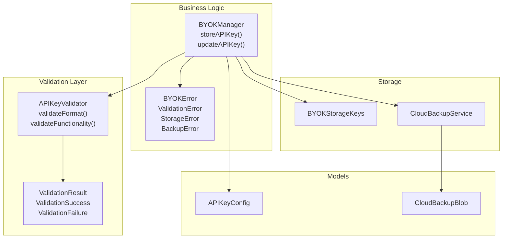
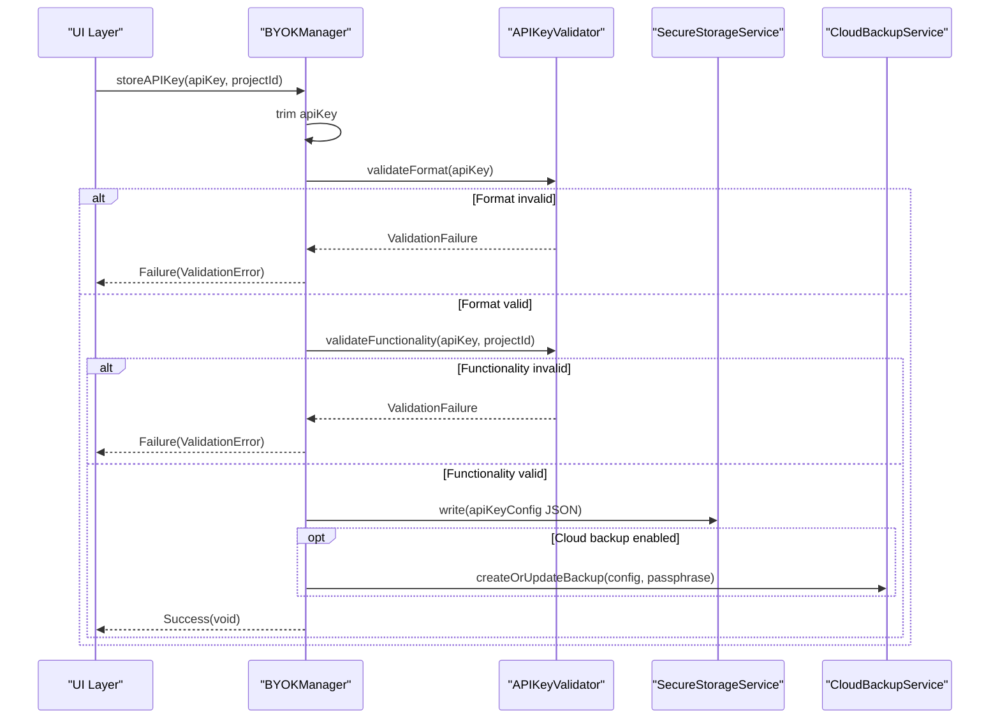
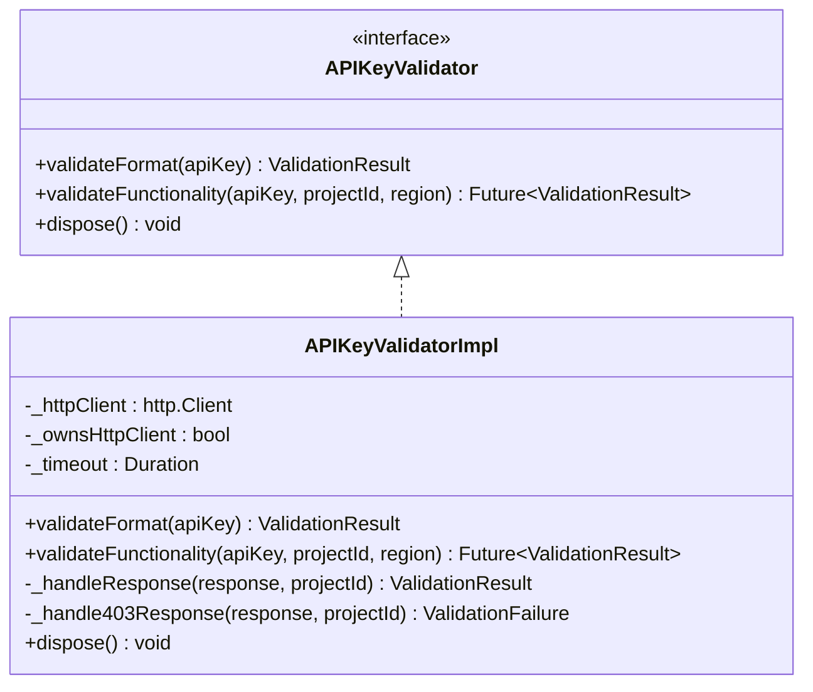
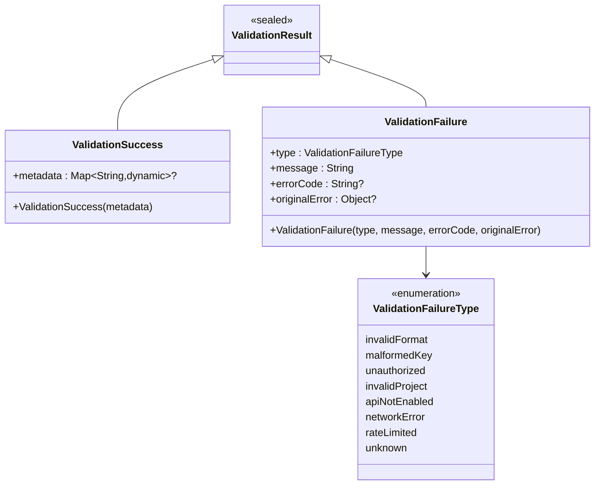
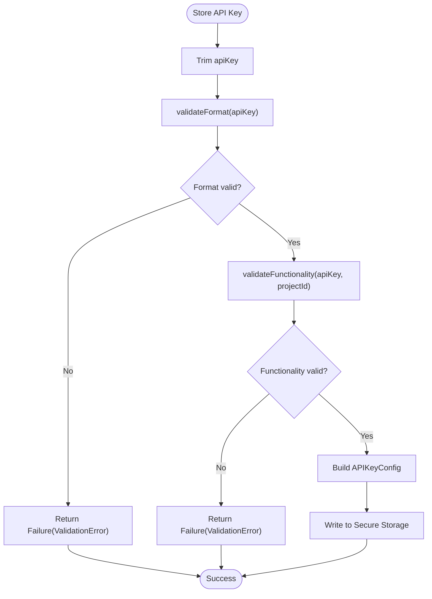
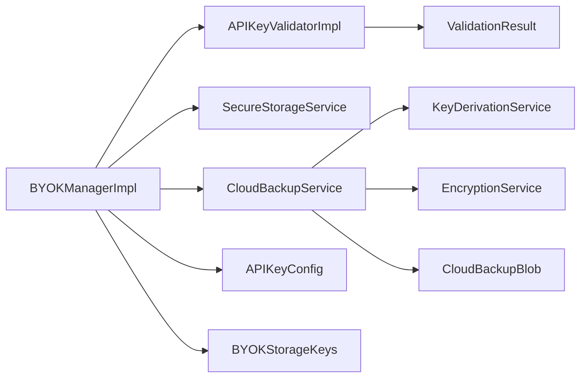

# Validation Workflow

<cite>
**Referenced Files in This Document**
- [api_key_validator.dart](file://lib/core/byok/api_key_validator.dart)
- [validation_result.dart](file://lib/core/byok/models/validation_result.dart)
- [byok_manager.dart](file://lib/core/byok/byok_manager.dart)
- [byok_error.dart](file://lib/core/byok/models/byok_error.dart)
- [cloud_backup_service.dart](file://lib/core/byok/cloud_backup_service.dart)
- [api_key_config.dart](file://lib/core/byok/models/api_key_config.dart)
- [byok_storage_keys.dart](file://lib/core/byok/byok_storage_keys.dart)
- [byok_manager_test.dart](file://test/byok_manager_test.dart)
- [api_key_input_page_test.dart](file://test/features/onboarding/widgets/api_key_input_page_test.dart)
</cite>

## Table of Contents
1. [Introduction](#introduction)
2. [Project Structure](#project-structure)
3. [Core Components](#core-components)
4. [Architecture Overview](#architecture-overview)
5. [Detailed Component Analysis](#detailed-component-analysis)
6. [Dependency Analysis](#dependency-analysis)
7. [Performance Considerations](#performance-considerations)
8. [Troubleshooting Guide](#troubleshooting-guide)
9. [Conclusion](#conclusion)

## Introduction
This document explains the API key validation workflow in the BYOK (Bring Your Own Key) subsystem. It focuses on the dual-layer validation approach implemented by APIKeyValidator, covering both format validation and functional testing. It documents the ValidationResult sealed class pattern, error handling strategies, and how validation integrates with the storage workflow managed by BYOKManager. The guide includes practical examples of validation scenarios, common failure cases, and resolution approaches.

## Project Structure
The validation workflow spans several modules:
- Validation layer: APIKeyValidator and ValidationResult
- Business logic: BYOKManager orchestrating storage and cloud backup
- Models: APIKeyConfig, BYOKError, CloudBackupBlob
- Storage keys: BYOKStorageKeys
- Cloud backup: CloudBackupService for encrypted cloud storage
- Tests: Comprehensive coverage of validation scenarios and error handling

**Diagram sources**
- [api_key_validator.dart](file://lib/core/byok/api_key_validator.dart#L14-L48)
- [validation_result.dart](file://lib/core/byok/models/validation_result.dart#L5-L187)
- [byok_manager.dart](file://lib/core/byok/byok_manager.dart#L84-L147)
- [byok_error.dart](file://lib/core/byok/models/byok_error.dart#L7-L93)
- [api_key_config.dart](file://lib/core/byok/models/api_key_config.dart#L5-L109)
- [cloud_backup_service.dart](file://lib/core/byok/cloud_backup_service.dart#L21-L91)
- [byok_storage_keys.dart](file://lib/core/byok/byok_storage_keys.dart#L5-L14)

**Section sources**
- [api_key_validator.dart](file://lib/core/byok/api_key_validator.dart#L1-L322)
- [validation_result.dart](file://lib/core/byok/models/validation_result.dart#L1-L188)
- [byok_manager.dart](file://lib/core/byok/byok_manager.dart#L1-L583)
- [byok_error.dart](file://lib/core/byok/models/byok_error.dart#L1-L94)
- [cloud_backup_service.dart](file://lib/core/byok/cloud_backup_service.dart#L1-L900)
- [api_key_config.dart](file://lib/core/byok/models/api_key_config.dart#L1-L110)
- [byok_storage_keys.dart](file://lib/core/byok/byok_storage_keys.dart#L1-L15)

## Core Components
- APIKeyValidator: Provides two validation layers:
  - validateFormat: Syntax and structure checks without network calls
  - validateFunctionality: Connectivity and authorization checks via Vertex AI API
- ValidationResult: Sealed class hierarchy representing success or failure outcomes
- BYOKManager: Orchestrates validation, storage, and cloud backup operations
- BYOKError: Sealed class hierarchy for error representation
- CloudBackupService: Manages encrypted cloud backup operations

Key responsibilities:
- APIKeyValidatorImpl.validateFormat: Trims input, checks prefix, length, and character validity
- APIKeyValidatorImpl.validateFunctionality: Validates region/project ID, constructs endpoint, performs HTTP request, and interprets responses
- BYOKManager.storeAPIKey: Executes dual validation before persisting configuration
- BYOKManager.updateAPIKey: Re-validates and optionally re-encrypts cloud backup
- ValidationResult sealed class: Ensures exhaustive handling of validation outcomes

**Section sources**
- [api_key_validator.dart](file://lib/core/byok/api_key_validator.dart#L14-L48)
- [validation_result.dart](file://lib/core/byok/models/validation_result.dart#L5-L187)
- [byok_manager.dart](file://lib/core/byok/byok_manager.dart#L182-L231)
- [byok_error.dart](file://lib/core/byok/models/byok_error.dart#L7-L93)

## Architecture Overview
The validation workflow follows a strict order: format validation first, then functional validation. On success, the configuration is persisted locally. Cloud backup is optional and managed separately.

**Diagram sources**
- [byok_manager.dart](file://lib/core/byok/byok_manager.dart#L182-L231)
- [api_key_validator.dart](file://lib/core/byok/api_key_validator.dart#L112-L150)
- [api_key_validator.dart](file://lib/core/byok/api_key_validator.dart#L153-L224)

## Detailed Component Analysis

### APIKeyValidator and APIKeyValidatorImpl
APIKeyValidator defines the contract for dual validation:
- validateFormat: Enforces prefix, length, and character set rules
- validateFunctionality: Validates region/project ID, constructs Vertex AI endpoint, performs HTTP request, and maps responses to ValidationResult

Implementation highlights:
- validateFormat: Trims input once, checks prefix ("AIza"), exact length (39), and valid characters (alphanumeric, underscore, hyphen)
- validateFunctionality: Validates region and project ID formats, constructs URL, sets x-goog-api-key header, applies timeout, and handles diverse HTTP responses and exceptions
- Response handling: 200 OK returns ValidationSuccess (with optional metadata), 401 unauthorized, 403 distinguishes API not enabled vs access denied, 404 project not found, 429 rate limited, and maps other statuses to ValidationFailure
- Exception mapping: TimeoutException, SocketException, and http.ClientException are mapped to ValidationFailure with networkError type; other exceptions map to unknown

**Diagram sources**
- [api_key_validator.dart](file://lib/core/byok/api_key_validator.dart#L14-L48)
- [api_key_validator.dart](file://lib/core/byok/api_key_validator.dart#L53-L322)

**Section sources**
- [api_key_validator.dart](file://lib/core/byok/api_key_validator.dart#L14-L48)
- [api_key_validator.dart](file://lib/core/byok/api_key_validator.dart#L112-L150)
- [api_key_validator.dart](file://lib/core/byok/api_key_validator.dart#L153-L224)
- [api_key_validator.dart](file://lib/core/byok/api_key_validator.dart#L226-L308)
- [api_key_validator.dart](file://lib/core/byok/api_key_validator.dart#L310-L322)

### ValidationResult Sealed Class Pattern
ValidationResult enforces exhaustive handling of validation outcomes:
- ValidationSuccess: Optional metadata (e.g., models list) from functional validation
- ValidationFailure: Detailed failure with type, message, optional error code, and original error

ValidationFailureType enumerates failure categories:
- invalidFormat, malformedKey, unauthorized, invalidProject, apiNotEnabled, networkError, rateLimited, unknown

**Diagram sources**
- [validation_result.dart](file://lib/core/byok/models/validation_result.dart#L5-L187)

**Section sources**
- [validation_result.dart](file://lib/core/byok/models/validation_result.dart#L5-L187)

### BYOKManager Validation Integration
BYOKManager executes the dual validation before storage:
- storeAPIKey: Calls validateFormat, then validateFunctionality, creates APIKeyConfig, writes to secure storage, and optionally updates cloud backup
- updateAPIKey: Re-validates new key, preserves metadata, updates secure storage, and optionally re-encrypts cloud backup
- Error propagation: Converts ValidationFailure into ValidationError with detailed context

**Diagram sources**
- [byok_manager.dart](file://lib/core/byok/byok_manager.dart#L182-L231)

**Section sources**
- [byok_manager.dart](file://lib/core/byok/byok_manager.dart#L182-L231)
- [byok_manager.dart](file://lib/core/byok/byok_manager.dart#L298-L384)

### Error Handling and BYOKError
BYOKError provides a sealed hierarchy for error representation:
- ValidationError: Wraps ValidationResult with validation failure details
- NotFoundError: Indicates no stored key
- StorageError: Wraps storage operation failures
- BackupError: Covers cloud backup errors with typed reasons
- CryptoError: For encryption/decryption failures

BYOKManager converts ValidationFailure into ValidationError, enabling UI and callers to handle validation errors consistently.

**Section sources**
- [byok_error.dart](file://lib/core/byok/models/byok_error.dart#L7-L93)
- [byok_manager.dart](file://lib/core/byok/byok_manager.dart#L188-L194)
- [byok_manager.dart](file://lib/core/byok/byok_manager.dart#L201-L206)

### Cloud Backup Integration
Cloud backup is optional and managed by CloudBackupService:
- createOrUpdateBackup: Encrypts APIKeyConfig and uploads to Firebase Storage
- restoreBackup: Downloads and decrypts backup using passphrase
- deleteBackup: Removes backup from storage
- rotatePassphrase: Re-encrypts backup with new passphrase using a temporary path strategy

BYOKManager coordinates backup operations around key storage and updates, preserving cloud backup enabled state and handling failures gracefully.

**Section sources**
- [cloud_backup_service.dart](file://lib/core/byok/cloud_backup_service.dart#L21-L91)
- [cloud_backup_service.dart](file://lib/core/byok/cloud_backup_service.dart#L166-L249)
- [cloud_backup_service.dart](file://lib/core/byok/cloud_backup_service.dart#L251-L317)
- [cloud_backup_service.dart](file://lib/core/byok/cloud_backup_service.dart#L319-L363)
- [cloud_backup_service.dart](file://lib/core/byok/cloud_backup_service.dart#L413-L555)

## Dependency Analysis
The validation workflow exhibits clear separation of concerns:
- APIKeyValidatorImpl depends on http.Client and regex patterns for validation
- BYOKManager depends on APIKeyValidator, SecureStorageService, and CloudBackupService
- CloudBackupService depends on Firebase Storage, KeyDerivationService, and EncryptionService
- Models are immutable and self-contained

**Diagram sources**
- [api_key_validator.dart](file://lib/core/byok/api_key_validator.dart#L53-L80)
- [byok_manager.dart](file://lib/core/byok/byok_manager.dart#L153-L180)
- [cloud_backup_service.dart](file://lib/core/byok/cloud_backup_service.dart#L97-L119)

**Section sources**
- [byok_manager.dart](file://lib/core/byok/byok_manager.dart#L153-L180)
- [cloud_backup_service.dart](file://lib/core/byok/cloud_backup_service.dart#L97-L119)

## Performance Considerations
- validateFormat is O(n) with minimal overhead; regex checks are efficient
- validateFunctionality introduces network latency; timeouts are configured and surfaced as ValidationFailure
- Metadata parsing on success is best-effort; failures do not invalidate the key
- Cloud backup operations are asynchronous and depend on network conditions

## Troubleshooting Guide

Common validation failure scenarios and resolutions:
- Invalid format
  - Symptoms: ValidationFailure with invalidFormat or malformedKey
  - Causes: Wrong prefix, incorrect length, or invalid characters
  - Resolution: Ensure the key starts with the expected prefix, has the correct length, and contains only valid characters
  - Reference: [validateFormat](file://lib/core/byok/api_key_validator.dart#L112-L150)

- Unauthorized key
  - Symptoms: HTTP 401 response mapped to ValidationFailure with unauthorized
  - Causes: Revoked or invalid API key
  - Resolution: Regenerate a valid API key and ensure it is enabled for Vertex AI
  - Reference: [validateFunctionality 401 handling](file://lib/core/byok/api_key_validator.dart#L239-L244)

- API not enabled
  - Symptoms: HTTP 403 with message indicating API not enabled
  - Causes: Vertex AI API not enabled for the project
  - Resolution: Enable Vertex AI API in the Google Cloud Console for the project
  - Reference: [validateFunctionality 403 handling](file://lib/core/byok/api_key_validator.dart#L274-L308)

- Project not found
  - Symptoms: HTTP 404 response mapped to invalidProject
  - Causes: Incorrect project ID
  - Resolution: Verify the project ID and ensure it exists in the Google Cloud Console
  - Reference: [validateFunctionality 404 handling](file://lib/core/byok/api_key_validator.dart#L250-L256)

- Rate limited
  - Symptoms: HTTP 429 response mapped to rateLimited
  - Causes: Excessive requests within a short period
  - Resolution: Retry after the rate limit resets
  - Reference: [validateFunctionality 429 handling](file://lib/core/byok/api_key_validator.dart#L258-L263)

- Network errors
  - Symptoms: TimeoutException, SocketException, or http.ClientException mapped to networkError
  - Causes: Connectivity issues or server unavailability
  - Resolution: Check network connectivity and retry
  - Reference: [validateFunctionality exception mapping](file://lib/core/byok/api_key_validator.dart#L199-L223)

Integration with storage workflow:
- BYOKManager.storeAPIKey validates before storage; failures are wrapped as ValidationError
- BYOKManager.updateAPIKey preserves metadata and optionally re-encrypts cloud backup
- Cloud backup failures do not prevent local storage operations; errors are logged and handled gracefully
- Reference: [storeAPIKey](file://lib/core/byok/byok_manager.dart#L182-L231), [updateAPIKey](file://lib/core/byok/byok_manager.dart#L298-L384)

Examples from tests:
- Validation failures prevent storage and return ValidationError
- Network errors during validation prevent storage
- Cloud backup errors do not affect local storage success
- Reference: [byok_manager_test.dart](file://test/byok_manager_test.dart#L1186-L1229), [byok_manager_test.dart](file://test/byok_manager_test.dart#L1137-L1184)

**Section sources**
- [api_key_validator.dart](file://lib/core/byok/api_key_validator.dart#L112-L150)
- [api_key_validator.dart](file://lib/core/byok/api_key_validator.dart#L153-L224)
- [api_key_validator.dart](file://lib/core/byok/api_key_validator.dart#L226-L308)
- [byok_manager.dart](file://lib/core/byok/byok_manager.dart#L182-L231)
- [byok_manager.dart](file://lib/core/byok/byok_manager.dart#L298-L384)
- [byok_manager_test.dart](file://test/byok_manager_test.dart#L1186-L1229)
- [byok_manager_test.dart](file://test/byok_manager_test.dart#L1137-L1184)

## Conclusion
The validation workflow employs a robust dual-layer approach: immediate format validation for instant feedback, followed by functional validation for connectivity and authorization. The sealed ValidationResult pattern ensures comprehensive error handling, while BYOKManager coordinates storage and cloud backup operations. The design emphasizes resilience—network failures do not compromise local storage, and cloud backup failures are isolated from core operations. This architecture provides a reliable, user-friendly validation experience with clear error semantics and graceful degradation.