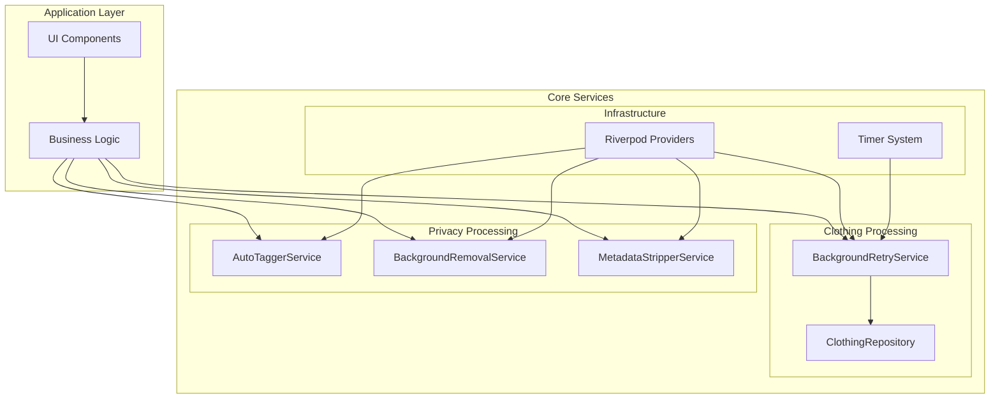
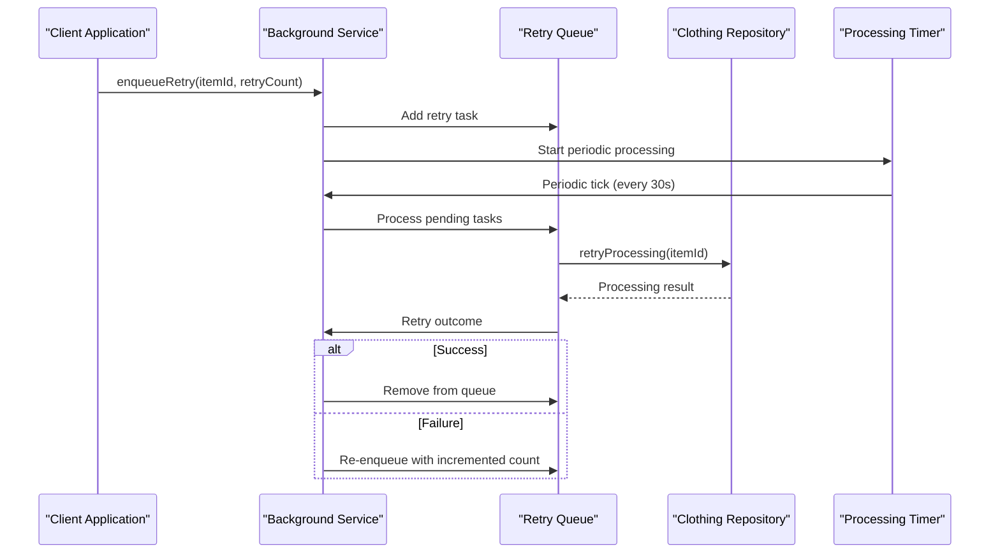
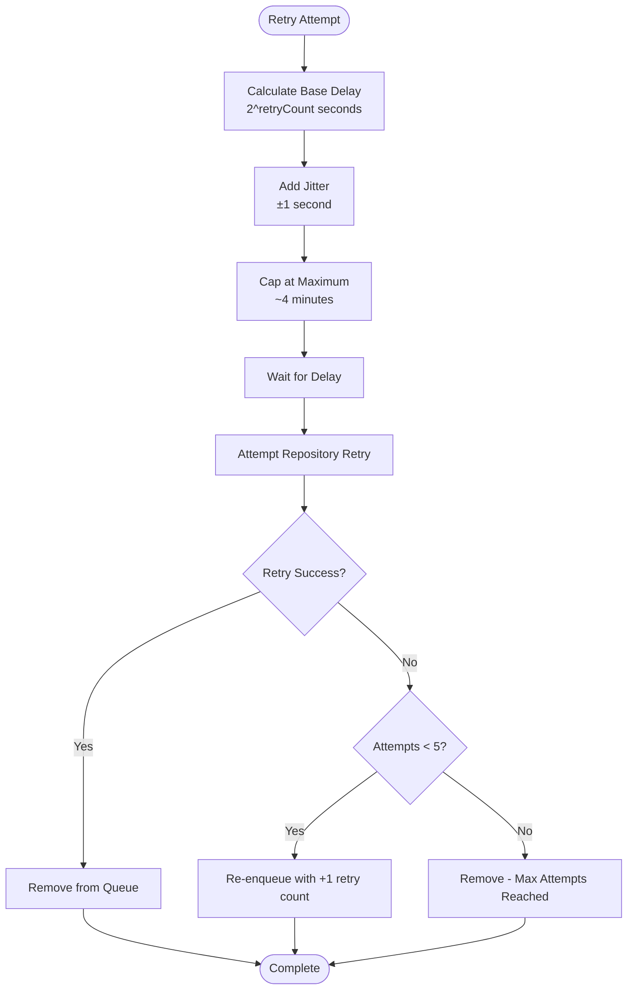
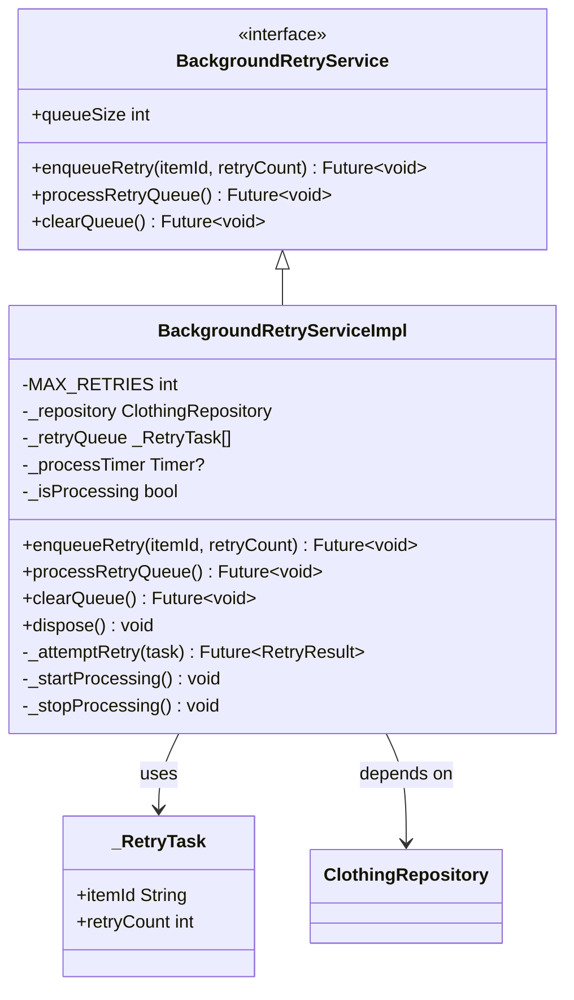
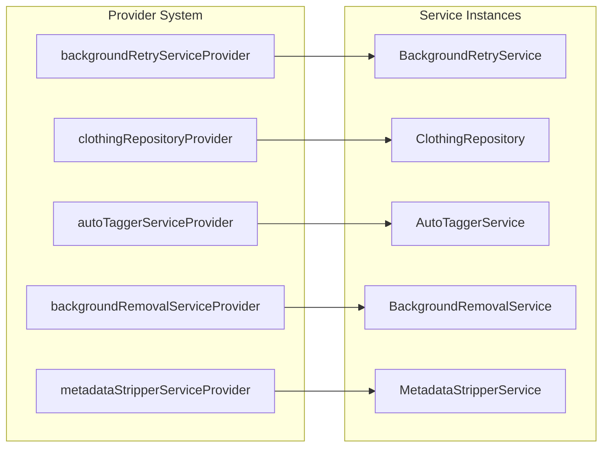

# Background Processing Services

<cite>
**Referenced Files in This Document**
- [background_retry_service.dart](file://lib/core/clothing/background_retry_service.dart)
- [auto_tagger_service.dart](file://lib/core/privacy/auto_tagger_service.dart)
- [background_removal_service.dart](file://lib/core/privacy/background_removal_service.dart)
- [metadata_stripper_service.dart](file://lib/core/privacy/metadata_stripper_service.dart)
- [clothing_repository.dart](file://lib/core/clothing/clothing_repository.dart)
- [main.dart](file://lib/main.dart)
</cite>

## Table of Contents
1. [Introduction](#introduction)
2. [Project Structure](#project-structure)
3. [Core Components](#core-components)
4. [Architecture Overview](#architecture-overview)
5. [Detailed Component Analysis](#detailed-component-analysis)
6. [Background Processing Patterns](#background-processing-patterns)
7. [Performance Considerations](#performance-considerations)
8. [Integration Points](#integration-points)
9. [Conclusion](#conclusion)

## Introduction

The StyleSync application implements comprehensive background processing services designed to handle asynchronous operations, retries, and data processing tasks. These services form the backbone of the application's ability to process clothing images, manage background removal, extract metadata, and maintain robust retry mechanisms for failed operations.

The background processing architecture leverages several key patterns: queue-based processing with exponential backoff, provider-based dependency injection, and modular service abstractions. These components work together to provide reliable, fault-tolerant processing capabilities while maintaining user experience through non-blocking operations.

## Project Structure

The background processing services are organized within the core architecture of the StyleSync application, specifically in the `lib/core` directory structure:

**Diagram sources**
- [background_retry_service.dart](file://lib/core/clothing/background_retry_service.dart#L41-L234)
- [auto_tagger_service.dart](file://lib/core/privacy/auto_tagger_service.dart#L1-L222)
- [background_removal_service.dart](file://lib/core/privacy/background_removal_service.dart#L1-L94)

**Section sources**
- [background_retry_service.dart](file://lib/core/clothing/background_retry_service.dart#L1-L235)
- [auto_tagger_service.dart](file://lib/core/privacy/auto_tagger_service.dart#L1-L222)
- [background_removal_service.dart](file://lib/core/privacy/background_removal_service.dart#L1-L94)
- [metadata_stripper_service.dart](file://lib/core/privacy/metadata_stripper_service.dart#L1-L40)

## Core Components

The background processing system consists of four primary service categories, each serving distinct processing functions:

### Background Retry Service
The [`BackgroundRetryService`](file://lib/core/clothing/background_retry_service.dart#L45-L63) provides automatic retry mechanisms for failed processing operations with exponential backoff and jitter-based delays.

### Privacy Processing Services
The privacy processing suite includes three specialized services:
- [`AutoTaggerService`](file://lib/core/privacy/auto_tagger_service.dart#L13-L19): Extracts clothing attributes from images
- [`BackgroundRemovalService`](file://lib/core/privacy/background_removal_service.dart#L17-L36): Removes backgrounds using TensorFlow Lite
- [`MetadataStripperService`](file://lib/core/privacy/metadata stripper_service.dart#L8-L14): Removes EXIF and metadata from images

### Repository Layer
The [`ClothingRepository`](file://lib/core/clothing/clothing_repository.dart#L42-L100) serves as the central coordination point for all background processing operations, managing data persistence and coordinating with external services.

**Section sources**
- [background_retry_service.dart](file://lib/core/clothing/background_retry_service.dart#L41-L234)
- [auto_tagger_service.dart](file://lib/core/privacy/auto_tagger_service.dart#L1-L222)
- [background_removal_service.dart](file://lib/core/privacy/background_removal_service.dart#L1-L94)
- [metadata_stripper_service.dart](file://lib/core/privacy/metadata_stripper_service.dart#L1-L40)
- [clothing_repository.dart](file://lib/core/clothing/clothing_repository.dart#L41-L489)

## Architecture Overview

The background processing architecture follows a layered approach with clear separation of concerns:

**Diagram sources**
- [background_retry_service.dart](file://lib/core/clothing/background_retry_service.dart#L94-L133)
- [clothing_repository.dart](file://lib/core/clothing/clothing_repository.dart#L426-L463)

The architecture implements several key design patterns:

1. **Queue-Based Processing**: Tasks are queued and processed asynchronously
2. **Exponential Backoff**: Retry delays increase exponentially with each failure
3. **Jitter Implementation**: Random delays prevent thundering herd effects
4. **Provider Pattern**: Dependency injection through Riverpod providers
5. **Result Type Pattern**: Strong typing for success/failure scenarios

**Section sources**
- [background_retry_service.dart](file://lib/core/clothing/background_retry_service.dart#L65-L206)
- [clothing_repository.dart](file://lib/core/clothing/clothing_repository.dart#L102-L464)

## Detailed Component Analysis

### Background Retry Service Implementation

The [`BackgroundRetryServiceImpl`](file://lib/core/clothing/background_retry_service.dart#L69-L206) provides sophisticated retry mechanisms with the following characteristics:

#### Retry Queue Management
- **Maximum Retries**: Limited to 5 attempts per item
- **Queue Persistence**: In-memory queue (production should use persistent storage)
- **Concurrency Control**: Prevents overlapping processing runs

#### Exponential Backoff Algorithm
The retry delay calculation implements:
- **Base Delay**: 2^n seconds where n is retry count (1s, 2s, 4s, 8s, 16s, 32s, 64s, 128s, 256s)
- **Jitter**: ±1 second randomization to prevent synchronized retries
- **Delay Capping**: Maximum ~4 minutes to prevent excessive delays

**Diagram sources**
- [background_retry_service.dart](file://lib/core/clothing/background_retry_service.dart#L150-L175)

#### Processing Timer System
The service uses a periodic timer that:
- **Interval**: Every 30 seconds
- **Concurrency Guard**: Prevents overlapping executions
- **Graceful Shutdown**: Proper cleanup on disposal

**Section sources**
- [background_retry_service.dart](file://lib/core/clothing/background_retry_service.dart#L69-L206)

### Privacy Processing Services

#### Auto Tagger Service
The [`AutoTaggerServiceImpl`](file://lib/core/privacy/auto_tagger_service.dart#L53-L222) provides intelligent clothing analysis:

**Image Analysis Capabilities**:
- **Category Classification**: Tops, bottoms, shoes, accessories
- **Color Extraction**: Dominant colors using bucket-based clustering
- **Season Suggestions**: Based on extracted color analysis
- **Performance Optimization**: Pixel sampling reduces processing overhead

**Processing Pipeline**:
1. Image validation and decoding
2. Aspect ratio analysis for category determination
3. Color extraction with sampling optimization
4. Season suggestion generation
5. Attribute aggregation

#### Background Removal Service
The [`BackgroundRemovalServiceImpl`](file://lib/core/privacy/background_removal_service.dart#L38-L93) implements privacy-focused image processing:

**Key Features**:
- **On-Device Processing**: TensorFlow Lite model for privacy
- **Timeout Handling**: Graceful degradation on timeouts
- **Error Recovery**: Returns original image on processing failures
- **Memory Management**: Temporary file handling with cleanup

**Implementation Approach**:
- Image validation and preprocessing
- Model-based segmentation (placeholder for actual implementation)
- Result encoding and temporary file creation
- Timeout protection with graceful fallback

#### Metadata Stripper Service
The [`MetadataStripperServiceImpl`](file://lib/core/privacy/metadata_stripper_service.dart#L16-L40) ensures privacy compliance:

**Privacy Protection Measures**:
- **EXIF Removal**: Strips GPS coordinates and device metadata
- **Ancillary Data Cleanup**: Removes timestamps and device identifiers
- **Data Minimization**: Preserves only pixel data
- **Non-Destructive**: Original files remain unchanged

**Processing Workflow**:
1. Image decoding
2. Metadata extraction and removal
3. Clean image encoding
4. Temporary file creation with sanitized data

**Section sources**
- [auto_tagger_service.dart](file://lib/core/privacy/auto_tagger_service.dart#L53-L222)
- [background_removal_service.dart](file://lib/core/privacy/background_removal_service.dart#L38-L93)
- [metadata_stripper_service.dart](file://lib/core/privacy/metadata_stripper_service.dart#L16-L40)

### Repository Coordination Layer

The [`ClothingRepositoryImpl`](file://lib/core/clothing/clothing_repository.dart#L106-L464) serves as the central coordinator for all background processing operations:

#### Network Error Detection
Intelligent error classification for robust retry decisions:
- **Socket Exceptions**: Network connectivity issues
- **HTTP Exceptions**: Request/response problems
- **Firebase Exceptions**: Service-specific errors with code categorization

#### Storage Path Management
Centralized path generation for:
- **Clothing Items**: `users/{userId}/clothing/{itemId}`
- **Try-On Images**: `users/{userId}/try-ons/{tryOnId}.jpg`
- **Outfit Thumbnails**: `users/{userId}/outfits/{outfitId}_thumbnail.jpg`

**Section sources**
- [clothing_repository.dart](file://lib/core/clothing/clothing_repository.dart#L106-L464)

## Background Processing Patterns

### Retry Mechanism Design
The background processing system implements a comprehensive retry pattern:

**Diagram sources**
- [background_retry_service.dart](file://lib/core/clothing/background_retry_service.dart#L45-L220)

### Privacy-Focused Processing
All background services adhere to strict privacy principles:

1. **On-Device Processing**: Heavy computation occurs locally
2. **Minimal Data Transfer**: Only processed results are transmitted
3. **Metadata Removal**: Automatic stripping of sensitive information
4. **Temporary Storage**: Processing artifacts are cleaned up

### Provider-Based Architecture
The system uses Riverpod for dependency injection:

**Diagram sources**
- [background_retry_service.dart](file://lib/core/clothing/background_retry_service.dart#L229-L234)

**Section sources**
- [background_retry_service.dart](file://lib/core/clothing/background_retry_service.dart#L222-L234)
- [auto_tagger_service.dart](file://lib/core/privacy/auto_tagger_service.dart#L1-L222)
- [background_removal_service.dart](file://lib/core/privacy/background_removal_service.dart#L1-L94)
- [metadata_stripper_service.dart](file://lib/core/privacy/metadata_stripper_service.dart#L1-L40)

## Performance Considerations

### Memory Management
- **Temporary Files**: Background processing creates temporary files that require cleanup
- **Image Processing**: Large images are processed in chunks to minimize memory usage
- **Queue Limits**: In-memory queues should be monitored to prevent memory exhaustion

### Network Optimization
- **Retry Delays**: Exponential backoff prevents network saturation
- **Timeout Handling**: Configurable timeouts prevent hanging operations
- **Error Classification**: Network vs. application errors are handled differently

### Processing Efficiency
- **Sampling Algorithms**: Privacy services use pixel sampling to reduce processing time
- **Model Optimization**: TensorFlow Lite models are optimized for mobile devices
- **Concurrent Processing**: Multiple services can operate independently

## Integration Points

### Application Integration
The background processing services integrate seamlessly with the main application through:

1. **Riverpod Providers**: Centralized dependency injection
2. **State Management**: Integration with Flutter's reactive state system
3. **Error Handling**: Consistent error propagation and user feedback

### External Service Dependencies
- **Firebase Services**: Firestore and Storage for data persistence
- **TensorFlow Lite**: On-device machine learning inference
- **Image Processing Libraries**: Optimized image manipulation capabilities

**Section sources**
- [main.dart](file://lib/main.dart#L1-L123)

## Conclusion

The StyleSync background processing services represent a sophisticated approach to asynchronous task management, combining reliability, privacy, and performance. The system successfully implements:

- **Robust Retry Mechanisms**: With exponential backoff and jitter for fault tolerance
- **Privacy-First Design**: All processing occurs locally with metadata removal
- **Modular Architecture**: Clear separation of concerns with dependency injection
- **Performance Optimization**: Efficient algorithms and resource management

The architecture provides a solid foundation for scalable background processing while maintaining user privacy and system reliability. Future enhancements could include persistent queue storage, advanced machine learning models, and expanded cloud integration options.