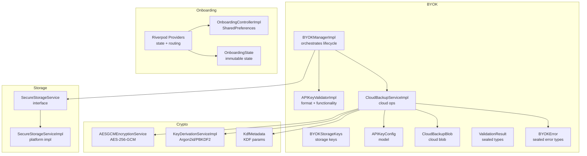
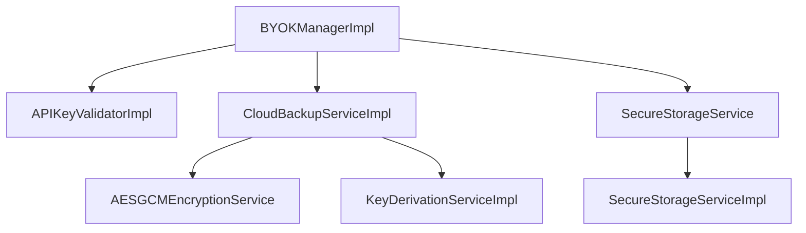
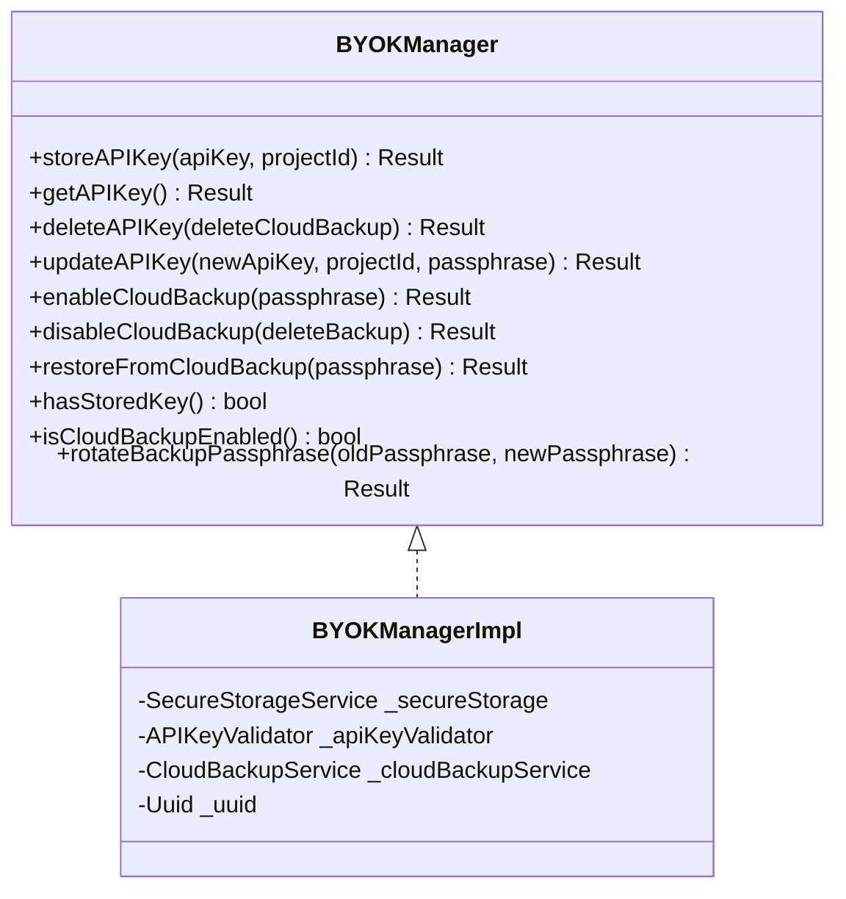
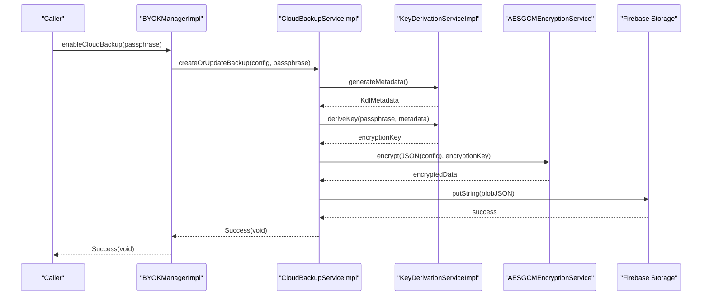
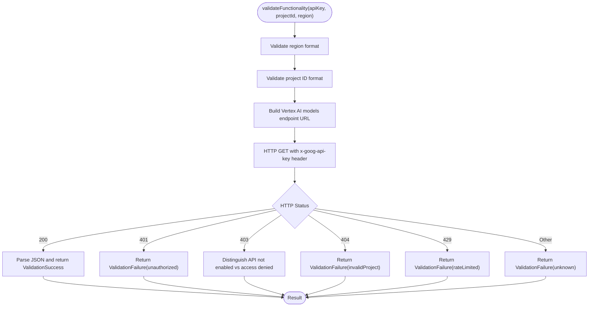
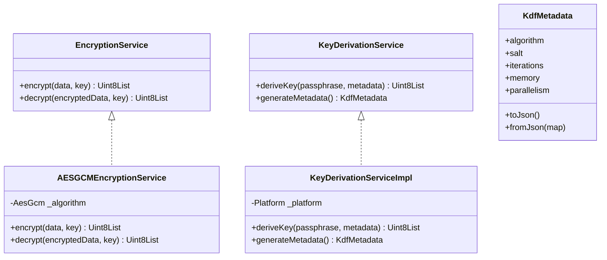
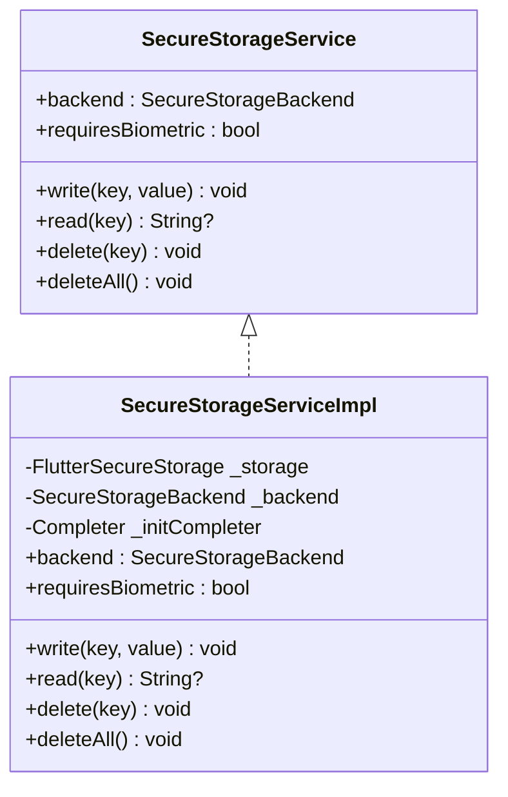
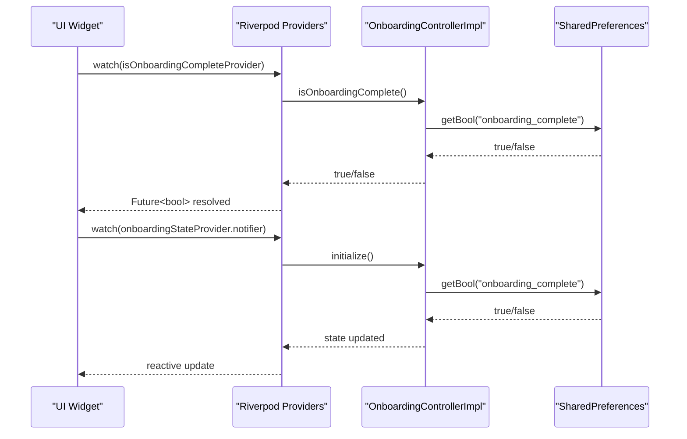
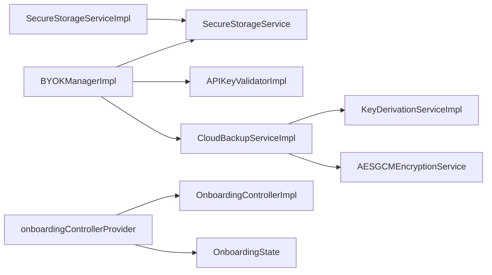

# Core Services

<cite>
**Referenced Files in This Document**
- [lib/core/byok/byok_manager.dart](file://lib/core/byok/byok_manager.dart)
- [lib/core/byok/byok_storage_keys.dart](file://lib/core/byok/byok_storage_keys.dart)
- [lib/core/byok/models/api_key_config.dart](file://lib/core/byok/models/api_key_config.dart)
- [lib/core/byok/models/byok_error.dart](file://lib/core/byok/models/byok_error.dart)
- [lib/core/byok/models/cloud_backup_blob.dart](file://lib/core/byok/models/cloud_backup_blob.dart)
- [lib/core/byok/models/validation_result.dart](file://lib/core/byok/models/validation_result.dart)
- [lib/core/byok/api_key_validator.dart](file://lib/core/byok/api_key_validator.dart)
- [lib/core/byok/cloud_backup_service.dart](file://lib/core/byok/cloud_backup_service.dart)
- [lib/core/crypto/encryption_service.dart](file://lib/core/crypto/encryption_service.dart)
- [lib/core/crypto/key_derivation_service.dart](file://lib/core/crypto/key_derivation_service.dart)
- [lib/core/crypto/kdf_metadata.dart](file://lib/core/crypto/kdf_metadata.dart)
- [lib/core/storage/secure_storage_service.dart](file://lib/core/storage/secure_storage_service.dart)
- [lib/core/storage/secure_storage_service_impl.dart](file://lib/core/storage/secure_storage_service_impl.dart)
- [lib/core/onboarding/onboarding_controller.dart](file://lib/core/onboarding/onboarding_controller.dart)
- [lib/core/onboarding/onboarding_controller_impl.dart](file://lib/core/onboarding/onboarding_controller_impl.dart)
- [lib/core/onboarding/onboarding_providers.dart](file://lib/core/onboarding/onboarding_providers.dart)
- [lib/core/onboarding/models/onboarding_state.dart](file://lib/core/onboarding/models/onboarding_state.dart)
</cite>

## Table of Contents
1. [Introduction](#introduction)
2. [Project Structure](#project-structure)
3. [Core Components](#core-components)
4. [Architecture Overview](#architecture-overview)
5. [Detailed Component Analysis](#detailed-component-analysis)
6. [Dependency Analysis](#dependency-analysis)
7. [Performance Considerations](#performance-considerations)
8. [Troubleshooting Guide](#troubleshooting-guide)
9. [Conclusion](#conclusion)

## Introduction
This document explains StyleSync’s core services layer with a focus on security architecture and orchestration. It covers:
- BYOK Manager as the orchestrator for API key lifecycle operations, including validation, storage, and cloud backup integration
- Crypto Services for AES-256-GCM encryption, Argon2id/PBKDF2 key derivation, and KDF metadata management
- Secure Storage Service abstraction enabling hardware-backed vs software-backed storage across platforms
- Onboarding Controller using Riverpod for reactive state management and user flow control

It documents initialization patterns, dependency injection, error handling strategies, and performance considerations to help developers understand and extend the system safely.

## Project Structure
The core services are organized by feature domain:
- BYOK: API key lifecycle, validation, secure storage, and cloud backup
- Crypto: Encryption and key derivation
- Storage: Secure storage abstraction and platform-specific implementation
- Onboarding: State management and persistence for onboarding flow

**Diagram sources**
- [lib/core/byok/byok_manager.dart](file://lib/core/byok/byok_manager.dart#L153-L582)
- [lib/core/byok/api_key_validator.dart](file://lib/core/byok/api_key_validator.dart#L53-L321)
- [lib/core/byok/cloud_backup_service.dart](file://lib/core/byok/cloud_backup_service.dart#L97-L900)
- [lib/core/byok/byok_storage_keys.dart](file://lib/core/byok/byok_storage_keys.dart#L5-L14)
- [lib/core/byok/models/api_key_config.dart](file://lib/core/byok/models/api_key_config.dart#L5-L109)
- [lib/core/byok/models/cloud_backup_blob.dart](file://lib/core/byok/models/cloud_backup_blob.dart#L8-L156)
- [lib/core/byok/models/validation_result.dart](file://lib/core/byok/models/validation_result.dart#L5-L187)
- [lib/core/byok/models/byok_error.dart](file://lib/core/byok/models/byok_error.dart#L7-L93)
- [lib/core/crypto/encryption_service.dart](file://lib/core/crypto/encryption_service.dart#L22-L74)
- [lib/core/crypto/key_derivation_service.dart](file://lib/core/crypto/key_derivation_service.dart#L17-L117)
- [lib/core/crypto/kdf_metadata.dart](file://lib/core/crypto/kdf_metadata.dart#L9-L77)
- [lib/core/storage/secure_storage_service.dart](file://lib/core/storage/secure_storage_service.dart#L11-L29)
- [lib/core/storage/secure_storage_service_impl.dart](file://lib/core/storage/secure_storage_service_impl.dart#L7-L104)
- [lib/core/onboarding/onboarding_controller.dart](file://lib/core/onboarding/onboarding_controller.dart#L17-L46)
- [lib/core/onboarding/onboarding_controller_impl.dart](file://lib/core/onboarding/onboarding_controller_impl.dart#L16-L78)
- [lib/core/onboarding/onboarding_providers.dart](file://lib/core/onboarding/onboarding_providers.dart#L18-L175)
- [lib/core/onboarding/models/onboarding_state.dart](file://lib/core/onboarding/models/onboarding_state.dart#L23-L74)

**Section sources**
- [lib/core/byok/byok_manager.dart](file://lib/core/byok/byok_manager.dart#L1-L583)
- [lib/core/byok/cloud_backup_service.dart](file://lib/core/byok/cloud_backup_service.dart#L1-L900)
- [lib/core/crypto/encryption_service.dart](file://lib/core/crypto/encryption_service.dart#L1-L75)
- [lib/core/crypto/key_derivation_service.dart](file://lib/core/crypto/key_derivation_service.dart#L1-L118)
- [lib/core/storage/secure_storage_service.dart](file://lib/core/storage/secure_storage_service.dart#L1-L30)
- [lib/core/storage/secure_storage_service_impl.dart](file://lib/core/storage/secure_storage_service_impl.dart#L1-L105)
- [lib/core/onboarding/onboarding_providers.dart](file://lib/core/onboarding/onboarding_providers.dart#L1-L176)

## Core Components
- BYOK Manager: Orchestrates API key lifecycle (store, retrieve, update, delete), integrates validation, secure storage, and optional cloud backup. Provides typed results and robust error modeling.
- Crypto Services: AES-256-GCM encryption and Argon2id/PBKDF2 key derivation with platform-aware defaults and KDF metadata serialization.
- Secure Storage Service: Abstraction over platform-native secure storage with hardware-backed preference on supported platforms and software fallback.
- Onboarding Controller: Riverpod-based reactive state management for onboarding steps and persistence using SharedPreferences.

**Section sources**
- [lib/core/byok/byok_manager.dart](file://lib/core/byok/byok_manager.dart#L84-L147)
- [lib/core/crypto/encryption_service.dart](file://lib/core/crypto/encryption_service.dart#L14-L20)
- [lib/core/crypto/key_derivation_service.dart](file://lib/core/crypto/key_derivation_service.dart#L9-L15)
- [lib/core/storage/secure_storage_service.dart](file://lib/core/storage/secure_storage_service.dart#L11-L29)
- [lib/core/onboarding/onboarding_providers.dart](file://lib/core/onboarding/onboarding_providers.dart#L18-L175)

## Architecture Overview
The services layer follows a layered, dependency-injected design:
- BYOK Manager depends on Secure Storage, API Key Validator, and Cloud Backup Service
- Cloud Backup Service depends on Encryption Service, Key Derivation Service, and Firebase services
- Crypto Services are reusable building blocks
- Secure Storage Service abstracts platform specifics
- Onboarding Controller integrates with Riverpod providers for reactive UI state

**Diagram sources**
- [lib/core/byok/byok_manager.dart](file://lib/core/byok/byok_manager.dart#L153-L582)
- [lib/core/byok/cloud_backup_service.dart](file://lib/core/byok/cloud_backup_service.dart#L97-L119)
- [lib/core/crypto/encryption_service.dart](file://lib/core/crypto/encryption_service.dart#L22-L40)
- [lib/core/crypto/key_derivation_service.dart](file://lib/core/crypto/key_derivation_service.dart#L17-L33)
- [lib/core/storage/secure_storage_service.dart](file://lib/core/storage/secure_storage_service.dart#L11-L29)
- [lib/core/storage/secure_storage_service_impl.dart](file://lib/core/storage/secure_storage_service_impl.dart#L7-L31)

## Detailed Component Analysis

### BYOK Manager
Responsibilities:
- Validate API key format and functionality
- Persist configuration to secure storage
- Manage cloud backup lifecycle (enable/disable/restore/rotate)
- Preserve metadata and idempotency keys
- Provide typed results and detailed error reporting

Key behaviors:
- Validation pipeline: format → functionality
- Storage: JSON-serialized configuration with UTC timestamps
- Cloud backup: client-side encryption with passphrase-derived keys
- Error modeling: sealed BYOKError hierarchy with specific failure types

**Diagram sources**
- [lib/core/byok/byok_manager.dart](file://lib/core/byok/byok_manager.dart#L84-L147)
- [lib/core/byok/byok_manager.dart](file://lib/core/byok/byok_manager.dart#L153-L549)

**Section sources**
- [lib/core/byok/byok_manager.dart](file://lib/core/byok/byok_manager.dart#L182-L549)
- [lib/core/byok/models/byok_error.dart](file://lib/core/byok/models/byok_error.dart#L7-L93)
- [lib/core/byok/models/api_key_config.dart](file://lib/core/byok/models/api_key_config.dart#L5-L109)

### Cloud Backup Service
Responsibilities:
- Encrypt and upload API key configuration to cloud storage
- Decrypt and restore configuration from cloud storage
- Manage backup existence and passphrase verification
- Safe passphrase rotation using temporary backup and atomic-like swap

Implementation highlights:
- Uses KeyDerivationService to derive encryption keys from passphrases
- Uses EncryptionService for AES-256-GCM encryption
- Serializes backup to CloudBackupBlob with KDF metadata
- Handles network vs storage vs corruption errors distinctly

**Diagram sources**
- [lib/core/byok/byok_manager.dart](file://lib/core/byok/byok_manager.dart#L386-L429)
- [lib/core/byok/cloud_backup_service.dart](file://lib/core/byok/cloud_backup_service.dart#L166-L249)
- [lib/core/crypto/key_derivation_service.dart](file://lib/core/crypto/key_derivation_service.dart#L22-L53)
- [lib/core/crypto/encryption_service.dart](file://lib/core/crypto/encryption_service.dart#L22-L40)

**Section sources**
- [lib/core/byok/cloud_backup_service.dart](file://lib/core/byok/cloud_backup_service.dart#L21-L91)
- [lib/core/byok/cloud_backup_service.dart](file://lib/core/byok/cloud_backup_service.dart#L166-L555)
- [lib/core/byok/models/cloud_backup_blob.dart](file://lib/core/byok/models/cloud_backup_blob.dart#L8-L156)
- [lib/core/crypto/kdf_metadata.dart](file://lib/core/crypto/kdf_metadata.dart#L9-L77)

### API Key Validator
Responsibilities:
- Validate API key format (prefix, length, character set)
- Validate functionality by calling Vertex AI models endpoint
- Provide structured ValidationResult with failure types and metadata

**Diagram sources**
- [lib/core/byok/api_key_validator.dart](file://lib/core/byok/api_key_validator.dart#L152-L272)

**Section sources**
- [lib/core/byok/api_key_validator.dart](file://lib/core/byok/api_key_validator.dart#L14-L48)
- [lib/core/byok/api_key_validator.dart](file://lib/core/byok/api_key_validator.dart#L111-L224)
- [lib/core/byok/models/validation_result.dart](file://lib/core/byok/models/validation_result.dart#L5-L187)

### Crypto Services
- AESGCMEncryptionService: AES-256-GCM with 32-byte keys, 12-byte nonce, 16-byte MAC; throws AuthenticationException on MAC verification failure
- KeyDerivationServiceImpl: Argon2id on mobile/desktop; PBKDF2 on web; generates random salts; platform-aware parameters
- KdfMetadata: serializable KDF parameters including algorithm, salt, iterations, memory, and parallelism

**Diagram sources**
- [lib/core/crypto/encryption_service.dart](file://lib/core/crypto/encryption_service.dart#L14-L74)
- [lib/core/crypto/key_derivation_service.dart](file://lib/core/crypto/key_derivation_service.dart#L9-L117)
- [lib/core/crypto/kdf_metadata.dart](file://lib/core/crypto/kdf_metadata.dart#L9-L77)

**Section sources**
- [lib/core/crypto/encryption_service.dart](file://lib/core/crypto/encryption_service.dart#L14-L74)
- [lib/core/crypto/key_derivation_service.dart](file://lib/core/crypto/key_derivation_service.dart#L17-L117)
- [lib/core/crypto/kdf_metadata.dart](file://lib/core/crypto/kdf_metadata.dart#L9-L77)

### Secure Storage Service
- SecureStorageService: abstract interface for write/read/delete/deleteAll and metadata (backend type, biometric requirement)
- SecureStorageServiceImpl: platform-aware implementation
  - Android: hardware-backed via Android Keystore (AES-GCM)
  - iOS: hardware-backed via Keychain/Secure Enclave
  - Other platforms: software-backed fallback
- Initialization uses a Completer to ensure thread-safe lazy initialization and fallback

**Diagram sources**
- [lib/core/storage/secure_storage_service.dart](file://lib/core/storage/secure_storage_service.dart#L11-L29)
- [lib/core/storage/secure_storage_service_impl.dart](file://lib/core/storage/secure_storage_service_impl.dart#L7-L104)

**Section sources**
- [lib/core/storage/secure_storage_service.dart](file://lib/core/storage/secure_storage_service.dart#L1-L30)
- [lib/core/storage/secure_storage_service_impl.dart](file://lib/core/storage/secure_storage_service_impl.dart#L33-L104)

### Onboarding Controller and State Management
- OnboardingController: abstract interface for persistence and completion state
- OnboardingControllerImpl: SharedPreferences-backed persistence with thread-safe initialization
- Riverpod providers:
  - onboardingControllerProvider: singleton controller
  - isOnboardingCompleteProvider: FutureProvider for initial routing
  - onboardingStateProvider: StateNotifierProvider for reactive UI state
- OnboardingState: immutable state with current step and completion flag

**Diagram sources**
- [lib/core/onboarding/onboarding_providers.dart](file://lib/core/onboarding/onboarding_providers.dart#L18-L175)
- [lib/core/onboarding/onboarding_controller_impl.dart](file://lib/core/onboarding/onboarding_controller_impl.dart#L29-L77)
- [lib/core/onboarding/models/onboarding_state.dart](file://lib/core/onboarding/models/onboarding_state.dart#L23-L74)

**Section sources**
- [lib/core/onboarding/onboarding_controller.dart](file://lib/core/onboarding/onboarding_controller.dart#L17-L46)
- [lib/core/onboarding/onboarding_controller_impl.dart](file://lib/core/onboarding/onboarding_controller_impl.dart#L16-L78)
- [lib/core/onboarding/onboarding_providers.dart](file://lib/core/onboarding/onboarding_providers.dart#L18-L175)
- [lib/core/onboarding/models/onboarding_state.dart](file://lib/core/onboarding/models/onboarding_state.dart#L23-L74)

## Dependency Analysis
- BYOK Manager depends on:
  - SecureStorageService for persistence
  - APIKeyValidator for validation
  - CloudBackupService for cloud operations
- CloudBackupService depends on:
  - KeyDerivationService for key derivation
  - EncryptionService for encryption/decryption
  - Firebase services for storage
- SecureStorageServiceImpl depends on platform libraries and initializes lazily
- Onboarding providers depend on SharedPreferences and expose reactive state

**Diagram sources**
- [lib/core/byok/byok_manager.dart](file://lib/core/byok/byok_manager.dart#L153-L582)
- [lib/core/byok/cloud_backup_service.dart](file://lib/core/byok/cloud_backup_service.dart#L97-L119)
- [lib/core/storage/secure_storage_service_impl.dart](file://lib/core/storage/secure_storage_service_impl.dart#L7-L31)
- [lib/core/onboarding/onboarding_providers.dart](file://lib/core/onboarding/onboarding_providers.dart#L18-L175)

**Section sources**
- [lib/core/byok/byok_manager.dart](file://lib/core/byok/byok_manager.dart#L153-L582)
- [lib/core/byok/cloud_backup_service.dart](file://lib/core/byok/cloud_backup_service.dart#L97-L119)
- [lib/core/storage/secure_storage_service_impl.dart](file://lib/core/storage/secure_storage_service_impl.dart#L7-L31)
- [lib/core/onboarding/onboarding_providers.dart](file://lib/core/onboarding/onboarding_providers.dart#L18-L175)

## Performance Considerations
- Key derivation:
  - Argon2id parameters are tuned for mobile/desktop; PBKDF2 for web
  - Use compute isolates for CPU-intensive work where applicable
- Encryption:
  - AES-256-GCM is fast and secure; avoid unnecessary re-encryption
- Cloud operations:
  - Network errors are detected and categorized; implement retries with exponential backoff at higher layers if needed
- Storage:
  - Initialize SecureStorageServiceImpl lazily with a Completer to avoid blocking
- Onboarding:
  - SharedPreferences operations are lightweight; avoid frequent writes

[No sources needed since this section provides general guidance]

## Troubleshooting Guide
Common issues and strategies:
- AuthenticationException during decryption:
  - Indicates wrong passphrase or corrupted ciphertext; prompt user to verify passphrase
- BackupError types:
  - notFound: backup does not exist
  - wrongPassphrase: decryption failed due to incorrect passphrase
  - corrupted: backup format or data integrity issues
  - networkError: connectivity or service availability problems
  - storageError: Firebase errors or permission issues
- Storage errors:
  - Wrap low-level exceptions and return StorageError with original error for diagnostics
- Validation failures:
  - Use ValidationResult failure types to guide user feedback (invalid format, unauthorized, rate-limited, etc.)

**Section sources**
- [lib/core/crypto/encryption_service.dart](file://lib/core/crypto/encryption_service.dart#L6-L12)
- [lib/core/byok/models/byok_error.dart](file://lib/core/byok/models/byok_error.dart#L54-L93)
- [lib/core/byok/cloud_backup_service.dart](file://lib/core/byok/cloud_backup_service.dart#L251-L317)

## Conclusion
StyleSync’s core services layer is designed around clear separation of concerns and strong security guarantees:
- BYOK Manager orchestrates lifecycle operations with robust validation and error modeling
- Crypto Services provide modern primitives with platform-aware defaults
- Secure Storage abstraction enables hardware-backed protection where available
- Onboarding Controller leverages Riverpod for reactive, testable state management

The documented patterns—dependency injection, typed results, and platform-aware implementations—enable maintainability, testability, and extensibility across platforms.