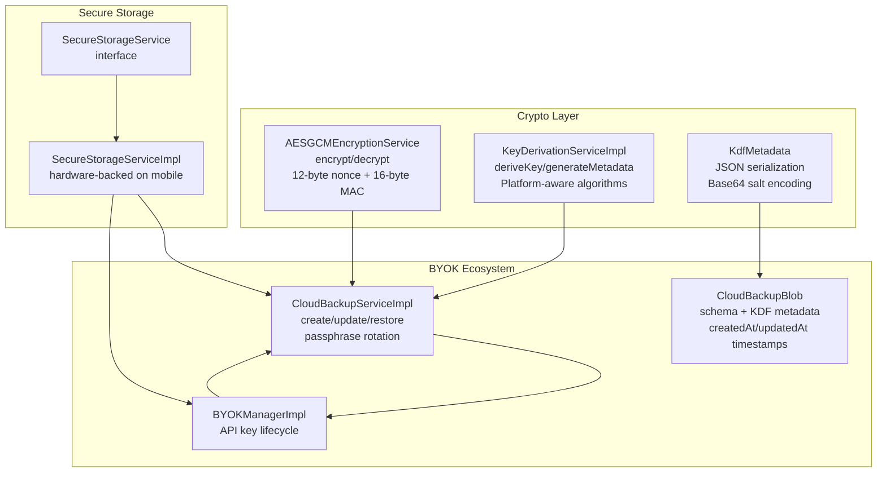
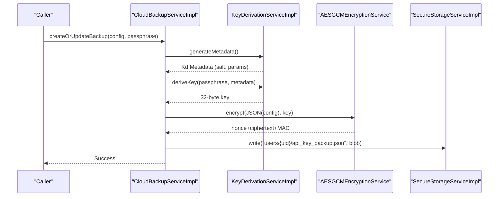
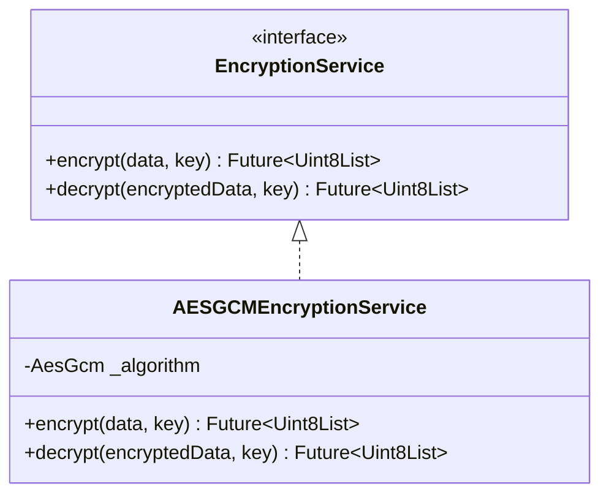
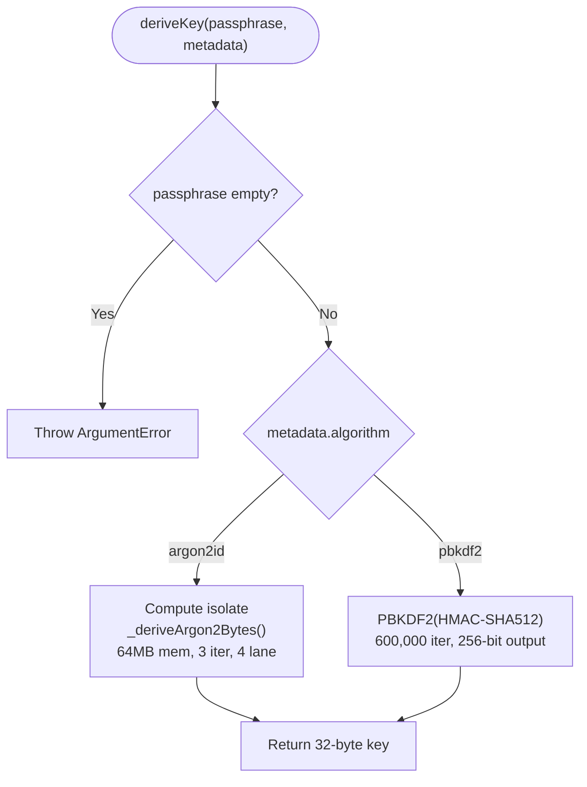
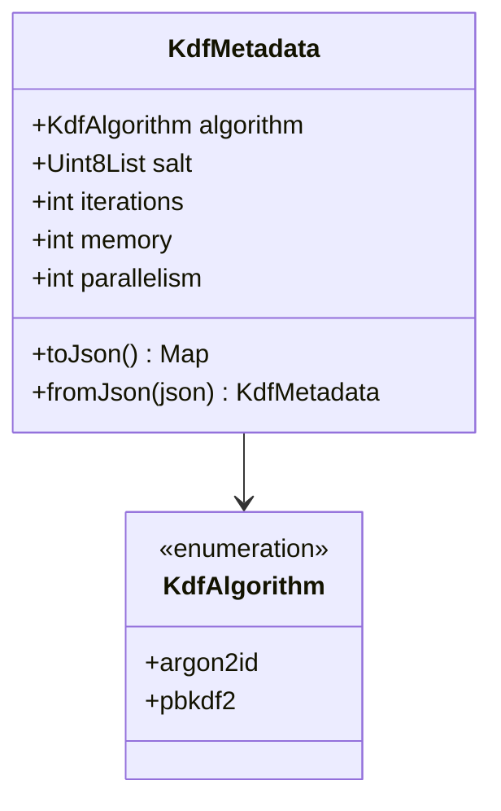
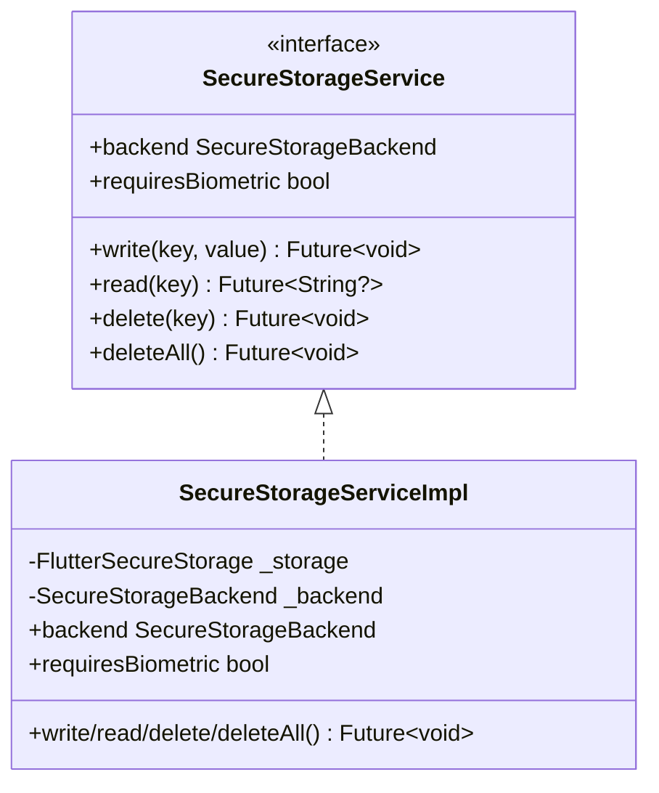
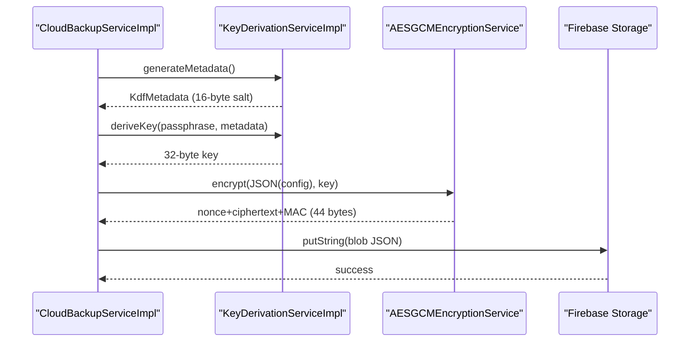
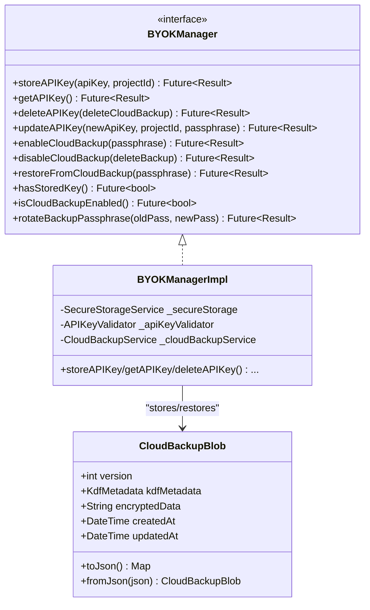
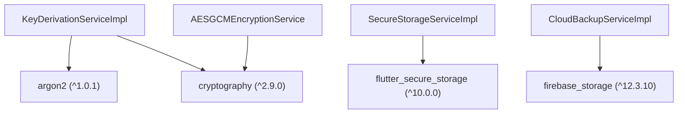

# Crypto Services

<cite>
**Referenced Files in This Document**
- [encryption_service.dart](file://lib/core/crypto/encryption_service.dart)
- [key_derivation_service.dart](file://lib/core/crypto/key_derivation_service.dart)
- [kdf_metadata.dart](file://lib/core/crypto/kdf_metadata.dart)
- [secure_storage_service.dart](file://lib/core/storage/secure_storage_service.dart)
- [secure_storage_service_impl.dart](file://lib/core/storage/secure_storage_service_impl.dart)
- [cloud_backup_service.dart](file://lib/core/byok/cloud_backup_service.dart)
- [byok_manager.dart](file://lib/core/byok/byok_manager.dart)
- [cloud_backup_blob.dart](file://lib/core/byok/models/cloud_backup_blob.dart)
- [encryption_service_test.dart](file://test/encryption_service_test.dart)
- [key_derivation_service_test.dart](file://test/key_derivation_service_test.dart)
- [kdf_metadata_test.dart](file://test/kdf_metadata_test.dart)
- [crypto_properties_test.dart](file://test/crypto_properties_test.dart)
- [pubspec.yaml](file://pubspec.yaml)
</cite>

## Update Summary
**Changes Made**
- Enhanced encryption service specification with detailed AES-256-GCM implementation details
- Expanded key derivation service documentation with platform-specific algorithm selection
- Added comprehensive KDF metadata validation and serialization details
- Updated secure storage integration with hardware-backed storage specifics
- Enhanced cloud backup service workflow documentation with passphrase rotation
- Added detailed security considerations and threat modeling

## Table of Contents
1. [Introduction](#introduction)
2. [Project Structure](#project-structure)
3. [Core Components](#core-components)
4. [Architecture Overview](#architecture-overview)
5. [Detailed Component Analysis](#detailed-component-analysis)
6. [Dependency Analysis](#dependency-analysis)
7. [Performance Considerations](#performance-considerations)
8. [Troubleshooting Guide](#troubleshooting-guide)
9. [Security Considerations and Best Practices](#security-considerations-and-best-practices)
10. [Conclusion](#conclusion)

## Introduction
This document describes the Crypto Services layer responsible for security primitives and cryptographic operations. It focuses on:
- AES-256-GCM encryption using authenticated encryption with 12-byte nonces and 16-byte MAC
- Password-based key derivation with Argon2id and PBKDF2 algorithms with platform-aware defaults
- KDF Metadata for parameter persistence across sessions with robust validation
- Secure storage integration with hardware-backed storage on mobile platforms
- Cloud backup encryption workflow with passphrase rotation and atomic operations
- Security considerations, algorithm selection criteria, performance implications, and best practices

## Project Structure
The Crypto Services layer is organized around four primary modules:
- **Encryption Service**: AES-256-GCM authenticated encryption with 96-bit nonces
- **Key Derivation Service**: Argon2id and PBKDF2 with platform-aware defaults and salt generation
- **KDF Metadata**: Parameter serialization, validation, and persistence with base64 encoding
- **Secure Storage**: Platform-native secure storage abstraction with hardware-backed options
- **BYOK Ecosystem**: Cloud backup service integrating encryption, KDF metadata, and passphrase management

**Diagram sources**
- [encryption_service.dart](file://lib/core/crypto/encryption_service.dart#L22-L75)
- [key_derivation_service.dart](file://lib/core/crypto/key_derivation_service.dart#L16-L118)
- [kdf_metadata.dart](file://lib/core/crypto/kdf_metadata.dart#L9-L78)
- [secure_storage_service.dart](file://lib/core/storage/secure_storage_service.dart#L11-L30)
- [secure_storage_service_impl.dart](file://lib/core/storage/secure_storage_service_impl.dart#L7-L105)
- [cloud_backup_service.dart](file://lib/core/byok/cloud_backup_service.dart#L97-L900)
- [byok_manager.dart](file://lib/core/byok/byok_manager.dart#L153-L583)
- [cloud_backup_blob.dart](file://lib/core/byok/models/cloud_backup_blob.dart#L8-L166)

**Section sources**
- [encryption_service.dart](file://lib/core/crypto/encryption_service.dart#L14-L75)
- [key_derivation_service.dart](file://lib/core/crypto/key_derivation_service.dart#L8-L118)
- [kdf_metadata.dart](file://lib/core/crypto/kdf_metadata.dart#L4-L78)
- [secure_storage_service.dart](file://lib/core/storage/secure_storage_service.dart#L1-L30)
- [secure_storage_service_impl.dart](file://lib/core/storage/secure_storage_service_impl.dart#L1-L105)
- [cloud_backup_service.dart](file://lib/core/byok/cloud_backup_service.dart#L16-L900)
- [byok_manager.dart](file://lib/core/byok/byok_manager.dart#L80-L583)
- [cloud_backup_blob.dart](file://lib/core/byok/models/cloud_backup_blob.dart#L1-L166)

## Core Components
- **AESGCMEncryptionService**: Implements authenticated encryption with AES-256-GCM, generating 96-bit nonces and returning concatenated nonce + ciphertext + MAC with 12-byte nonce and 16-byte authentication tag
- **KeyDerivationServiceImpl**: Derives 32-byte keys from passphrases using Argon2id on mobile platforms (Android, iOS, macOS) with 64MB memory, 3 iterations, and 4 parallelism, PBKDF2 on desktop/web with 600,000 iterations
- **KdfMetadata**: Encapsulates KDF parameters (algorithm, salt, iterations, memory, parallelism) with robust JSON serialization using base64-encoded salt and comprehensive validation
- **SecureStorageService/SecureStorageServiceImpl**: Abstraction and platform-aware implementation selecting hardware-backed storage (Android Keystore/TEE, iOS Secure Enclave) when available
- **CloudBackupServiceImpl**: Orchestrates end-to-end cloud backup encryption using AES-GCM and KDF metadata, supporting passphrase rotation with temporary staging and atomic operations

**Section sources**
- [encryption_service.dart](file://lib/core/crypto/encryption_service.dart#L22-L75)
- [key_derivation_service.dart](file://lib/core/crypto/key_derivation_service.dart#L16-L118)
- [kdf_metadata.dart](file://lib/core/crypto/kdf_metadata.dart#L9-L78)
- [secure_storage_service.dart](file://lib/core/storage/secure_storage_service.dart#L11-L30)
- [secure_storage_service_impl.dart](file://lib/core/storage/secure_storage_service_impl.dart#L7-L105)
- [cloud_backup_service.dart](file://lib/core/byok/cloud_backup_service.dart#L97-L900)

## Architecture Overview
The Crypto Services layer composes:
- **Encryption Service** for confidentiality and integrity using AES-256-GCM
- **Key Derivation Service** for password-to-key conversion with platform-specific optimization
- **KDF Metadata** for parameter persistence and validation
- **Secure Storage** for sensitive data protection with hardware-backed options
- **Cloud Backup Service** for encrypted cloud storage with passphrase management

**Diagram sources**
- [cloud_backup_service.dart](file://lib/core/byok/cloud_backup_service.dart#L167-L249)
- [key_derivation_service.dart](file://lib/core/crypto/key_derivation_service.dart#L36-L53)
- [encryption_service.dart](file://lib/core/crypto/encryption_service.dart#L26-L40)
- [secure_storage_service_impl.dart](file://lib/core/storage/secure_storage_service_impl.dart#L76-L97)

## Detailed Component Analysis

### AESGCMEncryptionService
- **Responsibilities**:
  - Encrypt: validates 32-byte key length, generates 96-bit random nonce, returns concatenated nonce + ciphertext + MAC
  - Decrypt: validates key length and minimum 28 bytes (12-byte nonce + 16-byte MAC), reconstructs SecretBox, authenticates and returns plaintext
- **Integrity**: Throws AuthenticationException on MAC verification failure with detailed error messages
- **Nonce Management**: Uses library-generated 96-bit nonces; concatenation format enforced as nonce (12 bytes) + ciphertext + MAC (16 bytes)
- **Security Properties**: Provides both confidentiality and authenticity with 128-bit security strength

**Diagram sources**
- [encryption_service.dart](file://lib/core/crypto/encryption_service.dart#L14-L75)

**Section sources**
- [encryption_service.dart](file://lib/core/crypto/encryption_service.dart#L22-L75)
- [encryption_service_test.dart](file://test/encryption_service_test.dart#L14-L63)

### KeyDerivationServiceImpl
- **Responsibilities**:
  - deriveKey: dispatches to Argon2id or PBKDF2 based on metadata algorithm
  - generateMetadata: selects algorithm per platform, generates random 16-byte salt, sets optimized parameters
- **Argon2id**: Executed off UI thread using isolates for CPU/memory-intensive operations with 64MB memory, 3 iterations, 4 parallelism on mobile
- **PBKDF2**: Uses HMAC-SHA512 with 600,000 iterations for desktop/web environments
- **Salt Generation**: Cryptographically secure randomness using Random.secure()
- **Platform Detection**: Uses platform detection for optimal algorithm selection

**Diagram sources**
- [key_derivation_service.dart](file://lib/core/crypto/key_derivation_service.dart#L22-L118)

**Section sources**
- [key_derivation_service.dart](file://lib/core/crypto/key_derivation_service.dart#L16-L118)
- [key_derivation_service_test.dart](file://test/key_derivation_service_test.dart#L14-L133)

### KdfMetadata
- **Responsibilities**:
  - Holds algorithm, salt, iterations, memory, and parallelism parameters
  - JSON serialization with base64-encoded salt for storage
  - Robust validation for required keys, types, and non-negative integers
- **Defaults**: memory and parallelism default to 0 when absent, iterations default to 0 when null
- **Validation**: Comprehensive validation including algorithm enum lookup, base64 decoding, integer validation, and non-negative constraints
- **Security**: Ensures all parameters are properly validated before cryptographic operations

**Diagram sources**
- [kdf_metadata.dart](file://lib/core/crypto/kdf_metadata.dart#L4-L78)

**Section sources**
- [kdf_metadata.dart](file://lib/core/crypto/kdf_metadata.dart#L9-L78)
- [kdf_metadata_test.dart](file://test/kdf_metadata_test.dart#L7-L315)

### SecureStorageService and Implementation
- **Responsibilities**:
  - Abstraction for secure storage with read/write/delete semantics
  - Implementation chooses hardware-backed storage on Android/iOS when available
- **Backend Selection**:
  - Android: AES-GCM via Keystore/TEE with automatic hardware protection
  - iOS: Keychain with Secure Enclave protection
  - Other platforms: software-backed fallback with encryption
- **Initialization**: Async initialization with completion completer and fallback mechanism
- **Security**: Hardware-backed storage provides protection against extraction attempts

**Diagram sources**
- [secure_storage_service.dart](file://lib/core/storage/secure_storage_service.dart#L11-L30)
- [secure_storage_service_impl.dart](file://lib/core/storage/secure_storage_service_impl.dart#L7-L105)

**Section sources**
- [secure_storage_service.dart](file://lib/core/storage/secure_storage_service.dart#L1-L30)
- [secure_storage_service_impl.dart](file://lib/core/storage/secure_storage_service_impl.dart#L33-L105)

### CloudBackupServiceImpl
- **Responsibilities**:
  - Encrypts API key configurations and uploads to Firebase Storage with AES-GCM
  - Supports restore, delete, existence checks, and passphrase rotation with atomic operations
  - Preserves createdAt timestamp across updates and rotation operations
- **Workflow**:
  - Generate KDF metadata with fresh 16-byte salt
  - Derive 32-byte key from passphrase using appropriate algorithm
  - Encrypt configuration JSON with AES-GCM returning nonce + ciphertext + MAC
  - Package into CloudBackupBlob with KDF metadata and base64-encoded encrypted data
  - Upload to Firebase Storage with JSON serialization
- **Passphrase Rotation**: Uses temporary staging with atomic swap to ensure data safety

**Diagram sources**
- [cloud_backup_service.dart](file://lib/core/byok/cloud_backup_service.dart#L167-L249)
- [encryption_service.dart](file://lib/core/crypto/encryption_service.dart#L26-L40)
- [key_derivation_service.dart](file://lib/core/crypto/key_derivation_service.dart#L36-L53)

**Section sources**
- [cloud_backup_service.dart](file://lib/core/byok/cloud_backup_service.dart#L97-L900)
- [cloud_backup_service.dart](file://lib/core/byok/cloud_backup_service.dart#L167-L249)
- [cloud_backup_service.dart](file://lib/core/byok/cloud_backup_service.dart#L414-L555)

### BYOKManager and CloudBackupBlob
- **BYOKManager**: Coordinates API key lifecycle with SecureStorageService integration and CloudBackupService orchestration
- **CloudBackupBlob**: Encapsulates backup schema with versioning, KDF metadata, encrypted data, and timestamp management
- **Integration**: Seamless integration between secure storage, encryption, and cloud backup services

**Diagram sources**
- [byok_manager.dart](file://lib/core/byok/byok_manager.dart#L84-L147)
- [byok_manager.dart](file://lib/core/byok/byok_manager.dart#L153-L583)
- [cloud_backup_blob.dart](file://lib/core/byok/models/cloud_backup_blob.dart#L8-L166)

**Section sources**
- [byok_manager.dart](file://lib/core/byok/byok_manager.dart#L80-L583)
- [byok_manager.dart](file://lib/core/byok/byok_manager.dart#L153-L583)
- [cloud_backup_blob.dart](file://lib/core/byok/models/cloud_backup_blob.dart#L1-L166)

## Dependency Analysis
External dependencies relevant to cryptography:
- **cryptography**: AES-GCM authenticated encryption implementation
- **argon2**: Argon2id key derivation with memory-hard functions
- **flutter_secure_storage**: Platform-native secure storage with hardware-backed options
- **firebase_storage**: Cloud storage for encrypted backup persistence

**Diagram sources**
- [pubspec.yaml](file://pubspec.yaml#L41-L43)
- [key_derivation_service.dart](file://lib/core/crypto/key_derivation_service.dart#L2-L6)
- [encryption_service.dart](file://lib/core/crypto/encryption_service.dart#L2)
- [secure_storage_service_impl.dart](file://lib/core/storage/secure_storage_service_impl.dart#L3)

**Section sources**
- [pubspec.yaml](file://pubspec.yaml#L41-L43)

## Performance Considerations
- **AES-256-GCM**:
  - Extremely fast authenticated encryption with hardware acceleration on modern devices
  - Nonce uniqueness guaranteed by library; repeated encryption of identical plaintext yields different ciphertexts
  - 12-byte nonce + variable ciphertext + 16-byte MAC overhead
- **Argon2id**:
  - CPU and memory-hard function optimized for mobile with 64MB memory, 3 iterations, 4 parallelism
  - Offloads computation to isolates to avoid blocking UI thread
  - Provides strong resistance to GPU/ASIC attacks
- **PBKDF2**:
  - 600,000 iterations on desktop/web for increased computational cost
  - HMAC-SHA512 provides 512-bit intermediate values
  - Higher iterations increase security but also computational cost
- **Secure Storage**:
  - Hardware-backed storage leverages device security enclaves for improved performance and security
  - Android Keystore/TEE and iOS Secure Enclave provide accelerated cryptographic operations
  - Automatic fallback to software encryption when hardware protection unavailable

## Troubleshooting Guide
Common issues and mitigations:
- **Authentication failures during decryption**:
  - Indicates wrong passphrase or corrupted ciphertext; verify passphrase and ciphertext integrity
  - MAC verification failures indicate authentication errors requiring correct key derivation parameters
- **Wrong key or tampered data**:
  - Expect AuthenticationException with detailed error messages; ensure correct key derivation parameters
  - Verify that KDF metadata matches the original encryption parameters
- **Empty passphrase rejection**:
  - Key derivation rejects empty passphrases; supply a strong passphrase with sufficient entropy
  - Implementation validates non-empty passphrases to prevent weak key derivation
- **Platform-specific KDF selection**:
  - Mobile defaults to Argon2id with optimized parameters; desktop falls back to PBKDF2 with high iteration count
  - Adjust parameters according to target platform capabilities and security requirements
- **Network errors in cloud backup**:
  - Distinguish network vs. storage errors; retry on transient network conditions
  - CloudBackupService handles network error classification and appropriate error propagation
- **Passphrase rotation failures**:
  - Temporary staging ensures data safety; verify temp backup before finalizing rotation
  - Atomic swap operations minimize exposure windows during passphrase changes

**Section sources**
- [encryption_service_test.dart](file://test/encryption_service_test.dart#L34-L60)
- [crypto_properties_test.dart](file://test/crypto_properties_test.dart#L60-L94)
- [key_derivation_service_test.dart](file://test/key_derivation_service_test.dart#L62-L85)

## Security Considerations and Best Practices
- **Algorithm Selection**:
  - Prefer Argon2id on mobile devices for resistance to hardware-accelerated attacks and optimized parameters
  - Use PBKDF2 on desktop environments where Argon2id support may be limited
  - Ensure algorithm compatibility across all target platforms
- **Parameter Tuning**:
  - Adjust iterations, memory, and parallelism based on threat model and device capabilities
  - Preserve KDF metadata across sessions to maintain consistent security parameters
  - Mobile: 64MB memory, 3 iterations, 4 parallelism; Desktop: 600,000 iterations
- **Nonce and Randomness**:
  - Rely on library-generated 96-bit nonces; never reuse nonces with the same key
  - Use cryptographically secure randomness for salts and encryption keys
  - 16-byte salt provides sufficient entropy for password-based key derivation
- **Integrity and Authenticity**:
  - AES-GCM provides both confidentiality and authenticity with 128-bit security strength
  - Handle MAC verification failures as authentication errors requiring correct passphrase
  - Base64 encoding of encrypted data ensures safe storage and transmission
- **Secure Storage**:
  - Prefer hardware-backed storage when available; Android Keystore/TEE and iOS Secure Enclave provide enhanced protection
  - Ensure proper initialization and fallback behavior for unsupported platforms
  - Automatic backend selection maximizes security across different device capabilities
- **Cloud Backup**:
  - Preserve createdAt timestamps to prevent metadata leakage and timing attacks
  - Use passphrase rotation with temporary staging to minimize exposure windows
  - Atomic operations during rotation ensure data integrity and prevent partial updates
- **Threat Modeling**:
  - Attack vectors: brute-force key derivation, tampering with ciphertext, weak passphrases, side-channel leaks, hardware extraction
  - Mitigations: strong passphrases with sufficient entropy, parameter hardening, hardware-backed storage, authenticated encryption, secure random number generation
  - Defense in depth: multiple layers of security including hardware protection, strong algorithms, and secure storage

## Conclusion
The Crypto Services layer provides a comprehensive, secure foundation for encryption, key derivation, and cloud backup operations. By combining AES-256-GCM authenticated encryption, platform-optimized Argon2id/PBKDF2 key derivation, robust KDF metadata validation, and hardware-backed secure storage, the system achieves strong confidentiality, integrity, and availability for sensitive data. The architecture supports seamless passphrase rotation, atomic operations, and platform-specific optimizations while maintaining security best practices. Adhering to the documented security considerations and tuning parameters to deployment environments ensures resilience against evolving cryptographic threats and attack vectors.