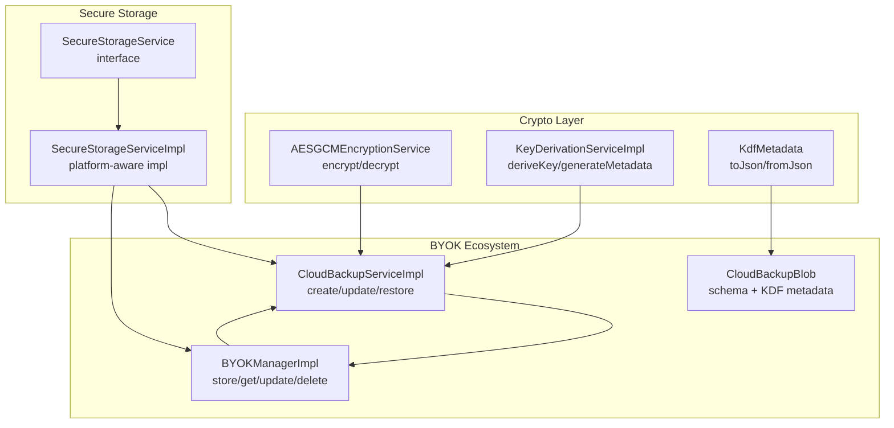
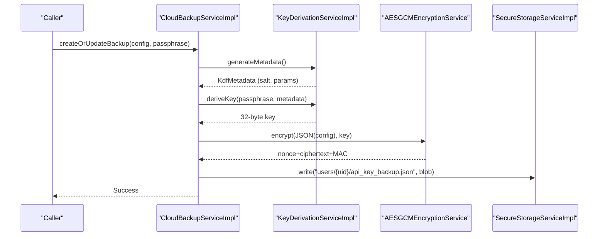
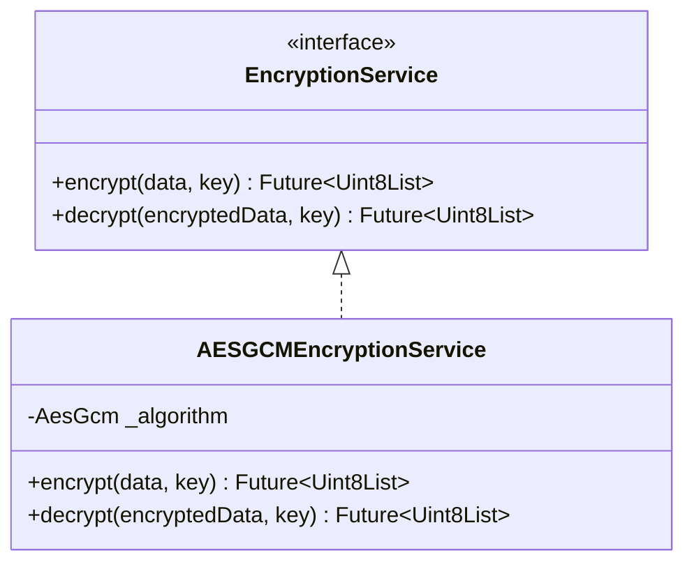
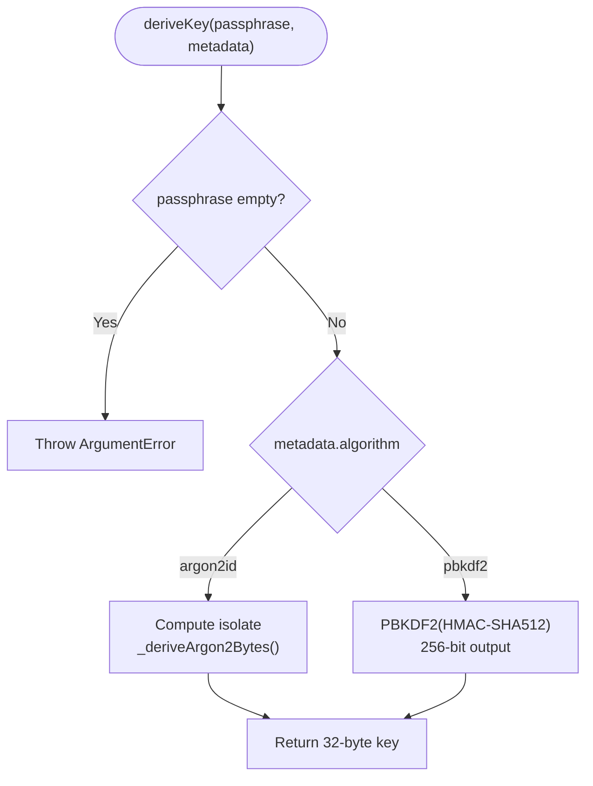
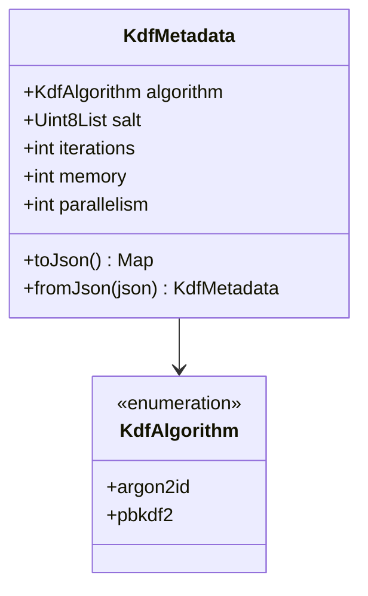
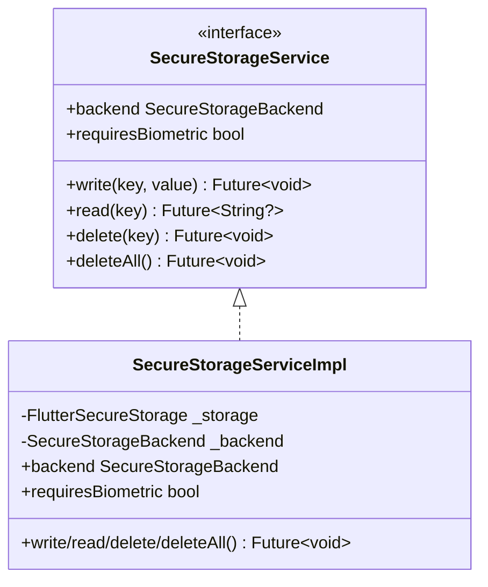
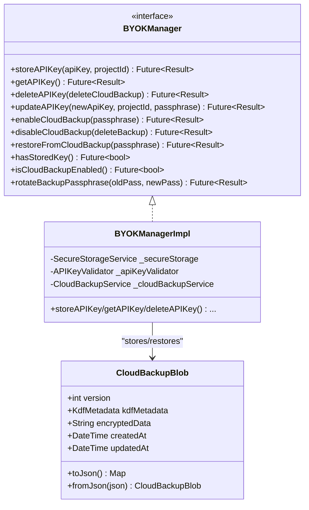
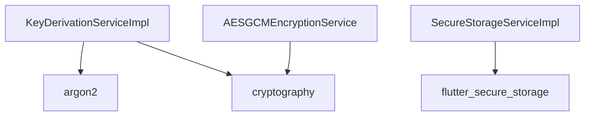

# Crypto Services

<cite>
**Referenced Files in This Document**
- [encryption_service.dart](file://lib/core/crypto/encryption_service.dart)
- [key_derivation_service.dart](file://lib/core/crypto/key_derivation_service.dart)
- [kdf_metadata.dart](file://lib/core/crypto/kdf_metadata.dart)
- [secure_storage_service.dart](file://lib/core/storage/secure_storage_service.dart)
- [secure_storage_service_impl.dart](file://lib/core/storage/secure_storage_service_impl.dart)
- [cloud_backup_service.dart](file://lib/core/byok/cloud_backup_service.dart)
- [byok_manager.dart](file://lib/core/byok/byok_manager.dart)
- [cloud_backup_blob.dart](file://lib/core/byok/models/cloud_backup_blob.dart)
- [encryption_service_test.dart](file://test/encryption_service_test.dart)
- [key_derivation_service_test.dart](file://test/key_derivation_service_test.dart)
- [kdf_metadata_test.dart](file://test/kdf_metadata_test.dart)
- [crypto_properties_test.dart](file://test/crypto_properties_test.dart)
- [pubspec.yaml](file://pubspec.yaml)
</cite>

## Table of Contents
1. [Introduction](#introduction)
2. [Project Structure](#project-structure)
3. [Core Components](#core-components)
4. [Architecture Overview](#architecture-overview)
5. [Detailed Component Analysis](#detailed-component-analysis)
6. [Dependency Analysis](#dependency-analysis)
7. [Performance Considerations](#performance-considerations)
8. [Troubleshooting Guide](#troubleshooting-guide)
9. [Security Considerations and Best Practices](#security-considerations-and-best-practices)
10. [Conclusion](#conclusion)

## Introduction
This document describes the Crypto Services layer responsible for security primitives and cryptographic operations. It focuses on:
- AES-256-GCM encryption using authenticated encryption
- Password-based key derivation with Argon2id and PBKDF2
- KDF Metadata for parameter persistence across sessions
- Secure storage integration and cloud backup encryption workflow
- Security considerations, algorithm selection, performance implications, and best practices

## Project Structure
The Crypto Services layer is organized around three primary modules:
- Encryption Service: AES-256-GCM authenticated encryption
- Key Derivation Service: Argon2id and PBKDF2 with platform-aware defaults
- KDF Metadata: Parameter serialization and validation
- Secure Storage: Platform-native secure storage abstraction and implementation
- BYOK Ecosystem: Cloud backup service that integrates encryption and KDF metadata

**Diagram sources**
- [encryption_service.dart](file://lib/core/crypto/encryption_service.dart#L22-L75)
- [key_derivation_service.dart](file://lib/core/crypto/key_derivation_service.dart#L17-L86)
- [kdf_metadata.dart](file://lib/core/crypto/kdf_metadata.dart#L9-L78)
- [secure_storage_service.dart](file://lib/core/storage/secure_storage_service.dart#L11-L30)
- [secure_storage_service_impl.dart](file://lib/core/storage/secure_storage_service_impl.dart#L7-L105)
- [cloud_backup_service.dart](file://lib/core/byok/cloud_backup_service.dart#L97-L91)
- [byok_manager.dart](file://lib/core/byok/byok_manager.dart#L153-L147)
- [cloud_backup_blob.dart](file://lib/core/byok/models/cloud_backup_blob.dart#L8-L157)

**Section sources**
- [encryption_service.dart](file://lib/core/crypto/encryption_service.dart#L14-L75)
- [key_derivation_service.dart](file://lib/core/crypto/key_derivation_service.dart#L9-L86)
- [kdf_metadata.dart](file://lib/core/crypto/kdf_metadata.dart#L4-L78)
- [secure_storage_service.dart](file://lib/core/storage/secure_storage_service.dart#L1-L30)
- [secure_storage_service_impl.dart](file://lib/core/storage/secure_storage_service_impl.dart#L1-L105)
- [cloud_backup_service.dart](file://lib/core/byok/cloud_backup_service.dart#L16-L91)
- [byok_manager.dart](file://lib/core/byok/byok_manager.dart#L80-L147)
- [cloud_backup_blob.dart](file://lib/core/byok/models/cloud_backup_blob.dart#L1-L157)

## Core Components
- AESGCMEncryptionService: Implements authenticated encryption with AES-256-GCM, generating a 96-bit nonce and returning concatenated nonce + ciphertext + MAC.
- KeyDerivationServiceImpl: Derives 32-byte keys from passphrases using Argon2id on mobile platforms and PBKDF2 on others, with platform-aware defaults and salt generation.
- KdfMetadata: Encapsulates KDF parameters (algorithm, salt, iterations, memory, parallelism) with robust JSON serialization and validation.
- SecureStorageService/SecureStorageServiceImpl: Abstraction and platform-aware implementation for secure storage, selecting hardware-backed storage when available.
- CloudBackupServiceImpl: Orchestrates end-to-end cloud backup encryption using the above services, preserving createdAt timestamps and handling passphrase rotation safely.

**Section sources**
- [encryption_service.dart](file://lib/core/crypto/encryption_service.dart#L22-L75)
- [key_derivation_service.dart](file://lib/core/crypto/key_derivation_service.dart#L17-L86)
- [kdf_metadata.dart](file://lib/core/crypto/kdf_metadata.dart#L9-L78)
- [secure_storage_service.dart](file://lib/core/storage/secure_storage_service.dart#L11-L30)
- [secure_storage_service_impl.dart](file://lib/core/storage/secure_storage_service_impl.dart#L7-L105)
- [cloud_backup_service.dart](file://lib/core/byok/cloud_backup_service.dart#L97-L91)

## Architecture Overview
The Crypto Services layer composes:
- Encryption Service for confidentiality and integrity
- Key Derivation Service for password-to-key conversion
- KDF Metadata for parameter persistence
- Secure Storage for sensitive data protection
- Cloud Backup Service for encrypted cloud storage

**Diagram sources**
- [cloud_backup_service.dart](file://lib/core/byok/cloud_backup_service.dart#L167-L249)
- [key_derivation_service.dart](file://lib/core/crypto/key_derivation_service.dart#L36-L53)
- [encryption_service.dart](file://lib/core/crypto/encryption_service.dart#L26-L40)
- [secure_storage_service_impl.dart](file://lib/core/storage/secure_storage_service_impl.dart#L76-L97)

## Detailed Component Analysis

### AESGCMEncryptionService
- Responsibilities:
  - Encrypt: validates key length, generates a 96-bit nonce, returns nonce + ciphertext + MAC
  - Decrypt: validates key length and minimum length, reconstructs SecretBox, authenticates and returns plaintext
- Integrity: throws a domain-specific exception on MAC verification failure
- Nonce Management: relies on library-generated nonces; concatenation format is enforced

**Diagram sources**
- [encryption_service.dart](file://lib/core/crypto/encryption_service.dart#L14-L75)

**Section sources**
- [encryption_service.dart](file://lib/core/crypto/encryption_service.dart#L22-L75)
- [encryption_service_test.dart](file://test/encryption_service_test.dart#L14-L62)

### KeyDerivationServiceImpl
- Responsibilities:
  - deriveKey: dispatches to Argon2id or PBKDF2 based on metadata
  - generateMetadata: selects algorithm per platform, generates random salt, sets parameters
- Argon2id: executed off the UI thread using isolates for CPU/memory cost
- PBKDF2: uses HMAC-SHA512 with configurable iterations
- Salt Generation: cryptographically secure randomness

**Diagram sources**
- [key_derivation_service.dart](file://lib/core/crypto/key_derivation_service.dart#L22-L86)

**Section sources**
- [key_derivation_service.dart](file://lib/core/crypto/key_derivation_service.dart#L17-L86)
- [key_derivation_service_test.dart](file://test/key_derivation_service_test.dart#L14-L88)

### KdfMetadata
- Responsibilities:
  - Holds algorithm, salt, iterations, memory, and parallelism
  - JSON serialization with base64-encoded salt
  - Robust validation for required keys, types, and non-negative integers
- Defaults: memory and parallelism default to 0 when absent

**Diagram sources**
- [kdf_metadata.dart](file://lib/core/crypto/kdf_metadata.dart#L4-L78)

**Section sources**
- [kdf_metadata.dart](file://lib/core/crypto/kdf_metadata.dart#L9-L78)
- [kdf_metadata_test.dart](file://test/kdf_metadata_test.dart#L7-L315)

### SecureStorageService and Implementation
- Responsibilities:
  - Abstraction for secure storage with read/write/delete semantics
  - Implementation chooses hardware-backed storage on Android/iOS when available
- Backend Selection:
  - Android: AES-GCM via Keystore/TEE when available
  - iOS: Keychain (Secure Enclave)
  - Other platforms: software-backed fallback

**Diagram sources**
- [secure_storage_service.dart](file://lib/core/storage/secure_storage_service.dart#L11-L30)
- [secure_storage_service_impl.dart](file://lib/core/storage/secure_storage_service_impl.dart#L7-L105)

**Section sources**
- [secure_storage_service.dart](file://lib/core/storage/secure_storage_service.dart#L1-L30)
- [secure_storage_service_impl.dart](file://lib/core/storage/secure_storage_service_impl.dart#L33-L105)

### CloudBackupServiceImpl
- Responsibilities:
  - Encrypts API key configurations and uploads to Firebase Storage
  - Supports restore, delete, existence checks, and passphrase rotation
  - Preserves createdAt timestamp across updates and rotation
- Workflow:
  - Generate KDF metadata with fresh salt
  - Derive key from passphrase
  - Encrypt configuration JSON
  - Package into CloudBackupBlob with KDF metadata and base64-encoded encrypted data
  - Upload to Firebase Storage

**Diagram sources**
- [cloud_backup_service.dart](file://lib/core/byok/cloud_backup_service.dart#L167-L249)
- [encryption_service.dart](file://lib/core/crypto/encryption_service.dart#L26-L40)
- [key_derivation_service.dart](file://lib/core/crypto/key_derivation_service.dart#L36-L53)

**Section sources**
- [cloud_backup_service.dart](file://lib/core/byok/cloud_backup_service.dart#L97-L91)
- [cloud_backup_service.dart](file://lib/core/byok/cloud_backup_service.dart#L167-L249)
- [cloud_backup_service.dart](file://lib/core/byok/cloud_backup_service.dart#L414-L555)

### BYOKManager and CloudBackupBlob
- BYOKManager coordinates API key lifecycle and integrates with SecureStorageService and CloudBackupService
- CloudBackupBlob encapsulates backup schema, KDF metadata, and encrypted data with timestamps

**Diagram sources**
- [byok_manager.dart](file://lib/core/byok/byok_manager.dart#L84-L147)
- [byok_manager.dart](file://lib/core/byok/byok_manager.dart#L153-L549)
- [cloud_backup_blob.dart](file://lib/core/byok/models/cloud_backup_blob.dart#L8-L157)

**Section sources**
- [byok_manager.dart](file://lib/core/byok/byok_manager.dart#L80-L147)
- [byok_manager.dart](file://lib/core/byok/byok_manager.dart#L153-L549)
- [cloud_backup_blob.dart](file://lib/core/byok/models/cloud_backup_blob.dart#L1-L157)

## Dependency Analysis
External dependencies relevant to cryptography:
- cryptography: AES-GCM authenticated encryption
- argon2: Argon2id key derivation
- flutter_secure_storage: Platform-native secure storage

**Diagram sources**
- [pubspec.yaml](file://pubspec.yaml#L41-L42)
- [key_derivation_service.dart](file://lib/core/crypto/key_derivation_service.dart#L3-L7)
- [encryption_service.dart](file://lib/core/crypto/encryption_service.dart#L2)
- [secure_storage_service_impl.dart](file://lib/core/storage/secure_storage_service_impl.dart#L3)

**Section sources**
- [pubspec.yaml](file://pubspec.yaml#L41-L42)

## Performance Considerations
- AES-256-GCM:
  - Fast authenticated encryption with hardware acceleration on modern devices
  - Nonce uniqueness is guaranteed by the library; repeated encryption of identical plaintext yields different ciphertexts
- Argon2id:
  - CPU and memory-hard; offloads computation to isolates to avoid blocking the UI
  - Platform defaults balance security and performance (mobile prefers Argon2id; desktop/PWA falls back to PBKDF2)
- PBKDF2:
  - Iteration count tuned for desktop environments; higher iterations increase cost
- Secure Storage:
  - Hardware-backed storage leverages device security enclaves for improved performance and security

[No sources needed since this section provides general guidance]

## Troubleshooting Guide
Common issues and mitigations:
- Authentication failures during decryption:
  - Indicates wrong key or tampered data; verify passphrase and ciphertext integrity
- Wrong key or tampered data:
  - Expect MAC verification exceptions; ensure correct key derivation parameters
- Empty passphrase rejection:
  - Key derivation rejects empty passphrases; supply a strong passphrase
- Platform-specific KDF selection:
  - Mobile defaults to Argon2id; desktop falls back to PBKDF2; adjust parameters accordingly
- Network errors in cloud backup:
  - Distinguish network vs. storage errors; retry on transient network conditions

**Section sources**
- [encryption_service_test.dart](file://test/encryption_service_test.dart#L34-L60)
- [crypto_properties_test.dart](file://test/crypto_properties_test.dart#L60-L94)
- [key_derivation_service_test.dart](file://test/key_derivation_service_test.dart#L62-L85)

## Security Considerations and Best Practices
- Algorithm Selection:
  - Prefer Argon2id on constrained, mobile devices for resistance to hardware-accelerated attacks
  - Use PBKDF2 on desktop environments where Argon2id is not supported
- Parameter Tuning:
  - Adjust iterations, memory, and parallelism to match threat model and device capabilities
  - Preserve KDF metadata across sessions to maintain consistent parameters
- Nonce and Randomness:
  - Rely on library-generated nonces; never reuse nonces with the same key
  - Use cryptographically secure randomness for salts and keys
- Integrity and Authenticity:
  - AES-GCM provides both confidentiality and authenticity; handle MAC verification failures as authentication errors
- Secure Storage:
  - Prefer hardware-backed storage when available; ensure proper initialization and fallback behavior
- Cloud Backup:
  - Preserve createdAt timestamps to prevent metadata leakage
  - Use passphrase rotation with temporary staging to minimize exposure windows
- Threat Modeling:
  - Attack vectors: brute-force key derivation, tampering with ciphertext, weak passphrases, side-channel leaks
  - Mitigations: strong passphrases, parameter hardening, hardware-backed storage, authenticated encryption, secure random number generation

[No sources needed since this section provides general guidance]

## Conclusion
The Crypto Services layer provides a cohesive, secure foundation for encryption, key derivation, and cloud backup. By combining AES-256-GCM, Argon2id/PBKDF2, robust metadata handling, and platform-aware secure storage, the system achieves strong confidentiality, integrity, and availability for sensitive data. Adhering to best practices and tuning parameters to the deployment environment ensures resilience against evolving threats.