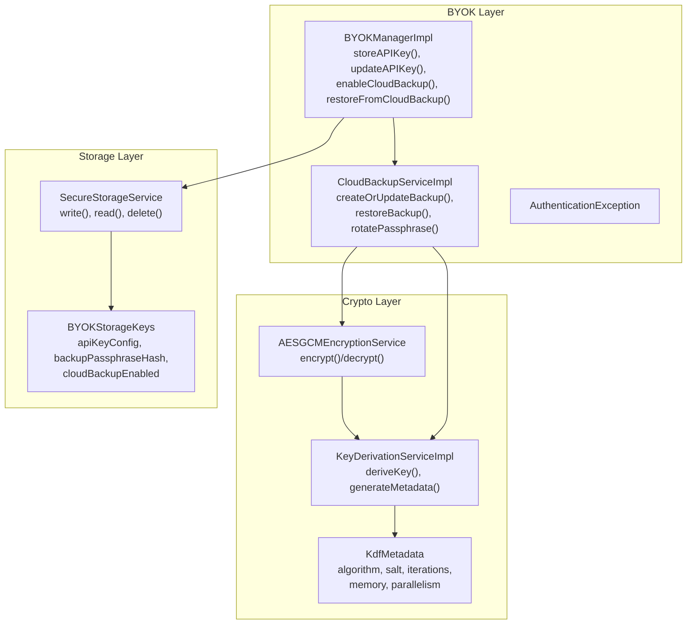
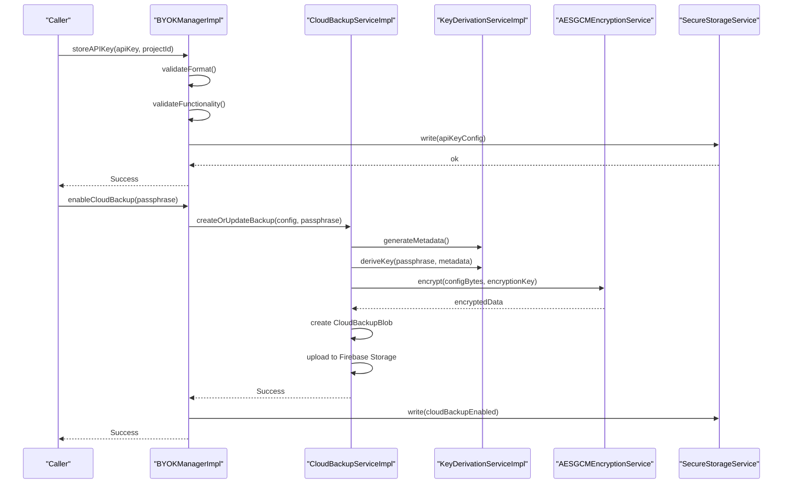
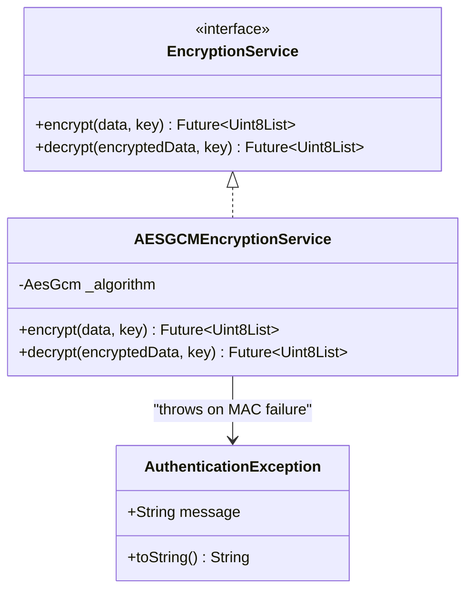
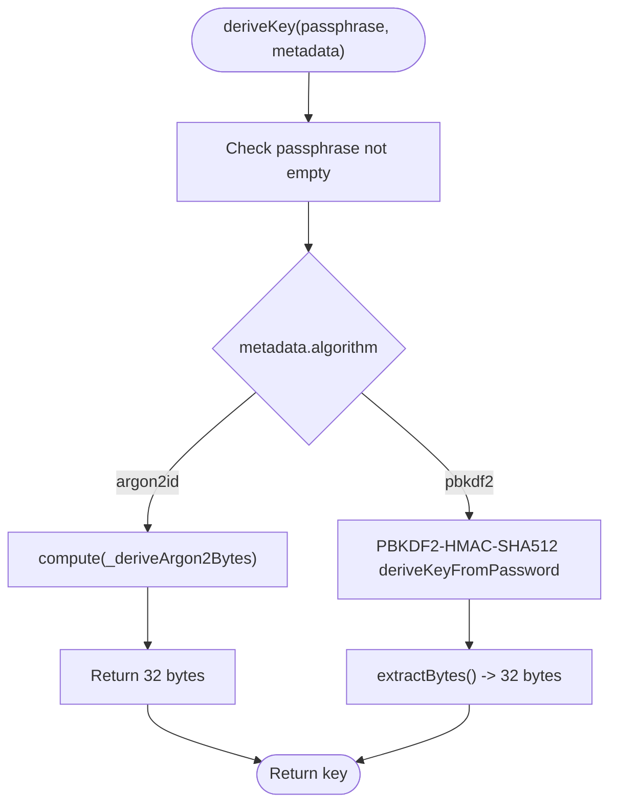
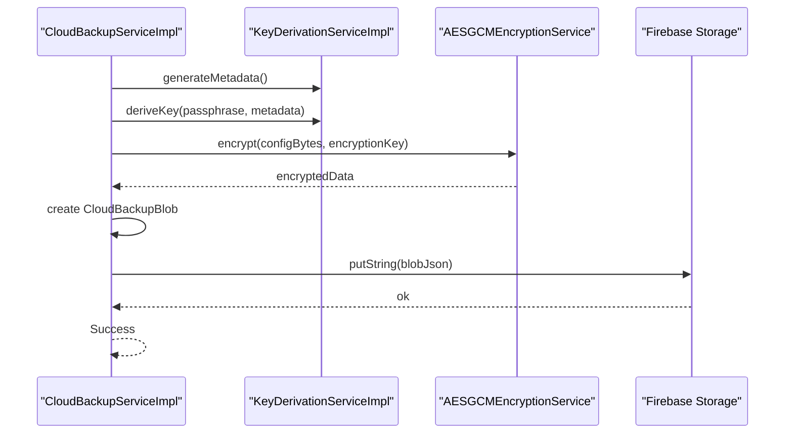
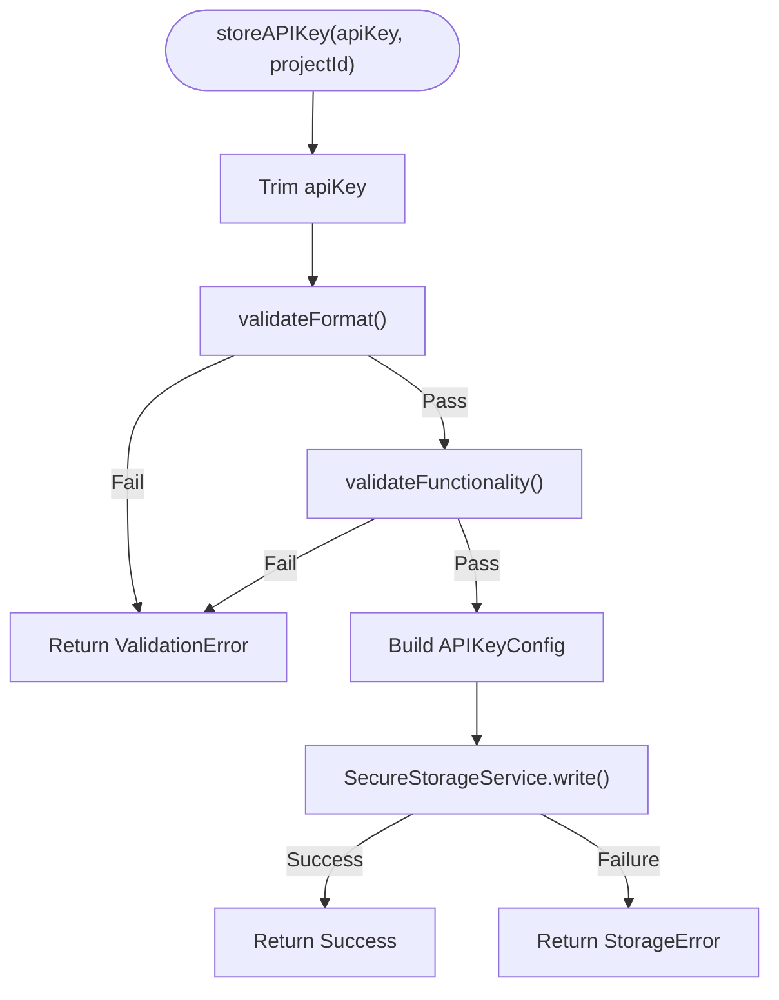
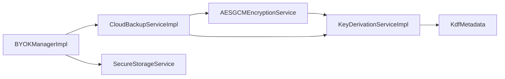

# Encryption Service

<cite>
**Referenced Files in This Document**
- [encryption_service.dart](file://lib/core/crypto/encryption_service.dart)
- [key_derivation_service.dart](file://lib/core/crypto/key_derivation_service.dart)
- [kdf_metadata.dart](file://lib/core/crypto/kdf_metadata.dart)
- [cloud_backup_service.dart](file://lib/core/byok/cloud_backup_service.dart)
- [byok_manager.dart](file://lib/core/byok/byok_manager.dart)
- [byok_error.dart](file://lib/core/byok/models/byok_error.dart)
- [cloud_backup_blob.dart](file://lib/core/byok/models/cloud_backup_blob.dart)
- [api_key_config.dart](file://lib/core/byok/models/api_key_config.dart)
- [secure_storage_service.dart](file://lib/core/storage/secure_storage_service.dart)
- [byok_storage_keys.dart](file://lib/core/byok/byok_storage_keys.dart)
- [encryption_service_test.dart](file://test/encryption_service_test.dart)
</cite>

## Table of Contents
1. [Introduction](#introduction)
2. [Project Structure](#project-structure)
3. [Core Components](#core-components)
4. [Architecture Overview](#architecture-overview)
5. [Detailed Component Analysis](#detailed-component-analysis)
6. [Dependency Analysis](#dependency-analysis)
7. [Performance Considerations](#performance-considerations)
8. [Troubleshooting Guide](#troubleshooting-guide)
9. [Security Considerations](#security-considerations)
10. [Practical Usage Examples](#practical-usage-examples)
11. [Conclusion](#conclusion)

## Introduction
This document provides comprehensive documentation for the Encryption Service implementation focused on AES-256-GCM authenticated encryption. It explains the encryption and decryption workflow, including key generation, nonce management, initialization vector handling, and authenticated encryption/decryption processes. It also covers the security benefits of GCM mode (confidentiality and integrity protection), the service interface and method signatures, parameter validation, error handling strategies, and practical examples for encrypting sensitive data such as API keys. Additionally, it addresses security considerations (nonce uniqueness, key rotation, side-channel attack prevention), performance characteristics, memory usage patterns, and optimization techniques for large data encryption.

## Project Structure
The encryption service is part of a broader secure key management system that includes key derivation, cloud backup orchestration, and secure storage. The relevant modules are organized under:
- lib/core/crypto: Cryptographic primitives and services
- lib/core/byok: Bring-Your-Own-Key (BYOK) management for API keys
- lib/core/storage: Secure storage abstraction
- test: Unit tests for encryption service

**Diagram sources**
- [encryption_service.dart](file://lib/core/crypto/encryption_service.dart#L22-L75)
- [key_derivation_service.dart](file://lib/core/crypto/key_derivation_service.dart#L17-L118)
- [kdf_metadata.dart](file://lib/core/crypto/kdf_metadata.dart#L9-L78)
- [cloud_backup_service.dart](file://lib/core/byok/cloud_backup_service.dart#L97-L119)
- [byok_manager.dart](file://lib/core/byok/byok_manager.dart#L153-L583)
- [secure_storage_service.dart](file://lib/core/storage/secure_storage_service.dart#L11-L29)
- [byok_storage_keys.dart](file://lib/core/byok/byok_storage_keys.dart#L5-L14)

**Section sources**
- [encryption_service.dart](file://lib/core/crypto/encryption_service.dart#L1-L75)
- [key_derivation_service.dart](file://lib/core/crypto/key_derivation_service.dart#L1-L118)
- [cloud_backup_service.dart](file://lib/core/byok/cloud_backup_service.dart#L1-L900)
- [byok_manager.dart](file://lib/core/byok/byok_manager.dart#L1-L583)
- [secure_storage_service.dart](file://lib/core/storage/secure_storage_service.dart#L1-L30)
- [byok_storage_keys.dart](file://lib/core/byok/byok_storage_keys.dart#L1-L15)

## Core Components
- AESGCMEncryptionService: Implements authenticated encryption and decryption using AES-256-GCM. It validates key length, manages nonce generation, and concatenates nonce, ciphertext, and MAC into a single byte array for transport.
- KeyDerivationServiceImpl: Derives 256-bit keys from passphrases using Argon2id on native platforms and PBKDF2-HMAC-SHA512 on web. It generates random salts and platform-aware parameters.
- CloudBackupServiceImpl: Orchestrates end-to-end cloud backup using the encryption service and key derivation service. It handles upload, download, restore, deletion, and passphrase rotation with robust error classification.
- BYOKManagerImpl: Manages API key lifecycle, including validation, secure storage, and cloud backup operations. It integrates with the encryption and key derivation services for secure operations.
- SecureStorageService: Abstraction for platform-native secure storage with read/write/delete operations and metadata about backend capabilities.

**Section sources**
- [encryption_service.dart](file://lib/core/crypto/encryption_service.dart#L14-L75)
- [key_derivation_service.dart](file://lib/core/crypto/key_derivation_service.dart#L9-L118)
- [cloud_backup_service.dart](file://lib/core/byok/cloud_backup_service.dart#L21-L91)
- [byok_manager.dart](file://lib/core/byok/byok_manager.dart#L84-L147)
- [secure_storage_service.dart](file://lib/core/storage/secure_storage_service.dart#L11-L29)

## Architecture Overview
The encryption service sits at the core of the BYOK system. It is consumed by the key derivation service to produce encryption keys from passphrases, and by the cloud backup service to encrypt and decrypt API key configurations for cloud storage. The BYOK manager coordinates validation, storage, and backup operations, while the secure storage service persists configuration and flags.

**Diagram sources**
- [byok_manager.dart](file://lib/core/byok/byok_manager.dart#L182-L231)
- [cloud_backup_service.dart](file://lib/core/byok/cloud_backup_service.dart#L167-L249)
- [key_derivation_service.dart](file://lib/core/crypto/key_derivation_service.dart#L35-L53)
- [encryption_service.dart](file://lib/core/crypto/encryption_service.dart#L22-L40)
- [secure_storage_service.dart](file://lib/core/storage/secure_storage_service.dart#L12-L19)

## Detailed Component Analysis

### AESGCMEncryptionService
- Purpose: Provides authenticated encryption and decryption using AES-256-GCM.
- Key Generation and Validation:
  - Validates that the provided key is exactly 32 bytes (256-bit).
  - Uses cryptography library’s AES-GCM with 256-bit keys.
- Nonce Management:
  - Defaults to a 12-byte (96-bit) random nonce generated by the underlying algorithm.
  - Concatenates nonce + ciphertext + MAC into a single byte array for transport.
- Initialization Vector Handling:
  - The 12-byte nonce serves as the IV for GCM mode.
- Authenticated Encryption/Decryption:
  - Encrypt: Constructs a SecretKey, encrypts plaintext, and returns concatenated bytes.
  - Decrypt: Parses concatenated bytes into nonce, ciphertext, and MAC; verifies authenticity; returns plaintext or throws AuthenticationException on MAC failure.
- Error Handling:
  - Throws ArgumentError for invalid key length or too-short ciphertext.
  - Wraps SecretBoxAuthenticationError into AuthenticationException with a descriptive message.

**Diagram sources**
- [encryption_service.dart](file://lib/core/crypto/encryption_service.dart#L14-L75)

**Section sources**
- [encryption_service.dart](file://lib/core/crypto/encryption_service.dart#L22-L75)

### KeyDerivationServiceImpl
- Purpose: Derives 32-byte encryption keys from user passphrases using platform-aware KDFs.
- Algorithms:
  - Argon2id on native platforms (Android, iOS, macOS) with configurable iterations, memory, and parallelism.
  - PBKDF2-HMAC-SHA512 on web with high iteration counts.
- Metadata:
  - KdfMetadata stores algorithm, salt, iterations, memory, and parallelism.
  - generateMetadata() creates a new random salt and selects parameters based on platform.
- Execution:
  - Uses compute() for Argon2id off the UI thread.
  - Returns 32-byte keys suitable for AES-256-GCM.

**Diagram sources**
- [key_derivation_service.dart](file://lib/core/crypto/key_derivation_service.dart#L22-L80)
- [kdf_metadata.dart](file://lib/core/crypto/kdf_metadata.dart#L9-L78)

**Section sources**
- [key_derivation_service.dart](file://lib/core/crypto/key_derivation_service.dart#L17-L118)
- [kdf_metadata.dart](file://lib/core/crypto/kdf_metadata.dart#L1-L78)

### CloudBackupServiceImpl
- Purpose: End-to-end cloud backup of API key configurations using client-side encryption.
- Workflow:
  - createOrUpdateBackup: Derive key, serialize config, encrypt, create CloudBackupBlob, upload.
  - restoreBackup: Download, parse blob, derive key, decrypt, parse config.
  - deleteBackup: Delete from storage with error classification.
  - backupExists: Check presence with error classification.
  - rotatePassphrase: Safe rotation using temporary backup and atomic-like steps.
- Error Classification:
  - Distinguishes network errors, storage errors, wrong passphrase, corrupted data, and not found scenarios.
- Security:
  - All data is encrypted client-side before upload.
  - Passphrase verification is performed before any destructive operations.

**Diagram sources**
- [cloud_backup_service.dart](file://lib/core/byok/cloud_backup_service.dart#L167-L249)
- [encryption_service.dart](file://lib/core/crypto/encryption_service.dart#L22-L40)
- [key_derivation_service.dart](file://lib/core/crypto/key_derivation_service.dart#L35-L53)

**Section sources**
- [cloud_backup_service.dart](file://lib/core/byok/cloud_backup_service.dart#L21-L91)
- [cloud_backup_service.dart](file://lib/core/byok/cloud_backup_service.dart#L167-L249)
- [cloud_backup_service.dart](file://lib/core/byok/cloud_backup_service.dart#L251-L317)
- [cloud_backup_service.dart](file://lib/core/byok/cloud_backup_service.dart#L413-L555)

### BYOKManagerImpl
- Purpose: Orchestrates API key lifecycle including validation, secure storage, and cloud backup.
- Operations:
  - storeAPIKey: Validate, normalize, create config, persist to secure storage.
  - getAPIKey: Retrieve and parse stored config.
  - deleteAPIKey: Remove local config and optionally cloud backup.
  - updateAPIKey: Validate and update, optionally re-encrypt cloud backup.
  - enableCloudBackup/disableCloudBackup: Toggle and manage cloud backup state.
  - restoreFromCloudBackup: Fetch, decrypt, and store restored config.
  - rotateBackupPassphrase: Delegates to CloudBackupService.
- Error Handling:
  - Uses a unified Result<T> pattern with BYOKError subclasses for precise error reporting.

**Diagram sources**
- [byok_manager.dart](file://lib/core/byok/byok_manager.dart#L182-L231)
- [secure_storage_service.dart](file://lib/core/storage/secure_storage_service.dart#L12-L19)

**Section sources**
- [byok_manager.dart](file://lib/core/byok/byok_manager.dart#L84-L147)
- [byok_manager.dart](file://lib/core/byok/byok_manager.dart#L182-L231)
- [byok_manager.dart](file://lib/core/byok/byok_manager.dart#L233-L256)
- [byok_manager.dart](file://lib/core/byok/byok_manager.dart#L258-L295)
- [byok_manager.dart](file://lib/core/byok/byok_manager.dart#L297-L384)
- [byok_manager.dart](file://lib/core/byok/byok_manager.dart#L386-L429)
- [byok_manager.dart](file://lib/core/byok/byok_manager.dart#L431-L466)
- [byok_manager.dart](file://lib/core/byok/byok_manager.dart#L468-L502)
- [byok_manager.dart](file://lib/core/byok/byok_manager.dart#L526-L541)

## Dependency Analysis
- Coupling:
  - CloudBackupServiceImpl depends on KeyDerivationServiceImpl and AESGCMEncryptionService.
  - BYOKManagerImpl depends on SecureStorageService, APIKeyValidator, and CloudBackupService.
- Cohesion:
  - Each service has a single responsibility: encryption, key derivation, cloud backup, or key lifecycle management.
- External Dependencies:
  - cryptography package for AES-GCM.
  - argon2 package for Argon2id.
  - firebase packages for cloud storage and auth.
- Error Propagation:
  - AuthenticationException is thrown by AESGCMEncryptionService and mapped to BackupErrorType.wrongPassphrase in CloudBackupServiceImpl.

**Diagram sources**
- [encryption_service.dart](file://lib/core/crypto/encryption_service.dart#L22-L75)
- [key_derivation_service.dart](file://lib/core/crypto/key_derivation_service.dart#L17-L118)
- [cloud_backup_service.dart](file://lib/core/byok/cloud_backup_service.dart#L97-L119)
- [byok_manager.dart](file://lib/core/byok/byok_manager.dart#L153-L181)
- [secure_storage_service.dart](file://lib/core/storage/secure_storage_service.dart#L11-L29)

**Section sources**
- [encryption_service.dart](file://lib/core/crypto/encryption_service.dart#L1-L75)
- [key_derivation_service.dart](file://lib/core/crypto/key_derivation_service.dart#L1-L118)
- [cloud_backup_service.dart](file://lib/core/byok/cloud_backup_service.dart#L1-L900)
- [byok_manager.dart](file://lib/core/byok/byok_manager.dart#L1-L583)
- [secure_storage_service.dart](file://lib/core/storage/secure_storage_service.dart#L1-L30)

## Performance Considerations
- AES-256-GCM:
  - Fast authenticated encryption with hardware acceleration on modern devices.
  - Nonce uniqueness ensures security without IV reuse overhead.
- Key Derivation:
  - Argon2id parameters are tuned for native platforms to balance security and responsiveness.
  - PBKDF2 parameters are higher on web to compensate for less hardware acceleration.
  - Offloads Argon2id computation to isolates using compute().
- Memory Usage:
  - Encryption and decryption operate on typed data buffers; intermediate buffers are short-lived.
  - Cloud backup serialization uses JSON strings and base64 encoding; consider streaming for very large configs.
- Optimization Techniques:
  - Reuse derived keys for multiple operations within a session.
  - Batch operations where feasible to reduce overhead.
  - Avoid unnecessary re-encryption by checking existing backup state before updates.

[No sources needed since this section provides general guidance]

## Troubleshooting Guide
Common issues and resolutions:
- AuthenticationException during decryption:
  - Indicates MAC verification failure, typically due to wrong key or tampered ciphertext.
  - In cloud backup, maps to BackupErrorType.wrongPassphrase.
- Wrong key or tampered data:
  - Unit tests demonstrate that wrong keys and tampered ciphertext trigger authentication failures.
- Insufficient ciphertext length:
  - Decrypt validates minimum length (nonce + MAC). Ensure the input includes nonce and MAC.
- Cloud backup errors:
  - Network errors are detected and classified separately from storage errors.
  - Not found and corrupted backups are handled distinctly.

**Section sources**
- [encryption_service_test.dart](file://test/encryption_service_test.dart#L34-L61)
- [cloud_backup_service.dart](file://lib/core/byok/cloud_backup_service.dart#L275-L287)
- [byok_error.dart](file://lib/core/byok/models/byok_error.dart#L67-L83)

## Security Considerations
- AES-256-GCM Security Benefits:
  - Confidentiality: AES-256 provides strong confidentiality.
  - Integrity Protection: GCM mode provides built-in MAC verification, preventing tampering.
- Nonce Uniqueness:
  - The service defaults to a random 12-byte nonce per encryption, ensuring uniqueness.
  - Unit tests confirm that encrypting the same plaintext twice produces different ciphertexts.
- Key Rotation:
  - CloudBackupServiceImpl supports passphrase rotation using a temporary backup and careful verification steps.
  - Preserves original creation timestamp when re-uploading to maintain audit trails.
- Side-Channel Attack Prevention:
  - Key derivation uses Argon2id and PBKDF2 with platform-appropriate parameters.
  - Offloads heavy computations to isolates to minimize timing leakage.
- Error Handling and Information Leakage:
  - AuthenticationException messages are sanitized to avoid leaking specifics about the failure cause.
  - BackupErrorType distinguishes wrong passphrase vs. corrupted vs. network errors.

**Section sources**
- [encryption_service.dart](file://lib/core/crypto/encryption_service.dart#L31-L39)
- [encryption_service_test.dart](file://test/encryption_service_test.dart#L25-L32)
- [cloud_backup_service.dart](file://lib/core/byok/cloud_backup_service.dart#L413-L555)
- [key_derivation_service.dart](file://lib/core/crypto/key_derivation_service.dart#L55-L80)

## Practical Usage Examples
Below are practical examples demonstrating how to use the encryption service and related components. Replace placeholders with your actual values.

- Encrypting and Decrypting Sensitive Data (API Keys):
  - Derive a 32-byte key from a passphrase using KeyDerivationServiceImpl.
  - Serialize the API key configuration to bytes.
  - Encrypt using AESGCMEncryptionService.
  - Store the encrypted bytes securely (e.g., in cloud backup).
  - To decrypt, derive the same key, fetch encrypted bytes, and decrypt.

- Handling Encryption Failures:
  - Catch AuthenticationException during decryption to detect MAC verification failures.
  - Classify errors using BackupErrorType for cloud operations.

- Managing Encryption Contexts:
  - Preserve KdfMetadata with the encrypted data to ensure future decryption compatibility.
  - Use CloudBackupBlob to encapsulate version, KDF metadata, encrypted data, and timestamps.

- Example Paths:
  - Encryption/decryption round-trip: [encryption_service_test.dart](file://test/encryption_service_test.dart#L15-L23)
  - Nonce uniqueness: [encryption_service_test.dart](file://test/encryption_service_test.dart#L25-L32)
  - Wrong key detection: [encryption_service_test.dart](file://test/encryption_service_test.dart#L34-L44)
  - Tampered data detection: [encryption_service_test.dart](file://test/encryption_service_test.dart#L46-L60)

**Section sources**
- [encryption_service_test.dart](file://test/encryption_service_test.dart#L1-L63)
- [cloud_backup_service.dart](file://lib/core/byok/cloud_backup_service.dart#L167-L249)
- [cloud_backup_blob.dart](file://lib/core/byok/models/cloud_backup_blob.dart#L8-L38)

## Conclusion
The Encryption Service implementation provides robust AES-256-GCM authenticated encryption integrated with platform-aware key derivation and secure cloud backup orchestration. It emphasizes correctness, security, and resilience through strict parameter validation, nonce uniqueness, MAC verification, and comprehensive error classification. The modular design enables efficient, secure handling of sensitive data such as API keys, with clear interfaces and well-defined workflows for encryption, decryption, and backup operations.