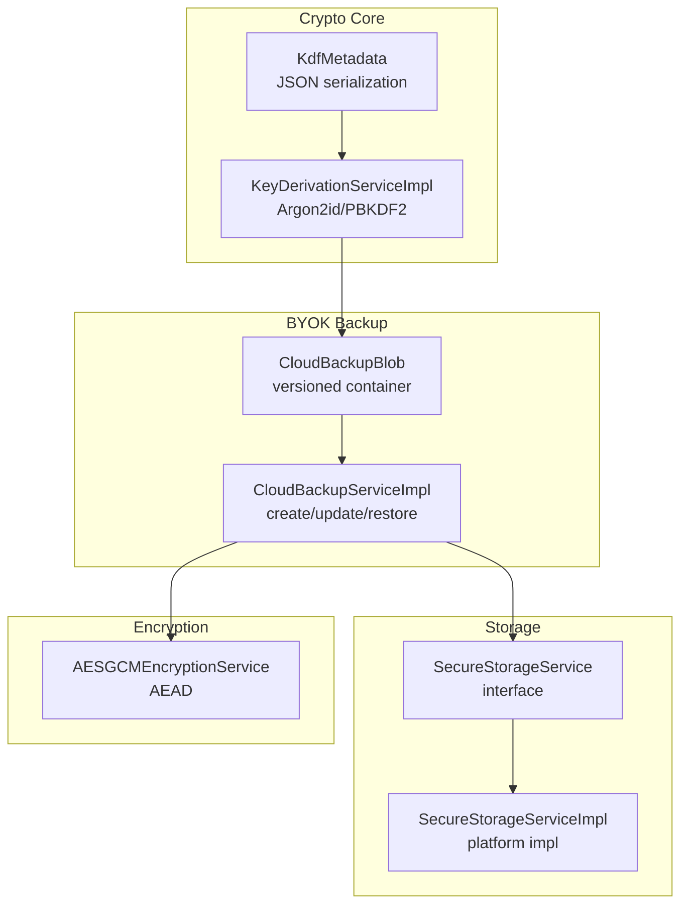
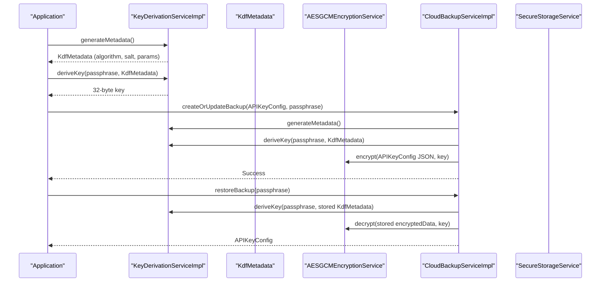
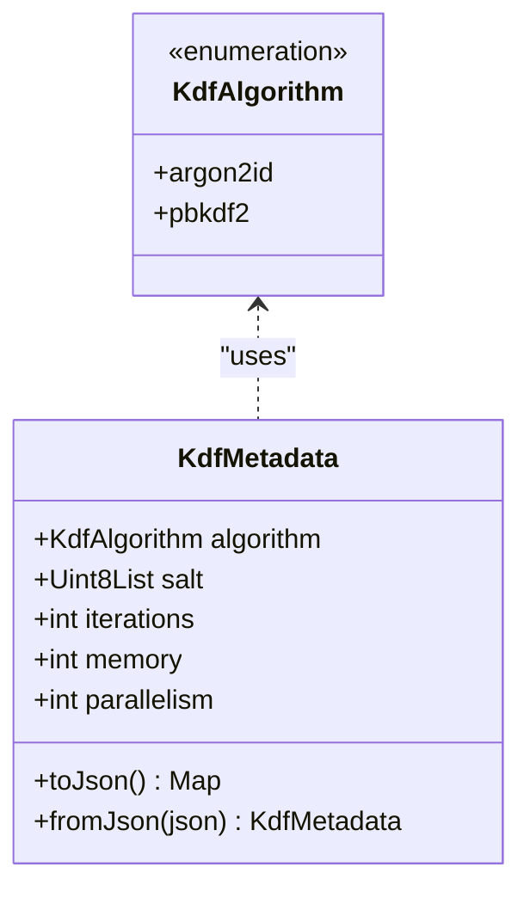
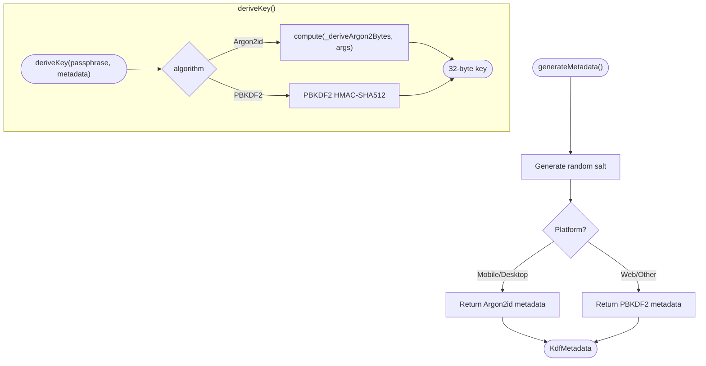
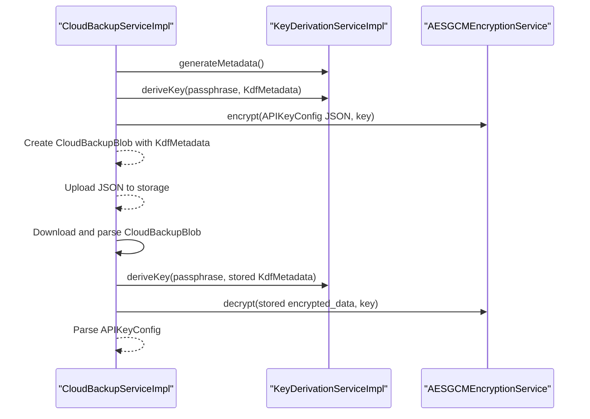
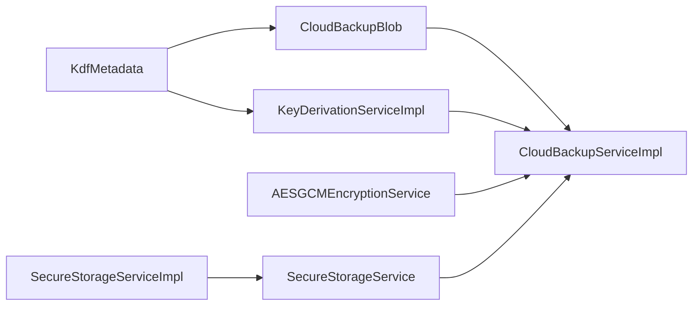

# KDF Metadata

<cite>
**Referenced Files in This Document**
- [kdf_metadata.dart](file://lib/core/crypto/kdf_metadata.dart)
- [key_derivation_service.dart](file://lib/core/crypto/key_derivation_service.dart)
- [cloud_backup_blob.dart](file://lib/core/byok/models/cloud_backup_blob.dart)
- [cloud_backup_service.dart](file://lib/core/byok/cloud_backup_service.dart)
- [secure_storage_service.dart](file://lib/core/storage/secure_storage_service.dart)
- [secure_storage_service_impl.dart](file://lib/core/storage/secure_storage_service_impl.dart)
- [encryption_service.dart](file://lib/core/crypto/encryption_service.dart)
- [kdf_metadata_test.dart](file://test/kdf_metadata_test.dart)
- [key_derivation_service_test.dart](file://test/key_derivation_service_test.dart)
</cite>

## Table of Contents
1. [Introduction](#introduction)
2. [Project Structure](#project-structure)
3. [Core Components](#core-components)
4. [Architecture Overview](#architecture-overview)
5. [Detailed Component Analysis](#detailed-component-analysis)
6. [Dependency Analysis](#dependency-analysis)
7. [Performance Considerations](#performance-considerations)
8. [Security Considerations](#security-considerations)
9. [Practical Examples](#practical-examples)
10. [Best Practices](#best-practices)
11. [Troubleshooting Guide](#troubleshooting-guide)
12. [Conclusion](#conclusion)

## Introduction
This document explains the KDF Metadata system used to track key derivation parameters and enable deterministic key regeneration across application sessions. It covers the metadata structure, serialization and persistence, parameter validation, versioning, and security considerations. It also documents how metadata integrates with cloud backup and local secure storage to support algorithm evolution, parameter migration, and robust recovery workflows.

## Project Structure
The KDF Metadata system spans several modules:
- Crypto core: KDF metadata model and key derivation service
- BYOK (Bring-Your-Own-Key) backup: Cloud backup blob and service that embeds KDF metadata
- Secure storage: Local persistence abstraction and platform-specific implementation
- Encryption: Authenticated encryption service used with derived keys

**Diagram sources**
- [kdf_metadata.dart](file://lib/core/crypto/kdf_metadata.dart#L1-L78)
- [key_derivation_service.dart](file://lib/core/crypto/key_derivation_service.dart#L1-L118)
- [cloud_backup_blob.dart](file://lib/core/byok/models/cloud_backup_blob.dart#L1-L157)
- [cloud_backup_service.dart](file://lib/core/byok/cloud_backup_service.dart#L1-L900)
- [secure_storage_service.dart](file://lib/core/storage/secure_storage_service.dart#L1-L30)
- [secure_storage_service_impl.dart](file://lib/core/storage/secure_storage_service_impl.dart#L1-L105)
- [encryption_service.dart](file://lib/core/crypto/encryption_service.dart#L1-L75)

**Section sources**
- [kdf_metadata.dart](file://lib/core/crypto/kdf_metadata.dart#L1-L78)
- [key_derivation_service.dart](file://lib/core/crypto/key_derivation_service.dart#L1-L118)
- [cloud_backup_blob.dart](file://lib/core/byok/models/cloud_backup_blob.dart#L1-L157)
- [cloud_backup_service.dart](file://lib/core/byok/cloud_backup_service.dart#L1-L900)
- [secure_storage_service.dart](file://lib/core/storage/secure_storage_service.dart#L1-L30)
- [secure_storage_service_impl.dart](file://lib/core/storage/secure_storage_service_impl.dart#L1-L105)
- [encryption_service.dart](file://lib/core/crypto/encryption_service.dart#L1-L75)

## Core Components
- KdfMetadata: Holds algorithm identifier, salt, iteration count, and algorithm-specific parameters (memory and parallelism). Provides JSON serialization/deserialization with strict validation.
- KeyDerivationServiceImpl: Generates fresh metadata with random salt and algorithm-specific parameters, and derives cryptographic keys deterministically from passphrases and metadata.
- CloudBackupBlob: Versioned container embedding KdfMetadata and encrypted data, plus timestamps.
- CloudBackupServiceImpl: Orchestrates backup creation, restoration, and passphrase rotation using KDF metadata to regenerate keys.
- SecureStorageService/SecureStorageServiceImpl: Abstraction and platform-specific implementation for secure local storage.
- AESGCMEncryptionService: AEAD encryption used to protect backed-up configurations.

**Section sources**
- [kdf_metadata.dart](file://lib/core/crypto/kdf_metadata.dart#L1-L78)
- [key_derivation_service.dart](file://lib/core/crypto/key_derivation_service.dart#L1-L118)
- [cloud_backup_blob.dart](file://lib/core/byok/models/cloud_backup_blob.dart#L1-L157)
- [cloud_backup_service.dart](file://lib/core/byok/cloud_backup_service.dart#L1-L900)
- [secure_storage_service.dart](file://lib/core/storage/secure_storage_service.dart#L1-L30)
- [secure_storage_service_impl.dart](file://lib/core/storage/secure_storage_service_impl.dart#L1-L105)
- [encryption_service.dart](file://lib/core/crypto/encryption_service.dart#L1-L75)

## Architecture Overview
KDF Metadata enables deterministic key regeneration by storing all derivation parameters alongside encrypted data. The flow below shows how metadata is generated, embedded in backups, and later used to recover keys.

**Diagram sources**
- [key_derivation_service.dart](file://lib/core/crypto/key_derivation_service.dart#L17-L86)
- [kdf_metadata.dart](file://lib/core/crypto/kdf_metadata.dart#L9-L77)
- [cloud_backup_service.dart](file://lib/core/byok/cloud_backup_service.dart#L167-L249)
- [cloud_backup_blob.dart](file://lib/core/byok/models/cloud_backup_blob.dart#L45-L118)
- [encryption_service.dart](file://lib/core/crypto/encryption_service.dart#L22-L74)

## Detailed Component Analysis

### KdfMetadata
- Purpose: Immutable record of derivation parameters required to regenerate a key from a passphrase.
- Fields:
  - algorithm: Enumerated KDF algorithm identifier
  - salt: Random salt bytes
  - iterations: Iteration count for PBKDF2 or Argon2 iterations
  - memory: Memory cost for Argon2 (KB)
  - parallelism: Parallelism/Lane count for Argon2
- Serialization:
  - toJson encodes algorithm name, base64-encoded salt, and integer parameters
  - fromJson validates presence and types of required fields and enforces non-negativity
- Validation:
  - Missing keys cause FormatException
  - Unknown algorithm names cause FormatException
  - Non-base64 salt causes FormatException
  - Non-integers or negative integers cause FormatException

**Diagram sources**
- [kdf_metadata.dart](file://lib/core/crypto/kdf_metadata.dart#L4-L22)

**Section sources**
- [kdf_metadata.dart](file://lib/core/crypto/kdf_metadata.dart#L1-L78)
- [kdf_metadata_test.dart](file://test/kdf_metadata_test.dart#L1-L315)

### KeyDerivationServiceImpl
- Generates fresh metadata with cryptographically secure random salt and algorithm-specific parameters.
- Selects Argon2id on mobile/desktop platforms and PBKDF2 on web/non-mobile platforms.
- Derives 32-byte keys deterministically from passphrases and metadata.
- Uses Isolate computation for Argon2id to avoid blocking the UI thread.

**Diagram sources**
- [key_derivation_service.dart](file://lib/core/crypto/key_derivation_service.dart#L35-L86)

**Section sources**
- [key_derivation_service.dart](file://lib/core/crypto/key_derivation_service.dart#L1-L118)
- [key_derivation_service_test.dart](file://test/key_derivation_service_test.dart#L1-L77)

### CloudBackupBlob and CloudBackupServiceImpl
- CloudBackupBlob wraps KdfMetadata and encrypted data with versioning and timestamps.
- CloudBackupServiceImpl uses KdfMetadata to regenerate keys for backup creation, restoration, and passphrase rotation.
- Supports atomic-like rotation using a temporary backup path and verification steps.

**Diagram sources**
- [cloud_backup_blob.dart](file://lib/core/byok/models/cloud_backup_blob.dart#L45-L118)
- [cloud_backup_service.dart](file://lib/core/byok/cloud_backup_service.dart#L167-L317)

**Section sources**
- [cloud_backup_blob.dart](file://lib/core/byok/models/cloud_backup_blob.dart#L1-L157)
- [cloud_backup_service.dart](file://lib/core/byok/cloud_backup_service.dart#L1-L900)

### Secure Storage Integration
- SecureStorageService abstracts platform differences and provides read/write/delete operations.
- SecureStorageServiceImpl selects hardware-backed storage on Android/iOS and falls back to software storage on other platforms.
- Used by higher-level services to persist configuration and flags (e.g., cloud backup enabled).

**Section sources**
- [secure_storage_service.dart](file://lib/core/storage/secure_storage_service.dart#L1-L30)
- [secure_storage_service_impl.dart](file://lib/core/storage/secure_storage_service_impl.dart#L1-L105)

### Encryption Service
- AESGCMEncryptionService provides authenticated encryption with 256-bit keys.
- Exposes AuthenticationException on MAC verification failure, enabling clear error signaling for wrong passphrases.

**Section sources**
- [encryption_service.dart](file://lib/core/crypto/encryption_service.dart#L1-L75)

## Dependency Analysis
- KdfMetadata is consumed by:
  - KeyDerivationServiceImpl for deterministic key derivation
  - CloudBackupBlob for embedding in backups
  - CloudBackupServiceImpl for restoring and rotating passphrases
- CloudBackupServiceImpl depends on:
  - KeyDerivationService to regenerate keys
  - EncryptionService to encrypt/decrypt
  - SecureStorageService for local flags and potentially local caching
- SecureStorageServiceImpl adapts to platform capabilities for secure persistence.

**Diagram sources**
- [kdf_metadata.dart](file://lib/core/crypto/kdf_metadata.dart#L1-L78)
- [key_derivation_service.dart](file://lib/core/crypto/key_derivation_service.dart#L1-L118)
- [cloud_backup_blob.dart](file://lib/core/byok/models/cloud_backup_blob.dart#L1-L157)
- [cloud_backup_service.dart](file://lib/core/byok/cloud_backup_service.dart#L1-L900)
- [secure_storage_service.dart](file://lib/core/storage/secure_storage_service.dart#L1-L30)
- [secure_storage_service_impl.dart](file://lib/core/storage/secure_storage_service_impl.dart#L1-L105)
- [encryption_service.dart](file://lib/core/crypto/encryption_service.dart#L1-L75)

**Section sources**
- [kdf_metadata.dart](file://lib/core/crypto/kdf_metadata.dart#L1-L78)
- [key_derivation_service.dart](file://lib/core/crypto/key_derivation_service.dart#L1-L118)
- [cloud_backup_blob.dart](file://lib/core/byok/models/cloud_backup_blob.dart#L1-L157)
- [cloud_backup_service.dart](file://lib/core/byok/cloud_backup_service.dart#L1-L900)
- [secure_storage_service.dart](file://lib/core/storage/secure_storage_service.dart#L1-L30)
- [secure_storage_service_impl.dart](file://lib/core/storage/secure_storage_service_impl.dart#L1-L105)
- [encryption_service.dart](file://lib/core/crypto/encryption_service.dart#L1-L75)

## Performance Considerations
- Argon2id parameters:
  - Iterations, memory, and parallelism are tuned per platform to balance security and responsiveness
  - Computation is offloaded to an isolate to prevent UI blocking
- PBKDF2:
  - Higher iteration count is used on non-mobile platforms to achieve comparable work factors
- Encryption:
  - AES-256-GCM is efficient and provides integrity; ensure keys are 32 bytes as enforced

[No sources needed since this section provides general guidance]

## Security Considerations
- Metadata tampering detection:
  - CloudBackupBlob enforces version bounds and rejects unsupported versions
  - KdfMetadata validation rejects malformed or maliciously crafted inputs
- Parameter integrity verification:
  - Strict integer validation prevents negative or non-integer parameters
  - Base64 decoding of salt is validated to avoid corruption
- Secure metadata storage:
  - Local flags and sensitive data are persisted via SecureStorageService
  - Hardware-backed storage is preferred on Android/iOS when available
- Authentication failures:
  - AESGCM decryption raises AuthenticationException on MAC failure, indicating wrong passphrase or corruption

**Section sources**
- [cloud_backup_blob.dart](file://lib/core/byok/models/cloud_backup_blob.dart#L62-L118)
- [kdf_metadata.dart](file://lib/core/crypto/kdf_metadata.dart#L34-L77)
- [secure_storage_service_impl.dart](file://lib/core/storage/secure_storage_service_impl.dart#L33-L73)
- [encryption_service.dart](file://lib/core/crypto/encryption_service.dart#L6-L12)

## Practical Examples
- Creating metadata during key derivation:
  - Call generateMetadata to obtain algorithm, salt, and parameters
  - Use deriveKey to obtain a 32-byte key for encryption
  - Reference: [generateMetadata](file://lib/core/crypto/key_derivation_service.dart#L35-L53), [deriveKey](file://lib/core/crypto/key_derivation_service.dart#L22-L33)
- Parameter validation for key regeneration:
  - Deserialize KdfMetadata from stored JSON and validate fields
  - Use fromJson to ensure required keys, valid algorithm, and non-negative integers
  - Reference: [KdfMetadata.fromJson](file://lib/core/crypto/kdf_metadata.dart#L34-L77), [tests](file://test/kdf_metadata_test.dart#L1-L315)
- Metadata versioning for backward compatibility:
  - CloudBackupBlob supports versioned blobs and rejects unsupported versions
  - Reference: [CloudBackupBlob version checks](file://lib/core/byok/models/cloud_backup_blob.dart#L70-L84)
- Persisting and retrieving metadata-backed configurations:
  - Store JSON-serialized configuration and flags via SecureStorageService
  - Reference: [SecureStorageService interface](file://lib/core/storage/secure_storage_service.dart#L10-L29), [implementation](file://lib/core/storage/secure_storage_service_impl.dart#L33-L73)

**Section sources**
- [key_derivation_service.dart](file://lib/core/crypto/key_derivation_service.dart#L35-L53)
- [kdf_metadata.dart](file://lib/core/crypto/kdf_metadata.dart#L34-L77)
- [cloud_backup_blob.dart](file://lib/core/byok/models/cloud_backup_blob.dart#L70-L84)
- [secure_storage_service.dart](file://lib/core/storage/secure_storage_service.dart#L10-L29)
- [secure_storage_service_impl.dart](file://lib/core/storage/secure_storage_service_impl.dart#L33-L73)
- [kdf_metadata_test.dart](file://test/kdf_metadata_test.dart#L1-L315)

## Best Practices
- Parameter updates and migration:
  - When changing algorithms or parameters, generate new metadata and re-encrypt backups atomically
  - Preserve createdAt timestamps when updating existing backups to maintain provenance
  - Use temporary paths during rotation and verify before finalizing
  - Reference: [rotation workflow](file://lib/core/byok/cloud_backup_service.dart#L413-L555)
- Lifecycle management:
  - Always validate KdfMetadata before attempting key regeneration
  - Treat salt as critical and never reuse across contexts
  - Ensure keys are 32 bytes for AES-256-GCM
- Error handling:
  - Distinguish wrong passphrase (MAC failure) from corrupted data
  - Log and propagate network-related errors distinctly
- Platform-aware defaults:
  - Prefer Argon2id on mobile/desktop; PBKDF2 on web with higher iteration counts

**Section sources**
- [cloud_backup_service.dart](file://lib/core/byok/cloud_backup_service.dart#L413-L555)
- [encryption_service.dart](file://lib/core/crypto/encryption_service.dart#L26-L51)
- [key_derivation_service.dart](file://lib/core/crypto/key_derivation_service.dart#L38-L52)

## Troubleshooting Guide
- Missing or invalid KDF metadata:
  - Symptoms: FormatException during deserialization
  - Actions: Regenerate metadata and re-derive key; verify JSON structure and base64 encoding
  - References: [KdfMetadata.fromJson](file://lib/core/crypto/kdf_metadata.dart#L34-L77), [tests](file://test/kdf_metadata_test.dart#L43-L122)
- Wrong passphrase during restore:
  - Symptoms: AuthenticationException on decryption
  - Actions: Prompt user to re-enter passphrase; confirm backup exists and is not corrupted
  - References: [AuthenticationException](file://lib/core/crypto/encryption_service.dart#L6-L12), [restore flow](file://lib/core/byok/cloud_backup_service.dart#L251-L317)
- Unsupported backup version:
  - Symptoms: FormatException indicating unsupported version
  - Actions: Update application to a compatible version; do not downgrade
  - References: [version validation](file://lib/core/byok/models/cloud_backup_blob.dart#L70-L84)
- Network errors during cloud operations:
  - Symptoms: Network error types propagated as BackupErrorType.networkError
  - Actions: Retry with exponential backoff; verify Firebase credentials and permissions
  - References: [network checks](file://lib/core/byok/cloud_backup_service.dart#L139-L164)

**Section sources**
- [kdf_metadata.dart](file://lib/core/crypto/kdf_metadata.dart#L34-L77)
- [kdf_metadata_test.dart](file://test/kdf_metadata_test.dart#L43-L122)
- [encryption_service.dart](file://lib/core/crypto/encryption_service.dart#L6-L12)
- [cloud_backup_service.dart](file://lib/core/byok/cloud_backup_service.dart#L139-L164)
- [cloud_backup_blob.dart](file://lib/core/byok/models/cloud_backup_blob.dart#L70-L84)

## Conclusion
The KDF Metadata system provides a robust foundation for deterministic key regeneration, cross-session recovery, and algorithm evolution. By embedding validated parameters with encrypted payloads and enforcing strict versioning and validation, the system supports secure, portable backups and resilient migration workflows. Adhering to the best practices and troubleshooting guidance ensures reliable operation across platforms and scenarios.