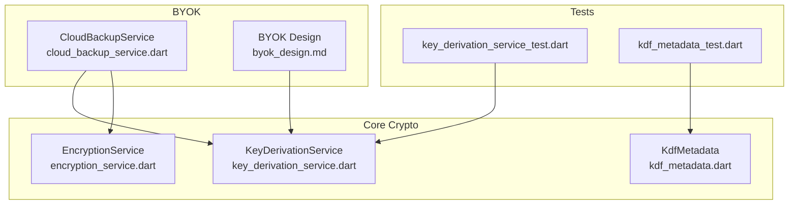
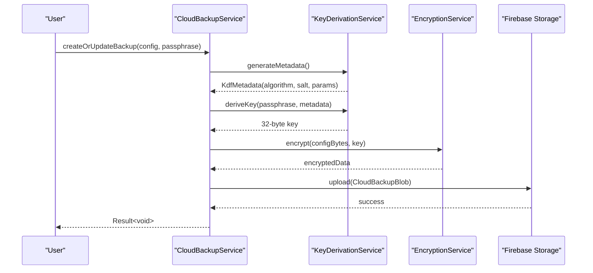
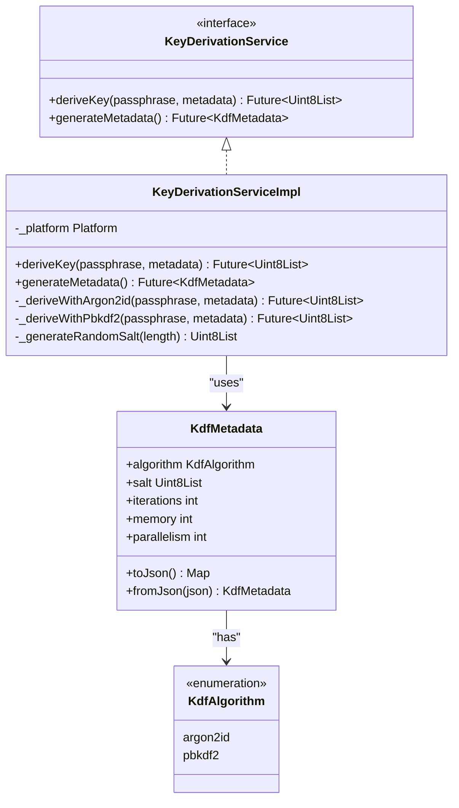
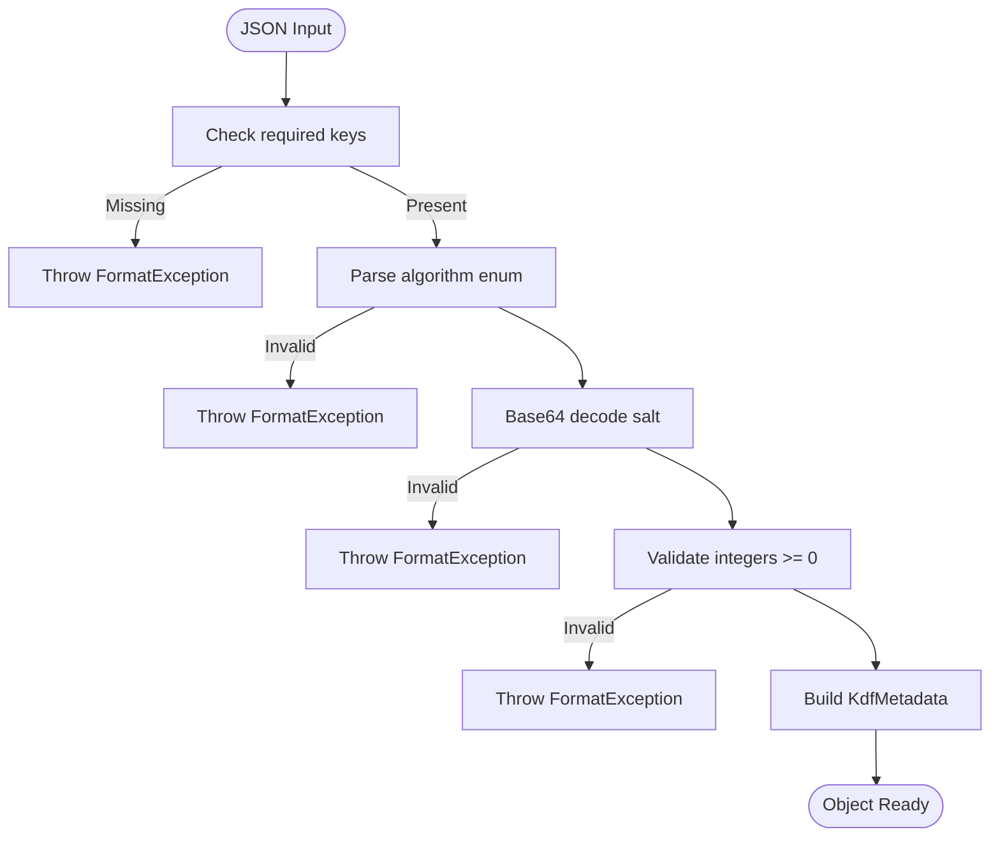
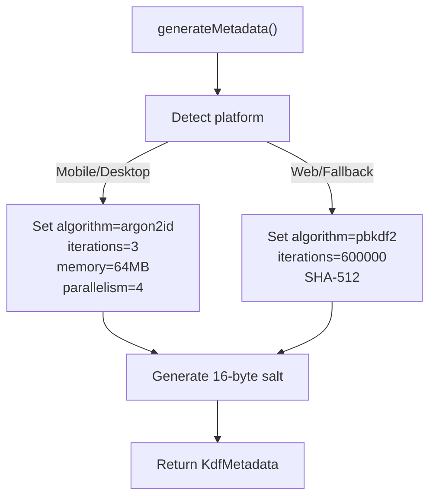
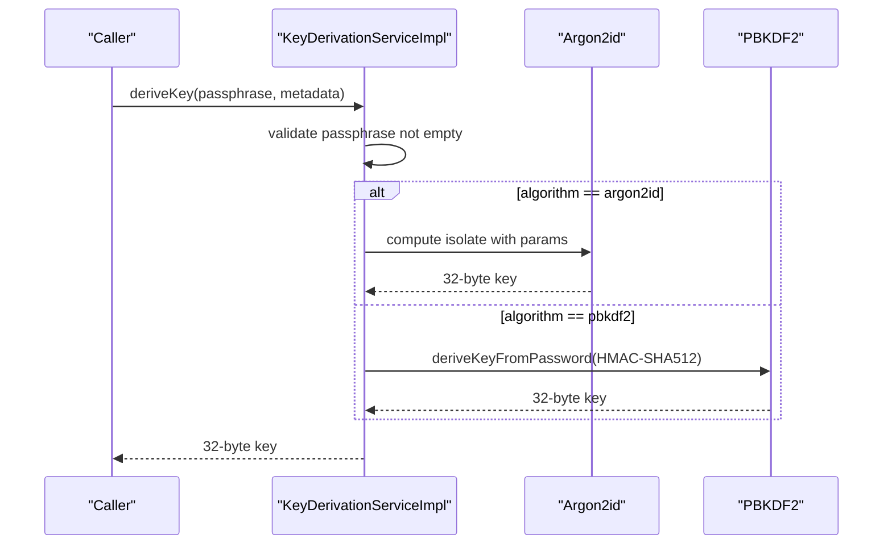
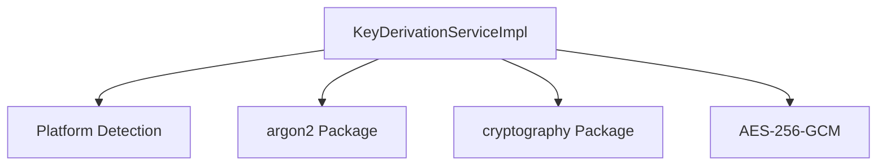
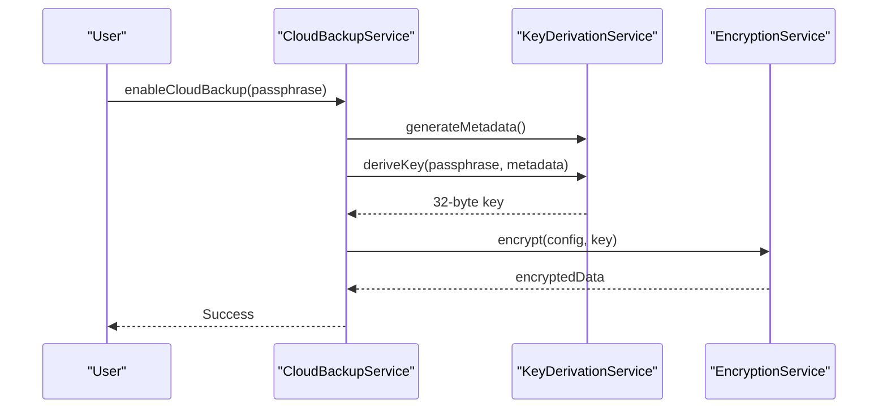
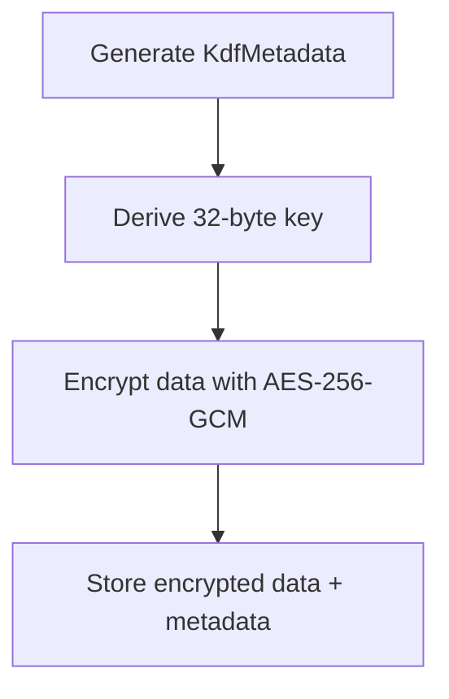

# Key Derivation Service

<cite>
**Referenced Files in This Document**
- [key_derivation_service.dart](file://lib/core/crypto/key_derivation_service.dart)
- [kdf_metadata.dart](file://lib/core/crypto/kdf_metadata.dart)
- [encryption_service.dart](file://lib/core/crypto/encryption_service.dart)
- [cloud_backup_service.dart](file://lib/core/byok/cloud_backup_service.dart)
- [byok_design.md](file://lib/core/byok/byok_design.md)
- [key_derivation_service_test.dart](file://test/key_derivation_service_test.dart)
- [kdf_metadata_test.dart](file://test/kdf_metadata_test.dart)
</cite>

## Table of Contents
1. [Introduction](#introduction)
2. [Project Structure](#project-structure)
3. [Core Components](#core-components)
4. [Architecture Overview](#architecture-overview)
5. [Detailed Component Analysis](#detailed-component-analysis)
6. [Dependency Analysis](#dependency-analysis)
7. [Performance Considerations](#performance-considerations)
8. [Security Considerations](#security-considerations)
9. [Practical Examples](#practical-examples)
10. [Troubleshooting Guide](#troubleshooting-guide)
11. [Best Practices](#best-practices)
12. [Conclusion](#conclusion)

## Introduction
This document describes the Key Derivation Service (KDS) that provides password-based key derivation for the StyleSync application. It supports two algorithms:
- Argon2id: a modern, memory-hard KDF suitable for desktop/mobile environments
- PBKDF2: a widely supported KDF with SHA-512 HMAC, used as a fallback for web or unsupported platforms

The service generates secure random salts, selects algorithm parameters based on platform capabilities, and produces 32-byte derived keys suitable for AES-256-GCM encryption. It integrates with the BYOK (Bring Your Own Key) system to protect user API keys with passphrase-based encryption and optional cloud backup.

## Project Structure
The KDS resides in the core crypto module and is consumed by the BYOK subsystem for secure key storage and cloud backup operations.

**Diagram sources**
- [key_derivation_service.dart](file://lib/core/crypto/key_derivation_service.dart#L9-L15)
- [kdf_metadata.dart](file://lib/core/crypto/kdf_metadata.dart#L9-L22)
- [encryption_service.dart](file://lib/core/crypto/encryption_service.dart#L14-L20)
- [cloud_backup_service.dart](file://lib/core/byok/cloud_backup_service.dart#L21-L40)
- [byok_design.md](file://lib/core/byok/byok_design.md#L17-L19)

**Section sources**
- [key_derivation_service.dart](file://lib/core/crypto/key_derivation_service.dart#L1-L118)
- [kdf_metadata.dart](file://lib/core/crypto/kdf_metadata.dart#L1-L78)
- [cloud_backup_service.dart](file://lib/core/byok/cloud_backup_service.dart#L1-L120)
- [byok_design.md](file://lib/core/byok/byok_design.md#L17-L19)

## Core Components
- KeyDerivationService: abstract interface for deriving keys from passphrases and metadata.
- KeyDerivationServiceImpl: concrete implementation supporting Argon2id and PBKDF2.
- KdfMetadata: serializable container for algorithm, salt, and parameters.
- EncryptionService: AES-256-GCM encryption/decryption used with derived keys.

Key responsibilities:
- Select algorithm based on platform capabilities
- Generate secure random salts
- Validate and serialize KDF metadata
- Derive 32-byte keys for encryption

**Section sources**
- [key_derivation_service.dart](file://lib/core/crypto/key_derivation_service.dart#L9-L15)
- [kdf_metadata.dart](file://lib/core/crypto/kdf_metadata.dart#L9-L22)
- [encryption_service.dart](file://lib/core/crypto/encryption_service.dart#L14-L20)

## Architecture Overview
The KDS participates in the BYOK workflow by deriving encryption keys from user passphrases. CloudBackupService orchestrates the end-to-end process: generate KDF metadata, derive key, encrypt configuration, and upload to cloud storage.

**Diagram sources**
- [cloud_backup_service.dart](file://lib/core/byok/cloud_backup_service.dart#L167-L249)
- [key_derivation_service.dart](file://lib/core/crypto/key_derivation_service.dart#L22-L80)
- [encryption_service.dart](file://lib/core/crypto/encryption_service.dart#L26-L40)

## Detailed Component Analysis

### KeyDerivationService and KeyDerivationServiceImpl
Implements password-based key derivation with platform-aware defaults:
- Argon2id parameters on mobile/desktop: iterations, memory, parallelism
- PBKDF2 parameters on web/fallback: SHA-512 HMAC, high iteration count
- Salt generation using cryptographically secure RNG
- Isolation of Argon2 computation in a compute isolate for responsiveness

**Diagram sources**
- [key_derivation_service.dart](file://lib/core/crypto/key_derivation_service.dart#L9-L86)
- [kdf_metadata.dart](file://lib/core/crypto/kdf_metadata.dart#L4-L22)

**Section sources**
- [key_derivation_service.dart](file://lib/core/crypto/key_derivation_service.dart#L17-L86)
- [kdf_metadata.dart](file://lib/core/crypto/kdf_metadata.dart#L9-L78)

### KdfMetadata Serialization and Validation
KdfMetadata supports robust JSON serialization/deserialization with strict validation:
- Required fields: algorithm, salt, iterations
- Algorithm name must match enum values
- Salt must be valid base64
- Integer fields validated for type and non-negativity
- Defaults for optional Argon2 parameters when absent

**Diagram sources**
- [kdf_metadata.dart](file://lib/core/crypto/kdf_metadata.dart#L34-L76)

**Section sources**
- [kdf_metadata.dart](file://lib/core/crypto/kdf_metadata.dart#L24-L76)

### Algorithm Selection and Parameterization
Platform-aware defaults:
- Mobile/Desktop: Argon2id with moderate memory and iterations
- Web/Fallback: PBKDF2 with high iteration count and SHA-512 HMAC

Selection logic:
- Uses platform detection to choose algorithm
- Generates a 16-byte random salt for each new metadata

**Diagram sources**
- [key_derivation_service.dart](file://lib/core/crypto/key_derivation_service.dart#L36-L53)

**Section sources**
- [key_derivation_service.dart](file://lib/core/crypto/key_derivation_service.dart#L36-L53)

### Key Derivation Workflow
End-to-end derivation process:
- Input: passphrase, KdfMetadata
- Validation: reject empty passphrase
- Dispatch: Argon2id or PBKDF2 based on metadata
- Output: 32-byte derived key

**Diagram sources**
- [key_derivation_service.dart](file://lib/core/crypto/key_derivation_service.dart#L22-L80)

**Section sources**
- [key_derivation_service.dart](file://lib/core/crypto/key_derivation_service.dart#L22-L80)

## Dependency Analysis
The KDS depends on:
- Platform detection for algorithm selection
- Argon2 library for Argon2id
- cryptography package for PBKDF2/HMAC-SHA512
- Typed data utilities for binary operations

Integration points:
- CloudBackupService consumes KDS to derive keys for AES-256-GCM encryption
- BYOK design documents describe the end-to-end workflow

**Diagram sources**
- [key_derivation_service.dart](file://lib/core/crypto/key_derivation_service.dart#L1-L7)
- [cloud_backup_service.dart](file://lib/core/byok/cloud_backup_service.dart#L9-L11)

**Section sources**
- [key_derivation_service.dart](file://lib/core/crypto/key_derivation_service.dart#L1-L7)
- [cloud_backup_service.dart](file://lib/core/byok/cloud_backup_service.dart#L9-L11)

## Performance Considerations
- Argon2id parameters on mobile/desktop are tuned for interactive responsiveness while maintaining strong security:
  - Iterations: low to moderate
  - Memory: moderate (64 MB)
  - Parallelism: balanced
- PBKDF2 parameters on web/fallback use a high iteration count to offset lack of memory hardness:
  - Iterations: high (600,000)
  - HMAC: SHA-512
- Computation isolation:
  - Argon2id derivation runs in a compute isolate to avoid blocking the UI thread

Recommendations:
- Adjust iterations/memory/parallelism based on device capability and user tolerance for key derivation latency
- Consider adaptive parameters that scale with device performance
- Monitor derivation time and provide user feedback for long-running operations

[No sources needed since this section provides general guidance]

## Security Considerations
- Side-channel resistance:
  - PBKDF2 uses HMAC-SHA512 which is generally considered side-channel resilient
  - Argon2id is designed to be memory-hard, reducing GPU/ASIC advantages
- Timing attacks:
  - Avoid early exits on wrong passphrase; derive keys consistently for timing-invariant behavior
  - Ensure constant-time comparisons for derived keys and authentication tags
- Entropy requirements:
  - Use sufficiently long passphrases (at least 12 characters, preferably 16+)
  - Prefer mixed-case letters, digits, and special characters
- Salt usage:
  - Salts are randomly generated for each metadata instance
  - Prevent rainbow table attacks and ensure uniqueness per derivation
- Key size:
  - Derived keys are 32 bytes, suitable for AES-256-GCM
- Algorithm migration:
  - KdfMetadata preserves algorithm and parameters for future migrations
  - Maintain backward compatibility by supporting older parameter sets

**Section sources**
- [key_derivation_service.dart](file://lib/core/crypto/key_derivation_service.dart#L22-L80)
- [kdf_metadata.dart](file://lib/core/crypto/kdf_metadata.dart#L24-L76)
- [encryption_service.dart](file://lib/core/crypto/encryption_service.dart#L26-L73)

## Practical Examples

### Example 1: Secure API Key Protection
- Use CloudBackupService to derive a key from a user passphrase
- Encrypt the API key configuration with AES-256-GCM
- Store the encrypted blob with KdfMetadata in cloud storage

**Diagram sources**
- [cloud_backup_service.dart](file://lib/core/byok/cloud_backup_service.dart#L387-L429)
- [key_derivation_service.dart](file://lib/core/crypto/key_derivation_service.dart#L36-L80)
- [encryption_service.dart](file://lib/core/crypto/encryption_service.dart#L26-L40)

### Example 2: Passphrase-Based Encryption Setup
- Generate KdfMetadata with a fresh salt
- Derive a 32-byte key for AES-256-GCM
- Encrypt sensitive data and store with metadata

**Diagram sources**
- [key_derivation_service.dart](file://lib/core/crypto/key_derivation_service.dart#L36-L80)
- [encryption_service.dart](file://lib/core/crypto/encryption_service.dart#L26-L40)

### Example 3: Parameter Tuning for Different Performance Requirements
- Desktop/mobile: prefer Argon2id with moderate memory and iterations
- Web/fallback: use PBKDF2 with higher iterations to compensate for lack of memory hardness
- Adjust parameters based on measured derivation time and user feedback

**Section sources**
- [key_derivation_service.dart](file://lib/core/crypto/key_derivation_service.dart#L36-L53)

## Troubleshooting Guide
Common issues and resolutions:
- Empty passphrase: the service rejects empty passphrases; ensure user provides a non-empty passphrase
- Invalid KDF metadata: ensure algorithm, salt, and integer fields are valid and non-negative
- Wrong passphrase during restore: decryption will fail with authentication errors; verify passphrase correctness
- Platform-specific algorithm support: on unsupported platforms, PBKDF2 is used as a fallback

Validation and error handling:
- KdfMetadata.fromJson validates presence and types of required fields
- Throws FormatException for missing or invalid fields
- CloudBackupService catches authentication failures and maps them to appropriate error types

**Section sources**
- [key_derivation_service.dart](file://lib/core/crypto/key_derivation_service.dart#L24-L26)
- [kdf_metadata_test.dart](file://test/kdf_metadata_test.dart#L43-L121)
- [cloud_backup_service.dart](file://lib/core/byok/cloud_backup_service.dart#L275-L287)

## Best Practices
- Parameter selection:
  - Choose iterations/memory/parallelism based on target device performance and acceptable derivation time
  - Use Argon2id on platforms where it is supported; otherwise use PBKDF2 with high iterations
- Key size optimization:
  - Use 32-byte derived keys for AES-256-GCM encryption
  - Ensure keys are handled as binary data and not exposed as strings
- Algorithm migration:
  - Store KdfMetadata with each encrypted blob to support future algorithm upgrades
  - Maintain backward compatibility by supporting older parameter sets
- Security hygiene:
  - Enforce strong passphrase policies
  - Use fresh salts for each metadata instance
  - Protect derived keys in memory and clear them after use
  - Consider adding a key confirmation step for critical operations

**Section sources**
- [kdf_metadata.dart](file://lib/core/crypto/kdf_metadata.dart#L24-L76)
- [byok_design.md](file://lib/core/byok/byok_design.md#L17-L19)

## Conclusion
The Key Derivation Service provides a robust, platform-aware foundation for password-based key derivation in StyleSync. By combining Argon2id and PBKDF2 with secure salt generation and strict metadata validation, it enables secure API key protection and cloud backup workflows. Proper parameter tuning, adherence to security best practices, and careful handling of derived keys ensure strong protection against common threats while maintaining usability across diverse deployment targets.