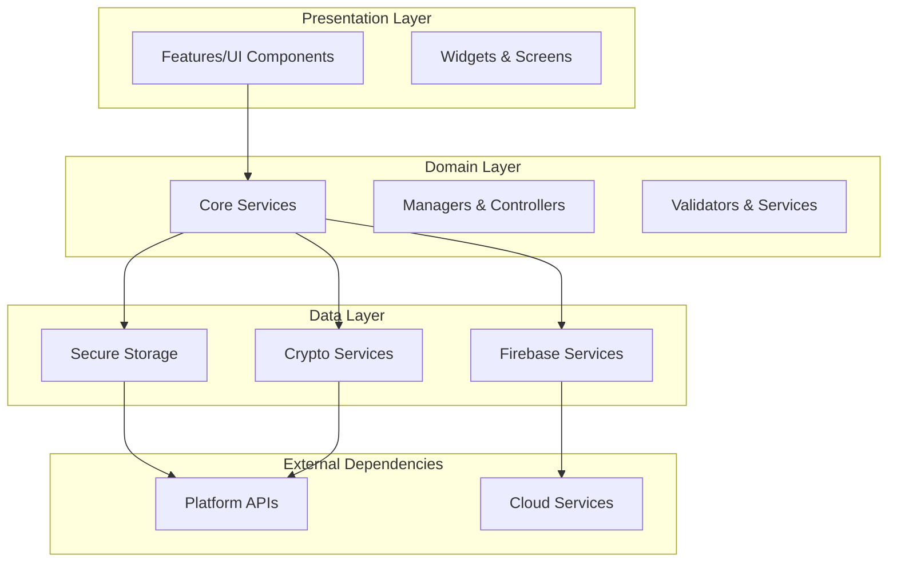
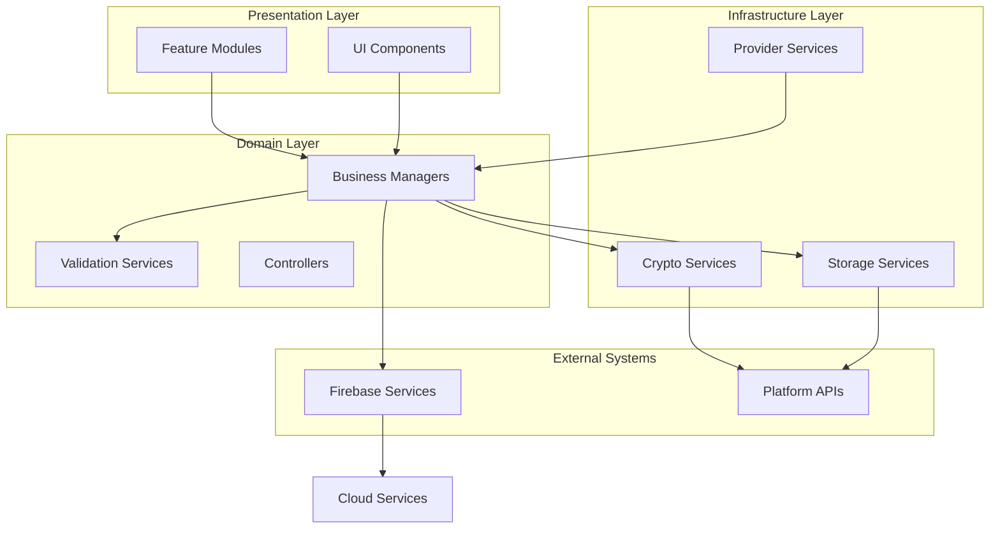
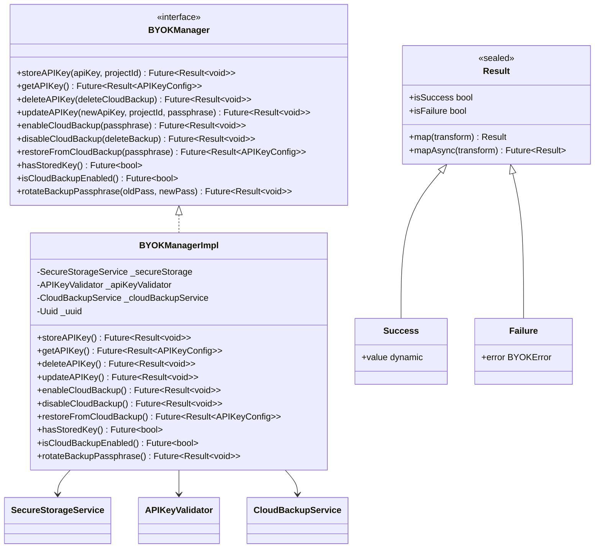
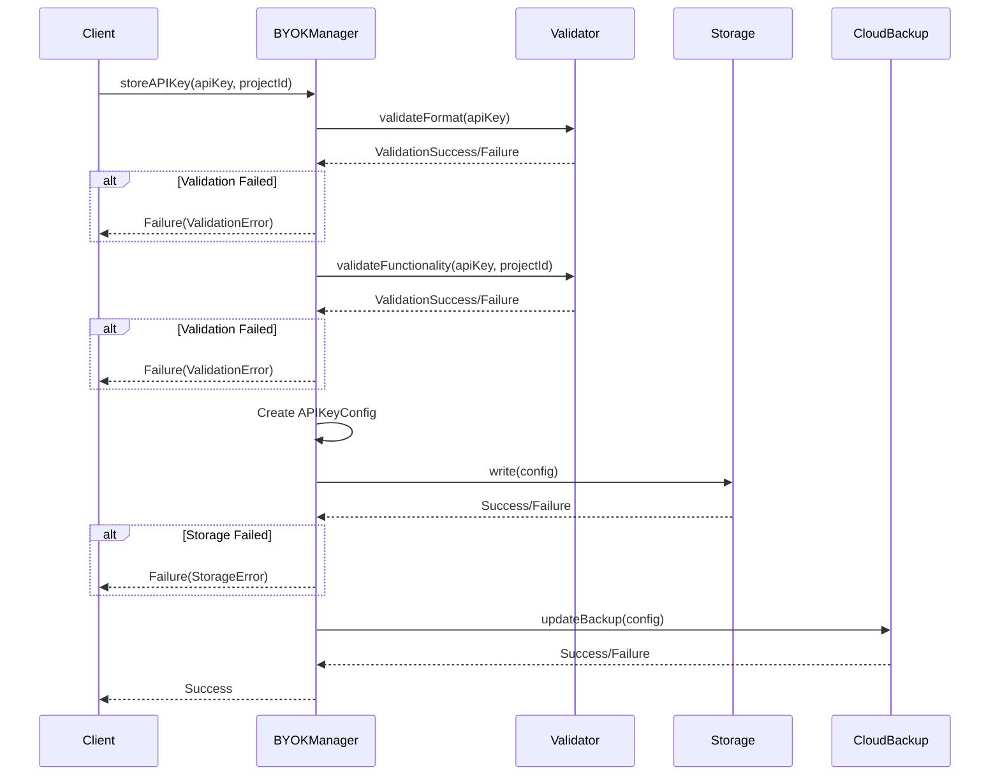
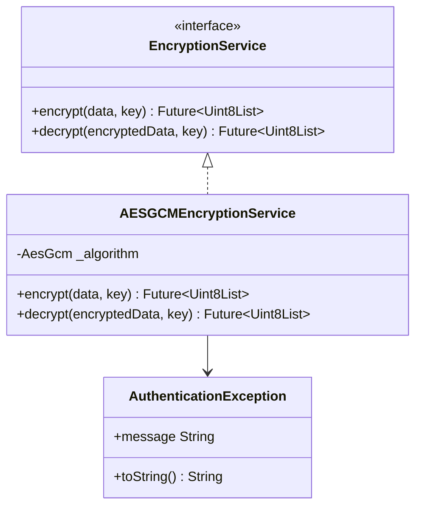
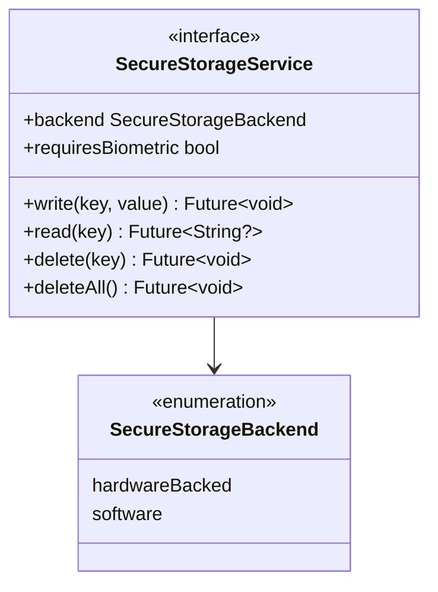
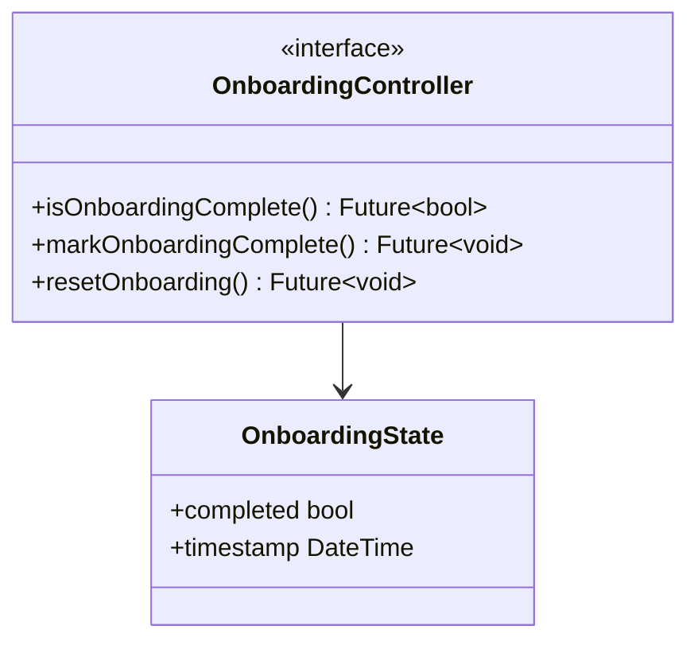
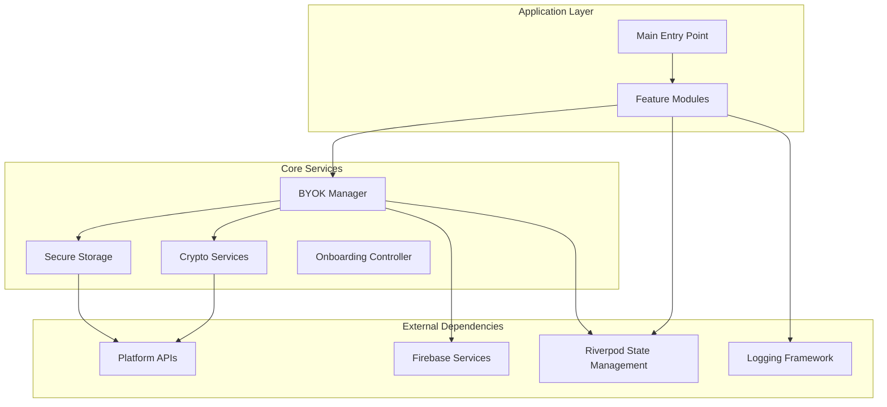

# Digital Closet Repository

<cite>
**Referenced Files in This Document**
- [README.md](file://README.md)
- [pubspec.yaml](file://pubspec.yaml)
- [lib/main.dart](file://lib/main.dart)
- [lib/core/byok/byok_manager.dart](file://lib/core/byok/byok_manager.dart)
- [lib/core/crypto/encryption_service.dart](file://lib/core/crypto/encryption_service.dart)
- [lib/core/storage/secure_storage_service.dart](file://lib/core/storage/secure_storage_service.dart)
- [lib/core/onboarding/onboarding_controller.dart](file://lib/core/onboarding/onboarding_controller.dart)
- [docs/project/overview.md](file://docs/project/overview.md)
- [docs/architecture/overview.md](file://docs/architecture/overview.md)
- [docs/core-services/byok-manager.md](file://docs/core-services/byok-manager.md)
</cite>

## Table of Contents
1. [Introduction](#introduction)
2. [Project Structure](#project-structure)
3. [Core Components](#core-components)
4. [Architecture Overview](#architecture-overview)
5. [Detailed Component Analysis](#detailed-component-analysis)
6. [Dependency Analysis](#dependency-analysis)
7. [Performance Considerations](#performance-considerations)
8. [Troubleshooting Guide](#troubleshooting-guide)
9. [Conclusion](#conclusion)

## Introduction
Digital Closet is a Flutter application designed to help users manage their Vertex AI API keys securely. The project emphasizes security-first design with platform-native secure storage, client-side encryption, and comprehensive testing. It supports multiple platforms including Android, iOS, Web, macOS, Linux, and Windows.

The application provides:
- Secure API key management with validation and storage
- Encrypted cloud backup with user-controlled passphrases
- Strong cryptographic foundations using AES-256-GCM and Argon2id/PBKDF2
- Cross-platform compatibility with consistent security guarantees
- Comprehensive testing strategy including property-based testing

## Project Structure
The project follows a clean architecture approach with clear separation between presentation, domain, and data layers:

**Diagram sources**
- [docs/architecture/overview.md](file://docs/architecture/overview.md#L8-L33)
- [lib/core/byok/byok_manager.dart](file://lib/core/byok/byok_manager.dart#L84-L147)

**Section sources**
- [docs/project/overview.md](file://docs/project/overview.md#L78-L96)
- [docs/architecture/overview.md](file://docs/architecture/overview.md#L81-L96)

## Core Components
The application is built around several core components that handle different aspects of API key management and security:

### BYOK Manager
The BYOK (Bring Your Own Key) Manager orchestrates the complete lifecycle of API key management including validation, storage, and cloud backup operations. It provides a comprehensive interface for storing, retrieving, updating, and deleting API keys with robust error handling and security measures.

### Secure Storage Service
Provides platform-native secure storage abstraction across different platforms (Android KeyStore, iOS Keychain, etc.). The service offers encrypted storage with hardware-backed security when available.

### Encryption Service
Implements AES-256-GCM encryption for client-side data protection. The service handles authenticated encryption with nonce management and provides robust error handling for decryption failures.

### Onboarding Controller
Manages the user onboarding experience including completion tracking, state persistence, and navigation flow. Ensures users complete necessary setup steps before accessing core functionality.

**Section sources**
- [lib/core/byok/byok_manager.dart](file://lib/core/byok/byok_manager.dart#L84-L147)
- [lib/core/storage/secure_storage_service.dart](file://lib/core/storage/secure_storage_service.dart#L10-L29)
- [lib/core/crypto/encryption_service.dart](file://lib/core/crypto/encryption_service.dart#L14-L20)
- [lib/core/onboarding/onboarding_controller.dart](file://lib/core/onboarding/onboarding_controller.dart#L17-L46)

## Architecture Overview
Digital Closet follows a clean architecture pattern with clear separation of concerns and strong emphasis on testability and security:

**Diagram sources**
- [docs/architecture/overview.md](file://docs/architecture/overview.md#L34-L96)
- [docs/architecture/overview.md](file://docs/architecture/overview.md#L100-L132)

The architecture implements Riverpod for dependency injection and state management, providing reactive updates and clean separation between UI and business logic.

**Section sources**
- [docs/architecture/overview.md](file://docs/architecture/overview.md#L3-L284)

## Detailed Component Analysis

### BYOK Manager Implementation
The BYOK Manager serves as the central coordinator for API key lifecycle management with comprehensive validation and error handling:

**Diagram sources**
- [lib/core/byok/byok_manager.dart](file://lib/core/byok/byok_manager.dart#L84-L147)
- [lib/core/byok/byok_manager.dart](file://lib/core/byok/byok_manager.dart#L153-L181)

The implementation follows a comprehensive validation pipeline that ensures API key integrity before storage:

**Diagram sources**
- [lib/core/byok/byok_manager.dart](file://lib/core/byok/byok_manager.dart#L182-L231)
- [lib/core/byok/byok_manager.dart](file://lib/core/byok/byok_manager.dart#L500-L543)

**Section sources**
- [lib/core/byok/byok_manager.dart](file://lib/core/byok/byok_manager.dart#L1-L583)

### Encryption Service Architecture
The encryption service implements industry-standard AES-256-GCM encryption with proper authenticated encryption:

**Diagram sources**
- [lib/core/crypto/encryption_service.dart](file://lib/core/crypto/encryption_service.dart#L14-L20)
- [lib/core/crypto/encryption_service.dart](file://lib/core/crypto/encryption_service.dart#L22-L74)

The encryption service provides:
- AES-256-GCM authenticated encryption
- Automatic nonce generation (12-byte)
- MAC verification for integrity
- Proper error handling for authentication failures

**Section sources**
- [lib/core/crypto/encryption_service.dart](file://lib/core/crypto/encryption_service.dart#L1-L75)

### Secure Storage Service Design
The secure storage service provides a unified interface for platform-native storage mechanisms:

**Diagram sources**
- [lib/core/storage/secure_storage_service.dart](file://lib/core/storage/secure_storage_service.dart#L10-L29)

The service abstracts platform differences while maintaining security guarantees:
- Hardware-backed storage when available (StrongBox/Secure Enclave)
- Software fallback for unsupported platforms
- Biometric authentication support
- Atomic write operations

**Section sources**
- [lib/core/storage/secure_storage_service.dart](file://lib/core/storage/secure_storage_service.dart#L1-L30)

### Onboarding Controller Implementation
The onboarding controller manages user onboarding state and persistence:

**Diagram sources**
- [lib/core/onboarding/onboarding_controller.dart](file://lib/core/onboarding/onboarding_controller.dart#L17-L46)

**Section sources**
- [lib/core/onboarding/onboarding_controller.dart](file://lib/core/onboarding/onboarding_controller.dart#L1-L47)

## Dependency Analysis
The project maintains clean dependency relationships with clear separation between layers:

**Diagram sources**
- [pubspec.yaml](file://pubspec.yaml#L30-L52)
- [docs/architecture/overview.md](file://docs/architecture/overview.md#L80-L96)

**Section sources**
- [pubspec.yaml](file://pubspec.yaml#L30-L66)
- [docs/architecture/overview.md](file://docs/architecture/overview.md#L80-L96)

## Performance Considerations
The application implements several performance optimization strategies:

### Lazy Initialization
Services are created on-demand through Riverpod providers to minimize startup overhead and memory usage.

### Compute Isolation
Heavy cryptographic operations are isolated to prevent blocking the main UI thread, ensuring smooth user experience.

### Caching Strategies
Provider caching reduces redundant computations and network calls, particularly beneficial for frequently accessed data like API key configurations.

### Batch Operations
Where applicable, storage operations are batched to reduce I/O overhead and improve throughput.

### Platform-Specific Optimizations
- Android: Gradle parallel builds and build caching
- iOS: Hardware acceleration for cryptographic operations
- Web: PBKDF2 fallback for key derivation to maintain performance

## Troubleshooting Guide

### Common Issues and Solutions

**API Key Validation Failures**
- Format validation errors typically indicate incorrect key structure
- Functional validation failures may be due to network issues or invalid project configuration
- Rate limiting responses require retry with exponential backoff

**Storage Operation Failures**
- Platform storage failures often relate to device security settings
- Biometric authentication prompts may need user interaction
- Insufficient storage space requires user intervention

**Cloud Backup Issues**
- Network connectivity problems require stable internet connection
- Passphrase mismatches cause decryption failures
- Firebase quota limits may require retry after cooldown period

**Cryptographic Errors**
- Authentication failures indicate wrong passphrase or corrupted data
- Key length errors suggest improper key derivation
- Platform-specific cipher limitations require fallback algorithms

### Debugging Strategies
- Enable structured logging for comprehensive error tracking
- Monitor cryptographic operation timing for performance issues
- Implement retry mechanisms with exponential backoff for transient failures
- Use property-based testing to validate edge cases and error conditions

**Section sources**
- [docs/architecture/overview.md](file://docs/architecture/overview.md#L250-L263)

## Conclusion
Digital Closet represents a comprehensive solution for secure API key management with strong emphasis on security, testability, and cross-platform compatibility. The clean architecture approach ensures maintainability while the security-first design provides robust protection for sensitive data.

Key strengths include:
- Comprehensive security implementation with platform-native storage
- Robust validation and error handling mechanisms
- Cross-platform compatibility with consistent security guarantees
- Extensive testing strategy including property-based testing
- Clean separation of concerns with clear architectural boundaries

The modular design allows for easy extension and maintenance, while the comprehensive documentation provides clear guidance for developers and users alike. The application serves as an excellent foundation for secure credential management in Flutter applications.