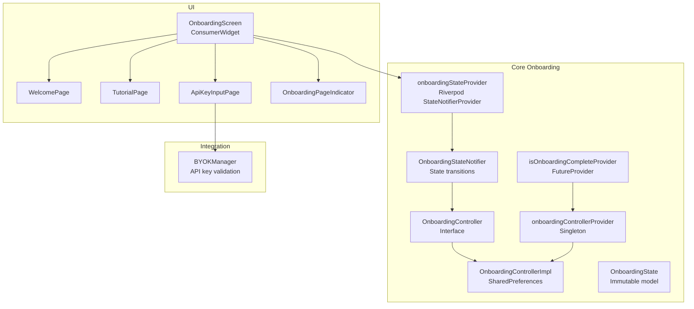
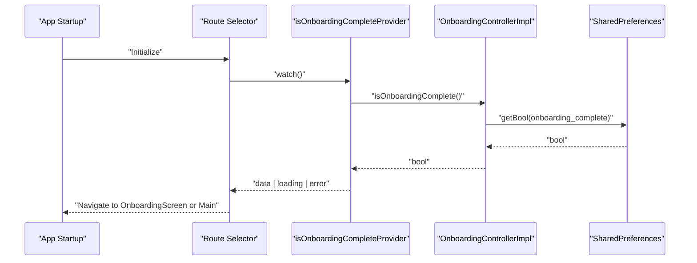
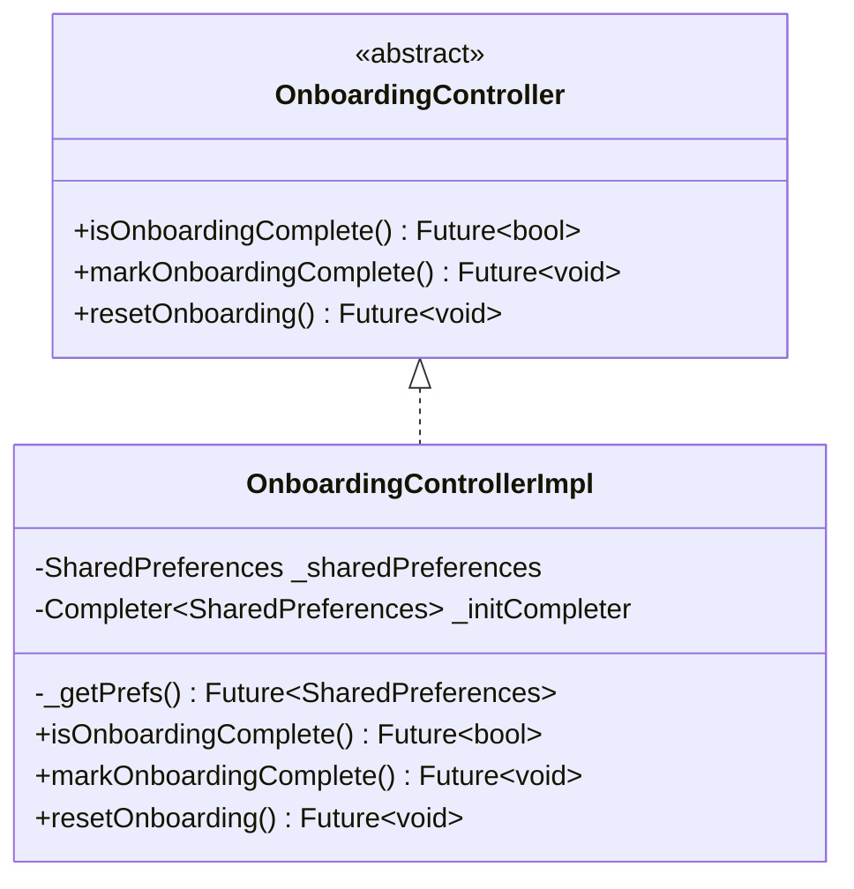
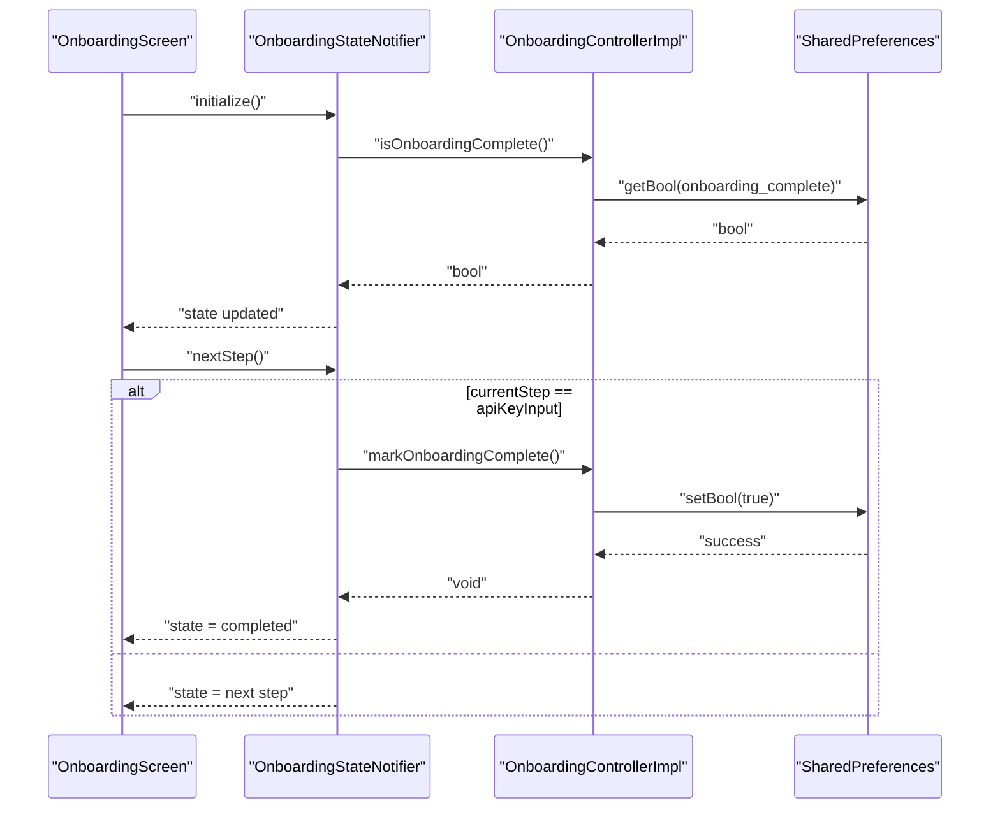
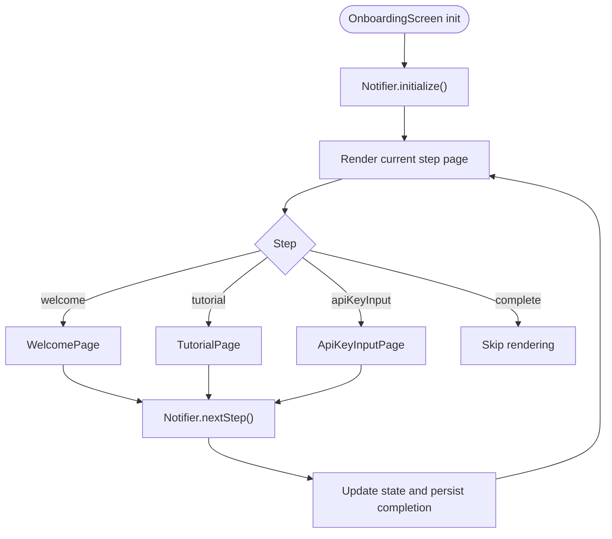
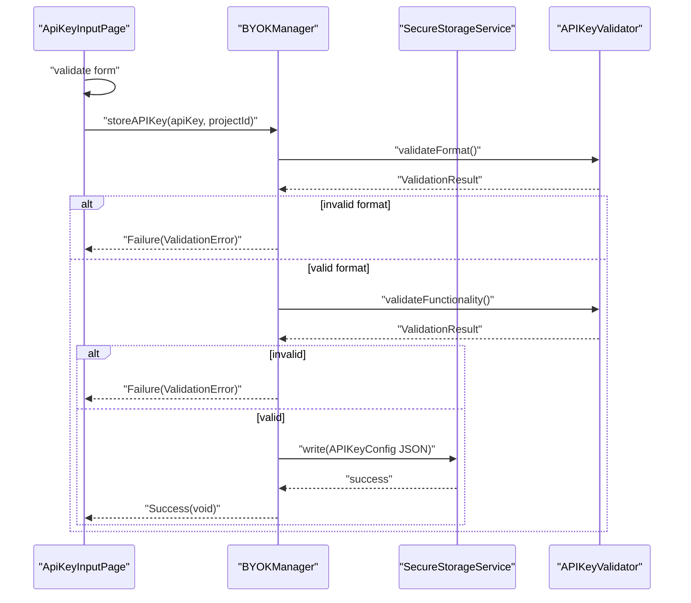
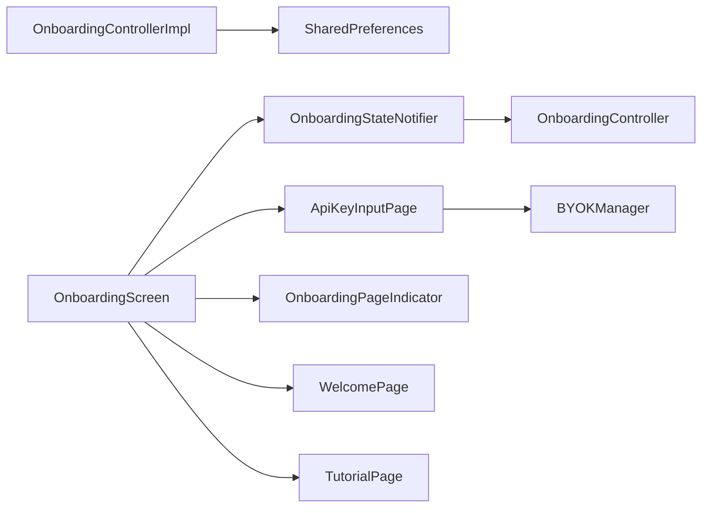

# Onboarding Controller

<cite>
**Referenced Files in This Document**
- [onboarding_controller.dart](file://lib/core/onboarding/onboarding_controller.dart)
- [onboarding_controller_impl.dart](file://lib/core/onboarding/onboarding_controller_impl.dart)
- [onboarding_state.dart](file://lib/core/onboarding/models/onboarding_state.dart)
- [onboarding_providers.dart](file://lib/core/onboarding/onboarding_providers.dart)
- [onboarding_screen.dart](file://lib/features/onboarding/onboarding_screen.dart)
- [welcome_page.dart](file://lib/features/onboarding/widgets/welcome_page.dart)
- [tutorial_page.dart](file://lib/features/onboarding/widgets/tutorial_page.dart)
- [api_key_input_page.dart](file://lib/features/onboarding/widgets/api_key_input_page.dart)
- [onboarding_page_indicator.dart](file://lib/features/onboarding/widgets/onboarding_page_indicator.dart)
- [byok_manager.dart](file://lib/core/byok/byok_manager.dart)
- [onboarding_persistence_property_test.dart](file://test/core/onboarding/onboarding_persistence_property_test.dart)
- [main.dart](file://lib/main.dart)
</cite>

## Table of Contents
1. [Introduction](#introduction)
2. [Project Structure](#project-structure)
3. [Core Components](#core-components)
4. [Architecture Overview](#architecture-overview)
5. [Detailed Component Analysis](#detailed-component-analysis)
6. [Dependency Analysis](#dependency-analysis)
7. [Performance Considerations](#performance-considerations)
8. [Troubleshooting Guide](#troubleshooting-guide)
9. [Conclusion](#conclusion)

## Introduction
This document explains the Onboarding Controller implementation using Riverpod for reactive state management. It covers the onboarding flow orchestration (welcome screen, tutorial pages, API key input, and completion tracking), the OnboardingController interface and its implementation, the OnboardingState model, provider patterns, and integration with the main application navigation. It also documents persistence mechanisms, error handling, user experience considerations, and edge cases such as partial completion, state restoration, and multi-device synchronization.

## Project Structure
The onboarding feature is organized into core state management and UI components:
- Core state and persistence: onboarding controller, state model, and Riverpod providers
- UI screens and widgets: onboarding screen, page indicator, and step-specific pages
- Integration: BYOK manager for API key validation and secure storage



**Diagram sources**
- [onboarding_controller.dart](file://lib/core/onboarding/onboarding_controller.dart#L17-L46)
- [onboarding_controller_impl.dart](file://lib/core/onboarding/onboarding_controller_impl.dart#L16-L78)
- [onboarding_providers.dart](file://lib/core/onboarding/onboarding_providers.dart#L18-L175)
- [onboarding_state.dart](file://lib/core/onboarding/models/onboarding_state.dart#L23-L74)
- [onboarding_screen.dart](file://lib/features/onboarding/onboarding_screen.dart#L15-L121)
- [welcome_page.dart](file://lib/features/onboarding/widgets/welcome_page.dart#L7-L187)
- [tutorial_page.dart](file://lib/features/onboarding/widgets/tutorial_page.dart#L11-L511)
- [api_key_input_page.dart](file://lib/features/onboarding/widgets/api_key_input_page.dart#L12-L554)
- [onboarding_page_indicator.dart](file://lib/features/onboarding/widgets/onboarding_page_indicator.dart#L9-L192)
- [byok_manager.dart](file://lib/core/byok/byok_manager.dart#L84-L147)

**Section sources**
- [onboarding_controller.dart](file://lib/core/onboarding/onboarding_controller.dart#L1-L47)
- [onboarding_controller_impl.dart](file://lib/core/onboarding/onboarding_controller_impl.dart#L1-L79)
- [onboarding_state.dart](file://lib/core/onboarding/models/onboarding_state.dart#L1-L75)
- [onboarding_providers.dart](file://lib/core/onboarding/onboarding_providers.dart#L1-L176)
- [onboarding_screen.dart](file://lib/features/onboarding/onboarding_screen.dart#L1-L122)
- [welcome_page.dart](file://lib/features/onboarding/widgets/welcome_page.dart#L1-L188)
- [tutorial_page.dart](file://lib/features/onboarding/widgets/tutorial_page.dart#L1-L512)
- [api_key_input_page.dart](file://lib/features/onboarding/widgets/api_key_input_page.dart#L1-L555)
- [onboarding_page_indicator.dart](file://lib/features/onboarding/widgets/onboarding_page_indicator.dart#L1-L193)
- [byok_manager.dart](file://lib/core/byok/byok_manager.dart#L1-L583)

## Core Components
- OnboardingController: abstract interface for checking, marking, and resetting onboarding completion.
- OnboardingControllerImpl: SharedPreferences-backed implementation with thread-safe initialization.
- OnboardingState: immutable model representing completion and current step.
- OnboardingStateNotifier: reactive state transitions for the onboarding flow.
- Riverpod providers: singleton controller provider, future provider for initial routing, and state notifier provider for UI.

Key responsibilities:
- Orchestrate onboarding flow steps and completion
- Persist completion across app restarts
- Reactively update UI during the flow
- Integrate with API key validation for the final step

**Section sources**
- [onboarding_controller.dart](file://lib/core/onboarding/onboarding_controller.dart#L17-L46)
- [onboarding_controller_impl.dart](file://lib/core/onboarding/onboarding_controller_impl.dart#L16-L78)
- [onboarding_state.dart](file://lib/core/onboarding/models/onboarding_state.dart#L23-L74)
- [onboarding_providers.dart](file://lib/core/onboarding/onboarding_providers.dart#L18-L175)

## Architecture Overview
The onboarding architecture uses Riverpod for state management and persistence:
- Singleton controller provider supplies a shared OnboardingControllerImpl instance
- FutureProvider determines initial routing by checking completion status
- StateNotifierProvider manages OnboardingState and exposes reactive updates
- UI components consume state and trigger transitions



**Diagram sources**
- [onboarding_providers.dart](file://lib/core/onboarding/onboarding_providers.dart#L49-L52)
- [onboarding_controller_impl.dart](file://lib/core/onboarding/onboarding_controller_impl.dart#L57-L61)

**Section sources**
- [onboarding_providers.dart](file://lib/core/onboarding/onboarding_providers.dart#L18-L52)
- [onboarding_controller_impl.dart](file://lib/core/onboarding/onboarding_controller_impl.dart#L57-L77)

## Detailed Component Analysis

### OnboardingController Interface and Implementation
- Interface defines:
  - isOnboardingComplete(): Future<bool> to check persisted completion
  - markOnboardingComplete(): Future<void> to persist completion
  - resetOnboarding(): Future<void> to clear completion
- Implementation:
  - Uses SharedPreferences with thread-safe lazy initialization via Completer
  - Persists completion under a dedicated key
  - Throws if persistence fails



**Diagram sources**
- [onboarding_controller.dart](file://lib/core/onboarding/onboarding_controller.dart#L17-L46)
- [onboarding_controller_impl.dart](file://lib/core/onboarding/onboarding_controller_impl.dart#L16-L78)

**Section sources**
- [onboarding_controller.dart](file://lib/core/onboarding/onboarding_controller.dart#L17-L46)
- [onboarding_controller_impl.dart](file://lib/core/onboarding/onboarding_controller_impl.dart#L16-L78)

### OnboardingState Model
- Enum OnboardingStep: welcome, tutorial, apiKeyInput, complete
- OnboardingState: immutable with isComplete and currentStep, plus copyWith and equality/hashCode
- Constructors: initial() and completed()

```mermaid
classDiagram
class OnboardingState {
+bool isComplete
+OnboardingStep currentStep
+OnboardingState.initial()
+OnboardingState.completed()
+copyWith(isComplete, currentStep) OnboardingState
}
enum OnboardingStep {
+welcome
+tutorial
+apiKeyInput
+complete
}
OnboardingState --> OnboardingStep : "currentStep"
```

**Diagram sources**
- [onboarding_state.dart](file://lib/core/onboarding/models/onboarding_state.dart#L23-L74)

**Section sources**
- [onboarding_state.dart](file://lib/core/onboarding/models/onboarding_state.dart#L1-L75)

### OnboardingStateNotifier and Providers
- OnboardingStateNotifier:
  - initialize(): sets state based on persisted completion
  - nextStep(): advances through steps; marks completion on apiKeyInput
  - previousStep(): moves backward; guards first step
  - reset(): clears persisted completion and resets state
  - skipToStep(): utility to jump to a step (skips complete)
- Providers:
  - onboardingControllerProvider: singleton controller
  - isOnboardingCompleteProvider: FutureProvider for initial routing
  - onboardingStateProvider: StateNotifierProvider for reactive UI



**Diagram sources**
- [onboarding_providers.dart](file://lib/core/onboarding/onboarding_providers.dart#L59-L150)
- [onboarding_controller_impl.dart](file://lib/core/onboarding/onboarding_controller_impl.dart#L57-L77)

**Section sources**
- [onboarding_providers.dart](file://lib/core/onboarding/onboarding_providers.dart#L59-L175)
- [onboarding_controller_impl.dart](file://lib/core/onboarding/onboarding_controller_impl.dart#L57-L77)

### Onboarding Flow UI
- OnboardingScreen:
  - ConsumerWidget that initializes state on first frame
  - AnimatedSwitcher renders current step page
  - Navigates between pages via notifier callbacks
- Pages:
  - WelcomePage: “Get Started” triggers next step
  - TutorialPage: explains API key setup and links to Google Cloud
  - ApiKeyInputPage: validates and stores API key via BYOKManager
  - OnboardingPageIndicator: visual progress indicator



**Diagram sources**
- [onboarding_screen.dart](file://lib/features/onboarding/onboarding_screen.dart#L23-L121)
- [welcome_page.dart](file://lib/features/onboarding/widgets/welcome_page.dart#L7-L187)
- [tutorial_page.dart](file://lib/features/onboarding/widgets/tutorial_page.dart#L11-L511)
- [api_key_input_page.dart](file://lib/features/onboarding/widgets/api_key_input_page.dart#L12-L554)
- [onboarding_page_indicator.dart](file://lib/features/onboarding/widgets/onboarding_page_indicator.dart#L9-L192)

**Section sources**
- [onboarding_screen.dart](file://lib/features/onboarding/onboarding_screen.dart#L15-L121)
- [welcome_page.dart](file://lib/features/onboarding/widgets/welcome_page.dart#L7-L187)
- [tutorial_page.dart](file://lib/features/onboarding/widgets/tutorial_page.dart#L11-L511)
- [api_key_input_page.dart](file://lib/features/onboarding/widgets/api_key_input_page.dart#L12-L554)
- [onboarding_page_indicator.dart](file://lib/features/onboarding/widgets/onboarding_page_indicator.dart#L9-L192)

### API Key Input and Validation
- ApiKeyInputPage collects API key and project ID
- Validates locally (format and project ID)
- Delegates to BYOKManager.storeAPIKey for validation and secure storage
- Presents contextual error messages based on ValidationFailureType



**Diagram sources**
- [api_key_input_page.dart](file://lib/features/onboarding/widgets/api_key_input_page.dart#L252-L307)
- [byok_manager.dart](file://lib/core/byok/byok_manager.dart#L182-L231)

**Section sources**
- [api_key_input_page.dart](file://lib/features/onboarding/widgets/api_key_input_page.dart#L12-L554)
- [byok_manager.dart](file://lib/core/byok/byok_manager.dart#L84-L147)

### Persistence and Multi-Device Considerations
- Completion persistence:
  - OnboardingControllerImpl persists completion to SharedPreferences
  - Property-based tests verify persistence across controller instances and app restarts
- API key persistence:
  - BYOKManager stores API key configuration in secure storage
  - Cloud backup is optional and separate from onboarding completion
- Cross-application state synchronization:
  - Onboarding completion is stored locally via SharedPreferences
  - There is no explicit cross-device synchronization for onboarding completion in the current implementation

**Section sources**
- [onboarding_controller_impl.dart](file://lib/core/onboarding/onboarding_controller_impl.dart#L57-L77)
- [onboarding_persistence_property_test.dart](file://test/core/onboarding/onboarding_persistence_property_test.dart#L74-L407)
- [byok_manager.dart](file://lib/core/byok/byok_manager.dart#L182-L231)

## Dependency Analysis
- OnboardingControllerImpl depends on SharedPreferences for persistence
- OnboardingStateNotifier depends on OnboardingController for completion state
- ApiKeyInputPage depends on BYOKManager for validation and storage
- UI components depend on Riverpod providers for state and controller access



**Diagram sources**
- [onboarding_controller_impl.dart](file://lib/core/onboarding/onboarding_controller_impl.dart#L16-L78)
- [onboarding_providers.dart](file://lib/core/onboarding/onboarding_providers.dart#L59-L175)
- [api_key_input_page.dart](file://lib/features/onboarding/widgets/api_key_input_page.dart#L270-L275)
- [onboarding_screen.dart](file://lib/features/onboarding/onboarding_screen.dart#L34-L121)

**Section sources**
- [onboarding_providers.dart](file://lib/core/onboarding/onboarding_providers.dart#L18-L175)
- [onboarding_controller_impl.dart](file://lib/core/onboarding/onboarding_controller_impl.dart#L16-L78)
- [api_key_input_page.dart](file://lib/features/onboarding/widgets/api_key_input_page.dart#L270-L275)
- [onboarding_screen.dart](file://lib/features/onboarding/onboarding_screen.dart#L34-L121)

## Performance Considerations
- SharedPreferences access is synchronous and lightweight; initialization uses a Completer to avoid concurrent initialization overhead
- State transitions are immediate; UI updates are reactive via Riverpod
- API key validation involves network calls; errors are surfaced promptly to the UI
- Consider caching the initial completion check for initial app routing to avoid repeated reads

## Troubleshooting Guide
Common issues and resolutions:
- Persistence failures:
  - markOnboardingComplete throws if SharedPreferences write fails; ensure storage is available and retry gracefully
- Inconsistent state after reset:
  - resetOnboarding removes the completion key; verify subsequent reads return false
- API key validation errors:
  - ApiKeyInputPage displays contextual error messages based on ValidationFailureType; guide users to fix input or enable Vertex AI API
- Navigation edge cases:
  - OnboardingScreen guards against rendering when complete; ensure parent navigation handles completion correctly

**Section sources**
- [onboarding_controller_impl.dart](file://lib/core/onboarding/onboarding_controller_impl.dart#L64-L70)
- [api_key_input_page.dart](file://lib/features/onboarding/widgets/api_key_input_page.dart#L282-L294)
- [onboarding_screen.dart](file://lib/features/onboarding/onboarding_screen.dart#L37-L45)

## Conclusion
The Onboarding Controller provides a robust, reactive foundation for guiding users through the onboarding flow. Using Riverpod, it cleanly separates concerns between state management, persistence, and UI presentation. The design supports incremental progression, error handling, and persistence across app restarts. Integration with BYOK enables secure API key validation and storage, completing the onboarding experience. While onboarding completion is persisted locally, the system can be extended to support cross-device synchronization if needed.