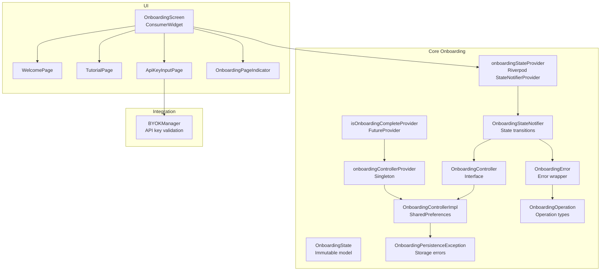
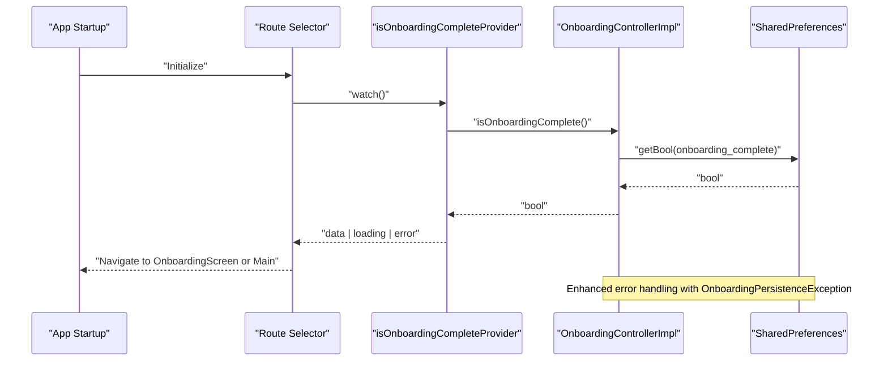
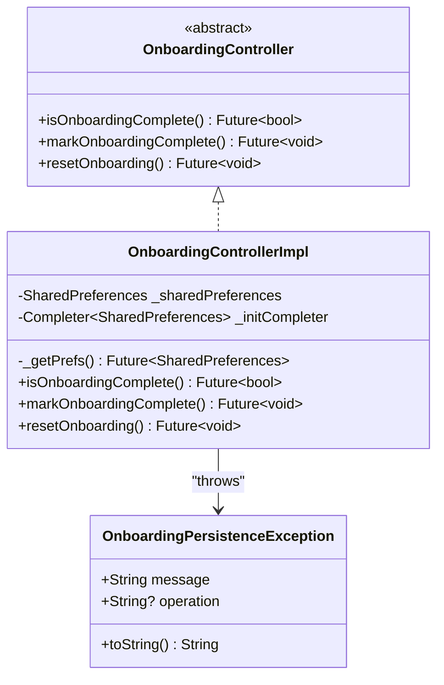
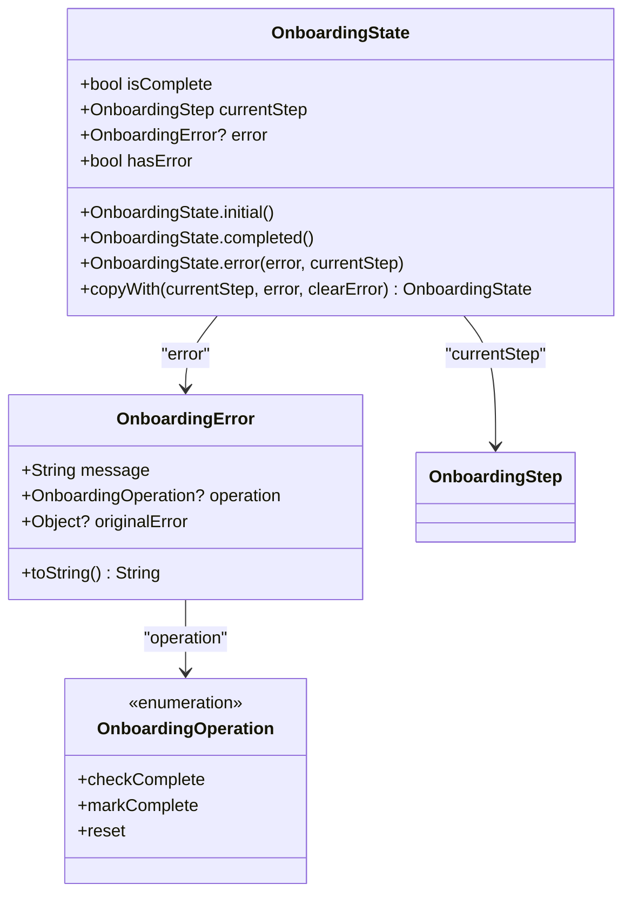
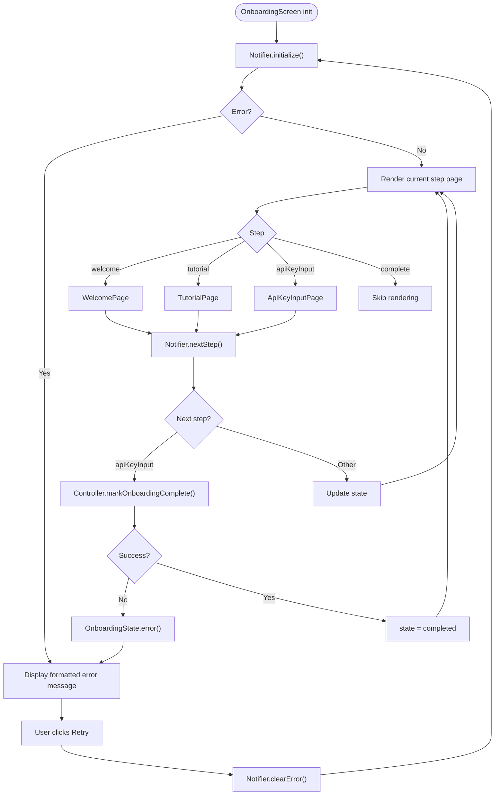
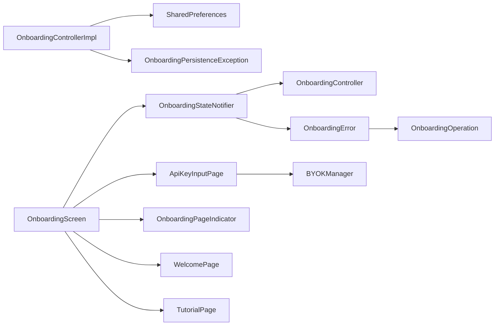

# Onboarding Controller

<cite>
**Referenced Files in This Document**
- [onboarding_controller.dart](file://lib/core/onboarding/onboarding_controller.dart)
- [onboarding_controller_impl.dart](file://lib/core/onboarding/onboarding_controller_impl.dart)
- [onboarding_state.dart](file://lib/core/onboarding/models/onboarding_state.dart)
- [onboarding_providers.dart](file://lib/core/onboarding/onboarding_providers.dart)
- [onboarding_persistence_exception.dart](file://lib/core/onboarding/models/onboarding_persistence_exception.dart)
- [onboarding_error.dart](file://lib/core/onboarding/models/onboarding_error.dart)
- [onboarding_screen.dart](file://lib/features/onboarding/onboarding_screen.dart)
- [welcome_page.dart](file://lib/features/onboarding/widgets/welcome_page.dart)
- [tutorial_page.dart](file://lib/features/onboarding/widgets/tutorial_page.dart)
- [api_key_input_page.dart](file://lib/features/onboarding/widgets/api_key_input_page.dart)
- [onboarding_page_indicator.dart](file://lib/features/onboarding/widgets/onboarding_page_indicator.dart)
- [byok_manager.dart](file://lib/core/byok/byok_manager.dart)
- [onboarding_persistence_property_test.dart](file://test/core/onboarding/onboarding_persistence_property_test.dart)
- [main.dart](file://lib/main.dart)
</cite>

## Update Summary
**Changes Made**
- Enhanced error handling documentation with new OnboardingPersistenceException class
- Updated state management documentation to reflect dynamic completion computation
- Improved persistence operations documentation with comprehensive error handling patterns
- Added detailed coverage of OnboardingError and OnboardingOperation integration
- Enhanced troubleshooting guide with specific error handling scenarios
- Updated provider architecture to show enhanced error propagation patterns

## Table of Contents
1. [Introduction](#introduction)
2. [Project Structure](#project-structure)
3. [Core Components](#core-components)
4. [Architecture Overview](#architecture-overview)
5. [Detailed Component Analysis](#detailed-component-analysis)
6. [Enhanced Error Handling System](#enhanced-error-handling-system)
7. [Dynamic State Management](#dynamic-state-management)
8. [Dependency Analysis](#dependency-analysis)
9. [Performance Considerations](#performance-considerations)
10. [Troubleshooting Guide](#troubleshooting-guide)
11. [Conclusion](#conclusion)

## Introduction
This document explains the Onboarding Controller implementation using Riverpod for reactive state management. It covers the onboarding flow orchestration (welcome screen, tutorial pages, API key input, and completion tracking), the OnboardingController interface and its implementation, the OnboardingState model, provider patterns, and integration with the main application navigation. It also documents enhanced error handling with OnboardingPersistenceException, dynamic completion computation, persistence mechanisms, comprehensive error handling patterns, user experience considerations, and edge cases such as partial completion, state restoration, and multi-device synchronization.

**Updated** Enhanced with comprehensive Riverpod provider integration documentation, advanced error handling patterns, and dynamic state management capabilities.

## Project Structure
The onboarding feature is organized into core state management and UI components with enhanced error handling:
- Core state and persistence: onboarding controller, state model, Riverpod providers, and exception classes
- Error handling framework: OnboardingError, OnboardingOperation, and OnboardingPersistenceException
- UI screens and widgets: onboarding screen, page indicator, and step-specific pages
- Integration: BYOK manager for API key validation and secure storage



**Diagram sources**
- [onboarding_controller.dart](file://lib/core/onboarding/onboarding_controller.dart#L19-L60)
- [onboarding_controller_impl.dart](file://lib/core/onboarding/onboarding_controller_impl.dart#L17-L83)
- [onboarding_providers.dart](file://lib/core/onboarding/onboarding_providers.dart#L20-L229)
- [onboarding_state.dart](file://lib/core/onboarding/models/onboarding_state.dart#L29-L101)
- [onboarding_persistence_exception.dart](file://lib/core/onboarding/models/onboarding_persistence_exception.dart#L10-L29)
- [onboarding_error.dart](file://lib/core/onboarding/models/onboarding_error.dart#L22-L80)
- [onboarding_screen.dart](file://lib/features/onboarding/onboarding_screen.dart#L64-L211)

**Section sources**
- [onboarding_controller.dart](file://lib/core/onboarding/onboarding_controller.dart#L1-L60)
- [onboarding_controller_impl.dart](file://lib/core/onboarding/onboarding_controller_impl.dart#L1-L83)
- [onboarding_state.dart](file://lib/core/onboarding/models/onboarding_state.dart#L1-L101)
- [onboarding_providers.dart](file://lib/core/onboarding/onboarding_providers.dart#L1-L229)
- [onboarding_persistence_exception.dart](file://lib/core/onboarding/models/onboarding_persistence_exception.dart#L1-L29)
- [onboarding_error.dart](file://lib/core/onboarding/models/onboarding_error.dart#L1-L80)
- [onboarding_screen.dart](file://lib/features/onboarding/onboarding_screen.dart#L1-L211)

## Core Components
- OnboardingController: abstract interface for checking, marking, and resetting onboarding completion with enhanced error handling.
- OnboardingControllerImpl: SharedPreferences-backed implementation with thread-safe initialization and comprehensive error handling.
- OnboardingState: immutable model with dynamic completion computation and error state management.
- OnboardingStateNotifier: reactive state transitions with comprehensive error propagation.
- Riverpod providers: singleton controller provider, future provider for initial routing, and state notifier provider for UI.
- OnboardingError: typed error wrapper with operation context and original error preservation.
- OnboardingPersistenceException: specific exception for storage-related failures with operation identification.
- OnboardingOperation: enumeration of supported onboarding operations for error categorization.

Key responsibilities:
- Orchestrate onboarding flow steps and completion with dynamic state computation
- Persist completion across app restarts with robust error handling
- Reactively update UI during the flow with comprehensive error propagation
- Integrate with API key validation for the final step with proper error mapping
- Provide structured error handling with operation context and user-friendly messaging

**Updated** Enhanced provider documentation with comprehensive error handling patterns and reactive state management capabilities.

**Section sources**
- [onboarding_controller.dart](file://lib/core/onboarding/onboarding_controller.dart#L19-L60)
- [onboarding_controller_impl.dart](file://lib/core/onboarding/onboarding_controller_impl.dart#L17-L83)
- [onboarding_state.dart](file://lib/core/onboarding/models/onboarding_state.dart#L29-L101)
- [onboarding_providers.dart](file://lib/core/onboarding/onboarding_providers.dart#L20-L229)
- [onboarding_persistence_exception.dart](file://lib/core/onboarding/models/onboarding_persistence_exception.dart#L10-L29)
- [onboarding_error.dart](file://lib/core/onboarding/models/onboarding_error.dart#L22-L80)

## Architecture Overview
The onboarding architecture uses Riverpod for state management with enhanced error handling and persistence:
- Singleton controller provider supplies a shared OnboardingControllerImpl instance with robust error handling
- FutureProvider determines initial routing by checking completion status with error propagation
- StateNotifierProvider manages OnboardingState with dynamic completion computation and comprehensive error handling
- UI components consume state and trigger transitions with proper error recovery
- Error handling flows through OnboardingError wrapper with OnboardingOperation context



**Diagram sources**
- [onboarding_providers.dart](file://lib/core/onboarding/onboarding_providers.dart#L51-L54)
- [onboarding_controller_impl.dart](file://lib/core/onboarding/onboarding_controller_impl.dart#L59-L62)
- [onboarding_persistence_exception.dart](file://lib/core/onboarding/models/onboarding_persistence_exception.dart#L10-L29)

**Section sources**
- [onboarding_providers.dart](file://lib/core/onboarding/onboarding_providers.dart#L24-L54)
- [onboarding_controller_impl.dart](file://lib/core/onboarding/onboarding_controller_impl.dart#L59-L81)
- [onboarding_persistence_exception.dart](file://lib/core/onboarding/models/onboarding_persistence_exception.dart#L10-L29)

## Detailed Component Analysis

### OnboardingController Interface and Implementation
- Interface defines:
  - isOnboardingComplete(): Future<bool> to check persisted completion with enhanced error handling
  - markOnboardingComplete(): Future<void> to persist completion, throwing OnboardingPersistenceException on failure
  - resetOnboarding(): Future<void> to clear completion, throwing OnboardingPersistenceException on failure
- Implementation:
  - Uses SharedPreferences with thread-safe lazy initialization via Completer
  - Persists completion under a dedicated key with explicit success verification
  - Throws OnboardingPersistenceException with operation context for consistent error handling
  - Provides comprehensive error propagation for storage failures



**Diagram sources**
- [onboarding_controller.dart](file://lib/core/onboarding/onboarding_controller.dart#L19-L60)
- [onboarding_controller_impl.dart](file://lib/core/onboarding/onboarding_controller_impl.dart#L17-L83)
- [onboarding_persistence_exception.dart](file://lib/core/onboarding/models/onboarding_persistence_exception.dart#L10-L29)

**Section sources**
- [onboarding_controller.dart](file://lib/core/onboarding/onboarding_controller.dart#L19-L60)
- [onboarding_controller_impl.dart](file://lib/core/onboarding/onboarding_controller_impl.dart#L17-L83)
- [onboarding_persistence_exception.dart](file://lib/core/onboarding/models/onboarding_persistence_exception.dart#L10-L29)

### Enhanced OnboardingState Model with Dynamic Computation
- Enum OnboardingStep: welcome, tutorial, apiKeyInput, complete
- OnboardingState: immutable with dynamic isComplete computation and comprehensive error handling
- Dynamic completion computation: isComplete property derived from currentStep guarantees consistency
- Enhanced error handling: OnboardingError integration with operation context and original error preservation
- Constructors: initial(), completed(), and error() constructors with proper state initialization



**Diagram sources**
- [onboarding_state.dart](file://lib/core/onboarding/models/onboarding_state.dart#L29-L101)
- [onboarding_error.dart](file://lib/core/onboarding/models/onboarding_error.dart#L22-L80)

**Section sources**
- [onboarding_state.dart](file://lib/core/onboarding/models/onboarding_state.dart#L29-L101)
- [onboarding_error.dart](file://lib/core/onboarding/models/onboarding_error.dart#L22-L80)

### Enhanced OnboardingStateNotifier and Providers
- OnboardingStateNotifier:
  - initialize(): sets state based on persisted completion with comprehensive error handling
  - nextStep(): advances through steps; marks completion on apiKeyInput with error propagation
  - previousStep(): moves backward; guards first step
  - reset(): clears persisted completion and resets state with error handling
  - Enhanced error handling: comprehensive error wrapping with OnboardingError
  - skipToStep(): utility to jump to a step (skips complete)
  - clearError(): returns state to apiKeyInput step for retry
- Providers:
  - onboardingControllerProvider: singleton controller with enhanced error handling
  - isOnboardingCompleteProvider: FutureProvider for initial routing with error propagation
  - onboardingStateProvider: StateNotifierProvider for reactive UI with comprehensive error handling

**Updated** Comprehensive documentation of provider implementations with enhanced error handling patterns and reactive state management capabilities.

```mermaid
sequenceDiagram
participant UI as "OnboardingScreen"
participant Notifier as "OnboardingStateNotifier"
participant Ctrl as "OnboardingControllerImpl"
participant Pref as "SharedPreferences"
UI->>Notifier : "initialize()"
Notifier->>Ctrl : "isOnboardingComplete()"
Ctrl->>Pref : "getBool(onboarding_complete)"
Pref-->>Ctrl : "bool"
Ctrl-->>Notifier : "bool"
alt error occurs
Notifier-->>UI : "OnboardingState.error() with OnboardingError"
else success
Notifier-->>UI : "state updated"
end
UI->>Notifier : "nextStep()"
alt currentStep == apiKeyInput
Notifier->>Ctrl : "markOnboardingComplete()"
Ctrl->>Pref : "setBool(true)"
Pref-->>Ctrl : "success"
alt success == false
Ctrl-->>Notifier : "throws OnboardingPersistenceException"
Notifier-->>UI : "OnboardingState.error() with OnboardingError"
else success == true
Ctrl-->>Notifier : "void"
Notifier-->>UI : "state = completed"
end
```

**Diagram sources**
- [onboarding_providers.dart](file://lib/core/onboarding/onboarding_providers.dart#L75-L125)
- [onboarding_controller_impl.dart](file://lib/core/onboarding/onboarding_controller_impl.dart#L65-L81)
- [onboarding_error.dart](file://lib/core/onboarding/models/onboarding_error.dart#L22-L80)
- [onboarding_persistence_exception.dart](file://lib/core/onboarding/models/onboarding_persistence_exception.dart#L10-L29)

**Section sources**
- [onboarding_providers.dart](file://lib/core/onboarding/onboarding_providers.dart#L61-L229)
- [onboarding_controller_impl.dart](file://lib/core/onboarding/onboarding_controller_impl.dart#L65-L81)
- [onboarding_error.dart](file://lib/core/onboarding/models/onboarding_error.dart#L22-L80)
- [onboarding_persistence_exception.dart](file://lib/core/onboarding/models/onboarding_persistence_exception.dart#L10-L29)

### Enhanced Onboarding Flow UI with Error Handling
- OnboardingScreen:
  - ConsumerWidget that initializes state on first frame with error handling
  - AnimatedSwitcher renders current step page with comprehensive error display
  - Navigates between pages via notifier callbacks with error recovery
  - formatOnboardingError(): maps OnboardingError to user-friendly messages
  - Handles OnboardingPersistenceException with specific storage error messaging
- Pages:
  - WelcomePage: "Get Started" triggers next step
  - TutorialPage: explains API key setup and links to Google Cloud
  - ApiKeyInputPage: validates and stores API key via BYOKManager with error handling
  - OnboardingPageIndicator: visual progress indicator



**Diagram sources**
- [onboarding_screen.dart](file://lib/features/onboarding/onboarding_screen.dart#L74-L211)
- [onboarding_providers.dart](file://lib/core/onboarding/onboarding_providers.dart#L98-L125)
- [onboarding_error.dart](file://lib/core/onboarding/models/onboarding_error.dart#L22-L80)

**Section sources**
- [onboarding_screen.dart](file://lib/features/onboarding/onboarding_screen.dart#L64-L211)
- [onboarding_providers.dart](file://lib/core/onboarding/onboarding_providers.dart#L98-L125)
- [onboarding_error.dart](file://lib/core/onboarding/models/onboarding_error.dart#L22-L80)

### API Key Input and Validation with Enhanced Error Handling
- ApiKeyInputPage collects API key and project ID with comprehensive validation
- Validates locally (format and project ID) with detailed error reporting
- Delegates to BYOKManager.storeAPIKey for validation and secure storage
- Presents contextual error messages based on ValidationFailureType
- Enhanced error handling: maps storage errors to user-friendly messages via formatOnboardingError

```mermaid
sequenceDiagram
participant UI as "ApiKeyInputPage"
participant BYOK as "BYOKManager"
participant Sec as "SecureStorageService"
participant Val as "APIKeyValidator"
UI->>UI : "validate form"
UI->>BYOK : "storeAPIKey(apiKey, projectId)"
BYOK->>Val : "validateFormat()"
Val-->>BYOK : "ValidationResult"
alt invalid format
BYOK-->>UI : "Failure(ValidationError)"
else valid format
BYOK->>Val : "validateFunctionality()"
Val-->>BYOK : "ValidationResult"
alt invalid
BYOK-->>UI : "Failure(ValidationError)"
else valid
BYOK->>Sec : "write(APIKeyConfig JSON)"
Sec-->>BYOK : "success"
alt write fails
BYOK-->>UI : "Failure(OnboardingPersistenceException)"
else success
BYOK-->>UI : "Success(void)"
end
end
```

**Diagram sources**
- [api_key_input_page.dart](file://lib/features/onboarding/widgets/api_key_input_page.dart#L1-L200)
- [byok_manager.dart](file://lib/core/byok/byok_manager.dart#L182-L231)
- [onboarding_persistence_exception.dart](file://lib/core/onboarding/models/onboarding_persistence_exception.dart#L10-L29)

**Section sources**
- [api_key_input_page.dart](file://lib/features/onboarding/widgets/api_key_input_page.dart#L1-L200)
- [byok_manager.dart](file://lib/core/byok/byok_manager.dart#L182-L231)
- [onboarding_persistence_exception.dart](file://lib/core/onboarding/models/onboarding_persistence_exception.dart#L10-L29)

### Enhanced Persistence and Multi-Device Considerations
- Completion persistence:
  - OnboardingControllerImpl persists completion to SharedPreferences with success verification
  - OnboardingPersistenceException provides operation context for consistent error handling
  - Property-based tests verify persistence across controller instances and app restarts
- API key persistence:
  - BYOKManager stores API key configuration in secure storage
  - Cloud backup is optional and separate from onboarding completion
- Cross-application state synchronization:
  - Onboarding completion is stored locally via SharedPreferences
  - There is no explicit cross-device synchronization for onboarding completion in the current implementation
- Enhanced error handling: comprehensive error propagation through the entire persistence chain

**Section sources**
- [onboarding_controller_impl.dart](file://lib/core/onboarding/onboarding_controller_impl.dart#L65-L81)
- [onboarding_persistence_exception.dart](file://lib/core/onboarding/models/onboarding_persistence_exception.dart#L10-L29)
- [onboarding_persistence_property_test.dart](file://test/core/onboarding/onboarding_persistence_property_test.dart#L106-L511)
- [byok_manager.dart](file://lib/core/byok/byok_manager.dart#L182-L231)

## Enhanced Error Handling System

### OnboardingPersistenceException
A specialized exception class designed specifically for onboarding persistence failures:
- Purpose: Provides clear identification of storage-related failures during onboarding operations
- Operation Context: Includes operation parameter ('markOnboardingComplete', 'isOnboardingComplete', 'resetOnboarding')
- Message Formatting: Enhanced toString() method with operation context for debugging
- Usage: Thrown by OnboardingControllerImpl when SharedPreferences write operations fail

### OnboardingError and OnboardingOperation
Structured error handling framework:
- OnboardingError: Typed error wrapper preserving original exceptions while providing user-friendly messages
- OnboardingOperation: Enumeration defining supported operations for error categorization
- Integration: Used throughout OnboardingStateNotifier for consistent error propagation
- User Experience: formatOnboardingError() function maps technical errors to appropriate user messages

### Error Propagation Patterns
- Initialization Errors: Caught during initialize() and wrapped in OnboardingState.error()
- Persistence Errors: Caught during markOnboardingComplete() and wrapped with OnboardingError
- Reset Errors: Caught during resetOnboarding() and wrapped with OnboardingError
- UI Error Handling: OnboardingScreen displays formatted error messages based on error type

**Section sources**
- [onboarding_persistence_exception.dart](file://lib/core/onboarding/models/onboarding_persistence_exception.dart#L10-L29)
- [onboarding_error.dart](file://lib/core/onboarding/models/onboarding_error.dart#L22-L80)
- [onboarding_providers.dart](file://lib/core/onboarding/onboarding_providers.dart#L75-L171)
- [onboarding_screen.dart](file://lib/features/onboarding/onboarding_screen.dart#L21-L58)

## Dynamic State Management

### Dynamic Completion Computation
The OnboardingState model implements dynamic completion computation through the isComplete getter:
- Consistency Guarantee: Onboarding is complete iff currentStep == OnboardingStep.complete
- Immutable Design: Ensures state consistency across all operations
- Automatic Updates: Changes to currentStep automatically update isComplete
- Error Safety: Error states maintain proper completion semantics

### Reactive State Transitions
Enhanced state management with comprehensive error handling:
- Immediate State Updates: UI responds instantly to state changes via Riverpod
- Error Recovery: Users can clear errors and retry operations
- Operation Context: Each state change preserves operation context for debugging
- Consistent Behavior: Dynamic computation prevents inconsistent state scenarios

### Provider Integration
- onboardingStateProvider: Real-time state updates with error propagation
- isOnboardingCompleteProvider: One-time initialization with error handling
- onboardingControllerProvider: Singleton access with robust error handling
- Error-aware UI: Components adapt to error states with appropriate messaging

**Section sources**
- [onboarding_state.dart](file://lib/core/onboarding/models/onboarding_state.dart#L59-L63)
- [onboarding_providers.dart](file://lib/core/onboarding/onboarding_providers.dart#L61-L229)
- [onboarding_screen.dart](file://lib/features/onboarding/onboarding_screen.dart#L84-L134)

## Dependency Analysis
- OnboardingControllerImpl depends on SharedPreferences for persistence with enhanced error handling
- OnboardingStateNotifier depends on OnboardingController for completion state with comprehensive error propagation
- ApiKeyInputPage depends on BYOKManager for validation and storage with error handling
- UI components depend on Riverpod providers for state and controller access with error-aware patterns
- Error handling framework: OnboardingError, OnboardingOperation, and OnboardingPersistenceException integrate throughout the dependency chain



**Diagram sources**
- [onboarding_controller_impl.dart](file://lib/core/onboarding/onboarding_controller_impl.dart#L17-L83)
- [onboarding_providers.dart](file://lib/core/onboarding/onboarding_providers.dart#L61-L229)
- [onboarding_error.dart](file://lib/core/onboarding/models/onboarding_error.dart#L22-L80)
- [onboarding_persistence_exception.dart](file://lib/core/onboarding/models/onboarding_persistence_exception.dart#L10-L29)
- [api_key_input_page.dart](file://lib/features/onboarding/widgets/api_key_input_page.dart#L1-L200)
- [onboarding_screen.dart](file://lib/features/onboarding/onboarding_screen.dart#L64-L211)

**Section sources**
- [onboarding_providers.dart](file://lib/core/onboarding/onboarding_providers.dart#L20-L229)
- [onboarding_controller_impl.dart](file://lib/core/onboarding/onboarding_controller_impl.dart#L17-L83)
- [onboarding_error.dart](file://lib/core/onboarding/models/onboarding_error.dart#L22-L80)
- [onboarding_persistence_exception.dart](file://lib/core/onboarding/models/onboarding_persistence_exception.dart#L10-L29)
- [api_key_input_page.dart](file://lib/features/onboarding/widgets/api_key_input_page.dart#L1-L200)
- [onboarding_screen.dart](file://lib/features/onboarding/onboarding_screen.dart#L64-L211)

## Performance Considerations
- SharedPreferences access is synchronous and lightweight; initialization uses a Completer to avoid concurrent initialization overhead
- State transitions are immediate; UI updates are reactive via Riverpod with enhanced error handling
- API key validation involves network calls; errors are surfaced promptly to the UI with proper error formatting
- Consider caching the initial completion check for initial app routing to avoid repeated reads
- Error handling overhead is minimal but provides comprehensive debugging information
- Dynamic completion computation adds negligible performance cost while ensuring state consistency

**Updated** Enhanced performance considerations for Riverpod provider usage, state management optimization, and comprehensive error handling patterns.

## Troubleshooting Guide
Common issues and resolutions with enhanced error handling:
- Persistence failures:
  - markOnboardingComplete throws OnboardingPersistenceException with operation context; ensure storage is available and retry gracefully
  - Check SharedPreferences availability and storage permissions
  - Verify storage backend is functioning correctly
- Inconsistent state after reset:
  - resetOnboarding removes the completion key; verify subsequent reads return false
  - Ensure proper error handling in UI components
- API key validation errors:
  - ApiKeyInputPage displays contextual error messages based on ValidationFailureType
  - Guide users to fix input or enable Vertex AI API
  - Monitor OnboardingPersistenceException for storage-related failures
- Navigation edge cases:
  - OnboardingScreen guards against rendering when complete; ensure parent navigation handles completion correctly
  - Handle OnboardingError states with appropriate user messaging
- Provider initialization issues:
  - Ensure proper provider registration in the application root
  - Handle FutureProvider loading states appropriately during app startup
  - Monitor OnboardingState.hasError for initialization failures
- Error handling patterns:
  - Use formatOnboardingError() for consistent user messaging
  - Implement proper error recovery with clearError() method
  - Log original errors for debugging while preserving user-friendly messages

**Updated** Added comprehensive troubleshooting guidance for enhanced error handling patterns, OnboardingPersistenceException, and structured error recovery procedures.

**Section sources**
- [onboarding_controller_impl.dart](file://lib/core/onboarding/onboarding_controller_impl.dart#L65-L81)
- [onboarding_persistence_exception.dart](file://lib/core/onboarding/models/onboarding_persistence_exception.dart#L10-L29)
- [onboarding_screen.dart](file://lib/features/onboarding/onboarding_screen.dart#L21-L58)
- [onboarding_providers.dart](file://lib/core/onboarding/onboarding_providers.dart#L75-L171)

## Conclusion
The Onboarding Controller provides a robust, reactive foundation for guiding users through the onboarding flow with comprehensive error handling. Using Riverpod, it cleanly separates concerns between state management, persistence, and UI presentation while implementing structured error handling through OnboardingError and OnboardingPersistenceException. The design supports incremental progression, dynamic completion computation, comprehensive error propagation, and persistence across app restarts. Integration with BYOK enables secure API key validation and storage, completing the onboarding experience. The enhanced error handling system provides clear operation context, user-friendly messaging, and consistent error recovery patterns. While onboarding completion is persisted locally, the system can be extended to support cross-device synchronization if needed, with the current implementation providing a solid foundation for error-resilient state management.

**Updated** Enhanced conclusion emphasizing the comprehensive Riverpod integration, dynamic state management capabilities, and robust error handling framework that makes the onboarding experience seamless, maintainable, and user-friendly.