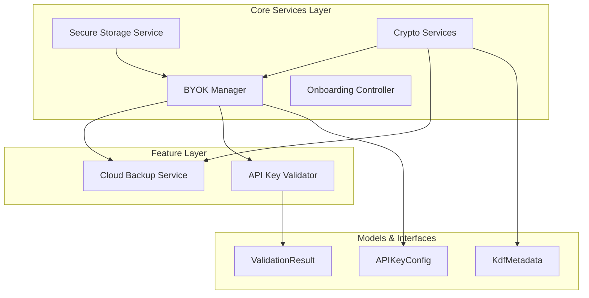
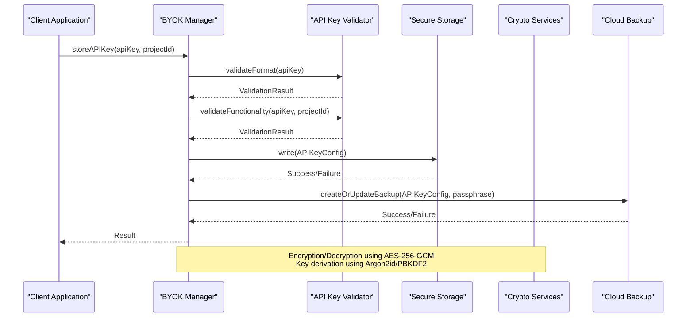
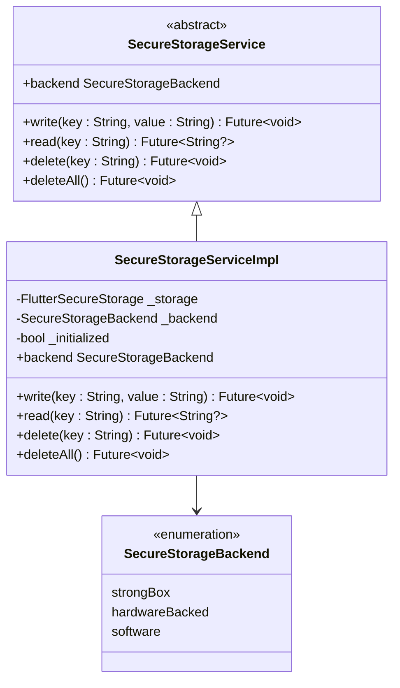
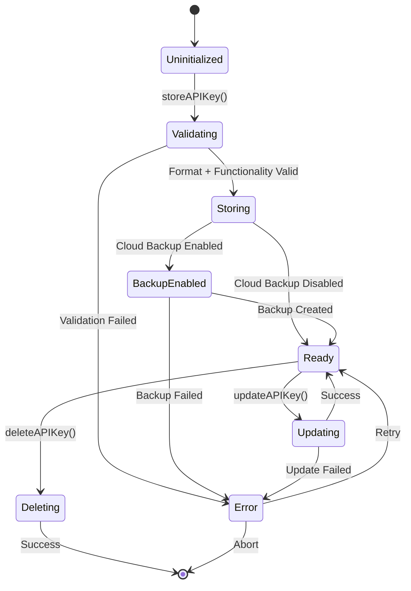
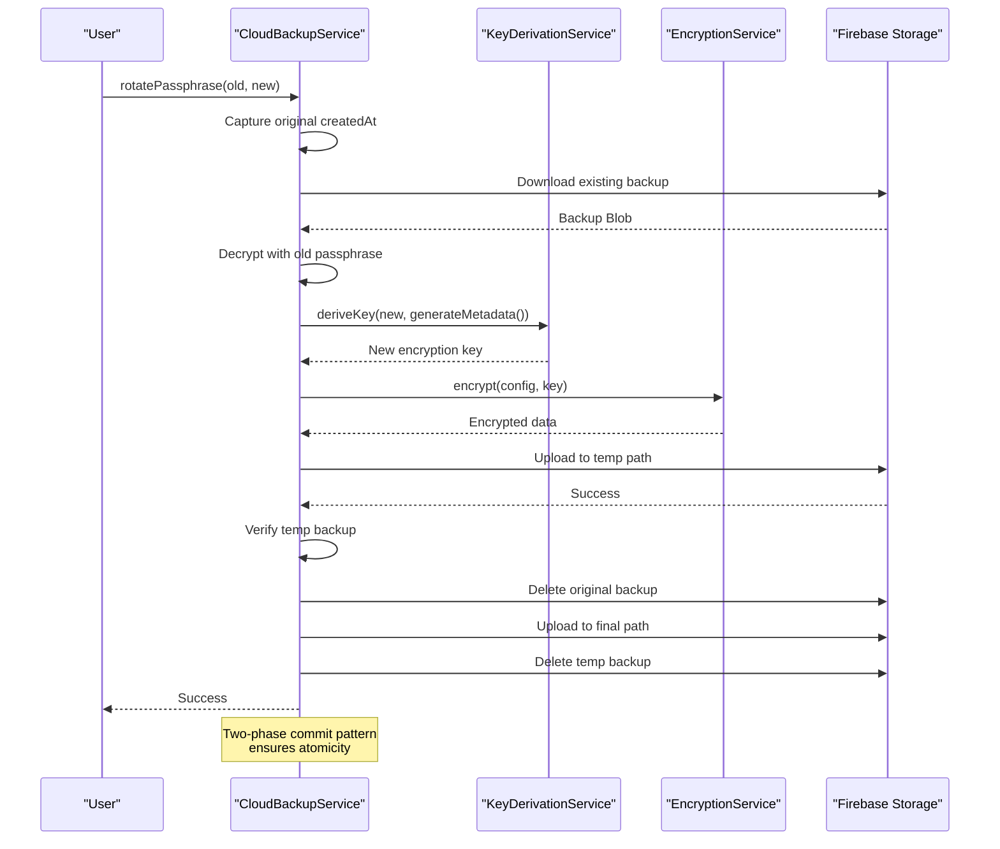
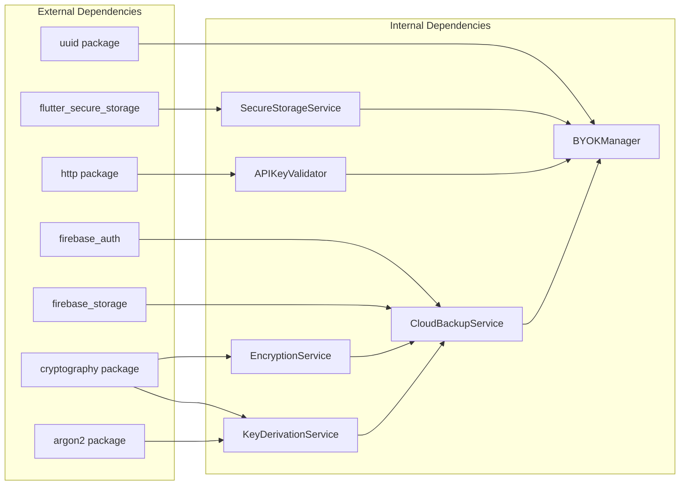

# Privacy Services Suite

<cite>
**Referenced Files in This Document**
- [README.md](file://README.md)
- [docs/security/overview.md](file://docs/security/overview.md)
- [docs/core-services/crypto-services.md](file://docs/core-services/crypto-services.md)
- [docs/core-services/secure-storage-service.md](file://docs/core-services/secure-storage-service.md)
- [docs/core-services/byok-manager.md](file://docs/core-services/byok-manager.md)
- [docs/core-services/onboarding-controller.md](file://docs/core-services/onboarding-controller.md)
- [lib/core/crypto/encryption_service.dart](file://lib/core/crypto/encryption_service.dart)
- [lib/core/crypto/key_derivation_service.dart](file://lib/core/crypto/key_derivation_service.dart)
- [lib/core/crypto/kdf_metadata.dart](file://lib/core/crypto/kdf_metadata.dart)
- [lib/core/storage/secure_storage_service_impl.dart](file://lib/core/storage/secure_storage_service_impl.dart)
- [lib/core/byok/byok_manager.dart](file://lib/core/byok/byok_manager.dart)
- [lib/core/byok/api_key_validator.dart](file://lib/core/byok/api_key_validator.dart)
- [lib/core/byok/cloud_backup_service.dart](file://lib/core/byok/cloud_backup_service.dart)
- [lib/core/byok/models/api_key_config.dart](file://lib/core/byok/models/api_key_config.dart)
</cite>

## Table of Contents
1. [Introduction](#introduction)
2. [Project Structure](#project-structure)
3. [Core Components](#core-components)
4. [Architecture Overview](#architecture-overview)
5. [Detailed Component Analysis](#detailed-component-analysis)
6. [Dependency Analysis](#dependency-analysis)
7. [Performance Considerations](#performance-considerations)
8. [Troubleshooting Guide](#troubleshooting-guide)
9. [Conclusion](#conclusion)

## Introduction
The Privacy Services Suite is a comprehensive Flutter-based system designed to securely manage sensitive data, primarily focusing on Vertex AI API key lifecycle management with robust encryption, secure storage, and optional cloud backup capabilities. The suite implements defense-in-depth security principles with multiple layers of protection for sensitive data including API keys, authentication tokens, and user credentials.

The system emphasizes user privacy through client-side encryption, platform-native secure storage integration, and minimal data collection practices. It provides a complete solution for managing API keys with optional encrypted cloud backup, ensuring that sensitive data remains protected both at rest and in transit.

## Project Structure
The Privacy Services Suite follows a modular architecture organized around core privacy services:



**Diagram sources**
- [lib/core/storage/secure_storage_service_impl.dart](file://lib/core/storage/secure_storage_service_impl.dart#L1-L105)
- [lib/core/crypto/key_derivation_service.dart](file://lib/core/crypto/key_derivation_service.dart#L1-L119)
- [lib/core/byok/byok_manager.dart](file://lib/core/byok/byok_manager.dart#L1-L583)

The project structure demonstrates clear separation of concerns with distinct modules for each privacy service component, enabling maintainability and testability while ensuring security isolation between different functional areas.

**Section sources**
- [README.md](file://README.md#L68-L88)

## Core Components
The Privacy Services Suite comprises four primary security-focused components that work together to provide comprehensive privacy protection:

### Secure Storage Service
Provides platform-agnostic secure storage using native platform mechanisms (iOS Keychain, Android Keystore) with automatic backend selection based on device capabilities. The service offers three security tiers: StrongBox/Hardware-backed, Software-backed encryption, and abstracts platform-specific implementations behind a unified interface.

### Cryptographic Services
Implements industry-standard cryptographic primitives including AES-256-GCM authenticated encryption and adaptive key derivation (Argon2id for mobile, PBKDF2 for web/desktop). The system automatically selects optimal algorithms per platform while maintaining cross-platform compatibility.

### BYOK Manager
Orchestrates the complete API key lifecycle including validation, secure storage, and optional cloud backup. Implements sophisticated error handling, idempotency guarantees, and atomic operations for critical state transitions.

### Cloud Backup Service
Manages encrypted cloud backup operations with atomic passphrase rotation, temporary backup handling, and comprehensive error recovery mechanisms. Ensures data integrity and provides rollback capabilities for critical operations.

**Section sources**
- [docs/core-services/secure-storage-service.md](file://docs/core-services/secure-storage-service.md#L1-L339)
- [docs/core-services/crypto-services.md](file://docs/core-services/crypto-services.md#L1-L333)
- [docs/core-services/byok-manager.md](file://docs/core-services/byok-manager.md#L1-L800)
- [docs/core-services/onboarding-controller.md](file://docs/core-services/onboarding-controller.md#L1-L310)

## Architecture Overview
The Privacy Services Suite implements a layered security architecture with clear separation between cryptographic operations, storage abstractions, and business logic:



**Diagram sources**
- [lib/core/byok/byok_manager.dart](file://lib/core/byok/byok_manager.dart#L183-L231)
- [lib/core/byok/api_key_validator.dart](file://lib/core/byok/api_key_validator.dart#L112-L150)
- [lib/core/byok/cloud_backup_service.dart](file://lib/core/byok/cloud_backup_service.dart#L167-L249)

The architecture ensures that sensitive data never leaves the device in plaintext, with all encryption and key derivation operations performed client-side using platform-native cryptographic primitives.

## Detailed Component Analysis

### Secure Storage Service Implementation
The Secure Storage Service provides a unified interface for platform-specific secure storage mechanisms:



**Diagram sources**
- [lib/core/storage/secure_storage_service_impl.dart](file://lib/core/storage/secure_storage_service_impl.dart#L7-L105)

The implementation automatically detects platform capabilities and selects the most secure available backend, falling back to software encryption when hardware security is unavailable. This ensures maximum security across all supported platforms while maintaining consistent behavior.

**Section sources**
- [lib/core/storage/secure_storage_service_impl.dart](file://lib/core/storage/secure_storage_service_impl.dart#L33-L73)

### Cryptographic Services Architecture
The cryptographic subsystem implements multiple layers of security through carefully selected algorithms and parameters:

```mermaid
flowchart TD
A[User Passphrase] --> B{Platform Detection}
B --> |Mobile (Android/iOS/macOS)| C[Argon2id Parameters]
B --> |Web/Desktop| D[PBKDF2 Parameters]
C --> E[3 Iterations<br/>64MB Memory<br/>4 Parallelism]
D --> F[600,000 Iterations<br/>SHA-512 Hash]
E --> G[32-byte Key Derivation]
F --> G
G --> H[AES-256-GCM Encryption]
H --> I[Nonce + Ciphertext + MAC]
J[APIKeyConfig] --> K[JSON Serialization]
K --> L[Encryption]
L --> M[Cloud Storage]
```

**Diagram sources**
- [lib/core/crypto/key_derivation_service.dart](file://lib/core/crypto/key_derivation_service.dart#L37-L54)
- [lib/core/crypto/encryption_service.dart](file://lib/core/crypto/encryption_service.dart#L22-L40)

The cryptographic design balances security and performance, with mobile platforms utilizing Argon2id for optimal security and desktop/web platforms using PBKDF2 with high iteration counts for brute force resistance.

**Section sources**
- [docs/core-services/crypto-services.md](file://docs/core-services/crypto-services.md#L89-L144)
- [lib/core/crypto/key_derivation_service.dart](file://lib/core/crypto/key_derivation_service.dart#L56-L81)

### BYOK Manager Business Logic
The BYOK Manager coordinates complex operations involving multiple privacy services with comprehensive error handling and state management:



**Diagram sources**
- [lib/core/byok/byok_manager.dart](file://lib/core/byok/byok_manager.dart#L183-L231)
- [lib/core/byok/byok_manager.dart](file://lib/core/byok/byok_manager.dart#L298-L384)

The manager implements sophisticated idempotency handling, atomic operations for critical state changes, and comprehensive error recovery mechanisms to ensure data consistency across all operations.

**Section sources**
- [lib/core/byok/byok_manager.dart](file://lib/core/byok/byok_manager.dart#L84-L147)

### Cloud Backup Service Security Model
The cloud backup service implements advanced security measures including atomic operations, temporary backup handling, and comprehensive error recovery:



**Diagram sources**
- [lib/core/byok/cloud_backup_service.dart](file://lib/core/byok/cloud_backup_service.dart#L414-L555)

The passphrase rotation process implements a sophisticated two-phase commit pattern to ensure atomicity despite Firebase Storage limitations, providing rollback capabilities and recovery mechanisms for critical failure scenarios.

**Section sources**
- [lib/core/byok/cloud_backup_service.dart](file://lib/core/byok/cloud_backup_service.dart#L413-L555)

## Dependency Analysis
The Privacy Services Suite exhibits excellent modularity with clear dependency relationships and low coupling between components:



**Diagram sources**
- [lib/core/byok/byok_manager.dart](file://lib/core/byok/byok_manager.dart#L1-L15)
- [lib/core/byok/cloud_backup_service.dart](file://lib/core/byok/cloud_backup_service.dart#L1-L15)

The dependency graph reveals a clean architecture where cryptographic services are foundational dependencies for higher-level services, while external dependencies are minimized to essential packages only. This design facilitates testing, maintenance, and platform-specific optimizations.

**Section sources**
- [lib/core/byok/byok_manager.dart](file://lib/core/byok/byok_manager.dart#L1-L15)
- [lib/core/byok/cloud_backup_service.dart](file://lib/core/byok/cloud_backup_service.dart#L1-L15)

## Performance Considerations
The Privacy Services Suite implements several performance optimization strategies:

### Cryptographic Performance
- **Compute Isolation**: Heavy cryptographic operations run in isolates to prevent UI blocking
- **Platform Optimization**: Hardware acceleration for AES-GCM and native Argon2 implementations
- **Parameter Tuning**: Optimized KDF parameters balancing security and user experience

### Storage Performance
- **Lazy Initialization**: Secure storage initialized only on first use
- **Async Operations**: All storage operations are asynchronous to prevent blocking
- **Backend Selection**: Automatic selection of fastest available backend

### Network Performance
- **Connection Pooling**: HTTP client managed by validator for efficient network operations
- **Timeout Management**: Configurable timeouts for network operations
- **Error Caching**: Reduced retry attempts for persistent failures

## Troubleshooting Guide
Common issues and their resolution strategies:

### Secure Storage Issues
- **Device Locked**: iOS device lock or Android keystore availability issues
- **Storage Full**: Insufficient storage space for secure storage operations
- **Permissions Denied**: Platform permission restrictions for secure storage access

### Cryptographic Errors
- **Wrong Passphrase**: Authentication exceptions during decryption
- **Corrupted Data**: MAC verification failures indicating data tampering
- **Algorithm Mismatch**: Version compatibility issues with stored metadata

### Cloud Backup Problems
- **Network Connectivity**: Temporary network failures during backup operations
- **Firebase Quotas**: Rate limiting or quota exceeded errors
- **Atomic Operation Failures**: Partial state during critical operations

**Section sources**
- [docs/core-services/secure-storage-service.md](file://docs/core-services/secure-storage-service.md#L220-L239)
- [lib/core/byok/cloud_backup_service.dart](file://lib/core/byok/cloud_backup_service.dart#L139-L164)

## Conclusion
The Privacy Services Suite represents a comprehensive and well-architected solution for managing sensitive data with robust security guarantees. The implementation demonstrates excellent separation of concerns, with clear abstraction layers that enable maintainability and extensibility while providing strong privacy protections.

Key strengths include the layered security architecture, platform-aware cryptographic implementations, comprehensive error handling, and atomic operation guarantees for critical state transitions. The system successfully balances security, performance, and usability across multiple platforms and deployment scenarios.

The modular design facilitates future enhancements, including potential biometric authentication integration, hardware security module support, and expanded cloud storage providers. The comprehensive documentation and testing approach ensures long-term maintainability and reliability of the privacy services suite.