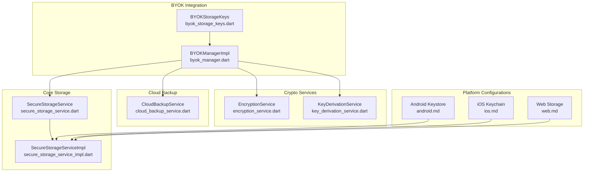
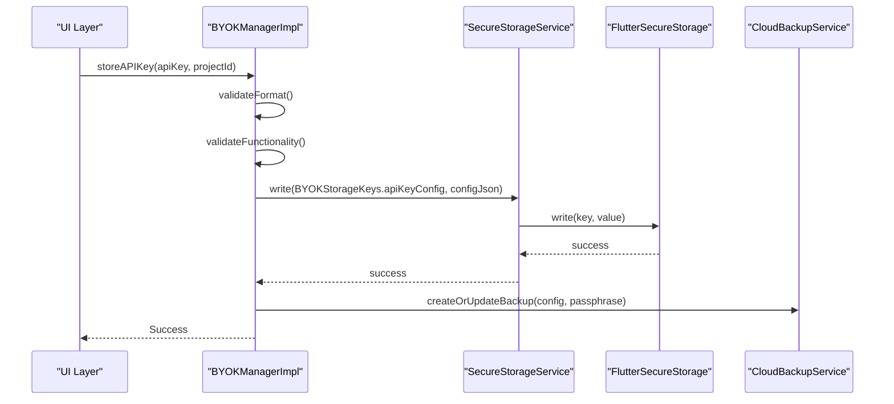
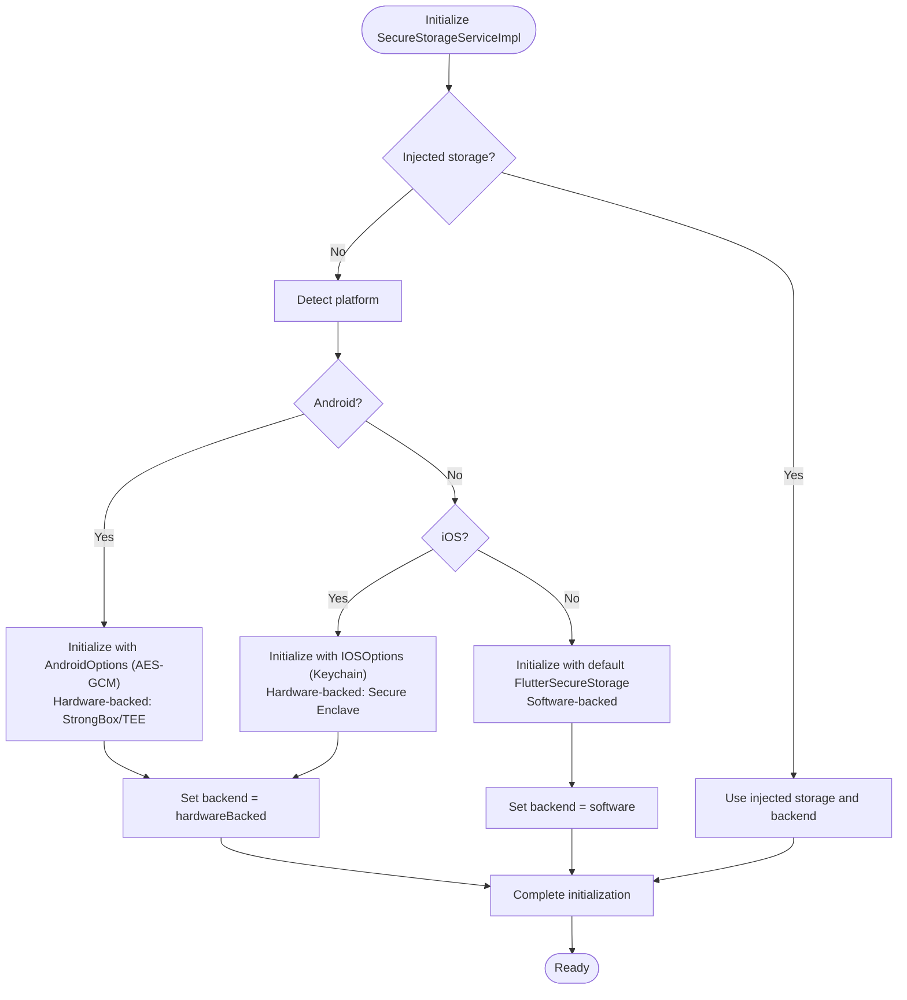
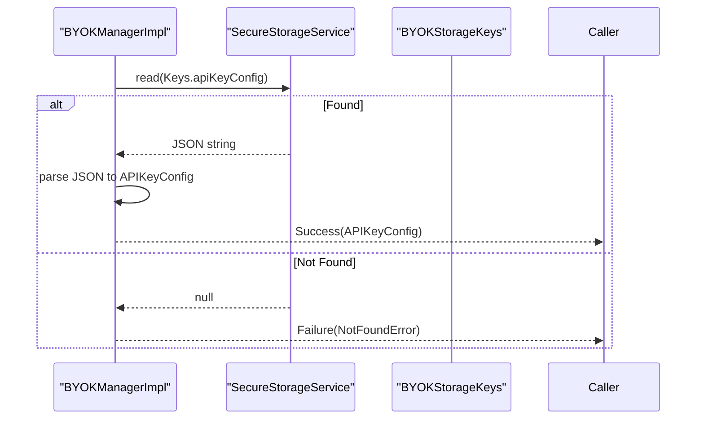
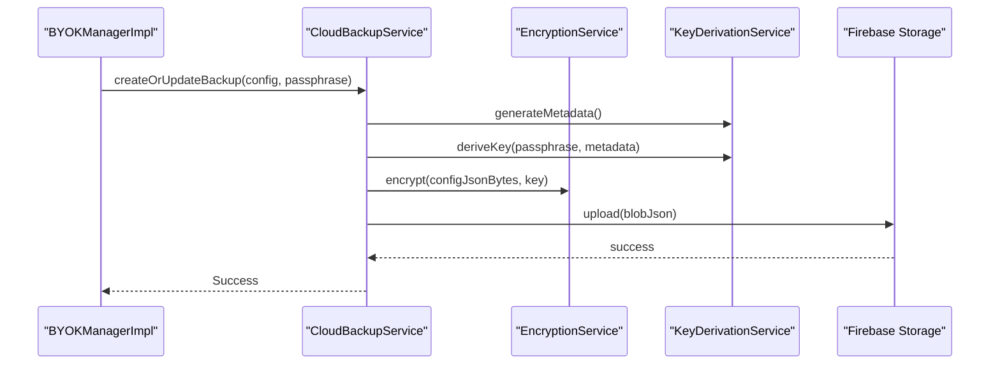
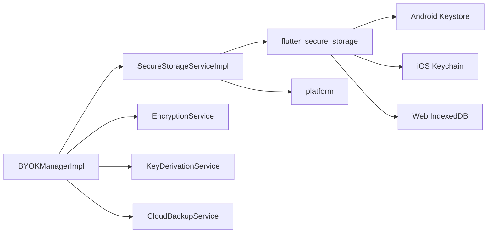

# Secure Storage Service

<cite>
**Referenced Files in This Document**
- [secure_storage_service.dart](file://lib/core/storage/secure_storage_service.dart)
- [secure_storage_service_impl.dart](file://lib/core/storage/secure_storage_service_impl.dart)
- [byok_manager.dart](file://lib/core/byok/byok_manager.dart)
- [byok_storage_keys.dart](file://lib/core/byok/byok_storage_keys.dart)
- [secure_storage_service_test.dart](file://test/secure_storage_service_test.dart)
- [pubspec.yaml](file://pubspec.yaml)
- [encryption_service.dart](file://lib/core/crypto/encryption_service.dart)
- [key_derivation_service.dart](file://lib/core/crypto/key_derivation_service.dart)
- [cloud_backup_service.dart](file://lib/core/byok/cloud_backup_service.dart)
- [api_key_validator.dart](file://lib/core/byok/api_key_validator.dart)
- [byok_design.md](file://lib/core/byok/byok_design.md)
- [android.md](file://docs/platform/android.md)
- [ios.md](file://docs/platform/ios.md)
- [web.md](file://docs/platform/web.md)
</cite>

## Update Summary
**Changes Made**
- Enhanced platform-specific implementation details for Android Keystore and iOS Keychain configurations
- Added comprehensive hardware-backed security module information
- Updated Android Keystore configuration with AES-GCM and StrongBox details
- Expanded iOS Keychain configuration with Secure Enclave and accessibility settings
- Improved hardware security module integration documentation
- Added platform-specific performance and security characteristics

## Table of Contents
1. [Introduction](#introduction)
2. [Project Structure](#project-structure)
3. [Core Components](#core-components)
4. [Architecture Overview](#architecture-overview)
5. [Detailed Component Analysis](#detailed-component-analysis)
6. [Platform-Specific Implementations](#platform-specific-implementations)
7. [Hardware Security Module Integration](#hardware-security-module-integration)
8. [Dependency Analysis](#dependency-analysis)
9. [Performance Considerations](#performance-considerations)
10. [Troubleshooting Guide](#troubleshooting-guide)
11. [Conclusion](#conclusion)

## Introduction
This document describes the Secure Storage Service abstraction layer that provides platform-native secure storage across Android, iOS, and web environments. It defines a unified interface for reading, writing, deleting, and checking the existence of sensitive data, with automatic selection of hardware-backed or software-backed storage depending on platform capabilities. The service integrates with the Bring Your Own Key (BYOK) Manager to persist API key configurations securely, and it supports optional cloud backup through encrypted storage.

**Updated** Enhanced with detailed platform-specific implementations and hardware security module configurations.

## Project Structure
The Secure Storage Service resides in the core storage module and is consumed by the BYOK Manager and related services. The key files are:
- Secure storage interface and backend enumeration
- Platform-aware implementation backed by Flutter Secure Storage
- BYOK Manager integration for API key lifecycle management
- Tests validating the implementation behavior

**Diagram sources**
- [secure_storage_service.dart](file://lib/core/storage/secure_storage_service.dart#L10-L29)
- [secure_storage_service_impl.dart](file://lib/core/storage/secure_storage_service_impl.dart#L7-L104)
- [byok_manager.dart](file://lib/core/byok/byok_manager.dart#L153-L582)
- [byok_storage_keys.dart](file://lib/core/byok/byok_storage_keys.dart#L5-L14)
- [encryption_service.dart](file://lib/core/crypto/encryption_service.dart#L14-L74)
- [key_derivation_service.dart](file://lib/core/crypto/key_derivation_service.dart#L9-L117)
- [cloud_backup_service.dart](file://lib/core/byok/cloud_backup_service.dart#L21-L91)
- [android.md](file://docs/platform/android.md#L31-L45)
- [ios.md](file://docs/platform/ios.md#L25-L35)
- [web.md](file://docs/platform/web.md#L23-L26)

**Section sources**
- [secure_storage_service.dart](file://lib/core/storage/secure_storage_service.dart#L1-L30)
- [secure_storage_service_impl.dart](file://lib/core/storage/secure_storage_service_impl.dart#L1-L105)
- [byok_manager.dart](file://lib/core/byok/byok_manager.dart#L1-L583)
- [byok_storage_keys.dart](file://lib/core/byok/byok_storage_keys.dart#L1-L15)

## Core Components
- SecureStorageBackend: Enumerates hardware-backed (TEE/Secure Enclave) and software-backed storage options.
- SecureStorageService: Abstract interface defining write, read, delete, deleteAll, backend accessor, and biometric requirement indicator.
- SecureStorageServiceImpl: Platform-aware implementation that selects hardware-backed storage on Android and iOS, and falls back to software-backed storage on other platforms. It initializes FlutterSecureStorage with platform-appropriate options and exposes the same interface.

Key behaviors:
- Backend selection is automatic based on platform detection.
- Initialization uses a Completer to ensure asynchronous initialization completes before operations.
- On Android, AES-GCM options are configured to leverage hardware protection when available.
- On iOS, Keychain accessibility is configured for device-locked access.
- On non-mobile/web platforms, software-backed storage is used.

**Section sources**
- [secure_storage_service.dart](file://lib/core/storage/secure_storage_service.dart#L1-L30)
- [secure_storage_service_impl.dart](file://lib/core/storage/secure_storage_service_impl.dart#L7-L104)

## Architecture Overview
The Secure Storage Service sits between the BYOK Manager and the Flutter Secure Storage plugin. The BYOK Manager validates API keys, constructs configurations, and persists them using the Secure Storage Service. Cloud backup is handled separately by the CloudBackupService, which uses the crypto services to encrypt and upload backups to Firebase Storage.

**Diagram sources**
- [byok_manager.dart](file://lib/core/byok/byok_manager.dart#L182-L231)
- [secure_storage_service_impl.dart](file://lib/core/storage/secure_storage_service_impl.dart#L75-L97)
- [cloud_backup_service.dart](file://lib/core/byok/cloud_backup_service.dart#L167-L249)

## Detailed Component Analysis

### SecureStorageService Interface
Defines the contract for secure storage operations:
- write(key, value): Asynchronous write operation.
- read(key): Asynchronous read operation returning nullable string.
- delete(key): Asynchronous delete operation.
- deleteAll(): Asynchronous clear-all operation.
- backend: Current backend in use (hardwareBacked or software).
- requiresBiometric: Indicates whether access requires biometric or device passcode (currently false pending future implementation).

Security implications:
- The interface abstracts platform differences, enabling transparent use of hardware-backed storage on capable devices.

**Section sources**
- [secure_storage_service.dart](file://lib/core/storage/secure_storage_service.dart#L10-L29)

### SecureStorageServiceImpl Implementation
Platform-specific initialization and behavior:
- Android: Uses AndroidOptions with AES-GCM and reset-on-error enabled. Defaults to hardwareBacked backend.
- iOS: Uses IOSOptions with accessibility targeting unlocked device state. Defaults to hardwareBacked backend.
- Other platforms: Uses default FlutterSecureStorage configuration. Defaults to software backend.
- Initialization safety: Uses a Completer to ensure initialization completes before any operation executes.
- Fallback: On initialization failure, falls back to software-backed storage and logs the error.

**Updated** Enhanced with detailed platform-specific configurations and hardware security module integration.

Hardware security module integration:
- Android: AES-GCM with hardware protection when available via Flutter Secure Storage v10.0.0+ defaults.
- iOS: Keychain-backed storage leveraging Secure Enclave when available.

Error handling:
- Initialization catches exceptions and switches to software-backed storage.
- Operations await initialization completion via Completer.

**Diagram sources**
- [secure_storage_service_impl.dart](file://lib/core/storage/secure_storage_service_impl.dart#L33-L73)
- [android.md](file://docs/platform/android.md#L31-L45)
- [ios.md](file://docs/platform/ios.md#L25-L35)

**Section sources**
- [secure_storage_service_impl.dart](file://lib/core/storage/secure_storage_service_impl.dart#L7-L104)

### BYOK Manager Integration
The BYOK Manager uses SecureStorageService to persist API key configurations:
- Storage keys: apiKeyConfig, cloudBackupEnabled, backupPassphraseHash.
- Store: Validates key format and functionality, serializes configuration, writes to secure storage.
- Retrieve: Reads from secure storage, deserializes configuration.
- Delete: Removes configuration and optionally cloud backup keys.
- Update: Validates new key, preserves metadata, writes updated configuration, optionally re-encrypts cloud backup.
- Enable/Disable cloud backup: Persists flags and manages cloud backup lifecycle.
- Restore: Downloads and decrypts cloud backup, stores locally.
- Has Stored Key / Is Cloud Backup Enabled: Reads flags from secure storage.

**Diagram sources**
- [byok_manager.dart](file://lib/core/byok/byok_manager.dart#L233-L256)
- [byok_storage_keys.dart](file://lib/core/byok/byok_storage_keys.dart#L5-L14)

**Section sources**
- [byok_manager.dart](file://lib/core/byok/byok_manager.dart#L153-L582)
- [byok_storage_keys.dart](file://lib/core/byok/byok_storage_keys.dart#L5-L14)

### Cloud Backup Service Integration
While not part of the Secure Storage Service, CloudBackupService complements it by encrypting and uploading API key configurations to Firebase Storage. It uses the crypto services to derive keys and encrypt data, then stores encrypted blobs with KDF metadata.

**Diagram sources**
- [cloud_backup_service.dart](file://lib/core/byok/cloud_backup_service.dart#L167-L249)
- [encryption_service.dart](file://lib/core/crypto/encryption_service.dart#L22-L74)
- [key_derivation_service.dart](file://lib/core/crypto/key_derivation_service.dart#L17-L85)

**Section sources**
- [cloud_backup_service.dart](file://lib/core/byok/cloud_backup_service.dart#L21-L91)
- [encryption_service.dart](file://lib/core/crypto/encryption_service.dart#L14-L74)
- [key_derivation_service.dart](file://lib/core/crypto/key_derivation_service.dart#L9-L117)

## Platform-Specific Implementations

### Android Implementation Details
The Android implementation leverages the system's hardware security infrastructure:

**Configuration Parameters:**
- **Key Cipher Algorithm**: AES_GCM_NoPadding - Authenticated encryption with hardware acceleration
- **Storage Cipher Algorithm**: AES_GCM_NoPadding - Ensures integrity and confidentiality
- **Enforce Biometrics**: false - Biometric authentication not required for basic operations
- **Reset on Error**: true - Automatic key rotation on authentication failures

**Hardware Security Features:**
- **Android Keystore**: System-wide credential storage managed by the OS
- **StrongBox**: Dedicated hardware security module (Android 9+) for enhanced protection
- **TEE (Trusted Execution Environment)**: Isolated execution environment for cryptographic operations
- **AES-GCM**: Authenticated encryption providing both confidentiality and integrity

**Backend Selection Priority:**
1. StrongBox (dedicated HSM) - Highest security level
2. Hardware-backed TEE - Hardware-protected keys
3. Software fallback - Standard AES encryption

**Section sources**
- [secure_storage_service_impl.dart](file://lib/core/storage/secure_storage_service_impl.dart#L37-L47)
- [android.md](file://docs/platform/android.md#L31-L45)

### iOS Implementation Details
The iOS implementation utilizes Apple's secure storage infrastructure:

**Configuration Parameters:**
- **Accessibility**: unlocked_this_device - Keys accessible only when device is unlocked
- **Secure Enclave**: Hardware security module for cryptographic operations
- **Keychain Integration**: System-managed secure storage

**Security Features:**
- **iOS Keychain**: Secure credential storage managed by the operating system
- **Secure Enclave**: Hardware security module (iPhone 5s+) for cryptographic operations
- **Accessibility Control**: Device-locked access prevents unauthorized access
- **No iCloud Sync**: Prevents cloud backup of sensitive data

**Backend Selection Logic:**
- Hardware-backed storage automatically selected when available
- Secure Enclave leveraged when present for enhanced security
- Automatic fallback to software-backed storage when hardware unavailable

**Section sources**
- [secure_storage_service_impl.dart](file://lib/core/storage/secure_storage_service_impl.dart#L50-L57)
- [ios.md](file://docs/platform/ios.md#L25-L35)

### Web Platform Implementation
The web implementation provides software-backed storage with browser-native cryptography:

**Configuration Characteristics:**
- **IndexedDB**: Underlying storage mechanism for persistent data
- **Software Encryption**: Pure software AES-256-GCM encryption
- **PBKDF2**: Key derivation function (Argon2id not available in browsers)

**Limitations:**
- No hardware-backed secure storage available
- PBKDF2 instead of Argon2id (slower key derivation)
- No Secure Enclave/Keystore equivalent
- IndexedDB-based storage with browser security constraints

**Section sources**
- [web.md](file://docs/platform/web.md#L23-L26)
- [web.md](file://docs/platform/web.md#L48-L53)

## Hardware Security Module Integration

### Android Hardware Security Modules
The Android implementation seamlessly integrates with multiple hardware security layers:

**StrongBox HSM (Hardware Security Module):**
- Dedicated security chip providing tamper-resistant key storage
- Available on Android 9+ devices (Pixel 3+)
- Provides additional protection beyond traditional keystore
- Hardware-accelerated cryptographic operations

**Trusted Execution Environment (TEE):**
- Isolated execution environment for sensitive operations
- Hardware isolation from main operating system
- Protection against malicious software and side-channel attacks
- Transparent integration with Android Keystore

**Hardware-Accelerated Cryptography:**
- AES-NI instruction set support when available
- Optimized cryptographic operations
- Reduced CPU overhead for encryption/decryption
- Enhanced performance on supported devices

### iOS Secure Enclave Integration
The iOS implementation leverages Apple's hardware security infrastructure:

**Secure Enclave:**
- Dedicated security coprocessor (iPhone 5s+)
- Tamper-resistant hardware for cryptographic operations
- Independent from main processor and memory
- Hardware-accelerated AES operations

**Keychain Integration:**
- System-managed secure storage
- Automatic key derivation and management
- Device-specific key wrapping
- Seamless integration with iOS security model

**Accessibility Controls:**
- Device-locked access prevents unauthorized access
- Touch ID/Face ID integration when available
- Automatic key invalidation on device lock
- Protection against extraction attempts

**Section sources**
- [android.md](file://docs/platform/android.md#L31-L45)
- [ios.md](file://docs/platform/ios.md#L25-L35)

## Dependency Analysis
External dependencies relevant to Secure Storage:
- flutter_secure_storage: Provides platform-native secure storage abstraction.
- platform: Used to detect platform type for backend selection.
- cryptography and argon2: Used by CloudBackupService for encryption and key derivation.

**Diagram sources**
- [secure_storage_service_impl.dart](file://lib/core/storage/secure_storage_service_impl.dart#L1-L5)
- [byok_manager.dart](file://lib/core/byok/byok_manager.dart#L1-L15)
- [pubspec.yaml](file://pubspec.yaml#L34-L47)
- [android.md](file://docs/platform/android.md#L31-L45)
- [ios.md](file://docs/platform/ios.md#L25-L35)
- [web.md](file://docs/platform/web.md#L23-L26)

**Section sources**
- [pubspec.yaml](file://pubspec.yaml#L30-L47)
- [secure_storage_service_impl.dart](file://lib/core/storage/secure_storage_service_impl.dart#L1-L5)
- [byok_manager.dart](file://lib/core/byok/byok_manager.dart#L1-L15)

## Performance Considerations
- Android hardware-backed storage: AES-GCM with hardware acceleration improves performance for encryption/decryption operations when available.
- iOS Keychain-backed storage: Access is optimized for device-locked scenarios and leverages Secure Enclave when present.
- Software-backed storage: Slower than hardware-backed due to pure software encryption; suitable for non-mobile/web platforms.
- Initialization overhead: The Completer-based initialization ensures operations wait for readiness, preventing race conditions at the cost of a small startup delay.
- Error handling: Fallback to software-backed storage avoids blocking the app on initialization failures.

**Updated** Enhanced with platform-specific performance characteristics and hardware acceleration details.

## Troubleshooting Guide
Common issues and resolutions:
- Initialization failures: The implementation logs and falls back to software-backed storage. Check platform detection and Flutter Secure Storage configuration.
- Operation timing: Ensure callers await initialization completion; operations are gated by a Completer to prevent premature access.
- Backend mismatches: Confirm platform detection logic and Flutter Secure Storage options for Android and iOS.
- Test coverage: Unit tests validate that write/read/delete/deleteAll delegate to the underlying storage and return expected results.
- Hardware availability: On Android, StrongBox/TEE availability depends on device capabilities; fallback to software is automatic.
- iOS Keychain access: Ensure proper entitlements and accessibility settings for device-locked access.

**Section sources**
- [secure_storage_service_impl.dart](file://lib/core/storage/secure_storage_service_impl.dart#L63-L72)
- [secure_storage_service_test.dart](file://test/secure_storage_service_test.dart#L10-L147)

## Conclusion
The Secure Storage Service provides a robust, platform-aware abstraction for secure data persistence. It automatically selects hardware-backed storage on Android and iOS, with a reliable software-backed fallback for other platforms. Integrated with the BYOK Manager, it enables secure API key lifecycle management, complemented by optional cloud backup through encrypted storage. The design balances security, portability, and maintainability across diverse deployment targets, with comprehensive hardware security module integration and platform-specific optimizations.

**Updated** Enhanced documentation reflects detailed platform-specific implementations, hardware security module configurations, and comprehensive security considerations for each supported platform.