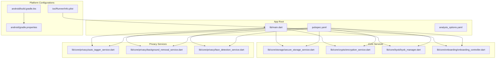

# Development Guidelines

<cite>
**Referenced Files in This Document**
- [analysis_options.yaml](file://analysis_options.yaml)
- [pubspec.yaml](file://pubspec.yaml)
- [README.md](file://README.md)
- [AGENTS.md](file://AGENTS.md)
- [android/gradle.properties](file://android/gradle.properties)
- [android/build.gradle.kts](file://android/build.gradle.kts)
- [android/key.properties.example](file://android/key.properties.example)
- [ios/Runner/Info.plist](file://ios/Runner/Info.plist)
- [lib/main.dart](file://lib/main.dart)
- [lib/core/crypto/encryption_service.dart](file://lib/core/crypto/encryption_service.dart)
- [lib/core/storage/secure_storage_service.dart](file://lib/core/storage/secure_storage_service.dart)
- [lib/core/byok/byok_manager.dart](file://lib/core/byok/byok_manager.dart)
- [lib/core/byok/byok_design.md](file://lib/core/byok/byok_design.md)
- [lib/core/privacy/auto_tagger_service.dart](file://lib/core/privacy/auto_tagger_service.dart)
- [lib/core/privacy/background_removal_service.dart](file://lib/core/privacy/background_removal_service.dart)
- [lib/core/privacy/face_detection_service.dart](file://lib/core/privacy/face_detection_service.dart)
- [lib/core/onboarding/onboarding_controller.dart](file://lib/core/onboarding/onboarding_controller.dart)
- [lib/core/onboarding/onboarding_controller_impl.dart](file://lib/core/onboarding/onboarding_controller_impl.dart)
- [test/encryption_service_test.dart](file://test/encryption_service_test.dart)
- [test/secure_storage_service_test.dart](file://test/secure_storage_service_test.dart)
- [test/crypto_properties_test.dart](file://test/crypto_properties_test.dart)
- [docs/core-services/byok-manager.md](file://docs/core-services/byok-manager.md)
- [docs/core-services/crypto-services.md](file://docs/core-services/crypto-services.md)
- [docs/core-services/secure-storage-service.md](file://docs/core-services/secure-storage-service.md)
</cite>

## Update Summary
**Changes Made**
- Added comprehensive documentation for new privacy services (AutoTagger, BackgroundRemoval, FaceDetection)
- Expanded onboarding controller documentation with implementation details
- Updated architecture diagrams to reflect expanded service ecosystem
- Enhanced security review process to cover new privacy-focused services
- Added new testing requirements for machine learning and image processing components
- Updated deployment checklist to include new MLKit and TensorFlow Lite dependencies

## Table of Contents
1. [Introduction](#introduction)
2. [Project Structure](#project-structure)
3. [Core Components](#core-components)
4. [Architecture Overview](#architecture-overview)
5. [Detailed Component Analysis](#detailed-component-analysis)
6. [Privacy Services](#privacy-services)
7. [Onboarding Controller](#onboarding-controller)
8. [Dependency Analysis](#dependency-analysis)
9. [Performance Considerations](#performance-considerations)
10. [Testing Requirements](#testing-requirements)
11. [Security Review Process](#security-review-process)
12. [Deployment Checklist](#deployment-checklist)
13. [Contribution Workflow](#contribution-workflow)
14. [Best Practices](#best-practices)
15. [Debugging and Troubleshooting](#debugging-and-troubleshooting)
16. [Conclusion](#conclusion)

## Introduction
This document provides comprehensive development guidelines for contributing to and maintaining the StyleSync project. It consolidates code style standards, testing requirements, security review processes, deployment procedures, and operational best practices. The project is a Flutter application with a strong focus on cryptography, secure storage, privacy-preserving machine learning, and robust testing patterns.

## Project Structure
The repository follows a conventional Flutter project layout with platform-specific configurations under android/, ios/, linux/, macos/, and windows/. Core business logic resides under lib/, organized by feature and domain (e.g., core/crypto, core/storage, core/byok, core/privacy, core/onboarding). Tests are colocated under test/.

**Diagram sources**
- [lib/main.dart](file://lib/main.dart#L1-L123)
- [pubspec.yaml](file://pubspec.yaml#L1-L109)
- [analysis_options.yaml](file://analysis_options.yaml#L1-L29)
- [lib/core/storage/secure_storage_service.dart](file://lib/core/storage/secure_storage_service.dart#L1-L36)
- [lib/core/crypto/encryption_service.dart](file://lib/core/crypto/encryption_service.dart#L1-L75)
- [lib/core/byok/byok_manager.dart](file://lib/core/byok/byok_manager.dart#L1-L583)
- [lib/core/privacy/auto_tagger_service.dart](file://lib/core/privacy/auto_tagger_service.dart#L1-L222)
- [lib/core/privacy/background_removal_service.dart](file://lib/core/privacy/background_removal_service.dart#L1-L94)
- [lib/core/privacy/face_detection_service.dart](file://lib/core/privacy/face_detection_service.dart#L1-L84)
- [lib/core/onboarding/onboarding_controller.dart](file://lib/core/onboarding/onboarding_controller.dart#L1-L47)
- [android/build.gradle.kts](file://android/build.gradle.kts#L1-L25)
- [android/gradle.properties](file://android/gradle.properties#L1-L10)
- [ios/Runner/Info.plist](file://ios/Runner/Info.plist#L1-L50)

**Section sources**
- [lib/main.dart](file://lib/main.dart#L1-L123)
- [pubspec.yaml](file://pubspec.yaml#L1-L109)
- [analysis_options.yaml](file://analysis_options.yaml#L1-L29)
- [android/build.gradle.kts](file://android/build.gradle.kts#L1-L25)
- [android/gradle.properties](file://android/gradle.properties#L1-L10)
- [ios/Runner/Info.plist](file://ios/Runner/Info.plist#L1-L50)

## Core Components
- Secure Storage Service: Defines the interface for platform-native secure storage with hardware-backed and software-backed backends.
- Encryption Service: Provides AES-256-GCM encryption/decryption with authentication and error handling for MAC verification failures.
- BYOK Manager: Orchestrates API key lifecycle, including validation, secure storage, and optional cloud backup with passphrase rotation and atomicity guarantees.
- Privacy Services: Machine learning-powered services for clothing analysis, background removal, and face detection with strict privacy controls.
- Onboarding Controller: Manages user onboarding state persistence and navigation flow.

**Section sources**
- [lib/core/storage/secure_storage_service.dart](file://lib/core/storage/secure_storage_service.dart#L1-L36)
- [lib/core/crypto/encryption_service.dart](file://lib/core/crypto/encryption_service.dart#L1-L75)
- [lib/core/byok/byok_manager.dart](file://lib/core/byok/byok_manager.dart#L80-L147)
- [lib/core/privacy/auto_tagger_service.dart](file://lib/core/privacy/auto_tagger_service.dart#L1-L222)
- [lib/core/privacy/background_removal_service.dart](file://lib/core/privacy/background_removal_service.dart#L1-L94)
- [lib/core/privacy/face_detection_service.dart](file://lib/core/privacy/face_detection_service.dart#L1-L84)
- [lib/core/onboarding/onboarding_controller.dart](file://lib/core/onboarding/onboarding_controller.dart#L1-L47)

## Architecture Overview
The system emphasizes layered architecture with clear separation of concerns:
- Presentation: Flutter widgets and state management via Riverpod providers.
- Domain: Core services (secure storage, encryption, BYOK manager, privacy services, onboarding controller).
- Infrastructure: Platform integrations (Android/iOS secure storage, Firebase for cloud backup, MLKit for face detection).

**Diagram sources**
- [lib/core/byok/byok_manager.dart](file://lib/core/byok/byok_manager.dart#L150-L583)
- [lib/core/storage/secure_storage_service.dart](file://lib/core/storage/secure_storage_service.dart#L10-L36)
- [lib/core/crypto/encryption_service.dart](file://lib/core/crypto/encryption_service.dart#L14-L75)
- [lib/core/byok/byok_design.md](file://lib/core/byok/byok_design.md#L1-L20)
- [lib/core/privacy/face_detection_service.dart](file://lib/core/privacy/face_detection_service.dart#L29-L46)
- [lib/core/privacy/background_removal_service.dart](file://lib/core/privacy/background_removal_service.dart#L6-L16)

## Detailed Component Analysis

### Secure Storage Service
- Responsibilities: Write/read/delete/clear secure values and expose backend type and biometric requirement.
- Backends: hardwareBacked (TEE/Secure Enclave) and software fallback.
- Implementation: Abstract interface with Riverpod provider wiring for dependency injection.

**Diagram sources**
- [lib/core/storage/secure_storage_service.dart](file://lib/core/storage/secure_storage_service.dart#L19-L36)

**Section sources**
- [lib/core/storage/secure_storage_service.dart](file://lib/core/storage/secure_storage_service.dart#L1-L36)

### Encryption Service
- Responsibilities: Encrypt and decrypt data using AES-256-GCM with automatic nonce generation and MAC verification.
- Error Handling: Throws a dedicated AuthenticationException on MAC verification failure.
- Key Requirements: Enforces 32-byte key length.

**Diagram sources**
- [lib/core/crypto/encryption_service.dart](file://lib/core/crypto/encryption_service.dart#L23-L31)

**Section sources**
- [lib/core/crypto/encryption_service.dart](file://lib/core/crypto/encryption_service.dart#L1-L75)

### BYOK Manager
- Responsibilities: Store/retrieve/update/delete API keys; enable/disable cloud backup; rotate backup passphrase with atomicity guarantees.
- Validation: Two-stage validation pipeline (format and functionality).
- Security: Integrates with secure storage and encryption services; cloud backup uses KDF metadata and encrypted blobs.

**Diagram sources**
- [lib/core/byok/byok_manager.dart](file://lib/core/byok/byok_manager.dart#L182-L231)
- [lib/core/byok/byok_design.md](file://lib/core/byok/byok_design.md#L500-L543)

**Section sources**
- [lib/core/byok/byok_manager.dart](file://lib/core/byok/byok_manager.dart#L80-L147)
- [lib/core/byok/byok_design.md](file://lib/core/byok/byok_design.md#L293-L438)

## Privacy Services

### Auto Tagger Service
- Responsibilities: Automatically analyze clothing images to extract categories, colors, and seasonal recommendations.
- Implementation: Uses image processing library for dimension analysis, color extraction, and season suggestion algorithms.
- Privacy: Restricts analysis to clothing attributes only, avoiding biometric data extraction.

**Diagram sources**
- [lib/core/privacy/auto_tagger_service.dart](file://lib/core/privacy/auto_tagger_service.dart#L13-L19)
- [lib/core/privacy/auto_tagger_service.dart](file://lib/core/privacy/auto_tagger_service.dart#L21-L51)

**Section sources**
- [lib/core/privacy/auto_tagger_service.dart](file://lib/core/privacy/auto_tagger_service.dart#L1-L222)

### Background Removal Service
- Responsibilities: Remove backgrounds from clothing images using TensorFlow Lite models for privacy and offline capability.
- Implementation: Bundled DeepLabV3+ segmentation model with configurable timeout behavior.
- Privacy: 100% on-device processing with no external API calls.

**Diagram sources**
- [lib/core/privacy/background_removal_service.dart](file://lib/core/privacy/background_removal_service.dart#L17-L36)

**Section sources**
- [lib/core/privacy/background_removal_service.dart](file://lib/core/privacy/background_removal_service.dart#L1-L94)

### Face Detection Service
- Responsibilities: Detect faces in images using ML Kit for privacy protection.
- Implementation: On-device face detection with boolean result output.
- Privacy: No biometric data extraction or storage, 100% on-device processing.

**Diagram sources**
- [lib/core/privacy/face_detection_service.dart](file://lib/core/privacy/face_detection_service.dart#L34-L46)
- [lib/core/privacy/face_detection_service.dart](file://lib/core/privacy/face_detection_service.dart#L5-L27)

**Section sources**
- [lib/core/privacy/face_detection_service.dart](file://lib/core/privacy/face_detection_service.dart#L1-L84)

## Onboarding Controller

### Implementation Details
- Responsibilities: Manage user onboarding state persistence across app sessions.
- Implementation: Uses SharedPreferences with thread-safe initialization and operations.
- Persistence: Stores boolean flag for onboarding completion state.

**Diagram sources**
- [lib/core/onboarding/onboarding_controller.dart](file://lib/core/onboarding/onboarding_controller.dart#L17-L46)
- [lib/core/onboarding/onboarding_controller_impl.dart](file://lib/core/onboarding/onboarding_controller_impl.dart#L16-L78)

**Section sources**
- [lib/core/onboarding/onboarding_controller.dart](file://lib/core/onboarding/onboarding_controller.dart#L1-L47)
- [lib/core/onboarding/onboarding_controller_impl.dart](file://lib/core/onboarding/onboarding_controller_impl.dart#L1-L79)

## Dependency Analysis
- Flutter SDK and Dart SDK constraints are defined in pubspec.yaml.
- Core dependencies include cryptography, argon2, firebase_* packages, flutter_secure_storage, riverpod, http, image processing libraries, and MLKit.
- Dev dependencies include flutter_lints, glados, mockito, build_runner, and platform.

**Diagram sources**
- [pubspec.yaml](file://pubspec.yaml#L30-L52)

**Section sources**
- [pubspec.yaml](file://pubspec.yaml#L1-L109)

## Performance Considerations
- Android Gradle Settings: Parallel builds and caching are enabled with balanced JVM arguments to optimize build performance.
- Cryptographic Operations: Use hardware-backed secure storage when available to offload cryptographic operations and improve performance.
- Network Calls: Apply timeouts and handle network errors gracefully in validators and cloud backup operations.
- Image Processing: Implement efficient sampling strategies and configurable timeouts for ML operations.
- Memory Management: Dispose MLKit detectors and cleanup temporary files after processing.

**Section sources**
- [android/gradle.properties](file://android/gradle.properties#L1-L10)
- [lib/core/byok/byok_design.md](file://lib/core/byok/byok_design.md#L642-L742)
- [lib/core/privacy/auto_tagger_service.dart](file://lib/core/privacy/auto_tagger_service.dart#L115-L136)
- [lib/core/privacy/background_removal_service.dart](file://lib/core/privacy/background_removal_service.dart#L84-L92)

## Testing Requirements
- Unit Tests: Located under test/. Examples include encryption_service_test.dart and secure_storage_service_test.dart.
- Property-Based Tests: Uses glados for randomized, repeatable tests focusing on cryptographic round-trips and KDF consistency.
- Privacy Service Testing: Include MLKit and image processing component testing with timeout scenarios.
- Minimum Coverage Thresholds: Not specified in the repository; maintainers should define and enforce coverage targets aligned with security-critical components.
- Security-Critical Patterns:
  - Validate encryption/decryption round-trips.
  - Verify MAC verification failures for wrong keys and tampered ciphertext.
  - Ensure KDF determinism for identical inputs.
  - Mock platform dependencies (e.g., flutter_secure_storage) for isolated unit tests.
  - Test MLKit error handling and timeout scenarios.
  - Validate image processing edge cases and error recovery.

**Diagram sources**
- [test/encryption_service_test.dart](file://test/encryption_service_test.dart#L1-L63)
- [test/secure_storage_service_test.dart](file://test/secure_storage_service_test.dart#L1-L147)
- [test/crypto_properties_test.dart](file://test/crypto_properties_test.dart#L1-L97)
- [lib/core/privacy/face_detection_service.dart](file://lib/core/privacy/face_detection_service.dart#L67-L76)
- [lib/core/privacy/background_removal_service.dart](file://lib/core/privacy/background_removal_service.dart#L84-L92)

**Section sources**
- [test/encryption_service_test.dart](file://test/encryption_service_test.dart#L1-L63)
- [test/secure_storage_service_test.dart](file://test/secure_storage_service_test.dart#L1-L147)
- [test/crypto_properties_test.dart](file://test/crypto_properties_test.dart#L1-L97)

## Security Review Process
- Scope: Changes affecting encryption, secure storage, authentication flows, or privacy services require security review.
- Cryptography:
  - AES-256-GCM with 32-byte keys and MAC verification.
  - KDF metadata and deterministic key derivation for backups.
- Secure Storage:
  - Prefer hardware-backed storage when available.
  - Validate backend selection and biometric requirements.
- Authentication:
  - Validate API key format and functionality against Vertex AI endpoints.
  - Ensure proper error propagation and logging without leaking secrets.
- Cloud Backup:
  - Atomic passphrase rotation with upload-before-metadata-commit ordering.
  - Detect and recover from orphaned temp files and metadata inconsistencies.
- Privacy Services:
  - Validate MLKit integration doesn't leak biometric data.
  - Ensure on-device processing for all privacy-sensitive operations.
  - Test error handling and timeout scenarios for ML operations.

**Diagram sources**
- [lib/core/crypto/encryption_service.dart](file://lib/core/crypto/encryption_service.dart#L14-L75)
- [lib/core/storage/secure_storage_service.dart](file://lib/core/storage/secure_storage_service.dart#L1-L36)
- [lib/core/byok/byok_manager.dart](file://lib/core/byok/byok_manager.dart#L297-L437)
- [lib/core/byok/byok_design.md](file://lib/core/byok/byok_design.md#L380-L432)
- [lib/core/privacy/face_detection_service.dart](file://lib/core/privacy/face_detection_service.dart#L34-L46)

**Section sources**
- [lib/core/crypto/encryption_service.dart](file://lib/core/crypto/encryption_service.dart#L1-L75)
- [lib/core/storage/secure_storage_service.dart](file://lib/core/storage/secure_storage_service.dart#L1-L36)
- [lib/core/byok/byok_manager.dart](file://lib/core/byok/byok_manager.dart#L297-L437)
- [lib/core/byok/byok_design.md](file://lib/core/byok/byok_design.md#L380-L432)
- [lib/core/privacy/face_detection_service.dart](file://lib/core/privacy/face_detection_service.dart#L34-L46)

## Deployment Checklist
- Android
  - Configure keystore properties using android/key.properties.example.
  - Ensure Gradle JVM args, parallel builds, and caching are active.
  - Verify build directory alignment and clean tasks.
  - Include MLKit and TensorFlow Lite dependencies in build configuration.
- iOS
  - Confirm bundle identifiers and build name/version mapping in Info.plist.
  - Ensure entitlements and signing profiles are set up for release.
  - Configure MLKit frameworks and on-device model dependencies.
- Cross-Platform
  - Validate Flutter SDK and Dart SDK constraints.
  - Run flutter pub get and flutter analyze.
  - Execute tests and property-based tests.
  - Include privacy service testing with timeout scenarios.
  - Prepare release notes and version bump per pubspec.yaml.

**Diagram sources**
- [android/key.properties.example](file://android/key.properties.example#L1-L5)
- [android/gradle.properties](file://android/gradle.properties#L1-L10)
- [android/build.gradle.kts](file://android/build.gradle.kts#L1-L25)
- [ios/Runner/Info.plist](file://ios/Runner/Info.plist#L1-L50)
- [pubspec.yaml](file://pubspec.yaml#L1-L109)

**Section sources**
- [android/key.properties.example](file://android/key.properties.example#L1-L5)
- [android/gradle.properties](file://android/gradle.properties#L1-L10)
- [android/build.gradle.kts](file://android/build.gradle.kts#L1-L25)
- [ios/Runner/Info.plist](file://ios/Runner/Info.plist#L1-L50)
- [pubspec.yaml](file://pubspec.yaml#L1-L109)

## Contribution Workflow
- Fork and branch from main.
- Install dependencies: flutter pub get.
- Format and lint: dart format . and flutter analyze.
- Run tests: flutter test.
- Include privacy service testing for ML-related changes.
- Commit messages: concise, imperative, explain rationale.
- Open Pull Request: link related issues, summarize changes, tag reviewers.
- Review: address feedback promptly; keep PRs focused and minimal.

**Section sources**
- [AGENTS.md](file://AGENTS.md#L14-L26)
- [AGENTS.md](file://AGENTS.md#L54-L57)

## Best Practices
- Code Style Standards
  - Follow Flutter Lints as configured in analysis_options.yaml.
  - Prefer readability over cleverness; keep imports tidy and remove unused ones.
- Cross-Platform Compatibility
  - Use Riverpod providers for consistent DI across platforms.
  - Abstract platform-specific services behind interfaces (e.g., SecureStorageService).
- Security Considerations
  - Validate keys and inputs rigorously; avoid logging sensitive data.
  - Use hardware-backed secure storage when available.
  - Ensure MAC verification and authentication exceptions are handled.
  - Implement privacy-by-design for ML services (no biometric data extraction).
- Performance Optimization
  - Enable Gradle parallel builds and caching.
  - Minimize unnecessary network calls; apply timeouts and retries judiciously.
  - Optimize image processing with efficient sampling strategies.
  - Dispose MLKit detectors and cleanup temporary files.
- Privacy Compliance
  - Ensure all ML operations are 100% on-device.
  - Implement proper error handling for MLKit failures.
  - Test timeout scenarios and graceful degradation.

**Section sources**
- [analysis_options.yaml](file://analysis_options.yaml#L8-L29)
- [AGENTS.md](file://AGENTS.md#L43-L53)
- [lib/core/storage/secure_storage_service.dart](file://lib/core/storage/secure_storage_service.dart#L1-L36)
- [android/gradle.properties](file://android/gradle.properties#L1-L10)
- [lib/core/privacy/face_detection_service.dart](file://lib/core/privacy/face_detection_service.dart#L34-L46)
- [lib/core/privacy/background_removal_service.dart](file://lib/core/privacy/background_removal_service.dart#L16-L36)

## Debugging and Troubleshooting
- Common Issues
  - Wrong key or corrupted ciphertext leads to AuthenticationException during decryption.
  - Missing or invalid keystore properties cause Android signing failures.
  - Incorrect Info.plist versioning or bundle identifiers on iOS lead to build/signing issues.
  - MLKit initialization failures or model loading errors.
  - Image processing failures with timeout exceptions.
- Procedures
  - Verify encryption round-trips and MAC verification in unit tests.
  - Check secure storage backend and biometric requirements.
  - Confirm Gradle JVM args and parallel caching settings.
  - Review MLKit detector lifecycle and proper disposal.
  - Test privacy service timeout scenarios and error recovery.
  - Validate image file existence and decoding before processing.

**Section sources**
- [test/encryption_service_test.dart](file://test/encryption_service_test.dart#L34-L60)
- [lib/core/crypto/encryption_service.dart](file://lib/core/crypto/encryption_service.dart#L68-L72)
- [android/key.properties.example](file://android/key.properties.example#L1-L5)
- [ios/Runner/Info.plist](file://ios/Runner/Info.plist#L19-L24)
- [lib/core/privacy/face_detection_service.dart](file://lib/core/privacy/face_detection_service.dart#L56-L76)
- [lib/core/privacy/background_removal_service.dart](file://lib/core/privacy/background_removal_service.dart#L47-L92)

## Conclusion
These guidelines consolidate StyleSync's development standards, testing expectations, security practices, and deployment procedures. The expanded architecture now includes comprehensive privacy services with machine learning capabilities while maintaining strict security and privacy controls. Contributors should align changes with the established patterns, ensure rigorous testing (especially for security-critical and privacy services), and follow the documented workflows for code review and releases.