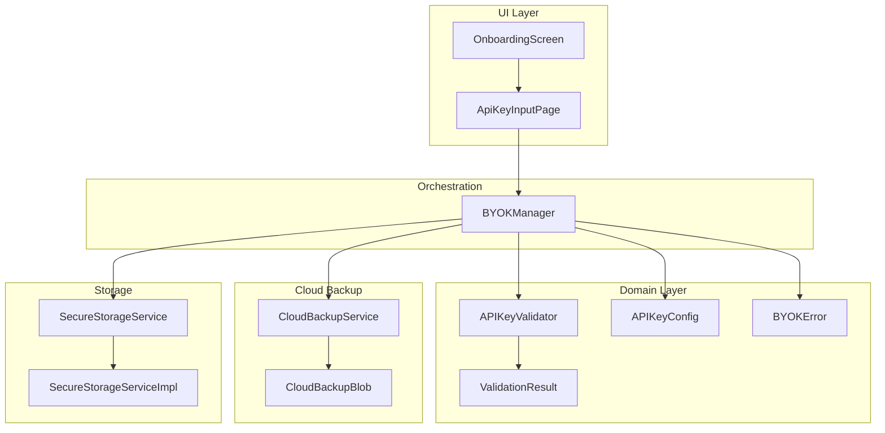
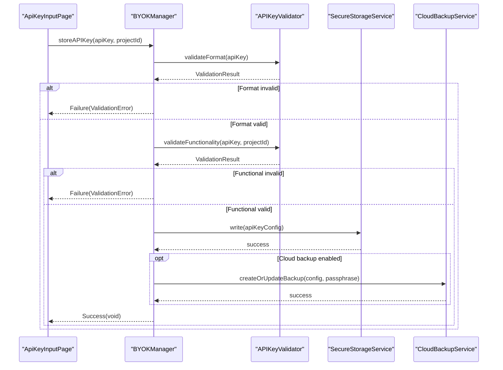
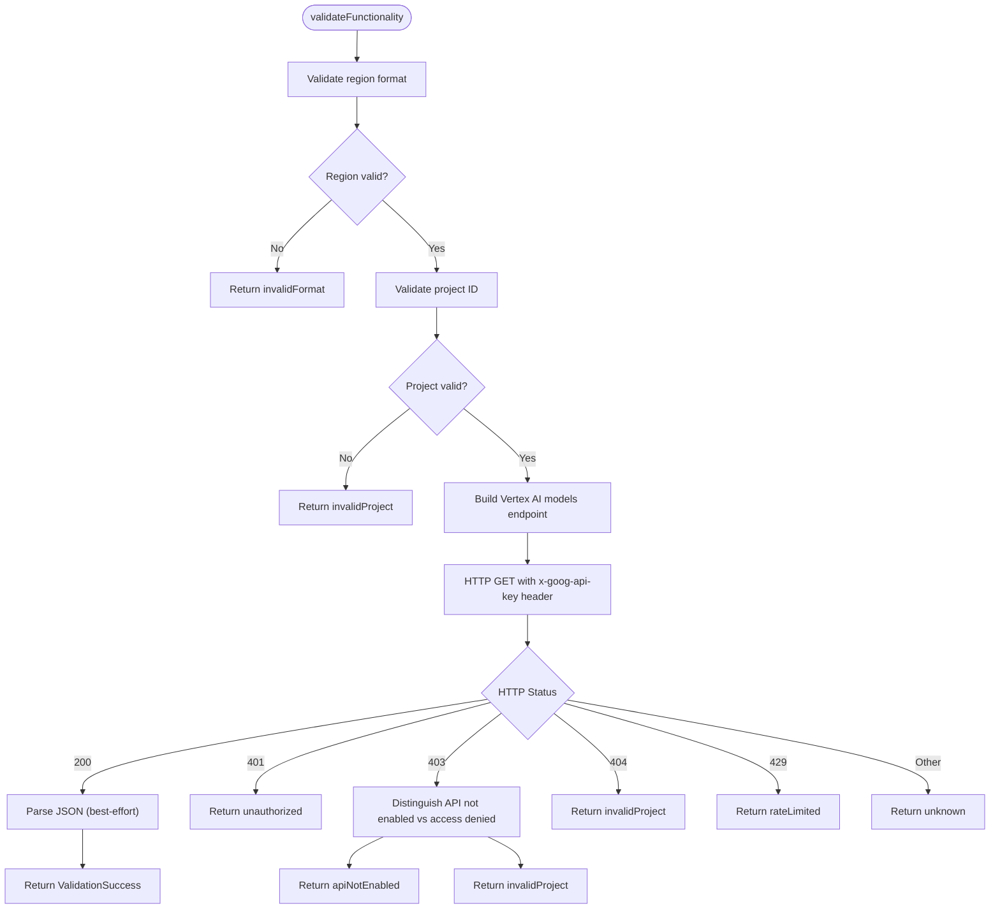
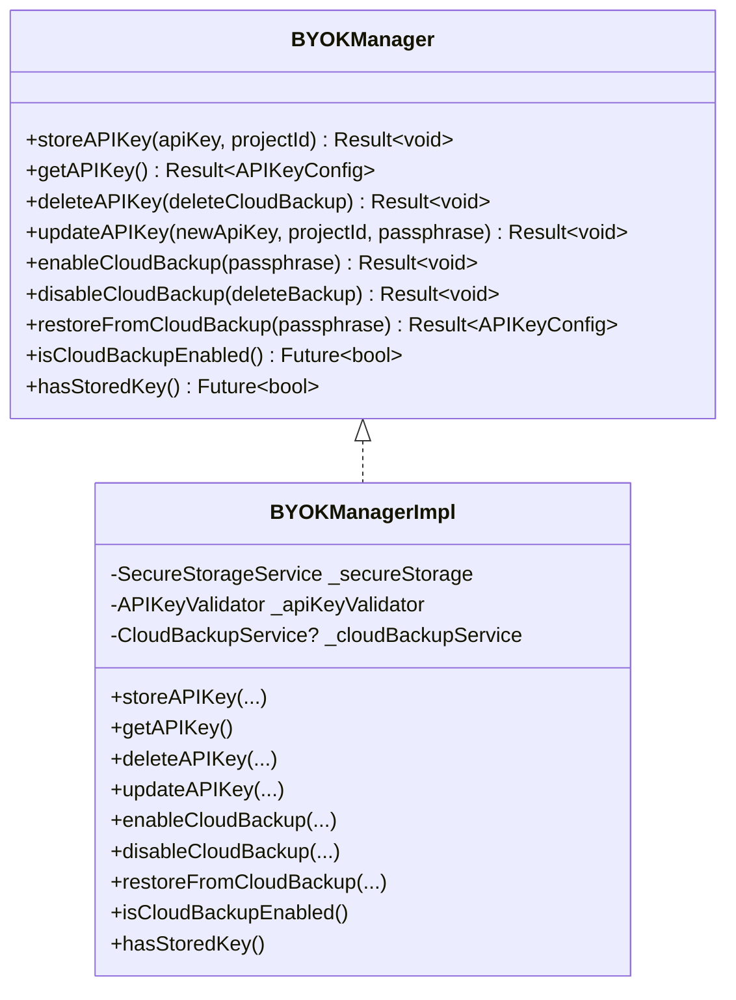
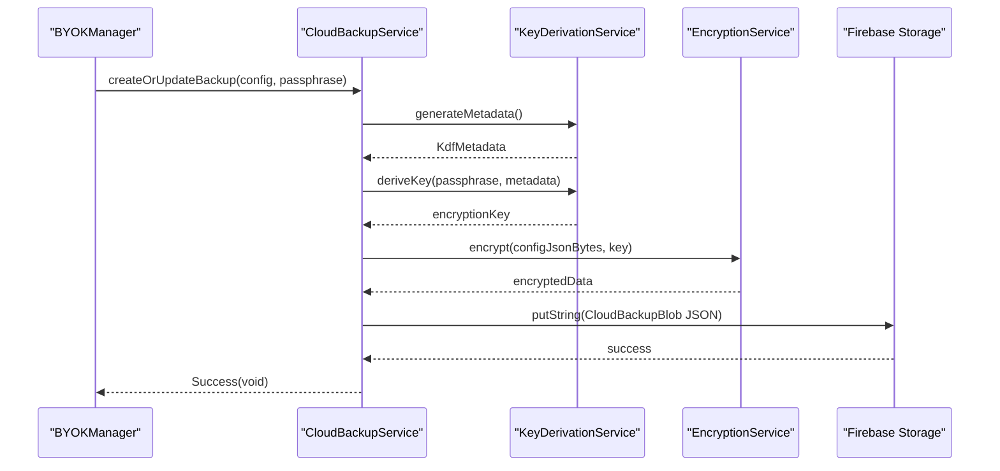
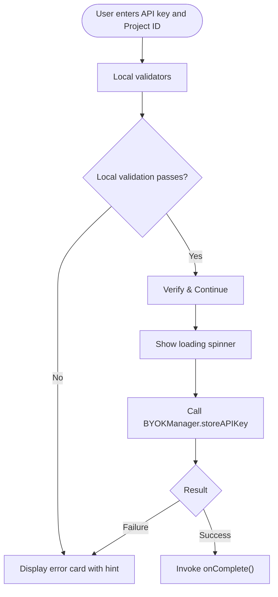
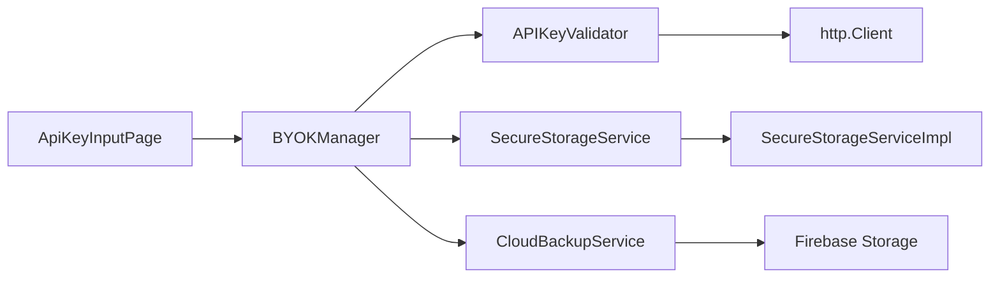

# API Key Management

<cite>
**Referenced Files in This Document**
- [api_key_validator.dart](file://lib/core/byok/api_key_validator.dart)
- [validation_result.dart](file://lib/core/byok/models/validation_result.dart)
- [api_key_config.dart](file://lib/core/byok/models/api_key_config.dart)
- [byok_manager.dart](file://lib/core/byok/byok_manager.dart)
- [cloud_backup_service.dart](file://lib/core/byok/cloud_backup_service.dart)
- [cloud_backup_blob.dart](file://lib/core/byok/models/cloud_backup_blob.dart)
- [byok_storage_keys.dart](file://lib/core/byok/byok_storage_keys.dart)
- [byok_error.dart](file://lib/core/byok/models/byok_error.dart)
- [secure_storage_service.dart](file://lib/core/storage/secure_storage_service.dart)
- [secure_storage_service_impl.dart](file://lib/core/storage/secure_storage_service_impl.dart)
- [api_key_input_page.dart](file://lib/features/onboarding/widgets/api_key_input_page.dart)
- [onboarding_screen.dart](file://lib/features/onboarding/onboarding_screen.dart)
- [byok_manager_test.dart](file://test/byok_manager_test.dart)
- [byok_properties_test.dart](file://test/byok_properties_test.dart)
- [cloud_backup_service_test.dart](file://test/cloud_backup_service_test.dart)
</cite>

## Table of Contents
1. [Introduction](#introduction)
2. [Project Structure](#project-structure)
3. [Core Components](#core-components)
4. [Architecture Overview](#architecture-overview)
5. [Detailed Component Analysis](#detailed-component-analysis)
6. [Dependency Analysis](#dependency-analysis)
7. [Performance Considerations](#performance-considerations)
8. [Troubleshooting Guide](#troubleshooting-guide)
9. [Conclusion](#conclusion)
10. [Appendices](#appendices)

## Introduction
This document explains the API Key Management functionality for secure storage and validation of Google Cloud Vertex AI API keys. It covers input validation, format checking, security validation, the APIKeyValidator implementation, the APIKeyConfig data model, validation result handling, error reporting, integration with the BYOK Manager for secure storage and cloud backup synchronization, user input validation patterns, real-time feedback mechanisms, error handling strategies, and security best practices. It also documents the validation workflow from input capture through final confirmation, including edge cases and failure scenarios.

## Project Structure
The API Key Management feature is organized around a set of cohesive modules under the BYOK (Bring Your Own Key) subsystem:
- Validation pipeline: APIKeyValidator and ValidationResult
- Data models: APIKeyConfig, ValidationFailureType, CloudBackupBlob
- Orchestrator: BYOKManager coordinating storage, validation, and cloud backup
- Cloud backup: CloudBackupService and CloudBackupBlob
- Secure storage: SecureStorageService and its implementation
- UI: ApiKeyInputPage widget and onboarding integration
- Tests: Unit and property-based tests validating behavior and edge cases

**Diagram sources**
- [onboarding_screen.dart](file://lib/features/onboarding/onboarding_screen.dart#L89-L110)
- [api_key_input_page.dart](file://lib/features/onboarding/widgets/api_key_input_page.dart#L10-L31)
- [byok_manager.dart](file://lib/core/byok/byok_manager.dart#L84-L147)
- [api_key_validator.dart](file://lib/core/byok/api_key_validator.dart#L14-L48)
- [validation_result.dart](file://lib/core/byok/models/validation_result.dart#L5-L7)
- [api_key_config.dart](file://lib/core/byok/models/api_key_config.dart#L5-L32)
- [cloud_backup_service.dart](file://lib/core/byok/cloud_backup_service.dart#L21-L91)
- [cloud_backup_blob.dart](file://lib/core/byok/models/cloud_backup_blob.dart#L8-L38)
- [secure_storage_service.dart](file://lib/core/storage/secure_storage_service.dart#L11-L29)
- [secure_storage_service_impl.dart](file://lib/core/storage/secure_storage_service_impl.dart#L7-L105)

**Section sources**
- [onboarding_screen.dart](file://lib/features/onboarding/onboarding_screen.dart#L89-L110)
- [api_key_input_page.dart](file://lib/features/onboarding/widgets/api_key_input_page.dart#L10-L31)

## Core Components
- APIKeyValidator: Provides format and functional validation for API keys and projects, and performs a live test call to Vertex AI.
- ValidationResult hierarchy: Sealed class with ValidationSuccess and ValidationFailure, plus ValidationFailureType enumeration.
- APIKeyConfig: Immutable data model for stored API key configuration with serialization and deserialization.
- BYOKManager: Orchestrates validation, secure storage, retrieval, deletion, and cloud backup operations.
- CloudBackupService: Manages encrypted cloud backup using client-side encryption and Firebase Storage.
- SecureStorageService: Abstraction for platform-native secure storage with hardware/software-backed implementations.
- UI: ApiKeyInputPage captures user input, validates locally, and triggers validation and storage.

**Section sources**
- [api_key_validator.dart](file://lib/core/byok/api_key_validator.dart#L14-L48)
- [validation_result.dart](file://lib/core/byok/models/validation_result.dart#L5-L187)
- [api_key_config.dart](file://lib/core/byok/models/api_key_config.dart#L5-L109)
- [byok_manager.dart](file://lib/core/byok/byok_manager.dart#L84-L147)
- [cloud_backup_service.dart](file://lib/core/byok/cloud_backup_service.dart#L21-L91)
- [secure_storage_service.dart](file://lib/core/storage/secure_storage_service.dart#L11-L29)
- [api_key_input_page.dart](file://lib/features/onboarding/widgets/api_key_input_page.dart#L12-L31)

## Architecture Overview
The API Key Management architecture follows a layered design:
- UI layer captures input and delegates to the orchestrator.
- Domain layer enforces validation rules and defines data models.
- Orchestration layer coordinates validation, storage, and cloud backup.
- Storage layer persists data securely on-device.
- Cloud backup layer encrypts and synchronizes data to the cloud.

**Diagram sources**
- [api_key_input_page.dart](file://lib/features/onboarding/widgets/api_key_input_page.dart#L252-L307)
- [byok_manager.dart](file://lib/core/byok/byok_manager.dart#L182-L231)
- [api_key_validator.dart](file://lib/core/byok/api_key_validator.dart#L111-L150)
- [cloud_backup_service.dart](file://lib/core/byok/cloud_backup_service.dart#L166-L249)

## Detailed Component Analysis

### APIKeyValidator Implementation
APIKeyValidator provides two-tier validation:
- Format validation: checks prefix, length, and character set without network calls.
- Functional validation: performs a live request to Vertex AI to confirm key usability.

Key validation rules:
- Prefix: must start with the expected Google API key prefix.
- Length: must be exactly the expected length for Vertex AI keys.
- Characters: only alphanumeric, underscore, and hyphen are allowed.
- Region and Project ID: validated before constructing the endpoint URL to prevent injection.

Error handling:
- Network timeouts and socket exceptions are captured and reported as network errors.
- HTTP 401 Unauthorized, 403 Access Denied, 404 Not Found, and 429 Rate Limited are mapped to specific failure types.
- Generic HTTP errors and unexpected conditions are reported as unknown errors.

**Diagram sources**
- [api_key_validator.dart](file://lib/core/byok/api_key_validator.dart#L152-L224)
- [api_key_validator.dart](file://lib/core/byok/api_key_validator.dart#L226-L272)
- [api_key_validator.dart](file://lib/core/byok/api_key_validator.dart#L274-L308)

**Section sources**
- [api_key_validator.dart](file://lib/core/byok/api_key_validator.dart#L14-L48)
- [api_key_validator.dart](file://lib/core/byok/api_key_validator.dart#L111-L150)
- [api_key_validator.dart](file://lib/core/byok/api_key_validator.dart#L152-L224)
- [api_key_validator.dart](file://lib/core/byok/api_key_validator.dart#L226-L308)

### ValidationResult and ValidationFailureType
ValidationResult is a sealed class with:
- ValidationSuccess: carries optional metadata (e.g., models list) from the functional validation.
- ValidationFailure: carries type, message, optional error code, and original error.

ValidationFailureType enumerates all failure categories:
- invalidFormat, malformedKey, unauthorized, invalidProject, apiNotEnabled, networkError, rateLimited, unknown.

Deep equality and hashing helpers are included for ValidationSuccess metadata to ensure deterministic comparisons.

**Section sources**
- [validation_result.dart](file://lib/core/byok/models/validation_result.dart#L5-L187)

### APIKeyConfig Data Model
APIKeyConfig represents the persisted configuration:
- Fields: apiKey, projectId, createdAt, lastValidated, cloudBackupEnabled, idempotencyKey.
- Serialization: toJson encodes dates as ISO strings; fromJson parses them back.
- Copy semantics: copyWith enables immutable updates.
- Equality and hashing: deep equality for metadata and robust hashing for collections.

**Section sources**
- [api_key_config.dart](file://lib/core/byok/models/api_key_config.dart#L5-L109)

### BYOKManager Orchestration
BYOKManager coordinates the entire lifecycle:
- storeAPIKey: trims input, validates format, validates functionality, creates APIKeyConfig, writes to secure storage, optionally updates cloud backup.
- getAPIKey: reads and parses stored configuration.
- deleteAPIKey: removes local configuration and optionally cloud backup.
- updateAPIKey: validates new key, preserves metadata, updates local config, optionally re-encrypts cloud backup.
- enableCloudBackup/disableCloudBackup/restoreFromCloudBackup/rotateBackupPassphrase: manage cloud backup lifecycle.
- Utility queries: hasStoredKey, isCloudBackupEnabled.

Error handling:
- Wraps validation failures in ValidationError.
- Wraps storage/network/cloud errors in StorageError/BackupError/CryptoError.
- Logs and tolerates non-critical failures during cloud backup cleanup.

**Diagram sources**
- [byok_manager.dart](file://lib/core/byok/byok_manager.dart#L84-L147)
- [byok_manager.dart](file://lib/core/byok/byok_manager.dart#L153-L549)

**Section sources**
- [byok_manager.dart](file://lib/core/byok/byok_manager.dart#L182-L231)
- [byok_manager.dart](file://lib/core/byok/byok_manager.dart#L233-L256)
- [byok_manager.dart](file://lib/core/byok/byok_manager.dart#L258-L295)
- [byok_manager.dart](file://lib/core/byok/byok_manager.dart#L297-L384)
- [byok_manager.dart](file://lib/core/byok/byok_manager.dart#L386-L429)
- [byok_manager.dart](file://lib/core/byok/byok_manager.dart#L431-L466)
- [byok_manager.dart](file://lib/core/byok/byok_manager.dart#L468-L502)
- [byok_manager.dart](file://lib/core/byok/byok_manager.dart#L504-L524)
- [byok_manager.dart](file://lib/core/byok/byok_manager.dart#L526-L541)

### Cloud Backup Integration
CloudBackupService manages encrypted cloud backups:
- createOrUpdateBackup: derives key from passphrase, encrypts APIKeyConfig, uploads CloudBackupBlob to Firebase Storage.
- restoreBackup: downloads and decrypts backup using passphrase-derived key.
- deleteBackup/backupExists/rotatePassphrase: lifecycle and rotation operations with careful error handling and network detection.
- CloudBackupBlob: schema versioning, KDF metadata, base64-encoded encrypted payload, timestamps.

**Diagram sources**
- [cloud_backup_service.dart](file://lib/core/byok/cloud_backup_service.dart#L166-L249)
- [cloud_backup_service.dart](file://lib/core/byok/cloud_backup_service.dart#L251-L317)

**Section sources**
- [cloud_backup_service.dart](file://lib/core/byok/cloud_backup_service.dart#L21-L91)
- [cloud_backup_service.dart](file://lib/core/byok/cloud_backup_service.dart#L166-L249)
- [cloud_backup_service.dart](file://lib/core/byok/cloud_backup_service.dart#L251-L317)
- [cloud_backup_service.dart](file://lib/core/byok/cloud_backup_service.dart#L413-L554)
- [cloud_backup_blob.dart](file://lib/core/byok/models/cloud_backup_blob.dart#L8-L156)

### Secure Storage
SecureStorageService abstracts platform-native secure storage:
- Methods: write, read, delete, deleteAll, backend, requiresBiometric.
- Implementation: SecureStorageServiceImpl selects hardware-backed storage on Android/iOS and falls back to software when needed.

**Section sources**
- [secure_storage_service.dart](file://lib/core/storage/secure_storage_service.dart#L11-L29)
- [secure_storage_service_impl.dart](file://lib/core/storage/secure_storage_service_impl.dart#L7-L105)

### UI Input Validation and Real-Time Feedback
The ApiKeyInputPage provides:
- Local validation for API key prefix and length, and for Project ID format.
- Real-time feedback via an error card with contextual icons and hints.
- Loading state during validation and storage.
- Navigation callbacks for completion and back actions.

**Diagram sources**
- [api_key_input_page.dart](file://lib/features/onboarding/widgets/api_key_input_page.dart#L222-L250)
- [api_key_input_page.dart](file://lib/features/onboarding/widgets/api_key_input_page.dart#L252-L307)

**Section sources**
- [api_key_input_page.dart](file://lib/features/onboarding/widgets/api_key_input_page.dart#L120-L220)
- [api_key_input_page.dart](file://lib/features/onboarding/widgets/api_key_input_page.dart#L222-L250)
- [api_key_input_page.dart](file://lib/features/onboarding/widgets/api_key_input_page.dart#L252-L307)
- [onboarding_screen.dart](file://lib/features/onboarding/onboarding_screen.dart#L89-L110)

## Dependency Analysis
- BYOKManager depends on SecureStorageService, APIKeyValidator, and CloudBackupService.
- APIKeyValidator depends on http.Client and uses regular expressions for validation.
- CloudBackupService depends on Firebase Storage, KeyDerivationService, and EncryptionService.
- SecureStorageServiceImpl adapts to platform capabilities (Android Keystore, iOS Keychain, software fallback).

**Diagram sources**
- [byok_manager.dart](file://lib/core/byok/byok_manager.dart#L172-L180)
- [api_key_validator.dart](file://lib/core/byok/api_key_validator.dart#L57-L80)
- [cloud_backup_service.dart](file://lib/core/byok/cloud_backup_service.dart#L97-L119)
- [secure_storage_service_impl.dart](file://lib/core/storage/secure_storage_service_impl.dart#L7-L105)

**Section sources**
- [byok_manager.dart](file://lib/core/byok/byok_manager.dart#L172-L180)
- [api_key_validator.dart](file://lib/core/byok/api_key_validator.dart#L57-L80)
- [cloud_backup_service.dart](file://lib/core/byok/cloud_backup_service.dart#L97-L119)
- [secure_storage_service_impl.dart](file://lib/core/storage/secure_storage_service_impl.dart#L7-L105)

## Performance Considerations
- Validation is split into fast local checks and a single network call; early exit prevents unnecessary network traffic.
- HTTP client reuse avoids connection overhead; timeout is configured to balance responsiveness and reliability.
- Cloud backup operations serialize JSON and encrypt in-memory; consider batching and avoiding redundant uploads.
- Secure storage operations are asynchronous; batch related writes when possible to minimize IO churn.

[No sources needed since this section provides general guidance]

## Troubleshooting Guide
Common issues and resolutions:
- Invalid API key format: Ensure the key starts with the expected prefix and is exactly the expected length.
- Malformed key: Confirm only allowed characters are used.
- Unauthorized: Verify the key is correct and not revoked; check API key restrictions.
- Invalid project: Confirm the project ID exists and matches the expected format.
- API not enabled: Enable Vertex AI API in the Google Cloud Console.
- Network errors: Check connectivity; retries may be needed for transient failures.
- Rate limited: Wait before retrying; reduce frequency of validation attempts.
- Cloud backup errors: Verify passphrase correctness; check backup existence and network status.

Error reporting:
- UI surfaces ValidationFailureType-specific messages and icons for quick diagnosis.
- BYOKError wraps underlying causes for precise logging and recovery.

**Section sources**
- [api_key_validator.dart](file://lib/core/byok/api_key_validator.dart#L226-L308)
- [byok_error.dart](file://lib/core/byok/models/byok_error.dart#L17-L93)
- [api_key_input_page.dart](file://lib/features/onboarding/widgets/api_key_input_page.dart#L310-L422)

## Conclusion
The API Key Management system provides robust, layered validation and secure storage of Vertex AI API keys. It combines fast local checks with functional validation against Google Cloud services, persists data securely on-device, and optionally backs up encrypted configurations to the cloud. The UI delivers immediate feedback, and the orchestration layer ensures consistent error handling and recovery. Together, these components deliver a secure, reliable, and user-friendly API key management experience.

[No sources needed since this section summarizes without analyzing specific files]

## Appendices

### Validation Workflow Summary
- Input capture: ApiKeyInputPage collects API key and Project ID.
- Local validation: Prefix, length, and project ID format checks.
- Remote validation: Functional validation via Vertex AI endpoint.
- Storage: Persist APIKeyConfig in secure storage; optionally update cloud backup.
- Confirmation: Success callback navigates to next onboarding step.

**Section sources**
- [api_key_input_page.dart](file://lib/features/onboarding/widgets/api_key_input_page.dart#L252-L307)
- [byok_manager.dart](file://lib/core/byok/byok_manager.dart#L182-L231)

### Security Best Practices
- Never transmit raw API keys outside the device; validation occurs via a dedicated endpoint with the key header.
- Use hardware-backed secure storage when available; fallback gracefully to software-backed storage.
- Encrypt cloud backups with a passphrase-derived key; never store unencrypted keys.
- Validate regions and project IDs before constructing URLs to prevent injection.
- Preserve createdAt timestamps and maintain idempotency keys for auditability.

**Section sources**
- [api_key_validator.dart](file://lib/core/byok/api_key_validator.dart#L158-L179)
- [secure_storage_service_impl.dart](file://lib/core/storage/secure_storage_service_impl.dart#L37-L62)
- [cloud_backup_service.dart](file://lib/core/byok/cloud_backup_service.dart#L166-L249)

### Functional Testing Against Vertex AI Services
- Unit tests simulate HTTP responses and verify mapping of statuses to ValidationFailureType.
- Property-based tests validate format and functional pipelines across large input spaces.
- Cloud backup tests verify serialization, versioning, and error categorization.

**Section sources**
- [byok_manager_test.dart](file://test/byok_manager_test.dart#L267-L328)
- [byok_properties_test.dart](file://test/byok_properties_test.dart#L246-L594)
- [cloud_backup_service_test.dart](file://test/cloud_backup_service_test.dart#L13-L292)