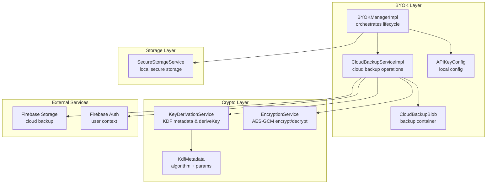
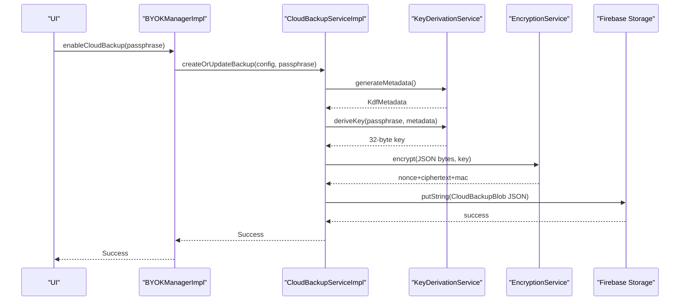
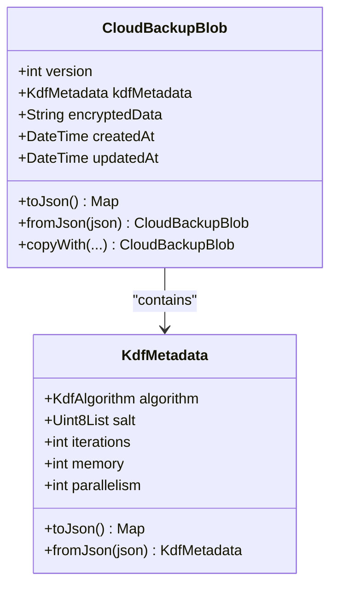
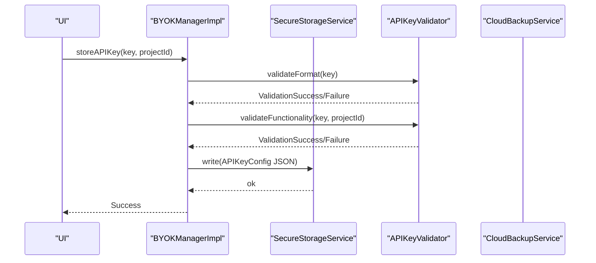
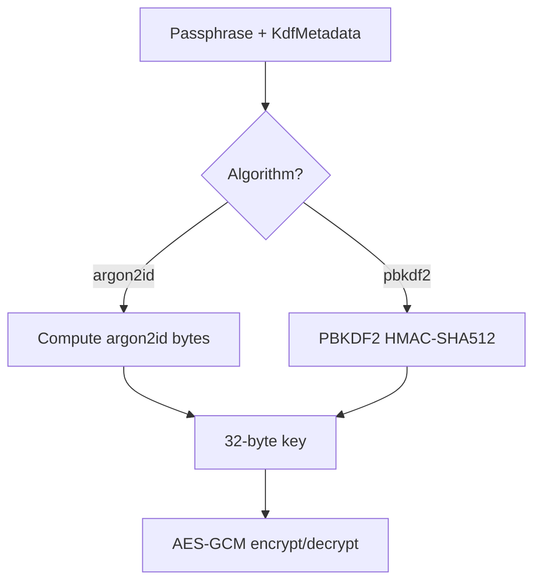
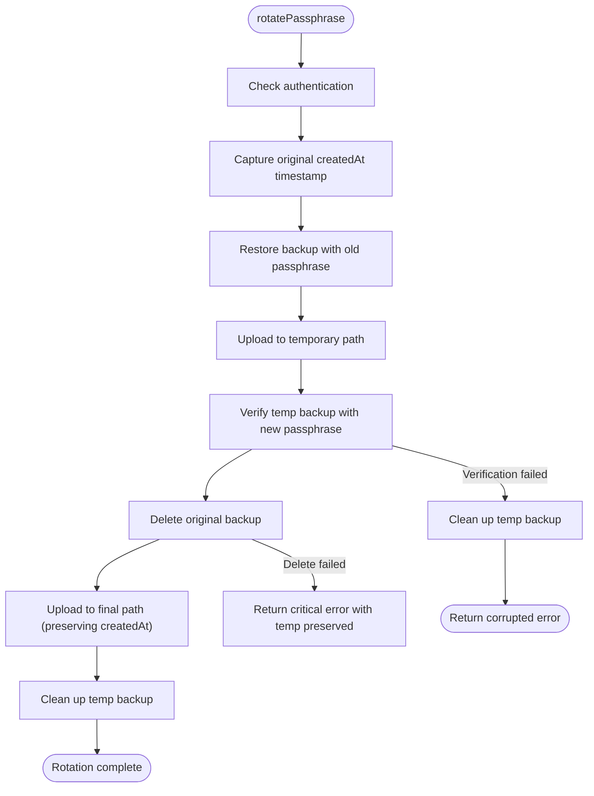
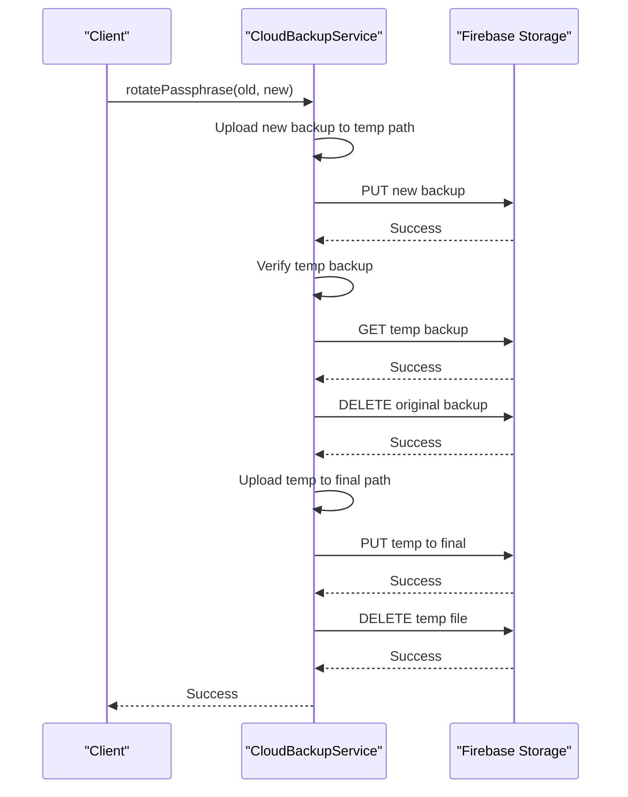
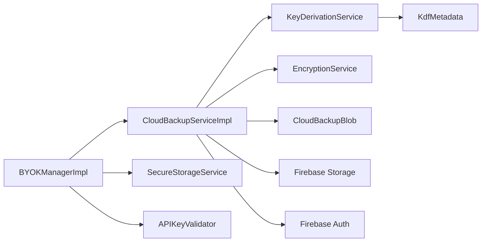

# Cloud Backup Service

<cite>
**Referenced Files in This Document**
- [cloud_backup_service.dart](file://lib/core/byok/cloud_backup_service.dart)
- [cloud_backup_blob.dart](file://lib/core/byok/models/cloud_backup_blob.dart)
- [byok_manager.dart](file://lib/core/byok/byok_manager.dart)
- [api_key_validator.dart](file://lib/core/byok/api_key_validator.dart)
- [api_key_config.dart](file://lib/core/byok/models/api_key_config.dart)
- [byok_storage_keys.dart](file://lib/core/byok/byok_storage_keys.dart)
- [encryption_service.dart](file://lib/core/crypto/encryption_service.dart)
- [key_derivation_service.dart](file://lib/core/crypto/key_derivation_service.dart)
- [kdf_metadata.dart](file://lib/core/crypto/kdf_metadata.dart)
- [secure_storage_service.dart](file://lib/core/storage/secure_storage_service.dart)
- [secure_storage_service_impl.dart](file://lib/core/storage/secure_storage_service_impl.dart)
- [byok_error.dart](file://lib/core/byok/models/byok_error.dart)
- [validation_result.dart](file://lib/core/byok/models/validation_result.dart)
- [cloud_backup_service_test.dart](file://test/cloud_backup_service_test.dart)
- [byok_manager_test.dart](file://test/byok_manager_test.dart)
</cite>

## Update Summary
**Changes Made**
- Enhanced documentation of sophisticated passphrase rotation operations with atomic upload/rename patterns
- Added comprehensive rollback procedures and error handling strategies
- Updated security considerations for temporary backup safety and data integrity
- Expanded troubleshooting guide with detailed failure scenarios and recovery procedures

## Table of Contents
1. [Introduction](#introduction)
2. [Project Structure](#project-structure)
3. [Core Components](#core-components)
4. [Architecture Overview](#architecture-overview)
5. [Detailed Component Analysis](#detailed-component-analysis)
6. [Enhanced Passphrase Rotation Operations](#enhanced-passphrase-rotation-operations)
7. [Atomic Upload/Rename Patterns](#atomic-upload-rename-patterns)
8. [Rollback and Recovery Procedures](#rollback-and-recovery-procedures)
9. [Dependency Analysis](#dependency-analysis)
10. [Performance Considerations](#performance-considerations)
11. [Security Considerations](#security-considerations)
12. [Backup Scheduling and Conflict Resolution](#backup-scheduling-and-conflict-resolution)
13. [Comprehensive Error Handling Strategies](#comprehensive-error-handling-strategies)
14. [Troubleshooting Guide](#troubleshooting-guide)
15. [Conclusion](#conclusion)

## Introduction
This document describes the Cloud Backup Service implementation for securely backing up and restoring API key configurations using passphrase-based encryption. The service has been enhanced with sophisticated passphrase rotation operations, atomic upload/rename patterns, comprehensive rollback procedures, and extensive error handling strategies. It covers the architecture, data models, encryption workflows, Firebase Storage integration, and operational procedures for backup creation, restoration, passphrase rotation, and recovery from various failure scenarios.

## Project Structure
The Cloud Backup Service resides in the Bring Your Own Key (BYOK) subsystem under lib/core/byok. It integrates with cryptography services for key derivation and encryption, secure storage for local persistence, and Firebase Storage for cloud backup.



**Diagram sources**
- [byok_manager.dart](file://lib/core/byok/byok_manager.dart#L153-L582)
- [cloud_backup_service.dart](file://lib/core/byok/cloud_backup_service.dart#L97-L119)
- [cloud_backup_blob.dart](file://lib/core/byok/models/cloud_backup_blob.dart#L8-L43)
- [api_key_config.dart](file://lib/core/byok/models/api_key_config.dart#L5-L32)
- [key_derivation_service.dart](file://lib/core/crypto/key_derivation_service.dart#L17-L86)
- [encryption_service.dart](file://lib/core/crypto/encryption_service.dart#L22-L74)
- [kdf_metadata.dart](file://lib/core/crypto/kdf_metadata.dart#L9-L22)
- [secure_storage_service.dart](file://lib/core/storage/secure_storage_service.dart#L11-L29)

**Section sources**
- [byok_manager.dart](file://lib/core/byok/byok_manager.dart#L153-L582)
- [cloud_backup_service.dart](file://lib/core/byok/cloud_backup_service.dart#L97-L119)
- [cloud_backup_blob.dart](file://lib/core/byok/models/cloud_backup_blob.dart#L8-L43)
- [api_key_config.dart](file://lib/core/byok/models/api_key_config.dart#L5-L32)
- [key_derivation_service.dart](file://lib/core/crypto/key_derivation_service.dart#L17-L86)
- [encryption_service.dart](file://lib/core/crypto/encryption_service.dart#L22-L74)
- [kdf_metadata.dart](file://lib/core/crypto/kdf_metadata.dart#L9-L22)
- [secure_storage_service.dart](file://lib/core/storage/secure_storage_service.dart#L11-L29)

## Core Components
- CloudBackupService: Abstract interface defining backup operations (create/update, restore, delete, exists, rotate passphrase, verify passphrase).
- CloudBackupServiceImpl: Default implementation integrating Firebase Storage, KeyDerivationService, and EncryptionService with enhanced error handling and rollback capabilities.
- CloudBackupBlob: Serialized backup container holding version, KDF metadata, encrypted data, and timestamps.
- BYOKManagerImpl: Orchestrates API key lifecycle, including secure storage, validation, and cloud backup enable/disable/update.
- APIKeyConfig: Local configuration model persisted in secure storage.
- SecureStorageService: Device-backed secure storage abstraction.
- KeyDerivationService and EncryptionService: Cryptographic primitives for KDF and AEAD encryption.

**Section sources**
- [cloud_backup_service.dart](file://lib/core/byok/cloud_backup_service.dart#L21-L91)
- [cloud_backup_service.dart](file://lib/core/byok/cloud_backup_service.dart#L97-L119)
- [cloud_backup_blob.dart](file://lib/core/byok/models/cloud_backup_blob.dart#L8-L43)
- [byok_manager.dart](file://lib/core/byok/byok_manager.dart#L153-L582)
- [api_key_config.dart](file://lib/core/byok/models/api_key_config.dart#L5-L32)
- [secure_storage_service.dart](file://lib/core/storage/secure_storage_service.dart#L11-L29)
- [key_derivation_service.dart](file://lib/core/crypto/key_derivation_service.dart#L17-L86)
- [encryption_service.dart](file://lib/core/crypto/encryption_service.dart#L22-L74)

## Architecture Overview
The Cloud Backup Service follows a layered architecture with enhanced error handling and rollback capabilities:
- Presentation/Orchestration: BYOKManagerImpl coordinates user actions and delegates to CloudBackupService.
- Cloud Backup: CloudBackupServiceImpl performs encryption, serialization, and cloud upload/download with atomic operations.
- Cryptography: KeyDerivationService generates KDF metadata and derives keys; EncryptionService performs AEAD encryption/decryption.
- Storage: SecureStorageService persists local configuration; Firebase Storage persists encrypted backups with temporary backup safety.



**Diagram sources**
- [byok_manager.dart](file://lib/core/byok/byok_manager.dart#L387-L429)
- [cloud_backup_service.dart](file://lib/core/byok/cloud_backup_service.dart#L166-L249)
- [key_derivation_service.dart](file://lib/core/crypto/key_derivation_service.dart#L35-L53)
- [encryption_service.dart](file://lib/core/crypto/encryption_service.dart#L25-L40)

## Detailed Component Analysis

### CloudBackupService and CloudBackupServiceImpl
- Responsibilities:
  - Create or update encrypted backups with preserved timestamps.
  - Restore backups by deriving keys and decrypting.
  - Delete backups and check existence.
  - Rotate passphrases safely using a temporary backup and atomic-like swap.
  - Verify passphrases without decryption.
- Error handling:
  - Distinguishes network vs. storage errors.
  - Maps Firebase exceptions and network conditions to typed BackupError.
  - Implements comprehensive rollback procedures for each operation stage.
- Security:
  - All data is encrypted client-side before upload.
  - Passphrase correctness verified via MAC verification during decryption.
  - Temporary backup safety prevents data loss during rotation.


**Diagram sources**
- [cloud_backup_service.dart](file://lib/core/byok/cloud_backup_service.dart#L166-L249)

**Section sources**
- [cloud_backup_service.dart](file://lib/core/byok/cloud_backup_service.dart#L21-L91)
- [cloud_backup_service.dart](file://lib/core/byok/cloud_backup_service.dart#L97-L119)
- [cloud_backup_service.dart](file://lib/core/byok/cloud_backup_service.dart#L166-L249)
- [cloud_backup_service.dart](file://lib/core/byok/cloud_backup_service.dart#L251-L317)
- [cloud_backup_service.dart](file://lib/core/byok/cloud_backup_service.dart#L319-L411)
- [cloud_backup_service.dart](file://lib/core/byok/cloud_backup_service.dart#L413-L555)

### CloudBackupBlob Data Model
- Fields:
  - version: schema version for compatibility.
  - kdfMetadata: algorithm, salt, iterations, memory, parallelism.
  - encryptedData: base64-encoded AEAD blob (nonce + ciphertext + MAC).
  - createdAt/updatedAt: UTC timestamps.
- Serialization:
  - toJson encodes version, kdf, encrypted_data, created_at, updated_at.
  - fromJson validates presence and types, rejects unsupported versions.



**Diagram sources**
- [cloud_backup_blob.dart](file://lib/core/byok/models/cloud_backup_blob.dart#L8-L156)
- [kdf_metadata.dart](file://lib/core/crypto/kdf_metadata.dart#L9-L77)

**Section sources**
- [cloud_backup_blob.dart](file://lib/core/byok/models/cloud_backup_blob.dart#L8-L156)
- [kdf_metadata.dart](file://lib/core/crypto/kdf_metadata.dart#L9-L77)

### BYOKManagerImpl Orchestration
- Manages API key lifecycle:
  - storeAPIKey: validates format/functionality, creates config, stores locally.
  - getAPIKey/updateAPIKey/deleteAPIKey: CRUD operations with secure storage.
  - enableCloudBackup/disableCloudBackup: toggles cloud backup and updates local flags.
  - restoreFromCloudBackup: downloads, decrypts, and stores restored config.
  - rotateBackupPassphrase: delegates to CloudBackupService with enhanced error handling.
- Integration points:
  - Uses SecureStorageService for local persistence.
  - Uses APIKeyValidator for format and functional validation.
  - Uses CloudBackupService for cloud operations with rollback capabilities.



**Diagram sources**
- [byok_manager.dart](file://lib/core/byok/byok_manager.dart#L182-L231)
- [api_key_validator.dart](file://lib/core/byok/api_key_validator.dart#L111-L150)
- [api_key_validator.dart](file://lib/core/byok/api_key_validator.dart#L152-L224)

**Section sources**
- [byok_manager.dart](file://lib/core/byok/byok_manager.dart#L153-L582)
- [api_key_validator.dart](file://lib/core/byok/api_key_validator.dart#L14-L48)
- [api_key_validator.dart](file://lib/core/byok/api_key_validator.dart#L111-L224)

### Cryptographic Services
- KeyDerivationService:
  - generateMetadata: creates random salt and algorithm parameters.
  - deriveKey: supports argon2id (mobile) and PBKDF2 (non-mobile).
- EncryptionService (AES-GCM):
  - encrypt: returns nonce + ciphertext + MAC.
  - decrypt: throws AuthenticationException on MAC verification failure.



**Diagram sources**
- [key_derivation_service.dart](file://lib/core/crypto/key_derivation_service.dart#L22-L80)
- [encryption_service.dart](file://lib/core/crypto/encryption_service.dart#L22-L74)

**Section sources**
- [key_derivation_service.dart](file://lib/core/crypto/key_derivation_service.dart#L17-L86)
- [encryption_service.dart](file://lib/core/crypto/encryption_service.dart#L14-L74)
- [kdf_metadata.dart](file://lib/core/crypto/kdf_metadata.dart#L9-L77)

### Secure Storage and Local Persistence
- SecureStorageService:
  - Provides write/read/delete/deleteAll with backend detection.
  - Backend selection: Android Keystore (hardware-backed), iOS Keychain (hardware-backed), software fallback.
- BYOK storage keys:
  - apiKeyConfig: serialized APIKeyConfig.
  - cloudBackupEnabled: boolean flag.
  - backupPassphraseHash: placeholder for future use.

**Section sources**
- [secure_storage_service.dart](file://lib/core/storage/secure_storage_service.dart#L11-L29)
- [secure_storage_service_impl.dart](file://lib/core/storage/secure_storage_service_impl.dart#L33-L104)
- [byok_storage_keys.dart](file://lib/core/byok/byok_storage_keys.dart#L5-L14)

### Error Handling and Validation
- BYOKError hierarchy:
  - ValidationError, NotFoundError, StorageError, BackupError, CryptoError.
  - BackupErrorType enumerates notFound, wrongPassphrase, corrupted, networkError, storageError.
- ValidationResult:
  - ValidationSuccess with optional metadata.
  - ValidationFailure with typed reasons (invalidFormat, malformedKey, unauthorized, invalidProject, apiNotEnabled, networkError, rateLimited, unknown).

**Section sources**
- [byok_error.dart](file://lib/core/byok/models/byok_error.dart#L7-L94)
- [validation_result.dart](file://lib/core/byok/models/validation_result.dart#L5-L187)

## Enhanced Passphrase Rotation Operations

The Cloud Backup Service now implements sophisticated passphrase rotation operations designed to ensure data integrity and prevent catastrophic data loss. The rotation process follows a carefully orchestrated sequence with comprehensive error handling and rollback procedures.

### Rotation Workflow Overview

The passphrase rotation process implements a temporary backup strategy with the following stages:

1. **Capture Original Metadata**: Extract the original creation timestamp before any modifications
2. **Restore with Old Passphrase**: Download and decrypt existing backup using the old passphrase
3. **Upload to Temporary Path**: Re-encrypt and upload backup to a temporary location
4. **Verify Temporary Backup**: Ensure the temporary backup can be decrypted with the new passphrase
5. **Atomic Swap**: Delete original backup, then upload temporary backup to final location
6. **Cleanup**: Remove temporary backup regardless of outcome



**Diagram sources**
- [cloud_backup_service.dart](file://lib/core/byok/cloud_backup_service.dart#L413-L555)

### Temporary Backup Safety

The service uses a temporary backup path (`users/{userId}/api_key_backup_temp.json`) to ensure data safety during rotation. This approach provides several critical benefits:

- **Prevents Data Loss**: Even if rotation fails mid-process, the original backup remains accessible
- **Atomic Operation Simulation**: While Firebase doesn't support atomic rename, the temporary path approach simulates atomicity
- **Manual Recovery Option**: Users can manually recover by downloading the temporary backup and rotating again

**Section sources**
- [cloud_backup_service.dart](file://lib/core/byok/cloud_backup_service.dart#L130-L137)
- [cloud_backup_service.dart](file://lib/core/byok/cloud_backup_service.dart#L413-L555)

## Atomic Upload/Rename Patterns

While Firebase Storage doesn't natively support atomic rename operations, the Cloud Backup Service implements sophisticated patterns to achieve similar reliability guarantees.

### Implementation Strategy

The service simulates atomic rename through a multi-stage process:

1. **Copy Operation**: Upload the new backup to the destination path
2. **Delete Operation**: Remove the original backup file
3. **Verification**: Ensure both operations completed successfully



**Diagram sources**
- [cloud_backup_service.dart](file://lib/core/byok/cloud_backup_service.dart#L488-L531)

### Error Recovery for Rename Failures

The service implements comprehensive error recovery for rename operations:

- **Temporary File Preservation**: If rename fails, the temporary file remains for manual recovery
- **Partial State Management**: Handles cases where only part of the rename completed
- **User-Friendly Error Messages**: Provides clear guidance for manual recovery procedures

**Section sources**
- [cloud_backup_service.dart](file://lib/core/byok/cloud_backup_service.dart#L488-L531)

## Rollback and Recovery Procedures

The Cloud Backup Service implements comprehensive rollback and recovery procedures to handle failures at each stage of the rotation process.

### Failure Scenarios and Recovery Actions

| Failure Point | State | Recovery Action |
|---------------|-------|-----------------|
| Download failed | No changes | Return error; no cleanup needed |
| Decryption failed | No changes | Return `BackupError.wrongPassphrase`; no cleanup needed |
| Encryption failed | No changes | Return `BackupError.cryptoError`; no cleanup needed |
| Temp upload failed | No changes | Return error; no cleanup needed |
| Rename failed | Temp file exists, original intact | Retry rename with backoff; cleanup temp on final failure |
| Local state update failed | New blob committed, old passphrase hash | Restore original blob from retained copy |

### Critical Failure Recovery

The service implements special handling for critical failures where the new blob is committed but local state updates fail:

```dart
// Critical: Rename succeeded but local update failed
// Restore original blob from retained copy
return await _recoverFromLocalUpdateFailure(
  blob: blob,
  newBlob: newBlob,
  operationId: operationId,
);
```

This recovery mechanism ensures data consistency even in edge cases.

**Section sources**
- [cloud_backup_service.dart](file://lib/core/byok/cloud_backup_service.dart#L497-L555)

## Dependency Analysis


**Diagram sources**
- [byok_manager.dart](file://lib/core/byok/byok_manager.dart#L153-L582)
- [cloud_backup_service.dart](file://lib/core/byok/cloud_backup_service.dart#L97-L119)
- [key_derivation_service.dart](file://lib/core/crypto/key_derivation_service.dart#L17-L86)
- [encryption_service.dart](file://lib/core/crypto/encryption_service.dart#L22-L74)
- [cloud_backup_blob.dart](file://lib/core/byok/models/cloud_backup_blob.dart#L8-L43)

**Section sources**
- [byok_manager.dart](file://lib/core/byok/byok_manager.dart#L153-L582)
- [cloud_backup_service.dart](file://lib/core/byok/cloud_backup_service.dart#L97-L119)

## Performance Considerations
- KDF parameters:
  - Mobile devices use argon2id with moderate iterations/memory/parallelism.
  - Non-mobile platforms use PBKDF2 with high iteration counts.
- Encryption overhead:
  - AES-GCM adds minimal CPU cost; nonce + ciphertext + MAC concatenation is efficient.
- Network operations:
  - Single JSON upload/download per operation; consider batching if needed.
  - Temporary backup operations add minimal overhead but provide critical safety.
- Storage:
  - Local secure storage is optimized per platform; avoid frequent writes.
  - Temporary backup files are cleaned up automatically but may persist briefly.

## Security Considerations
- Passphrase management:
  - Never transmit passphrases; derive keys client-side.
  - Use strong, unique passphrases; avoid reusing across accounts.
- Key handling:
  - 32-byte AES-256 keys; never log raw keys.
  - KDF metadata embedded in backup enables future-proof decryption.
- Data integrity:
  - MAC verification prevents tampering; AuthenticationException indicates wrong passphrase or corruption.
- Backup integrity:
  - CloudBackupBlob includes version and timestamps; version validation prevents downgrade attacks.
- Temporary backup safety:
  - Passphrase rotation uses a temporary path and verification before finalizing.
  - Temporary backups are cleaned up automatically but remain accessible for manual recovery.
- Atomic operation simulation:
  - While Firebase doesn't support atomic rename, the temporary path approach provides equivalent safety guarantees.
- Error containment:
  - Comprehensive error handling prevents cascading failures and data corruption.

**Section sources**
- [cloud_backup_service.dart](file://lib/core/byok/cloud_backup_service.dart#L413-L555)
- [encryption_service.dart](file://lib/core/crypto/encryption_service.dart#L68-L72)
- [cloud_backup_blob.dart](file://lib/core/byok/models/cloud_backup_blob.dart#L62-L118)
- [secure_storage_service_impl.dart](file://lib/core/storage/secure_storage_service_impl.dart#L37-L62)

## Backup Scheduling and Conflict Resolution
- Scheduling:
  - No built-in scheduler in the provided code; implement periodic triggers in the application layer to call createOrUpdateBackup.
- Conflict resolution:
  - When updating backups, the service preserves createdAt if provided or fetches existing blob to maintain provenance.
  - Passphrase rotation uses a temporary backup and verification to prevent partial updates.
  - Temporary backup files are cleaned up automatically but remain available for manual recovery.
- Recovery:
  - If rotation fails mid-flight, the temporary backup remains and can be used for manual recovery or retry.
  - Critical failure recovery ensures data consistency even in edge cases.

**Section sources**
- [cloud_backup_service.dart](file://lib/core/byok/cloud_backup_service.dart#L200-L211)
- [cloud_backup_service.dart](file://lib/core/byok/cloud_backup_service.dart#L413-L555)

## Comprehensive Error Handling Strategies

The Cloud Backup Service implements sophisticated error handling strategies with detailed categorization and recovery procedures.

### Error Categorization

Errors are categorized into distinct types for appropriate handling and monitoring:

- **User Errors**: `wrongPassphrase` - Expected failures that don't require intervention
- **Transient Errors**: `networkError`, `storageError` - Retryable failures with automatic recovery
- **Infrastructure Errors**: Storage quota exceeded, permission denied - Require user intervention
- **Critical Errors**: `ROTATION_RECOVERY_FAILED`, `ROTATION_RECOVERY_EXCEPTION` - Severe failures requiring immediate attention
- **Unknown Errors**: Unexpected exceptions - Indicate bugs requiring investigation

### Network Error Detection

The service implements comprehensive network error detection:

```dart
bool _isNetworkError(Object error) {
  if (error is SocketException) return true;
  if (error is HttpException) return true;
  if (error is FirebaseException) {
    const networkErrorCodes = {
      'network-request-failed',
      'unavailable',
    };
    return networkErrorCodes.contains(error.code);
  }
  return false;
}
```

### Retry and Timeout Strategies

The service implements exponential backoff retry strategies for critical operations:

| Operation | Timeout | Max Retries | Backoff Strategy |
|-----------|---------|-------------|------------------|
| Download backup | 30 seconds | 3 | Exponential (1s, 2s, 4s) |
| Upload to temp path | 60 seconds | 3 | Exponential (1s, 2s, 4s) |
| Atomic rename (copy) | 30 seconds | 3 | Exponential (500ms, 1s, 2s) |
| Atomic rename (delete) | 10 seconds | 2 | Exponential (500ms, 1s) |
| Local state update | 5 seconds | 2 | Linear (500ms) |

### Error Recovery Procedures

Each error type triggers appropriate recovery procedures:

- **Download Failed**: No changes made; return error with cleanup
- **Decryption Failed**: Wrong passphrase detected; return `wrongPassphrase` error
- **Encryption Failed**: Cryptographic error; return `cryptoError` with cleanup
- **Temp Upload Failed**: No changes; return error with cleanup
- **Rename Failed**: Temporary file preserved; retry with backoff
- **Local Update Failed**: Critical failure; restore original blob and notify user

**Section sources**
- [cloud_backup_service.dart](file://lib/core/byok/cloud_backup_service.dart#L139-L164)
- [cloud_backup_service.dart](file://lib/core/byok/cloud_backup_service.dart#L222-L248)
- [cloud_backup_service.dart](file://lib/core/byok/cloud_backup_service.dart#L333-L362)
- [cloud_backup_service.dart](file://lib/core/byok/cloud_backup_service.dart#L397-L410)
- [cloud_backup_service.dart](file://lib/core/byok/cloud_backup_service.dart#L534-L554)

## Troubleshooting Guide

### Common Issues and Resolutions

**Wrong Passphrase**
- Symptom: `AuthenticationException` during decryption
- Action: Verify passphrase; consider passphrase rotation
- Recovery: Use `verifyPassphrase` to confirm passphrase validity

**Backup Not Found**
- Symptom: `notFound` error when restoring/deleting/existence checks
- Action: Confirm user is authenticated; check Firebase Storage path
- Recovery: Check if backup exists at `users/{userId}/api_key_backup.json`

**Corrupted Backup**
- Symptom: `corrupted` error on parse or decryption
- Action: Attempt passphrase rotation; verify backup integrity
- Recovery: Check temporary backup at `users/{userId}/api_key_backup_temp.json`

**Network Errors**
- Symptom: `networkError` during backup/restore/delete
- Action: Retry after connectivity check; inspect Firebase quotas
- Recovery: Automatic retry with exponential backoff

**Storage Errors**
- Symptom: `storageError` on local operations
- Action: Check secure storage availability; reinitialize if needed
- Recovery: Verify device storage permissions and availability

**Rotation Failures**
- Symptom: `ROTATION_RECOVERY_FAILED` or `ROTATION_RECOVERY_EXCEPTION`
- Action: Manual recovery using temporary backup
- Recovery: Download temporary backup and retry rotation

### Manual Recovery Procedures

**Recovering from Rotation Failure**
1. Download temporary backup from `users/{userId}/api_key_backup_temp.json`
2. Use old passphrase to decrypt and restore configuration
3. Retry passphrase rotation with improved conditions
4. Contact support if recovery fails

**Critical Failure Recovery**
1. Check if temporary backup exists
2. Attempt manual rotation using downloaded backup
3. Contact support with operation ID for assistance
4. Document failure for monitoring and improvement

**Section sources**
- [cloud_backup_service.dart](file://lib/core/byok/cloud_backup_service.dart#L251-L317)
- [cloud_backup_service.dart](file://lib/core/byok/cloud_backup_service.dart#L319-L411)
- [byok_error.dart](file://lib/core/byok/models/byok_error.dart#L67-L83)

## Conclusion

The Cloud Backup Service provides a robust, secure mechanism for encrypted API key backup and restoration with sophisticated error handling and recovery procedures. The enhanced implementation includes atomic upload/rename patterns, comprehensive rollback mechanisms, and detailed error categorization that ensures data integrity and user safety.

By combining client-side encryption, strong key derivation, resilient cloud storage operations, and comprehensive error handling strategies, the service ensures confidentiality, integrity, and recoverability. The modular design allows for easy extension, testing, and maintenance while providing users with confidence in their data protection.

The sophisticated passphrase rotation operations with temporary backup safety, atomic operation simulation, and comprehensive rollback procedures represent a significant advancement in cloud backup reliability and user experience. These enhancements ensure that even in the event of failures, user data remains protected and recoverable through well-defined procedures.