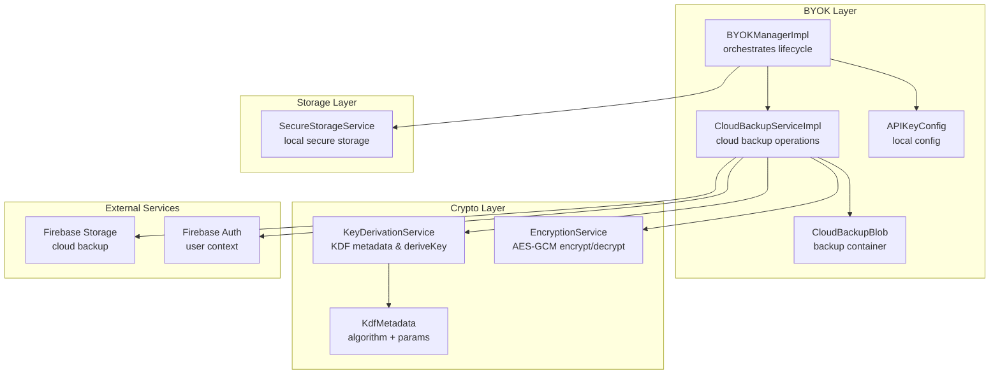
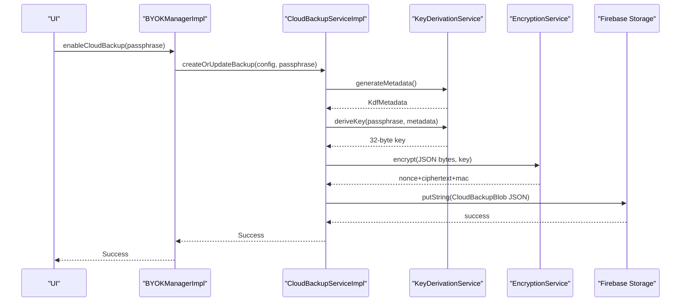
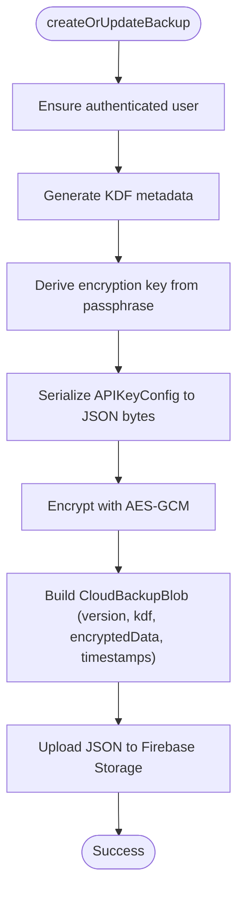
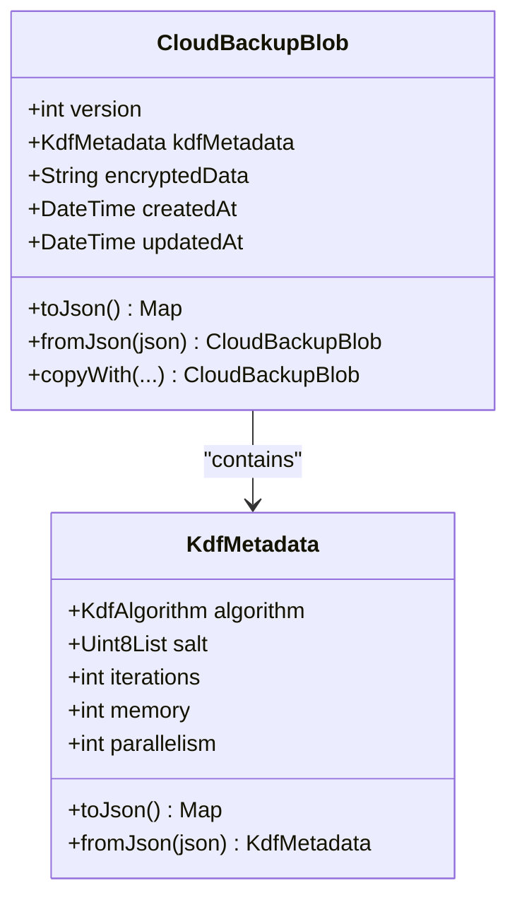
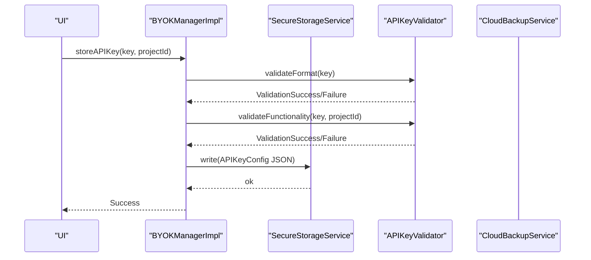
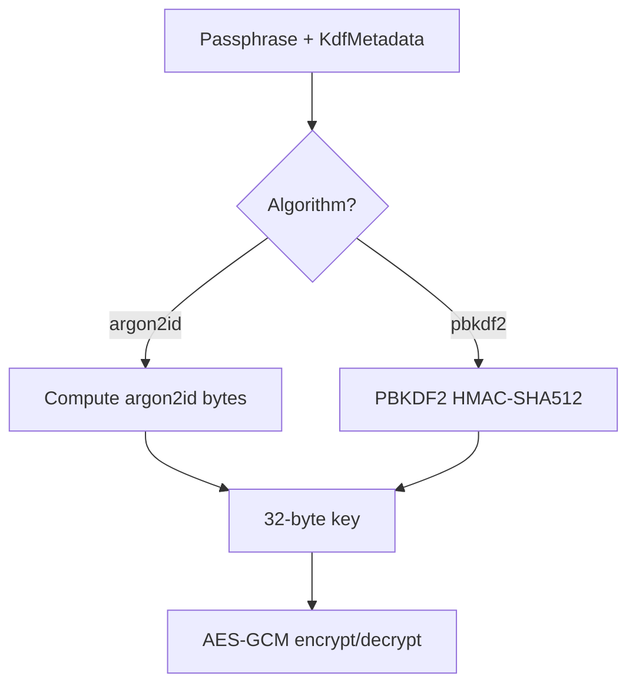
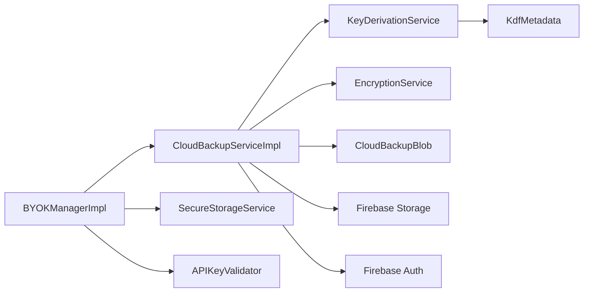

# Cloud Backup Service

<cite>
**Referenced Files in This Document**
- [cloud_backup_service.dart](file://lib/core/byok/cloud_backup_service.dart)
- [cloud_backup_blob.dart](file://lib/core/byok/models/cloud_backup_blob.dart)
- [byok_manager.dart](file://lib/core/byok/byok_manager.dart)
- [api_key_validator.dart](file://lib/core/byok/api_key_validator.dart)
- [api_key_config.dart](file://lib/core/byok/models/api_key_config.dart)
- [byok_storage_keys.dart](file://lib/core/byok/byok_storage_keys.dart)
- [encryption_service.dart](file://lib/core/crypto/encryption_service.dart)
- [key_derivation_service.dart](file://lib/core/crypto/key_derivation_service.dart)
- [kdf_metadata.dart](file://lib/core/crypto/kdf_metadata.dart)
- [secure_storage_service.dart](file://lib/core/storage/secure_storage_service.dart)
- [secure_storage_service_impl.dart](file://lib/core/storage/secure_storage_service_impl.dart)
- [byok_error.dart](file://lib/core/byok/models/byok_error.dart)
- [validation_result.dart](file://lib/core/byok/models/validation_result.dart)
- [cloud_backup_service_test.dart](file://test/cloud_backup_service_test.dart)
- [byok_manager_test.dart](file://test/byok_manager_test.dart)
</cite>

## Table of Contents
1. [Introduction](#introduction)
2. [Project Structure](#project-structure)
3. [Core Components](#core-components)
4. [Architecture Overview](#architecture-overview)
5. [Detailed Component Analysis](#detailed-component-analysis)
6. [Dependency Analysis](#dependency-analysis)
7. [Performance Considerations](#performance-considerations)
8. [Security Considerations](#security-considerations)
9. [Backup Scheduling and Conflict Resolution](#backup-scheduling-and-conflict-resolution)
10. [Troubleshooting Guide](#troubleshooting-guide)
11. [Conclusion](#conclusion)

## Introduction
This document describes the Cloud Backup Service implementation for securely backing up and restoring API key configurations using passphrase-based encryption. It covers the architecture, data models, encryption workflows, Firebase Storage integration, and operational procedures for backup creation, restoration, passphrase rotation, and error handling. It also addresses security considerations, performance characteristics, and recovery procedures for various failure scenarios.

## Project Structure
The Cloud Backup Service resides in the Bring Your Own Key (BYOK) subsystem under lib/core/byok. It integrates with cryptography services for key derivation and encryption, secure storage for local persistence, and Firebase Storage for cloud backup.

**Diagram sources**
- [byok_manager.dart](file://lib/core/byok/byok_manager.dart#L153-L582)
- [cloud_backup_service.dart](file://lib/core/byok/cloud_backup_service.dart#L97-L119)
- [cloud_backup_blob.dart](file://lib/core/byok/models/cloud_backup_blob.dart#L8-L43)
- [api_key_config.dart](file://lib/core/byok/models/api_key_config.dart#L5-L32)
- [key_derivation_service.dart](file://lib/core/crypto/key_derivation_service.dart#L17-L86)
- [encryption_service.dart](file://lib/core/crypto/encryption_service.dart#L22-L74)
- [kdf_metadata.dart](file://lib/core/crypto/kdf_metadata.dart#L9-L22)
- [secure_storage_service.dart](file://lib/core/storage/secure_storage_service.dart#L11-L29)

**Section sources**
- [byok_manager.dart](file://lib/core/byok/byok_manager.dart#L153-L582)
- [cloud_backup_service.dart](file://lib/core/byok/cloud_backup_service.dart#L97-L119)
- [cloud_backup_blob.dart](file://lib/core/byok/models/cloud_backup_blob.dart#L8-L43)
- [api_key_config.dart](file://lib/core/byok/models/api_key_config.dart#L5-L32)
- [key_derivation_service.dart](file://lib/core/crypto/key_derivation_service.dart#L17-L86)
- [encryption_service.dart](file://lib/core/crypto/encryption_service.dart#L22-L74)
- [kdf_metadata.dart](file://lib/core/crypto/kdf_metadata.dart#L9-L22)
- [secure_storage_service.dart](file://lib/core/storage/secure_storage_service.dart#L11-L29)

## Core Components
- CloudBackupService: Abstract interface defining backup operations (create/update, restore, delete, exists, rotate passphrase, verify passphrase).
- CloudBackupServiceImpl: Default implementation integrating Firebase Storage, KeyDerivationService, and EncryptionService.
- CloudBackupBlob: Serialized backup container holding version, KDF metadata, encrypted data, and timestamps.
- BYOKManagerImpl: Orchestrates API key lifecycle, including secure storage, validation, and cloud backup enable/disable/update.
- APIKeyConfig: Local configuration model persisted in secure storage.
- SecureStorageService: Device-backed secure storage abstraction.
- KeyDerivationService and EncryptionService: Cryptographic primitives for KDF and AEAD encryption.

**Section sources**
- [cloud_backup_service.dart](file://lib/core/byok/cloud_backup_service.dart#L21-L91)
- [cloud_backup_service.dart](file://lib/core/byok/cloud_backup_service.dart#L97-L119)
- [cloud_backup_blob.dart](file://lib/core/byok/models/cloud_backup_blob.dart#L8-L43)
- [byok_manager.dart](file://lib/core/byok/byok_manager.dart#L153-L582)
- [api_key_config.dart](file://lib/core/byok/models/api_key_config.dart#L5-L32)
- [secure_storage_service.dart](file://lib/core/storage/secure_storage_service.dart#L11-L29)
- [key_derivation_service.dart](file://lib/core/crypto/key_derivation_service.dart#L17-L86)
- [encryption_service.dart](file://lib/core/crypto/encryption_service.dart#L22-L74)

## Architecture Overview
The Cloud Backup Service follows a layered architecture:
- Presentation/Orchestration: BYOKManagerImpl coordinates user actions and delegates to CloudBackupService.
- Cloud Backup: CloudBackupServiceImpl performs encryption, serialization, and cloud upload/download.
- Cryptography: KeyDerivationService generates KDF metadata and derives keys; EncryptionService performs AEAD encryption/decryption.
- Storage: SecureStorageService persists local configuration; Firebase Storage persists encrypted backups.

**Diagram sources**
- [byok_manager.dart](file://lib/core/byok/byok_manager.dart#L387-L429)
- [cloud_backup_service.dart](file://lib/core/byok/cloud_backup_service.dart#L166-L249)
- [key_derivation_service.dart](file://lib/core/crypto/key_derivation_service.dart#L35-L53)
- [encryption_service.dart](file://lib/core/crypto/encryption_service.dart#L25-L40)

## Detailed Component Analysis

### CloudBackupService and CloudBackupServiceImpl
- Responsibilities:
  - Create or update encrypted backups with preserved timestamps.
  - Restore backups by deriving keys and decrypting.
  - Delete backups and check existence.
  - Rotate passphrases safely using a temporary backup and atomic-like swap.
  - Verify passphrases without decryption.
- Error handling:
  - Distinguishes network vs. storage errors.
  - Maps Firebase exceptions and network conditions to typed BackupError.
- Security:
  - All data is encrypted client-side before upload.
  - Passphrase correctness verified via MAC verification during decryption.

**Diagram sources**
- [cloud_backup_service.dart](file://lib/core/byok/cloud_backup_service.dart#L166-L249)

**Section sources**
- [cloud_backup_service.dart](file://lib/core/byok/cloud_backup_service.dart#L21-L91)
- [cloud_backup_service.dart](file://lib/core/byok/cloud_backup_service.dart#L97-L119)
- [cloud_backup_service.dart](file://lib/core/byok/cloud_backup_service.dart#L166-L249)
- [cloud_backup_service.dart](file://lib/core/byok/cloud_backup_service.dart#L251-L317)
- [cloud_backup_service.dart](file://lib/core/byok/cloud_backup_service.dart#L319-L411)
- [cloud_backup_service.dart](file://lib/core/byok/cloud_backup_service.dart#L413-L555)

### CloudBackupBlob Data Model
- Fields:
  - version: schema version for compatibility.
  - kdfMetadata: algorithm, salt, iterations, memory, parallelism.
  - encryptedData: base64-encoded AEAD blob (nonce + ciphertext + MAC).
  - createdAt/updatedAt: UTC timestamps.
- Serialization:
  - toJson encodes version, kdf, encrypted_data, created_at, updated_at.
  - fromJson validates presence and types, rejects unsupported versions.

**Diagram sources**
- [cloud_backup_blob.dart](file://lib/core/byok/models/cloud_backup_blob.dart#L8-L156)
- [kdf_metadata.dart](file://lib/core/crypto/kdf_metadata.dart#L9-L77)

**Section sources**
- [cloud_backup_blob.dart](file://lib/core/byok/models/cloud_backup_blob.dart#L8-L156)
- [kdf_metadata.dart](file://lib/core/crypto/kdf_metadata.dart#L9-L77)

### BYOKManagerImpl Orchestration
- Manages API key lifecycle:
  - storeAPIKey: validates format/functionality, creates config, stores locally.
  - getAPIKey/updateAPIKey/deleteAPIKey: CRUD operations with secure storage.
  - enableCloudBackup/disableCloudBackup: toggles cloud backup and updates local flags.
  - restoreFromCloudBackup: downloads, decrypts, and stores restored config.
  - rotateBackupPassphrase: delegates to CloudBackupService.
- Integration points:
  - Uses SecureStorageService for local persistence.
  - Uses APIKeyValidator for format and functional validation.
  - Uses CloudBackupService for cloud operations.

**Diagram sources**
- [byok_manager.dart](file://lib/core/byok/byok_manager.dart#L182-L231)
- [api_key_validator.dart](file://lib/core/byok/api_key_validator.dart#L111-L150)
- [api_key_validator.dart](file://lib/core/byok/api_key_validator.dart#L152-L224)

**Section sources**
- [byok_manager.dart](file://lib/core/byok/byok_manager.dart#L153-L582)
- [api_key_validator.dart](file://lib/core/byok/api_key_validator.dart#L14-L48)
- [api_key_validator.dart](file://lib/core/byok/api_key_validator.dart#L111-L224)

### Cryptographic Services
- KeyDerivationService:
  - generateMetadata: creates random salt and algorithm parameters.
  - deriveKey: supports argon2id (mobile) and PBKDF2 (non-mobile).
- EncryptionService (AES-GCM):
  - encrypt: returns nonce + ciphertext + MAC.
  - decrypt: throws AuthenticationException on MAC verification failure.

**Diagram sources**
- [key_derivation_service.dart](file://lib/core/crypto/key_derivation_service.dart#L22-L80)
- [encryption_service.dart](file://lib/core/crypto/encryption_service.dart#L22-L74)

**Section sources**
- [key_derivation_service.dart](file://lib/core/crypto/key_derivation_service.dart#L17-L86)
- [encryption_service.dart](file://lib/core/crypto/encryption_service.dart#L14-L74)
- [kdf_metadata.dart](file://lib/core/crypto/kdf_metadata.dart#L9-L77)

### Secure Storage and Local Persistence
- SecureStorageService:
  - Provides write/read/delete/deleteAll with backend detection.
  - Backend selection: Android Keystore (hardware-backed), iOS Keychain (hardware-backed), software fallback.
- BYOK storage keys:
  - apiKeyConfig: serialized APIKeyConfig.
  - cloudBackupEnabled: boolean flag.
  - backupPassphraseHash: placeholder for future use.

**Section sources**
- [secure_storage_service.dart](file://lib/core/storage/secure_storage_service.dart#L11-L29)
- [secure_storage_service_impl.dart](file://lib/core/storage/secure_storage_service_impl.dart#L33-L104)
- [byok_storage_keys.dart](file://lib/core/byok/byok_storage_keys.dart#L5-L14)

### Error Handling and Validation
- BYOKError hierarchy:
  - ValidationError, NotFoundError, StorageError, BackupError, CryptoError.
  - BackupErrorType enumerates notFound, wrongPassphrase, corrupted, networkError, storageError.
- ValidationResult:
  - ValidationSuccess with optional metadata.
  - ValidationFailure with typed reasons (invalidFormat, malformedKey, unauthorized, invalidProject, apiNotEnabled, networkError, rateLimited, unknown).

**Section sources**
- [byok_error.dart](file://lib/core/byok/models/byok_error.dart#L7-L94)
- [validation_result.dart](file://lib/core/byok/models/validation_result.dart#L5-L187)

## Dependency Analysis

**Diagram sources**
- [byok_manager.dart](file://lib/core/byok/byok_manager.dart#L153-L582)
- [cloud_backup_service.dart](file://lib/core/byok/cloud_backup_service.dart#L97-L119)
- [key_derivation_service.dart](file://lib/core/crypto/key_derivation_service.dart#L17-L86)
- [encryption_service.dart](file://lib/core/crypto/encryption_service.dart#L22-L74)
- [cloud_backup_blob.dart](file://lib/core/byok/models/cloud_backup_blob.dart#L8-L43)

**Section sources**
- [byok_manager.dart](file://lib/core/byok/byok_manager.dart#L153-L582)
- [cloud_backup_service.dart](file://lib/core/byok/cloud_backup_service.dart#L97-L119)

## Performance Considerations
- KDF parameters:
  - Mobile devices use argon2id with moderate iterations/memory/parallelism.
  - Non-mobile platforms use PBKDF2 with high iteration counts.
- Encryption overhead:
  - AES-GCM adds minimal CPU cost; nonce + ciphertext + MAC concatenation is efficient.
- Network operations:
  - Single JSON upload/download per operation; consider batching if needed.
- Storage:
  - Local secure storage is optimized per platform; avoid frequent writes.

[No sources needed since this section provides general guidance]

## Security Considerations
- Passphrase management:
  - Never transmit passphrases; derive keys client-side.
  - Use strong, unique passphrases; avoid reusing across accounts.
- Key handling:
  - 32-byte AES-256 keys; never log raw keys.
  - KDF metadata embedded in backup enables future-proof decryption.
- Data integrity:
  - MAC verification prevents tampering; AuthenticationException indicates wrong passphrase or corruption.
- Backup integrity:
  - CloudBackupBlob includes version and timestamps; version validation prevents downgrade attacks.
- Temporary backup safety:
  - Passphrase rotation uses a temporary path and verification before finalizing.
- Storage security:
  - SecureStorageService leverages hardware-backed keystores on Android/iOS when available.

**Section sources**
- [cloud_backup_service.dart](file://lib/core/byok/cloud_backup_service.dart#L413-L555)
- [encryption_service.dart](file://lib/core/crypto/encryption_service.dart#L68-L72)
- [cloud_backup_blob.dart](file://lib/core/byok/models/cloud_backup_blob.dart#L62-L118)
- [secure_storage_service_impl.dart](file://lib/core/storage/secure_storage_service_impl.dart#L37-L62)

## Backup Scheduling and Conflict Resolution
- Scheduling:
  - No built-in scheduler in the provided code; implement periodic triggers in the application layer to call createOrUpdateBackup.
- Conflict resolution:
  - When updating backups, the service preserves createdAt if provided or fetches existing blob to maintain provenance.
  - Passphrase rotation uses a temporary backup and verification to prevent partial updates.
- Recovery:
  - If rotation fails mid-flight, the temporary backup remains and can be used for manual recovery or retry.

**Section sources**
- [cloud_backup_service.dart](file://lib/core/byok/cloud_backup_service.dart#L200-L211)
- [cloud_backup_service.dart](file://lib/core/byok/cloud_backup_service.dart#L413-L555)

## Troubleshooting Guide
Common issues and resolutions:
- Wrong passphrase:
  - Symptom: AuthenticationException during decryption.
  - Action: Verify passphrase; consider passphrase rotation.
- Backup not found:
  - Symptom: notFound error when restoring/deleting/existence checks.
  - Action: Confirm user is authenticated; check Firebase Storage path.
- Corrupted backup:
  - Symptom: corrupted error on parse or decryption.
  - Action: Attempt passphrase rotation; verify backup integrity.
- Network errors:
  - Symptom: networkError during backup/restore/delete.
  - Action: Retry after connectivity check; inspect Firebase quotas.
- Storage errors:
  - Symptom: storageError on local operations.
  - Action: Check secure storage availability; reinitialize if needed.

**Section sources**
- [cloud_backup_service.dart](file://lib/core/byok/cloud_backup_service.dart#L251-L317)
- [cloud_backup_service.dart](file://lib/core/byok/cloud_backup_service.dart#L319-L411)
- [byok_error.dart](file://lib/core/byok/models/byok_error.dart#L67-L83)

## Conclusion
The Cloud Backup Service provides a robust, secure mechanism for encrypted API key backup and restoration. By combining client-side encryption, strong key derivation, and resilient cloud storage operations, it ensures confidentiality, integrity, and recoverability. The modular design allows for easy extension, testing, and maintenance.