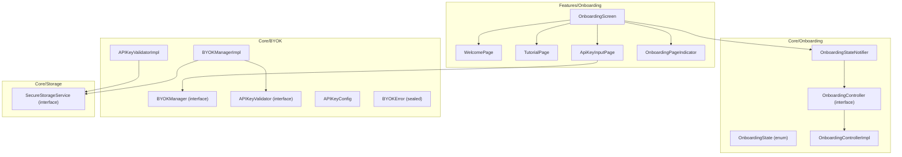
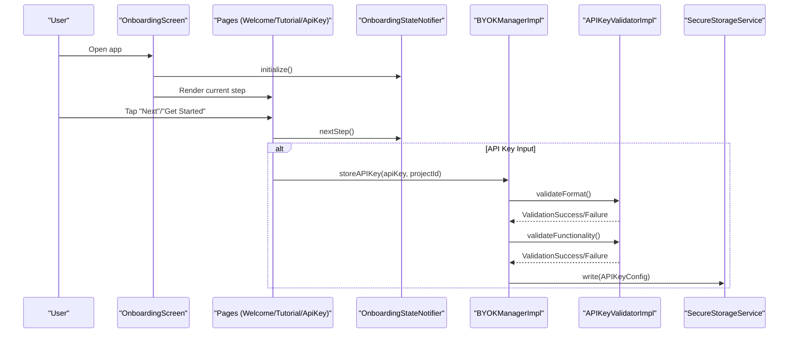
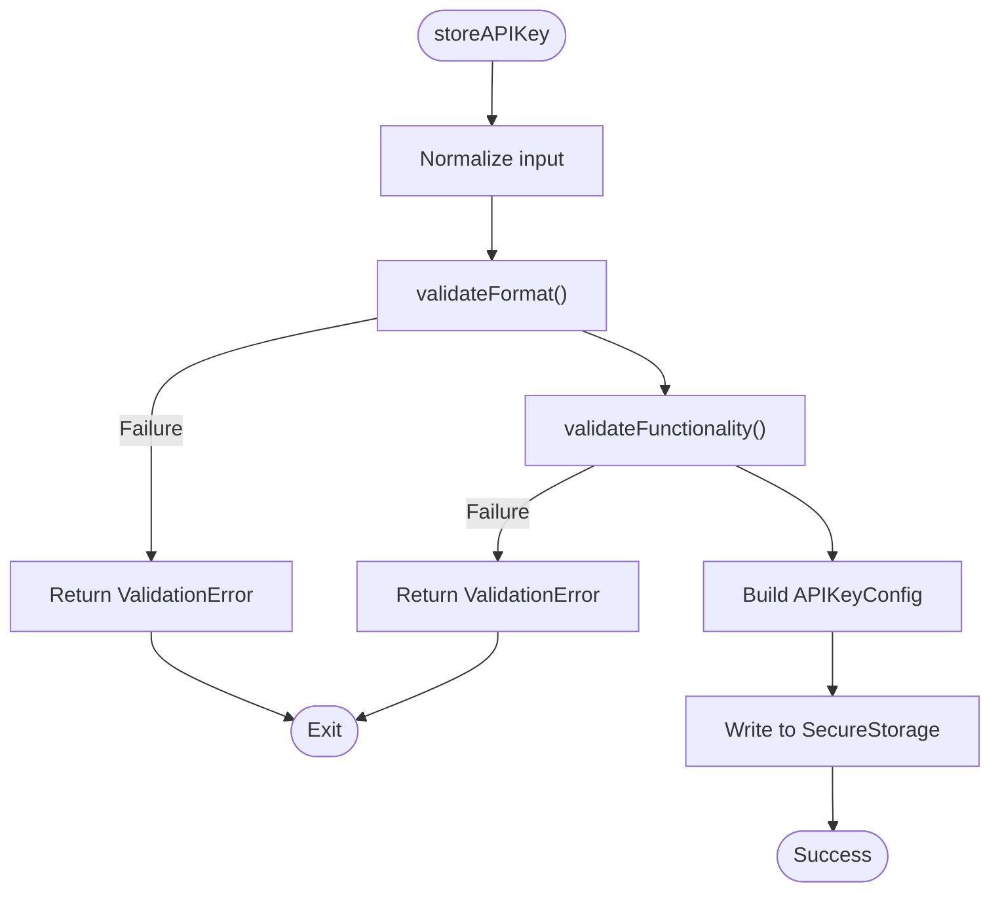
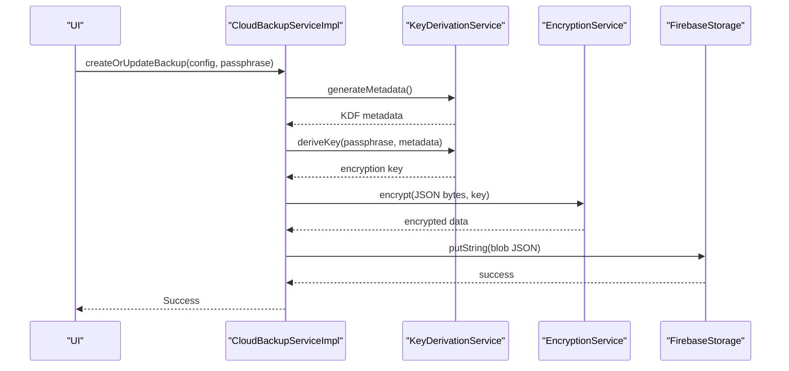
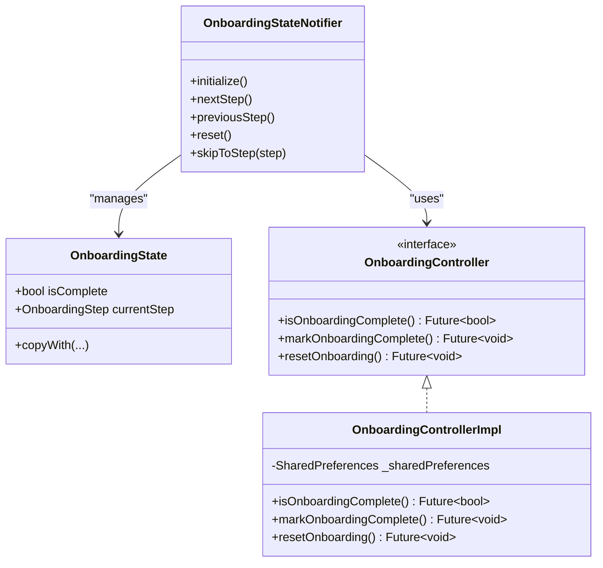
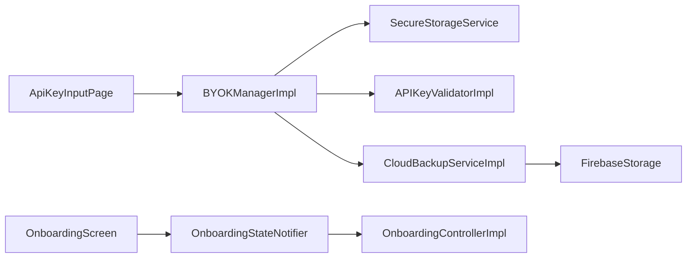

# Feature Implementation

<cite>
**Referenced Files in This Document**
- [onboarding_screen.dart](file://lib/features/onboarding/onboarding_screen.dart)
- [welcome_page.dart](file://lib/features/onboarding/widgets/welcome_page.dart)
- [tutorial_page.dart](file://lib/features/onboarding/widgets/tutorial_page.dart)
- [api_key_input_page.dart](file://lib/features/onboarding/widgets/api_key_input_page.dart)
- [onboarding_page_indicator.dart](file://lib/features/onboarding/widgets/onboarding_page_indicator.dart)
- [onboarding_state.dart](file://lib/core/onboarding/models/onboarding_state.dart)
- [onboarding_controller.dart](file://lib/core/onboarding/onboarding_controller.dart)
- [onboarding_controller_impl.dart](file://lib/core/onboarding/onboarding_controller_impl.dart)
- [onboarding_providers.dart](file://lib/core/onboarding/onboarding_providers.dart)
- [byok_manager.dart](file://lib/core/byok/byok_manager.dart)
- [api_key_validator.dart](file://lib/core/byok/api_key_validator.dart)
- [api_key_config.dart](file://lib/core/byok/models/api_key_config.dart)
- [byok_error.dart](file://lib/core/byok/models/byok_error.dart)
- [secure_storage_service.dart](file://lib/core/storage/secure_storage_service.dart)
</cite>

## Update Summary
**Changes Made**
- Enhanced onboarding system documentation with improved authentication and privacy features
- Added comprehensive API key management documentation with validation logic and error handling
- Expanded cloud backup service documentation with passphrase-based encryption and recovery procedures
- Updated UI component documentation with detailed props, events, and customization options
- Enhanced state management documentation with Riverpod providers and integration patterns
- Added accessibility compliance and responsive design considerations

## Table of Contents
1. [Introduction](#introduction)
2. [Project Structure](#project-structure)
3. [Core Components](#core-components)
4. [Architecture Overview](#architecture-overview)
5. [Detailed Component Analysis](#detailed-component-analysis)
6. [Dependency Analysis](#dependency-analysis)
7. [Performance Considerations](#performance-considerations)
8. [Troubleshooting Guide](#troubleshooting-guide)
9. [Conclusion](#conclusion)

## Introduction
This document details StyleSync's feature implementation with a focus on user-facing functionality and business logic. It covers:
- Onboarding System: Welcome Page, Tutorial Page, API Key Input Page, and page indicator components
- API Key Management: input validation logic, format and functionality testing, and error handling strategies
- Cloud Backup Service: backup creation, passphrase-based encryption, backup restoration, and error recovery procedures
- UI components: props, events, and customization options
- User interaction patterns, state management with Riverpod providers, and integration with core services
- Accessibility, responsive design, and cross-platform consistency

## Project Structure
The onboarding feature resides under lib/features/onboarding and integrates with core services under lib/core. The onboarding UI is composed of page widgets and a host screen that orchestrates navigation and state. Core services include BYOK (Bring Your Own Key) management, API key validation, and secure storage.

**Diagram sources**
- [onboarding_screen.dart](file://lib/features/onboarding/onboarding_screen.dart#L11-L122)
- [onboarding_providers.dart](file://lib/core/onboarding/onboarding_providers.dart#L54-L176)
- [byok_manager.dart](file://lib/core/byok/byok_manager.dart#L80-L147)
- [api_key_validator.dart](file://lib/core/byok/api_key_validator.dart#L9-L48)
- [api_key_config.dart](file://lib/core/byok/models/api_key_config.dart#L1-L110)
- [byok_error.dart](file://lib/core/byok/models/byok_error.dart#L1-L94)
- [secure_storage_service.dart](file://lib/core/storage/secure_storage_service.dart#L10-L30)

**Section sources**
- [onboarding_screen.dart](file://lib/features/onboarding/onboarding_screen.dart#L11-L122)
- [onboarding_providers.dart](file://lib/core/onboarding/onboarding_providers.dart#L54-L176)
- [byok_manager.dart](file://lib/core/byok/byok_manager.dart#L80-L147)
- [api_key_validator.dart](file://lib/core/byok/api_key_validator.dart#L9-L48)
- [api_key_config.dart](file://lib/core/byok/models/api_key_config.dart#L1-L110)
- [byok_error.dart](file://lib/core/byok/models/byok_error.dart#L1-L94)
- [secure_storage_service.dart](file://lib/core/storage/secure_storage_service.dart#L10-L30)

## Core Components
- Onboarding Screen: Orchestrates page rendering and navigation between steps using Riverpod state.
- Page Indicator: Visualizes current step with animated dots and optional labels.
- Welcome Page: Introduces app features and triggers progression to the next step.
- Tutorial Page: Guides users through obtaining a Gemini API key and explains quotas.
- API Key Input Page: Collects API key and Project ID, validates locally and remotely, and delegates storage to BYOKManager.
- BYOK Manager: Validates format and functionality, stores securely, and coordinates cloud backup.
- API Key Validator: Performs format checks and functional tests against Vertex AI.
- Secure Storage Service: Provides platform-backed secure storage abstraction.
- Onboarding State Management: Tracks completion and step transitions with persistence.

**Section sources**
- [onboarding_screen.dart](file://lib/features/onboarding/onboarding_screen.dart#L11-L122)
- [onboarding_page_indicator.dart](file://lib/features/onboarding/widgets/onboarding_page_indicator.dart#L5-L193)
- [welcome_page.dart](file://lib/features/onboarding/widgets/welcome_page.dart#L3-L188)
- [tutorial_page.dart](file://lib/features/onboarding/widgets/tutorial_page.dart#L4-L512)
- [api_key_input_page.dart](file://lib/features/onboarding/widgets/api_key_input_page.dart#L8-L555)
- [byok_manager.dart](file://lib/core/byok/byok_manager.dart#L80-L147)
- [api_key_validator.dart](file://lib/core/byok/api_key_validator.dart#L9-L48)
- [secure_storage_service.dart](file://lib/core/storage/secure_storage_service.dart#L10-L30)
- [onboarding_providers.dart](file://lib/core/onboarding/onboarding_providers.dart#L54-L176)

## Architecture Overview
The onboarding flow is reactive and declarative:
- UI pages render based on OnboardingStateNotifier state.
- Navigation is handled by invoking nextStep()/previousStep() on the notifier.
- API key input triggers BYOKManager to validate and store the key.
- Cloud backup is coordinated through CloudBackupService with passphrase-based encryption.

**Diagram sources**
- [onboarding_screen.dart](file://lib/features/onboarding/onboarding_screen.dart#L23-L122)
- [onboarding_providers.dart](file://lib/core/onboarding/onboarding_providers.dart#L59-L150)
- [byok_manager.dart](file://lib/core/byok/byok_manager.dart#L182-L231)
- [api_key_validator.dart](file://lib/core/byok/api_key_validator.dart#L111-L224)
- [secure_storage_service.dart](file://lib/core/storage/secure_storage_service.dart#L10-L30)

## Detailed Component Analysis

### Onboarding System

#### OnboardingScreen
- Responsibilities:
  - Initializes onboarding state on first frame
  - Renders the current page based on OnboardingState
  - Provides animated transitions between pages
  - Delegates navigation to OnboardingStateNotifier
- Props/events:
  - None (no incoming parameters)
  - Emits navigation via notifier callbacks
- Customization:
  - AnimatedSwitcher controls page transitions
  - SafeArea ensures proper layout on devices with insets

**Section sources**
- [onboarding_screen.dart](file://lib/features/onboarding/onboarding_screen.dart#L11-L122)
- [onboarding_providers.dart](file://lib/core/onboarding/onboarding_providers.dart#L59-L150)

#### WelcomePage
- Purpose: First impression and feature highlights
- Props/events:
  - onGetStarted: VoidCallback
- UX:
  - Large app icon placeholder
  - Feature cards with icons and descriptions
  - Prominent "Get Started" button

**Section sources**
- [welcome_page.dart](file://lib/features/onboarding/widgets/welcome_page.dart#L3-L188)

#### TutorialPage
- Purpose: Guides users to obtain a Gemini API key and explains quotas
- Props/events:
  - onNext: VoidCallback
  - onBack: VoidCallback
- UX:
  - Step-by-step instructions with links to Google Cloud Console
  - Notice cards for important warnings
  - Quota information for Free vs Paid tiers
  - Bottom navigation with back/next actions
- Accessibility:
  - Uses semantic text styles and sufficient contrast
  - Links open in external browser with fallback snackbars

**Section sources**
- [tutorial_page.dart](file://lib/features/onboarding/widgets/tutorial_page.dart#L4-L512)

#### ApiKeyInputPage
- Purpose: Accepts API key and Project ID, validates, and stores
- Props/events:
  - onComplete: VoidCallback
  - onBack: VoidCallback
- Validation:
  - Local validators for format and Project ID
  - Remote functionality test via APIKeyValidator
- Error handling:
  - Dedicated error card with contextual hints
  - Loading state during verification
  - Security notice about encrypted local storage
- State management:
  - ConsumerState with Riverpod ref for BYOKManager access

**Section sources**
- [api_key_input_page.dart](file://lib/features/onboarding/widgets/api_key_input_page.dart#L8-L555)
- [api_key_validator.dart](file://lib/core/byok/api_key_validator.dart#L111-L224)

#### OnboardingPageIndicator
- Purpose: Visual progress indicator for onboarding steps
- Variants:
  - Dots-only indicator
  - With labels and connecting lines
- Behavior:
  - Highlights current step
  - Shows completed steps
  - Smooth animations for transitions

**Section sources**
- [onboarding_page_indicator.dart](file://lib/features/onboarding/widgets/onboarding_page_indicator.dart#L5-L193)

### API Key Management

#### BYOKManager and BYOKManagerImpl
- Responsibilities:
  - Validate API key format and functionality
  - Persist configuration securely
  - Enable/disable cloud backup
  - Restore from cloud backup
  - Rotate backup passphrase
- Flow:
  - storeAPIKey: format → functionality → persist
  - updateAPIKey: similar validation → merge metadata → persist → optional re-encrypt
  - enableCloudBackup: create/update backup → mark enabled
  - restoreFromCloudBackup: decrypt → persist → sync flags
  - disableCloudBackup: update config → delete flags → optional remote delete
  - rotateBackupPassphrase: safe rotation with temp backup and atomic-like swap

**Diagram sources**
- [byok_manager.dart](file://lib/core/byok/byok_manager.dart#L182-L231)
- [api_key_validator.dart](file://lib/core/byok/api_key_validator.dart#L111-L224)

**Section sources**
- [byok_manager.dart](file://lib/core/byok/byok_manager.dart#L80-L147)
- [byok_manager.dart](file://lib/core/byok/byok_manager.dart#L182-L549)
- [api_key_validator.dart](file://lib/core/byok/api_key_validator.dart#L111-L224)

#### APIKeyValidator and APIKeyValidatorImpl
- Format validation:
  - Prefix check ("AIza")
  - Length check (39 characters)
  - Character set validation
- Functionality validation:
  - Tests Vertex AI models list endpoint
  - Distinguishes unauthorized, API not enabled, invalid project, rate-limited, and network errors
  - Region and project ID validation prior to request construction
- Error mapping:
  - Maps HTTP responses to ValidationFailureType variants
  - Propagates network errors distinctly

**Section sources**
- [api_key_validator.dart](file://lib/core/byok/api_key_validator.dart#L111-L322)

#### SecureStorageService
- Abstraction for platform-backed secure storage
- Methods: write, read, delete, deleteAll, backend, requiresBiometric
- Used by BYOKManagerImpl to persist APIKeyConfig and backup flags

**Section sources**
- [secure_storage_service.dart](file://lib/core/storage/secure_storage_service.dart#L10-L30)
- [byok_manager.dart](file://lib/core/byok/byok_manager.dart#L234-L256)

### Cloud Backup Service

#### CloudBackupService and CloudBackupServiceImpl
- Responsibilities:
  - Encrypt and upload backups to Firebase Storage
  - Decrypt and restore backups using passphrase-derived keys
  - Detect and handle network vs storage errors
  - Support passphrase rotation with a temporary backup and atomic-like swap
- Encryption:
  - Key derivation metadata included in backup blob
  - Base64-encoded encrypted payload
- Error handling:
  - Distinct error types for not found, wrong passphrase, corrupted, network, storage
  - Network detection for SocketException, HttpException, and Firebase network codes
- Passphrase rotation:
  - Restore with old passphrase
  - Upload to temp path with new passphrase
  - Verify temp backup
  - Delete original, upload final preserving createdAt
  - Cleanup temp backup

**Diagram sources**
- [cloud_backup_service.dart](file://lib/core/byok/cloud_backup_service.dart#L166-L249)

**Section sources**
- [cloud_backup_service.dart](file://lib/core/byok/cloud_backup_service.dart#L21-L91)
- [cloud_backup_service.dart](file://lib/core/byok/cloud_backup_service.dart#L166-L555)

### Onboarding State Management

#### OnboardingState, OnboardingController, OnboardingControllerImpl, OnboardingStateNotifier
- OnboardingState: Immutable snapshot of completion and current step
- OnboardingController: Persists completion state (SharedPreferences)
- OnboardingControllerImpl: Thread-safe SharedPreferences wrapper
- OnboardingStateNotifier: Reactive state transitions with persistence on completion

**Diagram sources**
- [onboarding_state.dart](file://lib/core/onboarding/models/onboarding_state.dart#L19-L75)
- [onboarding_controller.dart](file://lib/core/onboarding/onboarding_controller.dart#L7-L47)
- [onboarding_controller_impl.dart](file://lib/core/onboarding/onboarding_controller_impl.dart#L10-L79)
- [onboarding_providers.dart](file://lib/core/onboarding/onboarding_providers.dart#L54-L176)

**Section sources**
- [onboarding_state.dart](file://lib/core/onboarding/models/onboarding_state.dart#L1-L75)
- [onboarding_controller.dart](file://lib/core/onboarding/onboarding_controller.dart#L7-L47)
- [onboarding_controller_impl.dart](file://lib/core/onboarding/onboarding_controller_impl.dart#L10-L79)
- [onboarding_providers.dart](file://lib/core/onboarding/onboarding_providers.dart#L54-L176)

## Dependency Analysis
- UI depends on Riverpod providers for state and services
- ApiKeyInputPage depends on BYOKManager via byokManagerProvider
- BYOKManagerImpl depends on SecureStorageService, APIKeyValidator, and CloudBackupService
- CloudBackupServiceImpl depends on Firebase Storage, KeyDerivationService, and EncryptionService
- OnboardingScreen depends on OnboardingStateNotifier and page widgets

**Diagram sources**
- [api_key_input_page.dart](file://lib/features/onboarding/widgets/api_key_input_page.dart#L270-L275)
- [byok_manager.dart](file://lib/core/byok/byok_manager.dart#L572-L582)
- [cloud_backup_service.dart](file://lib/core/byok/cloud_backup_service.dart#L97-L119)
- [onboarding_screen.dart](file://lib/features/onboarding/onboarding_screen.dart#L35-L87)
- [onboarding_providers.dart](file://lib/core/onboarding/onboarding_providers.dart#L171-L176)

**Section sources**
- [api_key_input_page.dart](file://lib/features/onboarding/widgets/api_key_input_page.dart#L270-L275)
- [byok_manager.dart](file://lib/core/byok/byok_manager.dart#L572-L582)
- [cloud_backup_service.dart](file://lib/core/byok/cloud_backup_service.dart#L97-L119)
- [onboarding_screen.dart](file://lib/features/onboarding/onboarding_screen.dart#L35-L87)
- [onboarding_providers.dart](file://lib/core/onboarding/onboarding_providers.dart#L171-L176)

## Performance Considerations
- Validation latency:
  - Format validation is CPU-bound and fast
  - Functionality validation performs a network request; timeouts and retries should be considered at higher layers
- Storage:
  - JSON serialization/deserialization is lightweight; avoid frequent writes
  - Batch operations where possible (e.g., enabling backup and updating flags)
- UI responsiveness:
  - Use loading indicators during validation and backup operations
  - Debounce rapid user interactions (e.g., repeated taps on Verify & Continue)
- Cloud backup:
  - Backup size is small (JSON + base64), but encryption/decryption adds overhead
  - Prefer incremental updates and avoid unnecessary re-encryptions

## Troubleshooting Guide
- API Key Input Page:
  - Invalid format: Ensure key starts with expected prefix and is exactly the expected length
  - Invalid project ID: Confirm it matches the documented pattern and region
  - Unauthorized: Verify key correctness and revocation status
  - API not enabled: Follow tutorial steps to enable Vertex AI
  - Network errors: Check connectivity and retry
  - Rate limited: Wait and retry
- Cloud Backup:
  - Wrong passphrase: Re-enter or recover from temp backup if rotation failed mid-process
  - Corrupted backup: Recreate from local key if available
  - Storage errors: Inspect Firebase permissions and quotas
  - Network errors: Retry after connectivity restoration
- Onboarding:
  - State not persisting: Verify SharedPreferences availability and permissions
  - Navigation stuck: Ensure notifier.nextStep() is called and completion is persisted

**Section sources**
- [api_key_input_page.dart](file://lib/features/onboarding/widgets/api_key_input_page.dart#L284-L307)
- [api_key_validator.dart](file://lib/core/byok/api_key_validator.dart#L226-L308)
- [cloud_backup_service.dart](file://lib/core/byok/cloud_backup_service.dart#L251-L317)
- [byok_error.dart](file://lib/core/byok/models/byok_error.dart#L67-L83)
- [onboarding_controller_impl.dart](file://lib/core/onboarding/onboarding_controller_impl.dart#L57-L77)

## Conclusion
StyleSync's onboarding and BYOK features combine robust validation, secure storage, and resilient cloud backup. The UI is reactive, accessible, and responsive, while the backend enforces strong error handling and clear separation of concerns. The design supports cross-platform consistency and provides clear pathways for recovery and troubleshooting.