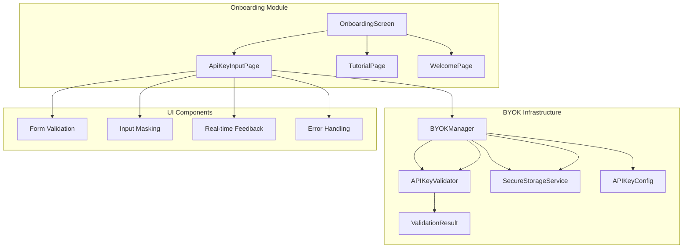
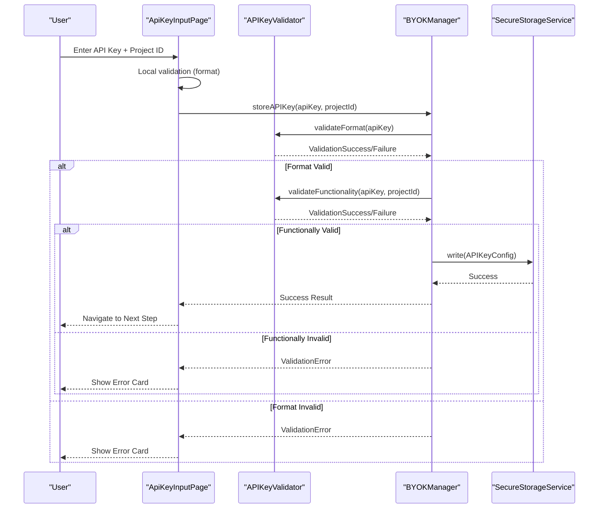
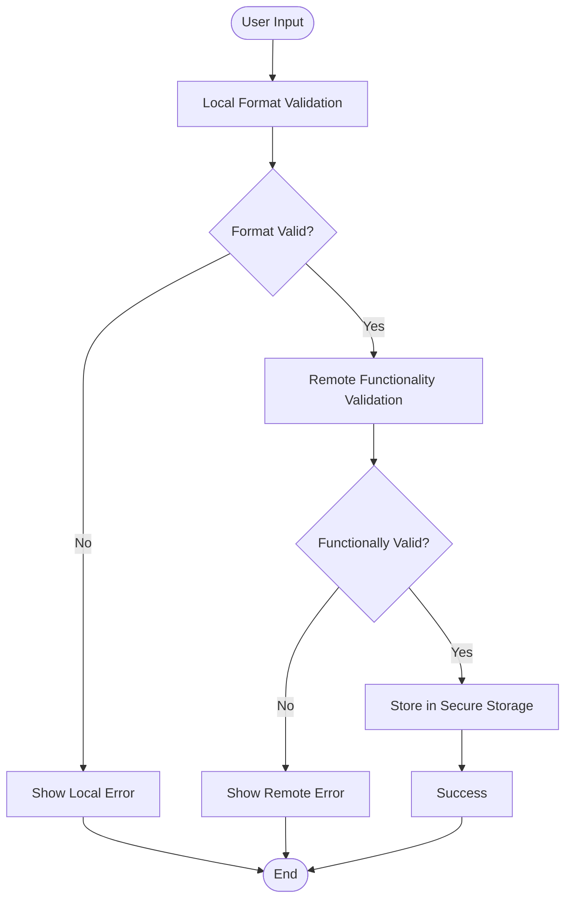
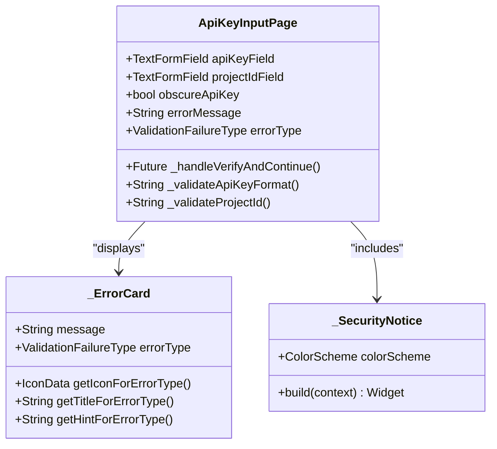
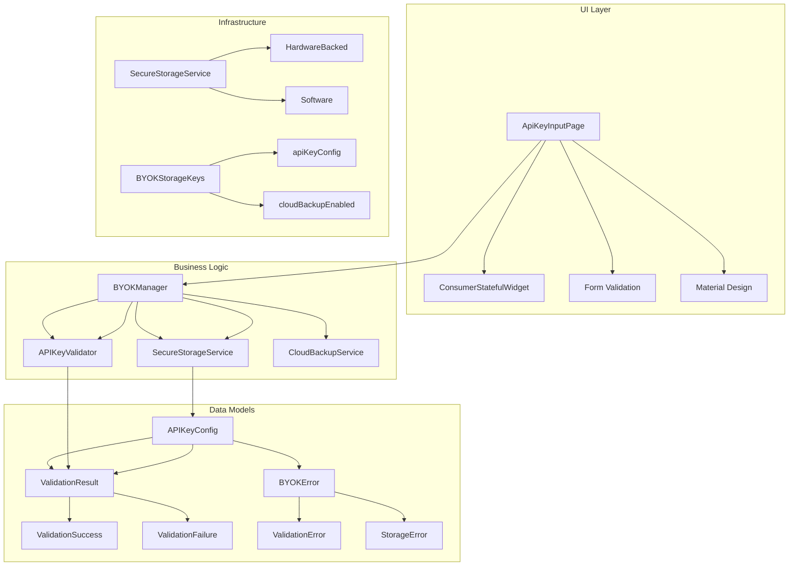

# API Key Input Page

<cite>
**Referenced Files in This Document**
- [api_key_input_page.dart](file://lib/features/onboarding/widgets/api_key_input_page.dart)
- [api_key_validator.dart](file://lib/core/byok/api_key_validator.dart)
- [byok_manager.dart](file://lib/core/byok/byok_manager.dart)
- [validation_result.dart](file://lib/core/byok/models/validation_result.dart)
- [byok_error.dart](file://lib/core/byok/models/byok_error.dart)
- [api_key_config.dart](file://lib/core/byok/models/api_key_config.dart)
- [secure_storage_service.dart](file://lib/core/storage/secure_storage_service.dart)
- [byok_storage_keys.dart](file://lib/core/byok/byok_storage_keys.dart)
- [onboarding_screen.dart](file://lib/features/onboarding/onboarding_screen.dart)
- [api_key_input_page_test.dart](file://test/features/onboarding/widgets/api_key_input_page_test.dart)
</cite>

## Table of Contents
1. [Introduction](#introduction)
2. [Project Structure](#project-structure)
3. [Core Components](#core-components)
4. [Architecture Overview](#architecture-overview)
5. [Detailed Component Analysis](#detailed-component-analysis)
6. [Dependency Analysis](#dependency-analysis)
7. [Performance Considerations](#performance-considerations)
8. [Troubleshooting Guide](#troubleshooting-guide)
9. [Conclusion](#conclusion)

## Introduction
The API Key Input Page is a critical component in the StyleSync onboarding flow, serving as the secure entry interface for Gemini API keys and Google Cloud Project IDs. This component implements comprehensive validation, input masking, real-time feedback, and integrates seamlessly with the Bring Your Own Key (BYOK) system to establish secure AI functionality for users.

The component plays a pivotal role in onboarding security by providing immediate validation feedback, input assistance, and secure credential handling while maintaining user privacy and system integrity.

## Project Structure
The API Key Input Page is organized within the onboarding feature module alongside supporting BYOK infrastructure:

**Diagram sources**
- [onboarding_screen.dart](file://lib/features/onboarding/onboarding_screen.dart#L89-L110)
- [api_key_input_page.dart](file://lib/features/onboarding/widgets/api_key_input_page.dart#L12-L31)
- [byok_manager.dart](file://lib/core/byok/byok_manager.dart#L84-L147)

**Section sources**
- [onboarding_screen.dart](file://lib/features/onboarding/onboarding_screen.dart#L1-L122)
- [api_key_input_page.dart](file://lib/features/onboarding/widgets/api_key_input_page.dart#L1-L555)

## Core Components

### API Key Input Page Implementation
The ApiKeyInputPage is a ConsumerStatefulWidget that provides a comprehensive credential entry interface with the following key capabilities:

**Input Fields and Validation:**
- API Key field with automatic masking and visibility toggle
- Google Cloud Project ID field with format validation
- Real-time validation feedback with contextual error messages
- Form submission with keyboard navigation support

**Security Features:**
- Input masking for sensitive API key data
- Local validation before network requests
- Secure storage integration with encrypted persistence
- Immediate error feedback for invalid inputs

**User Experience:**
- Progressive disclosure of validation hints
- Loading states during validation
- Accessible form controls with proper focus management
- Responsive design with Material Design guidelines

**Section sources**
- [api_key_input_page.dart](file://lib/features/onboarding/widgets/api_key_input_page.dart#L12-L31)
- [api_key_input_page.dart](file://lib/features/onboarding/widgets/api_key_input_page.dart#L120-L220)

### BYOK Manager Integration
The component integrates with the BYOK (Bring Your Own Key) system through the BYOKManager, which orchestrates the complete API key lifecycle:

**Validation Pipeline:**
1. Local format validation using APIKeyValidator
2. Remote functionality validation via Google Cloud API
3. Secure storage of validated credentials
4. Optional cloud backup synchronization

**Storage Management:**
- Encrypted local storage using SecureStorageService
- API key configuration persistence with metadata
- Cloud backup integration for disaster recovery

**Section sources**
- [byok_manager.dart](file://lib/core/byok/byok_manager.dart#L84-L147)
- [api_key_input_page.dart](file://lib/features/onboarding/widgets/api_key_input_page.dart#L252-L307)

## Architecture Overview

**Diagram sources**
- [api_key_input_page.dart](file://lib/features/onboarding/widgets/api_key_input_page.dart#L252-L307)
- [byok_manager.dart](file://lib/core/byok/byok_manager.dart#L182-L231)
- [api_key_validator.dart](file://lib/core/byok/api_key_validator.dart#L111-L150)

The architecture demonstrates a clear separation of concerns with the UI component handling presentation and user interaction, while the BYOK system manages business logic, validation, and persistence.

## Detailed Component Analysis

### Input Validation System

The API Key Input Page implements a multi-layered validation approach:

**Local Validation (Immediate Feedback):**
- API key format validation (AIza prefix, 39-character length)
- Project ID format validation (6-30 characters, lowercase letters/digits/hyphens)
- Real-time validation feedback during typing
- Contextual error messages with specific guidance

**Remote Validation (Functional Testing):**
- HTTP request to Google Cloud Vertex AI API
- Authentication verification with x-goog-api-key header
- Comprehensive error categorization (unauthorized, invalid project, API not enabled)
- Network error handling and retry scenarios

**Diagram sources**
- [api_key_input_page.dart](file://lib/features/onboarding/widgets/api_key_input_page.dart#L222-L250)
- [api_key_validator.dart](file://lib/core/byok/api_key_validator.dart#L152-L224)

**Section sources**
- [api_key_input_page.dart](file://lib/features/onboarding/widgets/api_key_input_page.dart#L222-L250)
- [api_key_validator.dart](file://lib/core/byok/api_key_validator.dart#L111-L150)

### Input Masking and Security Features

The component implements robust security measures for credential handling:

**Input Masking:**
- Toggle between masked and visible API key input
- Focus management for accessibility compliance
- Proper input field decoration with icons

**Security Best Practices:**
- Input trimming and normalization
- No plaintext logging of API keys
- Secure storage integration
- Temporary loading states during validation

**Accessibility Features:**
- Proper focus management between form fields
- Keyboard navigation support (Tab/Shift+Tab)
- Screen reader friendly error messages
- Sufficient color contrast for error states

**Section sources**
- [api_key_input_page.dart](file://lib/features/onboarding/widgets/api_key_input_page.dart#L134-L175)
- [api_key_input_page.dart](file://lib/features/onboarding/widgets/api_key_input_page.dart#L424-L479)

### Error Handling and User Feedback

The component provides comprehensive error handling with contextual feedback:

**Error Categories:**
- Invalid API key format (missing AIza prefix, wrong length)
- Invalid project ID format (length, character restrictions)
- Network connectivity issues
- Authentication failures
- Rate limiting and quota exceeded

**Feedback Mechanisms:**
- Inline error cards with specific error types
- Contextual help text for each error category
- Visual indicators (icons, colors) for different error types
- Loading states during validation operations

**Diagram sources**
- [api_key_input_page.dart](file://lib/features/onboarding/widgets/api_key_input_page.dart#L310-L422)
- [api_key_input_page.dart](file://lib/features/onboarding/widgets/api_key_input_page.dart#L424-L479)

**Section sources**
- [api_key_input_page.dart](file://lib/features/onboarding/widgets/api_key_input_page.dart#L310-L422)
- [api_key_input_page.dart](file://lib/features/onboarding/widgets/api_key_input_page.dart#L424-L479)

### Integration with BYOK System

The API Key Input Page seamlessly integrates with the broader BYOK ecosystem:

**BYOK Manager Operations:**
- Centralized validation pipeline
- Secure storage management
- Cloud backup coordination
- Error propagation and handling

**Data Flow:**
- Form validation -> BYOKManager -> APIKeyValidator -> SecureStorageService
- Error handling -> UI error cards -> User feedback
- Success flow -> Navigation to next onboarding step

**Section sources**
- [byok_manager.dart](file://lib/core/byok/byok_manager.dart#L182-L231)
- [onboarding_screen.dart](file://lib/features/onboarding/onboarding_screen.dart#L101-L105)

## Dependency Analysis

**Diagram sources**
- [api_key_input_page.dart](file://lib/features/onboarding/widgets/api_key_input_page.dart#L4-L7)
- [byok_manager.dart](file://lib/core/byok/byok_manager.dart#L153-L181)
- [api_key_validator.dart](file://lib/core/byok/api_key_validator.dart#L14-L48)

The dependency graph reveals a well-structured architecture with clear separation between UI presentation, business logic, and infrastructure concerns.

**Section sources**
- [api_key_input_page.dart](file://lib/features/onboarding/widgets/api_key_input_page.dart#L1-L555)
- [byok_manager.dart](file://lib/core/byok/byok_manager.dart#L1-L583)

## Performance Considerations

### Validation Performance
- **Local validation**: Instant feedback using regex patterns and string operations
- **Remote validation**: Asynchronous HTTP requests with configurable timeouts
- **Memory management**: Proper disposal of controllers and focus nodes
- **UI responsiveness**: Loading states prevent blocking user interactions

### Security Performance
- **Minimal data exposure**: API keys are only transmitted during validation requests
- **Efficient storage**: JSON serialization minimizes storage overhead
- **Network optimization**: HTTP client reuse reduces connection overhead

### Scalability Factors
- **Modular design**: Independent validation and storage components
- **Provider architecture**: Efficient state management with Riverpod
- **Error isolation**: Specific error types prevent cascading failures

## Troubleshooting Guide

### Common Validation Issues

**API Key Format Errors:**
- Ensure key starts with "AIza" prefix
- Verify key length is exactly 39 characters
- Check for invalid characters (only alphanumeric, underscore, hyphen allowed)

**Project ID Validation Errors:**
- Confirm project ID is 6-30 characters long
- Verify it starts with lowercase letter
- Ensure only lowercase letters, digits, and hyphens are used

**Network Connectivity Issues:**
- Check internet connection stability
- Verify firewall/proxy settings allow Google Cloud API access
- Review rate limiting policies

### Error Resolution Patterns

**Immediate Resolution Steps:**
1. Clear and re-enter API key with proper format
2. Verify Google Cloud Project ID in console
3. Check network connectivity and retry
4. Review error messages for specific guidance

**Advanced Troubleshooting:**
- Enable developer mode for detailed error logs
- Verify API key permissions in Google Cloud Console
- Check Vertex AI API enablement status
- Review cloud backup configuration if applicable

**Section sources**
- [api_key_input_page_test.dart](file://test/features/onboarding/widgets/api_key_input_page_test.dart#L320-L414)
- [api_key_validator.dart](file://lib/core/byok/api_key_validator.dart#L226-L272)

## Conclusion

The API Key Input Page represents a comprehensive solution for secure credential entry in the StyleSync onboarding process. Its implementation demonstrates best practices in user experience design, security architecture, and error handling.

Key strengths include:
- **Robust validation pipeline** with immediate feedback
- **Security-first design** with input masking and secure storage
- **Comprehensive error handling** with contextual user guidance
- **Seamless integration** with the BYOK system and onboarding flow
- **Accessibility compliance** with proper focus management and screen reader support

The component successfully balances user experience with security requirements, providing a reliable foundation for the BYOK system while maintaining high standards for credential protection and user privacy.