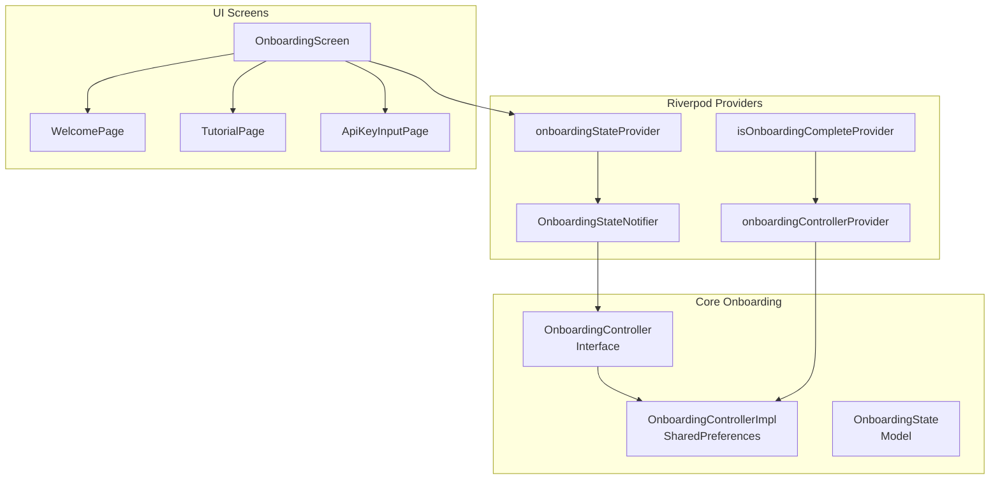
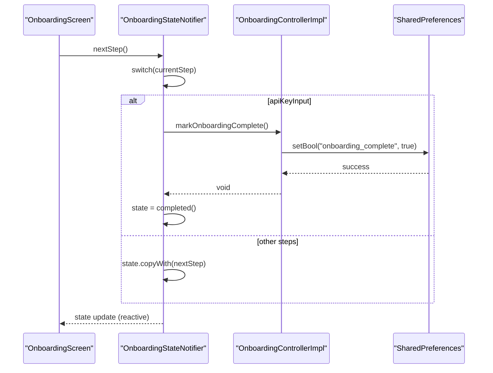
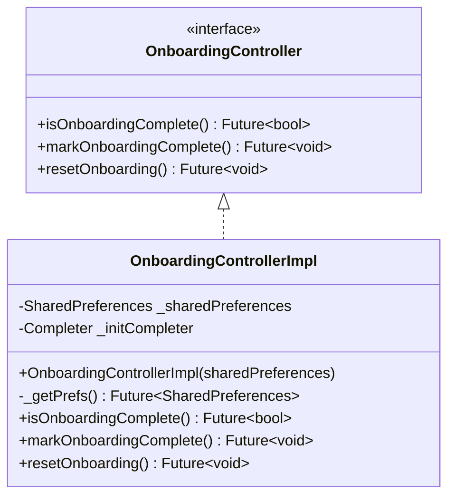
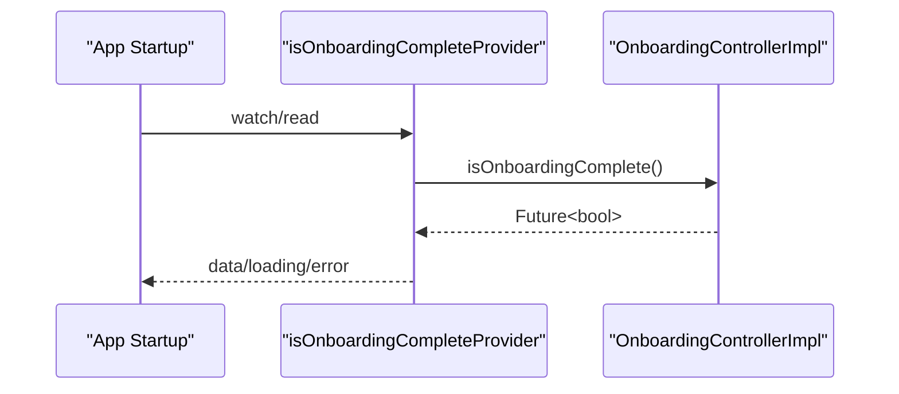
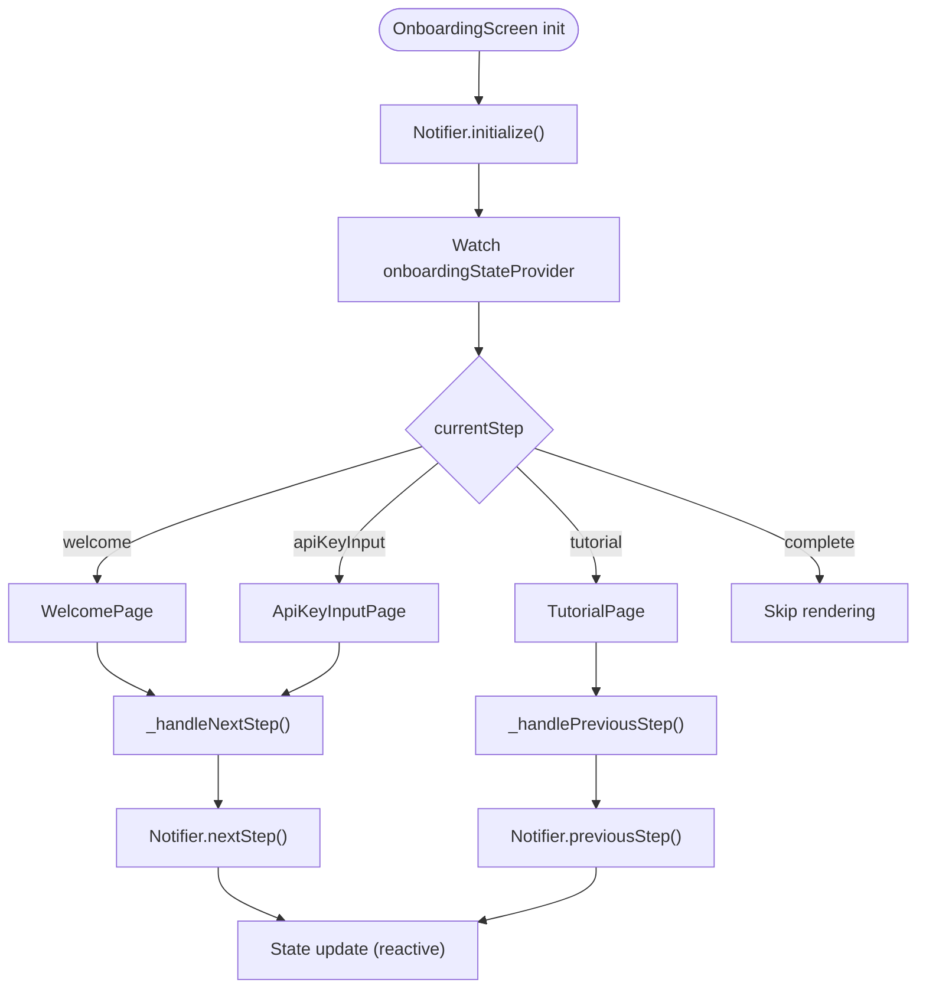
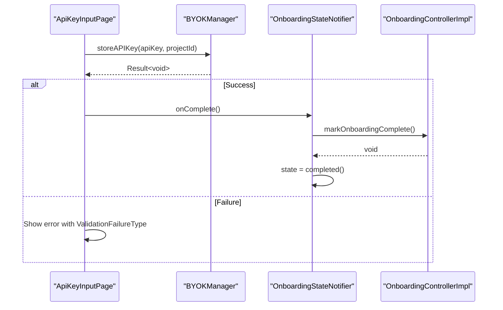
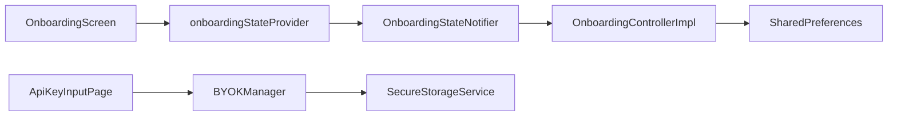

# Onboarding Controller

<cite>
**Referenced Files in This Document**
- [onboarding_controller.dart](file://lib/core/onboarding/onboarding_controller.dart)
- [onboarding_controller_impl.dart](file://lib/core/onboarding/onboarding_controller_impl.dart)
- [onboarding_state.dart](file://lib/core/onboarding/models/onboarding_state.dart)
- [onboarding_providers.dart](file://lib/core/onboarding/onboarding_providers.dart)
- [onboarding_screen.dart](file://lib/features/onboarding/onboarding_screen.dart)
- [welcome_page.dart](file://lib/features/onboarding/widgets/welcome_page.dart)
- [tutorial_page.dart](file://lib/features/onboarding/widgets/tutorial_page.dart)
- [api_key_input_page.dart](file://lib/features/onboarding/widgets/api_key_input_page.dart)
- [onboarding_persistence_property_test.dart](file://test/core/onboarding/onboarding_persistence_property_test.dart)
- [secure_storage_service.dart](file://lib/core/storage/secure_storage_service.dart)
- [secure_storage_service_impl.dart](file://lib/core/storage/secure_storage_service_impl.dart)
- [byok_manager.dart](file://lib/core/byok/byok_manager.dart)
- [byok_design.md](file://lib/core/byok/byok_design.md)
- [main.dart](file://lib/main.dart)
</cite>

## Table of Contents
1. [Introduction](#introduction)
2. [Project Structure](#project-structure)
3. [Core Components](#core-components)
4. [Architecture Overview](#architecture-overview)
5. [Detailed Component Analysis](#detailed-component-analysis)
6. [Dependency Analysis](#dependency-analysis)
7. [Performance Considerations](#performance-considerations)
8. [Troubleshooting Guide](#troubleshooting-guide)
9. [Conclusion](#conclusion)
10. [Appendices](#appendices)

## Introduction
This document provides comprehensive documentation for the OnboardingController implementation in the StyleSync project. It covers state management, persistence logic, and navigation orchestration across the onboarding flow. The documentation explains the controller interface, the concrete implementation, Riverpod provider patterns, state synchronization, error handling strategies, and the OnboardingState model. It also includes practical usage examples, testing strategies, mock implementations, and debugging approaches for onboarding functionality.

## Project Structure
The onboarding feature is organized around a core domain with clear separation of concerns:
- Core onboarding domain: controller interface, implementation, and state model
- Riverpod providers for dependency injection and state management
- Feature-level UI screens and widgets composing the onboarding flow
- Persistence testing and secure storage integration



**Diagram sources**
- [onboarding_controller.dart](file://lib/core/onboarding/onboarding_controller.dart#L17-L46)
- [onboarding_controller_impl.dart](file://lib/core/onboarding/onboarding_controller_impl.dart#L16-L78)
- [onboarding_state.dart](file://lib/core/onboarding/models/onboarding_state.dart#L23-L74)
- [onboarding_providers.dart](file://lib/core/onboarding/onboarding_providers.dart#L18-L175)
- [onboarding_screen.dart](file://lib/features/onboarding/onboarding_screen.dart#L15-L121)
- [welcome_page.dart](file://lib/features/onboarding/widgets/welcome_page.dart#L7-L187)
- [tutorial_page.dart](file://lib/features/onboarding/widgets/tutorial_page.dart#L11-L511)
- [api_key_input_page.dart](file://lib/features/onboarding/widgets/api_key_input_page.dart#L12-L554)

**Section sources**
- [onboarding_controller.dart](file://lib/core/onboarding/onboarding_controller.dart#L1-L47)
- [onboarding_controller_impl.dart](file://lib/core/onboarding/onboarding_controller_impl.dart#L1-L79)
- [onboarding_state.dart](file://lib/core/onboarding/models/onboarding_state.dart#L1-L75)
- [onboarding_providers.dart](file://lib/core/onboarding/onboarding_providers.dart#L1-L176)
- [onboarding_screen.dart](file://lib/features/onboarding/onboarding_screen.dart#L1-L122)
- [welcome_page.dart](file://lib/features/onboarding/widgets/welcome_page.dart#L1-L188)
- [tutorial_page.dart](file://lib/features/onboarding/widgets/tutorial_page.dart#L1-L512)
- [api_key_input_page.dart](file://lib/features/onboarding/widgets/api_key_input_page.dart#L1-L555)

## Core Components
This section documents the primary building blocks of the onboarding system.

- OnboardingController interface
  - Purpose: Abstracts onboarding state checks and persistence operations
  - Methods:
    - isOnboardingComplete(): Future<bool> — reads persisted state
    - markOnboardingComplete(): Future<void> — persists completion
    - resetOnboarding(): Future<void> — clears persisted state
  - Usage examples:
    - Determining initial route during app startup
    - Triggering completion after API key input

- OnboardingControllerImpl implementation
  - Persistence: SharedPreferences-backed
  - Thread-safety: Lazy initialization guarded by a Completer-based lock
  - Error handling: Propagates persistence failures as exceptions

- OnboardingState model
  - Properties:
    - isComplete: boolean flag indicating completion
    - currentStep: OnboardingStep enum (welcome, tutorial, apiKeyInput, complete)
  - Constructors:
    - initial(): default state
    - completed(): terminal state
  - Utilities:
    - copyWith(): immutable state updates
    - equality/hashCode/toString()

- Riverpod providers and state management
  - onboardingControllerProvider: singleton controller instance
  - isOnboardingCompleteProvider: FutureProvider for initial route resolution
  - OnboardingStateNotifier: StateNotifier for reactive UI updates
  - onboardingStateProvider: StateNotifierProvider for UI consumption

**Section sources**
- [onboarding_controller.dart](file://lib/core/onboarding/onboarding_controller.dart#L17-L46)
- [onboarding_controller_impl.dart](file://lib/core/onboarding/onboarding_controller_impl.dart#L16-L78)
- [onboarding_state.dart](file://lib/core/onboarding/models/onboarding_state.dart#L23-L74)
- [onboarding_providers.dart](file://lib/core/onboarding/onboarding_providers.dart#L18-L175)

## Architecture Overview
The onboarding architecture follows a layered design:
- UI layer: OnboardingScreen renders the current step and delegates navigation to the state notifier
- State management: OnboardingStateNotifier orchestrates step progression and persistence
- Persistence: OnboardingControllerImpl persists completion state via SharedPreferences
- Integration: BYOKManager handles API key validation and storage during the apiKeyInput step



**Diagram sources**
- [onboarding_providers.dart](file://lib/core/onboarding/onboarding_providers.dart#L59-L150)
- [onboarding_controller_impl.dart](file://lib/core/onboarding/onboarding_controller_impl.dart#L64-L70)

**Section sources**
- [onboarding_providers.dart](file://lib/core/onboarding/onboarding_providers.dart#L59-L150)
- [onboarding_controller_impl.dart](file://lib/core/onboarding/onboarding_controller_impl.dart#L57-L78)
- [onboarding_screen.dart](file://lib/features/onboarding/onboarding_screen.dart#L112-L121)

## Detailed Component Analysis

### OnboardingController and OnboardingControllerImpl
- Responsibilities:
  - Determine whether onboarding is complete
  - Persist completion state
  - Reset persisted state
- Implementation details:
  - SharedPreferences key: onboarding_complete
  - Thread-safe lazy initialization using a Completer
  - Persistence success verification and error propagation
- Error handling:
  - Persistence failures raise StateError
  - Initialization failures are captured and surfaced via Completer



**Diagram sources**
- [onboarding_controller.dart](file://lib/core/onboarding/onboarding_controller.dart#L17-L46)
- [onboarding_controller_impl.dart](file://lib/core/onboarding/onboarding_controller_impl.dart#L16-L78)

**Section sources**
- [onboarding_controller.dart](file://lib/core/onboarding/onboarding_controller.dart#L1-L47)
- [onboarding_controller_impl.dart](file://lib/core/onboarding/onboarding_controller_impl.dart#L1-L79)

### OnboardingState Model
- Enum OnboardingStep:
  - welcome
  - tutorial
  - apiKeyInput
  - complete
- OnboardingState:
  - Immutable record with isComplete and currentStep
  - Constructors for initial and completed states
  - copyWith for functional updates
  - Equality and hashing for Riverpod caching

```mermaid
classDiagram
class OnboardingState {
+bool isComplete
+OnboardingStep currentStep
+OnboardingState.initial()
+OnboardingState.completed()
+copyWith(isComplete, currentStep) OnboardingState
+== equals
+hashCode
+toString()
}
enum OnboardingStep {
+welcome
+tutorial
+apiKeyInput
+complete
}
OnboardingState --> OnboardingStep : "currentStep"
```

**Diagram sources**
- [onboarding_state.dart](file://lib/core/onboarding/models/onboarding_state.dart#L23-L74)

**Section sources**
- [onboarding_state.dart](file://lib/core/onboarding/models/onboarding_state.dart#L1-L75)

### Riverpod Providers and State Synchronization
- onboardingControllerProvider: Singleton controller instance
- isOnboardingCompleteProvider: FutureProvider for initial route resolution; caches after first read
- OnboardingStateNotifier:
  - initialize(): reads persisted completion and sets completed state if applicable
  - nextStep(): advances step; marks completion and persists on apiKeyInput
  - previousStep(): moves backward; guards against invalid transitions
  - reset(): clears persisted state and resets to initial
  - skipToStep(): utility to jump to a step (except complete)
- onboardingStateProvider: StateNotifierProvider for UI consumption



**Diagram sources**
- [onboarding_providers.dart](file://lib/core/onboarding/onboarding_providers.dart#L49-L52)
- [onboarding_controller_impl.dart](file://lib/core/onboarding/onboarding_controller_impl.dart#L57-L61)

**Section sources**
- [onboarding_providers.dart](file://lib/core/onboarding/onboarding_providers.dart#L18-L175)

### Navigation Orchestration in OnboardingScreen
- OnboardingScreen:
  - Watches onboardingStateProvider for reactive updates
  - Calls OnboardingStateNotifier methods for navigation
  - Renders current step via AnimatedSwitcher with fade/slide transitions
- Step-specific widgets:
  - WelcomePage: triggers next step
  - TutorialPage: navigates back/forward
  - ApiKeyInputPage: validates and stores API key; triggers completion



**Diagram sources**
- [onboarding_screen.dart](file://lib/features/onboarding/onboarding_screen.dart#L23-L121)
- [onboarding_providers.dart](file://lib/core/onboarding/onboarding_providers.dart#L171-L175)

**Section sources**
- [onboarding_screen.dart](file://lib/features/onboarding/onboarding_screen.dart#L1-L122)
- [welcome_page.dart](file://lib/features/onboarding/widgets/welcome_page.dart#L1-L188)
- [tutorial_page.dart](file://lib/features/onboarding/widgets/tutorial_page.dart#L1-L512)
- [api_key_input_page.dart](file://lib/features/onboarding/widgets/api_key_input_page.dart#L1-L555)

### API Key Input and Completion Flow
- ApiKeyInputPage:
  - Local validation of API key and project ID formats
  - Integration with BYOKManager for secure storage and functional validation
  - Error presentation mapped to ValidationFailureType
- Completion:
  - OnboardingStateNotifier.nextStep() triggers markOnboardingComplete() on apiKeyInput
  - Persists completion and transitions to completed state



**Diagram sources**
- [api_key_input_page.dart](file://lib/features/onboarding/widgets/api_key_input_page.dart#L252-L307)
- [byok_manager.dart](file://lib/core/byok/byok_manager.dart#L182-L231)
- [onboarding_providers.dart](file://lib/core/onboarding/onboarding_providers.dart#L81-L102)
- [onboarding_controller_impl.dart](file://lib/core/onboarding/onboarding_controller_impl.dart#L64-L70)

**Section sources**
- [api_key_input_page.dart](file://lib/features/onboarding/widgets/api_key_input_page.dart#L1-L555)
- [byok_manager.dart](file://lib/core/byok/byok_manager.dart#L1-L583)
- [byok_design.md](file://lib/core/byok/byok_design.md#L1-L800)

## Dependency Analysis
The onboarding system exhibits low coupling and high cohesion:
- UI depends on Riverpod providers, not on concrete implementations
- OnboardingControllerImpl depends on SharedPreferences
- Secure storage is encapsulated behind SecureStorageService for future flexibility
- BYOKManager is injected via Riverpod and used by ApiKeyInputPage



**Diagram sources**
- [onboarding_providers.dart](file://lib/core/onboarding/onboarding_providers.dart#L171-L175)
- [onboarding_controller_impl.dart](file://lib/core/onboarding/onboarding_controller_impl.dart#L33-L55)
- [api_key_input_page.dart](file://lib/features/onboarding/widgets/api_key_input_page.dart#L270-L275)
- [byok_manager.dart](file://lib/core/byok/byok_manager.dart#L572-L582)
- [secure_storage_service.dart](file://lib/core/storage/secure_storage_service.dart#L10-L29)

**Section sources**
- [onboarding_providers.dart](file://lib/core/onboarding/onboarding_providers.dart#L1-L176)
- [onboarding_controller_impl.dart](file://lib/core/onboarding/onboarding_controller_impl.dart#L1-L79)
- [api_key_input_page.dart](file://lib/features/onboarding/widgets/api_key_input_page.dart#L1-L555)
- [byok_manager.dart](file://lib/core/byok/byok_manager.dart#L1-L583)
- [secure_storage_service.dart](file://lib/core/storage/secure_storage_service.dart#L1-L30)

## Performance Considerations
- SharedPreferences access is synchronous and lightweight; initialization is guarded to avoid contention
- State updates are minimal and immutable, leveraging Riverpod’s efficient change detection
- UI transitions use AnimatedSwitcher with short durations to maintain responsiveness
- BYOK validation is asynchronous; loading states prevent redundant submissions

## Troubleshooting Guide
Common issues and resolutions:
- Persistence failures
  - Symptom: markOnboardingComplete throws StateError
  - Cause: SharedPreferences setBool returned false
  - Resolution: Investigate storage availability; ensure device storage is writable
- Initialization races
  - Symptom: Unexpected null SharedPreferences
  - Cause: Concurrent initialization attempts
  - Resolution: Rely on the internal Completer-based lock; avoid manual initialization
- API key validation errors
  - Symptom: Error messages in ApiKeyInputPage
  - Causes: invalidFormat, malformedKey, unauthorized, invalidProject, apiNotEnabled, networkError, rateLimited
  - Resolution: Provide actionable hints; guide users to enable Vertex AI API and verify credentials
- State desynchronization
  - Symptom: UI shows welcome despite completion
  - Cause: isOnboardingCompleteProvider caches initial result
  - Resolution: Use onboardingStateProvider for reactive updates during the flow; initialize via notifier

**Section sources**
- [onboarding_controller_impl.dart](file://lib/core/onboarding/onboarding_controller_impl.dart#L64-L70)
- [api_key_input_page.dart](file://lib/features/onboarding/widgets/api_key_input_page.dart#L284-L300)
- [onboarding_providers.dart](file://lib/core/onboarding/onboarding_providers.dart#L28-L48)

## Conclusion
The onboarding system is designed with clear separation of concerns, reactive state management, and robust persistence. The OnboardingController interface abstracts persistence, while OnboardingControllerImpl provides a thread-safe implementation backed by SharedPreferences. Riverpod enables scalable state management and seamless UI integration. The API key input step integrates with BYOKManager for secure and validated key storage. Comprehensive testing ensures persistence correctness and resilience under concurrency and edge cases.

## Appendices

### Controller Usage Examples
- Determining initial route:
  - Use isOnboardingCompleteProvider to decide between OnboardingScreen and MainScreen
- Advancing steps:
  - Call notifier.nextStep() from UI callbacks
- Resetting onboarding:
  - Use notifier.reset() to clear persisted state and return to welcome

**Section sources**
- [onboarding_providers.dart](file://lib/core/onboarding/onboarding_providers.dart#L22-L52)
- [onboarding_screen.dart](file://lib/features/onboarding/onboarding_screen.dart#L112-L121)
- [onboarding_providers.dart](file://lib/core/onboarding/onboarding_providers.dart#L129-L137)

### Testing Strategies and Mock Implementations
- Property-based tests validate persistence correctness, idempotency, and state transitions
- SharedPreference mocking ensures isolated and repeatable tests
- Edge-case coverage includes rapid state changes and concurrent access

**Section sources**
- [onboarding_persistence_property_test.dart](file://test/core/onboarding/onboarding_persistence_property_test.dart#L1-L483)

### Secure Storage Integration Notes
- SecureStorageService defines the abstraction for platform-native secure storage
- SecureStorageServiceImpl selects hardware-backed storage when available and falls back to software-backed storage
- BYOKManager uses SecureStorageService for storing API key configurations

**Section sources**
- [secure_storage_service.dart](file://lib/core/storage/secure_storage_service.dart#L1-L30)
- [secure_storage_service_impl.dart](file://lib/core/storage/secure_storage_service_impl.dart#L1-L105)
- [byok_manager.dart](file://lib/core/byok/byok_manager.dart#L153-L181)