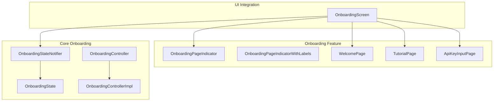
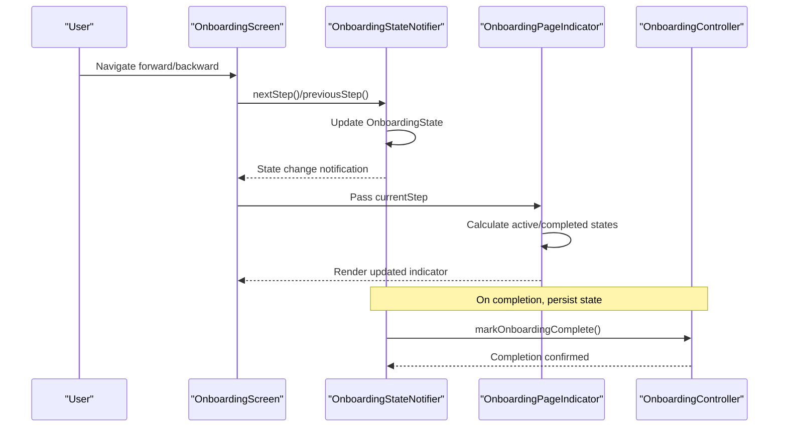
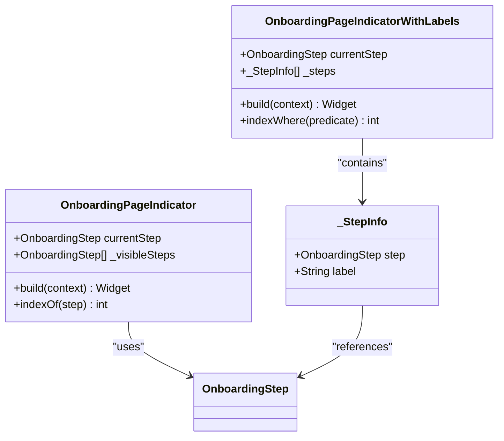
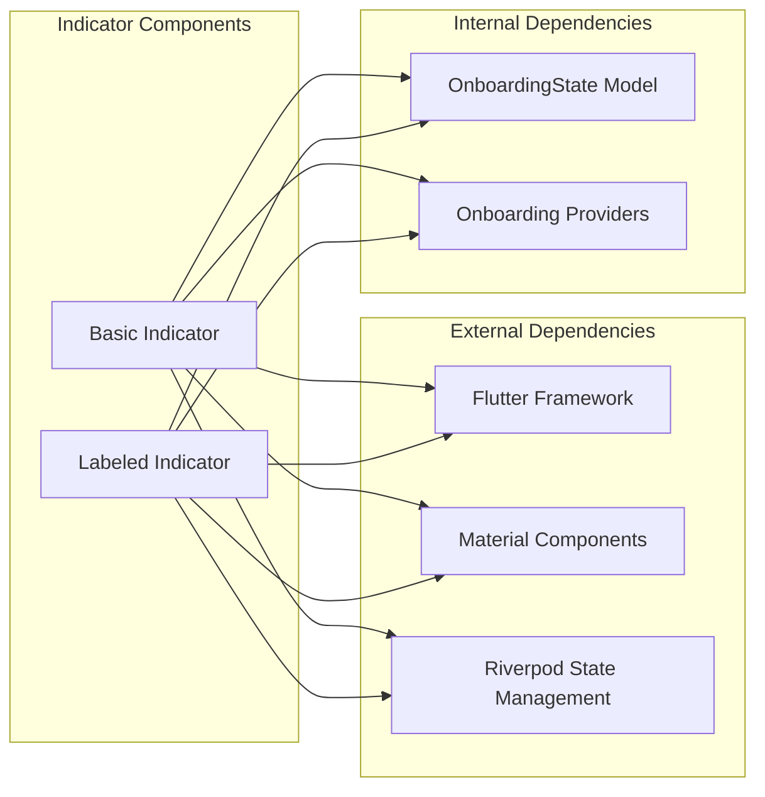

# Onboarding Page Indicator

<cite>
**Referenced Files in This Document**
- [onboarding_page_indicator.dart](file://lib/features/onboarding/widgets/onboarding_page_indicator.dart)
- [onboarding_screen.dart](file://lib/features/onboarding/onboarding_screen.dart)
- [onboarding_state.dart](file://lib/core/onboarding/models/onboarding_state.dart)
- [onboarding_providers.dart](file://lib/core/onboarding/onboarding_providers.dart)
- [onboarding_controller.dart](file://lib/core/onboarding/onboarding_controller.dart)
- [onboarding_controller_impl.dart](file://lib/core/onboarding/onboarding_controller_impl.dart)
- [welcome_page.dart](file://lib/features/onboarding/widgets/welcome_page.dart)
- [tutorial_page.dart](file://lib/features/onboarding/widgets/tutorial_page.dart)
- [api_key_input_page.dart](file://lib/features/onboarding/widgets/api_key_input_page.dart)
</cite>

## Table of Contents
1. [Introduction](#introduction)
2. [Project Structure](#project-structure)
3. [Core Components](#core-components)
4. [Architecture Overview](#architecture-overview)
5. [Detailed Component Analysis](#detailed-component-analysis)
6. [Dependency Analysis](#dependency-analysis)
7. [Performance Considerations](#performance-considerations)
8. [Troubleshooting Guide](#troubleshooting-guide)
9. [Conclusion](#conclusion)

## Introduction
This document provides comprehensive technical documentation for the OnboardingPageIndicator component, focusing on its role in visual progress tracking during the onboarding journey. The indicator communicates the user's current position among the onboarding steps, provides navigation cues, and enhances user orientation through clear visual feedback. The implementation demonstrates responsive design patterns, state-driven rendering, and integration with the broader onboarding state management system.

## Project Structure
The OnboardingPageIndicator resides within the onboarding feature module alongside related pages and state management infrastructure. The component integrates with Riverpod for reactive state updates and follows Material Design principles for consistent theming.

**Diagram sources**
- [onboarding_page_indicator.dart](file://lib/features/onboarding/widgets/onboarding_page_indicator.dart#L9-L58)
- [onboarding_screen.dart](file://lib/features/onboarding/onboarding_screen.dart#L15-L87)
- [onboarding_state.dart](file://lib/core/onboarding/models/onboarding_state.dart#L23-L47)
- [onboarding_providers.dart](file://lib/core/onboarding/onboarding_providers.dart#L59-L150)
- [onboarding_controller.dart](file://lib/core/onboarding/onboarding_controller.dart#L17-L46)
- [onboarding_controller_impl.dart](file://lib/core/onboarding/onboarding_controller_impl.dart#L16-L78)

**Section sources**
- [onboarding_page_indicator.dart](file://lib/features/onboarding/widgets/onboarding_page_indicator.dart#L1-L193)
- [onboarding_screen.dart](file://lib/features/onboarding/onboarding_screen.dart#L1-L122)

## Core Components
The OnboardingPageIndicator consists of two primary variants designed for different visual contexts:

### Basic Dot Indicator
The standard indicator displays horizontal bars representing each step in the onboarding flow. It uses animated transitions to reflect state changes and adapts colors based on the current step and completion status.

### Enhanced Indicator with Labels
An alternative variant provides step numbers, completion indicators, and descriptive labels. This version includes connecting lines between steps and visual feedback for active and completed states.

Both variants leverage the current step from the onboarding state to determine visual representation and apply Material Design theming for consistent appearance across light and dark modes.

**Section sources**
- [onboarding_page_indicator.dart](file://lib/features/onboarding/widgets/onboarding_page_indicator.dart#L9-L58)
- [onboarding_page_indicator.dart](file://lib/features/onboarding/widgets/onboarding_page_indicator.dart#L63-L181)

## Architecture Overview
The indicator participates in a reactive architecture powered by Riverpod, where state changes trigger UI updates without manual intervention. The system maintains separation of concerns between presentation, state management, and persistence.

**Diagram sources**
- [onboarding_screen.dart](file://lib/features/onboarding/onboarding_screen.dart#L113-L120)
- [onboarding_providers.dart](file://lib/core/onboarding/onboarding_providers.dart#L77-L102)
- [onboarding_controller_impl.dart](file://lib/core/onboarding/onboarding_controller_impl.dart#L64-L70)

## Detailed Component Analysis

### OnboardingPageIndicator Implementation
The basic indicator component renders a row of animated containers representing each step. The implementation focuses on three key states:

#### State Management and Rendering
- **Active Step**: The current step displays a wider container with primary color
- **Completed Steps**: Previous steps show filled containers with primary color
- **Upcoming Steps**: Future steps appear as narrow unfilled containers with surface colors

#### Animation and Visual Feedback
The component uses AnimatedContainer with smooth transitions to provide visual continuity when moving between steps. The animation duration and easing curve ensure responsive feedback without overwhelming the user.

#### Theming Integration
Colors adapt dynamically to the current theme's color scheme, ensuring accessibility and visual consistency across different design systems.

**Diagram sources**
- [onboarding_page_indicator.dart](file://lib/features/onboarding/widgets/onboarding_page_indicator.dart#L9-L58)
- [onboarding_page_indicator.dart](file://lib/features/onboarding/widgets/onboarding_page_indicator.dart#L63-L181)
- [onboarding_page_indicator.dart](file://lib/features/onboarding/widgets/onboarding_page_indicator.dart#L184-L192)

**Section sources**
- [onboarding_page_indicator.dart](file://lib/features/onboarding/widgets/onboarding_page_indicator.dart#L29-L57)
- [onboarding_page_indicator.dart](file://lib/features/onboarding/widgets/onboarding_page_indicator.dart#L82-L180)

### Enhanced Indicator with Labels
The labeled variant provides richer contextual information through:
- Step numbers displayed within circular indicators
- Connecting lines between steps indicating progression
- Completion icons for successfully completed steps
- Descriptive labels positioned beneath each step indicator

This variant is particularly useful for complex onboarding flows where users need clear understanding of their position and what comes next.

**Section sources**
- [onboarding_page_indicator.dart](file://lib/features/onboarding/widgets/onboarding_page_indicator.dart#L100-L177)

### Integration with Onboarding State Management
The indicator receives its step information through the onboarding state provider, which manages the complete flow state. The integration ensures that:
- The indicator updates automatically when the current step changes
- Navigation actions from the onboarding screen propagate state changes
- The component remains decoupled from specific navigation logic

**Section sources**
- [onboarding_screen.dart](file://lib/features/onboarding/onboarding_screen.dart#L51-L60)
- [onboarding_providers.dart](file://lib/core/onboarding/onboarding_providers.dart#L171-L175)

### Responsive Design Patterns
The indicator implementation demonstrates several responsive design principles:
- Flexible spacing using EdgeInsets.symmetric for consistent margins
- Adaptive sizing through AnimatedContainer width changes
- Dynamic color adaptation based on theme color schemes
- Cross-platform compatibility through Flutter's Material Design framework

**Section sources**
- [onboarding_page_indicator.dart](file://lib/features/onboarding/widgets/onboarding_page_indicator.dart#L40-L56)
- [onboarding_page_indicator.dart](file://lib/features/onboarding/widgets/onboarding_page_indicator.dart#L95-L179)

## Dependency Analysis
The OnboardingPageIndicator has minimal external dependencies, relying primarily on Flutter's Material Design components and the onboarding state model. This design promotes maintainability and reduces coupling to specific implementation details.

**Diagram sources**
- [onboarding_page_indicator.dart](file://lib/features/onboarding/widgets/onboarding_page_indicator.dart#L1-L3)
- [onboarding_state.dart](file://lib/core/onboarding/models/onboarding_state.dart#L5-L17)
- [onboarding_providers.dart](file://lib/core/onboarding/onboarding_providers.dart#L1-L5)

**Section sources**
- [onboarding_page_indicator.dart](file://lib/features/onboarding/widgets/onboarding_page_indicator.dart#L1-L3)
- [onboarding_state.dart](file://lib/core/onboarding/models/onboarding_state.dart#L1-L75)

## Performance Considerations
The indicator implementation prioritizes performance through several optimization strategies:
- Stateless widget design minimizes rebuild overhead
- Efficient list generation using List.generate for fixed step counts
- Minimal animation duration (200ms) balances responsiveness with performance
- Theme-based color calculations avoid expensive computations
- AnimatedContainer provides hardware-accelerated transitions

These choices ensure smooth performance across different device capabilities while maintaining visual appeal.

## Troubleshooting Guide
Common issues and their solutions when working with the OnboardingPageIndicator:

### Indicator Not Updating
**Symptoms**: The indicator remains static despite navigation changes
**Causes**: 
- Missing subscription to onboarding state provider
- Incorrect currentStep parameter passing
- State not being updated in the notifier

**Solutions**:
- Ensure the indicator receives updates through the state provider
- Verify that navigation callbacks properly call state transitions
- Check that the notifier's state changes are being observed

### Animation Issues
**Symptoms**: Janky or missing animations during step transitions
**Causes**:
- Insufficient animation duration settings
- State changes occurring too rapidly
- Theme switching affecting animation timing

**Solutions**:
- Maintain consistent animation durations across steps
- Debounce rapid state changes if necessary
- Test animations under different theme configurations

### Theming Problems
**Symptoms**: Indicator colors don't match the current theme
**Causes**:
- Theme not properly applied to the indicator context
- Color scheme changes not triggering rebuilds
- Hardcoded color values overriding theme settings

**Solutions**:
- Ensure the indicator is placed within a themed context
- Use Theme.of(context).colorScheme for dynamic color retrieval
- Remove hardcoded colors in favor of theme-dependent values

**Section sources**
- [onboarding_screen.dart](file://lib/features/onboarding/onboarding_screen.dart#L34-L45)
- [onboarding_providers.dart](file://lib/core/onboarding/onboarding_providers.dart#L77-L102)

## Conclusion
The OnboardingPageIndicator component exemplifies clean, maintainable UI architecture through its focused responsibilities, reactive integration, and adherence to Material Design principles. The implementation successfully balances visual clarity with performance considerations while providing flexible variants to suit different onboarding scenarios. Its integration with the broader onboarding state management system demonstrates effective separation of concerns and scalable architecture patterns suitable for production applications.

The component's design enables clear user orientation, provides immediate feedback on navigation actions, and adapts seamlessly to different themes and screen sizes. Through careful attention to animation timing, color theming, and state management integration, the indicator contributes significantly to the overall user experience during the onboarding journey.