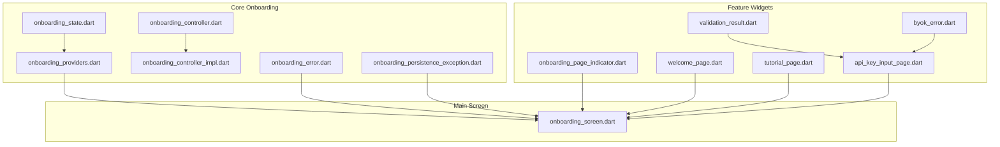
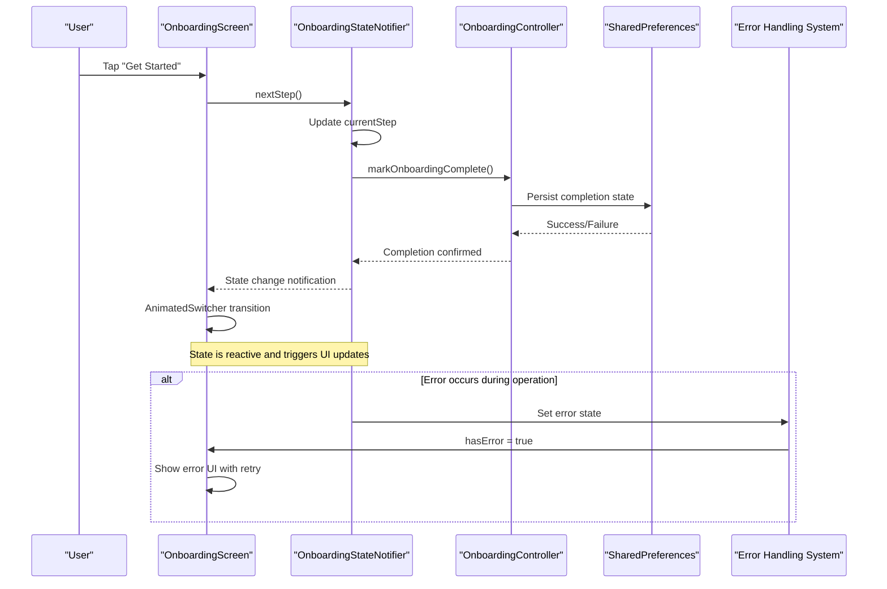
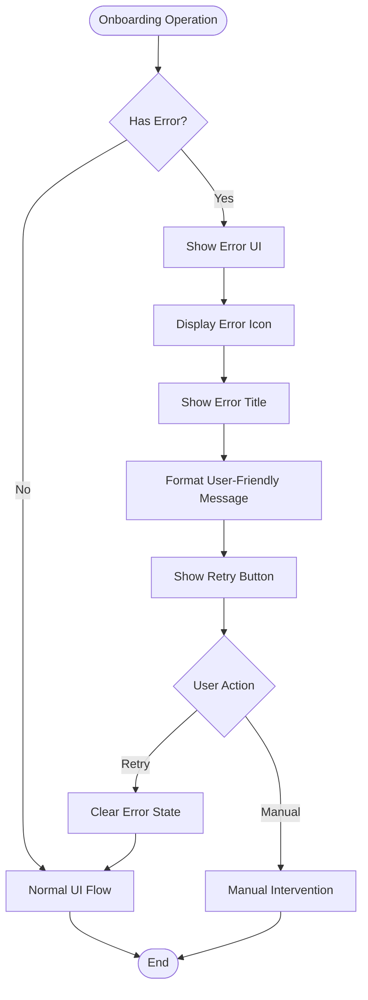
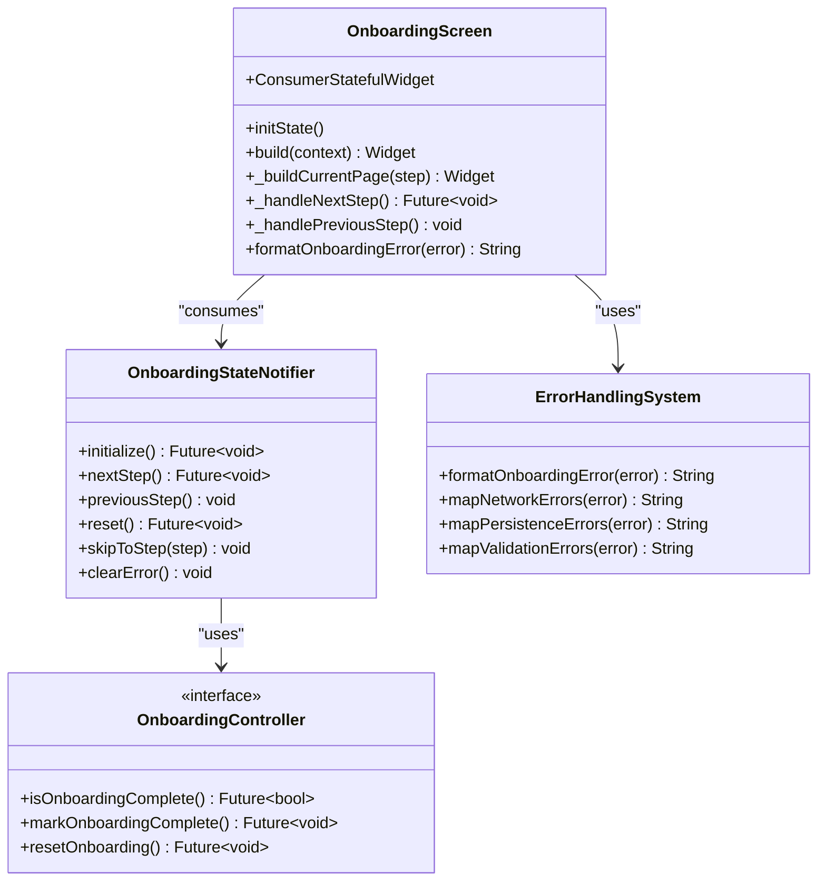
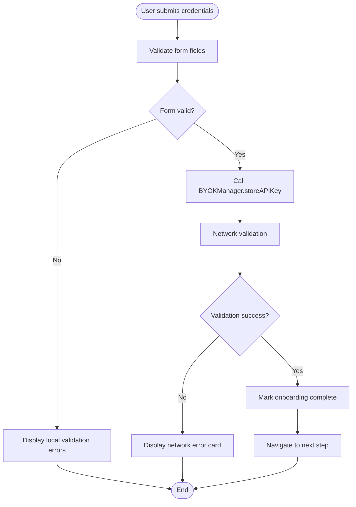
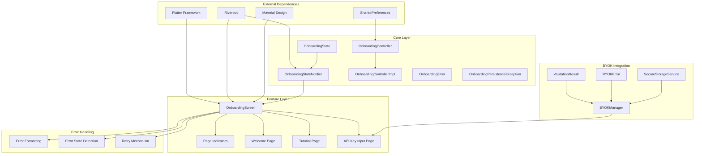

# Onboarding Screen

<cite>
**Referenced Files in This Document**
- [onboarding_screen.dart](file://lib/features/onboarding/onboarding_screen.dart)
- [onboarding_providers.dart](file://lib/core/onboarding/onboarding_providers.dart)
- [onboarding_controller.dart](file://lib/core/onboarding/onboarding_controller.dart)
- [onboarding_controller_impl.dart](file://lib/core/onboarding/onboarding_controller_impl.dart)
- [onboarding_state.dart](file://lib/core/onboarding/models/onboarding_state.dart)
- [onboarding_error.dart](file://lib/core/onboarding/models/onboarding_error.dart)
- [onboarding_persistence_exception.dart](file://lib/core/onboarding/models/onboarding_persistence_exception.dart)
- [onboarding_page_indicator.dart](file://lib/features/onboarding/widgets/onboarding_page_indicator.dart)
- [welcome_page.dart](file://lib/features/onboarding/widgets/welcome_page.dart)
- [tutorial_page.dart](file://lib/features/onboarding/widgets/tutorial_page.dart)
- [api_key_input_page.dart](file://lib/features/onboarding/widgets/api_key_input_page.dart)
- [validation_result.dart](file://lib/core/byok/models/validation_result.dart)
- [byok_error.dart](file://lib/core/byok/models/byok_error.dart)
- [byok_manager.dart](file://lib/core/byok/byok_manager.dart)
- [onboarding_screen_test.dart](file://test/features/onboarding/onboarding_screen_test.dart)
</cite>

## Update Summary
**Changes Made**
- Enhanced error handling UI with comprehensive error state detection and user feedback mechanisms
- Added dedicated error screen with retry functionality and formatted error messages
- Implemented sophisticated error type mapping for network, persistence, and validation errors
- Improved user feedback through contextual error cards and retry actions
- Added robust error state management with clear recovery pathways

## Table of Contents
1. [Introduction](#introduction)
2. [Project Structure](#project-structure)
3. [Core Components](#core-components)
4. [Architecture Overview](#architecture-overview)
5. [Enhanced Error Handling System](#enhanced-error-handling-system)
6. [Detailed Component Analysis](#detailed-component-analysis)
7. [Dependency Analysis](#dependency-analysis)
8. [Performance Considerations](#performance-considerations)
9. [Troubleshooting Guide](#troubleshooting-guide)
10. [Conclusion](#conclusion)

## Introduction
The OnboardingScreen widget serves as the primary container for guiding new users through the StyleSync onboarding flow. It manages step-based navigation, animated page transitions, and integrates with Riverpod for state management. The screen coordinates between three distinct pages: Welcome, Tutorial, and API Key Input, while providing visual indicators and smooth animations between steps.

**Updated** Enhanced with comprehensive error handling UI that provides users with clear feedback, actionable retry mechanisms, and contextual error information throughout the onboarding process.

## Project Structure
The onboarding feature is organized into two main areas:
- Core onboarding logic and state management in the core/onboarding directory
- Feature-specific UI widgets in features/onboarding/widgets directory
- The main onboarding screen implementation in features/onboarding/onboarding_screen.dart

**Diagram sources**
- [onboarding_state.dart](file://lib/core/onboarding/models/onboarding_state.dart#L1-L101)
- [onboarding_providers.dart](file://lib/core/onboarding/onboarding_providers.dart#L1-L176)
- [onboarding_controller.dart](file://lib/core/onboarding/onboarding_controller.dart#L1-L47)
- [onboarding_controller_impl.dart](file://lib/core/onboarding/onboarding_controller_impl.dart#L1-L79)
- [onboarding_error.dart](file://lib/core/onboarding/models/onboarding_error.dart#L1-L80)
- [onboarding_persistence_exception.dart](file://lib/core/onboarding/models/onboarding_persistence_exception.dart#L1-L30)
- [onboarding_page_indicator.dart](file://lib/features/onboarding/widgets/onboarding_page_indicator.dart#L1-L195)
- [welcome_page.dart](file://lib/features/onboarding/widgets/welcome_page.dart#L1-L188)
- [tutorial_page.dart](file://lib/features/onboarding/widgets/tutorial_page.dart#L1-L516)
- [api_key_input_page.dart](file://lib/features/onboarding/widgets/api_key_input_page.dart#L1-L555)
- [validation_result.dart](file://lib/core/byok/models/validation_result.dart#L1-L188)
- [byok_error.dart](file://lib/core/byok/models/byok_error.dart#L1-L95)
- [onboarding_screen.dart](file://lib/features/onboarding/onboarding_screen.dart#L1-L211)

**Section sources**
- [onboarding_screen.dart](file://lib/features/onboarding/onboarding_screen.dart#L1-L211)
- [onboarding_providers.dart](file://lib/core/onboarding/onboarding_providers.dart#L1-L176)

## Core Components
The OnboardingScreen relies on several core components working together:

### State Management Architecture
The screen uses Riverpod's StateNotifier pattern with a dedicated OnboardingStateNotifier that manages the current step and completion state. The notifier integrates with OnboardingController for persistence operations.

### Page Navigation System
The implementation supports four distinct steps:
- Welcome: Initial introduction to the app
- Tutorial: Instructions for obtaining API credentials
- API Key Input: Secure credential entry and validation
- Complete: Final state indicating onboarding completion

### Animation and Transition System
The screen employs AnimatedSwitcher with custom transition builders to provide smooth fade and slide animations between pages, enhancing the user experience during step changes.

**Updated** Enhanced error handling system with dedicated error state detection, formatted user-friendly messages, and comprehensive retry functionality.

**Section sources**
- [onboarding_providers.dart](file://lib/core/onboarding/onboarding_providers.dart#L54-L150)
- [onboarding_state.dart](file://lib/core/onboarding/models/onboarding_state.dart#L1-L101)
- [onboarding_screen.dart](file://lib/features/onboarding/onboarding_screen.dart#L63-L81)

## Architecture Overview
The OnboardingScreen implements a clean separation of concerns with clear boundaries between state management, UI presentation, and persistence logic.

**Diagram sources**
- [onboarding_screen.dart](file://lib/features/onboarding/onboarding_screen.dart#L112-L120)
- [onboarding_providers.dart](file://lib/core/onboarding/onboarding_providers.dart#L77-L102)
- [onboarding_controller_impl.dart](file://lib/core/onboarding/onboarding_controller_impl.dart#L64-L70)

## Enhanced Error Handling System

### Error State Detection and Management
The OnboardingScreen now includes sophisticated error state detection that monitors the OnboardingState for error conditions and presents appropriate user feedback.

### Error Formatting and User-Friendly Messages
A dedicated `formatOnboardingError` function provides contextual, user-friendly error messages based on error type:
- Network errors (SocketException, TimeoutException, HttpException)
- Persistence errors (OnboardingPersistenceException)
- Format errors (FormatException)
- State errors (StateError)
- Generic fallback for unknown errors

### Error UI Components
When an error is detected, the screen displays a comprehensive error interface:
- Large error icon with theme-appropriate coloring
- Clear error title ("Failed to complete onboarding")
- Contextual error message based on error type
- Prominent retry button with `clearError()` action
- Centered layout with appropriate spacing and alignment

### Retry Functionality
Users can easily retry failed operations through the retry button, which clears the error state and allows the user to continue the onboarding process.

**Diagram sources**
- [onboarding_screen.dart](file://lib/features/onboarding/onboarding_screen.dart#L96-L134)
- [onboarding_screen.dart](file://lib/features/onboarding/onboarding_screen.dart#L21-L58)

**Section sources**
- [onboarding_screen.dart](file://lib/features/onboarding/onboarding_screen.dart#L21-L58)
- [onboarding_screen.dart](file://lib/features/onboarding/onboarding_screen.dart#L96-L134)
- [onboarding_state.dart](file://lib/core/onboarding/models/onboarding_state.dart#L71-L72)

## Detailed Component Analysis

### OnboardingScreen Widget
The main container widget that orchestrates the entire onboarding experience.

#### Initialization and Lifecycle
The screen initializes the onboarding state during its first build cycle using a post-frame callback to ensure proper widget mounting before state initialization.

#### State Management Integration
The widget uses ConsumerStatefulWidget to integrate with Riverpod, watching the onboardingStateProvider for reactive updates and reading the notifier for state mutations.

#### Enhanced Error Handling Integration
The screen now includes comprehensive error handling logic that:
- Monitors `onboardingState.hasError` for error state detection
- Displays dedicated error UI when errors are present
- Provides formatted, user-friendly error messages
- Enables retry functionality through clearError()

#### Page Composition and Animation
The screen structures content with a column layout containing:
- Top-aligned page indicator showing current progress
- Expanded animated content area with AnimatedSwitcher
- Responsive page content based on current step
- Error overlay when error state is detected

**Diagram sources**
- [onboarding_screen.dart](file://lib/features/onboarding/onboarding_screen.dart#L15-L211)
- [onboarding_providers.dart](file://lib/core/onboarding/onboarding_providers.dart#L59-L150)
- [onboarding_controller.dart](file://lib/core/onboarding/onboarding_controller.dart#L17-L46)

**Section sources**
- [onboarding_screen.dart](file://lib/features/onboarding/onboarding_screen.dart#L23-L211)

### Page Indicator Component
Provides visual feedback on current onboarding progress with animated state changes.

#### Design Features
- Horizontal row of animated containers representing each step
- Smooth width transitions for active/current states
- Color scheme integration for theme consistency
- Responsive sizing with curved animations

#### Implementation Details
The indicator excludes the complete step from display as it represents terminal state rather than a visible page.

**Section sources**
- [onboarding_page_indicator.dart](file://lib/features/onboarding/widgets/onboarding_page_indicator.dart#L9-L59)

### Welcome Page
First step of the onboarding flow featuring app introduction and feature highlights.

#### Content Structure
- App branding with logo placeholder
- Feature cards showcasing core capabilities
- Prominent call-to-action button
- Responsive spacing and typography

#### Styling Approach
Uses Material Design color schemes and follows accessibility guidelines with proper contrast ratios and readable font sizes.

**Section sources**
- [welcome_page.dart](file://lib/features/onboarding/widgets/welcome_page.dart#L7-L114)

### Tutorial Page
Educational step explaining API key acquisition process.

#### Interactive Elements
- Step-by-step instructions with numbered indicators
- External link integration for Google Cloud Console
- Quota information with pricing tiers
- Comprehensive bottom navigation

#### Enhanced Error Handling
Includes robust error handling for external link launching with user-friendly feedback messages and internal error logging for debugging purposes.

**Section sources**
- [tutorial_page.dart](file://lib/features/onboarding/widgets/tutorial_page.dart#L11-L156)

### API Key Input Page
Critical security step for credential entry and validation.

#### Security Features
- Toggleable password visibility
- Local validation before network calls
- Secure error messaging without exposing sensitive details
- Loading states during validation

#### Enhanced Error Handling
Implements comprehensive client-side validation for both API key format and project ID, with detailed error messages for different failure scenarios. Includes specialized error cards with contextual icons and titles for different error types.

#### Validation Logic
Implements comprehensive client-side validation for both API key format and project ID, with detailed error messages for different failure scenarios.

**Diagram sources**
- [api_key_input_page.dart](file://lib/features/onboarding/widgets/api_key_input_page.dart#L252-L307)
- [byok_manager.dart](file://lib/core/byok/byok_manager.dart#L182-L231)

**Section sources**
- [api_key_input_page.dart](file://lib/features/onboarding/widgets/api_key_input_page.dart#L12-L31)

## Dependency Analysis
The onboarding system demonstrates excellent separation of concerns with clear dependency relationships.

**Diagram sources**
- [onboarding_providers.dart](file://lib/core/onboarding/onboarding_providers.dart#L1-L176)
- [onboarding_controller_impl.dart](file://lib/core/onboarding/onboarding_controller_impl.dart#L1-L79)
- [byok_manager.dart](file://lib/core/byok/byok_manager.dart#L1-L583)
- [onboarding_error.dart](file://lib/core/onboarding/models/onboarding_error.dart#L1-L80)
- [onboarding_persistence_exception.dart](file://lib/core/onboarding/models/onboarding_persistence_exception.dart#L1-L30)

### State Management Patterns
The implementation follows Riverpod best practices with:
- Separate providers for different concerns (state, controller, persistence)
- Immutable state objects with copyWith patterns
- Reactive updates through StateNotifier
- Proper error handling and loading states

### Navigation Logic
The screen implements bidirectional navigation with:
- Forward progression through nextStep()
- Backward navigation with previousStep()
- Guardrails preventing invalid state transitions
- Automatic completion marking on final step

### Enhanced Error Handling Patterns
The system now includes comprehensive error handling patterns:
- Centralized error formatting with type-specific messages
- Error state detection and UI switching
- Contextual error cards with icons and titles
- Seamless retry functionality
- Internal error logging for debugging

**Section sources**
- [onboarding_providers.dart](file://lib/core/onboarding/onboarding_providers.dart#L59-L150)
- [onboarding_screen.dart](file://lib/features/onboarding/onboarding_screen.dart#L112-L120)

## Performance Considerations
The onboarding screen is designed with performance in mind:

### Animation Optimization
- Lightweight AnimatedSwitcher with minimal transition complexity
- CurvedAnimation for smooth easing effects
- Efficient state updates through Riverpod's selective re-rendering

### Memory Management
- Proper disposal of TextEditingController and FocusNode instances
- Conditional widget building based on current step
- Lazy initialization of expensive resources

### Persistence Efficiency
- Thread-safe SharedPreferences access with initialization caching
- Minimal persistence operations during navigation
- Asynchronous operations to prevent UI blocking

### Error Handling Performance
- Efficient error state detection through hasError property
- Lightweight error UI rendering only when needed
- Minimal overhead for error formatting functions
- Optimized retry functionality with state clearing

## Troubleshooting Guide

### Common Issues and Solutions

#### Navigation Not Working
- Verify that state provider is properly initialized
- Check that callbacks are being passed correctly to child widgets
- Ensure proper widget key assignment for AnimatedSwitcher

#### Animation Problems
- Confirm AnimatedSwitcher has unique keys for each page
- Verify transitionBuilder is properly configured
- Check that child widgets are not rebuilding unnecessarily

#### State Synchronization Issues
- Ensure onboardingStateProvider.notifier is accessed correctly
- Verify that state changes are happening on the correct isolate
- Check for proper error handling in async operations

#### API Key Validation Failures
- Review local validation logic for format compliance
- Check network connectivity for remote validation
- Verify error handling for different failure scenarios

#### Error Handling Issues
- Verify error state detection through hasError property
- Check that formatOnboardingError handles all error types
- Ensure retry button properly clears error state
- Confirm error UI appears when error state is set

#### Error Message Formatting Problems
- Verify error type checking logic in formatOnboardingError
- Check that network error detection uses runtimeType strings
- Ensure persistence errors are properly mapped
- Confirm fallback error messages work correctly

**Section sources**
- [onboarding_screen_test.dart](file://test/features/onboarding/onboarding_screen_test.dart#L27-L67)
- [api_key_input_page.dart](file://lib/features/onboarding/widgets/api_key_input_page.dart#L252-L307)

## Conclusion
The OnboardingScreen implementation demonstrates a mature approach to mobile onboarding with robust state management, smooth user experience, and clear architectural boundaries. The Riverpod integration provides reactive state updates while maintaining separation of concerns between UI presentation and business logic. The modular design allows for easy extension and maintenance, making it a solid foundation for future onboarding enhancements.

**Updated** The enhanced error handling system significantly improves user experience by providing clear, contextual error feedback, actionable retry mechanisms, and comprehensive error state management. The system successfully balances user experience with technical excellence, offering meaningful progress indication, seamless transitions, and robust error recovery throughout the onboarding process.

The implementation successfully balances user experience with technical excellence, providing clear navigation, meaningful progress indication, and seamless transitions between onboarding steps. The integration with BYOK security patterns ensures that sensitive credential handling follows industry best practices while maintaining a smooth user experience. The comprehensive error handling system adds professional polish and reliability to the onboarding experience, making it more resilient and user-friendly.