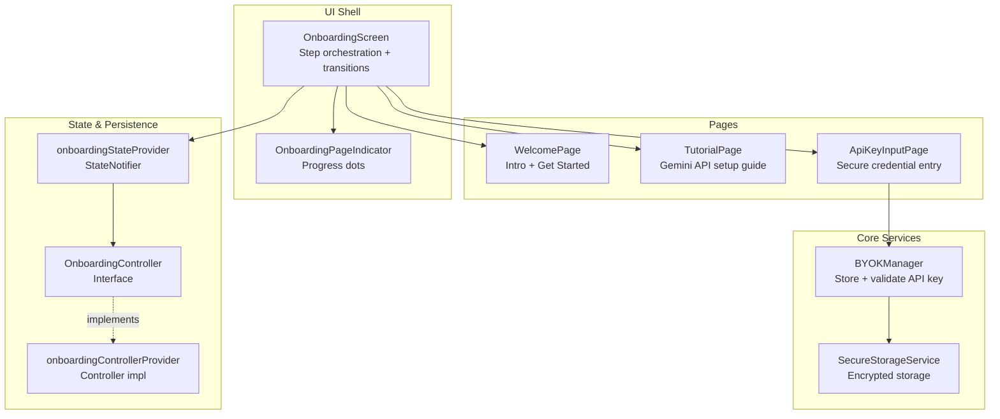
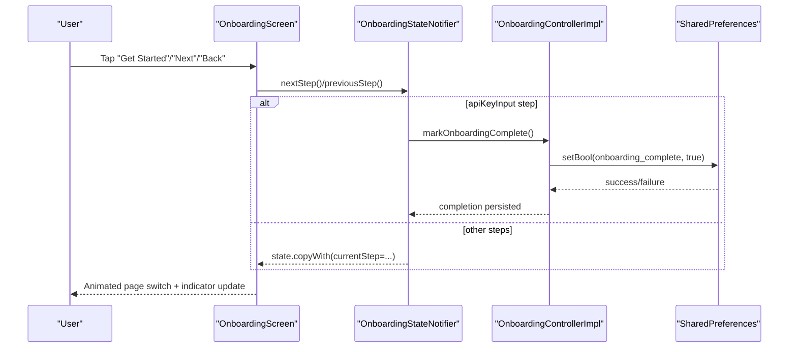
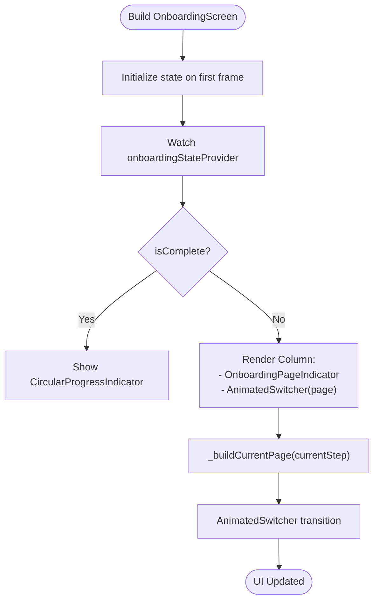
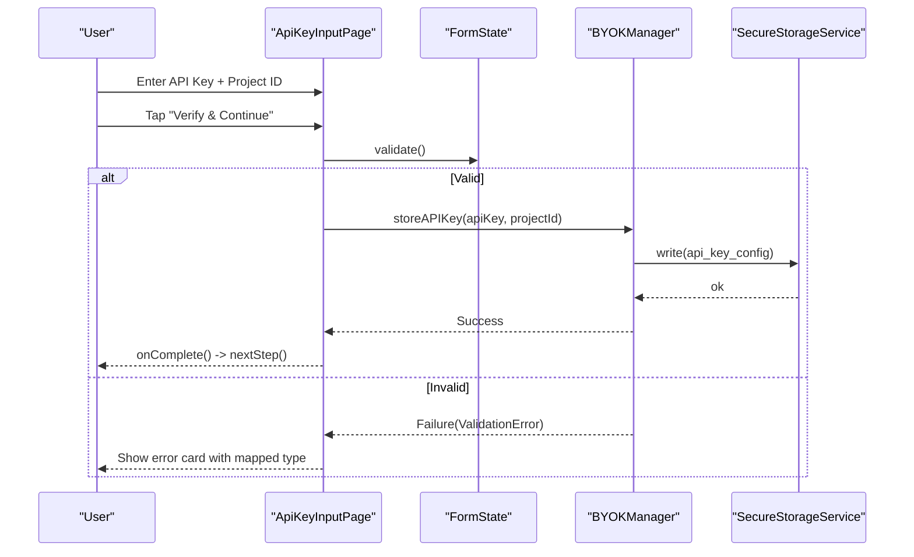
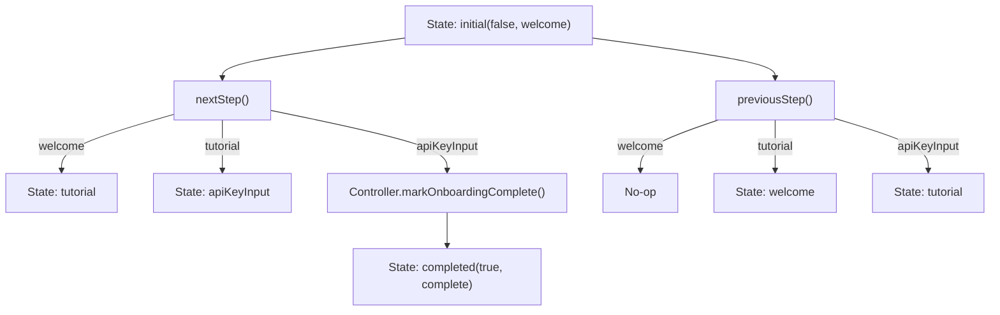
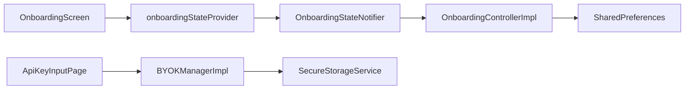

# Onboarding System

<cite>
**Referenced Files in This Document**
- [lib/features/onboarding/onboarding_screen.dart](file://lib/features/onboarding/onboarding_screen.dart)
- [lib/features/onboarding/widgets/welcome_page.dart](file://lib/features/onboarding/widgets/welcome_page.dart)
- [lib/features/onboarding/widgets/tutorial_page.dart](file://lib/features/onboarding/widgets/tutorial_page.dart)
- [lib/features/onboarding/widgets/api_key_input_page.dart](file://lib/features/onboarding/widgets/api_key_input_page.dart)
- [lib/features/onboarding/widgets/onboarding_page_indicator.dart](file://lib/features/onboarding/widgets/onboarding_page_indicator.dart)
- [lib/core/onboarding/models/onboarding_state.dart](file://lib/core/onboarding/models/onboarding_state.dart)
- [lib/core/onboarding/onboarding_providers.dart](file://lib/core/onboarding/onboarding_providers.dart)
- [lib/core/onboarding/onboarding_controller.dart](file://lib/core/onboarding/onboarding_controller.dart)
- [lib/core/onboarding/onboarding_controller_impl.dart](file://lib/core/onboarding/onboarding_controller_impl.dart)
- [lib/core/byok/byok_manager.dart](file://lib/core/byok/byok_manager.dart)
- [lib/core/byok/byok_storage_keys.dart](file://lib/core/byok/byok_storage_keys.dart)
- [lib/core/storage/secure_storage_service.dart](file://lib/core/storage/secure_storage_service.dart)
- [test/features/onboarding/onboarding_screen_test.dart](file://test/features/onboarding/onboarding_screen_test.dart)
- [test/core/onboarding/onboarding_persistence_property_test.dart](file://test/core/onboarding/onboarding_persistence_property_test.dart)
</cite>

## Table of Contents
1. [Introduction](#introduction)
2. [Project Structure](#project-structure)
3. [Core Components](#core-components)
4. [Architecture Overview](#architecture-overview)
5. [Detailed Component Analysis](#detailed-component-analysis)
6. [Dependency Analysis](#dependency-analysis)
7. [Performance Considerations](#performance-considerations)
8. [Troubleshooting Guide](#troubleshooting-guide)
9. [Conclusion](#conclusion)
10. [Appendices](#appendices)

## Introduction
This document describes the Onboarding System that guides new users through initial setup, including a welcome experience, a guided tutorial for obtaining an API key, and secure credential entry. The system is built with a step-based navigation model, animated transitions, and reactive state management powered by Riverpod. It persists completion state across app sessions and integrates with core services for secure storage and validation.

## Project Structure
The onboarding system is organized into:
- Core state and persistence: onboarding state machine, Riverpod providers, and controller abstraction with implementation
- UI shell and page components: OnboardingScreen orchestrating step-based pages with animated transitions and a page indicator
- Individual pages: WelcomePage, TutorialPage, and ApiKeyInputPage
- Integration with BYOK (Bring-Your-Own-Key) services for secure API key storage and validation

**Diagram sources**
- [lib/features/onboarding/onboarding_screen.dart](file://lib/features/onboarding/onboarding_screen.dart#L1-L122)
- [lib/features/onboarding/widgets/onboarding_page_indicator.dart](file://lib/features/onboarding/widgets/onboarding_page_indicator.dart#L1-L193)
- [lib/features/onboarding/widgets/welcome_page.dart](file://lib/features/onboarding/widgets/welcome_page.dart#L1-L188)
- [lib/features/onboarding/widgets/tutorial_page.dart](file://lib/features/onboarding/widgets/tutorial_page.dart#L1-L512)
- [lib/features/onboarding/widgets/api_key_input_page.dart](file://lib/features/onboarding/widgets/api_key_input_page.dart#L1-L555)
- [lib/core/onboarding/onboarding_providers.dart](file://lib/core/onboarding/onboarding_providers.dart#L1-L176)
- [lib/core/onboarding/onboarding_controller.dart](file://lib/core/onboarding/onboarding_controller.dart#L1-L47)
- [lib/core/onboarding/onboarding_controller_impl.dart](file://lib/core/onboarding/onboarding_controller_impl.dart#L1-L79)
- [lib/core/byok/byok_manager.dart](file://lib/core/byok/byok_manager.dart#L1-L583)
- [lib/core/storage/secure_storage_service.dart](file://lib/core/storage/secure_storage_service.dart#L1-L30)

**Section sources**
- [lib/features/onboarding/onboarding_screen.dart](file://lib/features/onboarding/onboarding_screen.dart#L1-L122)
- [lib/core/onboarding/onboarding_providers.dart](file://lib/core/onboarding/onboarding_providers.dart#L1-L176)

## Core Components
- OnboardingScreen: Hosts the step-based flow, renders the current page, and applies animated transitions. It initializes state on first frame and delegates navigation to the state notifier.
- OnboardingPageIndicator: Visual indicator showing current step with animated width/color changes.
- WelcomePage: Initial engagement page with feature highlights and a “Get Started” action.
- TutorialPage: Step-by-step instructions for obtaining a Gemini API key, with links to external resources and quota information.
- ApiKeyInputPage: Secure credential entry with local validation and integration with BYOKManager for storage and validation.
- OnboardingState and OnboardingStep: Immutable state model and step enumeration.
- OnboardingStateNotifier: Reactive state transitions, persistence-aware navigation, and reset/skip helpers.
- OnboardingController and OnboardingControllerImpl: Abstraction and SharedPreferences-backed persistence for completion state.

**Section sources**
- [lib/features/onboarding/onboarding_screen.dart](file://lib/features/onboarding/onboarding_screen.dart#L11-L122)
- [lib/features/onboarding/widgets/onboarding_page_indicator.dart](file://lib/features/onboarding/widgets/onboarding_page_indicator.dart#L1-L193)
- [lib/features/onboarding/widgets/welcome_page.dart](file://lib/features/onboarding/widgets/welcome_page.dart#L1-L188)
- [lib/features/onboarding/widgets/tutorial_page.dart](file://lib/features/onboarding/widgets/tutorial_page.dart#L1-L512)
- [lib/features/onboarding/widgets/api_key_input_page.dart](file://lib/features/onboarding/widgets/api_key_input_page.dart#L1-L555)
- [lib/core/onboarding/models/onboarding_state.dart](file://lib/core/onboarding/models/onboarding_state.dart#L1-L75)
- [lib/core/onboarding/onboarding_providers.dart](file://lib/core/onboarding/onboarding_providers.dart#L54-L176)
- [lib/core/onboarding/onboarding_controller.dart](file://lib/core/onboarding/onboarding_controller.dart#L1-L47)
- [lib/core/onboarding/onboarding_controller_impl.dart](file://lib/core/onboarding/onboarding_controller_impl.dart#L1-L79)

## Architecture Overview
The onboarding flow is driven by Riverpod:
- Providers supply the state notifier and controller
- OnboardingScreen watches the state and switches pages
- Navigation triggers state transitions, persisting completion when the final step is reached

**Diagram sources**
- [lib/features/onboarding/onboarding_screen.dart](file://lib/features/onboarding/onboarding_screen.dart#L112-L121)
- [lib/core/onboarding/onboarding_providers.dart](file://lib/core/onboarding/onboarding_providers.dart#L77-L122)
- [lib/core/onboarding/onboarding_controller_impl.dart](file://lib/core/onboarding/onboarding_controller_impl.dart#L64-L70)

## Detailed Component Analysis

### OnboardingScreen
- Responsibilities:
  - Initialize onboarding state on first frame
  - Render OnboardingPageIndicator
  - Switch pages with AnimatedSwitcher and Fade+Slide transitions
  - Route navigation callbacks to the state notifier
- State management:
  - Watches onboardingStateProvider
  - Calls nextStep() and previousStep() on user actions
- UX:
  - SafeArea + Expanded layout
  - AnimatedSwitcher with duration and transition builder
  - Keys for stable page identity

**Diagram sources**
- [lib/features/onboarding/onboarding_screen.dart](file://lib/features/onboarding/onboarding_screen.dart#L23-L121)

**Section sources**
- [lib/features/onboarding/onboarding_screen.dart](file://lib/features/onboarding/onboarding_screen.dart#L11-L122)

### WelcomePage
- Purpose: Introduce the app and invite users to start onboarding
- Features:
  - Feature cards with icons and descriptions
  - “Get Started” button wired to onGetStarted callback
  - Responsive spacing and typography using theme
- Accessibility:
  - Large touch targets for buttons
  - Semantic text styles from theme

**Section sources**
- [lib/features/onboarding/widgets/welcome_page.dart](file://lib/features/onboarding/widgets/welcome_page.dart#L1-L188)

### TutorialPage
- Purpose: Guide users to obtain a Gemini API key
- Features:
  - Step-by-step instructions with numbered steps
  - Links to Google Cloud Console, Vertex AI enablement, and credentials pages
  - Notice cards for warnings and quota information
  - Bottom navigation with Back and Next actions
- UX:
  - Scrollable content area with safe horizontal padding
  - External link launching with fallback snackbars

**Section sources**
- [lib/features/onboarding/widgets/tutorial_page.dart](file://lib/features/onboarding/widgets/tutorial_page.dart#L1-L512)

### ApiKeyInputPage
- Purpose: Securely collect and validate API key and Project ID
- Features:
  - Local validators for format and Project ID
  - Secure visibility toggle for API key
  - Integration with BYOKManager for storage and validation
  - Error card with contextual hints mapped to validation failure types
  - Security notice emphasizing local storage
  - Bottom navigation with Back and “Verify & Continue”
- Flow:
  - Validate form
  - Call byokManagerProvider.storeAPIKey()
  - On success: invoke onComplete()
  - On failure: render error card with mapped type and hint

**Diagram sources**
- [lib/features/onboarding/widgets/api_key_input_page.dart](file://lib/features/onboarding/widgets/api_key_input_page.dart#L252-L307)
- [lib/core/byok/byok_manager.dart](file://lib/core/byok/byok_manager.dart#L182-L231)
- [lib/core/storage/secure_storage_service.dart](file://lib/core/storage/secure_storage_service.dart#L11-L30)

**Section sources**
- [lib/features/onboarding/widgets/api_key_input_page.dart](file://lib/features/onboarding/widgets/api_key_input_page.dart#L1-L555)
- [lib/core/byok/byok_manager.dart](file://lib/core/byok/byok_manager.dart#L1-L583)
- [lib/core/byok/byok_storage_keys.dart](file://lib/core/byok/byok_storage_keys.dart#L1-L15)
- [lib/core/storage/secure_storage_service.dart](file://lib/core/storage/secure_storage_service.dart#L1-L30)

### OnboardingPageIndicator
- Purpose: Visual progress tracker for the first three steps
- Behavior:
  - Dots animate width and color based on current step
  - Two variants: simple dots and labeled steps with connecting lines

**Section sources**
- [lib/features/onboarding/widgets/onboarding_page_indicator.dart](file://lib/features/onboarding/widgets/onboarding_page_indicator.dart#L1-L193)

### OnboardingState and OnboardingStep
- OnboardingStep: Enumerates welcome, tutorial, apiKeyInput, complete
- OnboardingState: Immutable snapshot with isComplete and currentStep, plus copyWith

**Section sources**
- [lib/core/onboarding/models/onboarding_state.dart](file://lib/core/onboarding/models/onboarding_state.dart#L1-L75)

### OnboardingStateNotifier
- Responsibilities:
  - initialize(): read completion from controller and set state accordingly
  - nextStep(): advance step; on apiKeyInput, persist completion
  - previousStep(): move backward; guard first/last steps
  - reset(): clear persisted state and return to welcome
  - skipToStep(): jump to a step (avoid bypassing completion)
- Persistence:
  - Delegates completion to OnboardingController

**Diagram sources**
- [lib/core/onboarding/onboarding_providers.dart](file://lib/core/onboarding/onboarding_providers.dart#L77-L122)

**Section sources**
- [lib/core/onboarding/onboarding_providers.dart](file://lib/core/onboarding/onboarding_providers.dart#L54-L176)

### OnboardingController and OnboardingControllerImpl
- OnboardingController: Abstract interface for completion state queries and mutations
- OnboardingControllerImpl:
  - Uses SharedPreferences for persistence
  - Thread-safe lazy initialization via Completer
  - markOnboardingComplete() writes a boolean flag; resetOnboarding() removes it

**Section sources**
- [lib/core/onboarding/onboarding_controller.dart](file://lib/core/onboarding/onboarding_controller.dart#L1-L47)
- [lib/core/onboarding/onboarding_controller_impl.dart](file://lib/core/onboarding/onboarding_controller_impl.dart#L1-L79)
- [test/core/onboarding/onboarding_persistence_property_test.dart](file://test/core/onboarding/onboarding_persistence_property_test.dart#L1-L483)

## Dependency Analysis
- UI depends on Riverpod providers for state and controller
- ApiKeyInputPage depends on BYOKManager for validation and storage
- BYOKManager depends on SecureStorageService for encrypted persistence
- Persistence is centralized in SharedPreferences via OnboardingControllerImpl

**Diagram sources**
- [lib/features/onboarding/onboarding_screen.dart](file://lib/features/onboarding/onboarding_screen.dart#L1-L122)
- [lib/core/onboarding/onboarding_providers.dart](file://lib/core/onboarding/onboarding_providers.dart#L1-L176)
- [lib/core/onboarding/onboarding_controller_impl.dart](file://lib/core/onboarding/onboarding_controller_impl.dart#L1-L79)
- [lib/features/onboarding/widgets/api_key_input_page.dart](file://lib/features/onboarding/widgets/api_key_input_page.dart#L1-L555)
- [lib/core/byok/byok_manager.dart](file://lib/core/byok/byok_manager.dart#L1-L583)
- [lib/core/storage/secure_storage_service.dart](file://lib/core/storage/secure_storage_service.dart#L1-L30)

**Section sources**
- [lib/core/onboarding/onboarding_providers.dart](file://lib/core/onboarding/onboarding_providers.dart#L1-L176)
- [lib/core/onboarding/onboarding_controller_impl.dart](file://lib/core/onboarding/onboarding_controller_impl.dart#L1-L79)
- [lib/features/onboarding/widgets/api_key_input_page.dart](file://lib/features/onboarding/widgets/api_key_input_page.dart#L1-L555)
- [lib/core/byok/byok_manager.dart](file://lib/core/byok/byok_manager.dart#L1-L583)
- [lib/core/storage/secure_storage_service.dart](file://lib/core/storage/secure_storage_service.dart#L1-L30)

## Performance Considerations
- AnimatedSwitcher duration is tuned for smoothness without lag
- State transitions are lightweight; persistence occurs only at step boundaries
- ApiKeyInputPage disables fields during async validation to avoid redundant submissions
- BYOKManager performs local format validation before network calls to reduce latency

[No sources needed since this section provides general guidance]

## Troubleshooting Guide
Common issues and resolutions:
- Onboarding not completing:
  - Ensure nextStep() is called from the final page and that markOnboardingComplete() succeeds
  - Verify SharedPreferences write returns success
- API key validation failures:
  - Confirm local format validation passes before calling BYOKManager
  - Inspect error card mapping for failure type and suggested hints
- Persistence resets unexpectedly:
  - resetOnboarding() removes the completion flag; confirm not triggered unintentionally
- UI not reflecting state:
  - Ensure Consumer widgets watch onboardingStateProvider and that initialize() runs on first frame

**Section sources**
- [lib/core/onboarding/onboarding_providers.dart](file://lib/core/onboarding/onboarding_providers.dart#L70-L75)
- [lib/core/onboarding/onboarding_controller_impl.dart](file://lib/core/onboarding/onboarding_controller_impl.dart#L64-L70)
- [lib/features/onboarding/widgets/api_key_input_page.dart](file://lib/features/onboarding/widgets/api_key_input_page.dart#L252-L307)
- [test/features/onboarding/onboarding_screen_test.dart](file://test/features/onboarding/onboarding_screen_test.dart#L1-L436)
- [test/core/onboarding/onboarding_persistence_property_test.dart](file://test/core/onboarding/onboarding_persistence_property_test.dart#L1-L483)

## Conclusion
The Onboarding System provides a clear, animated, and resilient user journey from welcome to secure credential entry. Riverpod powers reactive state transitions, while SharedPreferences and SecureStorageService ensure persistence and security. The modular design enables easy extension and testing.

[No sources needed since this section summarizes without analyzing specific files]

## Appendices

### User Interaction Patterns
- WelcomePage: Tap “Get Started” to proceed
- TutorialPage: Tap “Next” to continue; “Back” to return
- ApiKeyInputPage: Fill fields, tap “Verify & Continue”; on success, proceed; on failure, inspect error card

**Section sources**
- [lib/features/onboarding/widgets/welcome_page.dart](file://lib/features/onboarding/widgets/welcome_page.dart#L89-L108)
- [lib/features/onboarding/widgets/tutorial_page.dart](file://lib/features/onboarding/widgets/tutorial_page.dart#L493-L506)
- [lib/features/onboarding/widgets/api_key_input_page.dart](file://lib/features/onboarding/widgets/api_key_input_page.dart#L527-L549)

### Accessibility and Responsive Design Notes
- Typography scales with theme text styles
- Touch targets are sufficiently sized for buttons
- Animated transitions improve perceived performance
- Content is scrollable to accommodate smaller screens

**Section sources**
- [lib/features/onboarding/widgets/welcome_page.dart](file://lib/features/onboarding/widgets/welcome_page.dart#L20-L113)
- [lib/features/onboarding/widgets/tutorial_page.dart](file://lib/features/onboarding/widgets/tutorial_page.dart#L41-L127)
- [lib/features/onboarding/widgets/api_key_input_page.dart](file://lib/features/onboarding/widgets/api_key_input_page.dart#L55-L117)

### Integration with Core Services
- ApiKeyInputPage integrates with BYOKManager for:
  - Local format validation
  - Functional validation against Google’s APIs
  - Encrypted storage via SecureStorageService
- OnboardingController persists completion state across app restarts

**Section sources**
- [lib/features/onboarding/widgets/api_key_input_page.dart](file://lib/features/onboarding/widgets/api_key_input_page.dart#L270-L275)
- [lib/core/byok/byok_manager.dart](file://lib/core/byok/byok_manager.dart#L182-L231)
- [lib/core/storage/secure_storage_service.dart](file://lib/core/storage/secure_storage_service.dart#L11-L30)
- [lib/core/onboarding/onboarding_controller_impl.dart](file://lib/core/onboarding/onboarding_controller_impl.dart#L64-L70)