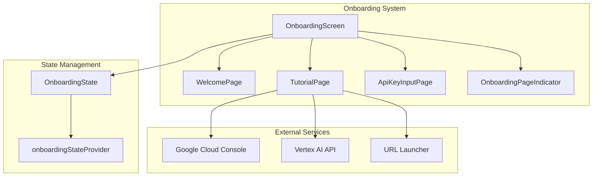
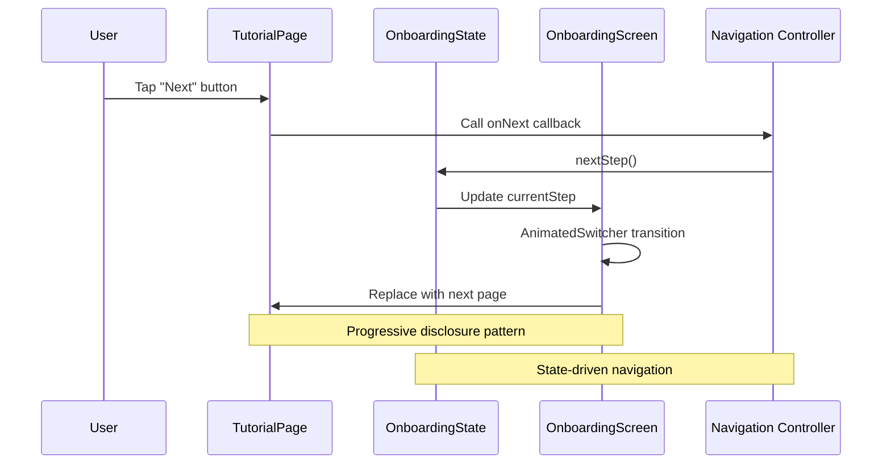
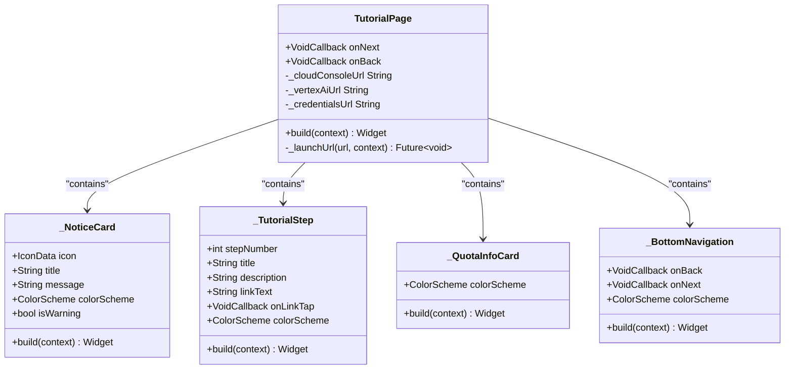

# Tutorial Page

<cite>
**Referenced Files in This Document**
- [tutorial_page.dart](file://lib/features/onboarding/widgets/tutorial_page.dart)
- [onboarding_screen.dart](file://lib/features/onboarding/onboarding_screen.dart)
- [onboarding_page_indicator.dart](file://lib/features/onboarding/widgets/onboarding_page_indicator.dart)
- [welcome_page.dart](file://lib/features/onboarding/widgets/welcome_page.dart)
- [api_key_input_page.dart](file://lib/features/onboarding/widgets/api_key_input_page.dart)
- [onboarding_state.dart](file://lib/core/onboarding/models/onboarding_state.dart)
- [byok_manager.dart](file://lib/core/byok/byok_manager.dart)
- [validation_result.dart](file://lib/core/byok/models/validation_result.dart)
- [tutorial_page_test.dart](file://test/features/onboarding/widgets/tutorial_page_test.dart)
</cite>

## Table of Contents
1. [Introduction](#introduction)
2. [Project Structure](#project-structure)
3. [Core Components](#core-components)
4. [Architecture Overview](#architecture-overview)
5. [Detailed Component Analysis](#detailed-component-analysis)
6. [Dependency Analysis](#dependency-analysis)
7. [Performance Considerations](#performance-considerations)
8. [Troubleshooting Guide](#troubleshooting-guide)
9. [Conclusion](#conclusion)

## Introduction
The TutorialPage component serves as a critical educational interface within the StyleSync onboarding flow. This component delivers step-by-step guidance for obtaining a Gemini API key through Google Cloud Console, explains the differences between free and paid quota tiers, and provides interactive links to external setup resources. The component plays a pivotal role in user education and feature discovery by presenting clear, actionable instructions that bridge the gap between user onboarding and functional AI capabilities.

The tutorial implementation demonstrates sophisticated user experience patterns including progressive disclosure of information, contextual help systems, and seamless integration with external services. It transforms potentially complex technical procedures into digestible, actionable steps while maintaining strong accessibility and visual consistency with the application's Material Design system.

## Project Structure
The TutorialPage component is part of a modular onboarding system that follows Flutter's widget composition patterns. The component integrates with several supporting systems including state management, theme management, and external service integration.



**Diagram sources**
- [onboarding_screen.dart](file://lib/features/onboarding/onboarding_screen.dart#L89-L121)
- [tutorial_page.dart](file://lib/features/onboarding/widgets/tutorial_page.dart#L1-L155)

**Section sources**
- [onboarding_screen.dart](file://lib/features/onboarding/onboarding_screen.dart#L1-L122)
- [tutorial_page.dart](file://lib/features/onboarding/widgets/tutorial_page.dart#L1-L155)

## Core Components
The TutorialPage component consists of several specialized subcomponents that work together to deliver an effective educational experience:

### Primary Components
- **TutorialPage**: Main component handling the educational content delivery
- **_NoticeCard**: Important notices and warnings with contextual styling
- **_TutorialStep**: Individual step elements with numbered indicators
- **_QuotaInfoCard**: Pricing and quota tier information display
- **_BottomNavigation**: Navigation controls for onboarding progression

### Supporting Components
- **_QuotaTier**: Individual quota tier presentations
- **_BottomNavigation**: Consistent navigation pattern across onboarding pages

Each component follows Flutter's StatelessWidget pattern with carefully crafted theming and responsive design principles that adapt to different screen sizes and orientations.

**Section sources**
- [tutorial_page.dart](file://lib/features/onboarding/widgets/tutorial_page.dart#L11-L155)
- [tutorial_page.dart](file://lib/features/onboarding/widgets/tutorial_page.dart#L157-L224)
- [tutorial_page.dart](file://lib/features/onboarding/widgets/tutorial_page.dart#L226-L325)
- [tutorial_page.dart](file://lib/features/onboarding/widgets/tutorial_page.dart#L327-L447)
- [tutorial_page.dart](file://lib/features/onboarding/widgets/tutorial_page.dart#L449-L512)

## Architecture Overview
The TutorialPage participates in a larger onboarding architecture that manages user progression through distinct educational phases. The component receives navigation callbacks and integrates with the broader state management system.



**Diagram sources**
- [onboarding_screen.dart](file://lib/features/onboarding/onboarding_screen.dart#L112-L121)
- [onboarding_state.dart](file://lib/core/onboarding/models/onboarding_state.dart#L4-L17)

The architecture emphasizes separation of concerns with the TutorialPage focusing solely on content presentation while delegating navigation logic to higher-level components. This design enables easy testing, maintenance, and extension of the onboarding flow.

**Section sources**
- [onboarding_screen.dart](file://lib/features/onboarding/onboarding_screen.dart#L89-L121)
- [onboarding_state.dart](file://lib/core/onboarding/models/onboarding_state.dart#L1-L75)

## Detailed Component Analysis

### TutorialPage Component
The TutorialPage serves as the primary educational interface, presenting structured guidance for API key acquisition through Google Cloud Console.

#### Content Structure and Presentation
The component organizes information using a clear hierarchical structure:
- **Header Section**: Title and introductory description
- **Important Notice**: Critical information requiring user attention
- **Step-by-Step Instructions**: Three sequential setup steps
- **Pricing Information**: Quota tier explanations
- **Navigation Controls**: Back/Next button interface



**Diagram sources**
- [tutorial_page.dart](file://lib/features/onboarding/widgets/tutorial_page.dart#L11-L155)
- [tutorial_page.dart](file://lib/features/onboarding/widgets/tutorial_page.dart#L157-L224)
- [tutorial_page.dart](file://lib/features/onboarding/widgets/tutorial_page.dart#L226-L325)
- [tutorial_page.dart](file://lib/features/onboarding/widgets/tutorial_page.dart#L327-L447)
- [tutorial_page.dart](file://lib/features/onboarding/widgets/tutorial_page.dart#L449-L512)

#### Interactive Demonstration Elements
The component implements several interactive elements designed to enhance user engagement:

**External Link Integration**: Direct integration with Google Cloud Console through URL launching functionality that opens external applications safely.

**Progressive Disclosure**: Information is presented in digestible chunks with expandable sections for detailed quota information.

**Visual Feedback**: Consistent use of Material Design patterns including elevation, shadows, and color coding for different content types.

#### User Engagement Patterns
The component employs several proven UX patterns:
- **Clear Actionable Steps**: Each instruction includes a direct link to the relevant console page
- **Contextual Help**: Important notices provide critical information upfront
- **Consistent Navigation**: Standardized back/next button placement and styling
- **Responsive Design**: Adapts to different screen sizes and orientations

**Section sources**
- [tutorial_page.dart](file://lib/features/onboarding/widgets/tutorial_page.dart#L40-L155)

### Content Management Implementation
The TutorialPage implements a clean separation between content definition and presentation through carefully organized constants and helper methods.

#### Static Content Management
Content is managed through static constants that define:
- External URLs for Google Cloud Console integration
- Step-by-step instruction text
- Important notice messages
- Pricing tier descriptions

#### Theming and Localization Support
The component leverages Flutter's theming system extensively:
- **Dynamic Theming**: Automatically adapts to light/dark themes
- **Color Scheme Integration**: Uses Material Design color schemes consistently
- **Typography Scaling**: Responsive text sizing based on platform conventions

#### Adaptive Content Presentation
The component adapts its presentation based on:
- **Device Orientation**: Responsive layout adjustments
- **Screen Size**: Flexible spacing and sizing
- **Platform Differences**: Platform-specific navigation patterns

**Section sources**
- [tutorial_page.dart](file://lib/features/onboarding/widgets/tutorial_page.dart#L28-L38)
- [tutorial_page.dart](file://lib/features/onboarding/widgets/tutorial_page.dart#L42-L44)

### Animation Effects and User Interaction Handling
The TutorialPage integrates with the broader onboarding system to provide smooth transitions and responsive interactions.

#### Animation Integration
The component participates in the onboarding screen's AnimatedSwitcher, which provides:
- **Fade Transitions**: Smooth opacity changes between pages
- **Slide Animations**: Horizontal movement for page replacement
- **Curved Timing**: Ease-out curves for natural motion

#### User Interaction Patterns
Interaction handling focuses on:
- **Button States**: Disabled states during loading operations
- **Visual Feedback**: Hover and pressed states for touch targets
- **Accessibility**: Proper focus management and screen reader support

**Section sources**
- [onboarding_screen.dart](file://lib/features/onboarding/onboarding_screen.dart#L63-L81)
- [tutorial_page.dart](file://lib/features/onboarding/widgets/tutorial_page.dart#L449-L512)

## Dependency Analysis
The TutorialPage component maintains minimal dependencies while integrating effectively with the broader system architecture.

```mermaid
graph LR
subgraph "Internal Dependencies"
TP[TutorialPage)
WP[WelcomePage]
AK[ApiKeyInputPage]
OS[OnboardingScreen]
end
subgraph "External Dependencies"
MD[Material Design]
URL[url_launcher]
Riverpod[Riverpod State]
end
subgraph "Core Services"
OSState[OnboardingState]
BYOK[BYOKManager]
Validator[APIKeyValidator]
end
TP --> MD
TP --> URL
TP --> Riverpod
TP --> OSState
OS --> TP
OS --> WP
OS --> AK
OSState --> BYOK
BYOK --> Validator
```

**Diagram sources**
- [tutorial_page.dart](file://lib/features/onboarding/widgets/tutorial_page.dart#L1-L2)
- [onboarding_screen.dart](file://lib/features/onboarding/onboarding_screen.dart#L1-L10)
- [byok_manager.dart](file://lib/core/byok/byok_manager.dart#L1-L15)

### Component Coupling and Cohesion
The TutorialPage demonstrates excellent design principles:
- **High Cohesion**: All tutorial-related functionality is contained within a single component
- **Low Coupling**: Minimal external dependencies reduce maintenance overhead
- **Single Responsibility**: Focuses exclusively on educational content delivery

### External Dependencies
The component relies on:
- **Material Design**: Standard Flutter widgets and theming
- **URL Launcher**: External service integration for Google Cloud Console
- **Riverpod**: State management for onboarding progression

**Section sources**
- [tutorial_page.dart](file://lib/features/onboarding/widgets/tutorial_page.dart#L1-L2)
- [onboarding_screen.dart](file://lib/features/onboarding/onboarding_screen.dart#L1-L10)

## Performance Considerations
The TutorialPage component is designed with performance optimization in mind:

### Memory Management
- **Stateless Design**: Reduces memory footprint through stateless widget architecture
- **Lazy Loading**: Content loads only when the page becomes visible
- **Efficient Rendering**: Minimal widget tree reduces layout complexity

### Animation Performance
- **Hardware Acceleration**: Uses Flutter's built-in animation capabilities
- **Optimized Transitions**: Efficient fade and slide animations
- **Reduced Repaint Areas**: Targeted repaint regions minimize unnecessary updates

### Network Considerations
- **External URL Loading**: Delegated to system browser to avoid blocking UI
- **Error Handling**: Graceful fallbacks for network failures
- **Loading States**: Appropriate feedback during external service interactions

## Troubleshooting Guide
Common issues and their solutions when working with the TutorialPage component:

### Content Display Issues
**Problem**: Tutorial content not appearing correctly
**Solution**: Verify theme availability and ensure proper context usage

### Navigation Problems
**Problem**: Next/Back buttons not functioning
**Solution**: Confirm callback functions are properly passed and not null

### External Link Failures
**Problem**: Google Cloud Console links not opening
**Solution**: Check URL launcher permissions and handle exceptions gracefully

### Animation Issues
**Problem**: Page transitions not working smoothly
**Solution**: Verify AnimatedSwitcher configuration and ensure proper key management

**Section sources**
- [tutorial_page_test.dart](file://test/features/onboarding/widgets/tutorial_page_test.dart#L313-L350)
- [tutorial_page_test.dart](file://test/features/onboarding/widgets/tutorial_page_test.dart#L384-L407)

## Conclusion
The TutorialPage component exemplifies effective educational interface design within modern Flutter applications. Through its thoughtful combination of structured content presentation, interactive elements, and seamless integration with the broader onboarding system, it successfully bridges the gap between user onboarding and functional AI capabilities.

The component's architecture demonstrates key design principles including separation of concerns, minimal dependencies, and responsive design patterns. Its implementation of progressive disclosure, contextual help systems, and consistent navigation patterns creates a positive user experience that encourages completion of the onboarding process.

The tutorial's effectiveness lies not just in its technical implementation, but in its ability to transform potentially complex technical procedures into accessible, actionable steps. By providing clear guidance, immediate feedback, and seamless integration with external services, the TutorialPage component contributes significantly to user success and overall product adoption.

Future enhancements could include expanded localization support, additional interactive demonstrations, and adaptive content based on user progress and preferences. However, the current implementation provides a solid foundation for effective user education and feature discovery within the StyleSync onboarding experience.