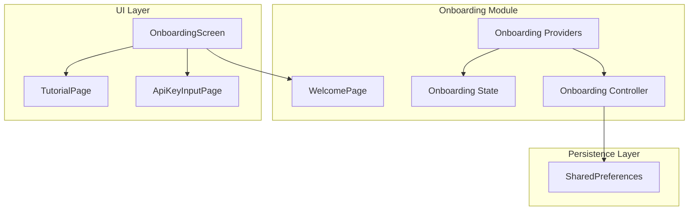
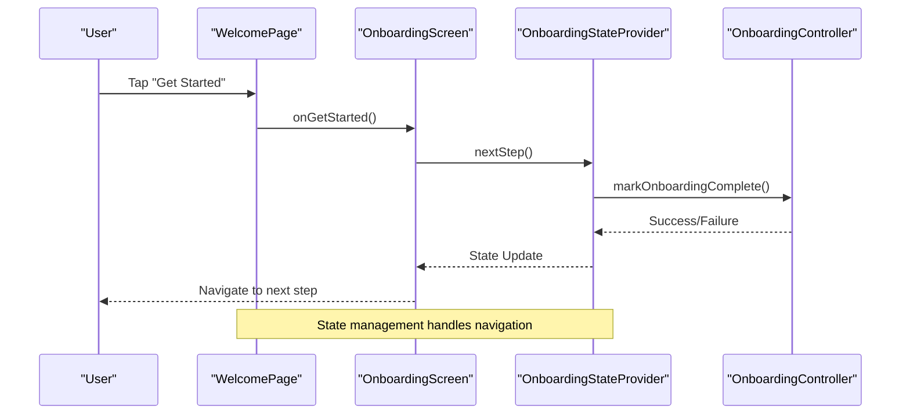
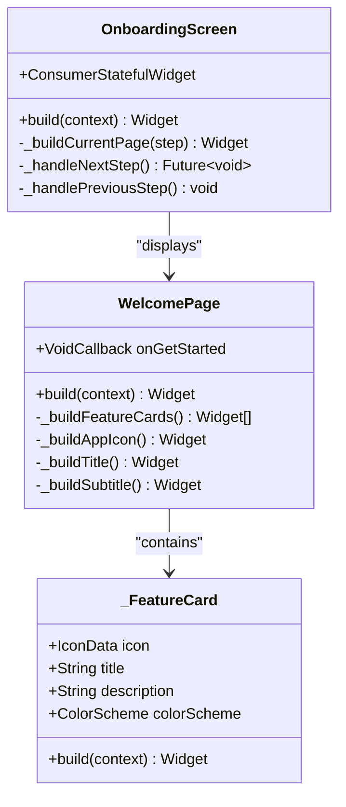

# Welcome Page

<cite>
**Referenced Files in This Document**
- [welcome_page.dart](file://lib/features/onboarding/widgets/welcome_page.dart)
- [onboarding_screen.dart](file://lib/features/onboarding/onboarding_screen.dart)
- [onboarding_state.dart](file://lib/core/onboarding/models/onboarding_state.dart)
- [onboarding_providers.dart](file://lib/core/onboarding/onboarding_providers.dart)
- [onboarding_controller.dart](file://lib/core/onboarding/onboarding_controller.dart)
- [onboarding_controller_impl.dart](file://lib/core/onboarding/onboarding_controller_impl.dart)
- [welcome_page_test.dart](file://test/features/onboarding/widgets/welcome_page_test.dart)
</cite>

## Table of Contents
1. [Introduction](#introduction)
2. [Project Structure](#project-structure)
3. [Core Components](#core-components)
4. [Architecture Overview](#architecture-overview)
5. [Detailed Component Analysis](#detailed-component-analysis)
6. [Dependency Analysis](#dependency-analysis)
7. [Performance Considerations](#performance-considerations)
8. [Troubleshooting Guide](#troubleshooting-guide)
9. [Conclusion](#conclusion)

## Introduction
The WelcomePage component serves as the initial user engagement interface in the StyleSync onboarding flow. It is designed to capture user attention, introduce the application's core value proposition, and guide users toward completing the onboarding process. This component establishes the visual foundation for user trust and sets clear expectations about the application's capabilities.

The WelcomePage implements a clean, modern design that emphasizes the app's AI-powered personal styling capabilities. It presents three key feature demonstrations through dedicated cards, each highlighting a core service: digital wardrobe management, virtual try-on technology, and AI-powered outfit suggestions. The component concludes with a prominent call-to-action button that initiates the next step in the onboarding journey.

## Project Structure
The WelcomePage is part of a modular onboarding system that follows Flutter's widget composition patterns. The component is organized within the features/onboarding module alongside related onboarding infrastructure.



**Diagram sources**
- [welcome_page.dart](file://lib/features/onboarding/widgets/welcome_page.dart#L1-L188)
- [onboarding_screen.dart](file://lib/features/onboarding/onboarding_screen.dart#L1-L122)
- [onboarding_providers.dart](file://lib/core/onboarding/onboarding_providers.dart#L1-L176)

**Section sources**
- [welcome_page.dart](file://lib/features/onboarding/widgets/welcome_page.dart#L1-L188)
- [onboarding_screen.dart](file://lib/features/onboarding/onboarding_screen.dart#L1-L122)

## Core Components
The WelcomePage consists of several interconnected components that work together to deliver a cohesive user experience:

### Primary Component Structure
The main WelcomePage widget implements a StatelessWidget pattern with a focused responsibility for presenting onboarding content. It accepts a callback function for handling user interactions and relies on Flutter's theme system for consistent styling.

### Feature Card System
The component includes a private `_FeatureCard` widget that encapsulates individual feature presentations. Each feature card combines an icon, title, and descriptive text within a container that adapts to the current theme's color scheme.

### Interactive Elements
The component provides a single primary action button that triggers the onboarding progression. The button utilizes Material Design's FilledButton component with custom styling for optimal visual hierarchy and accessibility.

**Section sources**
- [welcome_page.dart](file://lib/features/onboarding/widgets/welcome_page.dart#L7-L114)
- [welcome_page.dart](file://lib/features/onboarding/widgets/welcome_page.dart#L117-L187)

## Architecture Overview
The WelcomePage participates in a larger onboarding architecture that manages user progression through multiple steps. The component integrates with Riverpod state management and follows a clear separation of concerns between UI presentation and state orchestration.



**Diagram sources**
- [welcome_page.dart](file://lib/features/onboarding/widgets/welcome_page.dart#L11-L17)
- [onboarding_screen.dart](file://lib/features/onboarding/onboarding_screen.dart#L113-L120)
- [onboarding_providers.dart](file://lib/core/onboarding/onboarding_providers.dart#L81-L102)

The architecture demonstrates a unidirectional data flow where user interactions trigger state changes that propagate through the component tree, ensuring predictable UI updates and maintainable code structure.

**Section sources**
- [onboarding_screen.dart](file://lib/features/onboarding/onboarding_screen.dart#L89-L121)
- [onboarding_providers.dart](file://lib/core/onboarding/onboarding_providers.dart#L59-L150)

## Detailed Component Analysis

### WelcomePage Implementation
The WelcomePage component implements a comprehensive onboarding introduction through carefully crafted visual elements and interactive components.

#### Visual Design Elements
The component employs a structured layout with consistent spacing and typography hierarchy:
- Centralized content with horizontal padding for optimal readability
- Brand identity through the app icon and color scheme integration
- Feature cards that provide clear value propositions
- Prominent call-to-action button for seamless progression

#### Typography and Theming
The component dynamically adapts to the current theme through:
- Theme.of(context) for accessing color schemes and text themes
- Responsive text sizing using Material Design typography scales
- Consistent color usage that respects light/dark mode variations

#### Interactive Elements
The component provides a single primary action that serves as the main navigation trigger:
- FilledButton with custom styling for visual prominence
- Accessible semantics for assistive technologies
- Immediate feedback through Material Design touch targets



**Diagram sources**
- [welcome_page.dart](file://lib/features/onboarding/widgets/welcome_page.dart#L7-L187)
- [onboarding_screen.dart](file://lib/features/onboarding/onboarding_screen.dart#L15-L121)

**Section sources**
- [welcome_page.dart](file://lib/features/onboarding/widgets/welcome_page.dart#L19-L114)

### Feature Presentation System
The component's feature presentation follows a consistent pattern across all three showcased services:

#### Digital Wardrobe Feature
- Icon: photo_library_rounded
- Title: "Digital Wardrobe"
- Description: Emphasizes automatic categorization and digital organization
- Visual Treatment: Secondary container with appropriate icon coloring

#### Virtual Try-On Feature
- Icon: person_pin_rounded
- Title: "Virtual Try-On"
- Description: Highlights the immersive fitting experience
- Visual Treatment: Secondary container with complementary color scheme

#### Outfit Brainstorming Feature
- Icon: lightbulb_rounded
- Title: "Outfit Brainstorming"
- Description: Focuses on AI-powered styling suggestions
- Visual Treatment: Secondary container with accent color

Each feature card maintains consistent spacing, typography, and interaction patterns to ensure intuitive user comprehension.

**Section sources**
- [welcome_page.dart](file://lib/features/onboarding/widgets/welcome_page.dart#L65-L87)

### Navigation and Interaction Flow
The component's interaction model is intentionally streamlined to minimize cognitive load during the initial user experience:

#### Call-to-Action Button
The "Get Started" button serves as the primary navigation trigger:
- Full-width design for optimal touch target sizing
- Elevated positioning to draw visual attention
- Custom styling that maintains brand consistency
- Immediate callback execution upon activation

#### State Management Integration
The component delegates navigation responsibility to its parent through the onGetStarted callback, ensuring:
- Consistent state management across the onboarding flow
- Proper coordination with other onboarding steps
- Reactive UI updates through Riverpod's state propagation

**Section sources**
- [welcome_page.dart](file://lib/features/onboarding/widgets/welcome_page.dart#L89-L108)
- [onboarding_screen.dart](file://lib/features/onboarding/onboarding_screen.dart#L92-L95)

## Dependency Analysis
The WelcomePage component maintains loose coupling with external dependencies while leveraging Flutter's ecosystem effectively.

```mermaid
graph LR
subgraph "External Dependencies"
Flutter[Flutter SDK]
Material[Material Design]
Riverpod[Riverpod State Management]
end
subgraph "Internal Dependencies"
Theme[Theme.of(context)]
ColorScheme[ColorScheme]
TextTheme[TextTheme]
end
subgraph "Component Dependencies"
WP[WelcomePage]
FC[_FeatureCard]
OS[OnboardingScreen]
NP[OnboardingStateProvider]
OC[OnboardingController]
end
Flutter --> WP
Material --> WP
Riverpod --> OS
Theme --> WP
ColorScheme --> WP
TextTheme --> WP
OS --> WP
NP --> OS
OC --> NP
WP --> FC
```

**Diagram sources**
- [welcome_page.dart](file://lib/features/onboarding/widgets/welcome_page.dart#L1-L22)
- [onboarding_screen.dart](file://lib/features/onboarding/onboarding_screen.dart#L1-L9)
- [onboarding_providers.dart](file://lib/core/onboarding/onboarding_providers.dart#L1-L5)

The dependency structure demonstrates clear separation of concerns:
- UI presentation remains independent of state management
- Theming system provides consistent visual language
- Riverpod enables reactive state updates without tight coupling
- Persistence layer operates independently of UI components

**Section sources**
- [welcome_page.dart](file://lib/features/onboarding/widgets/welcome_page.dart#L1-L22)
- [onboarding_providers.dart](file://lib/core/onboarding/onboarding_providers.dart#L1-L20)

## Performance Considerations
The WelcomePage component is designed with performance optimization in mind through several key strategies:

### Stateless Architecture Benefits
- No internal state management reduces memory overhead
- Predictable rendering lifecycle minimizes unnecessary rebuilds
- Lightweight widget composition improves rendering performance

### Efficient Layout Patterns
- SingleChildScrollView wrapper enables smooth scrolling without complex layout calculations
- Fixed-size containers reduce layout computation during animations
- Consistent padding and spacing minimize layout thrashing

### Theme Integration Advantages
- Dynamic theme adaptation occurs at the framework level
- Color scheme access is optimized through Theme.of(context)
- Typography scaling leverages built-in Material Design optimizations

### Memory Management
- No retained closures or long-lived listeners
- Minimal widget tree depth reduces memory footprint
- Proper disposal of resources through Flutter's lifecycle management

## Troubleshooting Guide

### Common Implementation Issues
**Typography Scaling Problems**
- Verify that theme.textTheme.headlineMedium and titleMedium are properly defined
- Ensure font fallback mechanisms are in place for unsupported locales
- Check text overflow behavior in constrained layouts

**Color Scheme Adaptation**
- Confirm that colorScheme.onPrimaryContainer and related variants are accessible
- Test contrast ratios for text elements against background surfaces
- Validate color appearance across light and dark theme modes

**Button Accessibility Concerns**
- Ensure sufficient touch target size for mobile interaction
- Verify focus indicators for keyboard navigation support
- Test button semantics for screen reader compatibility

### Testing and Validation
The component includes comprehensive widget tests that validate:
- Title and subtitle rendering across different screen sizes
- Feature card display and content verification
- Button visibility and interaction handling
- Layout structure and spacing consistency
- Accessibility semantics compliance

**Section sources**
- [welcome_page_test.dart](file://test/features/onboarding/widgets/welcome_page_test.dart#L40-L365)

### Integration Testing
When integrating the WelcomePage into larger applications:
- Verify theme consistency across all onboarding screens
- Test navigation flow from welcome to subsequent steps
- Validate state persistence across app restarts
- Confirm proper handling of edge cases and error conditions

## Conclusion
The WelcomePage component exemplifies effective onboarding interface design through its focused functionality, thoughtful visual hierarchy, and seamless integration with the broader onboarding system. The component successfully balances information density with user-friendly presentation, establishing clear expectations while guiding users toward meaningful engagement with the application's core features.

Through its implementation of modern Flutter patterns, the component demonstrates best practices in state management integration, accessibility compliance, and responsive design. The modular architecture ensures maintainability while the comprehensive testing suite provides confidence in reliability across diverse usage scenarios.

The component's success lies in its ability to transform a simple welcome screen into a strategic touchpoint for user acquisition and retention, setting the foundation for successful onboarding completion and long-term user engagement.