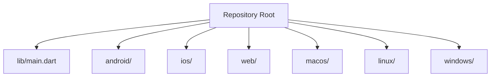
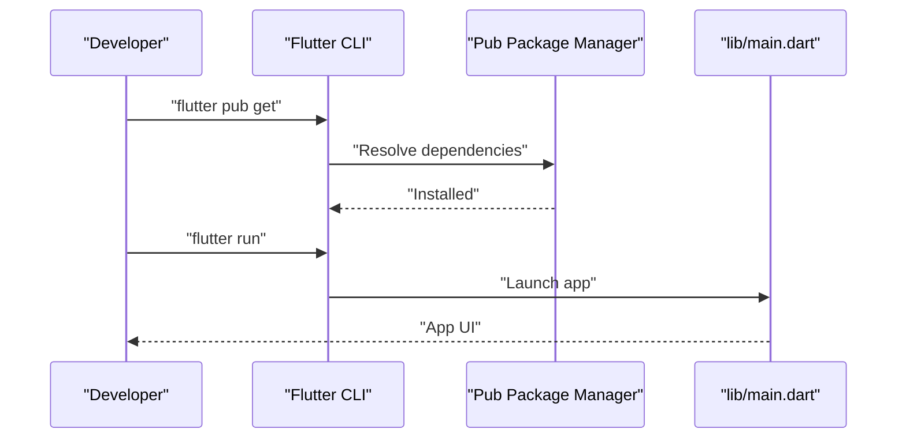
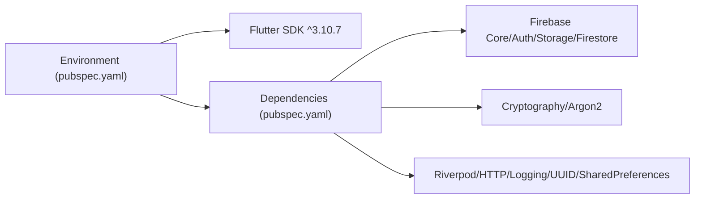

# Getting Started

<cite>
**Referenced Files in This Document**
- [README.md](file://README.md)
- [pubspec.yaml](file://pubspec.yaml)
- [AGENTS.md](file://AGENTS.md)
- [android/gradle.properties](file://android/gradle.properties)
- [android/build.gradle.kts](file://android/build.gradle.kts)
- [android/app/build.gradle.kts](file://android/app/build.gradle.kts)
- [android/local.properties](file://android/local.properties)
- [ios/Runner/Info.plist](file://ios/Runner/Info.plist)
- [macos/Runner/Info.plist](file://macos/Runner/Info.plist)
- [web/index.html](file://web/index.html)
- [analysis_options.yaml](file://analysis_options.yaml)
- [lib/main.dart](file://lib/main.dart)
</cite>

## Table of Contents
1. [Introduction](#introduction)
2. [Project Structure](#project-structure)
3. [Core Components](#core-components)
4. [Architecture Overview](#architecture-overview)
5. [Detailed Component Analysis](#detailed-component-analysis)
6. [Dependency Analysis](#dependency-analysis)
7. [Performance Considerations](#performance-considerations)
8. [Troubleshooting Guide](#troubleshooting-guide)
9. [Conclusion](#conclusion)
10. [Appendices](#appendices)

## Introduction
This guide helps you install and run StyleSync locally. It covers prerequisites, step-by-step installation, development environment setup, platform-specific notes, and troubleshooting.

## Project Structure
StyleSync is a Flutter application with support for Android, iOS, Web, macOS, and Linux. The repository includes platform-specific configuration files and a Flutter app entry point.

**Diagram sources**
- [lib/main.dart](file://lib/main.dart#L1-L123)
- [android/build.gradle.kts](file://android/build.gradle.kts#L1-L25)
- [ios/Runner/Info.plist](file://ios/Runner/Info.plist#L1-L50)
- [web/index.html](file://web/index.html#L1-L40)
- [macos/Runner/Info.plist](file://macos/Runner/Info.plist#L1-L35)

**Section sources**
- [lib/main.dart](file://lib/main.dart#L1-L123)
- [android/build.gradle.kts](file://android/build.gradle.kts#L1-L25)
- [ios/Runner/Info.plist](file://ios/Runner/Info.plist#L1-L50)
- [web/index.html](file://web/index.html#L1-L40)
- [macos/Runner/Info.plist](file://macos/Runner/Info.plist#L1-L35)

## Core Components
- Flutter SDK: Required version is specified in the project’s environment configuration.
- Dart SDK: Must be compatible with the Flutter SDK version.
- Optional Homebrew (macOS): Can simplify installing the Flutter SDK.

What you will do
- Install the Flutter SDK.
- Install dependencies with the Flutter package manager.
- Run the app locally.

**Section sources**
- [README.md](file://README.md#L3-L13)
- [pubspec.yaml](file://pubspec.yaml#L21-L23)

## Architecture Overview
The app entry point initializes a basic Flutter app. Platform-specific configurations define identifiers, deployment targets, and build settings.

**Diagram sources**
- [README.md](file://README.md#L9-L13)
- [AGENTS.md](file://AGENTS.md#L10-L16)
- [lib/main.dart](file://lib/main.dart#L1-L123)

**Section sources**
- [README.md](file://README.md#L9-L13)
- [AGENTS.md](file://AGENTS.md#L10-L16)
- [lib/main.dart](file://lib/main.dart#L1-L123)

## Detailed Component Analysis

### Prerequisites
- Flutter SDK: ^3.10.7
- Dart SDK: Compatible with the Flutter SDK
- Optional: Homebrew (macOS) for simplified SDK installation

**Section sources**
- [README.md](file://README.md#L3-L7)
- [pubspec.yaml](file://pubspec.yaml#L21-L23)

### Step-by-Step Installation
1. Install the Flutter SDK.
2. Install dependencies: run the package manager to fetch dependencies.
3. Launch the app: run the app locally.

Notes
- The Flutter CLI commands are documented in the project’s guidance.

**Section sources**
- [README.md](file://README.md#L9-L13)
- [AGENTS.md](file://AGENTS.md#L10-L16)

### Development Environment Setup

#### Gradle Configuration (Android)
Optimized Gradle settings are enabled for performance:
- JVM memory and code cache sizing
- Parallel builds
- Build caching
- AndroidX enabled

These settings are defined in the Android Gradle properties.

**Section sources**
- [README.md](file://README.md#L15-L22)
- [android/gradle.properties](file://android/gradle.properties#L1-L10)

#### Android Build Settings
- Java/Kotlin compatibility set to version 17
- Minimum SDK level configured
- Signing configuration supports release builds via a keystore file

**Section sources**
- [android/app/build.gradle.kts](file://android/app/build.gradle.kts#L22-L29)
- [android/app/build.gradle.kts](file://android/app/build.gradle.kts#L36-L39)
- [android/app/build.gradle.kts](file://android/app/build.gradle.kts#L42-L49)

#### iOS Deployment Target and Metadata
- iOS deployment target and bundle identifiers are defined in the iOS Info.plist.
- Bundle name, identifier, and version strings are configured for iOS builds.

**Section sources**
- [ios/Runner/Info.plist](file://ios/Runner/Info.plist#L1-L50)

#### macOS Deployment Target and Metadata
- macOS deployment target and bundle identifiers are defined in the macOS Info.plist.
- Bundle name, identifier, and version strings are configured for macOS builds.

**Section sources**
- [macos/Runner/Info.plist](file://macos/Runner/Info.plist#L1-L35)

#### Web Deployment Notes
- The web index template includes meta tags for iOS and a manifest link.
- The base href placeholder is intended to be replaced by the Flutter build tool.

**Section sources**
- [web/index.html](file://web/index.html#L1-L40)

#### Analyzer and Linting
- The project uses Flutter’s recommended lint set.
- You can run analysis and formatting commands as needed.

**Section sources**
- [analysis_options.yaml](file://analysis_options.yaml#L8-L10)
- [AGENTS.md](file://AGENTS.md#L18-L19)

### Platform-Specific Setup Requirements

#### Android
- Ensure Java/Kotlin 17 compatibility is available.
- Configure a keystore for release builds if you plan to distribute signed APKs/APKs.

**Section sources**
- [android/app/build.gradle.kts](file://android/app/build.gradle.kts#L22-L29)
- [android/app/build.gradle.kts](file://android/app/build.gradle.kts#L42-L49)

#### iOS
- Verify the iOS deployment target meets your supported devices.
- Confirm bundle identifiers and version strings align with your distribution strategy.

**Section sources**
- [ios/Runner/Info.plist](file://ios/Runner/Info.plist#L1-L50)

#### macOS
- Confirm the macOS deployment target matches your minimum supported OS.
- Validate bundle identifiers and version strings.

**Section sources**
- [macos/Runner/Info.plist](file://macos/Runner/Info.plist#L1-L35)

#### Web
- Ensure the base href is correctly set when hosting under a subpath.
- Validate manifest and meta tags for PWA capabilities.

**Section sources**
- [web/index.html](file://web/index.html#L1-L40)

### Running the App Locally
- Use the Flutter CLI to run the app on your selected device or simulator.

**Section sources**
- [AGENTS.md](file://AGENTS.md#L15-L16)

## Dependency Analysis
The project’s environment and dependency configuration define the Flutter/Dart toolchain and third-party libraries.

**Diagram sources**
- [pubspec.yaml](file://pubspec.yaml#L21-L23)
- [pubspec.yaml](file://pubspec.yaml#L30-L48)

**Section sources**
- [pubspec.yaml](file://pubspec.yaml#L21-L23)
- [pubspec.yaml](file://pubspec.yaml#L30-L48)

## Performance Considerations
- Android Gradle settings are tuned for performance:
  - JVM memory and metaspace/code cache sizing
  - Parallel builds and build caching enabled

These settings help reduce build times and improve reliability.

**Section sources**
- [android/gradle.properties](file://android/gradle.properties#L1-L10)

## Troubleshooting Guide

Common issues and resolutions
- Flutter SDK not installed or not on PATH
  - Install the Flutter SDK and ensure it is on your PATH.
  - Verify by running the Flutter doctor command.
- Dart SDK version mismatch
  - Ensure your Dart SDK is compatible with the Flutter SDK version.
- Android build failures
  - Confirm Java/Kotlin 17 compatibility.
  - Ensure Gradle properties and AndroidX settings are present.
- iOS build failures
  - Verify iOS deployment target and bundle identifiers.
  - Confirm Xcode project settings and signing configuration.
- Web deployment issues
  - Ensure the base href is set appropriately for your hosting path.
  - Validate manifest and meta tags.
- Dependency resolution errors
  - Run the package manager to fetch dependencies.
  - Clean caches if necessary and retry.

Helpful commands
- Install dependencies
- Upgrade dependencies
- Run the app
- Format code
- Analyze code

**Section sources**
- [README.md](file://README.md#L9-L13)
- [AGENTS.md](file://AGENTS.md#L10-L25)
- [android/gradle.properties](file://android/gradle.properties#L1-L10)
- [android/app/build.gradle.kts](file://android/app/build.gradle.kts#L22-L29)
- [ios/Runner/Info.plist](file://ios/Runner/Info.plist#L1-L50)
- [web/index.html](file://web/index.html#L1-L40)

## Conclusion
You now have the prerequisites, installation steps, and environment setup guidance to run StyleSync locally. Use the platform-specific notes and troubleshooting tips to resolve common issues quickly.

## Appendices

### Quick Reference
- Prerequisites: Flutter SDK ^3.10.7, compatible Dart SDK, optional Homebrew (macOS)
- Install dependencies: flutter pub get
- Run app: flutter run
- Android Gradle optimizations: JVM args, parallel builds, build caching
- iOS/macOS metadata: Info.plist entries for identifiers and deployment targets
- Web: base href, manifest, and iOS meta tags

**Section sources**
- [README.md](file://README.md#L3-L13)
- [AGENTS.md](file://AGENTS.md#L10-L25)
- [android/gradle.properties](file://android/gradle.properties#L1-L10)
- [ios/Runner/Info.plist](file://ios/Runner/Info.plist#L1-L50)
- [macos/Runner/Info.plist](file://macos/Runner/Info.plist#L1-L35)
- [web/index.html](file://web/index.html#L1-L40)