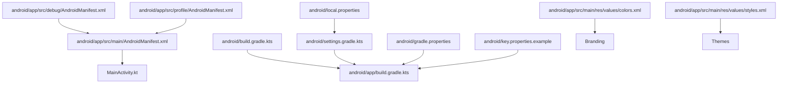
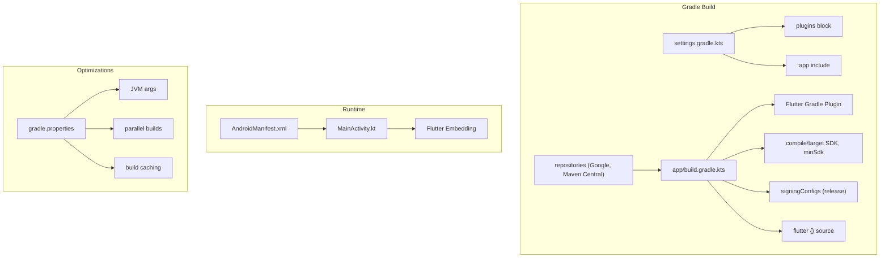
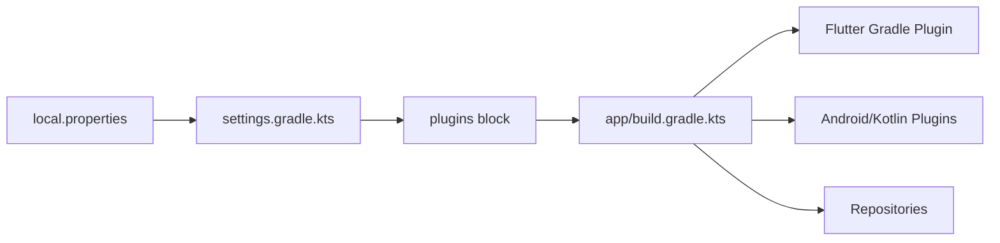

# Android Implementation

<cite>
**Referenced Files in This Document**
- [android/build.gradle.kts](file://android/build.gradle.kts)
- [android/app/build.gradle.kts](file://android/app/build.gradle.kts)
- [android/gradle.properties](file://android/gradle.properties)
- [android/settings.gradle.kts](file://android/settings.gradle.kts)
- [android/app/src/main/AndroidManifest.xml](file://android/app/src/main/AndroidManifest.xml)
- [android/app/src/debug/AndroidManifest.xml](file://android/app/src/debug/AndroidManifest.xml)
- [android/app/src/profile/AndroidManifest.xml](file://android/app/src/profile/AndroidManifest.xml)
- [android/key.properties.example](file://android/key.properties.example)
- [android/local.properties](file://android/local.properties)
- [android/app/src/main/kotlin/com/stylesync/stylesync/MainActivity.kt](file://android/app/src/main/kotlin/com/stylesync/stylesync/MainActivity.kt)
- [android/app/src/main/res/values/colors.xml](file://android/app/src/main/res/values/colors.xml)
- [android/app/src/main/res/values/styles.xml](file://android/app/src/main/res/values/styles.xml)
</cite>

## Table of Contents
1. [Introduction](#introduction)
2. [Project Structure](#project-structure)
3. [Core Components](#core-components)
4. [Architecture Overview](#architecture-overview)
5. [Detailed Component Analysis](#detailed-component-analysis)
6. [Dependency Analysis](#dependency-analysis)
7. [Performance Considerations](#performance-considerations)
8. [Troubleshooting Guide](#troubleshooting-guide)
9. [Conclusion](#conclusion)
10. [Appendices](#appendices)

## Introduction
This document provides comprehensive Android implementation guidance for StyleSync. It covers Gradle build configuration, Android Manifest settings across debug, profile, and release variants, Keystore integration, build optimizations, platform security considerations, Android NDK requirements, UI and accessibility considerations, and deployment strategies aligned with the repository’s current configuration.

## Project Structure
The Android module is organized under the android/ directory with a standard Flutter Android application layout. Key areas include:
- Root Gradle configuration for shared repositories and centralized build directory
- App-level Gradle configuration for compile/target SDK, signing, and Flutter integration
- Gradle properties enabling JVM memory tuning, parallel builds, and build caching
- Settings Gradle for plugin management and inclusion of the app module
- Android Manifests for main, debug, and profile variants
- Kotlin entry point for the main activity
- Resource files for branding colors and themes

**Diagram sources**
- [android/build.gradle.kts](file://android/build.gradle.kts#L1-L25)
- [android/app/build.gradle.kts](file://android/app/build.gradle.kts#L1-L67)
- [android/settings.gradle.kts](file://android/settings.gradle.kts#L1-L31)
- [android/gradle.properties](file://android/gradle.properties#L1-L10)
- [android/app/src/main/AndroidManifest.xml](file://android/app/src/main/AndroidManifest.xml#L1-L46)
- [android/app/src/debug/AndroidManifest.xml](file://android/app/src/debug/AndroidManifest.xml#L1-L8)
- [android/app/src/profile/AndroidManifest.xml](file://android/app/src/profile/AndroidManifest.xml#L1-L8)
- [android/key.properties.example](file://android/key.properties.example#L1-L5)
- [android/local.properties](file://android/local.properties#L1-L1)
- [android/app/src/main/kotlin/com/stylesync/stylesync/MainActivity.kt](file://android/app/src/main/kotlin/com/stylesync/stylesync/MainActivity.kt#L1-L6)
- [android/app/src/main/res/values/colors.xml](file://android/app/src/main/res/values/colors.xml#L1-L7)
- [android/app/src/main/res/values/styles.xml](file://android/app/src/main/res/values/styles.xml#L1-L19)

**Section sources**
- [android/build.gradle.kts](file://android/build.gradle.kts#L1-L25)
- [android/app/build.gradle.kts](file://android/app/build.gradle.kts#L1-L67)
- [android/gradle.properties](file://android/gradle.properties#L1-L10)
- [android/settings.gradle.kts](file://android/settings.gradle.kts#L1-L31)
- [android/app/src/main/AndroidManifest.xml](file://android/app/src/main/AndroidManifest.xml#L1-L46)
- [android/app/src/debug/AndroidManifest.xml](file://android/app/src/debug/AndroidManifest.xml#L1-L8)
- [android/app/src/profile/AndroidManifest.xml](file://android/app/src/profile/AndroidManifest.xml#L1-L8)
- [android/key.properties.example](file://android/key.properties.example#L1-L5)
- [android/local.properties](file://android/local.properties#L1-L1)
- [android/app/src/main/kotlin/com/stylesync/stylesync/MainActivity.kt](file://android/app/src/main/kotlin/com/stylesync/stylesync/MainActivity.kt#L1-L6)
- [android/app/src/main/res/values/colors.xml](file://android/app/src/main/res/values/colors.xml#L1-L7)
- [android/app/src/main/res/values/styles.xml](file://android/app/src/main/res/values/styles.xml#L1-L19)

## Core Components
- Centralized build directory and subproject layout for consolidated build artifacts
- Shared repositories for Google and Maven Central
- App-level configuration for compile/target SDK, minSdk, versioning, and Flutter integration
- Signing configuration supporting release signing via keystore properties
- Gradle JVM tuning, parallel builds, and build caching enabled
- AndroidX enabled for compatibility
- Main activity entry point and embedded Flutter activity
- Android Manifests for main, debug, and profile variants with minimal permissions
- Resource definitions for branding colors and themes

**Section sources**
- [android/build.gradle.kts](file://android/build.gradle.kts#L8-L20)
- [android/app/build.gradle.kts](file://android/app/build.gradle.kts#L11-L66)
- [android/gradle.properties](file://android/gradle.properties#L1-L10)
- [android/settings.gradle.kts](file://android/settings.gradle.kts#L17-L28)
- [android/app/src/main/kotlin/com/stylesync/stylesync/MainActivity.kt](file://android/app/src/main/kotlin/com/stylesync/stylesync/MainActivity.kt#L1-L6)
- [android/app/src/main/AndroidManifest.xml](file://android/app/src/main/AndroidManifest.xml#L1-L46)
- [android/app/src/debug/AndroidManifest.xml](file://android/app/src/debug/AndroidManifest.xml#L1-L8)
- [android/app/src/profile/AndroidManifest.xml](file://android/app/src/profile/AndroidManifest.xml#L1-L8)
- [android/app/src/main/res/values/colors.xml](file://android/app/src/main/res/values/colors.xml#L1-L7)
- [android/app/src/main/res/values/styles.xml](file://android/app/src/main/res/values/styles.xml#L1-L19)

## Architecture Overview
The Android build architecture integrates Gradle, Flutter Gradle Plugin, and Android application configuration. The flow includes:
- Plugin management and inclusion of the app module
- Flutter SDK path resolution via local properties
- Centralized repositories and build directory configuration
- App-level Android DSL for compile/target SDK, signing, and Flutter source
- Gradle properties enabling JVM tuning and build caching

**Diagram sources**
- [android/settings.gradle.kts](file://android/settings.gradle.kts#L1-L31)
- [android/app/build.gradle.kts](file://android/app/build.gradle.kts#L4-L66)
- [android/gradle.properties](file://android/gradle.properties#L1-L10)
- [android/app/src/main/AndroidManifest.xml](file://android/app/src/main/AndroidManifest.xml#L1-L46)
- [android/app/src/main/kotlin/com/stylesync/stylesync/MainActivity.kt](file://android/app/src/main/kotlin/com/stylesync/stylesync/MainActivity.kt#L1-L6)

## Detailed Component Analysis

### Gradle Build Configuration
- Repositories: Google and Maven Central configured globally
- Centralized build directory: Build outputs redirected to a shared location with subproject-specific folders
- Clean task: Deletes the centralized build directory
- Subproject evaluation dependency: Ensures app module evaluation depends on app for non-app subprojects

**Section sources**
- [android/build.gradle.kts](file://android/build.gradle.kts#L1-L25)

### App-Level Gradle Configuration
- Plugins: Android Application, Kotlin Android, and Flutter Gradle Plugin applied in order
- Android DSL:
  - Namespace and compile SDK derived from Flutter
  - NDK version from Flutter
  - Java/Kotlin compatibility set to Java 17
  - Default config: applicationId, minSdk, targetSdk, versionCode, versionName
  - Signing configs: release config populated from key.properties if present
  - Build types: release uses release signing if keystore exists, otherwise falls back to debug
- Flutter integration: Source path set to project root

**Section sources**
- [android/app/build.gradle.kts](file://android/app/build.gradle.kts#L4-L66)

### Gradle Properties
- JVM arguments: Elevated heap and metaspace sizes, reserved code cache, and heap dump on OOM
- Parallel builds: Enabled
- Build caching: Enabled
- AndroidX: Enabled for compatibility

**Section sources**
- [android/gradle.properties](file://android/gradle.properties#L1-L10)

### Settings Gradle
- Plugin management:
  - Resolves Flutter SDK path from local.properties
  - Includes Flutter tools build
  - Declares repositories and Gradle portal
- Plugins: Declares Android Application and Kotlin Android plugins with version pins
- Module inclusion: Includes the app module

**Section sources**
- [android/settings.gradle.kts](file://android/settings.gradle.kts#L1-L31)

### Android Manifests
- Main Manifest:
  - Application label and icon
  - MainActivity exported with singleTop launch mode and hardware acceleration
  - Comprehensive configChanges and window soft input mode
  - NormalTheme meta-data and Flutter embedding meta-data
  - Queries for ACTION_PROCESS_TEXT with text/plain MIME type
- Debug Manifest:
  - INTERNET permission enabled for development and hot reload
- Profile Manifest:
  - INTERNET permission enabled for development and profiling

**Section sources**
- [android/app/src/main/AndroidManifest.xml](file://android/app/src/main/AndroidManifest.xml#L1-L46)
- [android/app/src/debug/AndroidManifest.xml](file://android/app/src/debug/AndroidManifest.xml#L1-L8)
- [android/app/src/profile/AndroidManifest.xml](file://android/app/src/profile/AndroidManifest.xml#L1-L8)

### Keystore Integration and Signing
- Keystore properties file: key.properties loaded at configuration time
- Release signing config: Reads alias, passwords, store file, and store password from key.properties
- Fallback behavior: If key.properties does not exist, release build falls back to debug signing
- Example template: key.properties.example documents expected entries

**Section sources**
- [android/app/build.gradle.kts](file://android/app/build.gradle.kts#L16-L49)
- [android/key.properties.example](file://android/key.properties.example#L1-L5)

### Main Activity and Flutter Embedding
- MainActivity extends FlutterActivity
- No method channel or custom engine configuration in the provided file

**Section sources**
- [android/app/src/main/kotlin/com/stylesync/stylesync/MainActivity.kt](file://android/app/src/main/kotlin/com/stylesync/stylesync/MainActivity.kt#L1-L6)

### Resources: Colors and Styles
- Branding colors: Dark background and primary brand color defined
- Themes:
  - LaunchTheme applies a launch background drawable
  - NormalTheme sets window background to the system background

**Section sources**
- [android/app/src/main/res/values/colors.xml](file://android/app/src/main/res/values/colors.xml#L1-L7)
- [android/app/src/main/res/values/styles.xml](file://android/app/src/main/res/values/styles.xml#L1-L19)

### Build Variants and Permissions
- Variants: debug and profile manifests enable INTERNET permission; release variant inherits signing configuration from keystore properties
- Permissions: INTERNET declared in debug and profile manifests; no additional runtime permissions in main manifest

**Section sources**
- [android/app/src/debug/AndroidManifest.xml](file://android/app/src/debug/AndroidManifest.xml#L1-L8)
- [android/app/src/profile/AndroidManifest.xml](file://android/app/src/profile/AndroidManifest.xml#L1-L8)
- [android/app/src/main/AndroidManifest.xml](file://android/app/src/main/AndroidManifest.xml#L1-L46)

### Android NDK Requirements
- NDK version is sourced from Flutter configuration and applied at the app level

**Section sources**
- [android/app/build.gradle.kts](file://android/app/build.gradle.kts#L14-L14)

### Platform-Specific Security Considerations
- Keystore management: Release signing relies on external key.properties; ensure secrets are protected and not committed
- Fallback to debug signing: Release builds without keystore properties will use debug signing, which is insecure for distribution
- Manifest queries: PROCESS_TEXT intent query included for Flutter text processing

**Section sources**
- [android/app/build.gradle.kts](file://android/app/build.gradle.kts#L16-L49)
- [android/app/src/main/AndroidManifest.xml](file://android/app/src/main/AndroidManifest.xml#L34-L44)

### UI and Theming
- Launch and normal themes defined for smooth startup and runtime appearance
- Branding colors applied for dark/light modes

**Section sources**
- [android/app/src/main/res/values/styles.xml](file://android/app/src/main/res/values/styles.xml#L1-L19)
- [android/app/src/main/res/values/colors.xml](file://android/app/src/main/res/values/colors.xml#L1-L7)

## Dependency Analysis
The Android build depends on:
- Flutter Gradle Plugin for Flutter integration
- Android Application and Kotlin Android plugins for compilation
- Local Flutter SDK resolved via local.properties
- Repositories for plugin and library resolution

**Diagram sources**
- [android/local.properties](file://android/local.properties#L1-L1)
- [android/settings.gradle.kts](file://android/settings.gradle.kts#L1-L31)
- [android/app/build.gradle.kts](file://android/app/build.gradle.kts#L4-L9)

**Section sources**
- [android/local.properties](file://android/local.properties#L1-L1)
- [android/settings.gradle.kts](file://android/settings.gradle.kts#L1-L31)
- [android/app/build.gradle.kts](file://android/app/build.gradle.kts#L4-L9)

## Performance Considerations
- JVM memory tuning: Elevated heap and metaspace sizes improve build stability on larger projects
- Parallel builds: Enabled to utilize multiple cores for faster incremental builds
- Build caching: Enabled to reuse task outputs across builds and machines
- Hardware acceleration: Enabled in the main activity for smoother rendering
- Target SDK alignment: Target SDK set via Flutter configuration for latest platform features and optimizations

**Section sources**
- [android/gradle.properties](file://android/gradle.properties#L1-L10)
- [android/app/build.gradle.kts](file://android/app/build.gradle.kts#L11-L39)
- [android/app/src/main/AndroidManifest.xml](file://android/app/src/main/AndroidManifest.xml#L13-L13)

## Troubleshooting Guide
- Missing local.properties: Plugin management requires flutter.sdk to be defined; otherwise, errors indicate missing file or property
- Missing key.properties: Release signing falls back to debug; ensure keystore properties are present for production builds
- INTERNET permission: Required for debug and profile variants; remove if not needed for local builds
- Build directory conflicts: Centralized build directory configured; ensure no conflicting tasks overwrite outputs

**Section sources**
- [android/settings.gradle.kts](file://android/settings.gradle.kts#L6-L12)
- [android/app/build.gradle.kts](file://android/app/build.gradle.kts#L16-L49)
- [android/app/src/debug/AndroidManifest.xml](file://android/app/src/debug/AndroidManifest.xml#L2-L6)
- [android/app/src/profile/AndroidManifest.xml](file://android/app/src/profile/AndroidManifest.xml#L2-L6)
- [android/build.gradle.kts](file://android/build.gradle.kts#L8-L20)

## Conclusion
StyleSync’s Android implementation leverages Flutter’s Gradle integration with centralized build configuration, optimized Gradle properties for performance, and a clean separation of concerns across debug, profile, and release variants. Security is addressed through keystore-driven signing with a fallback safety net, while UI and theming align with modern Android design guidelines. For production readiness, ensure keystore properties are properly managed and consider adding ProGuard/R8 rules and app bundle optimizations as the project evolves.

## Appendices

### Appendix A: Build Optimization Checklist
- Confirm JVM arguments meet machine capacity
- Keep parallel builds and build caching enabled
- Align minSdk/targetSdk with supported devices and platform features
- Use release signing with keystore properties for distribution builds

**Section sources**
- [android/gradle.properties](file://android/gradle.properties#L1-L10)
- [android/app/build.gradle.kts](file://android/app/build.gradle.kts#L36-L39)
- [android/app/build.gradle.kts](file://android/app/build.gradle.kts#L16-L49)

### Appendix B: Android Manifest Reference
- Main activity configuration, exported flag, launch mode, configChanges, hardware acceleration, and meta-data for themes and Flutter embedding
- Queries for text processing actions

**Section sources**
- [android/app/src/main/AndroidManifest.xml](file://android/app/src/main/AndroidManifest.xml#L6-L32)