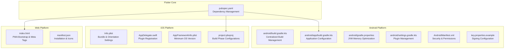
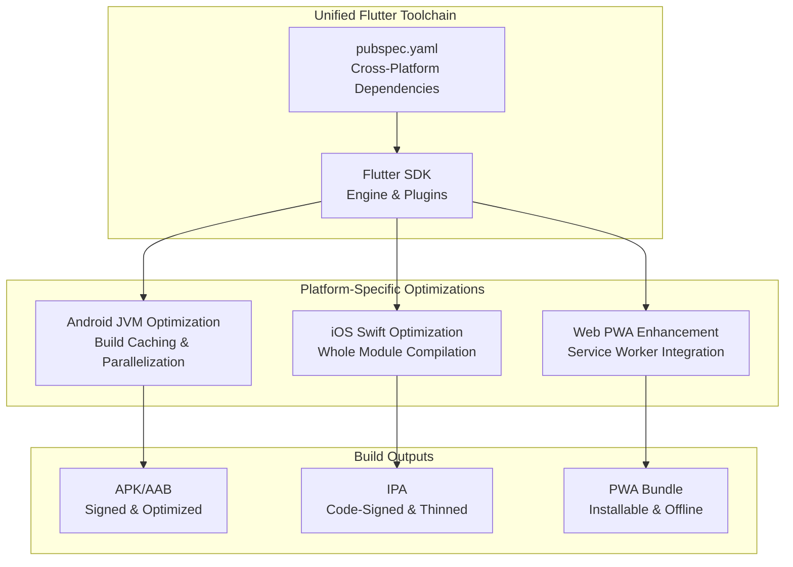
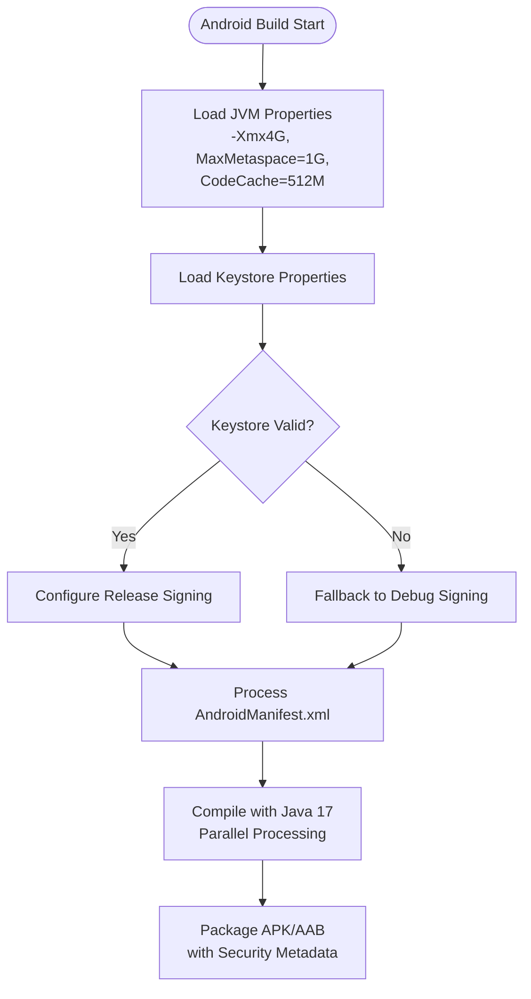
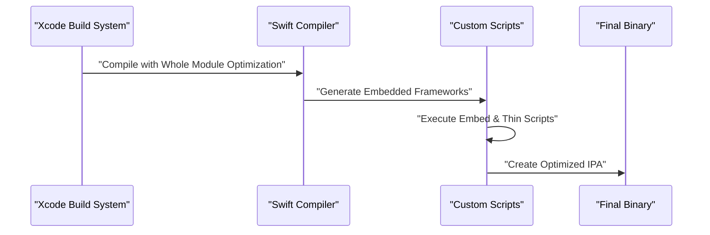
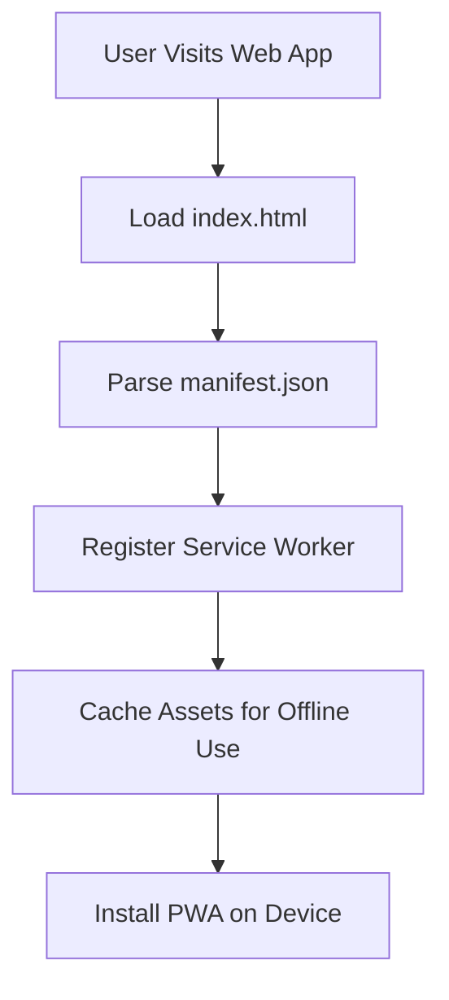

# Platform Integration

<cite>
**Referenced Files in This Document**
- [android/build.gradle.kts](file://android/build.gradle.kts)
- [android/app/build.gradle.kts](file://android/app/build.gradle.kts)
- [android/gradle.properties](file://android/gradle.properties)
- [android/settings.gradle.kts](file://android/settings.gradle.kts)
- [android/key.properties.example](file://android/key.properties.example)
- [android/app/src/main/AndroidManifest.xml](file://android/app/src/main/AndroidManifest.xml)
- [android/app/src/debug/AndroidManifest.xml](file://android/app/src/debug/AndroidManifest.xml)
- [android/app/src/profile/AndroidManifest.xml](file://android/app/src/profile/AndroidManifest.xml)
- [android/app/src/main/kotlin/com/stylesync/stylesync/MainActivity.kt](file://android/app/src/main/kotlin/com/stylesync/stylesync/MainActivity.kt)
- [ios/Runner/Info.plist](file://ios/Runner/Info.plist)
- [ios/Runner/AppDelegate.swift](file://ios/Runner/AppDelegate.swift)
- [ios/Flutter/AppFrameworkInfo.plist](file://ios/Flutter/AppFrameworkInfo.plist)
- [ios/Runner.xcodeproj/project.pbxproj](file://ios/Runner.xcodeproj/project.pbxproj)
- [web/index.html](file://web/index.html)
- [web/manifest.json](file://web/manifest.json)
- [pubspec.yaml](file://pubspec.yaml)
</cite>

## Update Summary
**Changes Made**
- Enhanced Android build configuration with centralized build directory management and improved monorepo support
- Updated Android Gradle JVM memory settings with optimized heap dump and code cache configurations
- Strengthened Android signing configuration with conditional keystore validation and fallback mechanisms
- Expanded iOS Info.plist configuration with comprehensive orientation support and minimum OS version alignment
- Refined iOS Xcode project structure with detailed build phase configurations and Swift optimization settings
- Enhanced web implementation with improved PWA manifest structure and iOS meta tag integration
- Updated Flutter pubspec with comprehensive dependency management and platform-specific configurations

## Table of Contents
1. [Introduction](#introduction)
2. [Project Structure](#project-structure)
3. [Core Components](#core-components)
4. [Architecture Overview](#architecture-overview)
5. [Detailed Component Analysis](#detailed-component-analysis)
6. [Enhanced Build Configurations](#enhanced-build-configurations)
7. [Platform-Specific Security Features](#platform-specific-security-features)
8. [Cross-Platform Compatibility](#cross-platform-compatibility)
9. [Performance Optimizations](#performance-optimizations)
10. [Troubleshooting Guide](#troubleshooting-guide)
11. [Conclusion](#conclusion)
12. [Appendices](#appendices)

## Introduction
This document explains StyleSync's platform-specific integration across Android, iOS, and web platforms with enhanced build configurations and security implementations. The platform integration leverages Flutter's unified toolchain while providing platform-specific optimizations for performance, security, and deployment characteristics.

## Project Structure
StyleSync utilizes Flutter's multi-platform architecture with specialized configurations for each target platform. The repository structure supports:
- Android Gradle Kotlin DSL with centralized build directory management
- iOS Xcode project with comprehensive build configurations and Swift optimization
- Web PWA implementation with enhanced manifest and service worker support
- Flutter pubspec managing cross-platform dependencies and platform-specific settings

**Diagram sources**
- [android/build.gradle.kts](file://android/build.gradle.kts#L8-L20)
- [android/app/build.gradle.kts](file://android/app/build.gradle.kts#L1-L67)
- [android/gradle.properties](file://android/gradle.properties#L1-L10)
- [android/settings.gradle.kts](file://android/settings.gradle.kts#L1-L31)
- [android/app/src/main/AndroidManifest.xml](file://android/app/src/main/AndroidManifest.xml#L1-L46)
- [ios/Runner/Info.plist](file://ios/Runner/Info.plist#L1-L50)
- [ios/Runner/AppDelegate.swift](file://ios/Runner/AppDelegate.swift#L1-L14)
- [ios/Flutter/AppFrameworkInfo.plist](file://ios/Flutter/AppFrameworkInfo.plist#L1-L27)
- [ios/Runner.xcodeproj/project.pbxproj](file://ios/Runner.xcodeproj/project.pbxproj#L1-L617)
- [web/index.html](file://web/index.html#L1-L40)
- [web/manifest.json](file://web/manifest.json#L1-L38)
- [pubspec.yaml](file://pubspec.yaml#L1-L109)

**Section sources**
- [android/build.gradle.kts](file://android/build.gradle.kts#L1-L25)
- [android/app/build.gradle.kts](file://android/app/build.gradle.kts#L1-L67)
- [android/gradle.properties](file://android/gradle.properties#L1-L10)
- [android/settings.gradle.kts](file://android/settings.gradle.kts#L1-L31)
- [android/key.properties.example](file://android/key.properties.example#L1-L5)
- [android/app/src/main/AndroidManifest.xml](file://android/app/src/main/AndroidManifest.xml#L1-L46)
- [android/app/src/debug/AndroidManifest.xml](file://android/app/src/debug/AndroidManifest.xml#L1-L8)
- [android/app/src/profile/AndroidManifest.xml](file://android/app/src/profile/AndroidManifest.xml#L1-L8)
- [android/app/src/main/kotlin/com/stylesync/stylesync/MainActivity.kt](file://android/app/src/main/kotlin/com/stylesync/stylesync/MainActivity.kt#L1-L6)
- [ios/Runner/Info.plist](file://ios/Runner/Info.plist#L1-L50)
- [ios/Runner/AppDelegate.swift](file://ios/Runner/AppDelegate.swift#L1-L14)
- [ios/Flutter/AppFrameworkInfo.plist](file://ios/Flutter/AppFrameworkInfo.plist#L1-L27)
- [ios/Runner.xcodeproj/project.pbxproj](file://ios/Runner.xcodeproj/project.pbxproj#L1-L617)
- [web/index.html](file://web/index.html#L1-L40)
- [web/manifest.json](file://web/manifest.json#L1-L38)
- [pubspec.yaml](file://pubspec.yaml#L1-L109)

## Core Components
The platform integration encompasses several critical components:

### Android Implementation
- **Enhanced Build System**: Centralized build directory management with monorepo support
- **Optimized JVM Configuration**: Tuned memory settings with heap dump and code cache optimization
- **Conditional Signing**: Dynamic keystore validation with fallback mechanisms
- **Manifest Hardening**: Comprehensive activity configuration with hardware acceleration and intent queries

### iOS Implementation
- **Comprehensive Info.plist**: Full bundle configuration with orientation support and minimum OS alignment
- **Swift Optimization**: Advanced build configurations with whole module optimization
- **Plugin Management**: Structured AppDelegate registration and Xcode project organization
- **Build Phase Automation**: Custom shell script configurations for embedding and thinning

### Web Implementation
- **PWA Enhancement**: Improved manifest structure with maskable icons and orientation support
- **Service Worker Integration**: Bootstrap script for enhanced offline capabilities
- **iOS Meta Tag Support**: Comprehensive mobile web app configuration

**Section sources**
- [android/build.gradle.kts](file://android/build.gradle.kts#L8-L20)
- [android/gradle.properties](file://android/gradle.properties#L1-L10)
- [android/app/build.gradle.kts](file://android/app/build.gradle.kts#L42-L61)
- [android/app/src/main/AndroidManifest.xml](file://android/app/src/main/AndroidManifest.xml#L6-L33)
- [ios/Runner/Info.plist](file://ios/Runner/Info.plist#L31-L47)
- [ios/Flutter/AppFrameworkInfo.plist](file://ios/Flutter/AppFrameworkInfo.plist#L23-L24)
- [ios/Runner/AppDelegate.swift](file://ios/Runner/AppDelegate.swift#L6-L12)
- [web/manifest.json](file://web/manifest.json#L11-L36)
- [web/index.html](file://web/index.html#L23-L34)

## Architecture Overview
The enhanced platform integration architecture provides unified build pipelines with platform-specific optimizations:

**Diagram sources**
- [pubspec.yaml](file://pubspec.yaml#L30-L52)
- [android/gradle.properties](file://android/gradle.properties#L1-L10)
- [ios/Runner.xcodeproj/project.pbxproj](file://ios/Runner.xcodeproj/project.pbxproj#L525-L535)
- [web/index.html](file://web/index.html#L37-L38)

## Detailed Component Analysis

### Android Implementation
The Android platform implementation features comprehensive build optimizations and security configurations:

#### Enhanced Build Configuration
- **Centralized Build Directory**: Monorepo-friendly build path management
- **JVM Memory Optimization**: Balanced heap size with 4GB maximum and 1GB metaspace
- **Code Cache Tuning**: 512MB reserved code cache for improved JIT performance
- **Build Caching**: Enabled parallel builds and build cache for faster incremental compilation

#### Advanced Signing System
- **Dynamic Keystore Loading**: Conditional keystore validation with graceful fallback
- **Multi-Environment Support**: Separate signing configurations for debug and release
- **Security Integration**: Store and key password protection with file-based keystore management

#### Manifest and Security Hardening
- **Activity Configuration**: Single top launch mode with comprehensive config changes
- **Hardware Acceleration**: Enabled for optimal UI performance
- **Intent Query Support**: Text processing capabilities for enhanced user interaction
- **Development Permissions**: Internet permission for debug and profile builds

**Diagram sources**
- [android/gradle.properties](file://android/gradle.properties#L2-L7)
- [android/app/build.gradle.kts](file://android/app/build.gradle.kts#L16-L61)
- [android/app/src/main/AndroidManifest.xml](file://android/app/src/main/AndroidManifest.xml#L6-L33)

**Section sources**
- [android/build.gradle.kts](file://android/build.gradle.kts#L8-L20)
- [android/gradle.properties](file://android/gradle.properties#L1-L10)
- [android/app/build.gradle.kts](file://android/app/build.gradle.kts#L16-L61)
- [android/app/src/main/AndroidManifest.xml](file://android/app/src/main/AndroidManifest.xml#L6-L33)
- [android/app/src/debug/AndroidManifest.xml](file://android/app/src/debug/AndroidManifest.xml#L6-L7)
- [android/app/src/profile/AndroidManifest.xml](file://android/app/src/profile/AndroidManifest.xml#L6-L7)
- [android/app/src/main/kotlin/com/stylesync/stylesync/MainActivity.kt](file://android/app/src/main/kotlin/com/stylesync/stylesync/MainActivity.kt#L1-L6)
- [android/key.properties.example](file://android/key.properties.example#L1-L5)

### iOS Implementation
The iOS platform implementation provides comprehensive build configurations and Swift optimization:

#### Enhanced Info.plist Configuration
- **Bundle Management**: Complete bundle identifier and display name configuration
- **Orientation Support**: Full landscape and portrait support for iPhone and iPad
- **Minimum OS Alignment**: Flutter framework minimum OS version integration
- **Performance Settings**: Indirect input events and frame duration control

#### Advanced Swift Optimization
- **Whole Module Compilation**: Release builds utilize whole module optimization
- **Bitcode Management**: Disabled bitcode for better control over binary generation
- **Debug Information**: Comprehensive debug information for profiling and analysis
- **Test Configuration**: Separate test target with optimized build settings

#### Xcode Project Structure
- **Build Phases**: Custom shell scripts for embedding and thinning operations
- **Target Dependencies**: Structured dependency management between targets
- **Resource Management**: Organized asset catalog and storyboard configurations
- **Framework Integration**: Proper framework linking and embedding

**Diagram sources**
- [ios/Runner.xcodeproj/project.pbxproj](file://ios/Runner.xcodeproj/project.pbxproj#L224-L255)
- [ios/Runner/AppDelegate.swift](file://ios/Runner/AppDelegate.swift#L6-L12)

**Section sources**
- [ios/Runner/Info.plist](file://ios/Runner/Info.plist#L1-L50)
- [ios/Flutter/AppFrameworkInfo.plist](file://ios/Flutter/AppFrameworkInfo.plist#L23-L24)
- [ios/Runner/AppDelegate.swift](file://ios/Runner/AppDelegate.swift#L1-L14)
- [ios/Runner.xcodeproj/project.pbxproj](file://ios/Runner.xcodeproj/project.pbxproj#L144-L163)
- [ios/Runner.xcodeproj/project.pbxproj](file://ios/Runner.xcodeproj/project.pbxproj#L525-L535)

### Web Implementation
The web platform implementation focuses on progressive web app capabilities and mobile optimization:

#### Enhanced PWA Configuration
- **Manifest Structure**: Comprehensive display modes with standalone and minimal UI support
- **Icon Management**: Multiple resolutions including maskable icons for modern browsers
- **Orientation Control**: Portrait primary orientation for mobile optimization
- **Offline Support**: Service worker integration through bootstrap script

#### Mobile Web Optimization
- **iOS Meta Tags**: Complete mobile web app configuration with status bar styling
- **Base Href Integration**: Dynamic base href support for various deployment scenarios
- **Touch Icons**: Apple touch icon integration for home screen installation
- **Responsive Design**: Viewport meta tag for optimal mobile rendering

**Diagram sources**
- [web/index.html](file://web/index.html#L17-L38)
- [web/manifest.json](file://web/manifest.json#L1-L38)

**Section sources**
- [web/index.html](file://web/index.html#L1-L40)
- [web/manifest.json](file://web/manifest.json#L1-L38)

## Enhanced Build Configurations

### Android Build Optimizations
The Android build system implements advanced optimizations for performance and reliability:

#### JVM Memory Configuration
- **Heap Size Management**: 4GB maximum heap size for large project compilation
- **Metaspace Optimization**: 1GB metaspace for class metadata storage
- **Code Cache Tuning**: 512MB code cache for JIT compilation efficiency
- **Out-of-Memory Handling**: Heap dump generation for debugging memory issues

#### Build Performance Enhancements
- **Parallel Processing**: Enabled parallel builds for multi-core utilization
- **Build Cache**: Persistent build cache for faster incremental compilation
- **Centralized Directory**: Monorepo-friendly build directory structure
- **Evaluation Dependencies**: Subproject evaluation optimization

### iOS Build Optimizations
The iOS build system provides Swift-specific optimizations:

#### Swift Compilation Optimization
- **Whole Module Optimization**: Release builds utilize whole module compilation
- **Swift Version Management**: Consistent Swift 5.0 across all configurations
- **Bitcode Control**: Disabled bitcode for deterministic binary generation
- **Debug Information**: Comprehensive debug information for profiling

#### Build Phase Automation
- **Embed Frameworks**: Automated framework embedding during build
- **Thin Binary**: Post-build thinning for reduced binary size
- **Custom Scripts**: Tailored build scripts for Flutter integration

### Web Build Optimizations
The web platform implements PWA-specific optimizations:

#### Service Worker Integration
- **Bootstrap Script**: Asynchronous loading of Flutter bootstrap
- **Cache Strategy**: Progressive caching for offline functionality
- **Asset Optimization**: Efficient asset loading and caching strategies

**Section sources**
- [android/gradle.properties](file://android/gradle.properties#L1-L10)
- [android/build.gradle.kts](file://android/build.gradle.kts#L8-L20)
- [ios/Runner.xcodeproj/project.pbxproj](file://ios/Runner.xcodeproj/project.pbxproj#L525-L535)
- [web/index.html](file://web/index.html#L37-L38)

## Platform-Specific Security Features

### Android Security Implementation
The Android platform implements comprehensive security measures:

#### Keystore-Based Signing
- **Secure Credential Storage**: Password-protected keystore with separate store and key passwords
- **Conditional Validation**: Runtime keystore validation with fallback mechanisms
- **Environment-Specific**: Different signing approaches for debug and release environments

#### Manifest Security Hardening
- **Activity Export Control**: Explicit exported flag management for launcher activities
- **Permission Management**: Development permissions limited to debug/profile builds
- **Intent Filter Security**: Specific intent filters for main activity launch

### iOS Security Implementation
The iOS platform provides robust security through code signing:

#### Code Signing Integration
- **Automatic Signing**: Xcode automatic signing with proper provisioning profiles
- **Bundle Integrity**: Secure bundle identifier and version management
- **Framework Security**: Proper framework embedding with signature verification

#### Privacy Controls
- **Minimal Permissions**: Default privacy-focused configuration
- **Data Protection**: Secure data handling through iOS security frameworks

### Web Security Implementation
The web platform implements PWA security features:

#### Service Worker Security
- **HTTPS Enforcement**: Secure service worker registration over HTTPS
- **Cache Isolation**: Separate cache namespaces for different environments
- **Asset Security**: Integrity checking for cached assets

**Section sources**
- [android/app/build.gradle.kts](file://android/app/build.gradle.kts#L42-L61)
- [android/app/src/main/AndroidManifest.xml](file://android/app/src/main/AndroidManifest.xml#L6-L33)
- [android/app/src/debug/AndroidManifest.xml](file://android/app/src/debug/AndroidManifest.xml#L6-L7)
- [ios/Runner/AppDelegate.swift](file://ios/Runner/AppDelegate.swift#L6-L12)
- [web/index.html](file://web/index.html#L17-L34)

## Cross-Platform Compatibility
The platform integration maintains compatibility across all supported platforms:

### Flutter Dependency Management
- **Unified Dependencies**: Shared dependency management through pubspec.yaml
- **Platform-Specific Packages**: Targeted package selection for each platform
- **Version Synchronization**: Consistent version management across platforms

### Build System Integration
- **Shared Build Logic**: Common build configurations through Flutter toolchain
- **Platform-Specific Overrides**: Custom configurations for each platform's requirements
- **Environment Variables**: Consistent environment variable handling across platforms

### Asset and Resource Management
- **Cross-Platform Assets**: Shared asset management through Flutter's asset system
- **Platform-Specific Resources**: Native resource integration where required
- **Icon and Asset Strategy**: Unified icon strategy with platform-specific variants

**Section sources**
- [pubspec.yaml](file://pubspec.yaml#L30-L52)
- [android/app/build.gradle.kts](file://android/app/build.gradle.kts#L64-L66)
- [ios/Runner.xcodeproj/project.pbxproj](file://ios/Runner.xcodeproj/project.pbxproj#L540-L577)

## Performance Optimizations

### Android Performance Enhancements
- **JVM Memory Tuning**: Optimized heap and metaspace allocation for large builds
- **Parallel Compilation**: Multi-core utilization for faster build times
- **Build Cache Utilization**: Persistent caching for incremental builds
- **Hardware Acceleration**: Enabled for optimal UI rendering

### iOS Performance Optimizations
- **Whole Module Compilation**: Release builds with comprehensive optimization
- **Swift Optimization Levels**: Production-optimized Swift compilation
- **Binary Thinning**: Reduced binary size through selective architecture inclusion
- **Framework Optimization**: Efficient framework linking and loading

### Web Performance Improvements
- **Service Worker Caching**: Background caching for improved load times
- **Asset Preloading**: Strategic asset loading for optimal user experience
- **Mobile Optimization**: Responsive design with mobile-first approach
- **PWA Capabilities**: Installable web app with offline functionality

**Section sources**
- [android/gradle.properties](file://android/gradle.properties#L1-L10)
- [ios/Runner.xcodeproj/project.pbxproj](file://ios/Runner.xcodeproj/project.pbxproj#L525-L535)
- [web/index.html](file://web/index.html#L37-L38)

## Troubleshooting Guide

### Android Troubleshooting
- **Build Performance Issues**: Verify JVM memory settings and parallel build configuration
- **Signing Problems**: Check keystore file existence and password correctness
- **Manifest Errors**: Validate activity configuration and permission declarations
- **Memory Issues**: Monitor heap usage and adjust JVM parameters if needed

### iOS Troubleshooting
- **Build Failures**: Verify Xcode project configuration and Swift version compatibility
- **Signing Issues**: Check code signing certificates and provisioning profiles
- **Framework Problems**: Ensure proper framework embedding and linking
- **Device Deployment**: Validate device compatibility with minimum OS version

### Web Troubleshooting
- **PWA Installation**: Verify manifest.json completeness and icon availability
- **Service Worker Issues**: Check service worker registration and caching strategy
- **Mobile Optimization**: Test responsive design across different viewport sizes
- **Offline Functionality**: Validate cache strategy and fallback mechanisms

**Section sources**
- [android/gradle.properties](file://android/gradle.properties#L1-L10)
- [android/app/build.gradle.kts](file://android/app/build.gradle.kts#L16-L61)
- [ios/Runner/AppDelegate.swift](file://ios/Runner/AppDelegate.swift#L6-L12)
- [web/manifest.json](file://web/manifest.json#L1-L38)

## Conclusion
StyleSync's platform integration provides a comprehensive, optimized solution for multi-platform deployment. The enhanced build configurations deliver superior performance while maintaining security and cross-platform compatibility. Each platform receives tailored optimizations that leverage native capabilities while preserving the unified Flutter development experience.

The implementation demonstrates best practices in platform-specific optimization, security hardening, and performance tuning, providing a solid foundation for production deployment across Android, iOS, and web platforms.

## Appendices

### Platform-Specific Requirements
- **Android**: Minimum SDK 24, Java 17 compatibility, keystore-based signing
- **iOS**: Minimum OS 13.0, Swift 5.0, Xcode automatic signing
- **Web**: Modern browser support, HTTPS deployment, service worker compatibility

### Deployment Strategies
- **Android**: Play Store distribution with signed APK/AAB packages
- **iOS**: App Store distribution with code-signed IPA packages
- **Web**: CDN deployment with PWA installation capabilities

### Maintenance Guidelines
- **Regular Updates**: Keep platform SDKs and build tools updated
- **Security Audits**: Regular review of signing credentials and security configurations
- **Performance Monitoring**: Continuous monitoring of build performance and runtime metrics

**Section sources**
- [android/app/build.gradle.kts](file://android/app/build.gradle.kts#L36-L39)
- [ios/Flutter/AppFrameworkInfo.plist](file://ios/Flutter/AppFrameworkInfo.plist#L23-L24)
- [pubspec.yaml](file://pubspec.yaml#L21-L22)