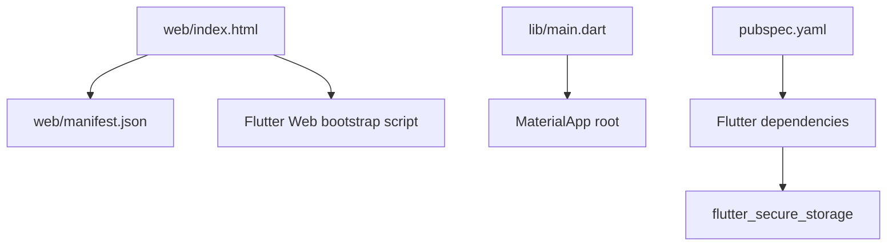
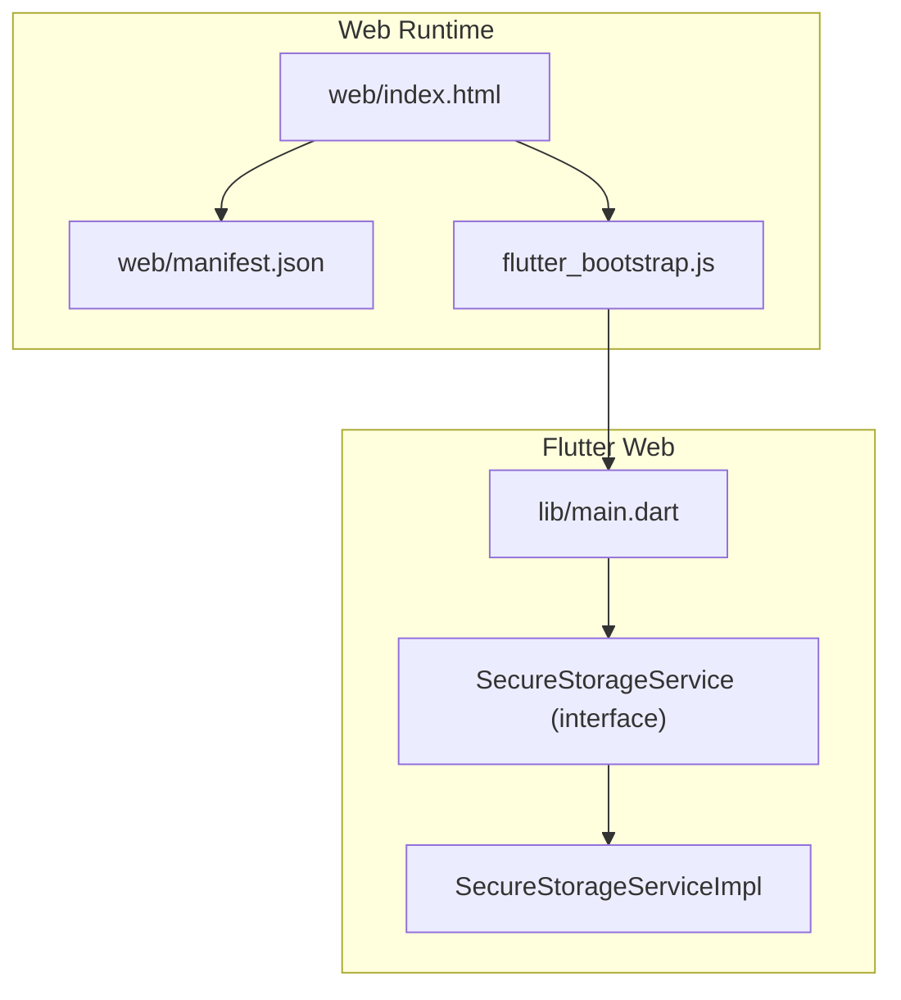
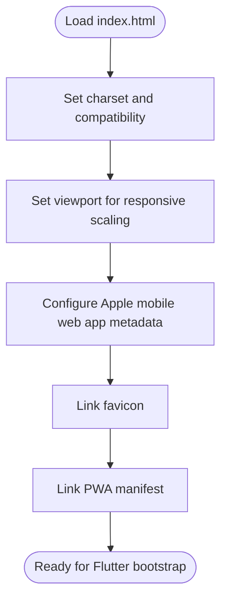
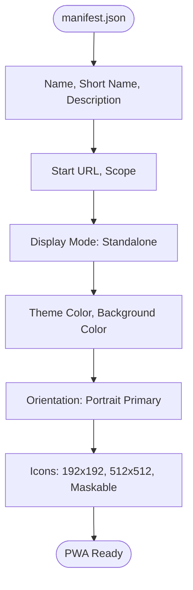
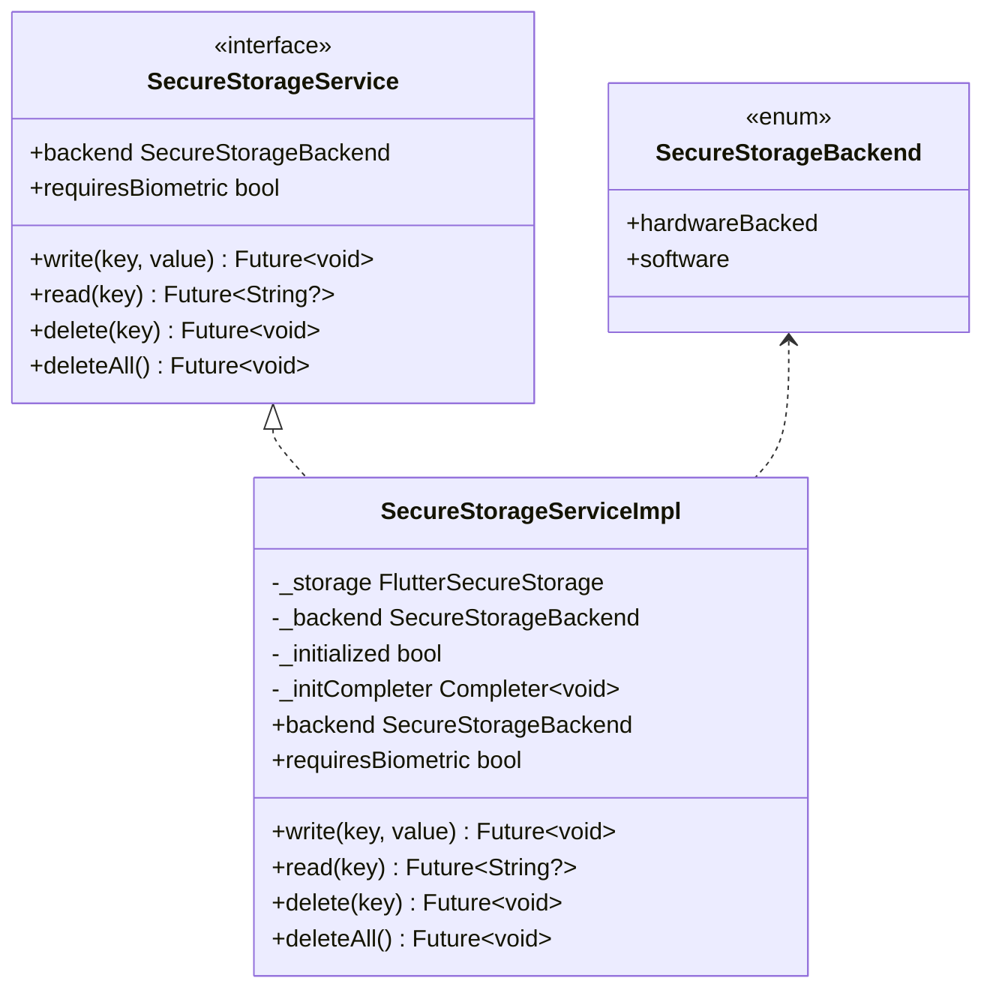
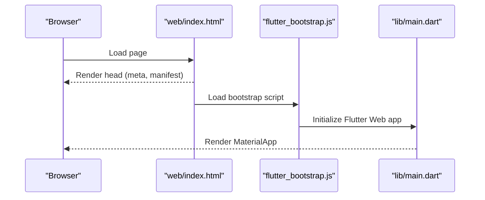
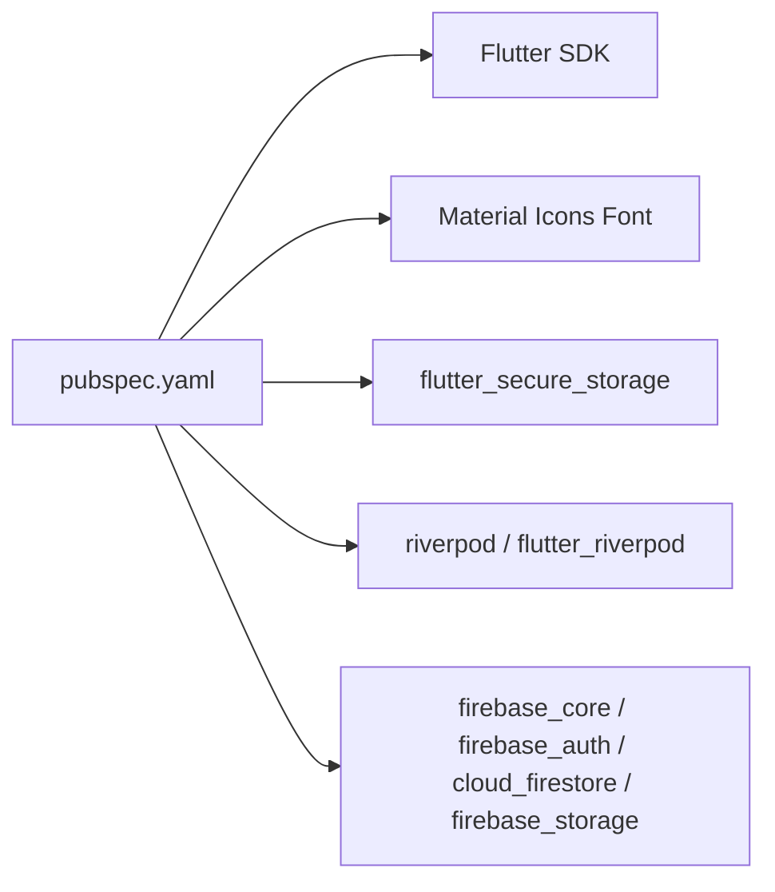

# Web Implementation

<cite>
**Referenced Files in This Document**
- [index.html](file://web/index.html)
- [manifest.json](file://web/manifest.json)
- [pubspec.yaml](file://pubspec.yaml)
- [secure_storage_service.dart](file://lib/core/storage/secure_storage_service.dart)
- [secure_storage_service_impl.dart](file://lib/core/storage/secure_storage_service_impl.dart)
- [secure_storage_service_test.dart](file://test/secure_storage_service_test.dart)
- [secure_storage_property_test.dart](file://test/secure_storage_property_test.dart)
- [README.md](file://README.md)
</cite>

## Table of Contents
1. [Introduction](#introduction)
2. [Project Structure](#project-structure)
3. [Core Components](#core-components)
4. [Architecture Overview](#architecture-overview)
5. [Detailed Component Analysis](#detailed-component-analysis)
6. [Dependency Analysis](#dependency-analysis)
7. [Performance Considerations](#performance-considerations)
8. [Troubleshooting Guide](#troubleshooting-guide)
9. [Conclusion](#conclusion)
10. [Appendices](#appendices)

## Introduction
This document explains StyleSync’s web implementation and Progressive Web App (PWA) features built with Flutter Web. It covers HTML structure and meta tags, viewport configuration, PWA manifest integration, browser storage behavior, and how the app initializes on the web. It also outlines security considerations, cross-browser compatibility, and deployment guidance derived from the repository’s current configuration.

## Project Structure
The web-specific assets live under the web/ directory and are consumed by Flutter Web during build. The primary files are:
- web/index.html: HTML shell with meta tags, viewport, Apple touch icons, favicon, and manifest link.
- web/manifest.json: PWA manifest defining app identity, display mode, theme/background colors, orientation, and icon sets.

**Diagram sources**
- [index.html](file://web/index.html#L1-L40)
- [manifest.json](file://web/manifest.json#L1-L38)
- [pubspec.yaml](file://pubspec.yaml#L30-L48)

**Section sources**
- [index.html](file://web/index.html#L1-L40)
- [manifest.json](file://web/manifest.json#L1-L38)
- [pubspec.yaml](file://pubspec.yaml#L30-L48)

## Core Components
- HTML Shell and Meta Tags: Defines character encoding, IE compatibility, description, viewport, Apple mobile web app metadata, favicon, and links to the manifest.
- PWA Manifest: Declares app name, short name, scope and start URL, standalone display mode, theme/background colors, orientation, and multiple icon sizes including maskable variants.
- Secure Storage Abstraction: Provides a unified interface for platform-native secure storage, selecting hardware-backed or software-backed storage depending on platform. On web, the implementation defaults to software-backed storage.

**Section sources**
- [index.html](file://web/index.html#L19-L34)
- [manifest.json](file://web/manifest.json#L1-L38)
- [secure_storage_service.dart](file://lib/core/storage/secure_storage_service.dart#L1-L30)
- [secure_storage_service_impl.dart](file://lib/core/storage/secure_storage_service_impl.dart#L58-L62)

## Architecture Overview
The web runtime integrates the HTML shell and manifest with Flutter Web. The Flutter app initializes via a bootstrap script and renders a MaterialApp. Secure storage is abstracted behind an interface and implemented using flutter_secure_storage, with platform-specific behavior.

**Diagram sources**
- [index.html](file://web/index.html#L36-L38)
- [manifest.json](file://web/manifest.json#L1-L38)
- [main.dart](file://lib/main.dart#L1-L10)
- [secure_storage_service.dart](file://lib/core/storage/secure_storage_service.dart#L10-L29)
- [secure_storage_service_impl.dart](file://lib/core/storage/secure_storage_service_impl.dart#L7-L31)

## Detailed Component Analysis

### HTML Shell and Meta Tags
- Character encoding and compatibility: Ensures UTF-8 rendering and compatibility with older Internet Explorer.
- Viewport: Enables responsive scaling across devices.
- Apple Mobile Web App: Enables standalone iOS web app behavior and sets the status bar style and app title.
- Favicon: Adds a PNG favicon for desktop tab representation.
- Manifest Link: Links to the PWA manifest for installability and runtime configuration.

**Diagram sources**
- [index.html](file://web/index.html#L19-L34)

**Section sources**
- [index.html](file://web/index.html#L19-L34)

### PWA Manifest Configuration
- Identity and Scope: Name, short_name, start_url, and scope define the app’s identity and navigation boundaries.
- Display Mode: standalone for immersive app-like experience.
- Theming: theme_color and background_color align UI chrome with brand.
- Orientation: portrait-primary restricts orientation.
- Icons: Includes standard and maskable PNG icons sized 192x192 and 512x512.
- Prefer Related Applications: Disabled.

**Diagram sources**
- [manifest.json](file://web/manifest.json#L1-L38)

**Section sources**
- [manifest.json](file://web/manifest.json#L1-L38)

### Secure Storage on Web
- Interface: Defines write/read/delete/deleteAll and exposes backend type and biometric requirement.
- Implementation: On non-mobile platforms (including web), defaults to software-backed storage via flutter_secure_storage. Initialization is guarded by a completer to ensure asynchronous readiness.
- Web Options: Tests demonstrate passing webOptions to the underlying storage abstraction, indicating web-targeted configuration points.

**Diagram sources**
- [secure_storage_service.dart](file://lib/core/storage/secure_storage_service.dart#L1-L30)
- [secure_storage_service_impl.dart](file://lib/core/storage/secure_storage_service_impl.dart#L7-L31)

**Section sources**
- [secure_storage_service.dart](file://lib/core/storage/secure_storage_service.dart#L1-L30)
- [secure_storage_service_impl.dart](file://lib/core/storage/secure_storage_service_impl.dart#L58-L62)
- [secure_storage_service_test.dart](file://test/secure_storage_service_test.dart#L36-L47)
- [secure_storage_property_test.dart](file://test/secure_storage_property_test.dart#L19-L22)

### Flutter Web Bootstrap and App Initialization
- The HTML loads a bootstrap script that initializes the Flutter Web app.
- The app creates a MaterialApp root, which is the starting point for Flutter widgets.

**Diagram sources**
- [index.html](file://web/index.html#L36-L38)
- [main.dart](file://lib/main.dart#L1-L10)

**Section sources**
- [index.html](file://web/index.html#L36-L38)
- [main.dart](file://lib/main.dart#L1-L10)

## Dependency Analysis
- Flutter Web depends on the Flutter SDK and Material Design.
- The app declares several Flutter dependencies in pubspec.yaml, including firebase_* packages, flutter_secure_storage, riverpod, and others. These are relevant to the broader app but not directly PWA-specific.

**Diagram sources**
- [pubspec.yaml](file://pubspec.yaml#L30-L48)

**Section sources**
- [pubspec.yaml](file://pubspec.yaml#L30-L48)

## Performance Considerations
- Build and Deployment: The project README indicates Flutter SDK prerequisites and standard development commands. While it does not specify CDN or service worker configuration, Flutter Web apps are typically served from a static host.
- Optimization Techniques: Common web optimizations include enabling compression, using modern image formats, minimizing JavaScript payload, and leveraging browser caching. These are general best practices and not explicitly configured in the repository.

[No sources needed since this section provides general guidance]

## Troubleshooting Guide
- Secure Storage Behavior on Web: Tests confirm that webOptions are passed to the storage abstraction, validating that web-specific configuration is supported. If storage operations fail, verify initialization completion and underlying storage availability.
- Platform Backend Selection: Property tests show that non-mobile platforms (e.g., macOS) default to software-backed storage. On web, the implementation similarly defaults to software-backed storage.

**Section sources**
- [secure_storage_service_test.dart](file://test/secure_storage_service_test.dart#L36-L47)
- [secure_storage_property_test.dart](file://test/secure_storage_property_test.dart#L19-L22)

## Conclusion
StyleSync’s web implementation leverages Flutter Web with a standard HTML shell and PWA manifest. The HTML and manifest define responsive behavior, installability, and theming. Secure storage is abstracted and defaults to software-backed storage on web, with explicit support for webOptions in the underlying storage layer. The app initializes via a bootstrap script and renders a MaterialApp root. Additional PWA features such as service workers, background sync, and push notifications are not present in the current repository snapshot.

[No sources needed since this section summarizes without analyzing specific files]

## Appendices

### Web-Specific Security Considerations
- HTTPS: PWA features such as service workers require HTTPS in production environments. The repository does not include a service worker; therefore, HTTPS is not enforced by the app itself but is a general requirement for PWA capabilities.
- CORS: Cross-origin requests depend on server-side CORS policies. The repository does not include CORS configuration files.
- Storage Limitations: On web, flutter_secure_storage falls back to browser storage mechanisms. Availability and quotas vary by browser. The implementation uses software-backed storage by default on non-mobile platforms.

**Section sources**
- [secure_storage_service_impl.dart](file://lib/core/storage/secure_storage_service_impl.dart#L58-L62)

### Responsive Design and Accessibility
- Responsive Design: The viewport meta tag enables responsive scaling across devices.
- Accessibility: Widget tests include accessibility checks, demonstrating semantic labeling for text elements.

**Section sources**
- [index.html](file://web/index.html#L22-L22)
- [welcome_page_test.dart](file://test/features/onboarding/widgets/welcome_page_test.dart#L242-L267)

### Deployment and Hosting
- Flutter Web builds produce static assets suitable for hosting on static CDNs or web servers. The README specifies Flutter SDK prerequisites and basic commands for getting started. No CDN-specific configuration is present in the repository.

**Section sources**
- [README.md](file://README.md#L1-L22)