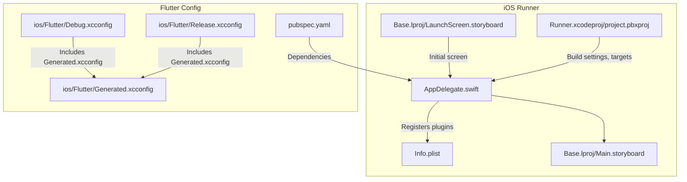
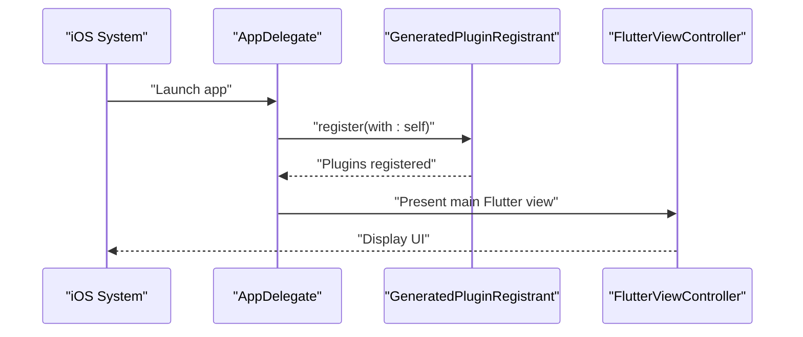
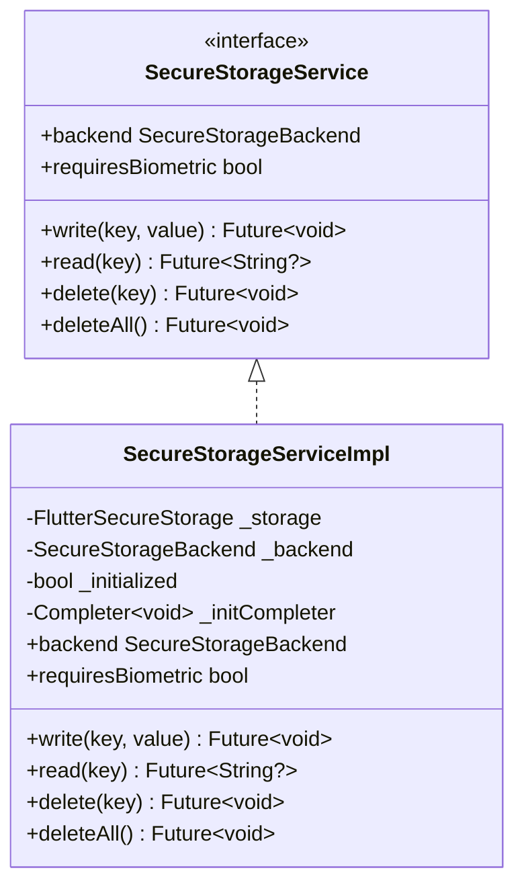
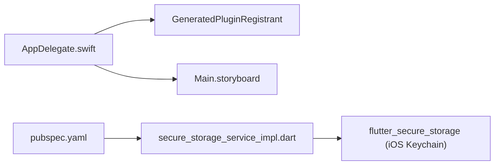

# iOS Implementation

<cite>
**Referenced Files in This Document**
- [Info.plist](file://ios/Runner/Info.plist)
- [AppDelegate.swift](file://ios/Runner/AppDelegate.swift)
- [Main.storyboard](file://ios/Runner/Base.lproj/Main.storyboard)
- [LaunchScreen.storyboard](file://ios/Runner/Base.lproj/LaunchScreen.storyboard)
- [project.pbxproj](file://ios/Runner.xcodeproj/project.pbxproj)
- [Debug.xcconfig](file://ios/Flutter/Debug.xcconfig)
- [Release.xcconfig](file://ios/Flutter/Release.xcconfig)
- [Generated.xcconfig](file://ios/Flutter/Generated.xcconfig)
- [pubspec.yaml](file://pubspec.yaml)
- [secure_storage_service.dart](file://lib/core/storage/secure_storage_service.dart)
- [secure_storage_service_impl.dart](file://lib/core/storage/secure_storage_service_impl.dart)
- [main.dart](file://lib/main.dart)
</cite>

## Table of Contents
1. [Introduction](#introduction)
2. [Project Structure](#project-structure)
3. [Core Components](#core-components)
4. [Architecture Overview](#architecture-overview)
5. [Detailed Component Analysis](#detailed-component-analysis)
6. [Dependency Analysis](#dependency-analysis)
7. [Performance Considerations](#performance-considerations)
8. [Troubleshooting Guide](#troubleshooting-guide)
9. [Conclusion](#conclusion)
10. [Appendices](#appendices)

## Introduction
This document provides comprehensive iOS implementation guidance for StyleSync. It covers Info.plist configuration, iOS-specific security features via the iOS Keychain, app capabilities, Xcode project configuration, build settings, deployment targets, lifecycle management, UI considerations (Safe Areas and orientation), and performance/memory best practices. It also outlines App Store submission prerequisites and code signing/provisioning considerations derived from the repository’s configuration.

## Project Structure
The iOS implementation resides under the ios/Runner directory and integrates with Flutter’s generated build system. Key elements include:
- Application entry point and lifecycle management in AppDelegate.swift
- Storyboards for launch and main view controller
- Info.plist for bundle metadata and supported orientations
- Xcode project configuration (project.pbxproj) and Flutter xcconfig files
- Flutter dependency configuration in pubspec.yaml

**Diagram sources**
- [AppDelegate.swift](file://ios/Runner/AppDelegate.swift#L1-L14)
- [Info.plist](file://ios/Runner/Info.plist#L1-L50)
- [Main.storyboard](file://ios/Runner/Base.lproj/Main.storyboard#L1-L27)
- [LaunchScreen.storyboard](file://ios/Runner/Base.lproj/LaunchScreen.storyboard#L1-L38)
- [project.pbxproj](file://ios/Runner.xcodeproj/project.pbxproj#L166-L201)
- [Debug.xcconfig](file://ios/Flutter/Debug.xcconfig#L1-L2)
- [Release.xcconfig](file://ios/Flutter/Release.xcconfig#L1-L2)
- [Generated.xcconfig](file://ios/Flutter/Generated.xcconfig#L1-L15)
- [pubspec.yaml](file://pubspec.yaml#L1-L105)

**Section sources**
- [AppDelegate.swift](file://ios/Runner/AppDelegate.swift#L1-L14)
- [Info.plist](file://ios/Runner/Info.plist#L1-L50)
- [Main.storyboard](file://ios/Runner/Base.lproj/Main.storyboard#L1-L27)
- [LaunchScreen.storyboard](file://ios/Runner/Base.lproj/LaunchScreen.storyboard#L1-L38)
- [project.pbxproj](file://ios/Runner.xcodeproj/project.pbxproj#L166-L201)
- [Debug.xcconfig](file://ios/Flutter/Debug.xcconfig#L1-L2)
- [Release.xcconfig](file://ios/Flutter/Release.xcconfig#L1-L2)
- [Generated.xcconfig](file://ios/Flutter/Generated.xcconfig#L1-L15)
- [pubspec.yaml](file://pubspec.yaml#L1-L105)

## Core Components
- AppDelegate: Registers Flutter plugins and participates in application lifecycle.
- Info.plist: Declares bundle metadata, supported orientations, and runtime flags.
- Storyboards: Define the initial launch screen and main Flutter view controller.
- Secure storage service: Implements iOS Keychain-backed storage via flutter_secure_storage with iOS-specific accessibility options.
- Flutter build configuration: Generated.xcconfig and Debug/Release xcconfig files define build-time settings.

Key iOS security and configuration highlights:
- iOS Keychain integration is configured in the secure storage implementation for iOS devices.
- Deployment target and device family are defined in Xcode build settings.
- Info.plist supports portrait and landscape orientations for iPhone and iPad.

**Section sources**
- [AppDelegate.swift](file://ios/Runner/AppDelegate.swift#L1-L14)
- [Info.plist](file://ios/Runner/Info.plist#L25-L47)
- [secure_storage_service_impl.dart](file://lib/core/storage/secure_storage_service_impl.dart#L50-L57)
- [project.pbxproj](file://ios/Runner.xcodeproj/project.pbxproj#L349-L354)

## Architecture Overview
The iOS app boots through AppDelegate, initializes Flutter, registers plugins, and presents the Flutter view controller defined in Main.storyboard. The secure storage subsystem abstracts platform-specific secure storage and selects iOS Keychain for iOS devices.

**Diagram sources**
- [AppDelegate.swift](file://ios/Runner/AppDelegate.swift#L6-L12)
- [Main.storyboard](file://ios/Runner/Base.lproj/Main.storyboard#L11-L22)

**Section sources**
- [AppDelegate.swift](file://ios/Runner/AppDelegate.swift#L1-L14)
- [Main.storyboard](file://ios/Runner/Base.lproj/Main.storyboard#L1-L27)

## Detailed Component Analysis

### Info.plist Configuration
- Bundle identifiers and display names are defined for the app bundle.
- Launch and main storyboard references are declared.
- Supported interface orientations include portrait and multiple landscape orientations for iPhone and iPad.
- Runtime flags enable minimum frame duration adjustments and indirect input events for modern input devices.

Security and background-related keys:
- No explicit background modes or privacy permissions are present in the provided Info.plist snapshot.
- No explicit ATS (App Transport Security) exceptions are shown.

Recommendations:
- Add background modes (e.g., audio, fetch) only if required by features.
- Add NSFaceIDUsageDescription or NSBiometricUsageDescription if biometric authentication is enabled later.
- Add NSCameraUsageDescription or NSPhotoLibraryUsageDescription if media features are introduced.

**Section sources**
- [Info.plist](file://ios/Runner/Info.plist#L5-L47)

### AppDelegate and Lifecycle Management
- AppDelegate inherits from FlutterAppDelegate and registers plugins during application launch.
- The implementation defers most lifecycle decisions to Flutter and the generated plugin registrant.

Considerations:
- If future features require background tasks or remote notifications, configure capabilities and entitlements accordingly.
- For SwiftUI scenes or multi-window support, integrate SceneDelegate patterns as needed.

**Section sources**
- [AppDelegate.swift](file://ios/Runner/AppDelegate.swift#L1-L14)

### Storyboard-Based UI and Safe Areas
- LaunchScreen.storyboard uses Safe Area constraints and centered imagery for the launch experience.
- Main.storyboard defines a FlutterViewController as the initial controller, enabling Flutter to manage UI composition.

Best practices:
- Keep launch screen minimal and rely on Flutter for dynamic UI after launch.
- Ensure Flutter widgets respect Safe Area insets via MediaQuery and padding.

**Section sources**
- [LaunchScreen.storyboard](file://ios/Runner/Base.lproj/LaunchScreen.storyboard#L6-L26)
- [Main.storyboard](file://ios/Runner/Base.lproj/Main.storyboard#L11-L22)

### iOS Keychain Integration and Secure Storage
The secure storage abstraction selects iOS Keychain for iOS devices with a specific accessibility setting.

**Diagram sources**
- [secure_storage_service.dart](file://lib/core/storage/secure_storage_service.dart#L11-L29)
- [secure_storage_service_impl.dart](file://lib/core/storage/secure_storage_service_impl.dart#L7-L104)

Implementation highlights:
- iOS branch configures iOSOptions with a specific Keychain accessibility setting.
- Initialization uses a Completer to ensure asynchronous initialization completes before reads/writes.
- Fallback to software-backed storage occurs if initialization fails.

**Section sources**
- [secure_storage_service.dart](file://lib/core/storage/secure_storage_service.dart#L1-L105)
- [secure_storage_service_impl.dart](file://lib/core/storage/secure_storage_service_impl.dart#L33-L73)
- [secure_storage_service_impl.dart](file://lib/core/storage/secure_storage_service_impl.dart#L50-L57)

### Xcode Project Configuration and Build Settings
- Deployment target is set to iOS 14.0 in build settings.
- Targeted device family includes iPhone and iPad.
- Swift version is set to 5.0.
- Bitcode is disabled; linking paths include @executable_path/Frameworks.
- Generated.xcconfig is included by Debug and Release xcconfig files.

Flutter integration:
- Generated.xcconfig sets FLUTTER_ROOT, build name/version, simulator/simulator arch exclusions, and other Flutter-specific flags.

**Section sources**
- [project.pbxproj](file://ios/Runner.xcodeproj/project.pbxproj#L349-L354)
- [project.pbxproj](file://ios/Runner.xcodeproj/project.pbxproj#L526-L533)
- [Generated.xcconfig](file://ios/Flutter/Generated.xcconfig#L2-L14)
- [Debug.xcconfig](file://ios/Flutter/Debug.xcconfig#L1-L2)
- [Release.xcconfig](file://ios/Flutter/Release.xcconfig#L1-L2)

### App Store Submission and Code Signing
- The repository uses automatic code signing for iOS builds in the Xcode project configuration.
- Provisioning profiles and manual signing settings are not explicitly configured in the provided files; automatic signing is enabled.

Recommendations:
- Ensure a valid Apple Developer account is selected for signing.
- Configure distribution certificates and provisioning profiles for release builds.
- Add App Store-required metadata (privacy policy URL, etc.) in Xcode if preparing for submission.

**Section sources**
- [project.pbxproj](file://ios/Runner.xcodeproj/project.pbxproj#L335-L336)
- [project.pbxproj](file://ios/Runner.xcodeproj/project.pbxproj#L383-L384)

## Dependency Analysis
The iOS app depends on Flutter and the generated plugin registrant. Secure storage relies on flutter_secure_storage, which internally uses iOS Keychain for iOS platforms.

**Diagram sources**
- [AppDelegate.swift](file://ios/Runner/AppDelegate.swift#L10-L11)
- [Main.storyboard](file://ios/Runner/Base.lproj/Main.storyboard#L11-L22)
- [secure_storage_service_impl.dart](file://lib/core/storage/secure_storage_service_impl.dart#L3-L5)
- [pubspec.yaml](file://pubspec.yaml#L38-L38)

**Section sources**
- [AppDelegate.swift](file://ios/Runner/AppDelegate.swift#L1-L14)
- [secure_storage_service_impl.dart](file://lib/core/storage/secure_storage_service_impl.dart#L1-L105)
- [pubspec.yaml](file://pubspec.yaml#L30-L47)

## Performance Considerations
- Keep the launch screen lightweight; defer heavy work to after the first frame.
- Use Flutter’s built-in performance tools and profiling to identify bottlenecks.
- Avoid unnecessary rebuilds and use const constructors where possible.
- Manage memory carefully: avoid retaining large objects unnecessarily, cancel subscriptions, and dispose of resources in Flutter lifecycle hooks.
- Leverage iOS 14+ deployment target benefits (e.g., improved graphics and memory APIs) while maintaining compatibility.

[No sources needed since this section provides general guidance]

## Troubleshooting Guide
- Plugin registration failures: Verify GeneratedPluginRegistrant is properly linked and registered in AppDelegate.
- Secure storage initialization errors: The implementation falls back to software-backed storage if Keychain initialization fails; check logs for initialization failure messages.
- Build issues: Confirm Generated.xcconfig is included by Debug/Release xcconfig and that FLUTTER_ROOT points to a valid Flutter SDK path.

**Section sources**
- [AppDelegate.swift](file://ios/Runner/AppDelegate.swift#L10-L11)
- [secure_storage_service_impl.dart](file://lib/core/storage/secure_storage_service_impl.dart#L63-L72)
- [Generated.xcconfig](file://ios/Flutter/Generated.xcconfig#L2-L2)

## Conclusion
StyleSync’s iOS implementation leverages Flutter with a minimal AppDelegate, storyboard-driven UI, and a secure storage abstraction that utilizes iOS Keychain for sensitive data. The Xcode project targets iOS 14 and uses automatic signing. For production readiness, add required permissions and descriptions to Info.plist, configure App Store metadata, and ensure proper code signing and provisioning for distribution.

[No sources needed since this section summarizes without analyzing specific files]

## Appendices

### iOS-Specific UI Considerations
- Safe Areas: LaunchScreen.storyboard uses Safe Area constraints; ensure Flutter screens also respect safe areas.
- Orientations: Info.plist supports portrait and landscape orientations for iPhone and iPad.
- Dark Mode: Not explicitly configured in the provided files; consider integrating platform brightness preferences if needed.

**Section sources**
- [LaunchScreen.storyboard](file://ios/Runner/Base.lproj/LaunchScreen.storyboard#L6-L26)
- [Info.plist](file://ios/Runner/Info.plist#L31-L43)

### Platform-Specific Security Features
- iOS Keychain Services: Used via flutter_secure_storage with iOS-specific accessibility options.
- Hardware Security Module: The secure storage abstraction indicates hardware-backed storage is used on iOS; ensure appropriate accessibility settings are applied.

**Section sources**
- [secure_storage_service_impl.dart](file://lib/core/storage/secure_storage_service_impl.dart#L50-L57)
- [secure_storage_service.dart](file://lib/core/storage/secure_storage_service.dart#L3-L4)

### App Store Submission Checklist (Derived from Repository)
- Privacy policy URL and related metadata in Xcode if preparing for submission.
- Code signing with a valid Apple Developer account and automatic/manual signing configuration.
- Provisioning profiles for distribution builds.

**Section sources**
- [project.pbxproj](file://ios/Runner.xcodeproj/project.pbxproj#L383-L384)
- [project.pbxproj](file://ios/Runner.xcodeproj/project.pbxproj#L335-L336)