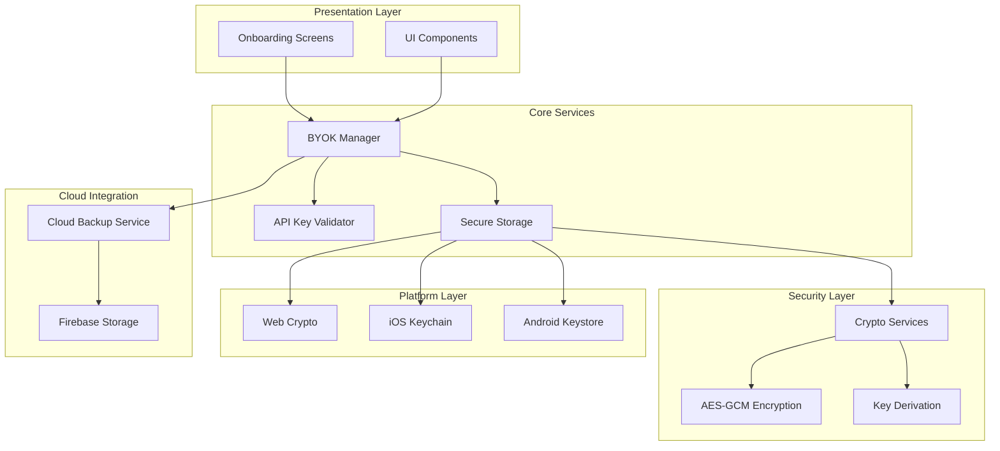
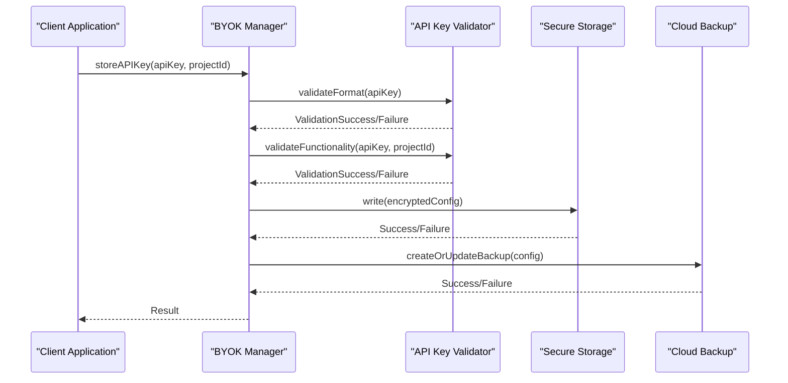
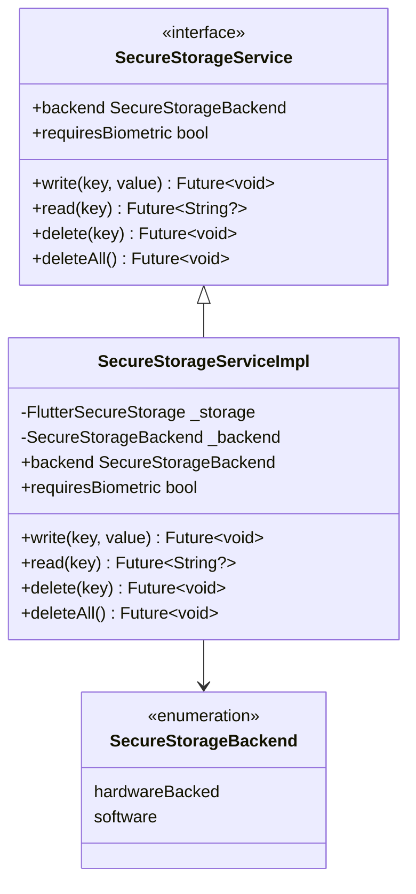
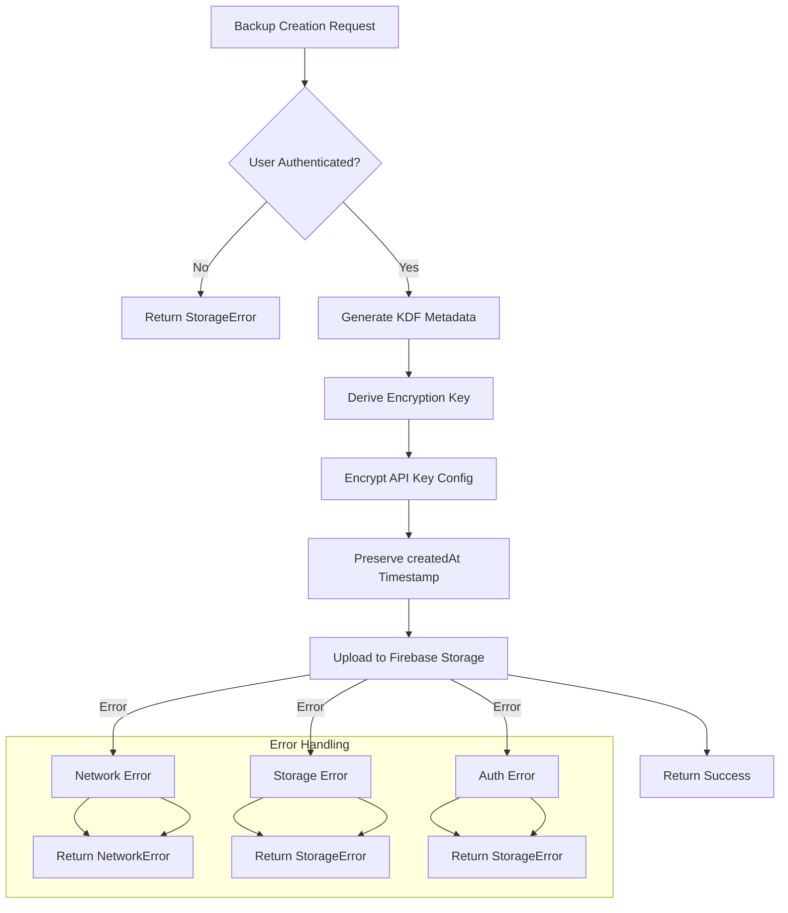
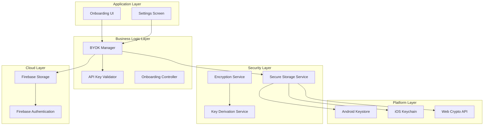
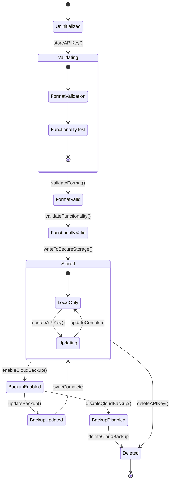
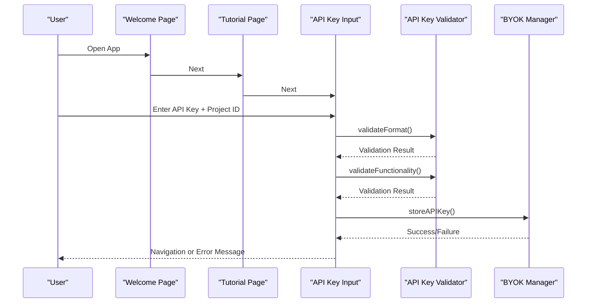
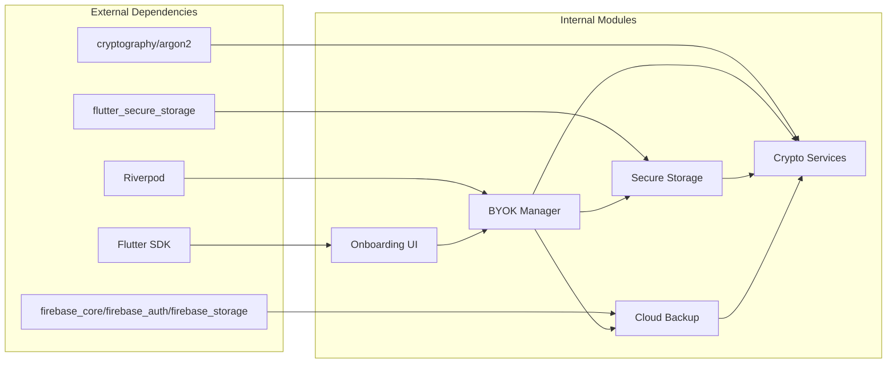

# Project Overview

<cite>
**Referenced Files in This Document**
- [README.md](file://README.md)
- [pubspec.yaml](file://pubspec.yaml)
- [lib/main.dart](file://lib/main.dart)
- [lib/core/byok/byok_manager.dart](file://lib/core/byok/byok_manager.dart)
- [lib/core/byok/byok_design.md](file://lib/core/byok/byok_design.md)
- [lib/core/byok/cloud_backup_service.dart](file://lib/core/byok/cloud_backup_service.dart)
- [lib/core/storage/secure_storage_service.dart](file://lib/core/storage/secure_storage_service.dart)
- [lib/core/storage/secure_storage_service_impl.dart](file://lib/core/storage/secure_storage_service_impl.dart)
- [lib/core/crypto/encryption_service.dart](file://lib/core/crypto/encryption_service.dart)
- [lib/core/crypto/key_derivation_service.dart](file://lib/core/crypto/key_derivation_service.dart)
- [lib/features/onboarding/widgets/api_key_input_page.dart](file://lib/features/onboarding/widgets/api_key_input_page.dart)
- [lib/features/onboarding/onboarding_screen.dart](file://lib/features/onboarding/onboarding_screen.dart)
</cite>

## Table of Contents
1. [Introduction](#introduction)
2. [Project Structure](#project-structure)
3. [Core Components](#core-components)
4. [Architecture Overview](#architecture-overview)
5. [Detailed Component Analysis](#detailed-component-analysis)
6. [Dependency Analysis](#dependency-analysis)
7. [Performance Considerations](#performance-considerations)
8. [Troubleshooting Guide](#troubleshooting-guide)
9. [Conclusion](#conclusion)

## Introduction

StyleSync is a secure API key management solution designed specifically for Google Cloud Vertex AI services. The project addresses a critical gap in enterprise security by providing a comprehensive BYOK (Bring Your Own Key) system that keeps sensitive API credentials under user control while enabling optional encrypted cloud backup capabilities.

### Purpose and Vision

StyleSync transforms how organizations manage their Vertex AI API keys by implementing a security-first approach that prioritizes confidentiality, integrity, and availability. The system recognizes that API keys represent significant security risks when mishandled, particularly in mobile and web environments where traditional server-side storage is often impractical.

### Target Audience

The solution targets two primary audiences:
- **Enterprise Developers**: Teams building applications that integrate with Google Cloud Vertex AI services who need robust key management without compromising security
- **Security-Conscious Organizations**: Companies requiring strict control over their cryptographic materials and compliance with security frameworks

### Key Benefits

- **Enhanced Security**: API keys never leave the device boundary, minimizing exposure surfaces
- **BYOK Compliance**: Users maintain control over their encryption materials
- **Cross-Platform Support**: Native deployment across Android, iOS, and web platforms
- **Enterprise-Grade Protection**: Hardware-backed storage on supported platforms
- **Operational Resilience**: Optional encrypted cloud backup for disaster recovery scenarios

### Core Value Proposition

StyleSync delivers a unique combination of security and usability: it maintains the highest security standards while providing intuitive user experiences and operational flexibility. The system ensures that security measures never become barriers to productivity.

## Project Structure

The project follows a modular architecture organized around security-critical components and user-facing features:

**Diagram sources**
- [lib/core/byok/byok_manager.dart](file://lib/core/byok/byok_manager.dart#L84-L147)
- [lib/core/storage/secure_storage_service.dart](file://lib/core/storage/secure_storage_service.dart#L11-L29)
- [lib/core/byok/cloud_backup_service.dart](file://lib/core/byok/cloud_backup_service.dart#L21-L91)

### Technology Stack

The project leverages a modern Flutter-based architecture with enterprise-grade security:

- **Frontend Framework**: Flutter SDK 3.10.7 with Dart programming language
- **State Management**: Riverpod for reactive state handling
- **Security Libraries**: cryptography, argon2, flutter_secure_storage
- **Cloud Services**: Firebase Authentication and Firebase Storage
- **Platform Integration**: Native secure storage backends

**Section sources**
- [README.md](file://README.md#L5-L6)
- [pubspec.yaml](file://pubspec.yaml#L30-L47)

## Core Components

### BYOK Manager

The BYOK Manager serves as the central orchestrator for API key lifecycle management, implementing comprehensive validation, storage, and backup operations:

**Diagram sources**
- [lib/core/byok/byok_manager.dart](file://lib/core/byok/byok_manager.dart#L182-L231)
- [lib/core/byok/byok_design.md](file://lib/core/byok/byok_design.md#L500-L543)

The manager implements a comprehensive API covering:
- **Storage Operations**: Format validation, functional testing, and secure persistence
- **Retrieval Operations**: Safe key access with validation and metadata preservation
- **Lifecycle Management**: Updates, deletions, and backup synchronization
- **Backup Operations**: Enable/disable, restore, and passphrase rotation

### Secure Storage Service

The secure storage abstraction provides platform-native protection through hardware-backed storage when available:

**Diagram sources**
- [lib/core/storage/secure_storage_service.dart](file://lib/core/storage/secure_storage_service.dart#L11-L29)
- [lib/core/storage/secure_storage_service_impl.dart](file://lib/core/storage/secure_storage_service_impl.dart#L7-L104)

The implementation automatically selects the most secure available backend:
- **Android**: Uses Android Keystore with AES-GCM hardware protection
- **iOS**: Leverages iOS Keychain with Secure Enclave
- **Web/Desktop**: Falls back to software-based encryption

### Cloud Backup Service

The cloud backup service provides encrypted off-device storage with sophisticated error handling and recovery mechanisms:

**Diagram sources**
- [lib/core/byok/cloud_backup_service.dart](file://lib/core/byok/cloud_backup_service.dart#L167-L249)

**Section sources**
- [lib/core/byok/byok_manager.dart](file://lib/core/byok/byok_manager.dart#L84-L147)
- [lib/core/storage/secure_storage_service.dart](file://lib/core/storage/secure_storage_service.dart#L11-L29)
- [lib/core/byok/cloud_backup_service.dart](file://lib/core/byok/cloud_backup_service.dart#L21-L91)

## Architecture Overview

StyleSync implements a layered security architecture that balances usability with enterprise-grade protection:

**Diagram sources**
- [lib/core/byok/byok_manager.dart](file://lib/core/byok/byok_manager.dart#L153-L181)
- [lib/core/storage/secure_storage_service_impl.dart](file://lib/core/storage/secure_storage_service_impl.dart#L33-L73)
- [lib/core/byok/cloud_backup_service.dart](file://lib/core/byok/cloud_backup_service.dart#L97-L119)

### Cross-Platform Deployment

StyleSync provides native cross-platform support through Flutter's platform abstraction:

- **Android**: Hardware-backed AES-GCM encryption via Android Keystore
- **iOS**: Secure Enclave protection through iOS Keychain
- **Web**: Browser-based encryption with fallback mechanisms
- **Desktop**: Platform-specific secure storage solutions

**Section sources**
- [lib/core/storage/secure_storage_service_impl.dart](file://lib/core/storage/secure_storage_service_impl.dart#L33-L73)
- [lib/features/onboarding/onboarding_screen.dart](file://lib/features/onboarding/onboarding_screen.dart#L15-L21)

## Detailed Component Analysis

### API Key Lifecycle Management

The system implements a comprehensive lifecycle management workflow that ensures security at every stage:

**Diagram sources**
- [lib/core/byok/byok_manager.dart](file://lib/core/byok/byok_manager.dart#L182-L384)
- [lib/core/byok/byok_design.md](file://lib/core/byok/byok_design.md#L297-L437)

### Security Implementation Details

The security architecture employs multiple layers of protection:

#### Hardware-Backed Storage
- **Android**: Uses AES-GCM with hardware key protection in Trusted Execution Environment
- **iOS**: Leverages Secure Enclave for cryptographic operations
- **Fallback**: Software-based encryption with strong randomization

#### Encryption Standards
- **Symmetric Encryption**: AES-256-GCM for authenticated encryption
- **Key Derivation**: Argon2id for mobile devices, PBKDF2 for web/desktop
- **Randomization**: Cryptographically secure random salts and nonces

#### Backup Security
- **Client-Side Encryption**: All cloud data is encrypted before transmission
- **Passphrase-Based**: Keys derived from user-supplied passphrases
- **Atomic Operations**: Two-phase commit for passphrase rotation

### User Interface Integration

The onboarding system provides guided setup with comprehensive error handling:

**Diagram sources**
- [lib/features/onboarding/widgets/api_key_input_page.dart](file://lib/features/onboarding/widgets/api_key_input_page.dart#L252-L307)
- [lib/features/onboarding/onboarding_screen.dart](file://lib/features/onboarding/onboarding_screen.dart#L89-L110)

**Section sources**
- [lib/core/byok/byok_manager.dart](file://lib/core/byok/byok_manager.dart#L182-L384)
- [lib/core/byok/byok_design.md](file://lib/core/byok/byok_design.md#L500-L543)
- [lib/features/onboarding/widgets/api_key_input_page.dart](file://lib/features/onboarding/widgets/api_key_input_page.dart#L12-L31)

## Dependency Analysis

The project maintains clean separation of concerns through strategic dependency management:

**Diagram sources**
- [pubspec.yaml](file://pubspec.yaml#L30-L47)
- [lib/core/byok/byok_manager.dart](file://lib/core/byok/byok_manager.dart#L1-L15)

### Security Library Integration

The project strategically integrates security libraries to achieve optimal performance and compatibility:

- **cryptography**: Provides AES-GCM implementation with hardware acceleration support
- **argon2**: Implements memory-hard key derivation for mobile platforms
- **flutter_secure_storage**: Bridges Flutter applications to native secure storage APIs

**Section sources**
- [pubspec.yaml](file://pubspec.yaml#L34-L47)
- [lib/core/crypto/key_derivation_service.dart](file://lib/core/crypto/key_derivation_service.dart#L1-L15)

## Performance Considerations

### Mobile Optimization

The system is optimized for mobile environments with specific considerations:

- **Memory Usage**: Key derivation parameters are tuned for mobile constraints
- **Battery Life**: Background operations are minimized and batched
- **Network Efficiency**: Cloud operations use efficient serialization formats

### Security vs Performance Trade-offs

The architecture balances security requirements with performance constraints:
- **Hardware Acceleration**: Leverages platform-specific cryptographic acceleration
- **Lazy Initialization**: Secure storage initialization deferred until first use
- **Background Processing**: Heavy cryptographic operations moved to isolates

## Troubleshooting Guide

### Common Issues and Solutions

#### API Key Validation Failures
- **Format Errors**: Verify API key starts with "AIza" and is exactly 39 characters
- **Functionality Errors**: Check project ID validity and API enablement status
- **Network Issues**: Verify internet connectivity and firewall restrictions

#### Storage Access Problems
- **Hardware Backing Issues**: System falls back to software encryption if hardware unavailable
- **Biometric Lockouts**: Configure device passcode as alternative authentication
- **Storage Corruption**: Reset secure storage through system settings

#### Cloud Backup Issues
- **Authentication Failures**: Verify Firebase Authentication setup and user session
- **Network Connectivity**: Check storage quotas and network restrictions
- **Passphrase Errors**: Ensure correct passphrase for backup restoration

**Section sources**
- [lib/core/byok/byok_manager.dart](file://lib/core/byok/byok_manager.dart#L234-L295)
- [lib/core/byok/cloud_backup_service.dart](file://lib/core/byok/cloud_backup_service.dart#L166-L249)

## Conclusion

StyleSync represents a comprehensive solution for secure API key management in Google Cloud Vertex AI environments. The project successfully balances security, usability, and cross-platform compatibility through its layered architecture and enterprise-grade security features.

### Key Achievements

- **Security Excellence**: Implements hardware-backed storage, client-side encryption, and BYOK compliance
- **Developer Experience**: Provides intuitive onboarding, comprehensive error handling, and clear API contracts
- **Enterprise Readiness**: Supports production deployments with robust error handling and recovery mechanisms
- **Cross-Platform Coverage**: Native deployment across Android, iOS, web, and desktop platforms

### Future Considerations

The architecture supports future enhancements including biometric authentication integration, advanced threat detection, and expanded cloud provider support. The modular design ensures that security improvements can be incrementally deployed without disrupting existing functionality.

StyleSync establishes a new standard for secure API key management, demonstrating that enterprise-grade security and developer-friendly experiences can coexist effectively in modern application development.