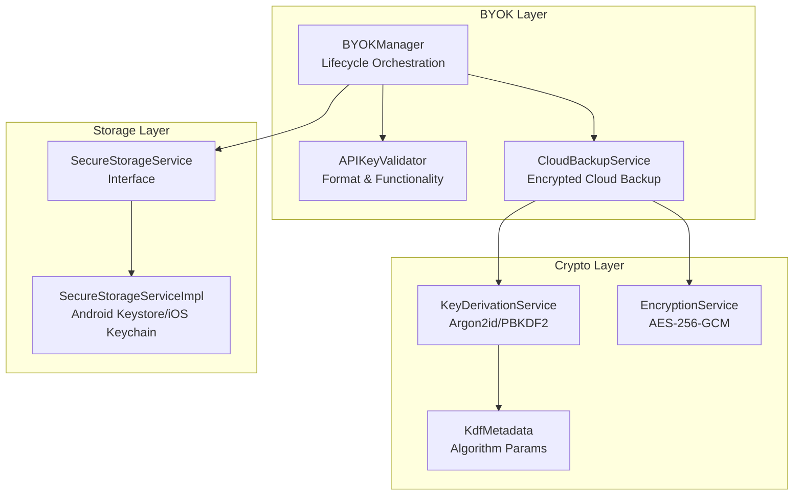
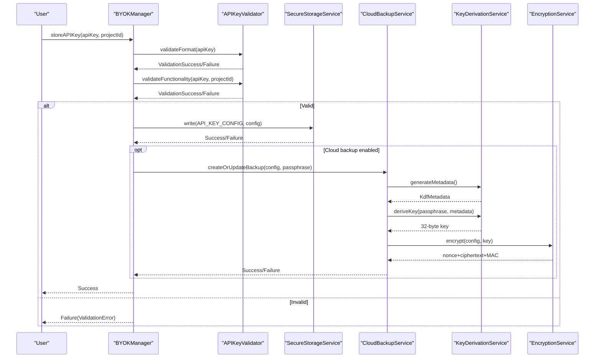
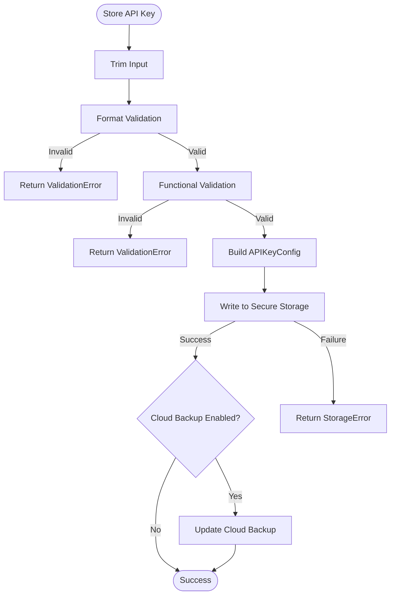
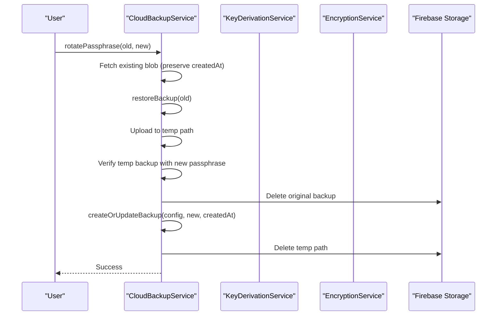
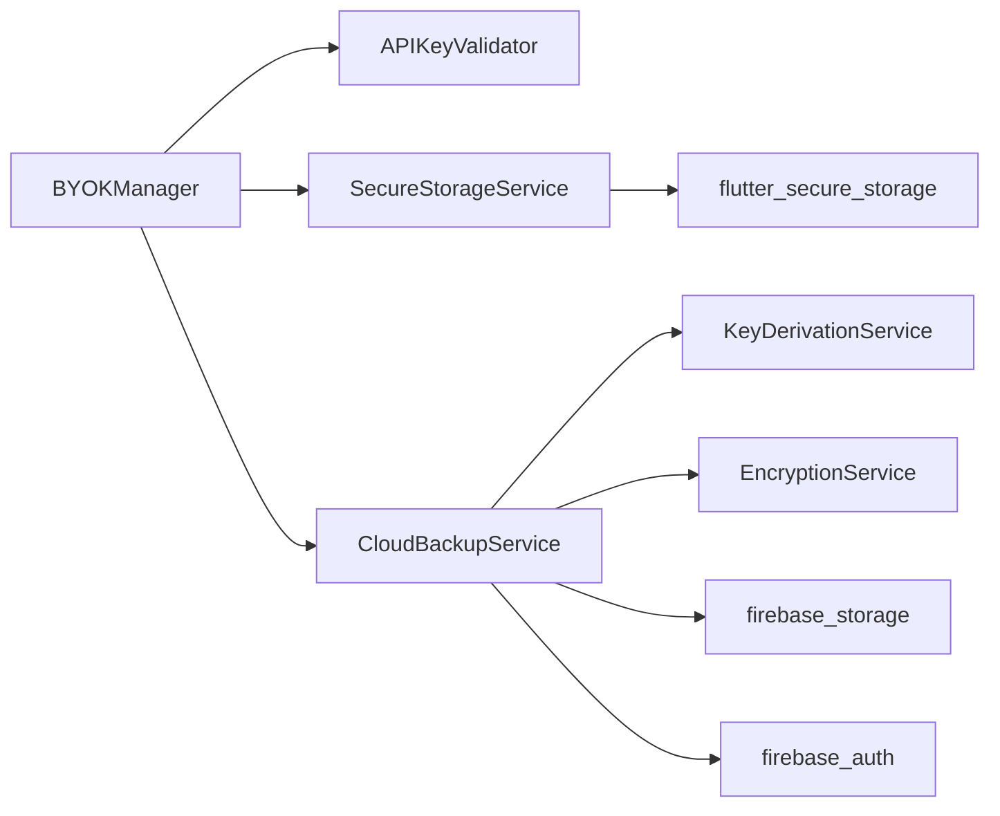
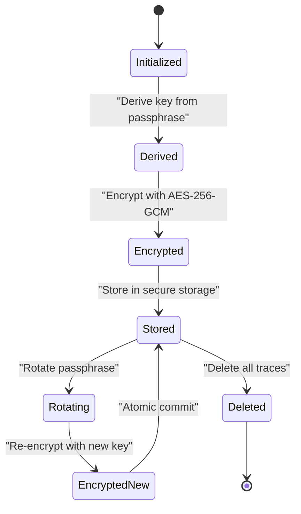

# Security Implementation

<cite>
**Referenced Files in This Document**
- [byok_manager.dart](file://lib/core/byok/byok_manager.dart)
- [byok_design.md](file://lib/core/byok/byok_design.md)
- [cloud_backup_service.dart](file://lib/core/byok/cloud_backup_service.dart)
- [api_key_validator.dart](file://lib/core/byok/api_key_validator.dart)
- [byok_storage_keys.dart](file://lib/core/byok/byok_storage_keys.dart)
- [encryption_service.dart](file://lib/core/crypto/encryption_service.dart)
- [key_derivation_service.dart](file://lib/core/crypto/key_derivation_service.dart)
- [kdf_metadata.dart](file://lib/core/crypto/kdf_metadata.dart)
- [secure_storage_service.dart](file://lib/core/storage/secure_storage_service.dart)
- [secure_storage_service_impl.dart](file://lib/core/storage/secure_storage_service_impl.dart)
- [pubspec.yaml](file://pubspec.yaml)
- [byok_manager_test.dart](file://test/byok_manager_test.dart)
- [encryption_service_test.dart](file://test/encryption_service_test.dart)
- [key_derivation_service_test.dart](file://test/key_derivation_service_test.dart)
- [secure_storage_service_test.dart](file://test/secure_storage_service_test.dart)
</cite>

## Table of Contents
1. [Introduction](#introduction)
2. [Project Structure](#project-structure)
3. [Core Components](#core-components)
4. [Architecture Overview](#architecture-overview)
5. [Detailed Component Analysis](#detailed-component-analysis)
6. [Dependency Analysis](#dependency-analysis)
7. [Performance Considerations](#performance-considerations)
8. [Threat Modeling and Attack Surface](#threat-modeling-and-attack-surface)
9. [Security Best Practices](#security-best-practices)
10. [Cryptographic Algorithm Selection Rationale](#cryptographic-algorithm-selection-rationale)
11. [Key Management Lifecycle](#key-management-lifecycle)
12. [Security Testing Methodologies](#security-testing-methodologies)
13. [Vulnerability Assessment Procedures](#vulnerability-assessment-procedures)
14. [Security Audit Considerations](#security-audit-considerations)
15. [Conclusion](#conclusion)

## Introduction
This document provides comprehensive security documentation for StyleSync's Bring Your Own Key (BYOK) system. It explains the security architecture, cryptographic implementations, key derivation services, secure storage abstractions, and platform-native integrations with Android Keystore and iOS Keychain. The document also covers threat modeling, attack surface analysis, best practices, testing methodologies, and audit considerations to ensure robust protection of user API keys and sensitive configuration data.

## Project Structure
The security-critical components are organized into focused modules:
- BYOK orchestration and API key lifecycle management
- Cloud backup and passphrase-protected encryption
- Cryptographic primitives (AES-256-GCM, Argon2id, PBKDF2)
- Platform-native secure storage abstraction and implementation
- Validation services for API key format and functionality

**Diagram sources**
- [byok_manager.dart](file://lib/core/byok/byok_manager.dart#L84-L147)
- [api_key_validator.dart](file://lib/core/byok/api_key_validator.dart#L14-L48)
- [cloud_backup_service.dart](file://lib/core/byok/cloud_backup_service.dart#L21-L91)
- [key_derivation_service.dart](file://lib/core/crypto/key_derivation_service.dart#L9-L15)
- [encryption_service.dart](file://lib/core/crypto/encryption_service.dart#L14-L20)
- [secure_storage_service.dart](file://lib/core/storage/secure_storage_service.dart#L10-L29)
- [secure_storage_service_impl.dart](file://lib/core/storage/secure_storage_service_impl.dart#L7-L31)

**Section sources**
- [byok_manager.dart](file://lib/core/byok/byok_manager.dart#L84-L147)
- [cloud_backup_service.dart](file://lib/core/byok/cloud_backup_service.dart#L21-L91)
- [encryption_service.dart](file://lib/core/crypto/encryption_service.dart#L14-L20)
- [key_derivation_service.dart](file://lib/core/crypto/key_derivation_service.dart#L9-L15)
- [secure_storage_service.dart](file://lib/core/storage/secure_storage_service.dart#L10-L29)
- [secure_storage_service_impl.dart](file://lib/core/storage/secure_storage_service_impl.dart#L7-L31)

## Core Components
- BYOKManager: Orchestrates API key storage, retrieval, deletion, updates, and cloud backup enablement/disablement. It validates keys, manages metadata, and coordinates with secure storage and cloud backup services.
- CloudBackupService: Provides encrypted cloud backup using client-side encryption with passphrase-derived keys, supports restore, delete, and passphrase rotation with atomic safety guarantees.
- APIKeyValidator: Performs format validation and functional validation against Vertex AI endpoints to ensure key usability and correctness.
- EncryptionService: Implements AES-256-GCM authenticated encryption with nonce and MAC handling.
- KeyDerivationService: Supports Argon2id (hardware-backed platforms) and PBKDF2 (non-hardware platforms) with platform-aware parameterization.
- SecureStorageService: Abstraction for platform-native secure storage with hardware-backed backends on Android and iOS.

**Section sources**
- [byok_manager.dart](file://lib/core/byok/byok_manager.dart#L84-L147)
- [cloud_backup_service.dart](file://lib/core/byok/cloud_backup_service.dart#L21-L91)
- [api_key_validator.dart](file://lib/core/byok/api_key_validator.dart#L14-L48)
- [encryption_service.dart](file://lib/core/crypto/encryption_service.dart#L14-L74)
- [key_derivation_service.dart](file://lib/core/crypto/key_derivation_service.dart#L17-L86)
- [secure_storage_service.dart](file://lib/core/storage/secure_storage_service.dart#L10-L29)

## Architecture Overview
The BYOK architecture enforces client-side encryption and secure storage:
- API keys are validated locally and stored in platform-native secure storage.
- Cloud backups are encrypted with a key derived from the user's passphrase using Argon2id or PBKDF2.
- AES-256-GCM provides authenticated encryption with integrity protection.
- Platform-specific secure storage backends integrate with Android Keystore and iOS Keychain.

**Diagram sources**
- [byok_manager.dart](file://lib/core/byok/byok_manager.dart#L182-L231)
- [api_key_validator.dart](file://lib/core/byok/api_key_validator.dart#L112-L150)
- [cloud_backup_service.dart](file://lib/core/byok/cloud_backup_service.dart#L167-L249)
- [key_derivation_service.dart](file://lib/core/crypto/key_derivation_service.dart#L22-L33)
- [encryption_service.dart](file://lib/core/crypto/encryption_service.dart#L25-L40)

## Detailed Component Analysis

### BYOKManager
Responsibilities:
- Validate API key format and functionality
- Persist configuration to secure storage
- Manage cloud backup enablement, restoration, and passphrase rotation
- Preserve metadata (timestamps, idempotency keys) and handle idempotent operations

Key behaviors:
- Idempotent storage: preserves createdAt and idempotencyKey when storing the same key
- Atomic cloud backup updates: re-encryption on key updates with graceful degradation
- Error handling: distinct error types for validation, storage, and backup failures

**Diagram sources**
- [byok_manager.dart](file://lib/core/byok/byok_manager.dart#L182-L231)

**Section sources**
- [byok_manager.dart](file://lib/core/byok/byok_manager.dart#L84-L147)
- [byok_manager_test.dart](file://test/byok_manager_test.dart#L267-L328)

### CloudBackupService
Responsibilities:
- Encrypt and upload API key configurations to Firebase Storage
- Decrypt and restore configurations using passphrase-derived keys
- Support passphrase rotation with atomic safety and rollback strategies
- Verify backup existence and handle network/storage errors

Implementation highlights:
- Two-phase commit pattern for passphrase rotation
- Temporary backup path to minimize exposure window
- Preservation of createdAt timestamp across rotations
- Distinct error categories for network, storage, and corruption

**Diagram sources**
- [cloud_backup_service.dart](file://lib/core/byok/cloud_backup_service.dart#L413-L555)

**Section sources**
- [cloud_backup_service.dart](file://lib/core/byok/cloud_backup_service.dart#L21-L91)
- [cloud_backup_service.dart](file://lib/core/byok/cloud_backup_service.dart#L413-L555)

### APIKeyValidator
Responsibilities:
- Validate API key format (prefix, length, character set)
- Validate functionality by calling Vertex AI models list endpoint
- Provide structured validation results with error types and metadata

Security considerations:
- Network timeouts and error categorization
- Region and project ID format validation to prevent injection
- Graceful handling of network errors and rate limits

**Section sources**
- [api_key_validator.dart](file://lib/core/byok/api_key_validator.dart#L14-L48)
- [api_key_validator.dart](file://lib/core/byok/api_key_validator.dart#L112-L150)
- [api_key_validator.dart](file://lib/core/byok/api_key_validator.dart#L152-L224)

### EncryptionService (AES-256-GCM)
Responsibilities:
- Encrypt and decrypt data using AES-256-GCM
- Enforce 32-byte key length and proper nonce/MAC handling
- Throw AuthenticationException on MAC verification failure

Security characteristics:
- Authenticated encryption with integrity protection
- Nonce uniqueness via library-generated 12-byte nonce
- MAC verification failure indicates wrong key or tampering

**Section sources**
- [encryption_service.dart](file://lib/core/crypto/encryption_service.dart#L14-L74)
- [encryption_service_test.dart](file://test/encryption_service_test.dart#L14-L62)

### KeyDerivationService (Argon2id/PBKDF2)
Responsibilities:
- Derive 32-byte encryption keys from passphrases
- Generate platform-aware KDF metadata (salt, iterations, memory, parallelism)
- Support Argon2id on mobile platforms and PBKDF2 on non-mobile platforms

Platform-aware parameters:
- Mobile (Android/iOS/macOS): Argon2id with moderate memory and iterations
- Non-mobile: PBKDF2 with high iteration count

**Section sources**
- [key_derivation_service.dart](file://lib/core/crypto/key_derivation_service.dart#L17-L86)
- [kdf_metadata.dart](file://lib/core/crypto/kdf_metadata.dart#L9-L77)
- [key_derivation_service_test.dart](file://test/key_derivation_service_test.dart#L14-L85)

### SecureStorageService and Implementation
Responsibilities:
- Abstract platform-native secure storage
- Provide write/read/delete operations and backend detection
- Initialize hardware-backed storage on Android and iOS

Platform integration:
- Android: AES-GCM with hardware protection (Keystore/TEE/StrongBox)
- iOS: Keychain with Secure Enclave accessibility
- Fallback: Software-backed storage with graceful degradation

**Section sources**
- [secure_storage_service.dart](file://lib/core/storage/secure_storage_service.dart#L10-L29)
- [secure_storage_service_impl.dart](file://lib/core/storage/secure_storage_service_impl.dart#L7-L73)
- [secure_storage_service_impl.dart](file://lib/core/storage/secure_storage_service_impl.dart#L75-L104)
- [secure_storage_service_test.dart](file://test/secure_storage_service_test.dart#L23-L145)

## Dependency Analysis
External dependencies supporting security:
- cryptography: AES-GCM implementation
- argon2: Argon2id key derivation
- flutter_secure_storage: Platform-native secure storage
- firebase_*: Cloud backup storage and authentication

**Diagram sources**
- [pubspec.yaml](file://pubspec.yaml#L30-L47)
- [byok_manager.dart](file://lib/core/byok/byok_manager.dart#L7-L14)
- [cloud_backup_service.dart](file://lib/core/byok/cloud_backup_service.dart#L5-L14)

**Section sources**
- [pubspec.yaml](file://pubspec.yaml#L30-L47)

## Performance Considerations
- Key derivation cost:
  - Argon2id parameters are tuned for mobile platforms to balance security and responsiveness
  - PBKDF2 uses high iteration counts on non-mobile environments
- Encryption overhead:
  - AES-256-GCM adds minimal CPU overhead with strong integrity guarantees
- Cloud operations:
  - Network-bound operations are asynchronous with timeouts and retries
  - Temporary backup path reduces risk during rotation but increases storage usage temporarily

## Threat Modeling and Attack Surface
Primary threats and mitigations:
- Key exposure in transit:
  - Mitigation: Cloud backups are encrypted client-side; only encrypted blobs are stored
- Key exposure on device:
  - Mitigation: Hardware-backed secure storage on Android and iOS; software fallback with encryption
- Passphrase brute force:
  - Mitigation: High-cost KDF parameters; Argon2id/PBKDF2 with salt and iterations
- Tampering with backups:
  - Mitigation: AES-256-GCM MAC verification; AuthenticationException on tampering
- Cloud storage compromise:
  - Mitigation: Client-side encryption; attacker cannot decrypt without passphrase
- Rotation failure scenarios:
  - Mitigation: Temporary backup path, atomic commit pattern, rollback and cleanup procedures

Attack surface areas:
- API key validation endpoints
- Cloud backup storage paths
- Secure storage initialization and fallback paths
- Key derivation parameter persistence

## Security Best Practices
- Always validate API key format and functionality before storage
- Use hardware-backed secure storage when available; accept software fallback gracefully
- Prefer Argon2id on mobile platforms; use PBKDF2 on non-mobile
- Implement passphrase rotation with temporary backup and atomic commit
- Preserve createdAt timestamps across rotations for auditability
- Log non-fatal errors without exposing sensitive data
- Use structured error types to differentiate between validation, storage, and network failures

## Cryptographic Algorithm Selection Rationale
- AES-256-GCM:
  - Provides confidentiality, integrity, and authenticity in a single operation
  - 12-byte nonce and 16-byte MAC meet security requirements
  - Widely adopted and well-vetted
- Argon2id:
  - Memory-hard function suitable for interactive password hashing
  - Adjustable parameters (iterations, memory, parallelism) for modern devices
  - Preferred on mobile platforms with hardware-backed storage
- PBKDF2:
  - Well-established, widely supported
  - Used as fallback on non-mobile platforms with high iteration counts
  - SHA-512 HMAC with 256-bit output

## Key Management Lifecycle
- Generation: Random salt generation for KDF metadata
- Derivation: Passphrase-to-key derivation using Argon2id/PBKDF2
- Encryption: AES-256-GCM with library-generated nonce
- Storage: Secure storage for configuration; encrypted cloud backup for off-device redundancy
- Rotation: Two-phase commit with temporary backup and atomic swap
- Destruction: Secure deletion of local and cloud backups with cleanup

**Diagram sources**
- [key_derivation_service.dart](file://lib/core/crypto/key_derivation_service.dart#L22-L33)
- [encryption_service.dart](file://lib/core/crypto/encryption_service.dart#L25-L40)
- [cloud_backup_service.dart](file://lib/core/byok/cloud_backup_service.dart#L413-L555)

## Security Testing Methodologies
Unit testing coverage:
- Round-trip encryption/decryption with integrity verification
- Nonce uniqueness across encryptions
- Authentication failure detection with wrong keys or tampered ciphertext
- KDF metadata generation and deterministic key derivation
- Secure storage operations (write, read, delete, deleteAll)
- BYOK operations (store, retrieve, update, delete, cloud backup enable/disable)

Testing approaches:
- Mock HTTP client for API validation
- Mock secure storage for isolation
- Mock cloud backup service for backup operations
- Parameterized tests for platform-aware KDF selection

**Section sources**
- [encryption_service_test.dart](file://test/encryption_service_test.dart#L14-L62)
- [key_derivation_service_test.dart](file://test/key_derivation_service_test.dart#L14-L85)
- [secure_storage_service_test.dart](file://test/secure_storage_service_test.dart#L23-L145)
- [byok_manager_test.dart](file://test/byok_manager_test.dart#L267-L502)

## Vulnerability Assessment Procedures
Recommended assessment steps:
- Static analysis: Review cryptographic parameter choices and error handling
- Dynamic analysis: Validate nonce uniqueness, MAC verification, and key derivation determinism
- Penetration testing: Assess cloud backup endpoints and secure storage boundaries
- Fuzzing: Test KDF parameters and encryption inputs for edge cases
- Compliance review: Verify adherence to platform security guidelines (Android Keystore, iOS Keychain)

## Security Audit Considerations
Audit checklist items:
- Cryptographic algorithm compliance and parameter justification
- Secure storage backend detection and fallback behavior
- Cloud backup encryption and integrity verification
- Error handling without information leakage
- Logging practices and sensitive data avoidance
- Backup rotation safety and rollback procedures
- API key validation logic and endpoint security

## Conclusion
StyleSync's BYOK system implements a robust, layered security architecture centered on client-side encryption, platform-native secure storage, and authenticated encryption with integrity protection. The design leverages hardware-backed storage on mobile platforms, employs Argon2id/PBKDF2 for key derivation, and uses AES-256-GCM for authenticated encryption. Comprehensive testing, threat modeling, and security best practices ensure reliable protection of user API keys and sensitive configuration data across diverse deployment environments.