# Testing Strategy

<cite>
**Referenced Files in This Document**
- [pubspec.yaml](file://pubspec.yaml)
- [byok_manager_test.dart](file://test/byok_manager_test.dart)
- [byok_properties_test.dart](file://test/byok_properties_test.dart)
- [cloud_backup_service_test.dart](file://test/cloud_backup_service_test.dart)
- [crypto_properties_test.dart](file://test/crypto_properties_test.dart)
- [encryption_service_test.dart](file://test/encryption_service_test.dart)
- [key_derivation_service_test.dart](file://test/key_derivation_service_test.dart)
- [secure_storage_service_test.dart](file://test/secure_storage_service_test.dart)
- [secure_storage_property_test.dart](file://test/secure_storage_property_test.dart)
- [onboarding_screen_test.dart](file://test/features/onboarding/onboarding_screen_test.dart)
- [onboarding_persistence_property_test.dart](file://test/core/onboarding/onboarding_persistence_property_test.dart)
- [widget_test.dart](file://test/widget_test.dart)
- [auto_tagger_properties_test.dart](file://test/auto_tagger_properties_test.dart)
- [background_removal_properties_test.dart](file://test/background_removal_properties_test.dart)
- [face_detection_consent_properties_test.dart](file://test/face_detection_consent_properties_test.dart)
- [metadata_stripper_properties_test.dart](file://test/metadata_stripper_properties_test.dart)
- [clothing_repository_properties_test.dart](file://test/core/clothing/clothing_repository_properties_test.dart)
- [byok_manager.dart](file://lib/core/byok/byok_manager.dart)
- [encryption_service.dart](file://lib/core/crypto/encryption_service.dart)
- [secure_storage_service.dart](file://lib/core/storage/secure_storage_service.dart)
</cite>

## Update Summary
**Changes Made**
- Added comprehensive privacy invariant testing for auto-tagging services
- Enhanced property-based testing with new quota enforcement validation
- Expanded consent management testing for face detection features
- Added metadata stripping and background removal property tests
- Integrated Glados-based property testing across multiple privacy and security domains

## Table of Contents
1. [Introduction](#introduction)
2. [Project Structure](#project-structure)
3. [Core Components](#core-components)
4. [Architecture Overview](#architecture-overview)
5. [Detailed Component Analysis](#detailed-component-analysis)
6. [Privacy and Security Property Testing](#privacy-and-security-property-testing)
7. [Dependency Analysis](#dependency-analysis)
8. [Performance Considerations](#performance-considerations)
9. [Troubleshooting Guide](#troubleshooting-guide)
10. [Conclusion](#conclusion)
11. [Appendices](#appendices)

## Introduction
This document describes StyleSync's comprehensive testing strategy and implementation. The framework has been significantly enhanced with new property-based testing capabilities that validate privacy invariants and enforce quota limitations across security-sensitive components. It covers:

- Unit testing with mocks and isolated service testing
- Advanced property-based testing with Glados for robust validation of security properties and privacy invariants
- Integration testing patterns across services, platforms, and end-to-end workflows
- Comprehensive coverage analysis including critical-path testing for security-sensitive components
- Specialized testing for privacy enforcement, quota validation, and consent management
- Best practices for cryptographic functions, platform-specific behaviors, and cross-platform consistency

## Project Structure
The repository organizes tests under the test/ directory with enhanced property-based testing infrastructure. Key areas now include:

- Core domain tests: BYOK, encryption, key derivation, secure storage
- Feature tests: onboarding screen and persistence
- Privacy and security tests: auto-tagging, consent management, metadata stripping, background removal
- Quota enforcement validation for storage limits
- Widget smoke tests

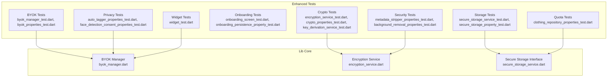

**Diagram sources**
- [byok_manager_test.dart](file://test/byok_manager_test.dart#L1-L1495)
- [byok_properties_test.dart](file://test/byok_properties_test.dart#L1-L848)
- [encryption_service_test.dart](file://test/encryption_service_test.dart#L1-L63)
- [crypto_properties_test.dart](file://test/crypto_properties_test.dart#L1-L97)
- [key_derivation_service_test.dart](file://test/key_derivation_service_test.dart#L1-L88)
- [secure_storage_service_test.dart](file://test/secure_storage_service_test.dart#L1-L147)
- [secure_storage_property_test.dart](file://test/secure_storage_property_test.dart#L1-L26)
- [onboarding_screen_test.dart](file://test/features/onboarding/onboarding_screen_test.dart#L1-L436)
- [onboarding_persistence_property_test.dart](file://test/core/onboarding/onboarding_persistence_property_test.dart#L1-L483)
- [auto_tagger_properties_test.dart](file://test/auto_tagger_properties_test.dart#L1-L174)
- [face_detection_consent_properties_test.dart](file://test/face_detection_consent_properties_test.dart#L1-L151)
- [metadata_stripper_properties_test.dart](file://test/metadata_stripper_properties_test.dart#L1-L129)
- [background_removal_properties_test.dart](file://test/background_removal_properties_test.dart#L1-L125)
- [clothing_repository_properties_test.dart](file://test/core/clothing/clothing_repository_properties_test.dart#L1-L220)
- [widget_test.dart](file://test/widget_test.dart#L1-L31)
- [byok_manager.dart](file://lib/core/byok/byok_manager.dart#L1-L583)
- [encryption_service.dart](file://lib/core/crypto/encryption_service.dart#L1-L75)
- [secure_storage_service.dart](file://lib/core/storage/secure_storage_service.dart#L1-L30)

**Section sources**
- [pubspec.yaml](file://pubspec.yaml#L49-L66)

## Core Components
- BYOK Manager: Orchestrates API key lifecycle, validation, secure storage, and optional cloud backup.
- Encryption Service: AES-GCM encryption/decryption with authentication.
- Key Derivation Service: Platform-aware KDF selection (Argon2id on mobile, PBKDF2 fallback).
- Secure Storage Service: Abstraction over platform-native secure storage with hardware-backed support.
- Privacy Services: Auto-tagging with privacy invariants, consent management, metadata stripping, and background removal.
- Quota Management: Storage quota enforcement for clothing items with comprehensive validation.

**Section sources**
- [byok_manager.dart](file://lib/core/byok/byok_manager.dart#L80-L147)
- [encryption_service.dart](file://lib/core/crypto/encryption_service.dart#L14-L20)
- [secure_storage_service.dart](file://lib/core/storage/secure_storage_service.dart#L10-L29)

## Architecture Overview
The testing architecture emphasizes isolation, composability, and comprehensive property validation:
- Unit tests mock external dependencies (HTTP, storage) to validate internal logic.
- Advanced property-based tests use Glados generators to explore extensive input spaces and edge cases.
- Privacy and security tests validate critical invariants and compliance requirements.
- Integration tests exercise service interactions and platform-specific behaviors.

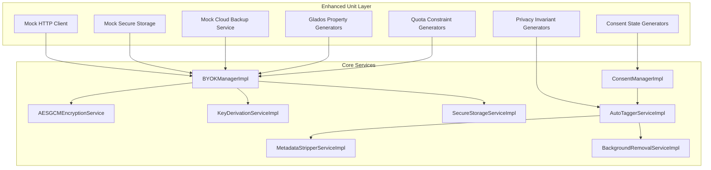

**Diagram sources**
- [byok_manager_test.dart](file://test/byok_manager_test.dart#L29-L220)
- [byok_properties_test.dart](file://test/byok_properties_test.dart#L17-L240)
- [auto_tagger_properties_test.dart](file://test/auto_tagger_properties_test.dart#L14-L91)
- [face_detection_consent_properties_test.dart](file://test/face_detection_consent_properties_test.dart#L7-L131)
- [clothing_repository_properties_test.dart](file://test/core/clothing/clothing_repository_properties_test.dart#L7-L111)
- [byok_manager.dart](file://lib/core/byok/byok_manager.dart#L153-L180)
- [encryption_service.dart](file://lib/core/crypto/encryption_service.dart#L22-L74)
- [secure_storage_service_test.dart](file://test/secure_storage_service_test.dart#L10-L21)

## Detailed Component Analysis

### BYOK Manager: Enhanced Property-Based Testing
- Unit tests validate:
  - API key storage, retrieval, update, and deletion
  - Cloud backup enable/disable and passphrase rotation
  - Error handling for missing keys and storage failures
- **Enhanced** property-based tests now validate:
  - Format and functional validation pipeline with comprehensive edge cases
  - Storage consistency and idempotency across multiple operations
  - HTTP error code handling and network resilience
  - Fail-fast behavior for invalid formats

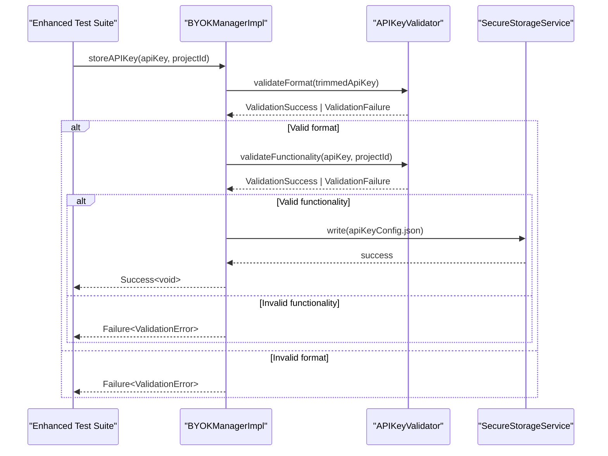

**Diagram sources**
- [byok_manager_test.dart](file://test/byok_manager_test.dart#L267-L502)
- [byok_properties_test.dart](file://test/byok_properties_test.dart#L263-L594)
- [byok_manager.dart](file://lib/core/byok/byok_manager.dart#L182-L231)

**Section sources**
- [byok_manager_test.dart](file://test/byok_manager_test.dart#L267-L800)
- [byok_properties_test.dart](file://test/byok_properties_test.dart#L246-L848)
- [byok_manager.dart](file://lib/core/byok/byok_manager.dart#L80-L147)

### Cloud Backup Service: Serialization and Error Types
- Validates JSON serialization/deserialization of backup blobs
- Ensures strict validation of version and required fields
- Exercises Result type mapping and error categorization

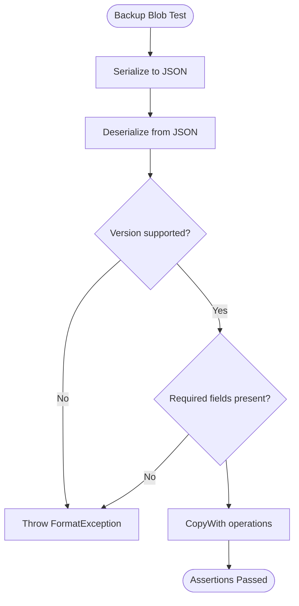

**Diagram sources**
- [cloud_backup_service_test.dart](file://test/cloud_backup_service_test.dart#L14-L292)

**Section sources**
- [cloud_backup_service_test.dart](file://test/cloud_backup_service_test.dart#L1-L371)

### Encryption Service: Round-Trip and Tampering
- Validates AES-GCM round-trip correctness
- Confirms nonce uniqueness and ciphertext differences
- Verifies authentication failures for wrong keys or tampered data

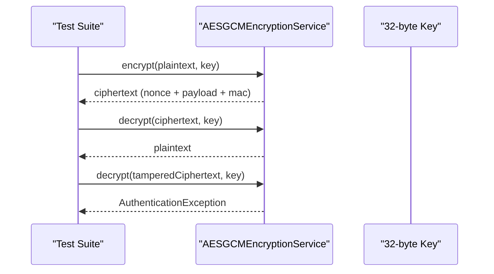

**Diagram sources**
- [encryption_service_test.dart](file://test/encryption_service_test.dart#L15-L61)
- [encryption_service.dart](file://lib/core/crypto/encryption_service.dart#L22-L74)

**Section sources**
- [encryption_service_test.dart](file://test/encryption_service_test.dart#L1-L63)
- [encryption_service.dart](file://lib/core/crypto/encryption_service.dart#L1-L75)

### Key Derivation Service: Platform-Aware Metadata
- Ensures deterministic metadata generation and consistent key derivation
- Validates platform-specific algorithm selection (Argon2id on mobile, PBKDF2 fallback)

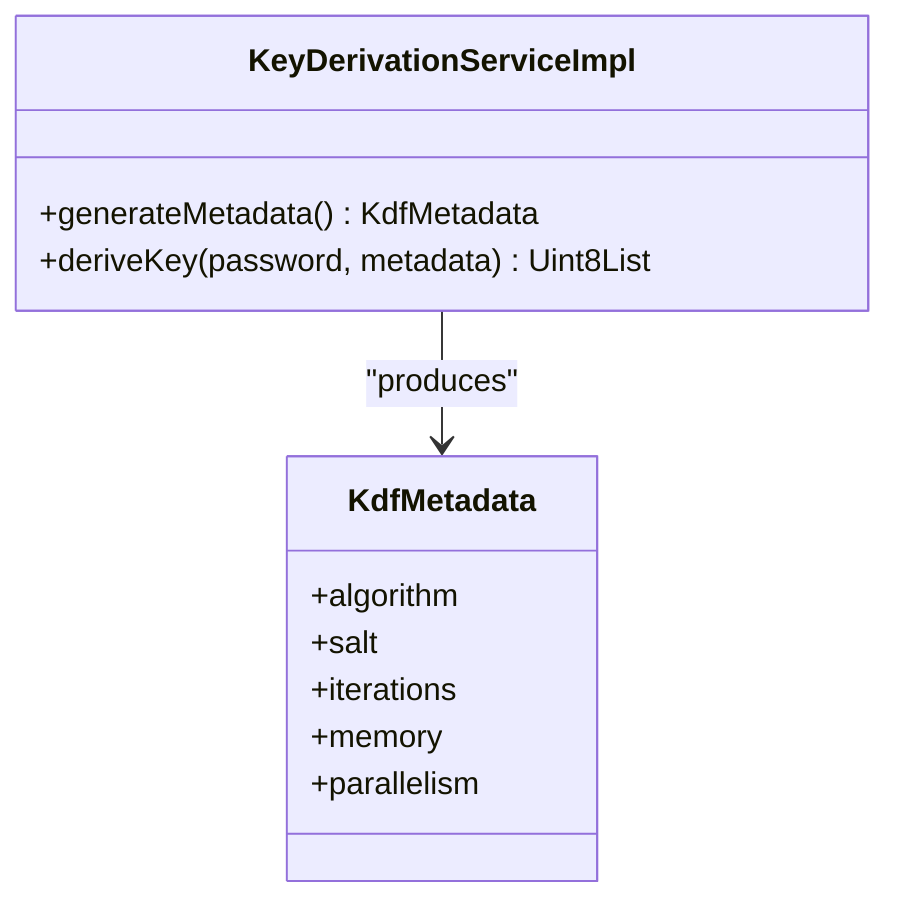

**Diagram sources**
- [key_derivation_service_test.dart](file://test/key_derivation_service_test.dart#L1-L88)

**Section sources**
- [key_derivation_service_test.dart](file://test/key_derivation_service_test.dart#L1-L88)

### Secure Storage Service: Enhanced Mock-Based Isolation
- Uses Mockito to verify method calls and return values
- Validates read/write/delete semantics and null handling
- **Enhanced** property-based testing validates platform-specific backend selection

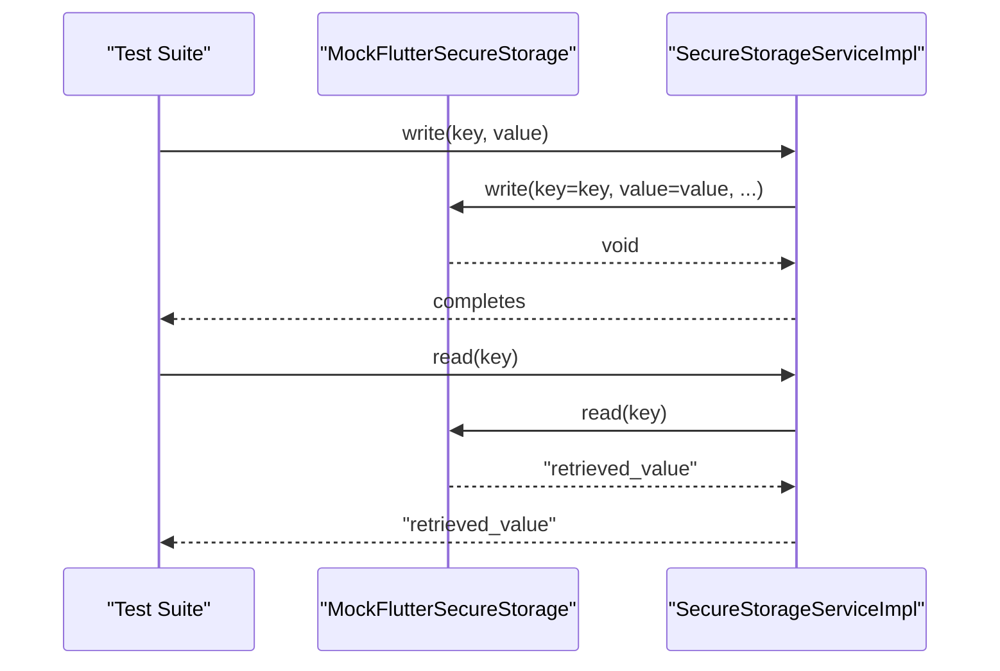

**Diagram sources**
- [secure_storage_service_test.dart](file://test/secure_storage_service_test.dart#L24-L144)

**Section sources**
- [secure_storage_service_test.dart](file://test/secure_storage_service_test.dart#L1-L147)
- [secure_storage_property_test.dart](file://test/secure_storage_property_test.dart#L1-L26)

### Onboarding: Comprehensive Property-Based Testing
- Widget tests verify rendering, navigation, and layout across steps
- **Enhanced** property-based tests validate persistence, idempotency, and state transitions
- Validates complex state machine behavior across multiple controller instances

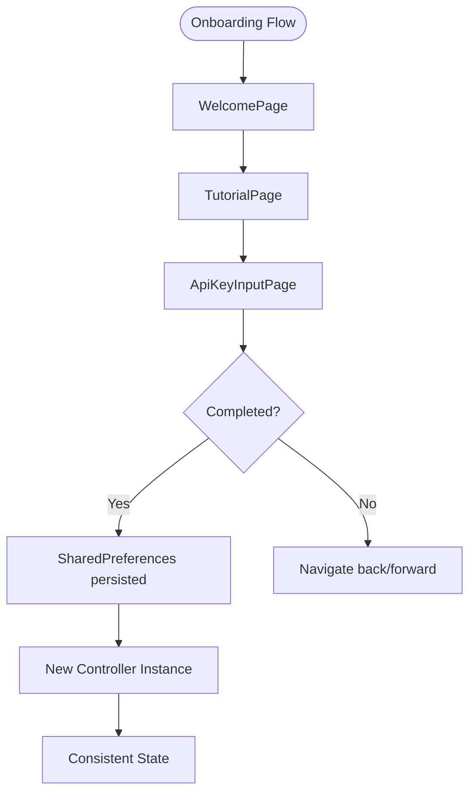

**Diagram sources**
- [onboarding_screen_test.dart](file://test/features/onboarding/onboarding_screen_test.dart#L83-L380)
- [onboarding_persistence_property_test.dart](file://test/core/onboarding/onboarding_persistence_property_test.dart#L78-L343)

**Section sources**
- [onboarding_screen_test.dart](file://test/features/onboarding/onboarding_screen_test.dart#L1-L436)
- [onboarding_persistence_property_test.dart](file://test/core/onboarding/onboarding_persistence_property_test.dart#L1-L483)

## Privacy and Security Property Testing

### Auto-Tagger Privacy Invariants
**New** comprehensive property-based testing validates privacy constraints for automatic clothing tagging:

- **Category validation**: Ensures outputs only contain allowed clothing categories (tops, bottoms, shoes, accessories)
- **Attribute validation**: Confirms colors and seasons are lists of strings
- **Biometric data prevention**: Validates no facial recognition or biometric identifiers in additional attributes
- **Person data protection**: Prevents extraction of human identity or facial features
- **Synthetic image testing**: Validates behavior across various image sizes and compositions

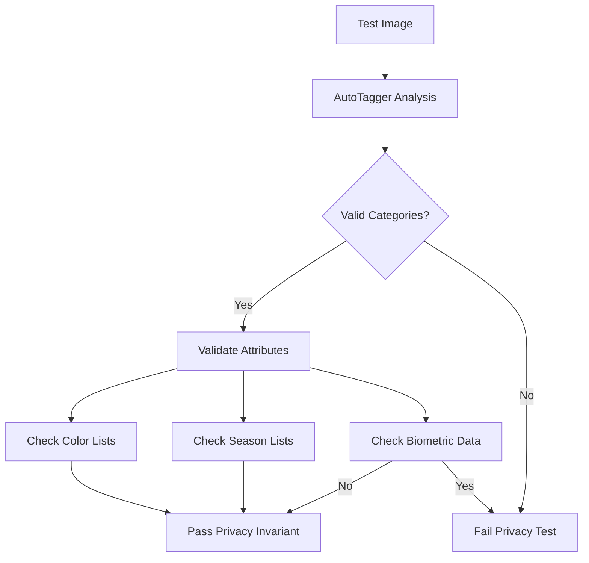

**Diagram sources**
- [auto_tagger_properties_test.dart](file://test/auto_tagger_properties_test.dart#L14-L91)

**Section sources**
- [auto_tagger_properties_test.dart](file://test/auto_tagger_properties_test.dart#L1-L174)

### Face Detection Consent Enforcement
**New** property-based testing ensures proper consent management:

- **UI rendering validation**: Confirms consent dialog displays correct messaging and buttons
- **Action handling**: Validates grant/reject button interactions trigger appropriate callbacks
- **Separate consent tracking**: Ensures face detection consent is distinct from biometric consent
- **State persistence**: Validates consent state survives application restarts
- **Clear operations**: Confirms all consent types can be cleared independently

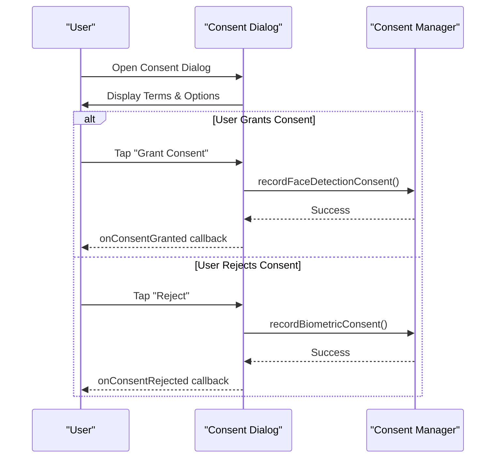

**Diagram sources**
- [face_detection_consent_properties_test.dart](file://test/face_detection_consent_properties_test.dart#L16-L98)

**Section sources**
- [face_detection_consent_properties_test.dart](file://test/face_detection_consent_properties_test.dart#L1-L151)

### Metadata Stripping Privacy Validation
**New** property-based testing validates privacy-preserving image processing:

- **EXIF data removal**: Confirms camera metadata, timestamps, and location data are stripped
- **Pixel data preservation**: Validates original image content remains intact
- **File format compatibility**: Ensures output maintains valid image format
- **Size reduction verification**: Confirms metadata stripping reduces file size
- **Error handling**: Validates graceful degradation for non-image files

**Section sources**
- [metadata_stripper_properties_test.dart](file://test/metadata_stripper_properties_test.dart#L1-L129)

### Background Removal Timeout Validation
**New** property-based testing ensures reliable image processing:

- **Timeout handling**: Validates fallback mechanisms when AI processing exceeds time limits
- **File format support**: Confirms processing works across various image formats
- **Transparency handling**: Validates proper handling of PNG files with alpha channels
- **Invalid input handling**: Confirms robust error handling for corrupted or unsupported files
- **Output validation**: Ensures processed images meet model input requirements (513x513 pixels)

**Section sources**
- [background_removal_properties_test.dart](file://test/background_removal_properties_test.dart#L1-L125)

### Quota Enforcement Validation
**New** comprehensive property-based testing validates storage limits:

- **Item count enforcement**: Confirms quota triggers when item count reaches maximum
- **Byte size enforcement**: Validates quota triggers when storage exceeds maximum bytes
- **Boundary condition testing**: Tests edge cases where itemCount equals or exceeds maxItems
- **CopyWith operation validation**: Ensures quota modifications preserve other properties
- **JSON serialization round-trip**: Validates quota state persistence across application restarts

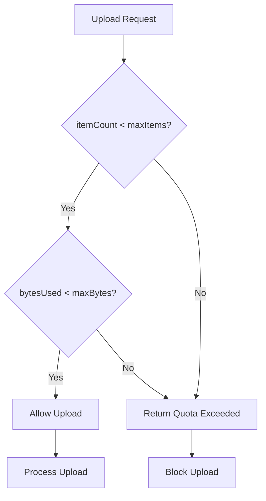

**Diagram sources**
- [clothing_repository_properties_test.dart](file://test/core/clothing/clothing_repository_properties_test.dart#L7-L63)

**Section sources**
- [clothing_repository_properties_test.dart](file://test/core/clothing/clothing_repository_properties_test.dart#L1-L220)

## Dependency Analysis
Testing dependencies are declared in dev_dependencies with enhanced property-based testing support:
- Flutter test harness
- **Enhanced** Glados for advanced property-based testing with custom generators
- Mockito for mocking
- Platform helpers for fake platform detection
- Image processing libraries for privacy validation tests

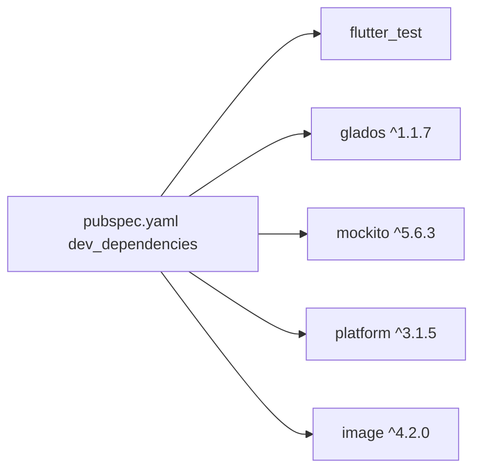

**Diagram sources**
- [pubspec.yaml](file://pubspec.yaml#L53-L66)

**Section sources**
- [pubspec.yaml](file://pubspec.yaml#L53-L66)

## Performance Considerations
- Prefer property-based tests to reduce combinatorial test volume while increasing coverage.
- Use lightweight mocks to avoid expensive I/O in unit tests.
- Keep cryptographic operations deterministic in tests by controlling seeds and metadata.
- **Enhanced** property-based generators should be optimized for quick shrinking and minimal test execution time.
- Privacy validation tests should use synthetic data generation to minimize computational overhead.

## Troubleshooting Guide
Common issues and resolutions:
- Authentication failures during decryption: Expect AuthenticationException when keys or ciphertext are incorrect.
- Storage errors: Wrap exceptions in StorageError and verify error propagation in BYOK operations.
- Platform-specific KDF behavior: Validate algorithm selection for each platform to ensure consistent metadata.
- **Enhanced** Privacy violation detection: Monitor for unexpected biometric data in auto-tagging outputs.
- **Enhanced** Consent management issues: Verify separate tracking of different consent types.
- **Enhanced** Quota enforcement problems: Check boundary conditions where itemCount equals maxItems.

**Section sources**
- [encryption_service_test.dart](file://test/encryption_service_test.dart#L34-L60)
- [byok_manager_test.dart](file://test/byok_manager_test.dart#L289-L327)
- [key_derivation_service_test.dart](file://test/key_derivation_service_test.dart#L62-L85)
- [auto_tagger_properties_test.dart](file://test/auto_tagger_properties_test.dart#L67-L85)
- [face_detection_consent_properties_test.dart](file://test/face_detection_consent_properties_test.dart#L100-L131)
- [clothing_repository_properties_test.dart](file://test/core/clothing/clothing_repository_properties_test.dart#L7-L63)

## Conclusion
StyleSync employs a comprehensive, layered testing strategy with significant enhancements:

- **Enhanced** unit tests isolate core services with sophisticated mocks
- **Advanced** property-based tests with Glados validate security-critical properties, privacy invariants, and quota enforcement across extensive input spaces
- Integration tests verify service interactions and platform-specific behaviors
- **New** privacy and security tests ensure compliance with data protection requirements
- **New** quota enforcement validation protects storage limits and user data integrity
- Widget and persistence tests ensure UX correctness and data continuity

This enhanced approach balances thoroughness with maintainability, focusing on critical paths for security-sensitive components while ensuring comprehensive validation of privacy and compliance requirements.

## Appendices

### Testing Best Practices
- Cryptographic functions
  - Validate round-trip correctness and authentication failures
  - Test with varying key sizes and invalid inputs
  - Ensure exceptions are properly categorized (e.g., AuthenticationException)
- Platform-specific behaviors
  - Use fake platform detection to validate backend selection
  - Confirm fallback algorithms on unsupported platforms
- Cross-platform consistency
  - Normalize inputs (trimming) before validation to avoid platform drift
  - Validate JSON serialization/deserialization for cross-platform data exchange
- **Enhanced** Privacy validation
  - Use property-based testing to generate diverse test scenarios
  - Validate negative cases (presence of prohibited data) alongside positive cases
  - Test boundary conditions and edge cases systematically
- **Enhanced** Quota enforcement
  - Test boundary conditions where limits are exactly met
  - Validate persistence of quota state across application restarts
  - Test copyWith operations preserve quota constraints
- **Enhanced** Consent management
  - Validate separation of different consent types
  - Test state persistence and restoration
  - Validate clear operations for individual consent types

**Section sources**
- [encryption_service_test.dart](file://test/encryption_service_test.dart#L15-L61)
- [key_derivation_service_test.dart](file://test/key_derivation_service_test.dart#L62-L85)
- [byok_properties_test.dart](file://test/byok_properties_test.dart#L778-L786)
- [auto_tagger_properties_test.dart](file://test/auto_tagger_properties_test.dart#L14-L91)
- [face_detection_consent_properties_test.dart](file://test/face_detection_consent_properties_test.dart#L100-L131)
- [clothing_repository_properties_test.dart](file://test/core/clothing/clothing_repository_properties_test.dart#L7-L63)