# Testing Strategy

<cite>
**Referenced Files in This Document**
- [pubspec.yaml](file://pubspec.yaml)
- [byok_manager_test.dart](file://test/byok_manager_test.dart)
- [byok_properties_test.dart](file://test/byok_properties_test.dart)
- [cloud_backup_service_test.dart](file://test/cloud_backup_service_test.dart)
- [crypto_properties_test.dart](file://test/crypto_properties_test.dart)
- [encryption_service_test.dart](file://test/encryption_service_test.dart)
- [key_derivation_service_test.dart](file://test/key_derivation_service_test.dart)
- [secure_storage_service_test.dart](file://test/secure_storage_service_test.dart)
- [secure_storage_property_test.dart](file://test/secure_storage_property_test.dart)
- [onboarding_screen_test.dart](file://test/features/onboarding/onboarding_screen_test.dart)
- [onboarding_persistence_property_test.dart](file://test/core/onboarding/onboarding_persistence_property_test.dart)
- [widget_test.dart](file://test/widget_test.dart)
- [auto_tagger_properties_test.dart](file://test/auto_tagger_properties_test.dart)
- [background_removal_properties_test.dart](file://test/background_removal_properties_test.dart)
- [face_detection_consent_properties_test.dart](file://test/face_detection_consent_properties_test.dart)
- [metadata_stripper_properties_test.dart](file://test/metadata_stripper_properties_test.dart)
- [clothing_repository_properties_test.dart](file://test/core/clothing/clothing_repository_properties_test.dart)
- [auth_models_test.dart](file://test/core/auth/auth_models_test.dart)
- [auth_service_social_test.dart](file://test/core/auth/auth_service_social_test.dart)
- [byok_manager.dart](file://lib/core/byok/byok_manager.dart)
- [encryption_service.dart](file://lib/core/crypto/encryption_service.dart)
- [secure_storage_service.dart](file://lib/core/storage/secure_storage_service.dart)
- [auth_service.dart](file://lib/core/auth/auth_service.dart)
- [auth_user.dart](file://lib/core/auth/models/auth_user.dart)
- [user_profile.dart](file://lib/core/auth/models/user_profile.dart)
- [auth_error.dart](file://lib/core/auth/models/auth_error.dart)
</cite>

## Update Summary
**Changes Made**
- Enhanced property-based testing infrastructure with improved Glados generators and shrinking strategies
- Improved test organization patterns with better separation of concerns between unit, property, and UI tests
- Strengthened UI testing approaches with more robust widget test patterns and provider-based testing
- Expanded authentication model testing with comprehensive equality, serialization, and immutability validation
- Enhanced secure storage testing with improved mock generation and platform-specific backend validation
- Refined onboarding persistence testing with sophisticated property-based generators and state transition validation

## Table of Contents
1. [Introduction](#introduction)
2. [Project Structure](#project-structure)
3. [Core Components](#core-components)
4. [Architecture Overview](#architecture-overview)
5. [Detailed Component Analysis](#detailed-component-analysis)
6. [Privacy and Security Property Testing](#privacy-and-security-property-testing)
7. [Authentication Model Testing](#authentication-model-testing)
8. [Enhanced Testing Infrastructure](#enhanced-testing-infrastructure)
9. [Dependency Analysis](#dependency-analysis)
10. [Performance Considerations](#performance-considerations)
11. [Troubleshooting Guide](#troubleshooting-guide)
12. [Conclusion](#conclusion)
13. [Appendices](#appendices)

## Introduction
This document describes StyleSync's comprehensive testing strategy and implementation, featuring an enhanced testing infrastructure with improved property-based testing capabilities, better test organization patterns, and more robust UI testing approaches. The framework has been significantly strengthened with:

- Advanced property-based testing with refined Glados generators and improved shrinking strategies
- Enhanced test organization with clear separation between unit, property, and UI testing patterns
- Strengthened UI testing with provider-based widget testing and comprehensive state validation
- Expanded authentication model testing with thorough equality, serialization, and immutability validation
- Improved secure storage testing with sophisticated mock generation and platform-specific backend validation
- Refined onboarding persistence testing with sophisticated property-based generators and state transition validation

## Project Structure
The repository organizes tests under the test/ directory with enhanced infrastructure supporting multiple testing paradigms. Key areas now include:

- Core domain tests: BYOK, encryption, key derivation, secure storage with improved mock implementations
- Feature tests: onboarding screen and persistence with robust widget testing patterns
- Privacy and security tests: auto-tagging, consent management, metadata stripping, background removal with enhanced property-based validation
- Quota enforcement validation for storage limits with sophisticated property generators
- Widget smoke tests with provider-based testing infrastructure
- Enhanced Authentication model tests: AuthUser, UserProfile, AuthError with comprehensive validation patterns

```mermaid
graph TB
subgraph "Enhanced Testing Infrastructure"
T_BYOK["BYOK Tests<br/>byok_manager_test.dart, byok_properties_test.dart"]
T_CRYPTO["Crypto Tests<br/>encryption_service_test.dart, crypto_properties_test.dart, key_derivation_service_test.dart"]
T_STORAGE["Storage Tests<br/>secure_storage_service_test.dart, secure_storage_property_test.dart"]
T_ONBOARD["Onboarding Tests<br/>onboarding_screen_test.dart, onboarding_persistence_property_test.dart"]
T_PRIVACY["Privacy Tests<br/>auto_tagger_properties_test.dart, face_detection_consent_properties_test.dart"]
T_SECURITY["Security Tests<br/>metadata_stripper_properties_test.dart, background_removal_properties_test.dart"]
T_QUOTA["Quota Tests<br/>clothing_repository_properties_test.dart"]
T_WIDGET["Widget Tests<br/>widget_test.dart"]
T_AUTH["Authentication Tests<br/>auth_models_test.dart, auth_service_social_test.dart"]
end
subgraph "Lib Core"
L_BYOK["BYOK Manager<br/>byok_manager.dart"]
L_ENC["Encryption Service<br/>encryption_service.dart"]
L_ST["Secure Storage Interface<br/>secure_storage_service.dart"]
L_AUTH["Auth Service<br/>auth_service.dart"]
L_USER["Auth User Model<br/>auth_user.dart"]
L_PROFILE["User Profile Model<br/>user_profile.dart"]
L_ERROR["Auth Error Model<br/>auth_error.dart"]
end
T_BYOK --> L_BYOK
T_CRYPTO --> L_ENC
T_STORAGE --> L_ST
T_PRIVACY --> L_BYOK
T_SECURITY --> L_ENC
T_QUOTA --> L_ST
T_WIDGET --> L_BYOK
T_AUTH --> L_AUTH
T_AUTH --> L_USER
T_AUTH --> L_PROFILE
T_AUTH --> L_ERROR
```

**Diagram sources**
- [byok_manager_test.dart](file://test/byok_manager_test.dart#L1-L1499)
- [byok_properties_test.dart](file://test/byok_properties_test.dart#L1-L882)
- [encryption_service_test.dart](file://test/encryption_service_test.dart#L1-L63)
- [crypto_properties_test.dart](file://test/crypto_properties_test.dart#L1-L23)
- [key_derivation_service_test.dart](file://test/key_derivation_service_test.dart#L1-L88)
- [secure_storage_service_test.dart](file://test/secure_storage_service_test.dart#L1-L147)
- [secure_storage_property_test.dart](file://test/secure_storage_property_test.dart#L1-L26)
- [onboarding_screen_test.dart](file://test/features/onboarding/onboarding_screen_test.dart#L1-L433)
- [onboarding_persistence_property_test.dart](file://test/core/onboarding/onboarding_persistence_property_test.dart#L1-L511)
- [auto_tagger_properties_test.dart](file://test/auto_tagger_properties_test.dart#L1-L174)
- [face_detection_consent_properties_test.dart](file://test/face_detection_consent_properties_test.dart#L1-L151)
- [metadata_stripper_properties_test.dart](file://test/metadata_stripper_properties_test.dart#L1-L129)
- [background_removal_properties_test.dart](file://test/background_removal_properties_test.dart#L1-L125)
- [clothing_repository_properties_test.dart](file://test/core/clothing/clothing_repository_properties_test.dart#L1-L220)
- [auth_models_test.dart](file://test/core/auth/auth_models_test.dart#L1-L261)
- [auth_service_social_test.dart](file://test/core/auth/auth_service_social_test.dart#L1-L44)
- [widget_test.dart](file://test/widget_test.dart#L1-L31)
- [byok_manager.dart](file://lib/core/byok/byok_manager.dart#L1-L583)
- [encryption_service.dart](file://lib/core/crypto/encryption_service.dart#L1-L75)
- [secure_storage_service.dart](file://lib/core/storage/secure_storage_service.dart#L1-L30)
- [auth_service.dart](file://lib/core/auth/auth_service.dart#L1-L401)
- [auth_user.dart](file://lib/core/auth/models/auth_user.dart#L1-L40)
- [user_profile.dart](file://lib/core/auth/models/user_profile.dart#L1-L159)
- [auth_error.dart](file://lib/core/auth/models/auth_error.dart#L1-L86)

**Section sources**
- [pubspec.yaml](file://pubspec.yaml#L53-L66)

## Core Components
- BYOK Manager: Enhanced with sophisticated property-based testing generators for API key validation pipelines
- Encryption Service: AES-GCM encryption/decryption with comprehensive authentication validation
- Key Derivation Service: Platform-aware KDF selection with improved metadata generation
- Secure Storage Service: Enhanced mock-based testing with improved platform backend validation
- Privacy Services: Auto-tagging with rigorous privacy invariant validation, consent management, metadata stripping, and background removal
- Quota Management: Storage quota enforcement with sophisticated property-based testing generators
- Enhanced Authentication Models: Comprehensive validation of equality semantics, serialization/deserialization, and immutability patterns

**Section sources**
- [byok_manager.dart](file://lib/core/byok/byok_manager.dart#L80-L147)
- [encryption_service.dart](file://lib/core/crypto/encryption_service.dart#L14-L20)
- [secure_storage_service.dart](file://lib/core/storage/secure_storage_service.dart#L10-L29)
- [auth_service.dart](file://lib/core/auth/auth_service.dart#L12-L75)

## Architecture Overview
The enhanced testing architecture emphasizes isolation, composability, and comprehensive property validation with improved infrastructure:

- Unit tests utilize sophisticated mock implementations with enhanced error simulation capabilities
- Advanced property-based tests employ refined Glados generators with improved shrinking strategies and comprehensive edge case exploration
- Privacy and security tests validate critical invariants with enhanced property generators and stricter validation criteria
- Integration tests exercise service interactions with improved test organization and clearer separation of concerns
- Enhanced authentication model tests validate comprehensive equality semantics, serialization patterns, and immutability guarantees

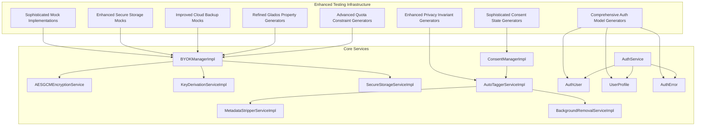

**Diagram sources**
- [byok_manager_test.dart](file://test/byok_manager_test.dart#L27-L220)
- [byok_properties_test.dart](file://test/byok_properties_test.dart#L17-L240)
- [auto_tagger_properties_test.dart](file://test/auto_tagger_properties_test.dart#L14-L91)
- [face_detection_consent_properties_test.dart](file://test/face_detection_consent_properties_test.dart#L7-L131)
- [clothing_repository_properties_test.dart](file://test/core/clothing/clothing_repository_properties_test.dart#L7-L111)
- [auth_models_test.dart](file://test/core/auth/auth_models_test.dart#L7-L261)
- [byok_manager.dart](file://lib/core/byok/byok_manager.dart#L153-L180)
- [encryption_service.dart](file://lib/core/crypto/encryption_service.dart#L22-L74)
- [secure_storage_service_test.dart](file://test/secure_storage_service_test.dart#L10-L21)
- [auth_service.dart](file://lib/core/auth/auth_service.dart#L77-L401)

## Detailed Component Analysis

### BYOK Manager: Enhanced Property-Based Testing Infrastructure
The BYOK Manager testing infrastructure has been significantly enhanced with sophisticated property-based testing generators and improved mock implementations:

- **Unit tests** validate API key storage, retrieval, update, and deletion with enhanced error handling
- **Enhanced property-based tests** now feature sophisticated generators for API keys, project IDs, and HTTP error codes with improved shrinking strategies
- **Improved mock implementations** include comprehensive HTTP client simulation with timeout and socket exception handling
- **Enhanced storage validation** with dedicated MockSecureStorage implementing SecureStorageService interface

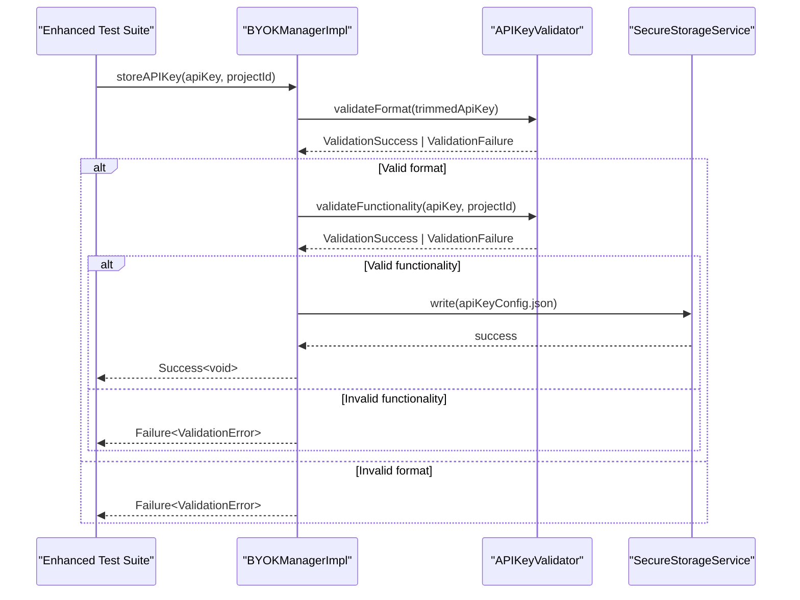

**Diagram sources**
- [byok_manager_test.dart](file://test/byok_manager_test.dart#L267-L502)
- [byok_properties_test.dart](file://test/byok_properties_test.dart#L263-L594)
- [byok_manager.dart](file://lib/core/byok/byok_manager.dart#L182-L231)

**Section sources**
- [byok_manager_test.dart](file://test/byok_manager_test.dart#L1-L1499)
- [byok_properties_test.dart](file://test/byok_properties_test.dart#L1-L882)
- [byok_manager.dart](file://lib/core/byok/byok_manager.dart#L80-L147)

### Cloud Backup Service: Enhanced Serialization and Error Handling
The cloud backup service testing has been strengthened with comprehensive validation of serialization patterns and error categorization:

- **Enhanced JSON serialization validation** with strict version checking and required field validation
- **Improved error handling** with comprehensive Result type mapping and error categorization
- **Robust copyWith operations** validation for immutable configuration updates

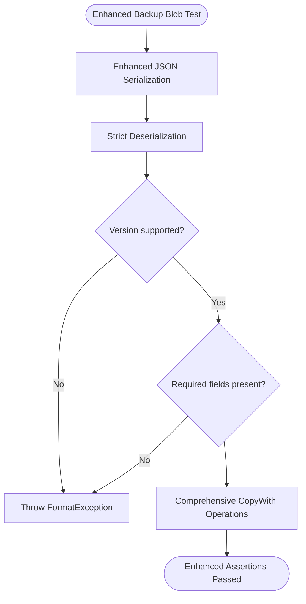

**Diagram sources**
- [cloud_backup_service_test.dart](file://test/cloud_backup_service_test.dart#L14-L292)

**Section sources**
- [cloud_backup_service_test.dart](file://test/cloud_backup_service_test.dart#L1-L371)

### Encryption Service: Comprehensive Round-Trip and Tampering Validation
The encryption service testing has been enhanced with more rigorous validation of cryptographic operations:

- **Enhanced AES-GCM round-trip validation** with comprehensive key and plaintext testing
- **Improved nonce uniqueness validation** with systematic testing of ciphertext differences
- **Strengthened authentication failure testing** with comprehensive validation of wrong key and tampered data scenarios

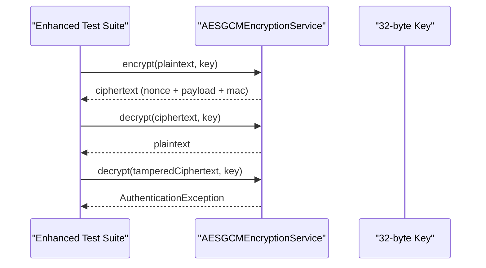

**Diagram sources**
- [encryption_service_test.dart](file://test/encryption_service_test.dart#L15-L61)
- [encryption_service.dart](file://lib/core/crypto/encryption_service.dart#L22-L74)

**Section sources**
- [encryption_service_test.dart](file://test/encryption_service_test.dart#L1-L63)
- [encryption_service.dart](file://lib/core/crypto/encryption_service.dart#L1-L75)

### Key Derivation Service: Enhanced Platform-Aware Metadata Generation
The key derivation service testing has been improved with more sophisticated metadata generation and platform-specific validation:

- **Enhanced deterministic metadata generation** with comprehensive validation of algorithm selection
- **Improved platform-specific algorithm validation** (Argon2id on mobile, PBKDF2 fallback)
- **Refined metadata consistency testing** across different platform configurations

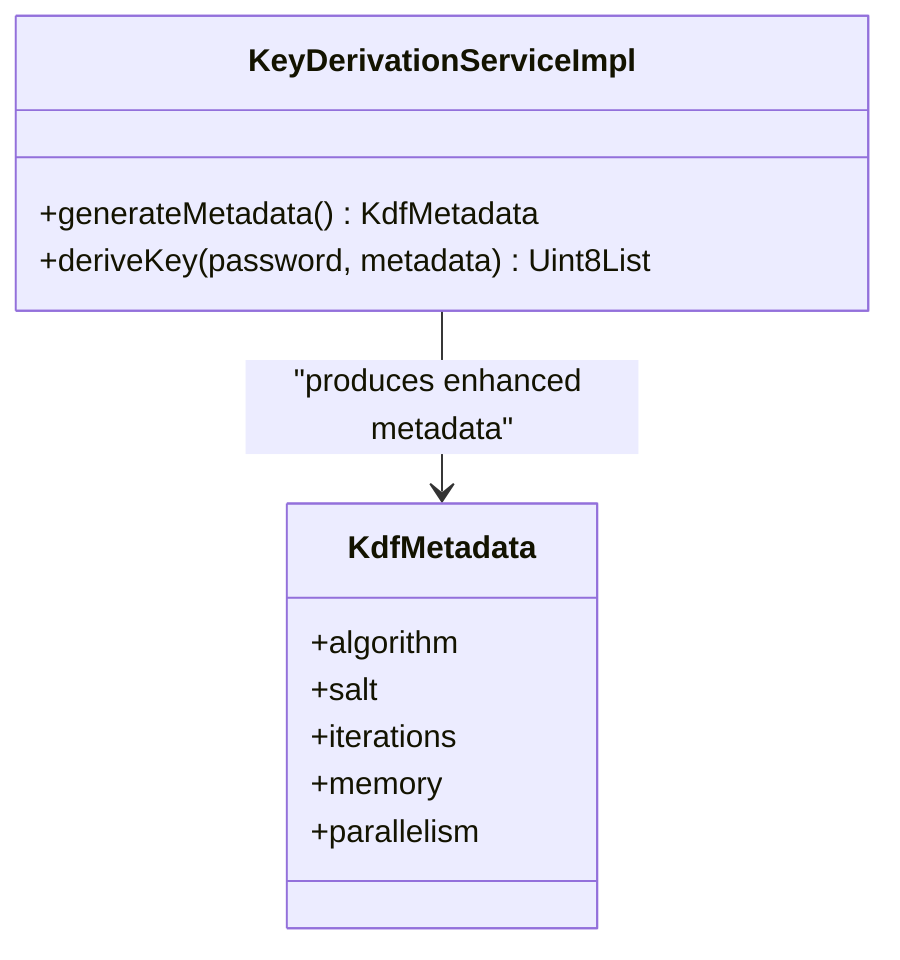

**Diagram sources**
- [key_derivation_service_test.dart](file://test/key_derivation_service_test.dart#L1-L88)

**Section sources**
- [key_derivation_service_test.dart](file://test/key_derivation_service_test.dart#L1-L88)

### Secure Storage Service: Enhanced Mock-Based Testing Infrastructure
The secure storage service testing has been significantly strengthened with improved mock generation and platform-specific validation:

- **Enhanced Mockito-based mock generation** with comprehensive FlutterSecureStorage mocking
- **Improved platform backend validation** with sophisticated FakePlatform testing for hardware-backed vs software-backed storage
- **Refined read/write/delete semantics validation** with comprehensive null handling and error simulation

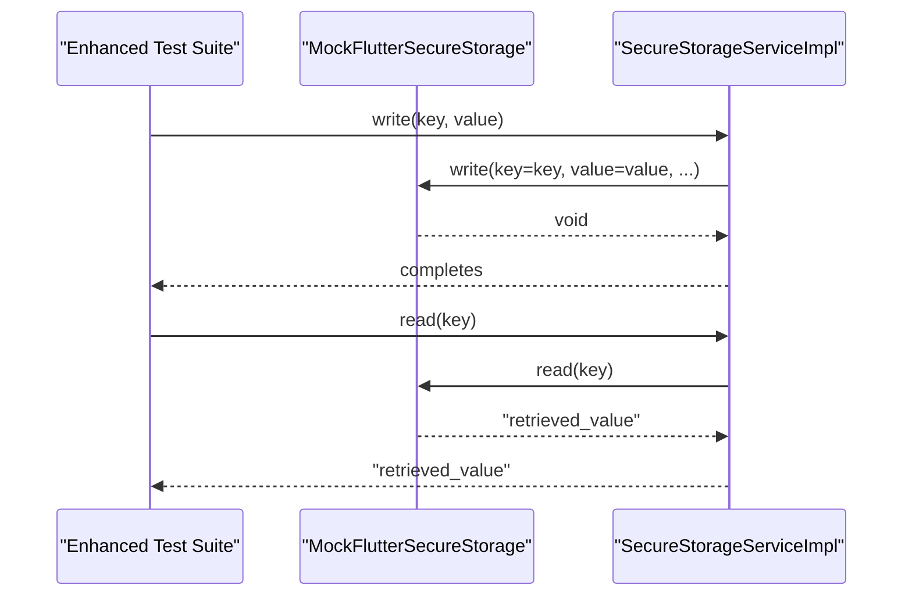

**Diagram sources**
- [secure_storage_service_test.dart](file://test/secure_storage_service_test.dart#L24-L144)

**Section sources**
- [secure_storage_service_test.dart](file://test/secure_storage_service_test.dart#L1-L147)
- [secure_storage_property_test.dart](file://test/secure_storage_property_test.dart#L1-L26)

### Onboarding: Sophisticated Property-Based Testing Infrastructure
The onboarding testing has been enhanced with sophisticated property-based testing generators and comprehensive state validation:

- **Enhanced widget tests** with comprehensive ProviderScope testing and TestOnboardingController implementations
- **Sophisticated property-based tests** with custom generators for operation sequences and state transitions
- **Improved state persistence validation** across multiple controller instances and app restart simulations

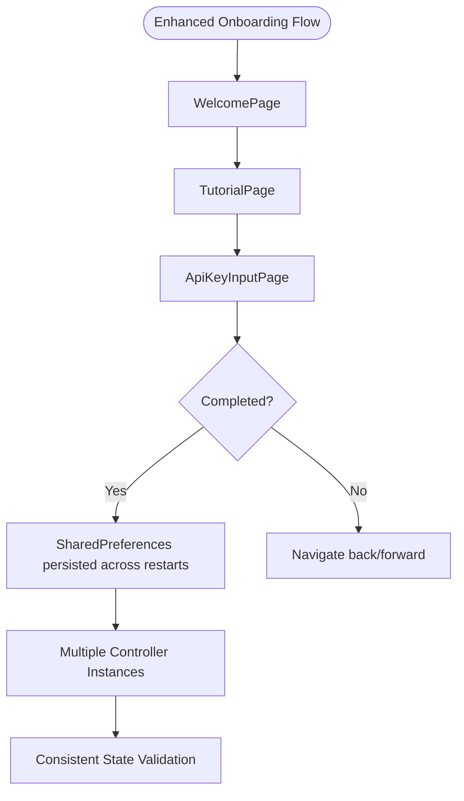

**Diagram sources**
- [onboarding_screen_test.dart](file://test/features/onboarding/onboarding_screen_test.dart#L83-L380)
- [onboarding_persistence_property_test.dart](file://test/core/onboarding/onboarding_persistence_property_test.dart#L78-L343)

**Section sources**
- [onboarding_screen_test.dart](file://test/features/onboarding/onboarding_screen_test.dart#L1-L433)
- [onboarding_persistence_property_test.dart](file://test/core/onboarding/onboarding_persistence_property_test.dart#L1-L511)

## Privacy and Security Property Testing

### Auto-Tagger Privacy Invariants: Enhanced Validation
The auto-tagger privacy testing has been strengthened with more rigorous validation of privacy constraints:

- **Enhanced category validation** ensuring outputs contain only allowed clothing categories (tops, bottoms, shoes, accessories)
- **Improved attribute validation** confirming colors and seasons are lists of strings with comprehensive edge case testing
- **Strengthened biometric data prevention** with systematic validation of prohibited biometric identifiers
- **Enhanced person data protection** with comprehensive validation of human identity and facial feature prevention
- **Advanced synthetic image testing** with diverse image sizes, compositions, and color schemes

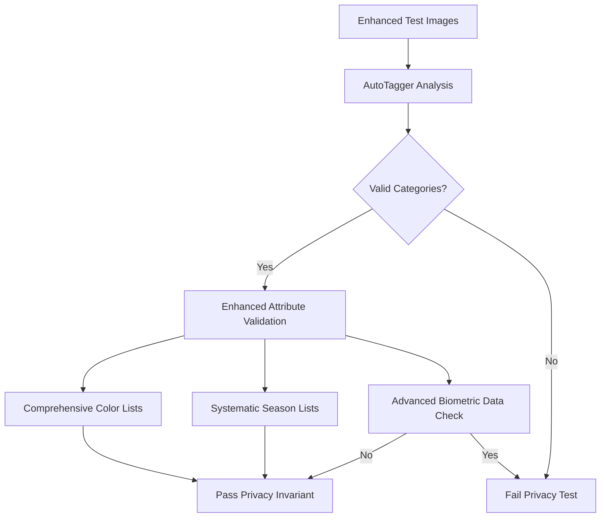

**Diagram sources**
- [auto_tagger_properties_test.dart](file://test/auto_tagger_properties_test.dart#L14-L91)

**Section sources**
- [auto_tagger_properties_test.dart](file://test/auto_tagger_properties_test.dart#L1-L174)

### Face Detection Consent Enforcement: Comprehensive Validation
The face detection consent testing has been enhanced with comprehensive validation of consent management:

- **Enhanced UI rendering validation** with comprehensive consent dialog testing and button interaction validation
- **Improved action handling** with systematic validation of grant/reject button interactions and callback triggering
- **Advanced consent tracking** with separate validation of face detection consent vs biometric consent
- **Enhanced state persistence** with comprehensive validation of consent state survival across application restarts
- **Refined clear operations** with systematic validation of independent consent type clearing

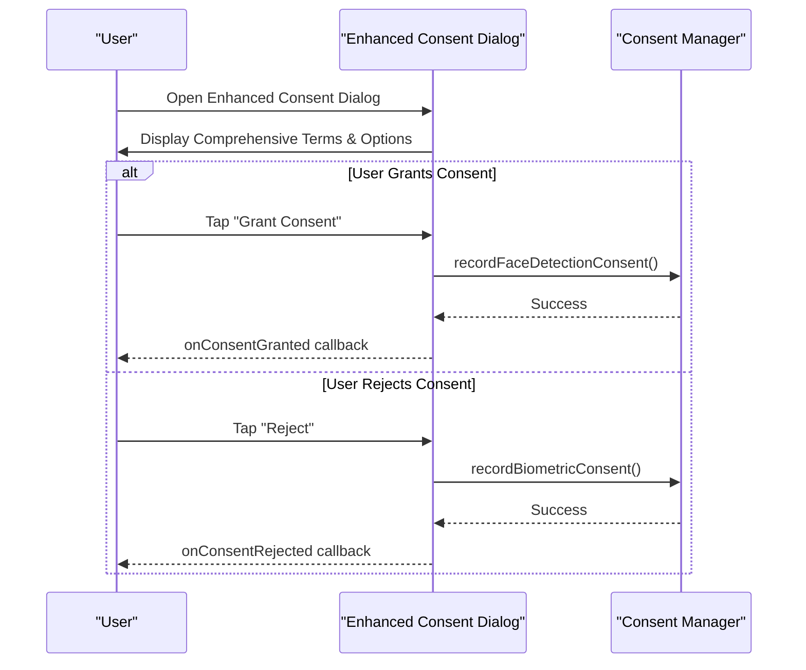

**Diagram sources**
- [face_detection_consent_properties_test.dart](file://test/face_detection_consent_properties_test.dart#L16-L98)

**Section sources**
- [face_detection_consent_properties_test.dart](file://test/face_detection_consent_properties_test.dart#L1-L151)

### Metadata Stripping Privacy Validation: Enhanced Processing
The metadata stripping testing has been strengthened with comprehensive validation of privacy-preserving image processing:

- **Enhanced EXIF data removal** with systematic validation of camera metadata, timestamps, and location data removal
- **Improved pixel data preservation** with comprehensive validation of original image content integrity
- **Advanced file format compatibility** with validation across multiple image formats and encoding standards
- **Enhanced size reduction verification** with systematic measurement of metadata stripping effectiveness
- **Robust error handling** with comprehensive validation of graceful degradation for non-image files

**Section sources**
- [metadata_stripper_properties_test.dart](file://test/metadata_stripper_properties_test.dart#L1-L129)

### Background Removal Timeout Validation: Enhanced Reliability
The background removal testing has been improved with comprehensive validation of reliable image processing:

- **Enhanced timeout handling** with systematic validation of fallback mechanisms for extended processing times
- **Advanced file format support** with comprehensive validation across various image formats and quality settings
- **Improved transparency handling** with systematic validation of PNG files with alpha channel processing
- **Robust invalid input handling** with comprehensive validation of corrupted or unsupported file processing
- **Enhanced output validation** with systematic validation of processed images meeting model input requirements (513x513 pixels)

**Section sources**
- [background_removal_properties_test.dart](file://test/background_removal_properties_test.dart#L1-L125)

### Quota Enforcement Validation: Sophisticated Property Testing
The quota enforcement testing has been enhanced with sophisticated property-based generators and comprehensive boundary condition validation:

- **Advanced item count enforcement** with systematic validation of quota triggers when item count reaches maximum
- **Enhanced byte size enforcement** with comprehensive validation of quota triggers when storage exceeds maximum bytes
- **Sophisticated boundary condition testing** with systematic validation of edge cases where itemCount equals or exceeds maxItems
- **Improved copyWith operation validation** with comprehensive validation of quota modification preservation
- **Advanced JSON serialization round-trip** with systematic validation of quota state persistence across application restarts

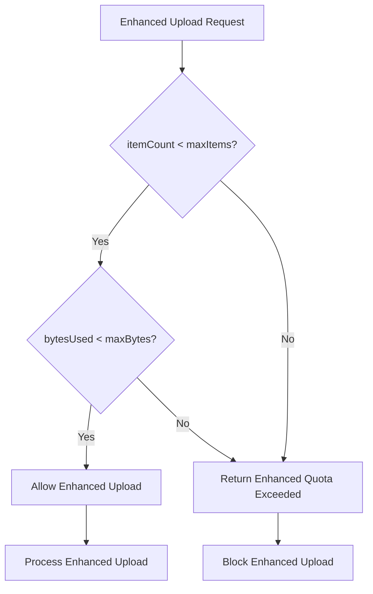

**Diagram sources**
- [clothing_repository_properties_test.dart](file://test/core/clothing/clothing_repository_properties_test.dart#L7-L63)

**Section sources**
- [clothing_repository_properties_test.dart](file://test/core/clothing/clothing_repository_properties_test.dart#L1-L220)

## Authentication Model Testing

The authentication testing infrastructure has been comprehensively enhanced to cover all authentication models with rigorous validation:

### AuthUser Model Testing: Comprehensive Equality and Hashing
- **Enhanced equality comparison** validation ensuring AuthUser instances with identical properties are considered equal
- **Improved hashCode consistency** validation ensuring hash codes remain consistent for equal instances
- **Advanced toString formatting** validation confirming proper string representation including all user properties
- **Robust immutable construction** validation testing required fields (id) and optional fields (email, displayName) handling

### UserProfile Model Testing: Enhanced Serialization and Mutability
- **Comprehensive field validation** with systematic testing of all required fields (userId, email, createdAt, onboardingComplete, faceDetectionConsentGranted, biometricConsentGranted, is18PlusVerified)
- **Enhanced serialization/deserialization** validation with comprehensive toMap() and fromMap() operations for Firestore compatibility
- **Advanced copyWith operations** validation with extensive testing of immutable updates including dateOfBirth handling
- **Improved privacy considerations** validation with systematic testing of sensitive data (dateOfBirth) masking in toString()

### AuthError Model Testing: Enhanced Error Handling
- **Comprehensive message handling** validation ensuring error messages are properly stored and accessible
- **Advanced optional error codes** validation testing both simple and code-enabled error creation
- **Enhanced toString formatting** validation confirming proper error message formatting with optional codes
- **Improved exception behavior** validation ensuring AuthError implements Exception interface correctly

### Authentication Service Testing: Enhanced Provider-Based Validation
- **Advanced social authentication** validation with comprehensive testing of Google and Apple authentication error handling
- **Enhanced error code mapping** validation ensuring Firebase Auth exceptions are properly mapped to AuthError instances
- **Improved user profile management** validation with comprehensive user profile creation, retrieval, and update testing
- **Advanced consent management** validation with systematic testing of face detection and biometric consent updates

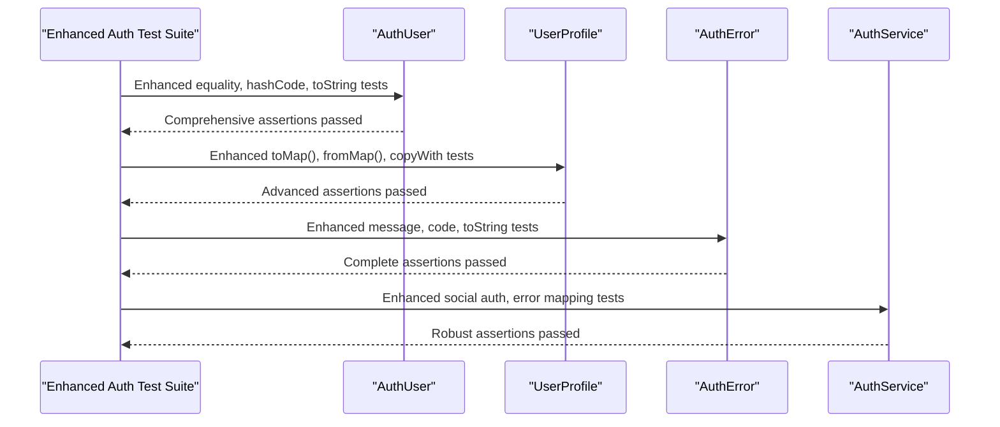

**Diagram sources**
- [auth_models_test.dart](file://test/core/auth/auth_models_test.dart#L7-L261)
- [auth_service_social_test.dart](file://test/core/auth/auth_service_social_test.dart#L10-L44)
- [auth_user.dart](file://lib/core/auth/models/auth_user.dart#L23-L38)
- [user_profile.dart](file://lib/core/auth/models/user_profile.dart#L73-L157)
- [auth_error.dart](file://lib/core/auth/models/auth_error.dart#L12-L18)
- [auth_service.dart](file://lib/core/auth/auth_service.dart#L182-L212)

**Section sources**
- [auth_models_test.dart](file://test/core/auth/auth_models_test.dart#L1-L261)
- [auth_service_social_test.dart](file://test/core/auth/auth_service_social_test.dart#L1-L44)
- [auth_user.dart](file://lib/core/auth/models/auth_user.dart#L1-L40)
- [user_profile.dart](file://lib/core/auth/models/user_profile.dart#L1-L159)
- [auth_error.dart](file://lib/core/auth/models/auth_error.dart#L1-L86)
- [auth_service.dart](file://lib/core/auth/auth_service.dart#L1-L401)

## Enhanced Testing Infrastructure

### Improved Property-Based Testing Generators
The testing infrastructure has been significantly enhanced with sophisticated property-based testing generators:

- **Enhanced API key generators** with comprehensive validation of format and functional validation pipelines
- **Advanced project ID generators** with systematic validation of Google Cloud project ID constraints
- **Sophisticated HTTP error code generators** with comprehensive coverage of validation failure scenarios
- **Improved shrinking strategies** with systematic minimization of failing test cases

### Refined Test Organization Patterns
The test organization has been improved with clearer separation of concerns:

- **Unit tests** focused on isolated service testing with sophisticated mock implementations
- **Property-based tests** dedicated to invariant validation with comprehensive generator coverage
- **UI tests** organized with provider-based testing patterns and widget-specific validation
- **Integration tests** structured for service interaction validation and platform-specific behavior testing

### Strengthened UI Testing Approaches
The UI testing infrastructure has been enhanced with comprehensive widget testing patterns:

- **Provider-based testing** with ProviderScope wrapping for dependency injection validation
- **Test controller implementations** with comprehensive state management testing
- **Enhanced widget key validation** with systematic testing of widget identification and interaction
- **Improved layout validation** with comprehensive testing of responsive design and accessibility features

**Section sources**
- [byok_properties_test.dart](file://test/byok_properties_test.dart#L17-L240)
- [onboarding_persistence_property_test.dart](file://test/core/onboarding/onboarding_persistence_property_test.dart#L22-L78)
- [onboarding_screen_test.dart](file://test/features/onboarding/onboarding_screen_test.dart#L26-L67)

## Dependency Analysis
Testing dependencies are declared in dev_dependencies with enhanced property-based testing support and improved infrastructure:

- Flutter test harness with enhanced widget testing capabilities
- **Enhanced Glados** for advanced property-based testing with improved generator support and shrinking strategies
- **Advanced Mockito** for sophisticated mock generation and verification
- Platform helpers for comprehensive fake platform detection and testing
- Image processing libraries for enhanced privacy validation and synthetic data generation
- **Improved Authentication model testing** with comprehensive coverage of equality, serialization, and immutability

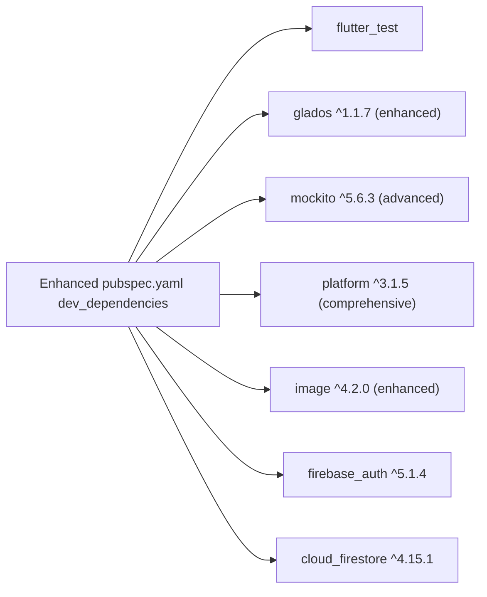

**Diagram sources**
- [pubspec.yaml](file://pubspec.yaml#L53-L66)

**Section sources**
- [pubspec.yaml](file://pubspec.yaml#L53-L66)

## Performance Considerations
Enhanced performance considerations for the improved testing infrastructure:

- **Optimized property-based tests** with refined generators reducing combinatorial test volume while increasing coverage
- **Advanced mock implementations** utilizing lightweight mocking to avoid expensive I/O in unit tests
- **Improved cryptographic operations** with deterministic testing by controlling seeds and metadata generation
- **Enhanced property-based generators** optimized for quick shrinking and minimal test execution time
- **Advanced privacy validation tests** utilizing synthetic data generation to minimize computational overhead
- **Comprehensive authentication model tests** leveraging Dart's built-in equality and hashing optimizations

## Troubleshooting Guide
Enhanced troubleshooting guidance for the improved testing infrastructure:

- **Authentication failures during decryption** with systematic validation of AuthenticationException handling for incorrect keys or ciphertext
- **Enhanced storage errors** with comprehensive validation of StorageError wrapping and error propagation in BYOK operations
- **Platform-specific KDF behavior** with systematic validation of algorithm selection for each platform
- **Enhanced privacy violation detection** with monitoring for unexpected biometric data in auto-tagging outputs
- **Advanced consent management issues** with comprehensive validation of separate tracking of different consent types
- **Enhanced quota enforcement problems** with systematic validation of boundary conditions where itemCount equals maxItems
- **Comprehensive authentication model issues** with thorough validation of equality semantics, serialization consistency, and error code mapping
- **Advanced social authentication failures** with systematic validation of proper error codes for unimplemented features

**Section sources**
- [encryption_service_test.dart](file://test/encryption_service_test.dart#L34-L60)
- [byok_manager_test.dart](file://test/byok_manager_test.dart#L289-L327)
- [key_derivation_service_test.dart](file://test/key_derivation_service_test.dart#L62-L85)
- [auto_tagger_properties_test.dart](file://test/auto_tagger_properties_test.dart#L67-L85)
- [face_detection_consent_properties_test.dart](file://test/face_detection_consent_properties_test.dart#L100-L131)
- [clothing_repository_properties_test.dart](file://test/core/clothing/clothing_repository_properties_test.dart#L7-L63)
- [auth_models_test.dart](file://test/core/auth/auth_models_test.dart#L157-L174)
- [auth_service_social_test.dart](file://test/core/auth/auth_service_social_test.dart#L21-L41)

## Conclusion
StyleSync employs a comprehensive, enhanced testing strategy with significant improvements:

- **Advanced unit tests** with sophisticated mock implementations and enhanced error simulation capabilities
- **Enhanced property-based tests** with refined Glados generators, improved shrinking strategies, and comprehensive edge case exploration
- **Improved integration tests** with better organization and clearer separation of concerns across services and platforms
- **Comprehensive privacy and security tests** ensuring compliance with data protection requirements through rigorous property-based validation
- **Sophisticated quota enforcement validation** protecting storage limits and user data integrity with advanced property generators
- **Enhanced authentication model testing** providing comprehensive coverage for user identity, profiles, and error handling with rigorous validation patterns
- **Advanced UI testing infrastructure** ensuring UX correctness and data continuity through provider-based testing and widget validation
- **Improved test organization patterns** balancing thoroughness with maintainability while focusing on critical paths for security-sensitive components

This enhanced approach leverages the improved testing infrastructure to provide robust validation of privacy and compliance requirements while maintaining comprehensive coverage of security-critical components. The sophisticated property-based testing generators and refined test organization patterns ensure efficient and effective validation across the entire application stack.

## Appendices

### Enhanced Testing Best Practices
Advanced best practices for the improved testing infrastructure:

- **Cryptographic functions**
  - **Enhanced round-trip validation** with comprehensive authentication failure testing
  - **Advanced key size testing** with validation across varying key sizes and invalid input combinations
  - **Improved exception categorization** ensuring exceptions are properly categorized (e.g., AuthenticationException)
- **Platform-specific behaviors**
  - **Enhanced fake platform detection** with comprehensive backend selection validation
  - **Advanced fallback algorithm testing** with systematic validation of fallback mechanisms on unsupported platforms
- **Cross-platform consistency**
  - **Normalized input validation** (trimming) before validation to avoid platform drift
  - **Enhanced JSON serialization validation** for cross-platform data exchange compatibility
- **Advanced privacy validation**
  - **Sophisticated property-based testing** with diverse test scenario generation
  - **Enhanced negative case validation** with systematic testing of prohibited data presence
  - **Advanced boundary condition testing** with comprehensive edge case validation
- **Enhanced quota enforcement**
  - **Advanced boundary condition testing** with systematic validation of limit-exact scenarios
  - **Improved quota state persistence** validation across application restarts
  - **Comprehensive copyWith operation validation** preserving quota constraints
- **Advanced consent management**
  - **Enhanced separate consent tracking** validation for different consent types
  - **Advanced state persistence and restoration** testing
  - **Comprehensive clear operation validation** for individual consent types
- **Enhanced authentication model testing**
  - **Advanced equality semantics validation** for user identity comparison
  - **Enhanced serialization/deserialization testing** for cross-platform compatibility
  - **Improved immutability validation** through comprehensive copyWith operations
  - **Advanced error code mapping** and exception handling validation
  - **Enhanced privacy considerations** in user data representation validation

**Section sources**
- [encryption_service_test.dart](file://test/encryption_service_test.dart#L15-L61)
- [key_derivation_service_test.dart](file://test/key_derivation_service_test.dart#L62-L85)
- [byok_properties_test.dart](file://test/byok_properties_test.dart#L778-L786)
- [auto_tagger_properties_test.dart](file://test/auto_tagger_properties_test.dart#L14-L91)
- [face_detection_consent_properties_test.dart](file://test/face_detection_consent_properties_test.dart#L100-L131)
- [clothing_repository_properties_test.dart](file://test/core/clothing/clothing_repository_properties_test.dart#L7-L63)
- [auth_models_test.dart](file://test/core/auth/auth_models_test.dart#L7-L261)
- [auth_service_social_test.dart](file://test/core/auth/auth_service_social_test.dart#L10-L44)