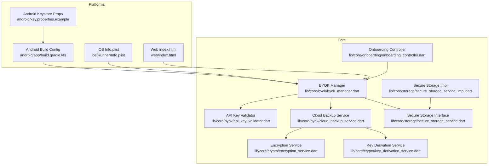
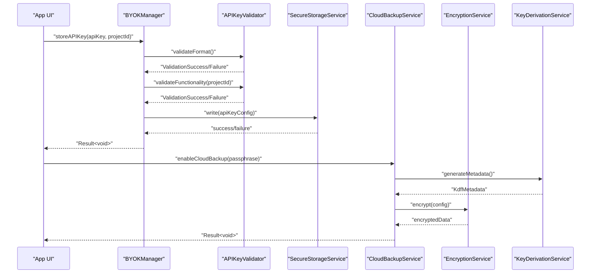
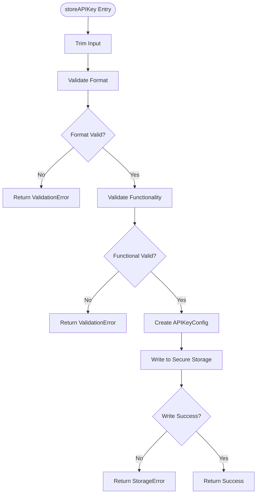
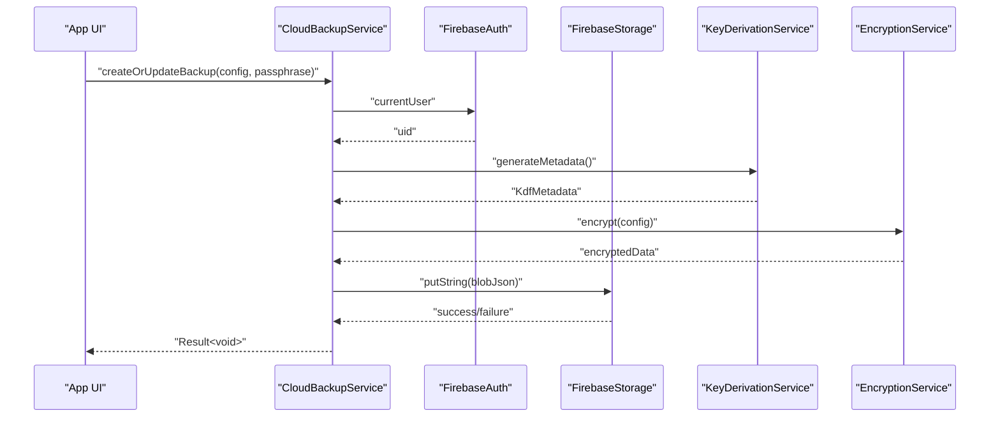
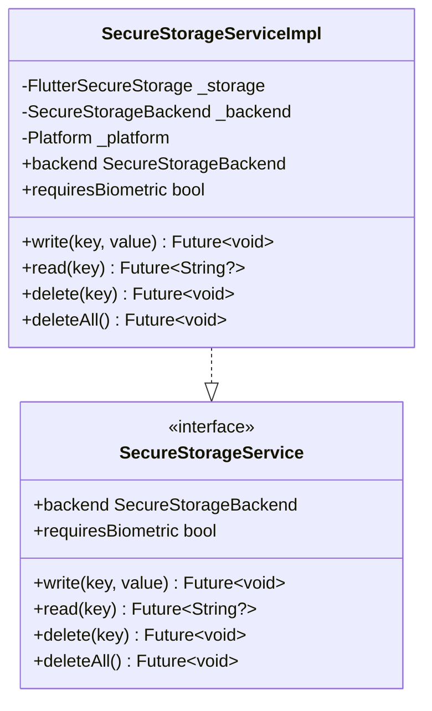
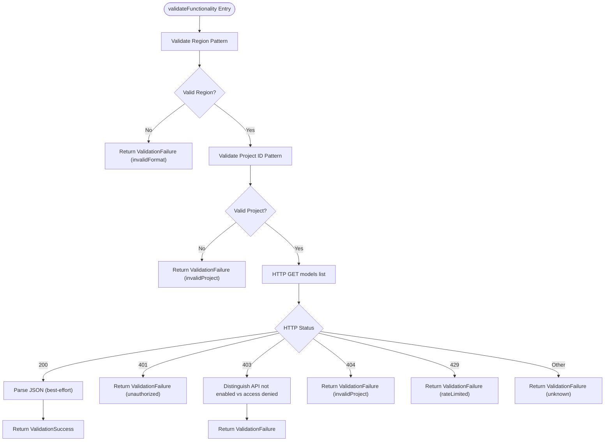
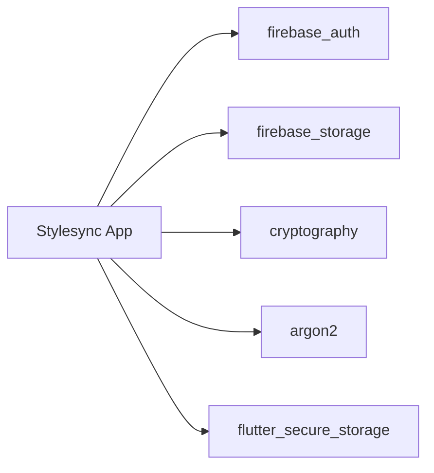

# Troubleshooting and FAQ

<cite>
**Referenced Files in This Document**
- [README.md](file://README.md)
- [pubspec.yaml](file://pubspec.yaml)
- [lib/core/byok/byok_manager.dart](file://lib/core/byok/byok_manager.dart)
- [lib/core/byok/api_key_validator.dart](file://lib/core/byok/api_key_validator.dart)
- [lib/core/byok/cloud_backup_service.dart](file://lib/core/byok/cloud_backup_service.dart)
- [lib/core/byok/byok_storage_keys.dart](file://lib/core/byok/byok_storage_keys.dart)
- [lib/core/byok/models/byok_error.dart](file://lib/core/byok/models/byok_error.dart)
- [lib/core/byok/models/api_key_config.dart](file://lib/core/byok/models/api_key_config.dart)
- [lib/core/crypto/encryption_service.dart](file://lib/core/crypto/encryption_service.dart)
- [lib/core/crypto/key_derivation_service.dart](file://lib/core/crypto/key_derivation_service.dart)
- [lib/core/storage/secure_storage_service.dart](file://lib/core/storage/secure_storage_service.dart)
- [lib/core/storage/secure_storage_service_impl.dart](file://lib/core/storage/secure_storage_service_impl.dart)
- [lib/core/onboarding/onboarding_controller.dart](file://lib/core/onboarding/onboarding_controller.dart)
- [android/app/build.gradle.kts](file://android/app/build.gradle.kts)
- [android/key.properties.example](file://android/key.properties.example)
- [ios/Runner/Info.plist](file://ios/Runner/Info.plist)
- [web/index.html](file://web/index.html)
</cite>

## Table of Contents
1. [Introduction](#introduction)
2. [Project Structure](#project-structure)
3. [Core Components](#core-components)
4. [Architecture Overview](#architecture-overview)
5. [Detailed Component Analysis](#detailed-component-analysis)
6. [Dependency Analysis](#dependency-analysis)
7. [Performance Considerations](#performance-considerations)
8. [Troubleshooting Guide](#troubleshooting-guide)
9. [FAQ](#faq)
10. [Conclusion](#conclusion)

## Introduction
This document provides comprehensive troubleshooting and FAQ guidance for StyleSync. It focuses on diagnosing and resolving build failures, dependency resolution issues, platform-specific configuration errors, and security-related problems such as encryption failures, storage access issues, and hardware-backed storage concerns. It also covers platform-specific diagnostics for Android Keystore, iOS Keychain, and web storage limitations, along with performance optimization, memory management, debugging strategies, and diagnostic procedures for API key validation failures, cloud backup sync issues, and onboarding flow problems.

## Project Structure
The repository follows a Flutter-based modular structure with platform-specific configurations and cross-platform Dart libraries. Key areas relevant to troubleshooting include:
- Core security and storage abstractions under lib/core
- Platform-specific secure storage implementations
- BYOK (Bring-Your-Own-Key) management for API keys and cloud backup
- Crypto primitives for encryption and key derivation
- Onboarding state management
- Android/iOS/web platform configuration files

**Diagram sources**
- [lib/core/byok/byok_manager.dart](file://lib/core/byok/byok_manager.dart#L153-L582)
- [lib/core/byok/api_key_validator.dart](file://lib/core/byok/api_key_validator.dart#L53-L321)
- [lib/core/byok/cloud_backup_service.dart](file://lib/core/byok/cloud_backup_service.dart#L97-L91)
- [lib/core/crypto/encryption_service.dart](file://lib/core/crypto/encryption_service.dart#L22-L74)
- [lib/core/crypto/key_derivation_service.dart](file://lib/core/crypto/key_derivation_service.dart#L17-L117)
- [lib/core/storage/secure_storage_service.dart](file://lib/core/storage/secure_storage_service.dart#L11-L29)
- [lib/core/storage/secure_storage_service_impl.dart](file://lib/core/storage/secure_storage_service_impl.dart#L7-L104)
- [lib/core/onboarding/onboarding_controller.dart](file://lib/core/onboarding/onboarding_controller.dart#L17-L46)
- [android/app/build.gradle.kts](file://android/app/build.gradle.kts#L11-L66)
- [android/key.properties.example](file://android/key.properties.example#L1-L5)
- [ios/Runner/Info.plist](file://ios/Runner/Info.plist#L1-L50)
- [web/index.html](file://web/index.html#L1-L40)

**Section sources**
- [README.md](file://README.md#L1-L22)
- [pubspec.yaml](file://pubspec.yaml#L30-L47)

## Core Components
This section highlights the core components involved in troubleshooting and their roles:
- BYOK Manager: Orchestrates API key lifecycle, validation, secure storage, and cloud backup operations.
- API Key Validator: Performs format and functional validation against Vertex AI endpoints.
- Cloud Backup Service: Manages encrypted cloud backups using Firebase Storage and client-side encryption.
- Secure Storage Service: Provides platform-native secure storage abstraction with hardware-backed fallback.
- Encryption and KDF Services: Implement AES-GCM encryption and Argon2/PBKDF2 key derivation.
- Onboarding Controller: Manages onboarding state persistence.

**Section sources**
- [lib/core/byok/byok_manager.dart](file://lib/core/byok/byok_manager.dart#L84-L147)
- [lib/core/byok/api_key_validator.dart](file://lib/core/byok/api_key_validator.dart#L14-L48)
- [lib/core/byok/cloud_backup_service.dart](file://lib/core/byok/cloud_backup_service.dart#L21-L91)
- [lib/core/storage/secure_storage_service.dart](file://lib/core/storage/secure_storage_service.dart#L11-L29)
- [lib/core/crypto/encryption_service.dart](file://lib/core/crypto/encryption_service.dart#L14-L20)
- [lib/core/crypto/key_derivation_service.dart](file://lib/core/crypto/key_derivation_service.dart#L9-L15)
- [lib/core/onboarding/onboarding_controller.dart](file://lib/core/onboarding/onboarding_controller.dart#L17-L46)

## Architecture Overview
The system integrates platform-specific secure storage, client-side encryption, and cloud backup with Firebase. The following diagram maps the key interactions:

**Diagram sources**
- [lib/core/byok/byok_manager.dart](file://lib/core/byok/byok_manager.dart#L182-L231)
- [lib/core/byok/api_key_validator.dart](file://lib/core/byok/api_key_validator.dart#L152-L224)
- [lib/core/byok/cloud_backup_service.dart](file://lib/core/byok/cloud_backup_service.dart#L166-L249)
- [lib/core/crypto/encryption_service.dart](file://lib/core/crypto/encryption_service.dart#L22-L74)
- [lib/core/crypto/key_derivation_service.dart](file://lib/core/crypto/key_derivation_service.dart#L35-L53)

## Detailed Component Analysis

### BYOK Manager Operations
The BYOK Manager coordinates API key lifecycle operations with robust error handling and logging. It supports:
- Storing validated API keys
- Retrieving stored configurations
- Deleting keys and optional cloud backups
- Updating keys and re-encrypting cloud backups
- Enabling/disabling cloud backup
- Restoring from cloud backup
- Checking presence of stored keys and cloud backup status
- Rotating backup passphrases

**Diagram sources**
- [lib/core/byok/byok_manager.dart](file://lib/core/byok/byok_manager.dart#L182-L231)

**Section sources**
- [lib/core/byok/byok_manager.dart](file://lib/core/byok/byok_manager.dart#L84-L147)
- [lib/core/byok/byok_manager.dart](file://lib/core/byok/byok_manager.dart#L182-L384)

### Cloud Backup Service Operations
The Cloud Backup Service manages encrypted backups with passphrase-based KDF and AES-GCM encryption. It supports:
- Creating/updating backups
- Restoring backups
- Deleting backups
- Checking existence
- Verifying passphrases
- Rotating passphrases with a temporary backup strategy

**Diagram sources**
- [lib/core/byok/cloud_backup_service.dart](file://lib/core/byok/cloud_backup_service.dart#L166-L249)
- [lib/core/crypto/encryption_service.dart](file://lib/core/crypto/encryption_service.dart#L22-L74)
- [lib/core/crypto/key_derivation_service.dart](file://lib/core/crypto/key_derivation_service.dart#L35-L53)

**Section sources**
- [lib/core/byok/cloud_backup_service.dart](file://lib/core/byok/cloud_backup_service.dart#L21-L91)
- [lib/core/byok/cloud_backup_service.dart](file://lib/core/byok/cloud_backup_service.dart#L166-L555)

### Secure Storage Service Implementation
Secure storage is abstracted behind a platform-specific implementation:
- Android: Uses hardware-backed storage via Keystore (AES-GCM).
- iOS: Uses Keychain with Secure Enclave accessibility.
- Other platforms: Falls back to software-backed storage.

**Diagram sources**
- [lib/core/storage/secure_storage_service.dart](file://lib/core/storage/secure_storage_service.dart#L11-L29)
- [lib/core/storage/secure_storage_service_impl.dart](file://lib/core/storage/secure_storage_service_impl.dart#L7-L104)

**Section sources**
- [lib/core/storage/secure_storage_service.dart](file://lib/core/storage/secure_storage_service.dart#L1-L30)
- [lib/core/storage/secure_storage_service_impl.dart](file://lib/core/storage/secure_storage_service_impl.dart#L33-L73)

### API Key Validation Workflow
The API key validator performs format checks and functional tests against Vertex AI endpoints, handling timeouts, network errors, and HTTP status codes.

**Diagram sources**
- [lib/core/byok/api_key_validator.dart](file://lib/core/byok/api_key_validator.dart#L152-L272)

**Section sources**
- [lib/core/byok/api_key_validator.dart](file://lib/core/byok/api_key_validator.dart#L14-L48)
- [lib/core/byok/api_key_validator.dart](file://lib/core/byok/api_key_validator.dart#L152-L321)

## Dependency Analysis
External dependencies relevant to troubleshooting include Firebase, cryptography, and platform-specific secure storage.

**Diagram sources**
- [pubspec.yaml](file://pubspec.yaml#L34-L46)

**Section sources**
- [pubspec.yaml](file://pubspec.yaml#L30-L47)

## Performance Considerations
- Key derivation parameters differ by platform:
  - Mobile/desktop (non-web): Argon2id with moderate iterations and memory for interactive UX.
  - Web: PBKDF2 with higher iteration counts to increase cost.
- Encryption uses AES-GCM with automatic nonce generation.
- Cloud backup operations involve network I/O; consider retry/backoff strategies and minimize unnecessary re-encryptions.
- Secure storage operations are asynchronous; avoid blocking UI threads.

[No sources needed since this section provides general guidance]

## Troubleshooting Guide

### Build Failures
Common causes and resolutions:
- Flutter SDK and dependencies
  - Ensure Flutter SDK meets the required version.
  - Run dependency installation to resolve missing packages.
- Android Gradle configuration
  - Verify Java/Kotlin compatibility settings.
  - Confirm keystore properties exist and are correctly loaded.
- iOS Info.plist
  - Validate bundle identifiers and supported orientations.
- Web base href
  - Ensure base href is set appropriately for hosting paths.

Resolution steps:
- Confirm Flutter SDK version and reinstall dependencies.
- Check Gradle JVM args, parallelization, and caching settings.
- Validate Android keystore properties and signing configs.
- Review iOS Info.plist keys and entitlements.
- Verify web index.html base href and manifest link.

**Section sources**
- [README.md](file://README.md#L3-L21)
- [android/app/build.gradle.kts](file://android/app/build.gradle.kts#L22-L29)
- [android/app/build.gradle.kts](file://android/app/build.gradle.kts#L42-L61)
- [android/key.properties.example](file://android/key.properties.example#L1-L5)
- [ios/Runner/Info.plist](file://ios/Runner/Info.plist#L1-L50)
- [web/index.html](file://web/index.html#L17-L17)

### Dependency Resolution Problems
Symptoms:
- Pub get failures or version conflicts.
- Missing native plugin linkage.

Resolutions:
- Upgrade or downgrade dependencies to compatible versions.
- Clean caches and regenerate lockfiles.
- Ensure platform-specific plugins are initialized.

**Section sources**
- [pubspec.yaml](file://pubspec.yaml#L30-L47)

### Platform-Specific Configuration Errors
- Android
  - Keystore misconfiguration leads to signing failures.
  - Missing key.properties disables release signing.
- iOS
  - Incorrect bundle identifiers or missing entitlements cause provisioning/profile issues.
- Web
  - Incorrect base href or missing manifest links break PWA features.

Actions:
- Populate key.properties with correct keystore credentials.
- Validate iOS bundle identifiers and provisioning profiles.
- Set base href in web/index.html to match hosting path.

**Section sources**
- [android/key.properties.example](file://android/key.properties.example#L1-L5)
- [android/app/build.gradle.kts](file://android/app/build.gradle.kts#L16-L48)
- [ios/Runner/Info.plist](file://ios/Runner/Info.plist#L11-L24)
- [web/index.html](file://web/index.html#L17-L17)

### Security-Related Troubleshooting

#### Encryption Failures
Symptoms:
- Authentication exceptions during decryption.
- Wrong passphrase or corrupted ciphertext.

Diagnosis:
- Inspect decryption path for MAC verification failures.
- Verify passphrase correctness and ciphertext integrity.

Resolutions:
- Ensure correct passphrase is used for decryption.
- Re-create backup if corruption is detected.

**Section sources**
- [lib/core/crypto/encryption_service.dart](file://lib/core/crypto/encryption_service.dart#L68-L72)
- [lib/core/byok/cloud_backup_service.dart](file://lib/core/byok/cloud_backup_service.dart#L275-L287)

#### Storage Access Issues
Symptoms:
- Unable to read/write secure storage.
- Fallback to software-backed storage.

Diagnosis:
- Check platform-specific initialization logs.
- Verify backend selection and initialization success.

Resolutions:
- Retry initialization; fallback to software-backed storage is expected on unsupported devices.

**Section sources**
- [lib/core/storage/secure_storage_service_impl.dart](file://lib/core/storage/secure_storage_service_impl.dart#L33-L73)
- [lib/core/storage/secure_storage_service.dart](file://lib/core/storage/secure_storage_service.dart#L2-L8)

#### Hardware-Backed Storage Problems
Symptoms:
- Device policy resets storage.
- Biometric prompts required but not configured.

Diagnosis:
- Confirm device supports hardware-backed storage.
- Check reset-on-error and accessibility settings.

Resolutions:
- Adjust platform options and ensure user unlocks device before access.
- Implement explicit biometric prompts if required.

**Section sources**
- [lib/core/storage/secure_storage_service_impl.dart](file://lib/core/storage/secure_storage_service_impl.dart#L37-L62)
- [lib/core/storage/secure_storage_service.dart](file://lib/core/storage/secure_storage_service.dart#L24-L28)

### Platform-Specific Problem Diagnosis

#### Android Keystore Issues
Symptoms:
- Release builds fail to sign.
- Keystore properties missing.

Diagnosis:
- Verify key.properties file presence and values.
- Confirm signingConfigs and buildTypes.

Resolutions:
- Provide storeFile, storePassword, keyAlias, keyPassword.
- Use debug signing for development if release keystore is unavailable.

**Section sources**
- [android/key.properties.example](file://android/key.properties.example#L1-L5)
- [android/app/build.gradle.kts](file://android/app/build.gradle.kts#L16-L61)

#### iOS Keychain Access Problems
Symptoms:
- Keychain access denied or device passcode required.

Diagnosis:
- Check Info.plist keys and accessibility options.
- Confirm user has unlocked device.

Resolutions:
- Adjust Keychain accessibility settings.
- Prompt user to unlock device before accessing secure storage.

**Section sources**
- [ios/Runner/Info.plist](file://ios/Runner/Info.plist#L1-L50)
- [lib/core/storage/secure_storage_service_impl.dart](file://lib/core/storage/secure_storage_service_impl.dart#L50-L57)

#### Web Storage Limitations
Symptoms:
- IndexedDB or local storage not available.
- PWA features missing.

Diagnosis:
- Verify base href and manifest link.
- Check browser support for secure storage APIs.

Resolutions:
- Set correct base href for hosted paths.
- Inform users about storage limitations on web.

**Section sources**
- [web/index.html](file://web/index.html#L17-L34)

### Performance Optimization and Memory Management
- Use Argon2id on mobile/desktop for balanced cost; PBKDF2 on web for higher cost.
- Avoid frequent re-encryption; batch operations when possible.
- Monitor network retries and backoff for cloud backup operations.
- Minimize synchronous operations on UI thread; leverage async storage.

**Section sources**
- [lib/core/crypto/key_derivation_service.dart](file://lib/core/crypto/key_derivation_service.dart#L35-L52)
- [lib/core/byok/cloud_backup_service.dart](file://lib/core/byok/cloud_backup_service.dart#L166-L249)

### Debugging Strategies
- Enable logging in BYOK Manager and Cloud Backup Service.
- Inspect error enums and messages for precise failure classification.
- Use structured error handling to differentiate network, storage, and crypto errors.

**Section sources**
- [lib/core/byok/byok_manager.dart](file://lib/core/byok/byok_manager.dart#L16-L17)
- [lib/core/byok/models/byok_error.dart](file://lib/core/byok/models/byok_error.dart#L7-L15)
- [lib/core/byok/cloud_backup_service.dart](file://lib/core/byok/cloud_backup_service.dart#L139-L164)

### Diagnostic Procedures

#### API Key Validation Failures
- Validate region and project ID patterns.
- Test connectivity and handle timeouts/network errors.
- Distinguish unauthorized vs API-not-enabled vs rate-limited.

**Section sources**
- [lib/core/byok/api_key_validator.dart](file://lib/core/byok/api_key_validator.dart#L152-L272)

#### Cloud Backup Sync Issues
- Check authentication state before backup/restore.
- Verify passphrase correctness and blob integrity.
- Handle network errors and retry operations.

**Section sources**
- [lib/core/byok/cloud_backup_service.dart](file://lib/core/byok/cloud_backup_service.dart#L166-L249)
- [lib/core/byok/cloud_backup_service.dart](file://lib/core/byok/cloud_backup_service.dart#L251-L317)

#### Onboarding Flow Problems
- Ensure onboarding state is persisted and retrieved reliably.
- Reset onboarding state for testing or user-initiated re-run.

**Section sources**
- [lib/core/onboarding/onboarding_controller.dart](file://lib/core/onboarding/onboarding_controller.dart#L17-L46)

## FAQ

### Security Features
- How does the app protect API keys?
  - Keys are stored in platform-native secure storage with hardware-backed protection on supported devices. Cloud backups are encrypted client-side with passphrase-derived keys.

- What encryption is used?
  - AES-GCM with 256-bit keys for symmetric encryption. Key derivation uses Argon2id on mobile/desktop and PBKDF2 on web.

- How is passphrase rotation handled?
  - The service rotates passphrases using a temporary backup to ensure atomicity and recovery safety.

**Section sources**
- [lib/core/byok/cloud_backup_service.dart](file://lib/core/byok/cloud_backup_service.dart#L413-L555)
- [lib/core/crypto/encryption_service.dart](file://lib/core/crypto/encryption_service.dart#L22-L74)
- [lib/core/crypto/key_derivation_service.dart](file://lib/core/crypto/key_derivation_service.dart#L35-L52)

### Platform Compatibility
- Which platforms are supported?
  - Android (Keystore), iOS (Keychain), and web. Desktop targets are present in the repository structure.

- What happens on unsupported devices?
  - The implementation falls back to software-backed storage.

**Section sources**
- [lib/core/storage/secure_storage_service_impl.dart](file://lib/core/storage/secure_storage_service_impl.dart#L58-L72)

### Deployment Considerations
- What are the prerequisites?
  - Flutter SDK version and compatible Dart SDK. Android Gradle settings optimized for performance.

- How do I configure signing for Android?
  - Provide keystore properties and ensure signingConfigs are correctly set.

**Section sources**
- [README.md](file://README.md#L3-L21)
- [android/app/build.gradle.kts](file://android/app/build.gradle.kts#L16-L61)

### Common Issues and Solutions
- Build fails due to missing dependencies:
  - Run dependency installation and verify pubspec.yaml versions.

- Cloud backup fails:
  - Check authentication, passphrase, and network connectivity.

- API key validation fails:
  - Verify region/project ID format and network access.

**Section sources**
- [pubspec.yaml](file://pubspec.yaml#L30-L47)
- [lib/core/byok/cloud_backup_service.dart](file://lib/core/byok/cloud_backup_service.dart#L166-L249)
- [lib/core/byok/api_key_validator.dart](file://lib/core/byok/api_key_validator.dart#L152-L272)

## Conclusion
This guide consolidates troubleshooting and FAQ topics for StyleSync, focusing on build, dependency, platform-specific, and security-related issues. By following the diagnostic procedures, leveraging the error-handling mechanisms, and applying the recommended resolutions, most problems can be quickly identified and resolved. For platform-specific nuances, consult the referenced configuration files and implementation details.