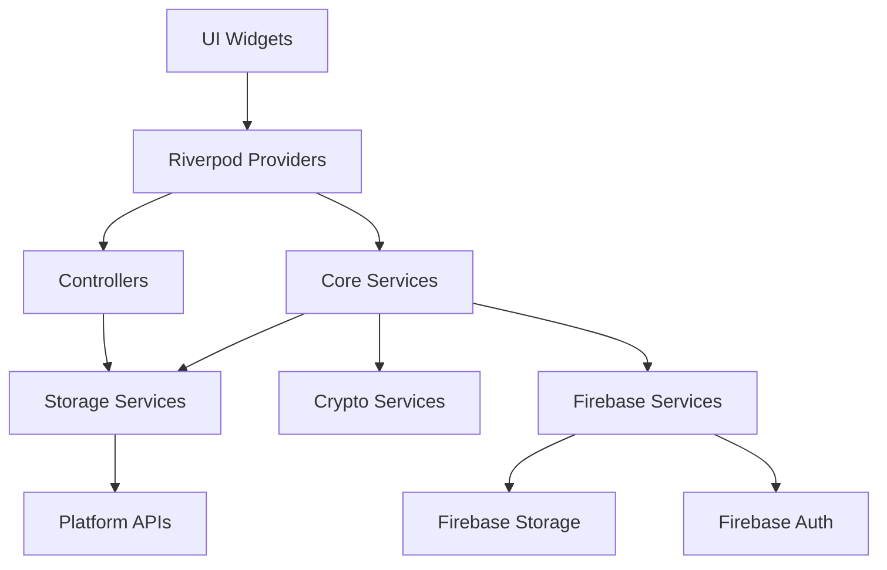

# Architecture Overview

## System Design

StyleSync follows a clean architecture approach with clear separation between layers and strong emphasis on testability, security, and maintainability.

## Architectural Layers

### Presentation Layer (`lib/features/`)
- **Responsibility**: UI components and user interaction
- **Technology**: Flutter widgets, Riverpod state management
- **Key Components**:
  - Onboarding screens (Welcome, Tutorial, API Key Input)
  - Page indicators and navigation

### Domain Layer (`lib/core/`)
- **Responsibility**: Business logic and core services
- **Technology**: Pure Dart classes, abstract interfaces
- **Key Components**:
  - BYOK Manager (API key lifecycle)
  - Crypto Services (encryption, key derivation)
  - Secure Storage Service (platform-native storage)
  - Onboarding Controller (persistence, state management)

### Data Layer
- **Responsibility**: Data persistence and external services
- **Technology**: Firebase, Flutter Secure Storage, SharedPreferences
- **Key Components**:
  - Firebase Auth (user authentication)
  - Firebase Storage (encrypted cloud backup)
  - Platform-native secure storage (Keychain/Keystore)
  - SharedPreferences (onboarding state)

## State Management Architecture

### Riverpod Pattern

StyleSync uses Riverpod for dependency injection and state management:

```
┌─────────────────────────────────────────┐
│          UI Widgets (Consumers)         │
└──────────────────┬──────────────────────┘
                   │ watch/read
                   │
┌──────────────────▼──────────────────────┐
│        Riverpod Providers               │
│  • onboardingStateProvider              │
│  • onboardingControllerProvider         │
│  • byokManagerProvider                  │
│  • encryptionServiceProvider            │
└──────────────────┬──────────────────────┘
                   │ create/manage
                   │
┌──────────────────▼──────────────────────┐
│     Service Implementations             │
│  • OnboardingControllerImpl             │
│  • BYOKManagerImpl                      │
│  • AESGCMEncryptionService              │
│  • KeyDerivationServiceImpl             │
└─────────────────────────────────────────┘
```

### Key Providers

#### State Notifier Providers
- **`onboardingStateProvider`**: Manages onboarding flow state (steps, completion)
- **`apiKeyValidationProvider`**: Tracks API key validation status

#### Simple Providers
- **`onboardingControllerProvider`**: Singleton controller for persistence
- **`byokManagerProvider`**: API key management service
- **`encryptionServiceProvider`**: Encryption operations
- **`keyDerivationServiceProvider`**: Key derivation operations
- **`secureStorageServiceProvider`**: Secure storage abstraction

#### Future Providers
- **`isOnboardingCompleteProvider`**: Async onboarding status check

## Dependency Flow



## Core Components

### BYOK Manager
- **Purpose**: Orchestrates API key lifecycle
- **Dependencies**: SecureStorageService, APIKeyValidator, CloudBackupService
- **Key Operations**:
  - Store/retrieve/delete API keys
  - Validate API key format and functionality
  - Manage cloud backup lifecycle

### Crypto Services

#### Encryption Service
- **Algorithm**: AES-256-GCM
- **Features**: Authenticated encryption, nonce management
- **Operations**: Encrypt, decrypt with integrity verification

#### Key Derivation Service
- **Algorithms**:
  - Argon2id (mobile platforms): Memory-hard, GPU-resistant
  - PBKDF2 (web/fallback): 600,000 iterations, SHA-512
- **Operations**: Derive encryption keys from passphrases

### Secure Storage Service
- **Platform Abstraction**: Unified interface across platforms
- **Backend Selection**:
  - Android: StrongBox > Hardware TEE > Software
  - iOS: Keychain with accessibility controls
- **Operations**: Write, read, delete, deleteAll

### Onboarding Controller
- **Purpose**: Manages onboarding persistence and state
- **Storage**: SharedPreferences for completion flag
- **Operations**: Mark complete, reset, check status

## Security Architecture

### Defense in Depth

1. **Storage Layer Security**
   - Platform-native secure storage (Keychain/Keystore)
   - Hardware-backed encryption when available
   - Encrypted SharedPreferences for sensitive flags

2. **Cryptographic Security**
   - Industry-standard algorithms (AES-GCM, Argon2id)
   - Unique salts and nonces for each operation
   - Memory-hard KDF resistant to brute force

3. **Cloud Backup Security**
   - Client-side encryption before upload
   - User-controlled passphrase (never stored)
   - Firebase security rules prevent unauthorized access
   - Atomic operations with rollback protection

4. **Application Security**
   - No logging of sensitive data (API keys, passphrases)
   - Memory protection (clear after use)
   - Rate limiting on validation operations
   - Timeout protection against hanging requests

## Testing Architecture

### Test Pyramid

```
         ┌──────────────────┐
         │   UI Tests       │  (Limited)
         ├──────────────────┤
         │ Integration Tests│  (Selected scenarios)
         ├──────────────────┤
         │  Property Tests  │  (Complex logic)
         ├──────────────────┤
         │   Unit Tests     │  (Majority)
         └──────────────────┘
```

### Testing Layers

#### Unit Tests (`test/*_test.dart`)
- **Coverage**: Individual service methods
- **Tools**: flutter_test, mockito
- **Focus**: Correct behavior, error handling, edge cases

#### Property-Based Tests (`test/*_property_test.dart`)
- **Coverage**: State transitions, cryptography, validation
- **Tools**: glados
- **Focus**: Invariants, idempotency, consistency

#### Widget Tests
- **Coverage**: UI components and user interactions
- **Tools**: flutter_test, ProviderScope for testing
- **Focus**: User workflows, navigation, validation feedback

## Platform Abstraction

### Cross-Platform Strategy

```
┌─────────────────────────────────────────┐
│      Platform-Agnostic Code             │
│  (Interfaces, Business Logic)           │
└──────────────────┬──────────────────────┘
                   │
┌──────────────────▼──────────────────────┐
│      Platform Detection Layer           │
│  (Platform package, kIsWeb)             │
└──────────────────┬──────────────────────┘
                   │
    ┌──────────────┼──────────────┐
    │              │              │
┌───▼───┐    ┌────▼────┐    ┌───▼───┐
│Android│    │   iOS   │    │  Web  │
└───────┘    └─────────┘    └───────┘
```

### Platform-Specific Implementations

- **Secure Storage**:
  - Android: `AES_GCM_NoPadding` with Keystore
  - iOS: Keychain with `unlocked_this_device` accessibility
  
- **Key Derivation**:
  - Mobile (Android/iOS/macOS): Argon2id
  - Web/Linux: PBKDF2 fallback

- **Firebase Integration**:
  - Consistent across platforms
  - Platform-specific configuration files

## Data Flow Patterns

### API Key Storage Flow
```
User Input → Validation → Encryption → Secure Storage → Cloud Backup (optional)
```

### Cloud Backup Flow
```
API Key Config → Derive Key (Passphrase) → Encrypt → Upload to Firebase Storage
```

### Restore Flow
```
Download Backup → Derive Key (Passphrase) → Decrypt → Validate → Store Locally
```

### Passphrase Rotation Flow
```
Download Backup → Decrypt (Old Pass) → Re-encrypt (New Pass) → Atomic Upload
```

## Error Handling Strategy

### Result Type Pattern
Services return `Result<T>` types for explicit error handling:
- `Success<T>`: Operation succeeded with value
- `Failure<E>`: Operation failed with typed error

### Error Categories
1. **Validation Errors**: Invalid input, format errors
2. **Storage Errors**: Platform storage failures
3. **Network Errors**: Firebase connectivity issues
4. **Cryptographic Errors**: Encryption/decryption failures
5. **Business Logic Errors**: State violations, precondition failures

## Performance Considerations

### Optimization Strategies
- **Lazy Initialization**: Services created on-demand via providers
- **Compute Isolation**: Heavy crypto operations on isolates
- **Caching**: Provider caching for expensive operations
- **Batch Operations**: Where applicable, batch storage operations

### Gradle Optimization (Android)
- Parallel builds enabled
- Build caching enabled
- JVM heap size tuned to 4GB

## Related Documentation

- [BYOK Manager](../core-services/byok-manager.md) - API key management details
- [Crypto Services](../core-services/crypto-services.md) - Encryption and KDF
- [Secure Storage](../core-services/secure-storage-service.md) - Platform storage
- [Testing Strategy](../testing/strategy.md) - Testing approach and tools
- [Security Overview](../security/overview.md) - Security implementation
